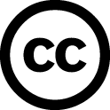

# Zie Scherp Scherper

Een handboek om te leren programmeren in C#, van nul. Geschreven door Tim Dams voor de opleidingen professionele bachelor Toegepaste Informatica en Elektronica-ICT van de AP Hogeschool, en ondertussen ook gebruikt door tal van andere hogescholen en middelbare scholen.

Deze repo bevat de broncode (Quarto) van het boek. Wil je gewoon lezen, dan moet je hier niet zijn.

## Het boek lezen

### 👉 [www.ziescherp.be](https://www.ziescherp.be)

Dat is de online versie, en meteen ook de meest recente. Daar vind je naast het handboek zelf ook:

* [Oefeningen](https://www.ziescherp.be/oefeningen/overzicht.html): practica per hoofdstuk en vaardigheidsproeven
* [Slides](https://www.ziescherp.be/slides/overzicht.html) voor in de les
* [Het boek als pdf](https://www.ziescherp.be/Zie-Scherp-Scherper.pdf) om af te drukken of offline te lezen

## En het papieren boek dan?

Er bestaat ook een gedrukte versie: [timdams.com/boeken/ziescherp](https://timdams.com/boeken/ziescherp/).

Let wel: dat is een **oudere editie**. De online versie hierboven is grondig herwerkt (nieuwe inhoud met meer nadruk op onze nieuwe AI-wereld, nieuwe afbeeldingen, bijgewerkte screenshots) en is altijd de actuele. Van editie 4 is er voorlopig geen druk: wil je die op papier, dan neem je de [pdf](https://www.ziescherp.be/Zie-Scherp-Scherper.pdf).

## Licentie

  

Alle tekst, afbeeldingen en oefeningen staan onder **[Creative Commons Naamsvermelding-NietCommercieel 4.0 Internationaal (CC BY-NC 4.0)](https://creativecommons.org/licenses/by-nc/4.0/deed.nl)**.

**Je mag:**

* **Delen**: het materiaal kopiëren en verspreiden in eender welk medium of formaat
* **Bewerken**: het materiaal remixen, veranderen en erop voortbouwen

**Op voorwaarde dat:**

* **Naamsvermelding**: je vermeldt de auteur (Tim Dams), linkt naar de licentie, en geeft aan of je iets gewijzigd hebt. Doe dat op een manier die niet suggereert dat ik jou of jouw gebruik goedkeur.
* **Niet-commercieel**: je gebruikt het materiaal niet voor commerciële doeleinden. Lesgeven met dit boek in een school of hogeschool kan dus perfect; het verkopen, of het verwerken in een betalende opleiding of dienst, niet. Twijfel je? [Vraag het me gewoon.](https://timdams.com)
* **Geen aanvullende beperkingen**: je legt geen juridische of technische beperkingen op die anderen verhinderen te doen wat de licentie toelaat.

Dit is een leesbare samenvatting, geen vervanging van de [volledige licentietekst](https://creativecommons.org/licenses/by-nc/4.0/legalcode.nl).

## Fouten gevonden?

Alle feedback is welkom. Open een [issue](https://github.com/timdams/ziescherpscherper/issues) of contacteer me. Normaal gezien zijn alle tekst en afbeeldingen de mijne, tenzij anders vermeld. Ontdek je toch iets dat niet correct geattribueerd is, laat het zeker weten.

## Zelf builden

Vier afzonderlijke Quarto-projecten die samen in `build/` terechtkomen:

```bash
quarto render .              # het handboek
quarto render oefeningen/
quarto render slides/
quarto render coronafiles/
```

Bij elke push naar `main` doet [GitHub Actions](.github/workflows/publish.yml) hetzelfde en publiceert het resultaat op GitHub Pages.
