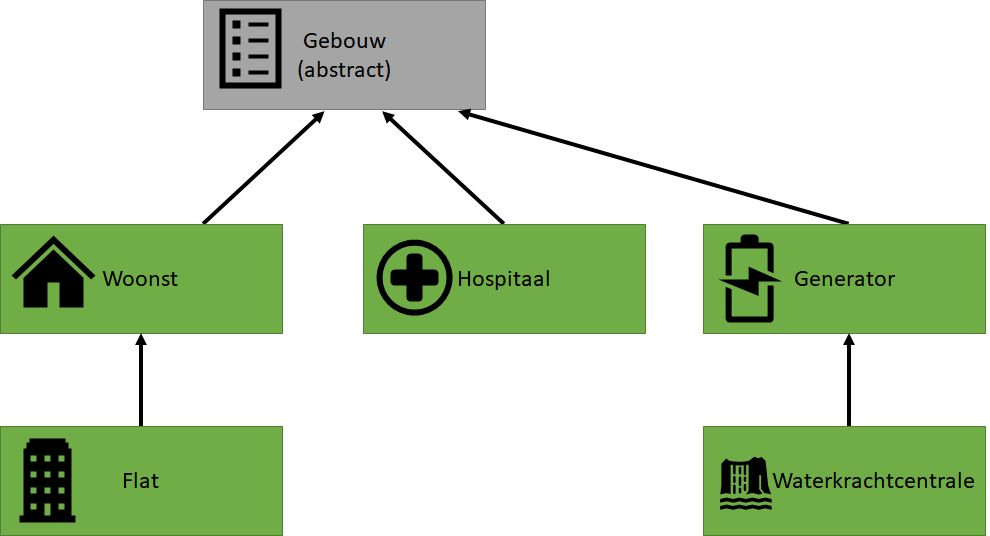

# Opdracht

.jpg)

::: {.callout-important}
## Leerdoelen
Na deze missie kan je:

- Een abstracte klasse ontwerpen als blauwdruk voor verwante klassen
- Abstracte methodes definiëren en implementeren in afgeleide klassen
- `ToString()` overriden in een overerving-hiërarchie
- Polymorfisme toepassen via een `List<Gebouw>`
:::

> *"De enclave die je moet uitbouwen zal bestaan uit essentiële gebouwen: woningen, hospitalen, energiecentrales. We willen alle gebouwen volgens hetzelfde concept uitwerken, zodat ons bouwsysteem modulair en uitbreidbaar is. Eén blauwdruk, meerdere varianten."*

Dat "ene concept" is in C# een **abstracte klasse**: een klasse die de gemeenschappelijke structuur vastlegt, maar de details overlaat aan de concrete gebouwen.

---

## Stap 1 — Abstracte klasse Gebouw

Maak een **abstracte** klasse `Gebouw` met:

* Drie autoproperties: `X` (`int`), `Y` (`int`) en `Naam` (`string`).
* Een **abstracte** methode `PrintGebouw` — geeft niets terug, geen parameters.
* Een override van `ToString` die het volgende formaat teruggeeft (voorbeeld voor een gebouw met naam "Hospitaal" op locatie 3,4):
  ```
  Hospitaal (locatie: 3, 4)
  ```
* **Geen** default constructor. Enkel een overloaded constructor die `Naam`, `X` en `Y` als parameters aanvaardt.

::: {.callout-tip collapse="true"}
## Checkpoint
Probeer `new Gebouw("Test", 1, 1)` — dit zou een compilerfout moeten geven, want je kan geen instantie maken van een abstracte klasse. Precies de bedoeling: `Gebouw` is een blauwdruk, geen gebouw zelf.
:::

---

## Stap 2 — Concrete gebouwen

Maak de klassen volgens dit schema:



Iedere groene klasse heeft:

* Een **overloaded constructor** die `X`, `Y` en `Naam` aanvaardt (en doorstuurt naar de parent-constructor).
* Een **override** van `ToString` die extra informatie over het gebouw toont (verzin zelf wat passend is per type, bv. aantal bedden voor een Hospitaal, capaciteit voor een Generator). De `ToString` van de parent-klasse(n) moet nog steeds uitgevoerd worden.
* Een implementatie van `PrintGebouw`: deze methode plaatst één karakter op het scherm op positie (`X`, `Y`):

| Klasse | Karakter |
|---|---|
| Woonst | `w` |
| Flat | `W` |
| Hospitaal | `H` |
| Generator | `g` |
| WaterkrachtCentrale | `G` |

::: {.callout-warning collapse="true"}
## Hint — Karakter op positie zetten
```java
Console.SetCursorPosition(X, Y);
Console.Write("H");
```
:::

::: {.callout-warning collapse="true"}
## Hint — Base ToString aanroepen
In je `ToString` override kan je `base.ToString()` gebruiken om het resultaat van de parent-klasse op te halen en daar je extra tekst aan toe te voegen.
:::

---

## Stap 3 — Test je enclave

Plaats deze code in je `Main` en controleer de output:

```java
List<Gebouw> enclave = new List<Gebouw>();
enclave.Add(new Hospitaal("Sint Vincentius", 4, 5));
enclave.Add(new Woonst("Tims shack", 1, 1));
enclave.Add(new Generator("batteryshed 1", 1, 2));

foreach (var gebouw in enclave)
{
    gebouw.PrintGebouw();
}
```

Verwachte output:

```
w
g

   H
```

::: {.callout-tip collapse="true"}
## Checkpoint
Merk op: je `List` is van type `Gebouw`, maar bevat `Hospitaal`, `Woonst` en `Generator` objecten. Dit werkt dankzij polymorfisme — alle concrete klassen *zijn* een `Gebouw`. De juiste `PrintGebouw` wordt automatisch aangeroepen per type.
:::

---

## Extra uitdaging

### Kleur toevoegen

Zorg dat elk gebouwtype in een andere kleur op het scherm verschijnt. Een woonst wordt bv. blauw, een hospitaal rood.

::: {.callout-warning collapse="true"}
## Hint — Console kleuren
```java
Console.ForegroundColor = ConsoleColor.Red;
Console.Write("H");
Console.ResetColor();
```
:::

### Straten

Maak een `Straat`-klasse en voorzie straten tussen je gebouwen. Mail je mooiste enclave naar de docent.

---

## Debriefing

::: {.callout-note}
## Reflectie
1. Waarom is `Gebouw` abstract en niet gewoon een normale klasse? Wat zou er mis gaan als je `new Gebouw("X", 1, 1)` zou kunnen doen?
2. Ieder gebouwtype heeft een eigen `PrintGebouw`, maar je kan ze allemaal in dezelfde `List<Gebouw>` steken. Waarom is dat krachtig?
3. Stel je wil een nieuw gebouwtype toevoegen (bv. een `School`). Hoeveel bestaande code moet je aanpassen?
:::

> *"De gebouwen staan er. Maar losse gebouwen maken nog geen gemeenschap. In de volgende missie gaan we ze organiseren tot echte, functionerende enclaves — met regels over welke gebouwen erin mogen en hoe ze samenwerken."*
