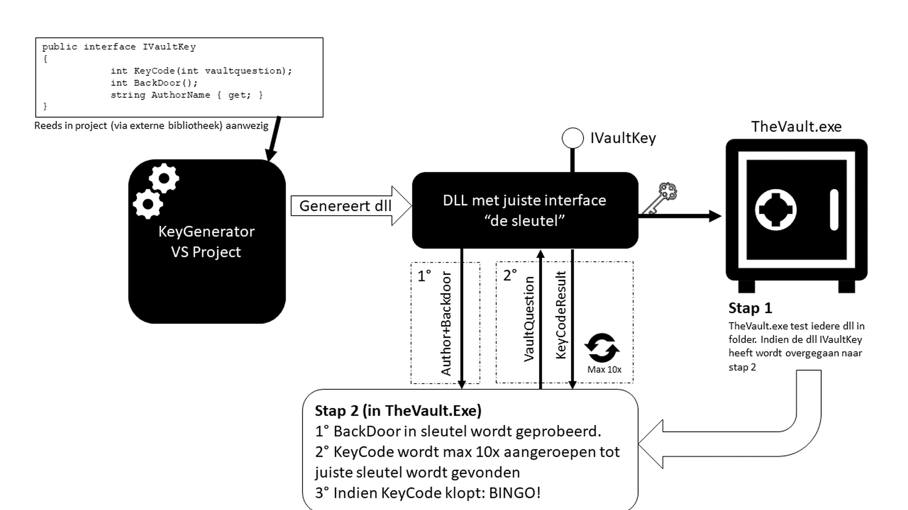

# Opdracht

.jpg)

::: {.callout-important}
## Leerdoelen
Na deze missie kan je:

- Werken met interfaces en begrijpen hoe ze verschillen van abstracte klassen
- Een DLL (class library) aanmaken en gebruiken in een C#-project
- Code schrijven die externe componenten dynamisch inlaadt en aanspreekt via een interface
:::

> *"De kluis is gevonden. De bestanden zijn versleuteld. Onze ingenieurs zijn al begonnen met de analyse, maar ze hebben jouw hulp nodig om het laatste stuk te kraken."*

---

## Stap 1 — De bestanden

Download het bestand: [FOUNDINVAULT.zip](../assets/FOUNDINVAULT.zip)

In de zip vind je 2 andere zip-bestanden. Plaats deze elk in een **aparte map**.

---

## Stap 2 — Analyse

Onze ingenieurs hebben al het nodige voorwerk gedaan. [Bekijk deze videoclip](https://ap.cloud.panopto.eu/Panopto/Pages/Viewer.aspx?id=38abbe8b-316c-4da9-9e57-abab015d6115) waarin ze uitleggen wat ze ontdekt hebben over de structuur van de bestanden.

::: {.callout-tip collapse="true"}
## Checkpoint
Na het bekijken van de video zou je moeten begrijpen:

- Welke bestanden in de zip zitten en wat hun rol is
- Hoe de interface als "contract" werkt tussen de verschillende onderdelen
- Wat je zelf moet bouwen (de key-DLL)
:::

---

## Stap 3 — Kraken

Kan jij het onderzoek afwerken en ontdekken wat er in de kluis van de **Habitat Permanens** te vinden is?

::: {.callout-warning collapse="true"}
## Hint — Aanpak
1. Bestudeer de interface die in de bestanden gedefinieerd is
2. Maak een nieuwe **Class Library** in Visual Studio
3. Implementeer de interface in je eigen klasse
4. Compileer je DLL en plaats deze in de juiste map
5. Voer `TheVault.exe` uit en kijk of je key werkt
:::

::: {.callout-note collapse="true"}
## Hint van de Task Force
Heb je het raadsel uit missie 3 gevonden? Het kan je hier flink helpen.
:::

---

## Stap 4 — Samenwerken

Als alles goed gaat, kan je **elkaars key-DLL's** in de folder plaatsen. `TheVault.exe` zal **alle** DLL's testen die het tegenkomt. Werk samen met je medestudenten om de kluis volledig te kraken.

---

## Debriefing

::: {.callout-note}
## Reflectie
1. Waarom zijn **interfaces** hier het juiste mechanisme? Wat als je in plaats daarvan een abstracte klasse had gebruikt — zou dat even flexibel zijn?
2. Wat is het voordeel van een systeem dat DLL's dynamisch kan laden? Kan je voorbeelden uit de echte wereld bedenken?
3. Hoe verschilt een interface van een abstracte klasse? Wanneer kies je voor het ene, wanneer voor het andere?
:::

> *"Je hebt het gedaan, agent. De kluis is gekraakt. De data is veilig. Wat erin stond... dat is geclassificeerd. Maar weet dit: jouw werk heeft het verschil gemaakt. Bedankt voor je dienst bij de Corona Task Force."*
