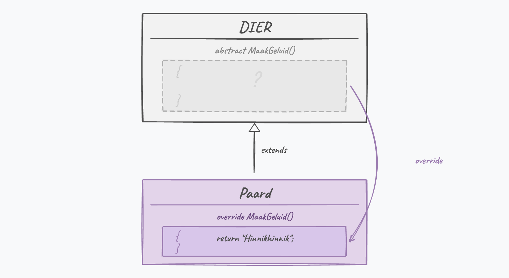

## Abstracte klassen

Aan de start van hoofdstuk 9 gaf ik volgende twee definities:

* **Een klasse** is als een **blauwdruk** dat het gedrag en toestand beschrijft van alle objecten van deze klasse.
* Een individueel **object** is een **instantie** van een klasse en heeft een eigen *toestand*, *gedrag* en *identiteit*.

Niemand die zich hier vragen bij stelde? Als ik in het echte leven zeg: "Geef mij eens de blauwdruk van een object van het type meubel." Wat voor soort meubel zie je voor je bij het lezen van deze zin? Een tafel? Een kast? Een zetel? Een bed? 

En wat zie je voor je als ik vraag om een "geometrische figuur" in te beelden. Een cirkel? Een rechthoek? Een kubus? Een buckyball? Kortom, er zijn in het leven ook soms eerder abstracte dingen die niet op zich in objecten kunnen gegoten worden zonder meer informatie. 

Toch is het concept "geometrische figuur" een belangrijk concept: we weten dat alle geometrische figuren een gemeenschappelijke definitie hebben, namelijk - met dank aan Encyclo.nl- dat het *twee- of meerdimensionale grafische elementen zijn waarvan de vorm wiskundig te berekenen valt.* En dus is er ook een bestaansreden voor een klasse ``GeometrischeFiguur``.**Objecten van deze abstracte klasse maken daarentegen lijkt ons nutteloos.**

Het is dit concept, **abstracte klasse**, dat ik in dit hoofdstuk uit de doeken doe. Het laat ons toe klassen te definiëren die niet kunnen geïnstantieerd worden, maar die wel dienst kunnen doen als parentklasse voor andere klassen.


### Abstracte klassen in C\#

Laten we voorgaande eens praktisch binnen C# bekijken. Soms maken we een parent-klasse waarvan geen instanties kunnen gemaakt worden: denk aan de parent-klasse ``Dier``. Voorbeelden van subklassen van Dier zijn ``Paard`` en ``Wolf``. Van ``Paard`` en ``Wolf`` is het logisch dat je instanties kan maken (echte paardjes en wolfjes) maar van 'een dier'? Hoe zou dat er uit zien? Maar toch willen we bepaalde delen gemeenschappelijk maken (alle dieren hebben bijvoorbeeld zuurstof nodig).

Met behulp van het keyword **``abstract``** kunnen we aangeven dat een klasse abstract is: **je kan overerven van deze klasse, maar je kan er geen instanties van aanmaken.**

We plaatsen ``abstract`` voor de klasse definitie om dit aan te duiden.

Een voorbeeld:
```java
internal abstract class Dier
{
    public string Naam {get;set;}
}
```

We kunnen nu geen objecten meer van het type ``Dier`` aanmaken. Volgende code zal een foutboodschap geven: ``Dier hetDier = new Dier();``


Maar, we mogen dus wel klassen overerven van deze klasse en instanties van deze nieuwe klasse aanmaken:
```java
internal class Paard: Dier
{
    //...
}

internal class Wolf: Dier
{
    //...
}
```
En dan zal dit wel werken: ``Wolf wolfje = new Wolf();``

En als we polymorfisme gebruiken (*soon!*) dan mag dit ook: ``Dier paardje = new Paard();`` 

:::{.callout-tip}
In het begin lijkt ``abstract`` een beperkende factor: je kan minder dan ervoor. Maar het heeft dus één heel duidelijke functie: je kan een parent-klasse maken waarin de gedeelde functionaliteit van je child-klassen in zit, zonder dat je deze parent-klasse op zich kunt gebruiken. 
:::

:::{.callout-tip}
Mooi om te zien hoe ``abstract`` en ``sealed`` elkaars tegenpolen zijn: bij een **``abstract``** klasse *moet* je overerven (je kan er zelf geen objecten van maken), terwijl je bij een **``sealed``** klasse net *niet* mag overerven.
:::

:::{.callout-tip}
**Abstracte klasse of interface?** Verderop (hoofdstuk 16) leer je *interfaces* kennen, een soort lichtere variant van een abstracte klasse: ze bevatten enkel afspraken (welke methoden/properties er moeten zijn) maar geen gedeelde code of state. Heb je gedeelde code of instantievariabelen nodig, dan is een abstracte klasse de juiste keuze; gaat het puur om "deze klassen kunnen X", dan past een interface beter. Lig er nu nog niet van wakker, maar weet alvast dat het bestaat.
:::


### Abstracte methoden

Het is logisch dat we mogelijk ook bepaalde zaken in de abstracte klasse als ``abstract`` kunnen aanduiden. Beeld je in dat je een methode ``MaakGeluid`` hebt in je klasse ``Dier``. Wat voor een geluid maakt 'een dier'? We kunnen dus ook geen implementatie (code) geven in de abstracte parent klasse, maar willen wel zeker ervoor zorgen dat alle child-klassen van ``Dier`` geluid kunnen maken, op wat voor manier dan ook.

Via abstracte methoden geven we dit aan: we hoeven enkel de methode signatuur te geven, met ervoor ``abstract``:

```java
internal abstract class Dier
{
    public abstract string MaakGeluid();
}
```

Door het keyword ``abstract`` **zijn child-klassen verplicht deze abstracte methoden te overriden!** 

:::{.callout-tip}
Merk op dat er geen codeblock-accolades na de signatuur van abstracte methodes komt.
:::


De Paard-klasse wordt dan[^wolf]:

```java
internal class Paard: Dier
{
  public bool HeeftTetanus {get;set;}

  public override string MaakGeluid()
  { 
      return "Hinnikhinnik";
  }
}
```

[^wolf]: En idem voor de ``Wolf``-klasse uiteraard, maar hopelijk met een dreigender geluid.

Dit is dus niet hetzelfde als ``virtual`` waar een ``override`` MAG. Bij ``abstract`` MOET je ``override``'n. We komen dan ook bij de essentie van het abstracte klasse concept: ze laten ons toe om klassen te maken waar nog *gaten* in zitten qua implementatie. We maken als het ware een soort klasse-sjabloon, die de child-klassen nog verder moeten inkleuren.

<!--{width=65%}-->


:::{.callout-important}
#### Abstracte methoden enkel in abstracte klassen
Van zodra een klasse een abstracte methode of property heeft dan ben je verplicht om de klasse ook abstract te maken. 

Het zou heel vreemd zijn om objecten in het leven te kunnen roepen die letterlijk stukken ontbrekende code hebben...
:::

::: {.callout-tip title="Zie verder"}
**C++** kent het keyword ``abstract`` niet. Toch bestaat exact hetzelfde idee daar onder een andere naam: een "pure virtual" methode. Je zet ``= 0`` achter de signatuur, en zo'n klasse kan je niet instantiëren:

```cpp
class Dier {
public:
    virtual std::string MaakGeluid() = 0; // pure virtual: geen body
};

class Paard : public Dier {
public:
    std::string MaakGeluid() override { return "Hinnikhinnik"; }
};
```

Zelfde concept (een klasse met een gat dat de child moet invullen), heel andere notatie. **Python** doet dit dan weer met de ``ABC``-module en ``@abstractmethod``, dichter bij de C#-aanpak.
:::


### Abstracte properties

Properties kunnen ``virtual`` gemaakt worden, en dus ook ``abstract``. Net zoals bij abstracte methoden, kunnen we met abstracte properties de overgeërfde klassen verplichten een eigen implementatie van de property te schrijven. 

Volgend voorbeeld toont hoe dit werkt:

```java
internal abstract class Dier
{
    abstract public int MaxLeeftijd { get;}
}

internal class Olifant : Dier
{
    public override int MaxLeeftijd 
    {
        get 
        { 
            return 100; 
        }
    }
}
```

Let op: een abstracte ``{ get; }`` is **niet** hetzelfde als een gewone auto-property. Bij een abstracte property staat er bewust *geen* implementatie (geen body, geen verborgen instantievariabele): de child-klasse moet die zelf voorzien, net zoals bij een abstracte methode.

Wanneer je een abstracte property maakt dien je ogenblikkelijk aan te geven of het om een readonly, writeonly, of property met get én set gaat:

* ``public abstract int Oppervlakte {get;}``
* ``public abstract int GeheimeCode {set;}``
* ``public abstract int GeboorteDatum {get;set;}``

<!-- \newpage -->


### Een wereld met OOP: Pong en ``abstract``

Dankzij ``abstract`` kunnen we nu een meer algemene klasse maken in Pong. Beeld je in dat je naast balletjes ook andere zaken op het scherm wilt tonen. Echter, niet alles moet als een gek over het scherm vliegen én is op de koop toe niet noodzakelijk een *child* van de ``Balletje``-klasse. 

We definiëren daarom een klasse die alle zaken zal voorstellen die "op het scherm" moeten getoond worden. Omdat we niet weten **HOE** die zaken getoond worden, zal dit een abstracte klasse worden waarbij we de ``TekenOpScherm``-methode bewust niet implementeren:

```java
internal abstract class SpelObject
{
    public int X { get; set; }
    public int Y { get; set; }
    public abstract void TekenOpScherm();
}
```

We kunnen nu ons klasse ``Balletje`` hier van laten overerven en veranderen volgende zaken:

* We halen de ``X`` en ``Y`` properties uit de klasse (daar de parent deze al heeft gedefiniëerd).
* We veranderen ``TekenOpScherm`` van een ``virtual`` naar een ``override`` versie, daar we nu de abstracte methode van de parent **moeten** implementeren.  Merk op dat dit geen invloed heeft op de child-klassen van ``Balletje``, die zullen nog steeds in staat zijn om de ``Update``-versie van ``Balletje`` te override'n.

```java
internal class Balletje:SpelObject
{
    //...

    public override void TekenOpScherm()
    {
    //... 
```

<!-- \newpage -->


Dankzij deze abstracte klasse hebben we nu een manier om bijvoorbeeld ook een scorebord in het spel te brengen:

```java
internal class ScoreBoard: SpelObject
{
    public ScoreBoard()
    {
        X = 5;
        Y = 5;
    }

    public int ScoreSpeler1 { get; set; }
    public int ScoreSpeler2 { get; set; }
    public override void TekenOpScherm()
    {
        Console.BackgroundColor = ConsoleColor.Yellow;
        Console.ForegroundColor = ConsoleColor.Black;
        Console.SetCursorPosition(X, Y);
        Console.Write($"{ScoreSpeler1} - {ScoreSpeler2}");
        Console.ResetColor();
    }
}
```

In ons hoofdprogramma blijven we leven van de kracht van polymorfisme en gebruiken we een snuifje ``is`` en ``as`` om zeker onze ``Balletje`` ook te update'n wanneer nodig. Onze lijst, hernoemd naar ``spelElementen`` zal  nu ``SpelObject`` objecten bevatten:

```java
List<SpelObject> spelElementen = new List<SpelObject>();

//Balletjes toevoegen...

//En nu het scoreboard
var score = new ScoreBoard();
spelElementen.Add(score);

while (true)
{
    foreach(var spelObject in spelElementen)
    {
        //update enkel de balletjes
        if(spelObject is Balletje)
        {
            (spelObject as Balletje).Update(); 
        } 

        //spe   
    }
```

Indien nu een speler scoort dan kunnen we schrijven:

```java
score.ScoreSpeler2++;
``` 