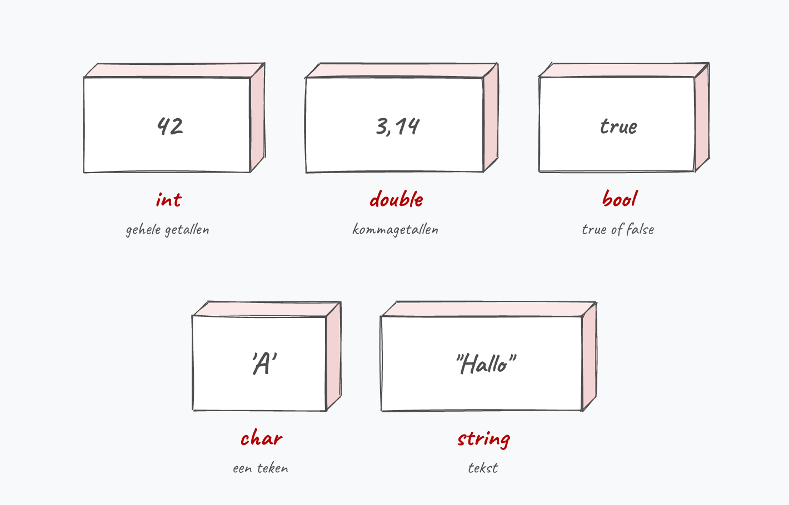
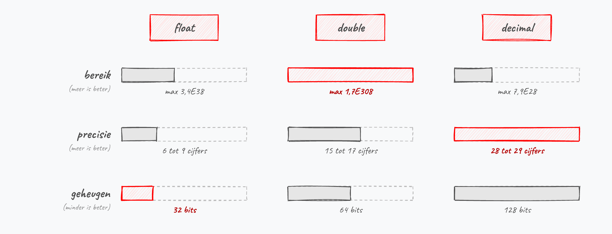

## Datatypes

Een essentieel onderdeel van C# is kennis van datatypes. Binnen C# zijn een aantal types gedefinieerd die je kan gebruiken om data in op te slaan. Wanneer je data wenst te bewaren in je applicatie dan zal je je moeten afvragen wat voor soort data het is. Gaat het om een geheel getal, een kommagetal, een stuk tekst of misschien een binaire reeks? Ieder datatype in C# kan één welbepaald soort data bewaren en dit zal telkens een bepaalde hoeveelheid computergeheugen vereisen. 

:::{.callout-tip}
Datatypes zijn een belangrijk concept in C# omdat deze taal een zogenaamde **"strongly typed language"** is (in tegenstelling tot bijvoorbeeld JavaScript). Wanneer je in C# data wenst te bewaren (in een variabele) zal je van bij de start moeten aangeven wat voor data dit zal zijn. Vanaf dan zal de data op die geheugenplek op dezelfde manier verwerkt worden en niet zo maar van 'vorm' kunnen veranderen zonder extra input van de programmeur. 

Bij JavaScript kan dit bijvoorbeeld wel, wat soms een fijn werken is, maar ook vaak vloeken: je bent namelijk niet gegarandeerd dat je variabele wel het juiste type zal bevatten wanneer je het gaat gebruiken.
:::

### Zie verder: dezelfde concepten in andere talen {#zie-verder-uitleg}

Vanaf hier vind je doorheen het hele boek geregeld een callout met de titel **"Zie verder"**. Daarin nemen we het concept dat je net leerde en tonen we hoe het werkt in een andere programmeertaal: Python, JavaScript, Java, C, C++ of TypeScript. Soms lijkt het bedrieglijk veel op C#, soms pakt die andere taal het radicaal anders aan. Telkens kiezen we de taal die het meest leerrijk is voor dat concept.

Je hoeft die andere talen helemaal niet te kennen. Het gaat niet om de details, maar om het *herkennen* van het patroon: "ah, dit is gewoon een loop", "dit is een klasse", "dit is een interface", ook al ziet de syntax er anders uit.

:::{.callout-important}
**Waarom besteden we hier moeite aan?** De job van een softwareontwikkelaar verschuift. Steeds vaker schrijf je code niet meer volledig zelf, maar laat je een AI een eerste versie genereren, om die daarna te *lezen, begrijpen, beoordelen en bijsturen*. En die AI spuwt even vlot Python, JavaScript of C++ uit als C#.

Wie de grote concepten herkent over de taalgrenzen heen, kan ook code lezen in een taal die hij nooit formeel leerde. Dat is precies de vaardigheid die belangrijker wordt: niet zozeer foutloos code *typen*, maar code *kunnen lezen en inschatten*. De "Zie verder"-callouts trainen net die spier.
:::

Er zijn verscheine basistypes in C# gedeclareerd, zogenaamde **primitieve datatypes**:. 

In dit boek leren we werken met datatypes voor:

* Gehele getallen: `sbyte, byte, short, ushort, int, uint, long, ulong`
* Kommagetallen: `double, float, decimal`
* Tekst: `char, string`
* Booleans: `bool`
* Enums (een speciaal soort datatype dat een beetje een combinatie van meerdere datatypes is én dat je zelf deels kan definiëren.)

Onderstaande figuur zet de types die je het vaakst zal gebruiken alvast naast elkaar.



Ieder datatype wordt gedefinieerd door minstens volgende eigenschappen:

* **Soort data** dat in de variabele van dit type kan bewaard worden (tekst, geheel getal, enz.)
* **Geheugengrootte**: de hoeveelheid bits dat 1 element van dit datatype inneemt in het geheugen. Dit kan belangrijk zijn wanneer je met véél data gaat werken en je niet wilt dat de gebruiker drie miljoen gigabyte RAM nodig heeft.
* **Schrijfwijze van de literals**: hoe weet C# of 2 een komma getal (``2.0``) of een geheel getal (``2``) is? Hiervoor gebruiken we specifieke schrijfwijzen van deze waarden (**literals**) wat we verderop uiteraard uitgebreid zullen bespreken.

:::{.callout-tip}
Het datatype ``string`` heb je al gezien in het vorig hoofdstuk. Je hebt toen een variabele aangemaakt van het type string door de zin ``string result;``. 

Verderop plaatsen we dan iets waar de gebruiker iets kan intypen in die variabele: 

```java
result = Console.ReadLine();
```
:::

### Basistypen voor getallen
Alhoewel een computer digitaal werkt en enkel 0'n en 1'n bewaart zou dat voor ons niet erg handig werken. C# heeft daarom een hoop datatypes gedefinieerd om te werken met getallen zoals wij ze kennen, gehele en kommagetallen. Intern zullen deze getallen nog steeds binair bewaard worden, maar dat is tijdens het programmeren zelden een probleem.

De basistypen van C\# om getallen in op te slaan zijn:

* Voor gehele getallen: `sbyte, byte, short,  int , long` en `char`.
* Voor natuurlijke getallen (enkel positief): `ushort, uint` en `ulong`.
* Voor kommagetallen: `double, float` en  `decimal`.

Deze datatypes hebben allemaal een verschillend bereik, wat een rechtstreekse invloed heeft op de hoeveelheid geheugen die ze innemen.

:::{.callout-important}
Ieder type hierboven heeft een bepaald bereik en hoeveelheid geheugen nodig. Je zal dus steeds moeten afwegen wat je wenst. Op een high-end pc met vele gigabytes aan werkgeheugen (RAM) is geheugen zelden een probleem waar je rekening mee moet houden.

Of toch: wat met real-time first person shooters die miljoenen berekeningen per seconde moeten uitvoeren? Daar zal iedere bit en byte tellen. Op andere apparaten (smartphone, arduino, smart fridges, enz.) is iedere byte geheugen nog kostbaarder. **Kortom: kies steeds bewust het datatype dat het beste 'past' voor je probleem qua bereik, precisie en geheugengebruik.**
:::

<!-- \newpage -->

#### Gehele getallen
Voor de gehele getallen zijn er volgende datatypes:

| **Type** | **Geheugen** | **Bereik (waardenverzameling)** | 
| :--- | :--- | :---------------------------- | 
| `sbyte` | 8 bits | -128 tot 127 | 
| `byte` | 8 bits | 0 tot 255 | 
| `short` | 16 bits | -32 768 tot 32 767 | 
| `ushort` | 16 bits | 0 tot 65535 |
| `int` | 32 bits | -2 147 483 648 tot 2 147 483 647 |
| `uint` | 32 bits | 0 tot 4 294 967 295 | 
| `long` | 64 bits | -9 223 372 036 854 775 808 tot 9 223 372 036 854 775 807 | 
| `ulong` | 64 bits | 0 tot 18 446 744 073 709 551 615 | 
| `char` | 16 bits | 0 tot 65 535 | 

Het bereik van ieder datatype is een rechtstreeks gevolg van het aantal bits waarmee het getal in dit type wordt voorgesteld. De ``short`` bijvoorbeeld wordt voorgesteld door 16 bits. Met 16 bits kan je 2^16^ (= 65 536) verschillende waarden voorstellen. Omdat een ``short`` ook negatieve getallen moet kunnen bevatten, loopt het bereik van -2^15^ (= -32768) tot 2^15^-1 (= 32767). Hoe C# die negatieve getallen precies binair voorstelt (via een techniek genaamd *two's complement*) behandelen we niet in dit handboek.

Enkele opmerkingen bij voorgaande tabel:

* De `s` vooraan `sbyte` staat voor ``signed``: m.a.w. 1 bit wordt gebruikt om het + of - teken te bewaren. 
* De `u` vooraan `ushort`, `uint` en `ulong` staat voor `unsigned`. Het omgekeerde van signed dus. Kwestie van het ingewikkeld te maken. Deze twee datatypes hebben dus geen teken en zijn **altijd positief**.
* `char` bewaart karakters. We zullen verderop dit datatype uitspitten en ontdekken dat karakters (alle tekens op het toetsenbord, inclusief getallen, leesteken, enz.) als gehele, binaire getallen worden bewaard. Daarom staat `char` in deze lijst.
* Het grootste getal bij `long` is 2^63^-1 (*negen triljoen tweehonderddrieëntwintig biljard driehonderd tweeënzeventig biljoen zesendertig miljard achthonderdvierenvijftig miljoen zevenhonderdvijfenzeventigduizend achthonderd en zeven*). Dit zijn maar 63 bits?! Inderaad, de laatste bit wordt wederom gebruikt om het teken te bewaren.

De vier belangrijkste types staan hieronder op schaal naast elkaar. Merk op dat een verdubbeling van het aantal bits het bereik niet verdubbelt maar kwadrateert: van 256 waarden bij een `byte` naar 65 536 waarden bij een `short`.


<!-- \newpage -->

>"Wow. Moet je al die datatypes uit het hoofd kennen? Ik was al blij dat ik tekst op het scherm kon tonen."
>
>Uiteraard kan het geen kwaad dat je de belangrijkste datatypes onthoudt, anderzijds zul je zelf merken dat door gewoon veel te programmeren je vanzelf wel zult ontdekken welke datatypes je waar kunt gebruiken. Laat je dus niet afschrikken door de ellenlange tabellen met datatypes in dit hoofdstuk, we gaan er maar een handvol effectief van gebruiken.

#### Kommagetallen
Voor de kommagetallen zijn er maar 3 mogelijkheden. Ieder datatype heeft een 'voordeel' tegenover de 2 andere, dit voordeel staat vet in de tabel:

| **Type** | **Geheugen** | **Bereik** | **Precisie** |
| :--- | :--- | :--- | :--- |
| `float` | **32 bits** | gemiddeld | ~6-9 digits |
| `double` | 64 bits | **meeste** | ~15-17 digits |
| `decimal` | 128 bits | minste | **28-29 digits** |



Zoals je in de figuur hierboven ziet, moet je bij kommagetallen een afweging maken tussen 3 even belangrijke criteria. Heb je ongelooflijk grote precisie nodig dan ga je voor een ``decimal``. Wil je vooral erg grote of erg kleine getallen kies je voor ``double``. Zoals je merkt zal je dus zelden ``decimal`` nodig hebben, deze zal vooral nuttig zijn in financiële en wetenschappelijke programma's waar met erg exacte cijfers moet gewerkt worden. 

:::{.callout-tip}
Bij twijfel opteren we meestal voor kommagetallen om het **``double``** datatype te gebruiken. Bij gehele getallen kiezen we meestal voor **``int``**.
:::

:::{.callout-tip}
De precisie van een getal is het aantal beduidende cijfers. Enkele voorbeelden:

* ``2.2345`` heeft precisie 5.
* ``2.23`` heeft precisie 3.
* ``0.0032`` heeft precisie 2.

:::

### Boolean datatype

``bool`` (**boolean**) is het eenvoudigste datatype van C#. Het kan maar 2 mogelijke waarden bevatten: ``true`` of ``false``. 0 of 1 met andere woorden. 

We zullen het ``bool`` datatype erg veel nodig hebben wanneer we met beslissingen zullen werken in een later hoofdstuk, specifiek de ``if`` statements die afhankelijk van de waarde van een ``bool`` bepaalde code wel of niet zullen doen uitvoeren.

:::{.callout-warning}
Het gebeurt vaak dat beginnende programmeurs een ``int`` variabele gebruiken terwijl ze toch weten dat de variabele maar 2 mogelijke waarden zal hebben. Om dus geen onnodig geheugen te verbruiken is het aan te raden om in die gevallen steeds met een ``bool`` variabele te werken.
:::

:::{.callout-tip}
Het ``bool`` datatype is uiteraard het kleinst mogelijke datatype. Hoeveel geheugen zal een variabele van dit type innemen denk je? Eén bit zou logisch lijken (true of false, 0 of 1), maar in de praktijk neemt een ``bool`` in C# **1 byte** in. Dat komt omdat een computer geen losse bits adresseert, maar werkt per byte.
:::

<!-- TODO ed.5 (review): integer overflow ontbreekt (int.MaxValue + 1 = int.MinValue). Past goed bij dit datatypes-hoofdstuk. -->
<!-- TODO ed.5 (review): geen woord over var (type inference, sinds C# 3). Studenten zien het overal; hoort in dit deel thuis (zie ook 1b_variabelen.md). -->

### Tekst/String datatype

Ik besteed verderop een heel apart hoofdstuk om te tonen hoe je één enkel karakter of volledige flarden tekst kan bewaren in variabelen. 

Hier alvast een voorsmaakje: 

* Tekst kan bewaard worden in het ``string`` datatype.
* Een enkel karakter wordt bewaard in het ``char`` datatype dat we ook hierboven al even hebben zien passeren.

<!-- \newpage -->

>Wat een gortdroge tekst was me dat nu net? Waarom moeten we al deze datatypes kennen? Wel, we hebben deze nodig om **variabelen** aan te maken. En variabelen zijn het hart van ieder programma. Zonder variabelen ben je aan het programmeren aan een programma dat een soort vergevorderde vorm van dementie heeft en hoegenaamd niets kan onthouden. 

