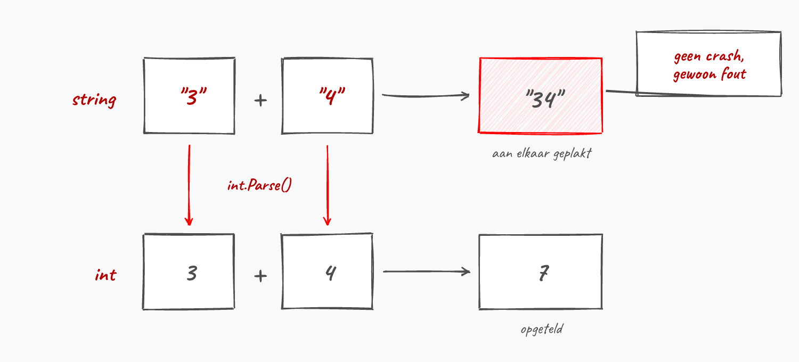
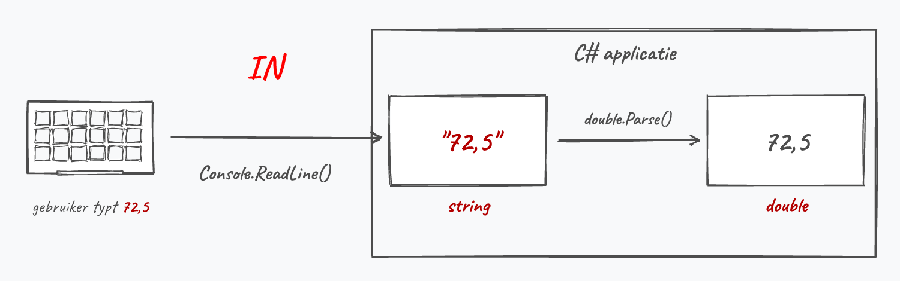

## Invoer van de gebruiker verwerken

Zowat elk programma dat je vanaf nu schrijft begint met iets aan de gebruiker vragen: een getal, een gewicht, een leeftijd. 

We hebben reeds gezien hoe we met ``Console.ReadLine()`` tekst van de gebruiker kunnen inlezen en die vervolgens verwerken, bijvoorbeeld om z'n naam op het scherm te tonen:


### ReadLine geeft altijd een string

**``ReadLine`` geeft ALTIJD een ``string`` terug.** Ook wanneer de gebruiker een getal intikt. Kijk wat er gebeurt als je dat negeert:

```csharp
Console.WriteLine("Geef een getal:");
string a = Console.ReadLine();     // gebruiker typt 3
Console.WriteLine("Geef nog een getal:");
string b = Console.ReadLine();     // gebruiker typt 4
Console.WriteLine(a + b);          // toont 34
```

Het programma crasht niet. Het toont gewoon ``34``. De ``+`` plakt twee strings aan elkaar, precies zoals je in het vorige hoofdstuk zag. C# heeft geen idee dat jij met ``"3"`` en ``"4"`` wilde rekenen.



Dit mag dan ook niet: ``int userInput = Console.ReadLine();``. De compiler weigert een ``string`` in een ``int`` te steken en geeft een *conversion error*.

### Van string naar getal in 3 stappen

Willen we dat de gebruiker een getal invoert, dan lezen we dit nog steeds als ``string`` in en zetten we het daarna om. Dat zijn steeds 3 stappen:

1. Input **uitlezen** met ``Console.ReadLine()``.
2. Input **bewaren** in een ``string`` variabele.
3. De variabele **parsen** met de ``Parse()``-methode (bv. ``int.Parse()`` of ``double.Parse()``) naar het gewenste type.

Stel dat we aan de gebruiker z'n gewicht vragen, dan moeten we dus doen:

```csharp
Console.WriteLine("Geef je gewicht:");
string inputGewicht = Console.ReadLine();
double gewicht = double.Parse(inputGewicht);
```

Voorgaande code kan nog 1 lijntje korter door ``ReadLine`` ogenblikkelijk als invoer aan de Parse-methode te geven:

```csharp
Console.WriteLine("Geef je gewicht:");
double gewicht = double.Parse(Console.ReadLine());
```



:::{.callout-important}
## De regel die je honderden keren zal typen

```csharp
int getal = int.Parse(Console.ReadLine());
```

Dit is het patroon voor alle invoer die geen tekst is. Enkel de Parse-methode verandert mee met het type dat je nodig hebt:

| Gewenst type | Code |
|---|---|
| ``int`` | ``int.Parse(Console.ReadLine())`` |
| ``double`` | ``double.Parse(Console.ReadLine())`` |
| ``bool`` | ``bool.Parse(Console.ReadLine())`` (gebruiker typt ``true`` of ``false``) |
| ``char`` | ``char.Parse(Console.ReadLine())`` (gebruiker typt exact 1 teken) |
| ``string`` | ``Console.ReadLine()`` (geen Parse nodig) |
:::

### Kommagetallen in C\#

Goed opletten nu.

Welk teken de gebruiker moet gebruiken om een kommagetal in te voeren hangt af van de landinstellingen van het besturingssysteem. Staat de computer in het Belgisch/Nederlands dan moet de gebruiker een **komma** typen (``9,81``). Staat de computer in het Engels dan moet dit een **punt** zijn (``9.81``).

Neem volgende code:

```csharp
Console.WriteLine("Geef je gewicht:");
double gewicht = double.Parse(Console.ReadLine());
```

Dit is wat er in ``gewicht`` terechtkomt, afhankelijk van wat de gebruiker typt en van de instellingen van de computer:


:::{.callout-warning}
Het verkeerde scheidingsteken geeft **geen foutmelding**. Op een Belgische computer wordt ``9.81`` gelezen als 981, want de punt geldt daar als scheiding voor duizendtallen. Je programma rekent dus vrolijk verder met een gewicht van 981 kilogram. Krijg je bij kommagetallen vreemde resultaten zonder dat er iets crasht, controleer dan eerst welk teken je hebt getypt.
:::

Maar: **in je C# code schrijf je kommagetal-literals altijd met een punt**. Dit is onafhankelijk van de taalinstellingen van je computer:

```csharp
double zwaartekracht = 9.81;   // in code: altijd een punt
```

### Foutloze input

Voorgaande code veronderstelt dat de gebruiker geen fouten maakt. De conversie mislukt namelijk wanneer de gebruiker bijvoorbeeld ``Ik weeg 10kg`` invoert in plaats van ``10,3``, of gewoon op enter duwt zonder iets te typen. ``Parse`` gooit dan een fout en je programma valt stil.

:::{.callout-note}
## Afspraak voor de komende hoofdstukken

**Je mag er altijd van uitgaan dat de gebruiker foutloze input geeft.** Vraag je een getal, dan typt de gebruiker een getal. Hoe je foute invoer opvangt leer je later.
:::

Toch al even een blik vooruit. Foute invoer opvangen doe je met ``TryParse``. Die methode crasht niet bij foute input, maar laat weten of het parsen gelukt is:

```csharp
Console.WriteLine("Geef je leeftijd:");
if (int.TryParse(Console.ReadLine(), out int leeftijd))
{
    Console.WriteLine($"Volgend jaar word je {leeftijd + 1}.");
}
```

Je ziet hier twee dingen die je nog niet kent: ``if`` komt in het volgende hoofdstuk aan bod, ``out`` pas in het hoofdstuk over methoden. Je hoeft dit dus nog niet zelf te kunnen schrijven. Onthoud enkel dat ``TryParse`` bestaat; de volledige uitleg vind je in de appendix.

### Stagiair Steven

> Steven moet de leeftijd van de gebruiker inlezen. De A.I. gaf hem dit en hij noemt het zelf "robuust":
>
>```csharp
>Console.WriteLine("Geef je leeftijd:");
>int leeftijd = int.Parse(Console.ReadLine());
>Console.WriteLine($"Volgend jaar word je {leeftijd + 1}.");
>```
>
>"Werkt perfect, ik heb het getest met ``25``", zegt hij trots.

Steven heeft het maar half getest. Wat gebeurt er als de gebruiker ``vijfentwintig`` typt, of gewoon op enter duwt zonder iets in te tikken?

:::{.callout-note collapse="true"}
## Antwoord
Dan crasht zijn programma. ``int.Parse`` verwacht tekst die echt een geheel getal voorstelt; krijgt het ``vijfentwintig`` of een lege invoer, dan gooit het een fout en valt het programma stil. "Robuust" is het dus allerminst: het werkt enkel zolang de gebruiker exact doet wat Steven verwacht. Wil je foute invoer netjes opvangen, dan bestaat daar ``int.TryParse`` voor, zoals hierboven getoond. Steven testte enkel de invoer die hij zelf in gedachten had, en de A.I. waarschuwde hem nergens voor de rest.
:::
