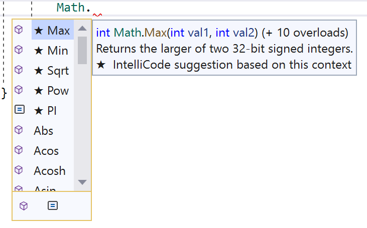

## Berekeningen met System.Math

Een groot deel van je leven als ontwikkelaar zal bestaan uit het bewerken van variabelen in code. Meestal zullen die bewerkingen voorafgaan van berekeningen. De ``System.Math`` bibliotheek zal ons hier bij kunnen helpen. Zoals de naam al doet vermoeden staat deze bibliotheek voor *Mathematics*: wiskunde!

### De Math-bibliotheek

De Math-bibliotheek bevat handige methoden voor een groot aantal typische wiskundige bewerkingen. Zaken die je er bijvoorbeeld in zal terugvinden: 

* Sinus (``Sin``), cosinus (``Cos``), tangens (``Tan``), enz. berekenen aan de van de hoek (in radialen) 
* Vierkantswortel (``Sqrt``) en macht (``Pow``) berekenen.
* Naar boven (``Ceiling``) of onder (``Floor``) afronden. 
* Absolute (``Abs``) waarde berekenen.

Stel dat je de derde macht van een variabele ``getal`` wenst te berekenen. *Zonder* de Math-bibliotheek zou dat er zo uitzien:

```java
double result = getal * getal * getal; //SLECHTE MANIER
```

Dit valt nog mee, maar wat als je 3 tot de zevende macht moest berekenen? Laten we eens kijken hoe ``Math`` ons kan helpen, dankzij de ``Pow``  methode (**Power**, Engels voor macht):

```java
double result = Math.Pow(getal, 3);
```

Deze methode vereist twee parameters:

* De eerste is het grondtal.
* De tweede is de exponent ("tot de hoeveelste macht").

#### Math rekent met kommagetallen

Er zit meteen een addertje onder het gras. Bijna alle rekenmethoden van ``Math`` geven een ``double`` terug, ook al stop je er gehele getallen in. Volgende regel lijkt dus perfect logisch, maar compileert niet:

```java
int resultaat = Math.Pow(2, 10); //compileert niet!
```

Visual Studio zegt hier *Cannot implicitly convert type 'double' to 'int'*. Dat is exact hetzelfde probleem als bij het casten eerder in dit hoofdstuk: ``Math.Pow`` levert ``1024.0`` af, en zo'n kommagetal past niet zomaar in een ``int``. Je lost het dan ook op dezelfde manier op:

```java
double resultaat = Math.Pow(2, 10);          //1024
int resultaatAlsInt = (int)Math.Pow(2, 10);  //1024
```

Ook ``Math.Sqrt(16)`` geeft je een ``double`` terug, ook al is de wortel van 16 perfect rond.

Op die regel bestaan uitzonderingen: ``Abs``, ``Max``, ``Min`` en ``Clamp`` geven je terug wat je erin stopt. Voed je ze met gehele getallen, dan krijg je een ``int``:

```java
int verschil = Math.Abs(-42);          //42, een int
double grootste = Math.Max(3.5, 7.1);  //7.1, een double
```

<!-- \newpage -->

#### De Math bibliotheek ontdekken

Als je in Visual Studio ``Math`` schrijft in je code, gevolgd door een punt (``.``) krijg je alles te zien wat de Math-bibliotheek kan doen:

<!--{width=60%}-->

Een kubusje voor een naam wil zeggen dat het om een **Methode** gaat (zoals ``Console.ReadLine()``). Een vierkantje met twee streepjes in zijn constanten (zoals ``Pi`` en het getal van Euler (``e``)).

Merk op dat je bij ``Math`` nooit ``new`` schrijft: je typt de naam van de bibliotheek, een punt, en de methode die je nodig hebt. Bij ``Random``, dat je verderop in dit hoofdstuk leert kennen, moet dat wél. Het verschil heeft te maken met *static*, en dat komt in hoofdstuk 11 uitgebreid aan bod.

#### Methoden gebruiken

De meeste methoden zijn zeer makkelijk in gebruik en werken bijna allemaal op een soortgelijk manier. Meestal moet je 1 of meerdere parameters tussen de haken meegeven. Wat je daarna met het resultaat doet, kies je zelf: je vangt het op in een nieuwe variabele, of je gebruikt het meteen in een grotere berekening.

Enkele voorbeelden:

```java
double sineHoekA = Math.Sin(345); //in radialen!
double derdeMachtVan20 = Math.Pow(20, 3);
double complexer = 3 + derdeMachtVan20 * Math.Round(sineHoekA);
```

``Math.Round`` doet daarbij wat je verwacht, tot je een getal tegenkomt dat exact op de helft ligt. Daar zit een verrassing in die de volgende sectie helemaal voor zich krijgt.

Twijfel je over de werking van een methode, gebruik dan de help als volgt:

1. Schrijf de Methode zonder parameters. Bijvoorbeeld ``Math.Pow()`` (je mag de foutboodschap negeren). 
2. Plaats je cursor op ``Pow``.
3. Druk op ``F1`` op je toetsenbord.
4. Je krijgt nu de help-files te zien van deze methode.
5. In hoofdstuk 7 leg ik uit hoe je die help-files moet lezen.

<!-- \newpage -->

#### Methoden in elkaar schuiven

Het resultaat van een methode mag gewoon als parameter van een andere methode dienen. Dat deed je in de vorige sectie eigenlijk al, zonder dat het een naam kreeg: in double.Parse(Console.ReadLine()) gaat wat ReadLine oplevert rechtstreeks naar Parse. Met de methoden van Math werkt dat net hetzelfde, en zo bouw je in één regel een berekening die anders over vijf regels uitgesmeerd staat.

Stel: je schrijft een spel en je wil weten hoe ver een monster van de speler verwijderd staat. Beide hebben een x- en een y-coördinaat. De stelling van Pythagoras geeft je de afstand:

```java
double spelerX = 3;
double spelerY = 4;
double monsterX = 9;
double monsterY = 12;

double dx = monsterX - spelerX;
double dy = monsterY - spelerY;

double afstand = Math.Sqrt(Math.Pow(dx, 2) + Math.Pow(dy, 2));
Console.WriteLine($"Het monster staat {afstand} stappen van je vandaan.");
```

Dit toont ``10`` op het scherm. C# werkt daarbij van binnen naar buiten: eerst worden de twee ``Pow``-berekeningen uitgevoerd, dan worden die resultaten opgeteld, en pas dat totaal gaat in ``Sqrt``. Net zoals bij haakjes in een gewone wiskundige uitdrukking.

<!--{width=85%}-->

Voor een kwadraat heb je ``Pow`` overigens niet echt nodig. Volgende regel doet precies hetzelfde en is korter:

```java
double afstand = Math.Sqrt(dx * dx + dy * dy);
```

#### Hoeken: graden of radialen

Bij ``Sin``, ``Cos`` en ``Tan`` staat hierboven telkens *in radialen* vermeld. Dat is geen detail, het is de klassieker waar iedereen één keer intrapt. Vraag je de sinus van 90 graden, dan schrijf je waarschijnlijk dit:

```java
Console.WriteLine(Math.Sin(90)); //0,8939966636005579
```

Je verwachtte ``1``, want de sinus van 90 graden is 1. Maar ``Math`` rekent in radialen, en 90 radialen is iets helemaal anders dan 90 graden. Je code is niet stuk, je hebt gewoon een andere vraag gesteld dan je dacht.

Omrekenen van graden naar radialen doe je door te vermenigvuldigen met Pi en te delen door 180. En laat Pi nu net in de Math-bibliotheek zitten, als ``Math.PI``:

```java
double hoekInGraden = 90;
double hoekInRadialen = hoekInGraden * Math.PI / 180;

Console.WriteLine(Math.Sin(hoekInRadialen)); //1
```


``Math.PI`` bevat de waarde van Pi (``3.141...``) als ``double``. Je gebruikt ze zoals je een gewone variabele zou gebruiken, met dat verschil dat je er zelf niets aan kan toekennen: het is een constante. Handig voor alles wat met cirkels te maken heeft:

```java
double straal = 5.5;
double omtrek = Math.PI * 2 * straal;
double oppervlakte = Math.PI * Math.Pow(straal, 2);
```

<!-- \newpage -->

#### Waarden begrenzen

Twee methoden die je in de praktijk vaker nodig zal hebben dan alle sinussen samen: ``Math.Max`` en ``Math.Min``. Ze geven je respectievelijk de grootste en de kleinste van twee getallen.

Stel dat de speler in je spel schade oploopt. Zijn levenspunten mogen daarbij nooit onder nul zakken:

```java
int levens = 10;
int schade = 25;

levens = Math.Max(levens - schade, 0); //0 in plaats van -15
```

``Math.Max`` kiest hier tussen ``-15`` en ``0``, en houdt dus ``0`` over. Zonder die regel loopt je speler met negatieve levens rond.

Wil je een waarde langs twee kanten tegelijk begrenzen, dan gebruik je ``Math.Clamp``. Je geeft de waarde mee, gevolgd door de ondergrens en de bovengrens:

```java
int volume = 130;
volume = Math.Clamp(volume, 0, 100); //100
```

Alles onder 0 wordt 0, alles boven 100 wordt 100, en wat ertussen ligt blijft ongemoeid.

En dan is er nog ``Math.Abs``, de absolute waarde: het minteken verdwijnt. Dat is precies wat je nodig hebt wanneer je wil weten hoe groot het verschil tussen twee getallen is, zonder je zorgen te maken over welk van de twee het grootste was:

```java
int gisteren = 12;
int vandaag = 7;

int verschil = Math.Abs(vandaag - gisteren); //5, niet -5
```

### Als rekenen misloopt

Niet elke berekening levert een bruikbaar getal op. Wat er dan gebeurt hangt af van het datatype waarmee je rekent.

Deel je twee **gehele getallen** door nul, dan crasht je programma:

```java
int a = 10;
int b = 0;

Console.WriteLine(a / b); //Crash! DivideByZeroException
```

Deel je twee **kommagetallen** door nul, dan gebeurt er iets heel anders:

```java
double x = 10;
double y = 0;

Console.WriteLine(x / y); //∞
```

Geen crash, wel het symbool voor oneindig op je scherm. Kommagetallen kennen namelijk een waarde voor oneindig (in oudere versies van .NET verscheen daar het woord ``Infinity``). Je programma rekent daarna gewoon verder.

Nog geniepiger wordt het wanneer je de wortel van een negatief getal vraagt:

```java
double resultaat = Math.Sqrt(-1);
Console.WriteLine(resultaat); //NaN
```

``NaN`` staat voor *Not a Number*: er bestaat geen kommagetal dat het antwoord op die vraag is. Het vervelende is dat NaN besmettelijk is. Alles wat je er nadien mee berekent wordt zelf ook NaN:

```java
Console.WriteLine(resultaat + 5);     //NaN
Console.WriteLine(resultaat * 1000);  //NaN
```

Controleren of een berekening op NaN uitdraaide doe je met ``double.IsNaN``. Die geeft je een ``bool`` terug:

```java
double resultaat = Math.Sqrt(-1);
bool isMislukt = double.IsNaN(resultaat); //true
```

Hoe je vervolgens op die ``bool`` reageert en je programma een andere weg laat inslaan, dat leer je in het volgende hoofdstuk.

:::{.callout-important}
``∞`` en ``NaN`` laten je programma **niet** crashen. De foute berekening blijft dus stilletjes doorwerken, soms tot honderden regels verder, waar je plots een onmogelijk resultaat op je scherm ziet verschijnen. Een crash is vervelend, maar wijst je tenminste de exacte regel aan waar het misliep.
:::

<!-- \newpage -->

### Bereik in code weten 
Het bereik van datatypes ligt weliswaar vast (zie hoofdstuk 2). Maar het is nuttig om weten dat deze ook in de compiler gekend is.  Ieder datatype heeft een aantal ingebouwde zaken die je kan gebruiken om onder andere de maximum en minimum-waarde van een datatype te gebruiken. Volgend voorbeeld toont hoe dit kan:

```java
Console.Write("Het bereik van het type double is:");
Console.WriteLine($"{double.MinValue} tot {double.MaxValue}.");
```

Dit geeft op het scherm: 

``Het bereik van het type double is: -1.7976931348623157*10^308 tot 1.7976931348623157E*10^308.``

Je kan met andere woorden met `int.MaxValue` en `int.MinValue` het minimum- en maximumbereik van het type ``int`` verkrijgen. 

Wil je dit van een ``double``, dan gebruik je `double.MaxValue` enz. 

Trouwens, zelfs oneindig is beschikbaar bij kommagetallen als ``.PositiveInfinity`` en  ``.NegativeInfinity``. Dat is exact de waarde die je daarnet zag verschijnen toen we een ``double`` door nul deelden.

#### Over de grens gaan

Die maximumwaarde is geen theoretische limiet, je kan er echt tegenaan botsen. Wat er dan gebeurt is minder dramatisch dan je zou hopen:

```java
int groot = int.MaxValue;

Console.WriteLine(groot);      //2147483647
Console.WriteLine(groot + 1);  //-2147483648
```

Tel je 1 bij het grootste ``int`` op, dan kom je bij het kleinste ``int`` uit. Dit heet **overflow**: de teller loopt over, zoals de kilometerteller van een oude auto die na 999999 opnieuw vanaf 0 begint. Je programma crasht niet, waarschuwt niet, en rekent vanaf dat moment verder met een negatief getal.

Verwacht je grote getallen, kies dan meteen een ruimer datatype (``long`` in plaats van ``int``), of vergelijk je waarde vooraf met ``int.MaxValue``.
