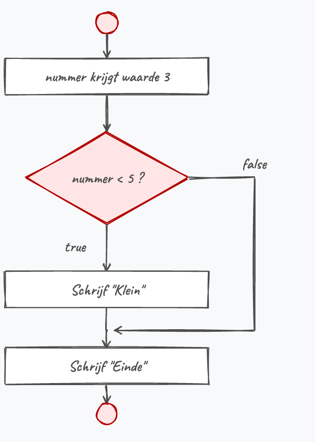
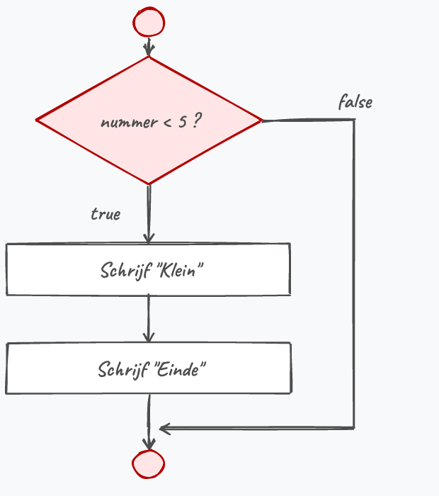
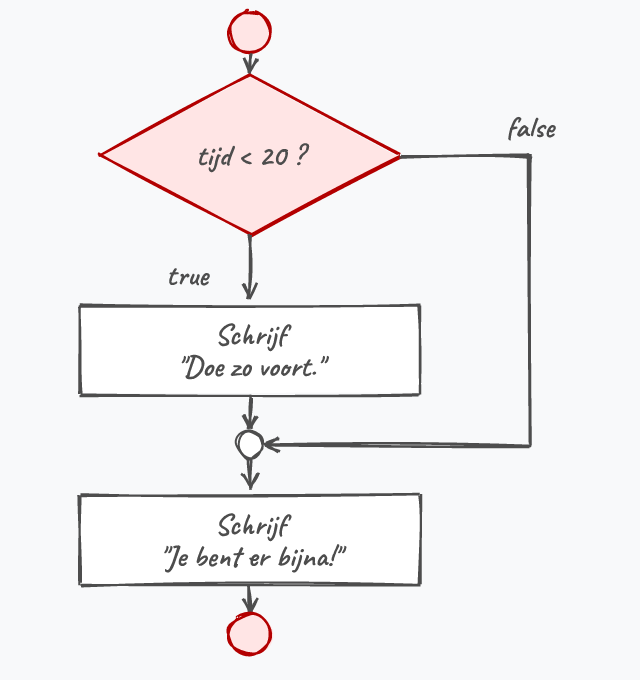
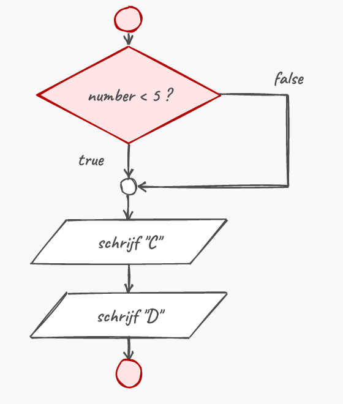

## If

De ``if`` (*als*) uitdrukking is één van de meest elementaire uitdrukkingen in een programmeertaal. Het laat ons toe vertakkingen in onze programmaflow in te bouwen. Ze laat toe om "als dit waar is doe dan dat"-beslissingen te maken.

De syntax is als volgt:

```java
if (booleaanse expressie) 
{
    //deze code wordt uitgevoerd indien
    //de booleaanse expressie true is
}
```

Enkel indien de booleaanse expressie **waar** is (``true``), zal de code binnen de accolades van het ``if``-blok uitgevoerd worden. Indien de expressie niet waar is (``false``) dan wordt het blok overgeslagen en gaat het programma verder met de code eronder.

Een voorbeeld:

```java
int nummer = 3;
if (nummer < 5)
{
    Console.WriteLine("Klein");
}
Console.WriteLine("Einde");
```

De uitvoer van dit programma zal zijn:

::: {.console}
```text
Klein
Einde
```
:::

Indien ``nummer`` groter of gelijk aan 5 was dan zou er enkel ``Einde`` op het scherm zijn verschenen. De lijn ``Console.WriteLine("Einde");`` zal sowieso uitgevoerd worden zoals je ook kan zien in onderstaande flowchart.[^code2]

[^code2]: [Code2flow.com](https://code2flow.com) is een handige tool om je reeds geschreven C# code om te zetten naar een flowchart. Het kan je helpen om vreemde bugs te ontdekken. Uiteraard is de eerste stap debuggen en door je code *steppen*: vaak zal je ogenblikkelijk zien waar je code verkeerd loopt.

<!--{width=20%}-->

### if met een blok

Het is aangeraden om steeds na de if-expressie met accolades te werken. Dit zorgt ervoor dat alle code tussen het blok (de accolades) zal uitgevoerd worden indien de booleaanse expressie waar was.  **Gebruik je geen accolades dan zal enkel de eerste lijn na de ``if`` uitgevoerd worden bij ``true``.**

Een voorbeeld:
```java
if (nummer < 5)
{
    Console.WriteLine("Klein");
    Console.WriteLine("Einde");
}
```

<!--{width=25%}-->

<!-- \newpage -->

### Veelgemaakte fouten met ``if``

>Voorman hier! Je hebt me gemist. Ik merk het. Het ging goed de laatste tijd. Maar nu wordt het tijd dat ik je weer even wakker schud want de code die je nu gaat bouwen kan érg vreemde gedragingen krijgen als je niet goed oplet. Luister daarom even naar deze lijst van veelgemaakte fouten wanneer je met ``if`` begint te werken. 

#### Appelen en peren vergelijken

Je zag bij de relationele operators al dat beide operanden vergelijkbaar moeten zijn. Volgende code zal dus niet compileren:

```java
if ("4" > 3)
```

Gelukkig laat de compiler je niet in het ongewisse:

::: {.console}
```text
Operator '>' cannot be applied to operands of type 'string' and 'int'
```
:::

De twee types die niet samengaan staan achteraan in die boodschap: ``string`` en ``int``. Hier staat ``"4"`` tussen aanhalingstekens en is dus tekst, geen getal.

#### Toekennen in plaats van vergelijken

``=`` kent toe, ``==`` vergelijkt. Wie snel typt, tikt al eens ``=`` waar ``==`` moest staan. Werk je met getallen, dan houdt de compiler je tegen:

```java
if (leeftijd = 18) //compileert niet
```

``leeftijd = 18`` is immers een toekenning en levert een ``int`` op, terwijl een ``if`` een ``bool`` verwacht.

Werk je met een ``bool``, dan is er géén vangnet:

```java
bool gevonden = false;
if (gevonden = true)
{
    Console.WriteLine("Gevonden!");
}
```

Deze code compileert probleemloos en zet toch ``Gevonden!`` op het scherm. ``gevonden = true`` zet ``gevonden`` eerst op ``true`` en geeft die waarde daarna door aan de ``if``. De test is dus altijd waar én je variabele is onderweg overschreven. Schrijf hier gewoon ``if (gevonden)``.

#### Accolades vergeten

Accolades vergeten plaatsen om een codeblok aan te duiden is een typische fout. Wanneer je bijvoorbeeld Python hebt geleerd, dan zou je verwachten dat je code zodanig kan uitlijnen (met tabs of spaties) om code bij een ``if`` te groeperen in een blok. Wat dus niet zo is. **Je code uitlijnen heeft in C# géén invloed op de programflow**. 

Je zag hierboven al dat zonder accolades enkel de eerste lijn na de ``if`` bij de ``if`` hoort. Nemen we het blokvoorbeeld van daarnet en laten we de accolades weg, dan wordt de laatste lijn altijd uitgevoerd, ongeacht de ``if``:

```java
if (tijd < 20)
    Console.WriteLine("Doe zo voort.");
    Console.WriteLine("Je bent er bijna!"); //verschijnt altijd op scherm
```

<!--{width=45%}-->

Deze code zal dus 2 mogelijke outputs op het scherm geven. Indien de *``tijd`` groter of gelijk is aan 20* dan krijgen we volgende output:

::: {.console}
```text
Je bent er bijna!
```
:::

<!-- \newpage -->

Maar indien de ``tijd`` kleiner is dan 20 krijgen we:

::: {.console}
```text
Doe zo voort. 
Je bent er bijna!
```
:::

Dit is uiteraard niet de output die we verwachten. We willen de motiverende boodschappen (beide zinnen) enkel tonen indien de gebruiker nog tijd heeft. De juiste oplossing is:

```java
if (tijd < 20)
{
    Console.WriteLine("Doe zo voort.");
    Console.WriteLine("Je bent er bijna!"); 
} 
```

#### Een puntkomma plaatsen na de booleaanse expressie 

Dit zal ervoor zorgen dat er eigenlijk geen codeblok bij de ``if`` hoort en je dus een nietszeggende ``if`` hebt geschreven. De code na het puntkomma zal uitgevoerd worden ongeacht de ``if``:

```java
if (naam == "neo");
{    
    Console.WriteLine("Take the red pill?");
    Console.WriteLine("Or the blue pill?");
}
```

<!--{width=45%}-->

De uitvoer van voorgaande zal altijd de volgende zijn, ongeacht of de gebruikersnaam gelijk is aan "neo":

::: {.console}
```text
Take the red pill?
Or the blue pill?
```
:::

Indien de naam gelijk is aan "neo" dan zal de code *tussen de if en de puntkomma op lijn 1* uitgevoerd worden. Kortom, er wordt niets gedaan (daar hier geen code staat). Het blok erachter dat de 2 zinnen op het scherm zet wordt altijd uitgevoerd. 

<!-- \newpage -->

<!-- TODO ed.5 (review): pattern matching met 'is' (if (input is int x)) hier NIET toegevoegd: vereist klassen en objecten, en staat al uitgewerkt in H18 (18_IsAs/1_IsAs.md). Enkel te overwegen als er ooit een variant zonder objecten nodig is. -->

### If/else

Met "if - else" kunnen we niet enkel zeggen welke code moet uitgevoerd worden als de conditie waar is **maar ook welke specifieke code moet uitgevoerd indien de conditie niet waar is**. Volgend voorbeeld geeft een typisch gebruik van een "if - else" structuur om 2 waarden met elkaar te vergelijken:

```java
int waterpeil = 10;
const int MAX = 5;
 
if (waterpeil > MAX)
{
    Console.WriteLine("Waterpeil staat te hoog!");
}
else
{
    Console.WriteLine("Waterpeil is in orde.");
}
```

<!--{width=60%}-->

:::{.callout-warning}
Een veelgemaakte fout is bij de ``else`` sectie ook een booleaanse expressie plaatsen. Dit kan niet: de ``else`` sectie zal gewoon uitgevoerd worden indien de ``if`` sectie NIET uitgevoerd werd. Volgende code MAG DUS NIET:

```java
if(a > b) 
{...}
else (a <= b) //<FOUT!
{...}
```

:::

### De ternaire operator

Soms is een volledige ``if - else`` veel typwerk voor iets heel kleins: één variabele die de ene of de andere waarde moet krijgen. Daarvoor bestaat er een verkorte schrijfwijze, de **ternaire operator**. Ze werkt met een vraagteken en een dubbelpunt:

```java
int leeftijd = 20;
string boodschap = leeftijd >= 18 ? "Welkom" : "Te jong";
```

Lees die lijn als een vraag: *is ``leeftijd >= 18`` waar?* Zo ja, dan krijgt ``boodschap`` de waarde die vlak na het vraagteken staat, zo niet die na de dubbelpunt. Vóór het vraagteken staat dus de booleaanse expressie, erna de twee mogelijke uitkomsten.

<!--{width=90%}-->

Met een gewone ``if - else`` schrijf je exact hetzelfde als:

```java
string boodschap;
if (leeftijd >= 18)
{
    boodschap = "Welkom";
}
else
{
    boodschap = "Te jong";
}
```

Het is de enige operator in C# die drie operanden nodig heeft (de test en de twee uitkomsten), vandaar de naam *ternair*.

:::{.callout-warning}
De ternaire operator levert enkel een **waarde** op, ze voert geen codeblok uit. Wil je bij ``true`` of bij ``false`` meerdere lijnen code laten lopen, dan heb je een gewone ``if - else`` nodig.
:::

<!-- \newpage -->

### If - else if

Met een "if - else if" constructie kunnen we meerdere criteria opgeven die waar/niet waar moeten zijn voor een bepaald stukje code kan uitgevoerd worden. 
Sowieso begin je steeds met een ``if``. Als je vervolgens een ``else if`` plaatst dan zal de expressie van deze ``else if`` getest worden enkel en alleen als de eerste expressie niet waar was. Als de expressie van deze ``else if`` wel waar is zal de bijhorende code uitgevoerd worden, zo niet wordt deze overgeslagen.

Een voorbeeld:

```java
int x = 9;
 
if (x == 10)
{
    Console.WriteLine("x is 10");
}
else if (x == 9)
{
    Console.WriteLine("x is 9");
}
else if (x == 8)
{
    Console.WriteLine("x is 8");
}
```

Voorts mag je ook steeds nog afsluiten met een finale ``else`` die zal uitgevoerd worden indien geen enkele andere expressie ervoor waar bleek te zijn:

```java
if(x>100)
{
    Console.WriteLine("Groter dan 100");
}
else if(x>10)
{
    Console.WriteLine("Groter dan 10");
}
else
{
    Console.WriteLine("Getal kleiner dan of gelijk 10");
}

```

<!--{width=100%}-->

:::{.callout-important}
De volgorde van opeenvolgende "if - else if - else" tests is uiterst belangrijk. Als we in de voorgaande code de volgorde van de twee tests omdraaien, zal het tweede blok (``x > 100``) nooit worden bereikt. 

Logisch: neem een getal groter dan 100 en laat het door onderstaande code lopen. Stel, we nemen 110. Al bij de eerste test (``x>10``) is deze ``true`` en verschijnt er dus "Groter dan 10". Alle andere tests worden daarna niet meer gedaan en de code gaat verder na het ``else``-blok:

```java

if(x>10)
{
    Console.WriteLine("Groter dan 10");
}
else if(x>100)
{
    Console.WriteLine("Groter dan 100");
}
else
//...
```

<!--{width=100%}-->

:::

:::{.callout-tip}
Hoe minder tests de computer moet doen, hoe meer performant de code zal uitgevoerd worden. Voor complexe applicaties die bijvoorbeeld in realtime veel berekeningen moeten doen kan het dus een gigantische invloed hebben of een reeks "if - else if else" testen vlot wordt doorlopen. Het is dan ook een goede gewoonte - indien de logica van het algoritme het toelaat - om de meest voorkomende test bovenaan te plaatsen. 

Hetzelfde geldt binnen één test wanneer je met logische operators werkt. Je zag eerder al dat C# **kortsluit**: bij ``x > 100 && a != "stop"`` stopt de computer meteen wanneer ``x > 100`` al ``false`` is, en wordt de rechtse test niet meer uitgevoerd. Zet bij zo'n samengestelde test dus de voorwaarde die het vaakst zal falen vooraan, dan doet de computer geen onnodig werk. Bij ``||`` draai je die redenering om: daar stopt de computer zodra één test ``true`` is, dus zet je de voorwaarde die het vaakst waar zal zijn vooraan.
:::

### Stagiair Steven

> Steven schrijft een kortingsprogramma: wie voor meer dan 100 euro koopt, krijgt 10% korting, wie voor meer dan 50 euro koopt 5%. De A.I. leverde dit en hij vindt het er logisch uitzien:
>
>```csharp
>int bedrag = 120;
>int korting = 0;
>if (bedrag > 100)
>{
>    korting = 10;
>}
>if (bedrag > 50)
>{
>    korting = 5;
>}
>Console.WriteLine(korting);
>```
>
>"Bij 120 euro is dat toch meer dan 100, dus 10% korting", verwacht hij.

Waarom toont dit toch ``5`` in plaats van ``10``?

:::{.callout-note collapse="true"}
## Antwoord
Bij ``bedrag = 120`` is de eerste test ``bedrag > 100`` inderdaad ``true`` en wordt ``korting`` even op ``10`` gezet. Maar het zijn twee **losse** ``if``'s, geen ``if``/``else if``-keten: C# test de tweede ``if (bedrag > 50)`` gewoon ook, en die is voor 120 euro ook ``true``. Die tweede ``if`` overschrijft ``korting`` dus alsnog naar ``5``. Had Steven een ``else if`` gebruikt in plaats van een tweede losse ``if``, dan was de tweede test overgeslagen zodra de eerste al ``true`` was. Hij testte enkel met 120 euro, zag een getal verschijnen, en keek niet na of het wel het júiste getal was.
:::

<!-- \newpage -->

### Gebruik relationele en logische operators

We kunnen ook meerdere booleaanse expressie combineren zodat we complexere uitdrukkingen kunnen maken. Stel dat we een if nodig hebben waar enkel *ingegaan* mag worden indien de leeftijd van een gebruiker hoger is dan 18 EN hij heeft een identiteitskaart bij. We kunnen dergelijke samengestelde expressies schrijven gebruik makend van de **logische operators**.

Volgende code toont het gebruik hiervan:

```java
if (leeftijd > 18 && heeftIdentiteitskaart)
{
    Console.WriteLine("Welkom");
}
else 
{
    Console.WriteLine("Niet toegelaten!");
}
```

:::{.callout-tip}
Merk op dat we ``heeftIdentiteitskaart`` rechtstreeks in de test gebruiken en dus niet ``heeftIdentiteitskaart == true`` schrijven. Die ``== true`` is overbodig: ``heeftIdentiteitskaart`` is zelf al een ``bool`` en dus al een volwaardige booleaanse expressie. Wil je testen op ``false``, schrijf dan ``!heeftIdentiteitskaart``.
:::

### Nesting

We kunnen met behulp van *nesting*  ook complexere programma flows maken. Nesting wil zeggen dat we meerdere codeblokken in elkaar plaatsen. Hierbij gebruiken we de accolades om het blok code aan te duiden dat bij een "if - else if - else" hoort. Binnen dit blok kunnen nu echter opnieuw beslissingsstructuren worden aangemaakt.

Volgende voorbeeld toont dit aan. In het ``else``-gedeelte zit opnieuw een volledige ``if - else``. Die binnenste test wordt enkel bereikt wanneer de temperatuur te hoog is:

```java
const double MAX_TEMP = 40;
double huidigeTemperatuur = 36.5;
string dokterVanWacht = "";

if (huidigeTemperatuur < MAX_TEMP)
{
    Console.WriteLine("Temperatuur normaal");
}
else
{
    Console.WriteLine("Temperatuur te hoog!");
    if (dokterVanWacht == "")
    {
        Console.WriteLine("Oei oei! Geen dokter van wacht!");
    }
    else
    {
        Console.WriteLine($"{dokterVanWacht} gecontacteerd");
    }  
}
```

<!--{width=85%}-->

Met deze waarden verschijnt er maar één lijn:

::: {.console}
```text
Temperatuur normaal
```
:::

``huidigeTemperatuur`` is immers kleiner dan ``MAX_TEMP``, dus wordt het volledige ``else``-blok overgeslagen en komt de binnenste ``if`` niet aan bod. Zet ``huidigeTemperatuur`` eens op ``41`` en ``dokterVanWacht`` op een naam, dan zie je welke twee lijnen er dan wél verschijnen.

### Test jezelf

Wat verschijnt er op het scherm bij elk van deze vijf stukjes code?

**1.**

```java
int punten = 150;

if (punten > 10)
{
    Console.WriteLine("Goed bezig");
}
else if (punten > 100)
{
    Console.WriteLine("Uitstekend");
}
else
{
    Console.WriteLine("Blijven oefenen");
}
```

**2.**

```java
int leeftijd = 12;

if (leeftijd >= 18)
    Console.WriteLine("Je mag binnen.");
    Console.WriteLine("Veel plezier!");
```

**3.**

```java
int temperatuur = 45;
string dokter = "Dr. House";

if (temperatuur < 40)
{
    Console.WriteLine("Alles ok");
}
else
{
    Console.WriteLine("Alarm!");
    if (dokter == "")
    {
        Console.WriteLine("Niemand van wacht");
    }
    else
    {
        Console.WriteLine($"{dokter} gebeld");
    }
}
```

**4.**

```java
string naam = "Tim";

if (naam == "Neo");
{
    Console.WriteLine("Volg het witte konijn.");
}
```

**5.**

```java
int score = 8;
string status = score >= 10 ? "geslaagd" : "niet geslaagd";
Console.WriteLine(status);
```

:::{.callout-tip collapse="true"}
## Antwoorden

**1.** Enkel ``Goed bezig``. De eerste test (``punten > 10``) is voor 150 al ``true``, dus wordt de rest van de keten overgeslagen. De tak ``punten > 100`` wordt nooit bereikt, hoe groot ``punten`` ook is.

**2.** Enkel ``Veel plezier!``. Zonder accolades hoort alleen de eerste ``Console.WriteLine`` bij de ``if``, en die wordt bij 12 jaar niet uitgevoerd. De tweede lijn staat gewoon ónder de ``if`` en verschijnt dus altijd.

**3.** Eerst ``Alarm!``, daarna ``Dr. House gebeld``. 45 is niet kleiner dan 40, dus draait de ``else``. Daarbinnen volgt een tweede test: ``dokter`` is niet leeg, dus komt de boodschap uit de geneste ``else``.

**4.** ``Volg het witte konijn.``, ook al is ``naam`` niet "Neo". De puntkomma sluit de ``if`` meteen af, dus hoort het blok eronder niet meer bij de test en wordt het altijd uitgevoerd.

**5.** ``niet geslaagd``. 8 is niet groter of gelijk aan 10, dus krijgt ``status`` de waarde die na de dubbelpunt staat.
:::

<!-- \newpage -->

>Laat dit tiental bladzijden uitleg je niet de indruk geven dat code schrijven met ``if``-structuren een eenvoudige job is. Vergelijk het met van je pa leren hoe je met pijl en boog moet jagen, wat vlekkeloos gaat op een stilstaande schijf, tot je in het bos voor een mammoet staat die op je komt afgestormd. *Da's andere kak hé?*
>
>Het is dan ook aangeraden om, zeker in het begin, steeds een flowchart te tekenen van wat je juist wilt bereiken. Dit zal je helpen om je code op een juiste manier op te bouwen (denk maar aan nesting en het plaatsen van meerdere "if -else" structuren in of na elkaar). *Bezint eer ge begint.*

