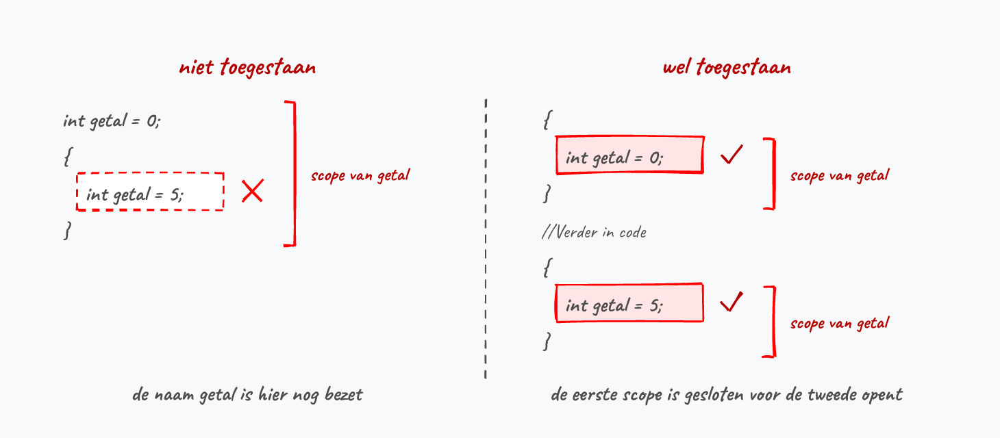

## Scope van variabelen

De locatie waar je een variabele aanmaakt bepaalt de **scope** van de variabele. Binnen deze scope zal een variabele gebruikt kunnen worden door andere code. Je kan de scope vergelijken met verschillende kamers in een gebouw. Variabelen die je in een kamer aanmaakt zijn enkel in die kamer bruikbaar.

Eenvoudig gezegd zullen steeds de **omliggende accolades de scope van de variabele bepalen**. Indien je de variabele dus buiten die accolades nodig hebt dan heb je een probleem: de variabele is enkel bereikbaar binnen de accolades, vanaf het punt in de code waarop ze werd gedeclareerd.

Zeker wanneer je begint met ``if``, loops, methoden, enz. zal de scope belangrijk zijn: deze code-constructies gebruiken steeds accolades om codeblokken aan te duiden. Een variabele die je dus binnen een if-blok aanmaakt zal enkel binnen dit blok bestaan, niet erbuiten.

Volgend voorbeeld toont de scope van de variabele ``getal``:

```java
bool iLoveCSharp = true;

if (iLoveCSharp)
{
    Console.WriteLine("Hoeveel punten op 10 geef je C#?");
    int getal; //Start scope getal
    getal = int.Parse(Console.ReadLine());
} // einde scope getal

Console.WriteLine(getal); // FOUT! getal niet in deze scope
```

De variabele ``getal`` wordt aangemaakt tussen de accolades van de ``if`` en "verdwijnt" dus van zodra we die *kamer* verlaten (laatste accolade).

Wil je dus ``getal`` ook nog buiten de ``if`` gebruiken zal je je code moeten herschrijven zodat ``getal`` VOOR de ``if`` wordt aangemaakt. Nu is de scope van de variabele groter: we moeten immers steeds naar de *omliggende* accolades kijken. In dit geval bepalen de buitenste accolades de scope:

```java
bool iLoveCSharp = true;

{
    int getal = 0; //Start scope getal
    if (iLoveCSharp)
    {
        Console.WriteLine("Hoeveel punten op 10 geef je C#?");
        getal = int.Parse(Console.ReadLine());
    }
    Console.WriteLine(getal);
} // einde scope getal
```

De buitenste accolades zetten we er even om de scope te benadrukken (maar hoeven dus niet). Zulke "losse" accolades zonder ``if`` of lus errond zie je in de praktijk zelden, maar ze tonen de scope-regel hier wel in z'n zuiverste vorm.

<!--{width=100%}-->

:::{.callout-important}
## Enkel verplaatsen volstaat niet
Merk op dat we ``getal`` niet alleen vóór de ``if`` declareren, we geven ze meteen ook de waarde 0. Dat is geen toeval. Laat je die beginwaarde weg, dan klopt de scope wel, maar compileert je code nog steeds niet:

```java
int getal;
if (iLoveCSharp)
{
    getal = int.Parse(Console.ReadLine());
}
Console.WriteLine(getal); // FOUT: Use of unassigned local variable 'getal'
```

C# eist dat een lokale variabele een waarde heeft voor je ze uitleest. De compiler ziet dat ``getal`` enkel een waarde krijgt *als* de ``if`` uitgevoerd wordt, en dat is niet zeker. Geef zo'n variabele dus altijd een beginwaarde bij de declaratie.
:::

:::{.callout-tip}
Merk op dat indien je aan nesting doet, de scope doorheen de *inner* geneste codeblokken doorloopt en pas eindigt bij de accolade van het blok waarbinnen de variabele werd gedeclareerd.
:::

Deze regel zal je vooral tegenkomen bij lussen: een variabele die je binnen de accolades van een lus aanmaakt wordt bij elke iteratie opnieuw aangemaakt en is buiten de lus niet bruikbaar. Daar komen we in hoofdstuk 6 uitgebreid op terug.

### Variabelen met zelfde naam
Zolang je in de scope van een variabele bent, kan je geen nieuwe variabele met dezelfde naam aanmaken:

Volgende code is dus niet toegestaan:

```java
int getal = 0;
{
    int getal = 5; //Deze lijn is niet toegestaan
}
```

Je krijgt de foutboodschap: "A local variable named 'getal' cannot be declared in this scope because it would give a different meaning to 'getal', which is already used in a 'parent or current' scope to denote something else."

In hoofdstuk 2 zag je al dat je binnen eenzelfde codeblok niet twee keer dezelfde naam mag declareren (*already defined in this scope*). Hier gaat het om het geneste geval: ook in een binnenliggend blok is die naam nog bezet. De enige oplossing is de tweede variabele een andere naam geven.

In volgend voorbeeld is dit dus wel geldig, omdat de scope van de eerste variabele afgesloten wordt door de accolades:

```java
{
    int getal = 0;
    //....
}
//Verder in code
{
    int getal = 5;
}
```

<!--{width=90%}-->
