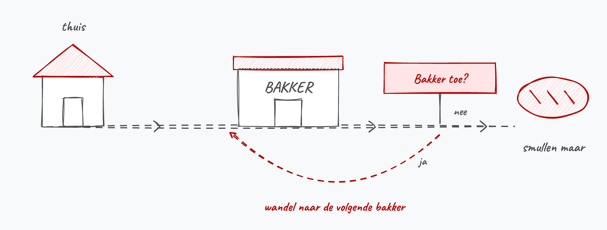
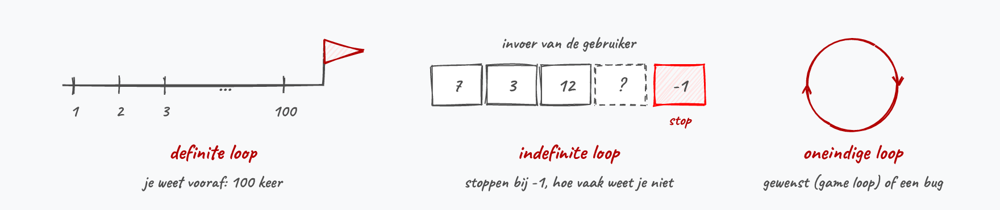

# Loops <!--\label{ch:6}-->

In het vorige hoofdstuk leerden we onze code **vertakken** (*branching*): op basis van een test voert je programma het ene stuk code uit en slaat het het andere over. Sequentie en selectie heb je daarmee in de vingers. In dit hoofdstuk komt de derde en laatste bouwsteen erbij: **iteratie**, hetzelfde stuk code meerdere keren uitvoeren.

Wat we tot nu toe immers niet konden is **teruggaan naar een vorige plek in het algoritme**. Onze programma's liepen steevast naar beneden, nooit terug naar boven. Soms wil je net dat een heel stuk code opnieuw en opnieuw uitgevoerd wordt, tot er aan een bepaalde conditie voldaan is: *"Blijf getallen vragen totdat de gebruiker 666 invoert."*

Herinner je het bakkersalgoritme uit het vorige hoofdstuk. Wanneer de bakker toe was stopten we daar gewoon mee. Met een herhaling kan je iets zinnigers doen:

```text
Neem geld uit spaarpot
Wandel naar de dichtstbijzijnde bakker
Zolang de bakker toe is:
    Wandel naar de volgende bakker in de straat
Vraag om een brood
Krijg het brood
Betaal het geld aan de bakker
Keer huiswaarts
Smullen maar
```

<!--{width=90%}-->

Hoe vaak die *zolang*-stap zal uitgevoerd worden weet je op voorhand niet. Misschien heb je meteen prijs, misschien loop je de halve stad af. Toch schrijf je die stap maar één keer op.

Herhalingen (**loops**) schrijf je dus wanneer bepaalde code meerdere keren moet uitgevoerd worden. Hoe lang de herhaling duurt hangt af van de conditie die je bepaalt. Elke keer dat de code binnen de loop wordt uitgevoerd noemen we een **iteratie**. De loop doorloopt zijn codeblok dus iteratie na iteratie, tot de gestelde conditie niet meer voldoet.

**Door herhalende code met loops te schrijven maken we onze code korter en bijgevolg ook minder foutgevoelig en beter onderhoudbaar.** Zonder loop moet je alle herhaling letterlijk uittypen:

```java
Console.WriteLine("Ik zal niet spieken");
Console.WriteLine("Ik zal niet spieken");
Console.WriteLine("Ik zal niet spieken");
//...en zo nog 97 keer
```

Wil je die zin achteraf aanpassen, dan mag je honderd lijnen bijwerken en vergeet je er gegarandeerd eentje.

Loops zitten trouwens in zowat elk programma dat je dagelijks gebruikt. Je game tekent 60 keer per seconde een nieuw beeld op je scherm. Je mailprogramma overloopt alle nieuwe berichten en zet ze onder elkaar. De zelfscankassa blijft artikels scannen tot jij op *afsluiten* duwt.

Welk type loop je straks ook schrijft, er zitten altijd drie zaken in:

1. Een **startsituatie**: een teller die op 0 staat, een variabele die nog leeg is, enz.
2. Een **conditie** die getest wordt om te weten of er nog een iteratie volgt.
3. Iets binnen het codeblok dat die conditie kan doen veranderen: de teller verhogen, nieuwe invoer vragen, enz.

Vergeet je dat derde punt, dan blijft de conditie eeuwig waar en loopt je programma vast. Verderop in dit hoofdstuk zie je hoe je zulke oneindige loops herkent en stopt.

## Soorten loops

Er zijn verschillende categorieën loops:

* **Definite of counted loop**: een loop waarbij het aantal herhalingen vooraf bekend is. Bijvoorbeeld: alle getallen van 0 tot en met 100 tonen.
* **Indefinite of sentinel loop**: een loop waarvan op voorhand niet kan gezegd worden hoe vaak deze zal uitgevoerd worden. Invoer van de gebruiker of een interne test bepaalt wanneer de loop stopt. Bijvoorbeeld: "Voer getallen in, voer -1 in om te stoppen" of "Bereken de grootste gemene deler".
* **Oneindige loop**: een loop die nooit stopt. Soms gewenst (bv. de game loop) of, vaker, een bug.

<!--{width=100%}-->

Het bakkersalgoritme hierboven is dus een indefinite loop: het aantal gesloten bakkers ken je pas terwijl je aan het wandelen bent.

<!-- \newpage -->


### Loops in C\#

Er zijn 3 standaard manieren om loops te maken in C#:

* **``while``**: zal 0 of meerdere keren uitgevoerd worden.
* **`` do while``**: zal minimaal 1 keer uitgevoerd worden.
* **``for``**: een alternatieve, iets compactere manier om loops te beschrijven wanneer je exact weet hoe vaak de loop zal moeten herhalen.

Daarnaast bestaat er nog een vierde loopvariant, die pas later in het boek aan bod komt:

* **``foreach``**: een leesbaardere manier van loopen, die vooral nuttig is wanneer je met objecten werkt.

De 3 categorieën loops die we net bespraken kunnen in principe met eender welk looptype in C# geschreven worden. Toch raad ik je aan om voortaan bewust te kiezen welk looptype het best bij je probleem past. Samengevat kan je het volgende zeggen:

| Looptype          | Definite loop | Indefinite loop | Oneindige loop |
| ----------------- | :-----------------: | :-----------------: | :-----------------: |
| While en do while | x             | x               | x              |
| For               | x             |                 |                |
| Foreach[^foreachlater] | x        |                 |                |

[^foreachlater]: De ``foreach`` nemen we hier enkel voor de volledigheid al even op in de tabel. We leren deze pas echt gebruiken in hoofdstuk 12, wanneer we met arrays van objecten werken. Trek je er voorlopig dus nog niets van aan.

Deze tabel suggereert dat we met ``while`` en ``do while`` meer kunnen, wat ook zo is. Je zal echter gauw ontdekken dat je vaak terugvalt op een ``for`` omdat:

1. Deze compactere code oplevert.
2. Heel wat problemen nu eenmaal definite loops zijn: iets doen voor elk getal van 1 tot 10, voor elke letter van een woord, voor elke rij van een tabel.
