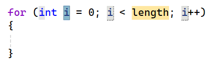

## For-loops

Een veelvoorkomende manier van while-loops gebruiken is waarbij je een bepaalde teller bijhoudt die je telkens met een bepaalde waarde verhoogt. Wanneer de teller een bepaalde waarde bereikt moet de loop afgesloten worden.

Bijvoorbeeld volgende code om alle even getallen van 0 tot 10 te tonen:

```java
int i = 0;
while(i<11)
{
    Console.WriteLine(i);
    i = i + 2;
}
```

**Met een for-loop kunnen we deze veel voorkomende code-constructie verkort schrijven.**

### For syntax

De syntax van een ``for``-loop is de volgende:

```java
for (setup; finish test; update)
{
    //code die zal uitgevoerd worden zolang de finish test true geeft
}
```

* **setup** (in de Microsoft-documentatie de *initializer* genoemd): Hier zetten we de "wachter-variabele" op de beginwaarde. De wachter-variabele is de variabele die we tijdens de loop in het oog zullen houden en die zal bepalen hoe vaak de loop moet uitgevoerd worden (bv. ``int i = 0;``).
* **finish test** (officieel de *condition*): Hier plaatsen we een booleaanse expressie die de wachter-variabele gebruikt om te testen of een volgende iteratie moet worden uitgevoerd (bv. ``i<11``).
* **update** (officieel de *iterator*): Hier plaatsen we wat er moet gebeuren na iedere iteratie. Meestal zullen we hier de wachter-variabele verhogen of verlagen (bv. ``i = i + 2``).

> Ik gebruik bewust de wat informelere namen *setup*, *finish test* en *update*. Raadpleeg je later de Microsoft-documentatie, dan zie je daar de termen *initializer*, *condition* en *iterator* staan: net hetzelfde, andere woorden.

<!-- \newpage -->

<!--{width=50%}-->
 
Voor de *setup*-variabele kiest men meestal ``i``, maar dat is niet noodzakelijk.

Gebruiken we deze kennis, dan kunnen we de eerder vermelde code om de even getallen van 0 tot en met 10 tonen als volgt:

```java
for (int i = 0; i < 11; i += 2)
{
    Console.WriteLine(i);
}
```


Deze code zal telkens ``i`` met 2 verhogen(*update*), startende bij 0 (*setup*). Het blijft dit doorlopen zolang i kleiner is dan 11 (*finish test*). Als output krijgen we:

::: {.callout-tip title="Zie verder"}
Deze drie-delige for-syntax (`setup; finish test; update`) is geen C#-uitvinding: ze komt rechtstreeks uit **C** en is daarna bijna letterlijk overgenomen door **C++**, **Java** en **JavaScript**. Vergelijk maar met Java:

```java
for (int i = 0; i < 11; i += 2) {
    System.out.println(i);
}
```

Op de manier van afdrukken na is dit identiek aan C#. Ken je de for-loop hier, dan kan je ze in al die talen meteen lezen.

**Python** breekt volledig met die traditie. Daar bestaat geen teller-met-conditie-for; je loopt altijd *over* iets. Wil je tellen, dan vraag je een reeks getallen op met `range`:

```python
for i in range(0, 11, 2):   # van 0 tot (niet incl.) 11, stap 2
    print(i)
```

Geen losse setup, conditie en update dus: Python verstopt die in `range`. Veel beknopter, maar het werkt enkel als je vooraf weet over welke reeks je loopt.
:::

:::{.callout-tip}
Merk op dat ``i += 2`` exact hetzelfde doet als ``i = i + 2``, maar dan compacter. Dat zijn de *verkorte operatornotaties* uit hoofdstuk 2. Ook ``i++`` (hetzelfde als ``i = i + 1``) komt in loops heel vaak voor. Schrijf gerust de lange vorm als dat voor jou duidelijker is, maar je moet ze sowieso vlot kunnen *lezen*.
:::

::: {.console}
```text
0
2
4
6
8
10
```
:::


:::{.callout-tip}
**for-tab-tab**

Als je in Visual Studio ``for`` typt en dan tweemaal op [tab] duwt krijg je een kant en klare for-loop:

<!--{width=70%}-->

Telkens je vervolgens op [tab] duwt verspringt je cursor tussen ``i`` en ``length``. Op die manier kan je dus snel een for schrijven.
:::

<!-- \newpage -->


### continue en break

Het ``continue`` keyword laat toe om in een loop de huidige iteratie te eindigen en weer naar de start van de volgende iteratie te gaan. In het volgende voorbeeld gebruiken we ``continue`` om alle getallen van 1 tot 10 te tonen waarbij we het getal 5 zullen overslaan:

```java
for (int i = 1; i <= 10; i++)
{
    if (i == 5)
    {
        continue;
    }
    Console.WriteLine(i);
}
```

Met ``break`` kan je loops altijd vroegtijdig stopzetten. Je springt dan als het ware ogenblikkelijk uit de loop. Je ziet het aankomen zeker? Yups, daar is ie.... 


>Olla!? Wat denken we dat we aan het doen zijn? Gelieve die keywords ogenblikkelijk terug uit je code te verwijderen. Bedankt. 
>
>``break`` en ``continue`` zijn de subtielere vrienden van ``goto``. Ze werken net als ``goto`` in de schemerzone tussen wat wenselijk is en wat niet. Dit maakt ze extra gevaarlijk. Voordat je ``break`` als oplossing gebruikt, probeer eerst of je de loop netjes kunt afsluiten door bijvoorbeeld de juiste booleaanse expressie in de testconditie te gebruiken. Hetzelfde geldt voor continue, dat ook snel goto-achtige bugs kan veroorzaken.
>
>Ik heb gemerkt dat beginnende C#-programmeurs vaak te lui zijn om een deftige stopconditie voor hun loop te schrijven. En dan maar ``break`` als oplossing hanteren.

:::{.callout-tip}
**Wanneer is ``break`` dan wél oké?** Niet álle ``break``-gebruik is fout. Een legitiem voorbeeld is het *zoek-en-stop*-patroon: je doorzoekt een reeks en zodra je het gezochte element gevonden hebt, heeft verder zoeken geen zin meer. In zo'n geval kan ``break`` net leesbaarder zijn dan een kunstmatige extra booleaanse vlag. De vuistregel: gebruik ``break`` enkel als het je code écht duidelijker maakt, niet als luie vervanging voor een deftige stopconditie.
:::

<!-- TODO ed.5 (review): mini-sectie "Hoeveel keer loopt deze loop?" met off-by-one-voorbeelden (i<10 vs i<=10, i=0 vs i=1). Nummer 1 beginnersfout. -->
<!-- TODO ed.5 (review): for(;;)-variant als alternatief voor while(true) kort vermelden (handig voor wie ooit in C/Java terechtkomt). -->


