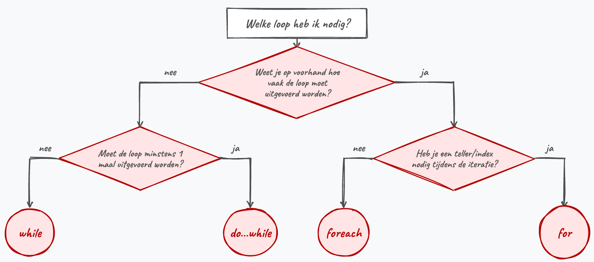

## Zie verder

### Even terugblikken

 In dit hoofdstuk leerde je code herhalen zonder ze telkens opnieuw te schrijven. Je zag de drie soorten loops (`while`, `do while` en `for`) en wanneer je welke kiest. Daarnaast kwamen geneste loops aan bod en hoe je foutieve invoer van de gebruiker met een loop blijft opvragen tot ze klopt.

De kern op een rij:

- Een `while` test vooraf en draait dus 0 of meer keer; een `do while` test achteraan en draait minstens 1 keer.
- Een `for` is de compacte keuze wanneer je vooraf weet hoe vaak je moet herhalen: setup, finish test en update staan netjes op één lijn.
- Wijzig in de loop altijd de variabele uit je testconditie, anders krijg je een oneindige loop.
- Een variabele die je binnen de accolades aanmaakt, wordt elke iteratie opnieuw aangemaakt. Wil je iets optellen of onthouden, declareer die variabele dan vóór de loop.

:::{.callout-warning}
## Valkuilen
- Bij een `do while` staat er een puntkomma achter de testconditie (`} while(...);`). Die vergeten is een veelgemaakte fout. Bij een `while` staat die puntkomma er net niet.
- Een teller die je in de loop niet aanpast, geeft een oneindige loop. Zit je vast, stop dan met de rode stop-knop in Visual Studio.
- Bij geneste loops moet je de teller van de inner loop bij elke ronde van de outer loop terug op de beginwaarde zetten. Vergeet je dat, dan loopt de binnenste loop in totaal maar één keer.
:::

Volgende vereenvoudiging kan je helpen te bepalen welke loop  vermoedelijk de beste optie is. Merk op dat je uiteraard steeds kritisch moet zijn over de opgave en de vereisten voor je beslist wat voor loop je gaat gebruiken:




### In andere talen

#### Do-while bestaat niet overal

De `do while` ken je terug in **C**, C++, Java en JavaScript, telkens met diezelfde "test-achteraan"-structuur. Python heeft daarentegen geen do-while. Wil je daar iets dat minstens één keer draait, dan bootst men dat na met een `while True` plus een `break`:

```python
while True:
    keuze = input("Geef uw keuze in: a, b of c ")
    if keuze in ("a", "b", "c"):
        break
```

In Python ben je dus vaak verplicht om `break` te gebruiken, terwijl je in C# de stopconditie achteraan de `do while` kan zetten.

#### De for-loop elders

De drie-delige for-syntax (`setup; finish test; update`) komt rechtstreeks uit **C** en is bijna letterlijk overgenomen door C++, Java en JavaScript. Vergelijk maar met Java:

```java
for (int i = 0; i < 11; i += 2) {
    System.out.println(i);
}
```

Op de manier van afdrukken na is dit identiek aan C#. Ken je de for-loop hier, dan kan je ze in al die talen meteen lezen.

Python breekt met die traditie. Daar bestaat geen teller-met-conditie-for; je loopt altijd *over* iets. Wil je tellen, dan vraag je een reeks getallen op met `range`:

```python
for i in range(0, 11, 2):   # van 0 tot (niet incl.) 11, stap 2
    print(i)
```

Losse setup, conditie en update zijn er dus niet: Python verstopt die in `range`. Dat werkt enkel als je vooraf weet over welke reeks je loopt.

### Zoek de fout

Onderstaande Java-code wil de getallen 1 tot en met 5 onder elkaar tonen, maar het programma blijft draaien en stopt nooit. Wat loopt er mis?

```java
int i = 1;
while (i <= 5)
{
    System.out.println(i);
}
```

:::{.callout-note collapse="true"}
## Antwoord
De variabele `i` uit de testconditie wordt nergens in de loop aangepast. `i` blijft dus altijd 1, de test `i <= 5` blijft eeuwig `true` en je krijgt een oneindige loop die telkens 1 print. Voeg `i++;` toe binnen de accolades, dan loopt de teller op tot de test faalt.
:::
