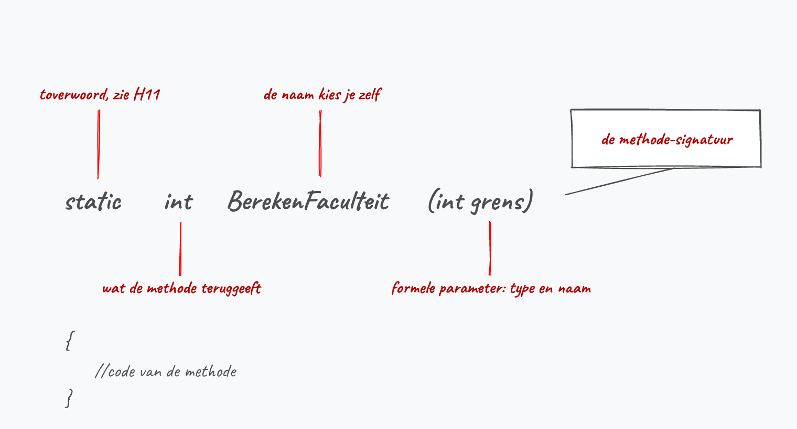
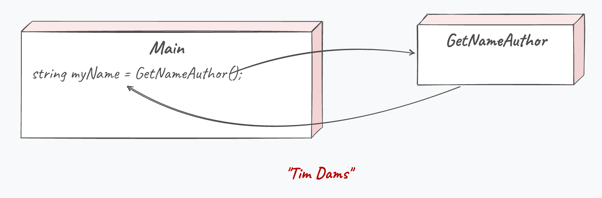

# Methoden <!--\label{ch:7}-->

> *"I will always choose a lazy person to do a difficult job. Because, he will find an easy way to do it."*
> Bill Gates, oprichter van Microsoft.

Het is je misschien nog niet opgevallen, maar sinds het vorige hoofdstuk zijn we de jacht begonnen op zo weinig mogelijk code te schrijven met zoveel mogelijk rendement. Loops waren een eerste stap in de goede richting. De volgende zijn methoden! Tijd om nog luier te worden.

Veel code die we hebben geschreven wordt meerdere keren, al dan niet op verschillende plaatsen, gebruikt. Dit verhoogt natuurlijk de foutgevoeligheid. Door het gebruik van methoden kunnen we de foutgevoeligheid van de code verlagen omdat de code maar op 1 plek staat én maar 1 keer dient geschreven te worden. Echter, ook de leesbaarheid en dus onderhoudbaarheid van de code wordt verhoogd.

Beeld je eens dat we geen gebruik konden maken van de vele .NET bibliotheken. Stel je voor dat ``Console.WriteLine``  niet bestond? Telkens als we dan iets in C# naar het scherm wilden sturen moesten we de volledige interne code van ``WriteLine`` uitschrijven. Voor de geïnteresseerden, dat zou er (ongeveer) als volgt uitzien:

```java
fixed (byte* p = bytes)
{
    if (useFileAPIs)
    {
        int numBytesWritten;
        Interop.Kernel32.WriteFile(hFile, p, bytes.Length, out numBytesWritten, IntPtr.Zero));
    }
    else
    {
        //enz.
```

Dat is aardig wat bizarre code he? En ik toon maar een stuk. Kortom: we mogen blij zijn dat methoden bestaan. Tijd om ze eens van dichterbij te bekijken!

Trouwens. Het is heel normaal dat voorgaande code je zenuwachtig maakt. Negeer ze maar![^wowzo]

[^wowzo]: Toch nieuwsgierig hoe wat er allemaal achter de schermen gebeurt? Voorgaande code komt uit [github.com/dotnet/runtime/blob/main/src/libraries/System.Console/src/System/ConsolePal.Windows.cs](https://github.com/dotnet/runtime/blob/main/src/libraries/System.Console/src/System/ConsolePal.Windows.cs), waar je ook alle andere broncode van de *dotnet runtime* zal terugvinden. 

## Werking van methoden

Een methode (ook wel *functie* genoemd) is in C# een blok code dat specifieke taken uitvoert. Een methode bestaat uit één of meerdere statements, kan herhaaldelijk worden aangeroepen met of zonder extra parameters, en kan een resultaat teruggeven. Methoden kunnen vanuit elk deel van je code worden aangeroepen.

Je gebruikt al sinds les 1 methoden. Telkens je ``Console.WriteLine()`` gebruikt, roep je een methode aan (genaamd  ``WriteLine``). 

**Methoden in C# zijn herkenbaar aan de ronde haakjes achteraan, al dan niet met actuele parameters tussen.** Alles wat je nu gaat zien heb je al gebruikt. Het grote verschil zal zijn dat we nu ook **zelf methoden** gaan definiëren, en niet enkel bestaande methoden gebruiken.

Methoden hebben als voordeel dat je herbruikbare stukken code kunt gebruiken en dus niet steeds deze code overal moet kopiëren en plakken. Daarnaast zullen methoden je code ook overzichtelijker maken.

### Methode syntax

De basis-syntax van een methode ziet er als volgt uit (de werking van het keyword ``static`` leg ik uit in hoofdstuk 11):

```java
static returntype MethodeNaam(optioneel_parameters)
{
    //code van methode
}
```

:::{.callout-tip}
Vergeet ``static`` voorlopig even: beschouw het als een verplicht **toverwoord** dat nu eenmaal voor je methoden moet staan. Waarom het er staat en wat het juist doet, leg ik uit in hoofdstuk 11. Tot dan: gewoon meeschrijven en er niet van wakker liggen.
:::

De eerste lijn noemen we de **methode-signatuur**. Deze lijn vertelt alles wat je moet weten om met de methode te werken (returntype, naam en eventuele parameters).



Vervolgens kan je deze methode elders oproepen als volgt, indien de methode geen parameters vereist:

```java
MethodeNaam();
```

Dat is een mondvol. We gaan daarom de methoden even stapsgewijs leren kennen. Let's go!

<!-- \newpage -->

### Een eenvoudige methode

Beeld je in dat je een applicatie moet maken waarin je op verschillende plaatsen de naam van je programma moet tonen. Zonder methoden zou je telkens moeten schrijven ``Console.WriteLine("Timsoft XP");``

Als je later de naam van het programma wilt veranderen naar iets anders (bv. ``Timsoft 11``) dan zal je manueel overal de titel moeten veranderen in je code. Met een methode hebben we dat probleem niet meer. We schrijven daarom een methode ``ToonTitel`` als volgt:

```java
static void ToonTitel()
{
    Console.WriteLine("Timsoft XP");
}
```

Vanaf nu kan je eender waar in je programma deze methode aanroepen door te schrijven:

```java
ToonTitel();
```

Volgend programma'tje toont dit:

```java
namespace Demo1
{
    internal class Program
    {
        static void ToonTitel()
        {
            Console.WriteLine("Timsoft XP");
        }

        static void Main(string[] args)
        {
            ToonTitel();
            Console.WriteLine("Welkom!");
            Console.WriteLine("Geef je naam aub");
            //....
            Console.WriteLine("Vaarwel");
            ToonTitel();
        }
    }
}
```

<!-- \newpage -->

Volgende afbeelding toont hoe je programma doorheen de code loopt. De pijlen geven de flow aan:

<!--{width=100%}-->

### Main is ook een methode

Zoals je misschien al begint te vermoeden is dus de ``Main`` waar we steeds onze code schrijven ook een methode. Een console-applicatie heeft een startpunt nodig en daarom begint ieder programma in deze methode, maar in principe kan je even goed je programma op een andere plek laten starten.

Wat denk je trouwens dat dit doet?

```java
static void Main(string[] args)
{
    Console.WriteLine("Ik zit vast!");
    Main(args); //Endless loop incoming!
}
```

:::{.callout-note collapse="true"}
## Antwoord
``Main`` roept zichzelf op, en die aanroep doet exact hetzelfde. Je krijgt dus eindeloos "Ik zit vast!" op je scherm tot het programma crasht. Verderop in dit hoofdstuk, bij "Oneindige methode-lussen", lees je waarom zo'n eindeloze aanroep crasht.
:::

:::{.callout-tip}
``string[] args`` is een verhaal apart en zullen we in het volgende hoofdstuk bekijken. Ik verklap alvast dat je via deze ``args`` opstartparameters aan je programma kan meegeven tijdens het opstarten (bijvoorbeeld ``explorer.exe google.com``) zodat je code hier iets mee kan doen.
:::

<!-- \newpage -->

## Returntypes van methoden

Voorgaande methode gaf niets terug. Dat kon je zien aan het keyword **``void``** (letterlijk: *leegte*). 

Vaak willen we echter wel dat de methode iets teruggeeft. Bijvoorbeeld het resultaat van een berekening.

Het returntype van een methode geeft aan wat het type is van de data die de methode als resultaat teruggeeft bij het beëindigen ervan. Eender welk datatype kan hiervoor gebruikt worden (``int``, ``string``, ``char``, ``float``, enz.). Ook ``enum`` datatypes kunnen als returntype in methoden gebruikt worden (en later ook objecten, wat we in hoofdstuk 9 zullen ontdekken).

### ``return`` keyword

Het is belangrijk dat in je methode het resultaat ook effectief wordt teruggegeven, dit doe je met het keyword **``return``** gevolgd door de variabele die moet teruggeven worden. 

Denk er dus aan dat deze variabele van het type is dat je hebt opgegeven als zijnde het returntype. Van zodra je ``return`` gebruikt zal je op die plek uit de methode 'vliegen'.

Wanneer je een methode maakt die iets teruggeeft (dus een ander returntype dan ``void``) is het ook de bedoeling dat je het resultaat van die methode opvangt en gebruikt. Je kan bijvoorbeeld het resultaat van de methode in een variabele bewaren. Dit vereist dat die variabele dan van hetzelfde returntype is! 

Volgend voorbeeld bestaat uit een methode die de naam van de auteur van je programma teruggeeft:

```java
static string VerkrijgAuteurNaam()
{
    return "Tim Dams";
}
```

Een mogelijke manier om deze methode in je programma te gebruiken zou nu kunnen zijn:

```java
string myName = VerkrijgAuteurNaam();
```



Maar ook dit zal werken:

```java
Console.WriteLine(VerkrijgAuteurNaam());
```

Of verderop misschien als volgt:

```java
Console.WriteLine($"Auteur van dit boek: {VerkrijgAuteurNaam()}");
```

:::{.callout-tip}
Je mag zowel literals als variabelen en zelfs andere methode-aanroepen plaatsen achter het ``return`` keyword. Zolang het maar om een expressie gaat die een resultaat heeft kan dit. Voorgaande methode kunnen we dus ook schrijven als:

```java
static string VerkrijgAuteurNaam()
{
    string naam= "Tim Dams";
    return naam;
}
```
:::

<!-- \newpage -->

## Een uitgewerkte methode

De faculteit van een getal *n* schrijven we als *n!*. Het is het product van alle positieve getallen van 1 tot en met *n*, waarbij *0!* gelijk is aan 1. Hier een voorbeeld van een methode die de faculteit van 5 berekent, *5!*. We willen dus ``1*2*3*4*5`` berekenen, wat 120 is.  De oproep van de methode gebeurt vanuit de Main-methode:

```java
internal class Program
{
    static int FaculteitVan5()
    {
        int resultaat = 1;
        for (int i = 1; i <= 5; i++)
        {
            resultaat *= i;
        }
        return resultaat;
    }
 
    static void Main(string[] args)
    {
       Console.WriteLine($"Faculteit van 5 is {FaculteitVan5()}");
    }
}
```

### ``void`` 

Indien je methode niets teruggeeft wanneer de methode eindigt (bijvoorbeeld indien de methode enkel tekst op het scherm toont) dan dien je dit ook aan te geven. Hiervoor gebruik je het keyword ``void``. 

Een voorbeeld:

```java
static void ToonVersie()
{
    Console.WriteLine("Dit is versie 8.31 ");
}
```

Deze methode moet je dus als volgt aanroepen:

```java
ToonVersie();
```

Volgende 2 manieren **werken niet** bij een methode met ``void`` als returntype:

```java
string result = ToonVersie(); //MAG NIET!!
Console.WriteLine(ToonVersie()); // MAG NIET!
```

<!-- \newpage -->

### ``return`` 

Je mag het ``return`` keyword eender waar in je methode gebruiken. Weet wel dat van zodra een statement met ``return`` wordt bereikt de methode ogenblikkelijk afsluit en het resultaat achter ``return`` teruggeeft (en in dit geval heb je dan ook geen `break` nodig bij iedere case). 

Soms is dit handig zoals in volgende voorbeeld:

```java
static string WindRichting()
{
    Random r = new Random();
    switch (r.Next(0,4))
    {
        case 0:
            return "noord";
        case 1:
            return "oost";
        case 2:
            return "zuid";
        case 3:
            return "west";
    }
    return "onbekend";
}
```

Merk op dat de onderste lijn (``return "onbekend";``) nooit zal bereikt worden. Toch vereist C# dit!

<!-- \newpage -->

>Dacht je nu echt dat ik weg was?! Het is me opgevallen dat je niet altijd de foutboodschappen in VS leest. Ik blijf alvast uit jouw buurt als je zo doorgaat. Doe jezelf (en mij) dus een plezier en probeer die foutboodschappen in de toekomst te begrijpen. Er zijn er maar een handvol en bijna altijd komen ze op hetzelfde neer. Neem nou de volgende:**Not all code paths return a value**
Die ga je nog vaak tegenkomen!

Bovenstaande foutboodschap zal je vaak krijgen en geeft altijd aan dat er bepaalde delen binnen je methode zijn waar je kan komen zonder dat er een ``return`` optreedt. Het einde van de methode wordt met andere woorden bereikt zonder dat er iets uit de methoden terug komt (wat enkel bij ``void`` mag).


Foutboodschappen hebben de neiging om gecompliceerder te klinken dan de effectieve fout die ze beschrijven. Een beetje zoals een lector die lesgeeft over iets waar hij zelf niets van begrijpt.
