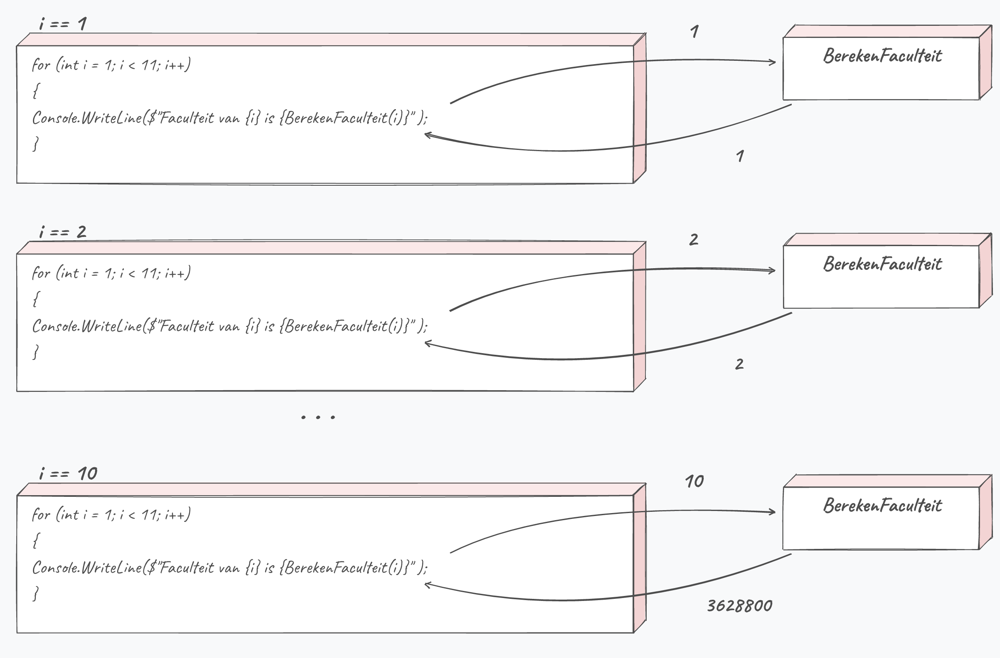

## Parameters doorgeven

Methoden zijn handig vanwege de herbruikbaarheid. Wanneer je een methode hebt geschreven om de sinus van een hoek te berekenen, dan is het echter ook handig dat je de hoek als parameter kunt meegeven zodat de methode kan gebruikt worden voor eender welke hoekwaarde. 

Indien er wel parameters nodig zijn dan geef je die mee als volgt:

```java
MethodeNaam(parameter1, parameter2, …);
```

Je hebt dit ook al geregeld gebruikt. Wanneer je tekst op het scherm wilt tonen dan roep je de ``WriteLine`` methode aan en geef je 1 parameter mee, namelijk hetgeen dat op het scherm moet komen. 

<!-- \newpage -->

### Methoden met formele parameters

Om zelf een methode te definiëren die 1 of meerdere parameters aanvaardt, dien je per parameter het datatype en een tijdelijk naam (identifier) te definiëren (*formele parameters*) in de methode-signatuur

Als volgt:

```java
static returntype MethodeNaam(type parameter1, type parameter2)
{
    //code van methode
}
```

Deze formele parameters zijn nu beschikbaar binnen de methode om mee te werken naar believen.

Stel bijvoorbeeld dat we onze ``FaculteitVan5`` willen veralgemenen naar een methode die voor alle getallen werkt, dan zou je volgende methode kunnen schrijven:

```java
static int BerekenFaculteit(int grens)
{
    int resultaat = 1;
    for (int i = 1; i <= grens; i++)
    {
        resultaat *= i;
    }
    return resultaat;
}
```

De naam ``grens`` kies je zelf. Maar we geven hier dus aan dat de methode ``BerekenFaculteit`` enkel kan aangeroepen worden indien er 1 actuele parameter van het type ``int`` wordt meegegeven.

Aanroepen van de methode gebeurt dan als volgt:

```java
int getal = 5;
int resultaat = BerekenFaculteit(getal);
```

Of sneller:

```java
int resultaat = BerekenFaculteit(5);
```

Als we even later ``resultaat`` dan zouden gebruiken zal er de waarde ``120``  in zitten.

:::{.callout-tip}
Wat je meegeeft is een **kopie** van de waarde. Pas je die kopie aan in de methode, dan verandert er niets aan de originele variabele van de aanroeper. Verderop in dit hoofdstuk, bij "Doorgeven van parameters", zie je dat in actie.
:::

Je zou nu echter de waarde van getal kunnen aanpassen (door bijvoorbeeld aan de gebruiker te vragen welke faculteit moet berekend worden) en je code zal nog steeds werken.

:::{.callout-warning}
Veel beginnende programmeurs zijn soms verward dat de naam van de parameter in de methode (bv. ``grens``) niet dezelfde moet zijn als de naam van de variabele (of literal) die we bij de aanroep meegeven.

Het is echter logisch dat deze niet noodzakelijk gelijk moeten zijn: het enige dat er gebeurt is dat de methodeparameter de waarde krijgt die je meegeeft, ongeacht van waar de parameter komt.
:::

En wat als je de faculteiten wenst te kennen van alle getallen tussen 1 en 10?  Dan zou je schrijven:

```java
for (int i = 1; i < 11; i++)
{
    Console.WriteLine($"Faculteit van {i} is {BerekenFaculteit(i)}" );
}
```



 
 <!-- \newpage -->

Dit zal als resultaat geven:

```
Faculteit van 1 is 1
Faculteit van 2 is 2
Faculteit van 3 is 6
Faculteit van 4 is 24
Faculteit van 5 is 120
Faculteit van 6 is 720
Faculteit van 7 is 5040
Faculteit van 8 is 40320
Faculteit van 9 is 362880
Faculteit van 10 is 3628800
```

:::{.callout-tip}
Merk op dat dankzij je methode, je véél code maar één keer moet schrijven, wat de kans op fouten verlaagt.
:::

#### Even zelf invullen

Vul in wat ``grens`` bevat tijdens de methode, en wat je terugkrijgt:

| aanroep | ``grens`` | resultaat |
|---|---|---|
| ``BerekenFaculteit(4)`` | ? | ? |
| ``BerekenFaculteit(getal)``, met ``getal`` gelijk aan 3 | ? | ? |
| ``BerekenFaculteit(i)`` in de lus hierboven, op het moment dat ``i`` 5 is | ? | ? |

:::{.callout-note collapse="true"}
## Antwoord
4 en 24, 3 en 6, 5 en 120. De naam links speelt geen rol: enkel de waarde reist mee naar ``grens``.
:::

### Volgorde van parameters

De volgorde waarin je je parameters meegeeft bij de aanroep van een methode is belangrijk. De eerste variabele wordt aan de eerste parameter toegekend, enz. Het volgende voorbeeld toont dit. 

Stel dat je een methode hebt:

```java
static void ToonDeling(double teller, double noemer)
{
    if (noemer != 0)
    {
        Console.WriteLine(teller / noemer);
    }
    else
    {
        Console.WriteLine("Een zwart gat ontstaat!");
    }
}
```

Deze 2 aanroepen zullen dus een andere output geven:

```java
ToonDeling(3.5, 2.1);
ToonDeling(2.1, 3.5);
```

Op het scherm verschijnt:

::: {.console}
```text
1,6666666666666665
0,6
```
:::

Zeker wanneer je met verschillende types als formele parameters werkt is de volgorde belangrijk. Het verschil met de vorige methode is hier wel dat VS jou zal helpen wanneer je volgorde niet klopt. 

Stel dat we volgende methode hebben gemaakt:

```java
static void ToonInfo(string naam, int leeftijd)
{
   Console.WriteLine($"{naam} is {leeftijd} jaar oud");
}
```

Deze aanroep is correct:

```java
ToonInfo("Tim", 37);
```

Maar deze is **FOUT** en zal niet compileren:

```java
ToonInfo(37, "Tim"); //mag niet!
```

:::{.callout-note}
Bekijk je in Visual Studio de mogelijkheden van ``Console.WriteLine``, dan zie je bij een van de versies ``params object[] arg`` staan. Het keyword ``params`` betekent: hier mag je zoveel parameters meegeven als je wil, ook geen enkele. Zelf zo'n methode schrijven kan pas als je arrays kent, dus dat houden we tegoed voor hoofdstuk 8.
:::

### Doorgeven van parameters

Parameters kunnen op 2 manieren worden doorgegeven aan een methode:

1. **By value** : hierbij wordt **een kopie gemaakt van de huidige waarde**. Het is die kopie die wordt meegegeven.
2. **by reference**: in plaats van een kopie wordt het *adres* (de zogenaamde **pointer** of **reference**) van de originele variabele meegegeven. Aanpassingen in de methode zijn daardoor óók buiten de methode zichtbaar, op de originele variabele. Dit hebben we voorlopig nog niet nodig: het komt uitgebreid aan bod vanaf het hoofdstuk over arrays (H8). Lig er nu dus nog niet van wakker als dit nog wat abstract aanvoelt.

Het effect van manier 1 is hopelijk duidelijk: wanneer je in een methode de inhoud van een actuele parameter aanpast, dan heeft dat geen gevolg op de originele variabele die we meegaven bij de methode-aanroep!

Dit zien we in dit programma:

```java
static void JaartjeOuder(int leeftijd)
{
    leeftijd++;
    Console.WriteLine($"Hoera. Je bent {leeftijd} jaar geworden.");
}
static void Main(string[] args)
{
    int mijnLeeftijd = 40;
    Console.WriteLine($"Je bent {mijnLeeftijd} jaar.");
    JaartjeOuder(mijnLeeftijd);
    Console.WriteLine($"Je bent {mijnLeeftijd} jaar.");
}
```

In de output zien we dat ``mijnLeeftijd`` niet werd aangepast in de methode:

::: {.console}
```text
Je bent 40 jaar.
Hoera. Je bent 41 jaar geworden.
Je bent 40 jaar.
```
:::


:::{.callout-tip}
Ook een ``int`` kan je by reference meegeven. Daarvoor bestaan de keywords ``ref`` en ``out``. Je bent ``out`` misschien al tegengekomen bij ``int.TryParse``, dat we in hoofdstuk 4 al even aankondigden:

```java
if (int.TryParse(Console.ReadLine(), out int leeftijd))
```

De methode zet zelf een waarde in ``leeftijd``, en jij kan daarna met die variabele verder. Hoe je zoiets zelf schrijft lees je in [de appendix](../B_appendix/2_outenref.md).
:::

### Stagiair Steven

> Steven moet een getal verdubbelen met een methode. De A.I. schreef de methode netjes, en Steven roept ze als volgt aan:
>
>```csharp
>static int Verdubbel(int getal)
>{
>    return getal * 2;
>}
>
>static void Main(string[] args)
>{
>    int punten = 5;
>    Verdubbel(punten);
>    Console.WriteLine($"Punten: {punten}");
>}
>```
>
>"Ik roep ``Verdubbel`` op, dus ``punten`` is nu 10", zegt hij zelfzeker.

Wat verschijnt er op het scherm, en wat ging er mis in Stevens denken?

:::{.callout-note collapse="true"}
## Antwoord
Er verschijnt ``Punten: 5``. Twee dingen lopen mis. Ten eerste werkt ``Verdubbel`` *by value*: de methode krijgt een kopie van ``punten`` en kan de originele variabele niet wijzigen. Ten tweede, en dat is de echte fout, vangt Steven het resultaat van de methode nergens op. ``Verdubbel(punten);`` berekent wel ``10``, maar dat getal wordt niet bewaard en gaat verloren. Hij had ``punten = Verdubbel(punten);`` moeten schrijven. De methode compileert en draait zonder klacht, dus kreeg Steven geen waarschuwing en nam hij aan dat het wel goed zat.
:::
