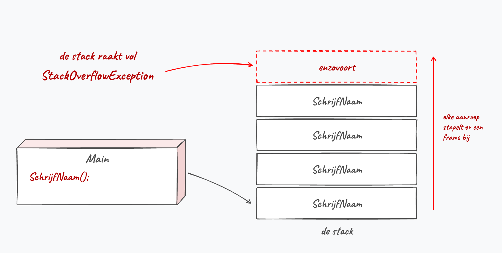
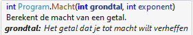

## Methoden combineren

### Methoden nesten

In het begin ga je vooral vanuit je ``Main`` methoden aanroepen, maar dat is geen verplichting. Je kan ook vanuit methoden andere methoden aanroepen. Je kan zelfs vanuit die aangeroepen methode weer andere aanroepen, enz. 

Volgende (nutteloze) programma'tje toont dit in actie:

```java
static void SchrijfT()
{
    Console.Write("T");
}
static void SchrijfI()
{
    Console.Write("I");
}
static void SchrijfM()
{
    Console.Write("M");
}
static void SchrijfNaam()
{
    SchrijfT();
    SchrijfI();
    SchrijfM();
}
public static void Main()
{
    SchrijfNaam();
}
```

Er verschijnt "Tim" op het scherm.

<!--{width=70%}-->

:::{.callout-tip}
De volgorde waarin je je methoden in je bestand schrijft maakt niets uit. ``SchrijfNaam`` mag dus perfect ónder ``Main`` staan, ook al roept ``Main`` ze al op de eerste lijn aan. Bij variabelen is dat wél anders: die moet je declareren voor je ze gebruikt.
:::

### Hoe groot mag een methode zijn?

Er bestaat geen regel die zegt hoeveel lijnen een methode mag tellen, maar er is wel een goede vuistregel: **een methode doet één ding**. Krijg je de naam van je methode niet bedacht zonder er "En" in te stoppen (``LeesInEnBerekenEnToon``), dan zitten er eigenlijk drie methoden in.

Twijfel je? Stel jezelf de vraag of je in één zin kan uitleggen wat de methode doet. Lukt dat niet, dan splits je ze best op. In de kennisclip "Goede methoden schrijven" ga ik hier dieper op in.

### Oneindige methode-lussen

Wanneer je programma's complexer worden moet je zeker opletten dat je geen oneindige *methode-lussen* creëert. Zie je de fout in volgende code?

```java
public static void Main()
{
    SchrijfNaam();
}
static void SchrijfNaam()
{
    SchrijfNaam();
    Console.WriteLine("Klaar?");
}
```

Deze code heeft een methode die zichzelf aanroept, zonder dat deze ooit afsluit. Hierdoor komen we dus in een oneindige aanroep van de methode ``SchrijfNaam``. Dit programma zal een leeg scherm tonen (daar er nooit aan de tweede lijn in de methode wordt geraakt) en dan crashen met een ``StackOverflowException``. Iedere aanroep neemt namelijk een stukje geheugen in op de zogenaamde *stack*, en die raakt vol. Wat die stack precies is lees je in hoofdstuk 10.



### Recursie in het kort

> Even ingrijpen en je wijzen op recursie zodat je code niet in je gezicht blijft ontploffen. 

**Recursie** is een geavanceerd programmeerconcept wat niet in dit boek wordt besproken (enkel in hoofdstuk 18 gaan we recursie nog kort ontmoeten), maar laten we het hier kort toelichten. Recursieve methoden zijn methoden die zichzelf aanroepen maar wél op een gegeven moment stoppen wanneer dat moet gebeuren. Volgend voorbeeld is een recursieve methode om de som van alle getallen tussen ``start`` en ``stop`` te berekenen:

```java
static int BerekenSomRecursief(int start, int stop)
{
    int som = start;
    if(start < stop)
    {
        start++;
        return som + BerekenSomRecursief(start, stop);
    }
    return som;
}
```
Je herkent recursie aan het feit dat de methode zichzelf aanroept. Maar een controle voorkomt dat die aanroep blijft gebeuren zonder dat er ooit een methode wordt afgesloten. We krijgen 6 terug (1+2+3) als we de methode als volgt aanroepen:

```java
int einde = BerekenSomRecursief(1,3);
``` 


<!-- \newpage -->

### Lokale functies...en waarom je ze beter niet gebruikt

<!-- TODO ed.5 (review): screenshot toevoegen van hoe je per ongeluk in een lokale functie belandt (VS auto-suggestions). -->

Sinds C# 7.0 kan je methoden definiëren binnenin een andere methode. Dit noemt men **lokale functies**  (*local functions*). Alhoewel ze zeker hun nut hebben, is het in deze fase van C# leren **geen goed idee om lokale functies te gebruiken**. 

Het is veel belangrijker dat je eerst goed leert methoden schrijven. Beginnende programmeurs schrijven soms per ongeluk een lokale functies. Dan ontdekken ze dat ze die methode nergens kunnen aanroepen. Lokale functies zijn alleen oproepbaar binnen de methode waarin ze zijn gedefinieerd.


Kortom, zorg dat je nooit dit schrijft!

```java
static void Main(string[] args)
{
    TimVindtDitNietLeuk();

    static void TimVindtDitNietLeuk() //NIET DOEN!
    {
        Console.WriteLine("Doe dit niet!");
    }
}
```

Maar wel

```java
static void TimVindtDitNietLeuk() //Beter!
{
    Console.WriteLine("Doe dit niet!");
}

static void Main(string[] args)
{
    TimVindtDitNietLeuk();
}
```

:::{.callout-important}
Dit is niet enkel een kwestie van smaak: op een vaardigheidsproef kost een methode in een methode je [3 punten](../B_appendix/boete.md#boete-method).
:::

<!-- \newpage -->

## Commentaar aan methoden toevoegen

Het is aan te raden om steeds boven een methode een nieuwe vorm van commentaar te plaatsen als volgt (dit werkt enkel bij methoden): ``///``

Visual Studio zal dan automatisch de parameters verwerken van je methode zodat je vervolgens enkel nog het doel van iedere parameter moet schrijven.

Stel dat we een methode hebben geschreven die de macht van een getal berekent (wat dom is...er bestaat al zoiets als ``Math.Pow``). We zouden dan volgende commentaar toevoegen:

```java
/// <summary>
/// Berekent de macht van een getal.
/// </summary>
/// <param name="grondtal">Het getal dat je tot macht wilt verheffen</param>
/// <param name="exponent">De exponent van de macht</param>
/// <returns></returns>
static int Macht(int grondtal, int exponent)
{
    int result = 1;
    for (int i = 0; i < exponent; i++)
    {
        result *= grondtal;
    }
    return result;
}
```

Wanneer we nu elders de methode ``Macht`` gebruiken dan krijgen we automatische extra informatie:

<!--{width=50%}-->
