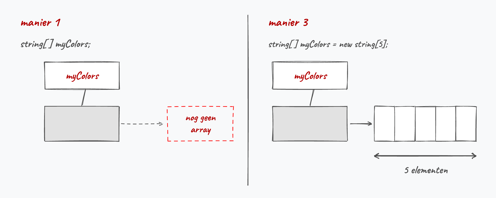

# Arrays <!--\label{ch:8}-->

Arrays zijn een veelgebruikt principe in vele programmeertalen. Het grote voordeel van arrays is dat je één enkele variabele kunt hebben die een grote groep waarden voorstelt van eenzelfde type. Hierdoor wordt je code leesbaarder en eenvoudiger in onderhoud. Arrays zijn een zeer krachtig hulpmiddel, maar er zitten wel enkele venijnige addertjes onder het gras.

Op papier zijn arrays eenvoudig...helaas programmeren we zelden nog op papier. Eigenlijk is een array niets meer dan **een verzameling waarden van hetzelfde datatype**. Deze aparte waarden kunnen benaderd worden via 1 enkele variabele, de array zelf. Door middel van een **index** kan ieder afzonderlijk element uit de array aangepast of uitgelezen worden.

Een nadeel van arrays is dat, eens we de lengte van een array hebben ingesteld, deze lengte niet meer kan veranderd worden. In het hoofdstuk 12 zullen we leren werken met lists en andere collections die dit nadeel niet meer hebben.

:::{.callout-tip}
Wanneer kies je nu een array en wanneer een ``List``? De vuistregel is simpel: ligt het aantal elementen op voorhand vast (12 maanden, 7 dagen, 64 vakjes op een schaakbord), dan neem je een array. Moet er tijdens de uitvoer van je programma iets bij kunnen komen of weg kunnen vallen (een winkelmandje, de spelers die zich aanmelden), dan heb je een ``List`` nodig.

Let ook op de naamgeving zodra je beide door elkaar gebruikt: het aantal elementen van een array vraag je op met ``Length``, dat van een ``List`` met ``Count``. Bij een ``string`` is het dan weer ``Length`` (het aantal karakters). Verwar die twee niet, want een array heeft geen ``Count``-eigenschap en de foutmelding die je dan krijgt zegt niet bepaald duidelijk wat er scheelt.
:::

De nadelen zullen we echter met plezier erbij nemen wanneer we programma's beginnen schrijven die werken met véél data van dezelfde soort:  eenvoudigweg kan je stellen dat van zodra je 3 of meer variabelen hebt die dezelfde soort data bevatten (en dus van hetzelfde datatype zijn), een array bijna altijd de oplossing zal zijn.

## Nut van arrays

Stel dat je de dagelijkse neerslag wenst te bewaren om zo later de gemiddelde regen te berekenen. Dit kan je zonder arrays eenvoudig:

```java
int dag1 = 34;
int dag2 = 45;
int dag3 = 0;
int dag4 = 34;
int dag5 = 12;
int dag6 = 0;
int dag7 = 23;
```

Als we je nu vragen om de gemiddelde neerslag te berekenen dan krijg je al een redelijk lang statement:

```java
double gemiddelde = (dag1+dag2+dag3+dag4+dag5+dag6+dag7)/7.0;
```

Maar wat als je plots de neerslag van een heel jaar wenst te bewaren. Of een hele eeuw? Of een millennium?! Van zodra je een bepaalde soort informatie hebt die je veelvuldig wenst te bewaren dan zijn arrays dus de oplossing.

Voorgaande lijst van 7 aparte variabelen kunnen we eenvoudiger definiëren met 1 array (we bespreken de details verderop), genaamd ``regen``:

```java
int[] regen = {34, 45, 0, 34, 12, 0, 23}; 
```

<!--{width=80%}-->

Het gemiddelde berekenen kan dan als volgt:

```java
double gemiddelde = (regen[0]+regen[1]+regen[2]+regen[3]+regen[4]+regen[5]+regen[6])/7.0;
```

Dat lijkt niet veel beter...Integendeel. We zitten nu ook nog met een hoop vierkante haakjes (``[]``) in onze code. 

<!-- \newpage -->

De kracht van arrays komt nu: het getal tussen die vierkante haakjes (de index) kan je als een variabele beschouwen en dus ook dynamisch genereren in een loop. Volgend voorbeeld toont hoe we bijvoorbeeld een langere array van elementen met een for-loop overlopen om de som van alle elementen te berekenen:

```java
int[] regen = {34, 45, 0, 34, 12, 0, 23, 7, 20, 34, 7, 42}; //aanmaken array
double som = 0;
for(int i = 0; i<regen.Length;i++)
{
    som += regen[i]; //element per element uit array optellen
}
double gemiddelde = som/regen.Length;
```

>Sorry dat we weer even in het diepe water zijn gedoken. Het leek ons nuttig om even het totaalplaatje van arrays alvast uit de doeken te doen, zodat je snapt waarom er hier zo enthousiast over arrays wordt gedaan. 
>
>Alles wordt kinderspel, als je maar lang genoeg met iets bezig bent. Zelfs de code die we net toonden met die arrays zou je niet meer zo erg mogen afschrikken. Ok, er staan wat nieuwe termen tussen, maar al bij al zouden de grote lijnen van het algoritme en de werking ervan duidelijk moeten zijn. Blijf dus maar hier lekker in het diep dobberen en ontdek verder waarom arrays zo'n krachtig concept zijn.

<!-- \newpage -->

## Een array aanmaken

Een array creëren (declareren) kan op 3 manieren. 

### Manier 1

De eenvoudigste variant is deze waarbij je een array variabele aanmaakt, maar deze nog niet initialiseert. Je maakt enkel een identifier aan, maar zet er nog niets in. De syntax is als volgt:

```java
type[] arraynaam;
```

Type kan eender welk bestaand datatype zijn dat je reeds kent. De [] (vierkante haken of *square brackets*) duiden aan dat het om een array gaat.

Voorbeelden van array declaraties kunnen dus bijvoorbeeld zijn:

```java
int[] verkoopCijfers;
double[] gewichtHuisdieren;
bool[] examenAntwoorden;
ConsoleColor[] mijnKleuren;
```

Op dit punt bestaan de arrays nog niet. **Hun lengte ligt nog niet vast**. In het geheugen is enkel een klein stukje geheugen gereserveerd voor een toekomstige referentie (of pointer) naar een array (wat we zo meteen gaan uitleggen).

Stel dat je een array van strings wenst waarin je verschillende kleuren zal plaatsen dan schrijf je:

```java
string[] myColors;
```

Vervolgens kunnen we later waarden toekennen aan de array:

```java
string[] myColors;
myColors = new string[] {"red", "green", "yellow", "orange", "blue"};
```

Je array zal na lijn 2 **een lengte van 5 hebben en kan niet meer groeien of krimpen**. Merk op dat je hier ``new string[]`` nodig hebt: enkel bij het *initialiseren tijdens de declaratie* (manier 2 hieronder) mag je de korte ``{...}``-vorm zonder ``new`` gebruiken.

<!-- \newpage -->

### Manier 2

Indien je ogenblikkelijk waarden wilt toekennen (*initialiseren*) tijdens het aanmaken van de array zelf dan mag dit ook als volgt:

```java
string[] myColors = {"red", "green", "yellow", "orange", "blue"};
```

Ook hier zal na lijn 1 je array een vaste lengte van 5 elementen hebben. 

Merk op dat deze manier dus enkel werkt indien je reeds weet welke waarden in de array moeten. In manier 1 kunnen we perfect een array aanmaken en pas veel later in het programma ook effectief waarden toekennen (bijvoorbeeld door ze stuk per stuk door een gebruiker te laten invoeren).

:::{.callout-tip}
Sinds C# 12 (.NET 8) mag je in de plaats van de accolades ook vierkante haken gebruiken. Dat heet een **collection expression**:

```java
string[] myColors = ["red", "green", "yellow", "orange", "blue"];
```

Visual Studio stelt die vorm vaak zelf voor, dus je zal ze vroeg of laat tegenkomen. Het resultaat is exact dezelfde array, maar er is een belangrijk verschil in waar je ze mag gebruiken: **de accolade-vorm mag enkel op de lijn waar je de variabele declareert**, de vierkante haken mogen overal waar C# het type al kent. Dit werkt dus wel:

```java
string[] myColors;
myColors = ["red", "green"];    //mag
```

Terwijl dit een compilerfout geeft:

```java
string[] myColors;
myColors = {"red", "green"};    //mag niet
```

Dat is precies de reden waarom je in manier 1 hierboven ``new string[]`` moest schrijven. Ook als je een array rechtstreeks aan een methode wil meegeven werkt enkel de vorm met vierkante haken: ``ToonKleuren(["red", "green"])``.

Eén valkuil: ``var myColors = ["red", "green"];`` compileert niet. C# moet weten wélk soort verzameling je precies wil, en dat kan het uit de vierkante haken alleen niet afleiden. Schrijf het type dus voluit.
:::

### Manier 3

Nog een andere manier om arrays aan te maken is diegene waarbij je aangeeft hoe groot de array moet zijn. We gaan echter nog niet effectief waarden in de array plaatsen.

```java
string[] myColors;
myColors = new string[5];
```

Uiteraard kan dit ook in 1 stap:

```java
string[] myColors = new string[5];
```

We geven hier aan dat de array vanaf z'n prille bestaan 5 elementen kan bevatten. Die elementen zijn niet onbestaande: ze krijgen allemaal meteen de **defaultwaarde** van hun datatype. Voor de types die je al kent is dat:

| datatype | defaultwaarde |
|---|---|
| ``int``, ``long`` | ``0`` |
| ``double``, ``float`` | ``0`` |
| ``bool`` | ``false`` |
| ``char`` | ``\0``, het "niets"-karakter |
| ``string`` | ``null``, zie de waarschuwing hieronder |

Schrijf je dus ``int[] cijfers = new int[3];``, dan staan er meteen drie nullen in en kan je daar gerust al mee rekenen.

<!--{width=80%}-->

:::{.callout-warning}
Bij een array van ``string`` moet je opletten. Na ``new string[5]`` bevat die array **geen vijf lege teksten**, maar vijf keer de waarde ``null``: er staat nog helemaal niets in. Dat is verwarrend, want zo'n element ziet er bij het tonen gewoon leeg uit:

```java
string[] myColors = new string[5];
Console.WriteLine(myColors[0]);         //toont een lege lijn
Console.WriteLine(myColors[0] == "");   //toont False!
Console.WriteLine(myColors[0].Length);  //crasht
```

Die laatste lijn geeft een ``NullReferenceException``. Wat ``null`` juist is en waarom je code daarop stukloopt zie je in hoofdstuk 10. Hou het voorlopig hierbij: vul de elementen van een string-array eerst zelf in voor je er iets mee doet.
:::

:::{.callout-tip}
Ook hier geldt dat de lengte vanaf dan vastligt. Er is één ontsnappingsroute, want met ``Array.Resize`` kan je een array "vergroten" of "verkleinen":

```java
int[] cijfers = {8, 12, 5};
Array.Resize(ref cijfers, 5);   //cijfers heeft nu 5 elementen: 8, 12, 5, 0, 0
```

<!--{width=60%}-->

Let op de aanhalingstekens rond "vergroten". Achter de schermen maakt C# een gloednieuwe array van 5 elementen aan, kopieert de oude waarden erin en laat je variabele naar die nieuwe array wijzen. De originele array is dus niet gegroeid, hij is vervangen. Daarom is het ``ref`` keyword hier ook verplicht. Bij grote arrays is dit een dure operatie en had je waarschijnlijk beter meteen een ``List`` genomen.
:::

### Overzicht van de manieren

Zet je alle vormen naast elkaar, dan zie je dat het verschil telkens zit in wat er rechts van het ``=`` staat:

| manier | code | bestaat de array al? | lengte | inhoud |
|---|---|---|---|---|
| 1 (declareren) | ``int[] cijfers;`` | nee | ligt nog niet vast | niets |
| 1 (later vullen) | ``cijfers = new int[] {8, 12, 5};`` | ja | 3 | 8, 12 en 5 |
| 2 | ``int[] cijfers = {8, 12, 5};`` | ja | 3 | 8, 12 en 5 |
| 3 | ``int[] cijfers = new int[3];`` | ja | 3 | 3 keer de defaultwaarde, voor ``int`` is dat ``0`` |

<!--{width=90%}-->

:::{.callout-important}
Er is een essentieel verschil tussen manier 1 en 3. Wanneer je bij de sectie "Geheugengebruik bij arrays" bent zal je dit ontdekken. *Spoiler*: in manier 1 wordt er nooit een array aangemaakt in de eerste lijn. In manier 3 wél, dankzij het ``new`` keyword.
:::
