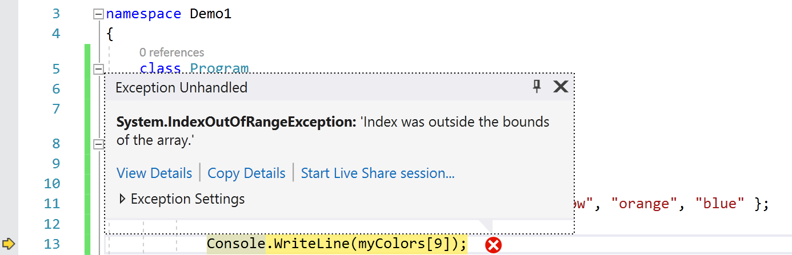

## Elementen van een array aanpassen en uitlezen

Van zodra er waarden in een array staan of moeten bijgeplaatst worden kan je deze benaderen met de zogenaamde **array accessor** notatie. Deze notatie is heel eenvoudigweg de volgende:

```java
myColors[2]; //element met index 2
```

We plaatsen de naam van de array, gevolgd door vierkante haakjes waarbinnen een getal, 2 in dit voorbeeld, aangeeft het hoeveelste element we wensen te benaderen (lezen en/of schrijven). Deze nummering start vanaf 0.

:::{.callout-important}
**De index van een C#-array start steeds bij 0.** Indien je dus een array aanmaakt met lengte 5 dan heb je de indices 0 tot en met 4.

<!--{width=30%}-->

:::

><!--{width=12%}--> **Veelgemaakte fouten bij arrays gebeuren op de lengte en indexering ervan.**
>
>Het gebeurt vaak dat beginnende programmeurs verward geraken omtrent het aanmaken van een array aan de hand van de lengte en het indexeren erna. Maar niet getreurd, ik zal je hier extra tips geven.
>
>De regels zijn duidelijk:
>
>* Bij het maken van een array is de lengte van een array gelijk aan het aantal elementen dat er in aanwezig is. *Dus een array met 5 elementen heeft als lengte 5.*
>* Bij het schrijven en lezen van individuele elementen uit de array (zie hierna) gebruiken we een indexering die start bij **0**. Bijgevolg is **4** de index van het laatste element in een array met **lengte 5**.

<!-- \newpage -->

### Lezen

Je weet nu hoe je individuele waarden in een array kan benaderen. Ze gebruiken is exact hetzelfde zoals we in het verleden al met eender welke andere variabele hebben gedaan. Het enige verschil is dat de identifier vierkante haken met een index in bevat om aan te geven welke element we nodig hebben van de array.

Wanneer je dus het tweede element van een array wenst te gebruiken kan dit bijvoorbeeld als volgt:

```java
Console.WriteLine(myColors[1]);
```

of ook

```java
string kleurkeuze = myColors[1];
```

of zelfs

```java
if(myColors[1] == "pink")
```

Kortom, alles wat je al kon, kan ook met arrays. Je kan ze zelfs als parameters aan methoden meegeven of terugkrijgen (zie verder). **De individuele elementen in een array zijn gewone variabelen** (enkel hun naamgeving is gekoppeld aan die van de array en de index van het element in de array).

<!-- BESLIST (Tim): foreach komt bewust pas in H12 (11_arraysvanklassen/3_foreach.md), niet in dit hoofdstuk. Ook niet vermelden als vooruitblik. -->
<!-- TODO ed.5 (review): LINQ-vooruitblik (.Sum(), .Average()) kort noemen bij het gemiddelde-voorbeeld; lost de "ziet er nog niet beter uit"-opmerking op. -->

:::{.callout-warning}
Een array proberen te tonen als volgt gaat niet:

```java
Console.WriteLine(myColors);
```

De enige manier alle elementen van een array te tonen is door manueel ieder element individueel naar het scherm te sturen. Bijvoorbeeld:

```java
for(int i = 0 ; i<myColors.Length;i++)
{
    Console.WriteLine($"{myColors[i]}");
}
```
:::

Stel dat we een array van getallen hebben, dan kunnen we bijvoorbeeld 2 waarden uit die array optellen en opslaan in een andere variabele als volgt:

```java
int[] numbers = {5, 10, 30, 45};
int som = numbers[0] + numbers[1];
```

De variabele som zal vervolgens de waarde 15 bevatten (5+10).

<!-- \newpage -->

Stel dat we *alle* elementen uit de array ``numbers`` met 5 willen verhogen, dan kunnen we schrijven:

```java
int[] numbers = {5, 10, 30, 45};
numbers[0] += 5;
numbers[1] += 5;
numbers[2] += 5;
numbers[3] += 5;
```

Maar eigenlijk zijn we dan het voordeel van arrays niet aan het gebruiken. Met loops maken we bovenstaande oplossing beter zodat deze zal werken, ongeacht het aantal elementen in de array[^vrolijkevrienden]:

```java
for(int teller = 0; teller < numbers.Length; teller++)
{
    numbers[teller] += 5;
}
```

[^vrolijkevrienden]: Zoals je merkt zijn loops en arrays dikke vrienden.

### Schrijven
Ook schrijven van waarden naar een array gebruikt dezelfde notatie. Enkel moet je dus deze keer de array accessor-notatie links van de toekenningsoperator plaatsen. Stel dat we bijvoorbeeld de waarde van het eerste element uit de ``myColors`` array willen veranderen van ``red`` naar ``indigo``, dan gebruiken we volgende notatie:

```java
myColors[0] = "indigo";
```
Als we bij aanvang nog niet weten welke waarden de individuele elementen moeten hebben in een array, dan kunnen we deze eerst definiëren, en vervolgens individueel toekennen:

```java
string[] myColors;
myColors = new string[5];
// ...
myColors[0] = "red";
myColors[1] = "green";
myColors[2] = "yellow";
myColors[3] = "orange";
myColors[4] = "blue";
```

:::{.callout-important}
Een veel gestelde vraag wanneer een programmeur het nut van arrays nog niet 100% ziet is het volgende. Stel dat je deze code hebt;

```java
int dag1 = 34;
int dag2 = 45;
int dag3 = 0;
int dag4 = 34;
int dag5 = 12;
int dag6 = 0;
int dag7 = 23;
```

*"Kan ik die namen (dag1, dag2, enz.) met een loop genereren/bereiken zodat ik iets kan doen als volgt?"* **OPGELET! Hier komt een zeer fout voorbeeld aan...**
```text
for(int i=1; i<=7; i++)
    dagi = ...
```

**Dat gaat niet!** De code op lijn 2 is verboden: van zodra je van plan bent om variabele-namen "dynamisch" in je code te proberen aan te roepen, moeten er tal van alarmbelletjes afgaan. De kans is dan héél groot dat je probleem beter met een array wordt opgelost dan met een boel variabelen met soortgelijke namen.
:::

## De lengte van de array te weten komen

Soms kan het nodig zijn dat je in een later stadium van je programma de lengte van je array nodig hebt. De ``Length``-eigenschap van iedere array geeft dit weer. Volgend voorbeeld toont dit:

```java
string[] myColors = {"red", "green", "yellow", "orange", "blue"};
Console.WriteLine($"Length of array = {myColors.Length}" );
```

De ``Length``-eigenschap wordt vaak gebruikt in for/while loops waarmee je de hele array wenst te doorlopen. Door de ``Length``-eigenschap te gebruiken als grenscontrole verzekeren we er ons van dat we nooit buiten de grenzen van de array zullen lezen of schrijven:

```java
//Alle elementen van een array tonen
for (int i = 0; i < getallen.Length; i++)
{
    Console.WriteLine(getallen[i]);
}
```

:::{.callout-important}
Elementen benaderen buiten de range van een array geeft erg dikke errors. Het jammer is dat VS dit soort subtiele 'out of range' bugs niet kan detecteren tijdens het compileren. Je zal ze pas ontdekken bij de uitvoer. Volgende code zal perfect gecompileerd worden, maar bij de uitvoer zal er op lijn 2 een foutboodschap verschijnen en het programma zal stoppen:

```java
int[] getallen = { 1,2,3 };
Console.WriteLine(getallen[5]);
```

Dit zal resulteren in een *"Index was outside the bounds of the array"*-fout. De officiële naam van deze exception is **``IndexOutOfRangeException``**: die naam zie je ook letterlijk in Visual Studio verschijnen wanneer het misgaat.

<!--{width=90%}-->

Hackers misbruiken dit soort fouten in code om toegang tot delen van het geheugen te krijgen waar ze eigenlijk niet mochten zijn. Dit zijn zogenaamde *buffer overflow attacks*.
:::

>Sorry dat ik je al weer lastig val. Maar ik wil je nog eens extra goed naar bovenstaande fout (*exception*) laten kijken. Prent die **Out of Range fout** goed in je hoofd. 
>
>Deze fout zegt exact wat er mis is: **je probeert elementen in een array te benaderen die niet bestaan omdat je buiten het bereik (*range*) van de array bent gegaan.** 
>
>Momenteel werken we aan een gebouw met 3 verdiepingen (``.Length`` is dus 3). Het is hetzelfde als wanneer ik tegen mijn personeel zeg: "ga jij de muur alvast metsen op de zesde verdieping (``gebouw[5]``)". Hij zal dan vermoedelijk van het gebouw vallen en nog net kunnen roepen: "Out of Range exception!!!!".

<!-- \newpage -->

## Volledig voorbeeldprogramma met arrays

Met al de voorgaande informatie is het nu mogelijk om vlot complexere programma's te schrijven, die veel data moeten kunnen verwerken. Meestal gebruikt men een for-loop om een bepaalde operatie over de hele array toe te passen.

Het volgende programma zal een array van integers aanmaken die alle gehele getallen van 0 tot 99 bevat. Vervolgens zal ieder getal met 3 vermenigvuldigd worden. Finaal tonen we enkel die getallen die een veelvoud van 4 zijn na de bewerking.

```java
//Array aanmaken
int[] getallen = new int[100]; 
//Array vullen
for (int i = 0; i < getallen.Length; i++)
{
    getallen[i] = i;
}
//Alle elementen met 3 vermenigvuldigen
for (int i = 0; i < getallen.Length; i++)
{
    getallen[i] = getallen[i] * 3;
}
//Enkel veelvouden van 4 op het scherm tonen
for (int i = 0; i < getallen.Length; i++)
{
    if(getallen[i] % 4 == 0)
        Console.WriteLine(getallen[i]);
}
```
