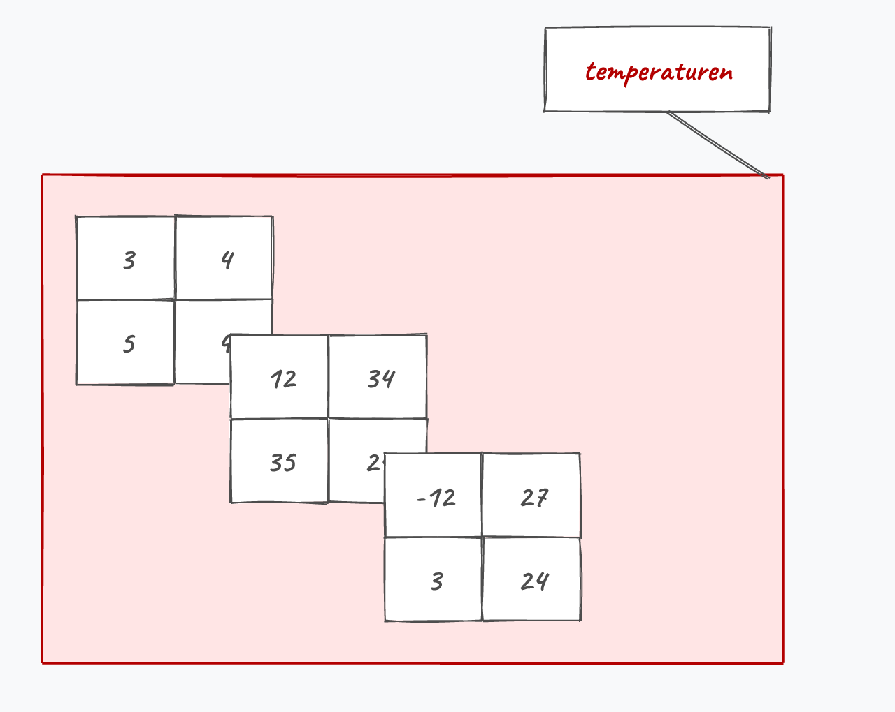
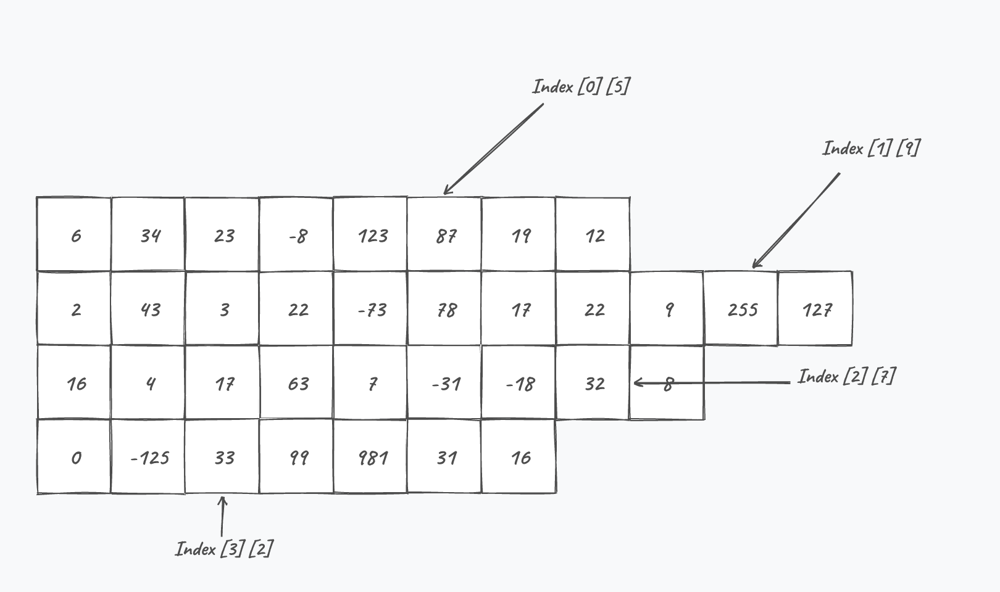

## Meer-dimensionale arrays
Voorlopig hebben we enkel met zogenaamde 1-dimensionale arrays gewerkt. Je kan echter ook meerdimensionale arrays maken. Denk maar aan een n-bij-m array om een matrix voor te stellen. Ik bespreek ze kort: je hebt ze duidelijk minder vaak nodig dan een gewone array, maar zodra je met een rooster werkt (een spelbord, een doolhof, een matrix, de pixels van een afbeelding) zijn ze wél precies het juiste gereedschap.

Stel je het voorbeeld aan het begin van dit hoofdstuk voor, waarin we de regenval gedurende 7 dagen wilden meten. Wat als we dit gedurende 4 weken wensen te doen, maar wel niet alle data in één lange array willen plaatsen? We zouden dan een 2-dimensionale array kunnen maken als volgt:

```java
int[,] regen = 
            {
                {34,45,0,34,12,0,23 },
                {34,5,0,74,1,4,5 },
                {7,45,8,24,12,12,13 },
                {34,4,0,34,2,0,23 }
            };
```


<!--{width=60%}-->


De arrays die we nu behandelen zullen steeds "rechthoekig" zijn. Daarmee bedoelen we dat ze steeds per rij of kolom evenveel elementen zullen bevatten als in de andere rijen of kolommen. 

:::{.callout-tip}
Arrays die per rij of kolom een andere hoeveelheid elementen hebben zijn zogenaamde **jagged arrays**, welke we onderaan dit hoofdstuk kort zullen bespreken.
:::


### n-dimensionale arrays aanmaken
Door een komma tussen rechte haakjes te plaatsen tijdens de declaratie van een array, kunnen we meer-dimensionale arrays maken. 

Bijvoorbeeld om een 2D array te maken schrijven we:


```java
char[,] spelbord;
```

Een 3D-array:

```java
short[,,] temperaturen;
```
(enz.)

:::{.callout-tip}
Ja, dit kan dus ook een 10-dimensionale array aanmaken. Kan handig zijn als je een fysicus bent die rond de supersnaartheorie onderzoek doet.

```java
int[,,,,,,,,,] jeBentGek;
```
Ja, 11 kan ook als je meer in de M-theorie gelooft. En zelfs 26 moest de bosonische snaartheorie meer je ding zijn:

```java
int[,,,,,,,,,,,,,,,,,,,,,,,,,] jeBentNogGekker;
```

De regel is eenvoudig: als je een 7-dimensionale array nodig hebt, is de kans groot dat je een volledig verkeerd algoritme hebt verzonnen ... of dat je nog niet aan hoofdstuk 9 bent geraakt ... of dat je een topwetenschapper in CERN bent. *Choose your reason!*
:::


### Initialisatie

Ook om nu effectief een array aan te maken gebruiken we de komma-notatie, alleen moeten we nu ook de effectieve groottes aangeven. Voor een 5 bij 10 array bijvoorbeeld schrijven we (merk op dat dit dus een 2D-array is):


```java
int[,] matrix = new int[5,10];
```

Onze regenval van 4 weken maken we dus zonder waarden aan als volgt:

```java
int[,] regen = new int[4, 7];
```

Het eerste getal is het aantal rijen, het tweede het aantal kolommen: 4 rijen van elk 7 elementen, samen dus 28 vakjes. Wil je de waarden meteen meegeven, dan gebruik je de accolade-notatie van hierboven.

Merk op dat zo'n rechthoekige array géén array van arrays is: die 28 getallen staan in het geheugen gewoon achter elkaar in één blok. Dat is meteen het verschil met de jagged arrays onderaan dit hoofdstuk, waar iedere rij wel degelijk een aparte array is.

:::{.callout-important}
## Een rooster of een klasse?
Een 2D-array werkt goed zolang **ieder vakje hetzelfde betekent**: millimeters regen, het cijfer van een kamer in een doolhof, de kleur van een pixel. Zodra de kolommen elk iets anders voorstellen, wringt het:

```java
string[,] boeken = 
    {
        {"Macbeth", "Shakespeare", "ID12341"},
        {"Before I Get Old", "Dave Marsh", "ID234234"},
        {"Security+", "Mike Pastore", "ID3422134"},
        {"Zie scherp", "Tim Dams", "ID007"}
    };
```

Alles moet hier een ``string`` zijn, ook een jaartal of een prijs die je later wil optellen. En ``boeken[2, 1]`` vertelt met geen woord dat kolom 1 de auteur bevat: zet je de kolommen ooit in een andere volgorde, dan leest je programma vrolijk de verkeerde gegevens uit zonder ook maar één foutmelding.

Vanaf hoofdstuk 9 schrijf je hiervoor een klasse ``Boek`` met een titel, een auteur en een ID, en in hoofdstuk 12 bewaar je die boeken dan in een doodgewone 1-dimensionale array. Een tweede dimensie heb je dan niet meer nodig.
:::

<!-- \newpage -->

### Een element lezen en schrijven

Stel dat we uit de regen-array de vijfde dag van de derde week wensen te tonen dan kunnen we schrijven:

```java
Console.WriteLine(regen[2, 4]);
```

Het eerste getal is de rij, het tweede de kolom, en beide starten net zoals bij een gewone array bij 0. Schrijven gaat op dezelfde manier:

```java
regen[0, 3] = 12;
```

### Lengte van iedere dimensie in een n-dimensionale matrix

Indien je de lengte opvraagt van een meer-dimensionale array dan krijg je het **totaal aantal elementen** (de lengtes van alle dimensies met elkaar vermenigvuldigd, dus niet opgeteld). Dit is logisch: in het geheugen van een computer worden arrays altijd als 1 dimensionale arrays voorgesteld. De ``regen`` array zal dus lengte 28 hebben (4*7) en niet 11.

Je kan echter de lengte van iedere aparte dimensie te weten komen met de ``.GetLength()`` methode die iedere array heeft. Als parameter geef je de dimensie mee waarvan je de lengte wenst:

```java
int aantalRijen = regen.GetLength(0);    //geeft 4 
int aantalKolommen = regen.GetLength(1); //geeft 7
```

Het aantal dimensies van een array wordt trouwens weergegeven door de ``.Rank`` eigenschap die ook iedere array heeft:

```java
Console.WriteLine(regen.Rank); //geeft 2
```

### Alle vakjes overlopen

Bij een gewone array had je één for-loop nodig om alle elementen te overlopen. Bij een 2D-array heb je er twee nodig, in elkaar genest: de buitenste loop gaat over de rijen, de binnenste over de kolommen van die ene rij.

```java
for (int week = 0; week < regen.GetLength(0); week++)
{
    for (int dag = 0; dag < regen.GetLength(1); dag++)
    {
        Console.Write($"{regen[week, dag]} ");
    }
    Console.WriteLine(); //nieuwe lijn na iedere week
}
```

Merk op dat we nergens de getallen 4 en 7 in onze loops schrijven, maar wel ``GetLength(0)`` en ``GetLength(1)`` gebruiken. Voeg je later een vijfde week toe, dan blijft deze code gewoon werken.

:::{.callout-warning}
Verwissel de twee indices niet. ``regen[dag, week]`` compileert perfect, want beide zijn nu eenmaal gewone ``int``-waarden, maar je programma crasht met een ``IndexOutOfRangeException`` zodra ``dag`` groter dan 3 wordt. Bij een rechthoekige array is de eerste index altijd de rij.
:::

<!-- \newpage -->

### Een 2D-array meegeven aan een methode

Net zoals een gewone array gaat ook een meerdimensionale array **by reference** naar een methode. In de parameter herhaal je gewoon de komma:

```java
static void ToonRooster(int[,] rooster)
{
    for (int rij = 0; rij < rooster.GetLength(0); rij++)
    {
        for (int kolom = 0; kolom < rooster.GetLength(1); kolom++)
        {
            Console.Write($"{rooster[rij, kolom]} ");
        }
        Console.WriteLine();
    }
}
```

Die roep je dan aan met ``ToonRooster(regen);``. Zet je in zo'n methode een waarde in het rooster, dan staat die er na de aanroep ook nog in: je werkt immers op de originele array en niet op een kopie.

:::{.callout-note collapse="true"}
## Voor wie ervan houdt: drie dimensies

Een 3D-array maak je op net dezelfde manier, met twee komma's:

```java
int[,,] temperaturen = 
    {
        {
            {3,4}, {5,4}
        },
        {
            {12,34}, {35,24}
        },
        {
            {-12,27}, {3,24}
        },
    };
```

<!--{width=60%}-->

Indexeren doe je dan met drie getallen:

```java
Console.WriteLine(temperaturen[2, 0, 1]);
```

Dit zal ``27`` teruggeven. We vragen van de laatste array (``[2]``), daarbinnenin de eerste rij (``[0]``) en daarvan het tweede element (``[1]``).

Zoals je ziet worden meerdimensionale arrays snel een kluwen van komma's, accolades en haakjes. Probeer dus je dimensies te beperken. Je zal zelden een 3 -of meer dimensionale array nodig hebben.
:::


### Jagged arrays

Jagged arrays (letterlijk *gekartelde arrays*) zijn wél echte **arrays van arrays**: je hebt één array waarin ieder vakje verwijst naar een volledig aparte array, en die aparte arrays mogen elk een eigen lengte hebben.

<!--{width=80%}-->

Je herkent ze aan de dubbele vierkante haken (en dus niet ``tickets[,]``), en ook het aanmaken gebeurt rij per rij met een eigen ``new``:

```java
double[][] tickets =
    {
      new double[] {3.0, 40, 24},
      new double[] {123, 31.3 },
      new double[] {2.1}
    };
```

Indexeren doe je vervolgens met twee paar haken in plaats van met een komma: het eerste paar duidt de rij aan, het tweede het element binnen die rij.

<!--{width=80%}-->

```java
Console.WriteLine(tickets[0][1]);     //40
Console.WriteLine(tickets.Length);    //3: het aantal sub-arrays
Console.WriteLine(tickets[1].Length); //2: de lengte van de tweede sub-array
```

De ``Length`` eigenschap van de jagged array zelf geeft dus het aantal sub-arrays terug, niet het totaal aantal getallen. Wil je weten hoe lang één bepaalde rij is, dan moet je die rij eerst zelf ophalen (``tickets[1].Length``), en dat antwoord verschilt van rij tot rij. Vergeet je dat, dan is een ``IndexOutOfRangeException`` snel gemaakt.

:::{.callout-tip}
Je moet jagged arrays vooral kunnen **herkennen**. Zelf zal je ze zelden schrijven: iedere rij is een apart object dat je apart moet aanmaken en apart op zijn lengte moet controleren, wat omslachtige en foutgevoelige code oplevert.

Zijn al je rijen even lang, gebruik dan een rechthoekige ``[,]``-array. Verschillen ze in lengte, dan ben je bijna altijd beter af met de collectie-klassen uit hoofdstuk 12, of met een klasse die zelf een array bijhoudt (hoofdstuk 9).
:::
