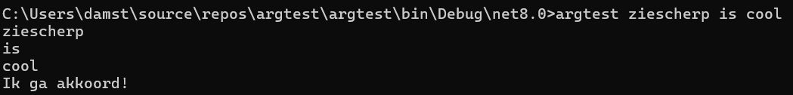

## Opstartparameters via args

Begrijp je nu wat ``string[] args`` wil zeggen in je ``Main``? Iedere ``Main`` heeft volgende methode-signatuur:

```java
static void Main(string[] args)
```

De ``args`` arrays kunnen we in ons programma uitlezen om eventuele opstartparameters te verwerken die de gebruiker meegaf bij de opstart van het programma. Ik heb dit nog nooit *in-depth* uitgelegd, maar laten we eens kijken hoe je dit doet. 

<!-- \newpage -->

Volg daarom volgende stappenplan:

1. Maak een nieuw console-project aan genaamd ``argstest``.
2. Voeg volgende code toe in je ``Main``:
```java
for (int i = 0; i < args.Length; i++)
{
    Console.WriteLine(args[i]);
}

if (args.Length>=3 && args[2]=="cool")
{
    Console.WriteLine("Ik ga akkoord!");
}
```
3. Compileer je programma. Run het gerust al eens, je zal zien dat het programma nog niet veel doet. Waarom? Omdat we geen opstartparameters hebben meegegeven. Laten we dat oplossen!
4. Ga via je verkenner naar je project-folder (vanuit VS kan dit snel door in de solution Explorer te rechterklikken op je project en dan de optie "Open folder in Explorer" te kiezen).
5. Open de ``bin`` folder, en open daarin dan de  ``debug`` folder, gevolgd door de ``net8.0`` folder (die laatste kan mogelijk anders zijn, afhankelijk van welke .NET versie je gebruikt). Hier staat je gecompileerde programma. In principe kan je hier dubbelklikken op je applicatie, maar dat zal niet veel doen, daar we nog steeds geen opstartparameters hebben meegegeven.
6. Nu goed opletten: klik in je verkenner bovenaan in de adresbalk, rechts van de tekst (niet er op). Je kan nu zelf iets intypen. Typ nu ``cmd`` in en druk enter.
7. Cool he. Je zit nu in een shell in de juiste folder.
8. Nu kan je je programma runnen mét opstartparameters. Kijk maar eens wat er gebeurt als je typt: ``argstest ziescherp is cool``



Inderdaad. De spaties gelden als "splitsing" tussen ieder argument. En dus ieder woord zal een apart element in de ``args`` array worden. Je zou nu bijvoorbeeld code kunnen schrijven die iets doet afhankelijk van de parameter, enz.

Let er zeker op dat je steeds met ``args.Length`` test of er wel genoeg opstartargumenten werden meegegeven. Daarom dat we  ``args.Length>=3 && args[2]=="cool"`` schreven (we hebben minstens 3 argumenten nodig om ``args[2]`` veilig te kunnen uitlezen).

:::{.callout-important}

De volgorde van operanden bij een && operator zijn belangrijk. Kijk wat er gebeurt als we de operanden omwisselen in de vorige ``if``:

```java
if ( args[2]=="cool" && args.Length>=3)
```

Als je deze versie uitvoeren met minder dan 3 opstartparameters, dan zal de applicatie crashen. Waarom? De ``&&``-operator werkt van links naar echts en zal stoppen met testen indien de linkse operand reeds ``false`` teruggeeft. Door dus éérst te testen of de lengte klopt, komen we enkel bij de ``args[2]``-code als die ook effectie kan aangeroepen worden.

Kortom: denk ook steeds goed na in welke volgorde je je conditionele testen beschrijft.
:::