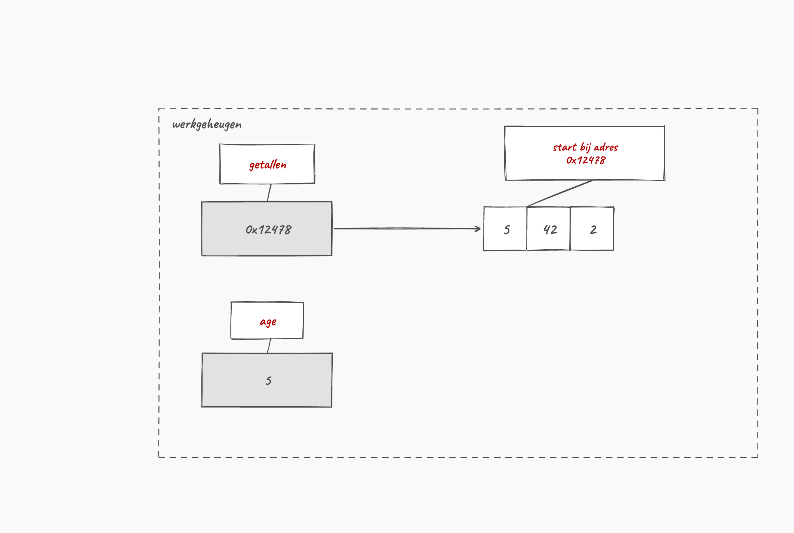
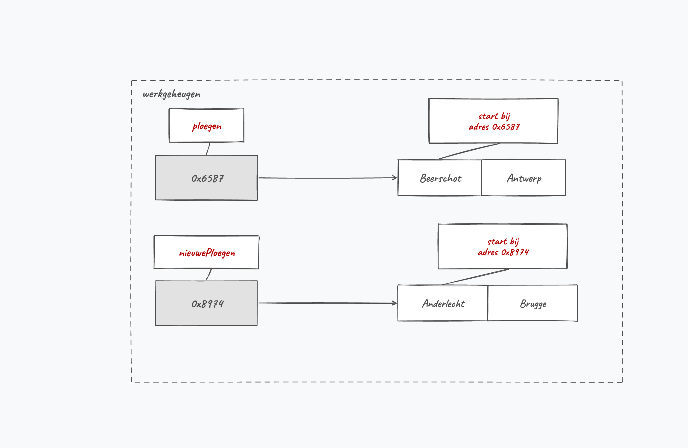
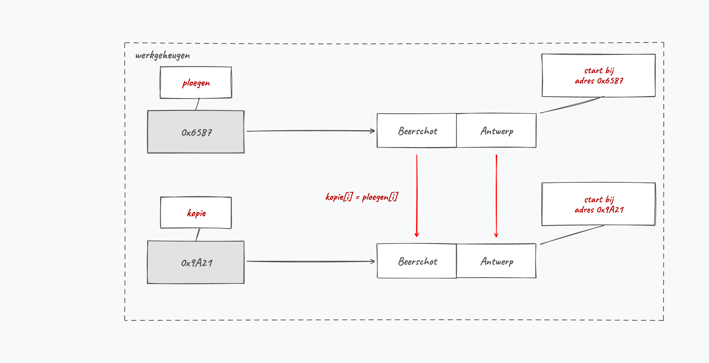

## Geheugengebruik bij arrays

Met arrays komen we voor het eerst dichter bij één van de sterktes van C#, namelijk het aspect **referenties**. Vanaf het volgende hoofdstuk zullen we hier ongelooflijk veel mee doen, maar laten we nu alvast eens kijken waarom arrays met referenties werken.

### Reference types en value types

We zagen reeds bij methoden dat variabelen eigenlijk op 2 manieren kunnen doorgegeven worden, *by reference of by value*. We herhalen dat hier nog eens:

* **Value** types: deze variabelen bevatten effectief de waarde die de variabele moet hebben. Als we schrijven ``int age = 5``, dan bewaren we de binaire voorstelling voor het geheel getal ``5`` in het geheugen. 
* **Reference** types: deze variabelen bewaren een geheugenadres naar een andere plek in het geheugen waar de effectieve waarde(n) van de variabele te vinden is. Reference types zijn als het ware een wegwijzer en worden ook soms **pointers** genoemd.

:::{.callout-tip}
Alle datatypes die we tot nog toe zagen - ``string`` is een speciaal geval en negeren we om nachtmerries te vermijden - werken steevast *by value*. Momenteel zijn het enkel arrays die we kennen die *by reference* werken in C#. In het volgende hoofdstuk zullen we zien dat er echter nog een hele hoop andere mysterieuze dingen (genaamd *objecten*) zijn die ook *by reference* werken. 
:::

**Arrays worden steeds by reference** in een variabele bewaard! Dat wil dus zeggen dat we niet de array zelf toekennen aan een variabele, maar wel het geheugenadres naar de array. Dit heeft natuurlijk gevolgen voor de manier waarop bijvoorbeeld de toekenningsoperator (``=``) werkt bij arrays.

### Arrays kopiëren

#### Het probleem als je arrays wilt kopiëren

Kijk wat er gebeurt bij volgende code:

```java
int[] getallen = {5,42,2};
int age = 5;
```

In ``getallen`` bewaren we enkel een geheugenadres dat wijst naar de plek waar de effectieve waarden elders in het geheugen staan. Terwijl in ``age`` effectief de waarde "5" zal bewaard worden. Onderstaande afbeelding geeft dit weer.

<!--{width=75%}-->

Het gevolg van voorgaande is dat volgende code niet zal doen wat je vermoedelijk wenst:

```java
string[] ploegen = {"Beerschot", "Antwerp"};
string[] nieuwePloegen = {"Anderlecht", "Brugge"};
nieuwePloegen = ploegen;
```

De situatie wanneer lijn 2 werd uitgevoerd is de volgende:

<!--{width=80%}-->

<!-- \newpage -->

Zonder het bestaan van *references* zou je verwachten dat op lijn 3 ``nieuwePloegen`` een kopie krijgt van de inhoud van ``ploegen``. Dat is dus niet zo.

Lijn 3 zal perfect werken. Wat er echter is gebeurd, is dat we de referentie naar ``ploegen`` ook in ``nieuwePloegen`` hebben geplaatst. **Bijgevolg verwijzen beide variabelen naar dezelfde array, namelijk die waar ``ploegen`` al naar verwees.** We hebben een soort *alias* gemaakt en kunnen nu op twee manieren de array met de Antwerpse voetbalploegen benaderen. De nieuwe situatie na lijn 3 is dus de volgende geworden:

<!--{width=80%}-->

Als je vervolgens schrijft:

```java
nieuwePloegen[1] = "Beerschot";
Console.WriteLine(ploegen[1]); //Beerschot!
```

Merk op dat ook ``ploegen`` mee verandert: we passen immers dezelfde array in het geheugen aan. Die eerste lijn is dus hetzelfde als onderstaande schrijven, daar beide variabelen naar dezelfde array-inhoud verwijzen. Het effect zal dus hetzelfde zijn.

```java
ploegen[1] = "Beerschot";
```

En waar staan de ploegen in de nieuwePloegen array (``"Anderlecht"`` en ``"Brugge"``)? **Die array in het geheugen is niet meer bereikbaar** (de garbage collector zal deze op het gepaste moment verwijderen, wat in hoofdstuk 10 zal toegelicht worden).

<!-- \newpage -->

#### De oplossing als je arrays wilt kopiëren

Wil je arrays kopiëren dan kan dat **niet** als volgt:

```java
string[] ploegen = {"Beerschot", "Antwerp"};
string[] nieuwePloegen = {"Anderlecht", "Brugge"};
nieuwePloegen = ploegen; //FAIL!!!
```

**Je moet manueel ieder individueel element van de ene naar de andere array kopiëren** als volgt:

```java
string[] kopie = new string[ploegen.Length];
for(int i = 0; i < ploegen.Length; i++)
{
    kopie[i] = ploegen[i];
}
```

Merk op dat we de nieuwe array eerst even groot maken als het origineel. Doe je dat niet, dan loop je met je index buiten de array en krijg je een ``IndexOutOfRangeException``.

<!--{width=80%}-->

:::{.callout-tip}
Er is een ingebouwde methode in de ``Array``-klasse (die zien we in de volgende sectie) die ook toelaat om arrays te kopiëren, genaamd ``Copy``. 
:::

:::{.callout-important}
Wanneer je met arrays van objecten (zie hoofdstuk 12) werkt dan zal bovenstaande mogelijk niet het gewenste resultaat geven daar we nu ook de individuele referenties van een object kopiëren!
:::
