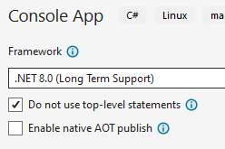
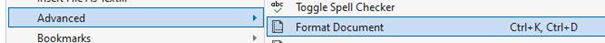

# Do's & don'ts in code ("boeteblad")

In programmeren zijn we streng in het verbeteren van code. Volgende afspraken worden gehanteerd bij de AP Hogeschool bij het verbeteren van vaardigheidsproeven.

Er zal steeds een puntenverdeling staan per sectie waar je punten kan scoren op het maken van de gevraagde functionaliteit. Het maximum van de score behaal je enkel voor deze sectie als je de vereisten van deze sectie perfect hebt geïmplementeerd én met de meest logische oplossingsstrategie (vb. geen loops gebruikt, maar alles hardcoded).

**MAAR indien je volgende zaken in je code hebt staan dan zullen er punten van je totaalscore afgetrokken worden.**

<!-- TODO (Tim): stapelen boetes zonder plafond, of is er een maximale aftrek per opgave?
     Zodra dat vastligt: hier één zin toevoegen onder de tabel. -->

## Overzicht

| Boete | Aftrek | Geldt |
|---|---|---|
| [Top-level statements gebruiken](#boete-toplevel) | -5 | altijd |
| [goto, break en continue](#boete-goto) | -3 | jaar 1 |
| [LINQ-methoden op arrays](#boete-linq) | -3 | jaar 1 |
| [Klassen niet in een apart bestand](#boete-klassenfile) | -3 | vanaf semester 2 |
| [Methoden in methoden definiëren](#boete-method) | -3 | t.e.m. hoofdstuk 8 |
| [Onnodige of redundante code](#boete-redundant) | tot -3 | altijd |
| [Naamgeving niet conform de conventies](#boete-naamgeving) | -2 | altijd |
| [Naamgeving niet consistent](#boete-taalconsistentie) | -2 | altijd |
| [Slordige bladspiegel](#boete-bladspiegel) | -1 | altijd |
| [Het project compileert niet](#boete-compileert) | -1 | altijd |

De kolom *Geldt* is belangrijk: een aantal boetes staan er om je iets te laten leren en verdwijnen daarna weer. Vanaf het tweede jaar mag je `break` en `continue` bijvoorbeeld wél gebruiken.

## Top-level statements gebruiken {#boete-toplevel}

**-5 punten** · geldt altijd

Bij het aanmaken van een nieuw project duid je steeds het vinkje "Do not use top-level statements" aan.

*Waarom:* je moet `Main`, `static` en `args` kunnen aanwijzen, benoemen en gebruiken. Met top-level statements staan die er niet, en dan kan je er ook niet over praten.

**5 punten?!** Inderdaad. Zo'n hekel hebben de lectoren aan top-level statements.



Ziet je `Program.cs` er zo uit, dan ben je het vinkje vergeten:

```java
// FOUT: top-level statements
Console.WriteLine("Hoeveel spelers?");
int aantalSpelers = Convert.ToInt32(Console.ReadLine());
```

Zo hoort het:

```java
// JUIST
namespace Casino
{
    internal class Program
    {
        static void Main(string[] args)
        {
            Console.WriteLine("Hoeveel spelers?");
            int aantalSpelers = Convert.ToInt32(Console.ReadLine());
        }
    }
}
```

## goto, break en continue {#boete-goto}

**-3 punten** · geldt in jaar 1

Zonder in debat te gaan: `goto` willen we nooit zien. Simpel. `break` is enkel toegestaan in een `switch` om een case af te sluiten. Elders (bv. in loops) zijn `break` en `continue` niét toegestaan.

*Waarom:* je moet eerst zelf deftig uit een loop leren geraken, en dat wil zeggen: je loopvoorwaarde zo schrijven dat de loop vanzelf stopt wanneer je klaar bent. Vanaf het tweede jaar mag je `break` en `continue` in loops wél gebruiken.

```java
// FOUT
for (int i = 0; i < getallen.Length; i++)
{
    if (getallen[i] == gezocht)
    {
        Console.WriteLine("Gevonden!");
        break;
    }
}
```

```java
// JUIST
bool gevonden = false;
int i = 0;

while (i < getallen.Length && !gevonden)
{
    if (getallen[i] == gezocht)
    {
        gevonden = true;
    }
    i++;
}

if (gevonden)
{
    Console.WriteLine("Gevonden!");
}
```

## LINQ-methoden op arrays {#boete-linq}

**-3 punten** · geldt in jaar 1

Zonder in detail te gaan, weet dat je bij arrays dankzij LINQ een aantal handige methoden hebt die je niet mag gebruiken. In jaar 1 doe je al je bewerkingen op arrays manueel m.b.v. loops.

*Waarom:* met een loop kan je élke bewerking op een array schrijven, ook de tien die LINQ niet aanbiedt. Wie eerst `Average()` leert kennen, staat stil bij de eerste opgave die net iets anders vraagt.

Zijn dus **niet toegestaan** ([bron](https://www.completecsharptutorial.com/linqtutorial/linq-average-count-max-sum-first-contains-elementat-distinct-example-csharp.php)):

* `Average()` berekent het gemiddelde van numerieke data.
* `Count()` telt het aantal items in de lijst.
* `Max()` haalt de grootste waarde uit de lijst.
* `Min()` haalt de kleinste waarde uit de lijst.
* `Sum()` telt alle numerieke waarden op.
* `First()` geeft de eerste waarde uit de lijst.
* `Last()` geeft de laatste waarde uit de lijst.
* `Contains()` zoekt een waarde en geeft true of false terug.
* `ElementAt()` geeft de waarde op de opgegeven positie.
* `Distinct()` verwijdert duplicaten en houdt enkel unieke elementen over.

Opgelet: de [`Array.` methoden zoals `IndexOf`, `Fill` etc. zijn wél toegestaan](https://learn.microsoft.com/en-us/dotnet/api/system.array?view=net-8.0).

Staat er in de opgave "bereken het gemiddelde van de waarden in de array `leeftijden`", dan is deze oplossing **niet** toegestaan:

```java
// FOUT
double gemiddelde = leeftijden.Average();
```

```java
// JUIST
double som = 0;
for (int i = 0; i < leeftijden.Length; i++)
{
    som += leeftijden[i];
}
double gemiddelde = som / leeftijden.Length;
```

## Klassen niet in een apart bestand {#boete-klassenfile}

**-3 punten** · geldt vanaf semester 2

Moet je voor een opgave 2 of meer klassen maken? Plaats IEDERE KLASSE IN EEN APART bestand.

*Waarom:* zo vind je je code terug in de Solution Explorer zonder te scrollen. En wanneer je later met meerdere mensen aan hetzelfde project werkt, zit je elkaar niet in hetzelfde bestand in de weg.

Moet je dus een `Student`, `Leraar` en `School` klasse maken, dan ontdekken we hopelijk minstens vier bestanden in je project:

```text
Program.cs
Student.cs
Leraar.cs
School.cs
```

Oh wee je gebeente als je één groot bestand genaamd "Klassen.cs" (o.i.d.) in je project hebt staan:

```text
Program.cs
Klassen.cs
```

## Methoden in methoden definiëren {#boete-method}

**-3 punten** · geldt t.e.m. hoofdstuk 8

Iedere methode definieer je op hetzelfde niveau in het `Program.cs` bestand. Je mag dus nooit methoden in methoden schrijven. Opgelet: je mag uiteraard wel een methode in een andere methode *aanroepen*.

*Waarom:* zolang je methoden aan het leren bent, wil je in één oogopslag zien welke er zijn. Een methode die verstopt zit in een andere methode kan bovendien nergens anders opgeroepen worden, en dat is nu net het hele punt van een methode.

```java
// FOUT
static void Main(string[] args)
{
    void ToonMenu()
    {
        Console.WriteLine("1. Start spel");
        Console.WriteLine("2. Stoppen");
    }

    ToonMenu();
}
```

```java
// JUIST
static void Main(string[] args)
{
    ToonMenu();
}

static void ToonMenu()
{
    Console.WriteLine("1. Start spel");
    Console.WriteLine("2. Stoppen");
}
```

## Onnodige of redundante code {#boete-redundant}

**tot -3 punten** · geldt altijd

Los je de problemen té omslachtig op? Dat kan je tot maximum 3 punten op je totaalscore kosten.

*Waarom:* code die je vier keer kopieert, moet je ook vier keer aanpassen wanneer er iets verandert. Meestal vergeet je er dan eentje.

Enkele typische voorbeelden:

* Geen loops of methoden gebruiken wanneer je bepaalde code meerdere keren na elkaar moet uitvoeren.
* Identieke code op meerdere plekken (tip: ook hier zal een methode handig zijn).

```java
// FOUT
double loop1 = Casino(start, 10);
Console.WriteLine($"Als je 10 keer roulette speelt zou je eindkapitaal {loop1} zijn, dat is een verschil van {loop1 - start}");

double loop2 = Casino(start, 100);
Console.WriteLine($"Als je 100 keer roulette speelt zou je eindkapitaal {loop2} zijn, dat is een verschil van {loop2 - start}");

double loop3 = Casino(start, 10000);
Console.WriteLine($"Als je 10000 keer roulette speelt zou je eindkapitaal {loop3} zijn, dat is een verschil van {loop3 - start}");

double loop4 = Casino(start, 1000000);
Console.WriteLine($"Als je 1000000 keer roulette speelt zou je eindkapitaal {loop4} zijn, dat is een verschil van {loop4 - start}");
```

Dit kan herschreven worden m.b.v. een loop en een array:

```java
// JUIST
int[] beurten = { 10, 100, 10000, 1000000 };

for (int i = 0; i < beurten.Length; i++)
{
    double winst = Casino(start, beurten[i]);
    Console.WriteLine($"Als je {beurten[i]} keer roulette speelt zou je eindkapitaal {winst} zijn, dat is een verschil van {winst - start}");
}
```

## Naamgeving niet conform de conventies {#boete-naamgeving}

**-2 punten** · geldt altijd

Zorg dat je methoden, variabelen en klassen (sem 2) de juiste naamgeving hanteren, namelijk:

* Camel Casing: bv. `groteHond`.
* Duidelijk: geen `x`, `boe`, `meuh` of `i` (enkel bij looptellers mogen we `i`, `j`, `x` en `y` zien).
* Gewone variabelen starten met een kleine letter.
* Methoden starten steeds met een hoofdletter.
* Private (h9 en verder) zaken starten met een kleine letter.
* Public (h9 en verder) zaken starten met een hoofdletter.

*Waarom:* je code wordt gelezen door je lector, door je collega en door jezelf over drie maanden. Geen van die drie weet nog waar `boe` voor stond.

```java
// FOUT
int x = Convert.ToInt32(Console.ReadLine());
static double bereken(int a, int b) { ... }
```

```java
// JUIST
int aantalSpelers = Convert.ToInt32(Console.ReadLine());
static double BerekenGemiddelde(int som, int aantal) { ... }
```

[Volgende pagina geeft een goed overzicht](https://github.com/ktaranov/naming-convention/blob/master/C%23%20Coding%20Standards%20and%20Naming%20Conventions.md).

## Naamgeving niet consistent {#boete-taalconsistentie}

**-2 punten** · geldt altijd

We hebben er geen probleem mee dat je al je methoden en variabelen Engelse of Nederlandse namen geeft. Maar wees wel consistent: ga ofwel *full Dutch* oftewel *full English*.

```java
// FOUT: half Nederlands, half Engels
int aantalStudenten = 12;
static double CalculateAverage(int[] scores) { ... }
```

```java
// JUIST
int numberOfStudents = 12;
static double CalculateAverage(int[] scores) { ... }
```

:::{.callout-tip}
Ter zijde: onze DuoLingo *skillz* zijn beperkt. Gelieve dus géén andere talen te gebruiken.
:::

## Slordige bladspiegel {#boete-bladspiegel}

**-1 punt** · geldt altijd

Is de layout van je code *all over the place*? Zorg dat al je code mooi uitgelijnd staat en inspringt waar nodig.

*Waarom:* een vergeten accolade of een `if` die niet doet wat je denkt, zie je pas wanneer je code netjes onder elkaar staat.



:::{.callout-tip}
In Visual Studio zet je je bladspiegel in één klik juist via het menu Edit => Advanced => Format document.
:::

## Het project compileert niet {#boete-compileert}

**-1 punt** · geldt altijd

Dit is hopelijk duidelijk? Wanneer we op "compile & run" klikken willen we je code in actie zien. Geen werkend project kost je punten.

:::{.callout-tip}
De deadline van het examen nadert? Zet de stoute code in commentaar.
:::
