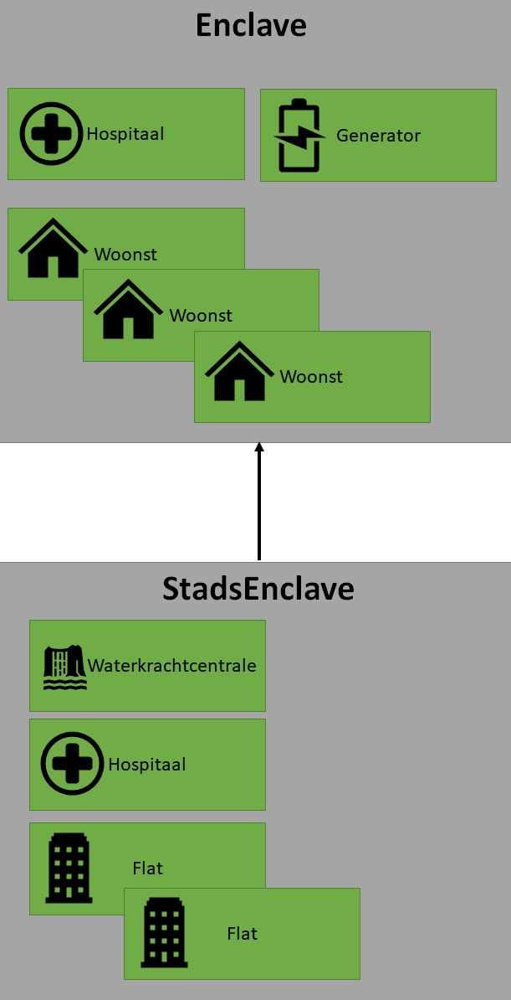

# Opdracht

.jpg)

::: {.callout-important}
## Leerdoelen
Na deze missie kan je:

- Compositie toepassen: objecten die andere objecten bevatten
- Het verschil tussen compositie en overerving uitleggen
- Overerving en compositie combineren in één ontwerp
- Werken met lijsten van objecten als properties van een klasse
:::

> *"De gebouwen zijn klaar. Nu moeten we ze samenvoegen tot functionerende enclaves — zelfvoorzienende gemeenschappen die de pandemie kunnen doorstaan. Een gewone enclave biedt basisbescherming. Een stadsenclave kan groeien tot een echte stad."*

---

## Stap 1 — De Enclave klasse

Maak de volgende klassen:



Een `Enclave` bevat via **compositie**:

* **1 hospitaal**, **1 generator** en **1 of meerdere woonsten** (als lijst).
* Bij aanmaak start een enclave met **3 woningen**, een werkende generator en een hospitaal. Alle gebouwen komen op een **willekeurige** positie.

Voeg toe:

* Een **virtuele** methode `BouwWoonst`: voegt een nieuwe woonst toe aan de enclave. De woonst komt op een willekeurige locatie, maar **nooit** op een plek waar al een gebouw staat.
* Een **virtuele** methode `ToonEnclave`: toont alle gebouwen op het scherm via `PrintGebouw`.

::: {.callout-tip collapse="true"}
## Checkpoint
```csharp
Enclave e = new Enclave();
e.ToonEnclave();  // 3x 'w', 1x 'g' en 1x 'H' op willekeurige posities
e.BouwWoonst();
e.ToonEnclave();  // Nu 4x 'w', 1x 'g' en 1x 'H'
```
:::

::: {.callout-warning collapse="true"}
## Hint — Collision check
Om te controleren of een locatie al bezet is, loop je door al je gebouwen en vergelijk je hun X- en Y-coordinaten met de gewenste locatie. Pas als geen enkel gebouw op die plek staat, is de locatie vrij.
:::

---

## Stap 2 — De StadsEnclave klasse

`StadsEnclave` erft over van `Enclave` en heeft extra gebouwen:

* Een **waterkrachtcentrale**
* Een **extra hospitaal**
* **1 of 2 flats** (als lijst)

Bij aanmaak heeft een `StadsEnclave` enkel de gebouwen die een gewone `Enclave` ook heeft (de extra gebouwen komen er later bij).

### Override BouwWoonst

De stadsenclave voegt nog steeds een woonst toe, maar: iedere keer als de enclave **3 woningen** bereikt, worden deze **verwijderd** en komt er een **flat** in de plaats (op een locatie naar keuze).

### Override ToonEnclave

Toont alles wat de base-versie toont, plus de extra gebouwen van de stadsenclave (flats, extra hospitaal, waterkrachtcentrale).

::: {.callout-tip collapse="true"}
## Checkpoint
```csharp
StadsEnclave se = new StadsEnclave();
// Start met 3 woonsten (van Enclave-constructor)
se.BouwWoonst();  // 4 woonsten
se.BouwWoonst();  // 5 woonsten
se.BouwWoonst();  // 6 woonsten → 3 groepen van 2x3?
// Test het gedrag: worden woonsten vervangen door flats?
se.ToonEnclave();
```
:::

::: {.callout-warning collapse="true"}
## Hint — Woonsten vervangen door flat
Je kan `Count` op je woonstenlijst controleren. Als het deelbaar is door 3, verwijder je de woonsten en voeg je een flat toe. Kijk naar methodes als `Clear()` of `RemoveRange()` op je lijst.
:::

---

## Stap 3 — De applicatie

Maak een programma met:

* 2 `Enclave`-objecten en 2 `StadsEnclave`-objecten.
* Een menu waarin de gebruiker kiest van welke enclave de `BouwWoonst`-methode moet aangeroepen worden.
* Na elke keuze wordt de gekozen enclave getoond via `ToonEnclave`.
* Het menu blijft eindeloos herhalen.

::: {.callout-tip collapse="true"}
## Checkpoint
```
=== ENCLAVE MANAGER ===
1. Enclave Alpha
2. Enclave Bravo
3. StadsEnclave Charlie
4. StadsEnclave Delta
Keuze: 3
Woonst gebouwd in StadsEnclave Charlie!
[enclave verschijnt op scherm]
```
:::

---

## Stap 4 — Dictionary

Vervang je hardcoded objecten door een `Dictionary<string, Enclave>`. De `string` is de naam van de enclave (bv. "Antwerpen").

Merk op dat zowel `Enclave`- als `StadsEnclave`-objecten in deze dictionary passen — een `StadsEnclave` *is* immers ook een `Enclave`.

Breid je menu uit zodat de gebruiker kan:

1. Een **nieuwe** enclave of stadsenclave aanmaken en een naam geven. Zo wordt deze in de dictionary bewaard.
2. Via de **naam** van de enclave kiezen van welke enclave `BouwWoonst` moet aangeroepen worden.

::: {.callout-tip collapse="true"}
## Checkpoint
```
=== ENCLAVE MANAGER ===
1. Nieuwe enclave aanmaken
2. Bouw woonst
3. Toon enclave
Keuze: 1
Type (1=Enclave, 2=StadsEnclave): 2
Naam: Antwerpen
StadsEnclave 'Antwerpen' aangemaakt!

Keuze: 2
Welke enclave? Antwerpen
Woonst gebouwd in Antwerpen!
```
:::

---

## Debriefing

::: {.callout-note}
## Reflectie
1. De `Enclave` *bevat* gebouwen (compositie) en `StadsEnclave` *is een* `Enclave` (overerving). Waarom is het nuttig om beide principes te combineren?
2. Waarom kan een `Dictionary<string, Enclave>` ook `StadsEnclave`-objecten bevatten?
3. Wat is het verschil tussen `BouwWoonst` overriden in `StadsEnclave` versus gewoon een nieuwe methode `BouwWoonstStad` toevoegen?
:::

> *"De enclaves draaien. Maar er stromen steeds meer overlevenden toe. Onze nederzettingen moeten groeien — en niet elke enclave groeit op dezelfde manier. We hebben een systeem nodig dat slim genoeg is om het verschil te zien."*
