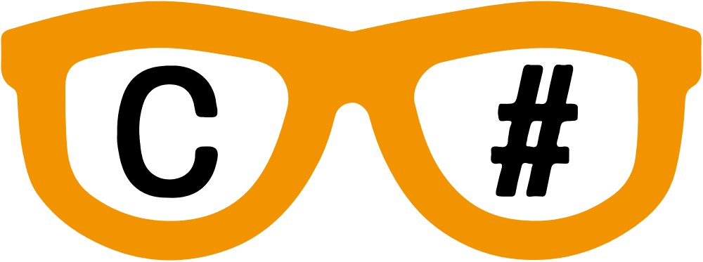
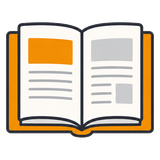
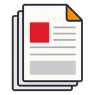
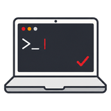
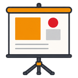

# Voorwoord {.unnumbered}

<!-- De landingspagina. Staat bewust in een html-only blok: de pdf begint nog
     altijd met het voorwoord hieronder. De vormgeving (en het verbergen van
     sidebar, inhoudstafel en titelblok op deze ene pagina) zit in custom.scss
     onder "Landingspagina". -->
::::: {.content-visible when-format="html"}

:::: {.zss-hero}
::: {.zss-hero-tekst}
[Zie Scherp Scherper]{.zss-titel}

[Leren programmeren in C#, van je allereerste regel code tot polymorfisme. Geen voorkennis nodig.]{.zss-pitch}

[Gratis en online, door Tim Dams (AP Hogeschool)]{.zss-bijlijn}
:::

{.zss-bril .nolightbox fig-alt="Een bril met C# in de glazen"}
::::

:::: {.zss-kaarten}
[{.k-icoon .nolightbox}[Handboek]{.k-titel}[De 18 hoofdstukken online, met voorbeelden en kennisclips.]{.k-tekst}[Begin hier]{.k-pijl}](content/README.md){.zss-kaart .k-start}

[{.k-icoon .nolightbox}[Handboek in pdf]{.k-titel}[Alles in één bestand, om te printen of offline te lezen. Versie .]{.k-tekst}[**Let op: deze pdf is nog lang niet klaar.** Heel veel afbeeldingen ontbreken of staan verkeerd, en de opmaak moet nog grondig herwerkt worden. Lees online mee als je iets niet begrijpt.]{.k-letop}[Download de pdf]{.k-pijl}](Zie-Scherp-Scherper.pdf){.zss-kaart .k-onaf}

[{.k-icoon .nolightbox}[Oefeningen]{.k-titel}[Practica per hoofdstuk, oude vaardigheidsproeven en grotere projecten.]{.k-tekst}[Naar de oefeningen]{.k-pijl}](oefeningen/overzicht.qmd){.zss-kaart}

[{.k-icoon .nolightbox}[Slides]{.k-titel}[De lesslides per hoofdstuk, online of als pdf.]{.k-tekst}[Naar de slides]{.k-pijl}](slides/overzicht.html){.zss-kaart}
::::

:::: {.zss-meer}
Meteen beginnen? [H1: De eerste stappen](content/0_intro/0_intrototcs.md) · alle [kennisclips](content/allvideos1.md) · de [coding guidelines](content/B_appendix/boete.md)

[Gratis onder CC BY-NC 4.0](#licentie) · [trakteer op een fristi](https://www.buymeacoffee.com/timdams) · [fout gevonden?](https://github.com/timdams/ziescherpscherper/issues) · [over deze editie](#over-deze-editie)
::::

:::::

**Zie Scherp Scherper**, een handboek C# binnen de opleidingen bachelor elektronica-ict en toegepaste informatica van de AP Hogeschool, geschreven door [Tim Dams](https://www.timdams.com) maar ook perfect bruikbaar voor andere hogescholen en middelbare scholen. Het boek is bedoeld om studenten op een laagdrempelige manier te leren programmeren in C#, waarbij geen voorkennis vereist is.

## Over deze editie

Welkom op de allernieuwste versie van mijn baby'tje: een handboek dat ondertussen aan z'n 4e versie is, en deze keer enkel nog digitaal door het leven zal gaan. Onze wereld, en dan zeker de IT-wereld, verandert momenteel razendsnel en tegen dat een papieren versie bij de drukker ligt zijn de helft van m'n screenshots al weer out-dated.

Deze editie wordt gekenmerkt door enkele fundamentele wijzigingen:

* Ieder hoofdstuk eindigt met een *Zie verder* sectie waarin we de geleerde concepten bekijken hoe ze in andere talen worden toegepast (of net niet). Door de opkomst van de zeer krachtige *agentic coding* modellen (denk aan Claude Opus) is er een fundamentele shift begonnen in het beroep van *softwareontwikkelaar*. Code schrijven is nog steeds een horde waar je door moet, want het is de enige manier om ten gronde te begrijpen hoe software gemaakt wordt. Maar het is niet meer realistisch dat je een expert in 1 taal wordt. Je zal vanaf dag 1 *over het muurtje* moeten kijken opdat je snel in eender welke technologie-stack oplossingen kunt ontwikkelen. 

## Licentie

  

Alle tekst, afbeeldingen en oefeningen staan onder **[Creative Commons Naamsvermelding-NietCommercieel 4.0 Internationaal (CC BY-NC 4.0)](https://creativecommons.org/licenses/by-nc/4.0/deed.nl)**.

**Je mag:**

* **Delen**: het materiaal kopiëren en verspreiden in eender welk medium of formaat
* **Bewerken**: het materiaal remixen, veranderen en erop voortbouwen

**Op voorwaarde dat:**

* **Naamsvermelding**: je vermeldt de auteur (Tim Dams), linkt naar de licentie, en geeft aan of je iets gewijzigd hebt. Doe dat op een manier die niet suggereert dat ik jou of jouw gebruik goedkeur.
* **Niet-commercieel**: je gebruikt het materiaal niet voor commerciële doeleinden. Lesgeven met dit boek in een school of hogeschool kan dus perfect; het verkopen, of het verwerken in een betalende opleiding of dienst, niet. Twijfel je? [Vraag het me gewoon.](https://timdams.com)
* **Geen aanvullende beperkingen**: je legt geen juridische of technische beperkingen op die anderen verhinderen te doen wat de licentie toelaat.

Dit is een leesbare samenvatting, geen vervanging van de [volledige licentietekst](https://creativecommons.org/licenses/by-nc/4.0/legalcode.nl).

## Trakteer op een fristi

Dit boek is gratis en dat blijft het. Gebruik je het als leerkracht in het middelbaar of aan een andere hogeschool, en scheelt het je een pak voorbereidingswerk? Dan mag je me gerust eens [trakteren op een fristi](https://www.buymeacoffee.com/timdams). Het moet niet, maar het houdt de goesting om dit te blijven onderhouden 😉.

::: {.content-visible when-format="html"}

:::

## Fouten gevonden?

Alle feedback is welkom. Open een [issue](https://github.com/timdams/ziescherpscherper/issues) of contacteer me. Normaal gezien zijn alle tekst en afbeeldingen de mijne (en Claude's 😉), tenzij anders vermeld. Ontdek je toch iets dat niet correct geattribueerd is, laat het zeker weten.