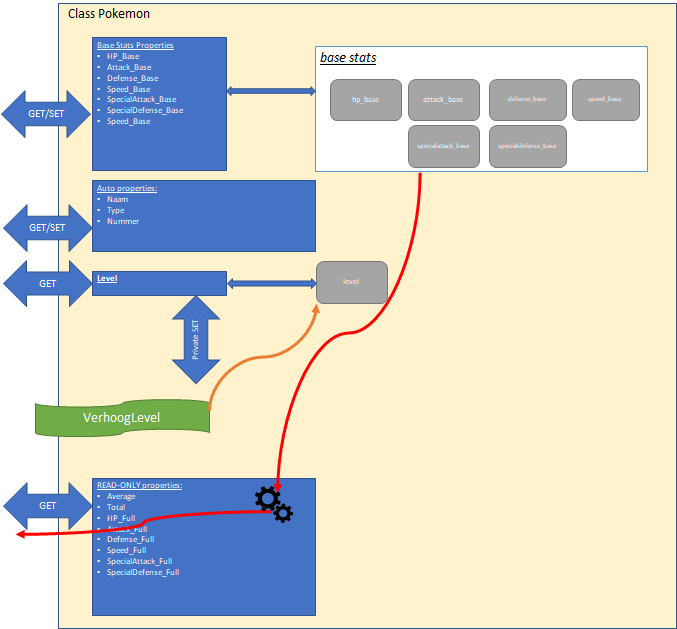

:::{.callout-tip}
Er zijn geen aparte Exception handling oefeningen. De bedoeling is dat je zelf steeds in je oefening naar een goede plek(ken) zoekt waar deze kan toegepast worden.
:::

:::{.callout-tip}


# Meetlat

# Meetlat

:::{.callout-tip}
[Maak je oplossing in een kopie van volgende solution met bijhorende unittests](https://github.com/timdams/ZIESCHERPER_TESTS_H2_Meetlat).
:::

**Doel:**
Zet een lengte om naar verschillende eenheden met behulp van properties.

**Specificaties:**
*   **Klassenaam:** `Meetlat`
*   **Property (Input):**
    *   `BeginLengte` (type: `double`): Write-only property om de lengte in **meter** in te stellen.
    *   *Opslag:* Sla deze waarde intern op in een private variabele (bv. `_lengte`).

**Properties (Output - ReadOnly):**
De volgende properties geven de lengte terug, omgerekend naar de gevraagde eenheid:

| Property | Type | Formule |
| :--- | :--- | :--- |
| `LengteInM` | `double` | Geeft `_lengte` terug. |
| `LengteInCm` | `double` | `_lengte * 100` |
| `LengteInKm` | `double` | `_lengte / 1000` |
| `LengteInVoet` | `double` | `_lengte * 3.2808` |

**Voorbeeldgebruik:**

```csharp
Meetlat mijnLat = new Meetlat();
mijnLat.BeginLengte = 2; // We stellen in op 2 meter
Console.WriteLine($"{mijnLat.LengteInM} meter is {mijnLat.LengteInVoet} voet.");
```


# Kleur mixer (*Essential*)

# Kleur mixer (*Essential*)

:::{.callout-tip}
[Maak je oplossing in een kopie van volgende solution met bijhorende unittests](https://github.com/timdams/ZIESCHERPER_TESTS_H2_Kleurmixer).
:::

**Doel:**
Meng twee kleuren door het gemiddelde te nemen van hun RGB-waarden.

**Specificaties:**
*   **Klassenaam:** `Kleur`
*   **Properties:**
    *   `Rood` (`int`)
    *   `Groen` (`int`)
    *   `Blauw` (`int`)
*   **Methode:**
    *   `MengKleur(Kleur andereKleur)` (`void`)

**Werking (MengKleur):**
Wanneer `MengKleur` wordt aangeroepen, veranderen de eigenschappen van de **huidige** kleur (de kleur van het object zelf waarin de methode wordt aangeroepen). De kleur die als parameter wordt meegegeven verandert **niet**.

Gebruik deze formules (gehele deling):
*   Nieuw Rood = `(Huidig Rood + Ander Rood) / 2`
*   Nieuw Groen = `(Huidig Groen + Ander Groen) / 2`
*   Nieuw Blauw = `(Huidig Blauw + Ander Blauw) / 2`

**Voorbeeldgebruik:**

```csharp
Kleur k1 = new Kleur(); // Basiskleur (wordt aangepast)
k1.Rood= 10; k1.Groen= 0; k1.Blauw= 20;

Kleur k2 = new Kleur(); // Mengkleur (blijft hetzelfde)
k2.Rood= 10; k2.Groen= 10; k2.Blauw= 50;

// Meng k2 in k1
k1.MengKleur(k2);

Console.WriteLine($"{k1.Rood},{k1.Groen},{k1.Blauw}");
// Verwachte output: 10,5,35
```


# Pokémon (*Essential*)

We gaan een programma schrijven dat ons toelaat enkele basis-eigenschappen van specifieke Pokémon te berekenen terwijl ze levellen.
Nadruk van deze oefening is het juist gebruiken van properties. Bekijk de cheat sheet bij twijfel.  

:::{.callout-tip}
Disclaimer: de informatie in deze tekst is een vereenvoudigde versie van de echte Pokémon-stats in de mate dat ik het allemaal een beetje kon begrijpen en juist interpreteren.
:::

## Hoe Pokémon werken

Korte uitleg over Pokémon en hun interne werking: Iedere Pokémon wordt uniek gemaakt door z’n base-stats, deze zijn voor iedere Pokémon anders. Deze base-stats  zijn onveranderlijk en blijven dus doorheen het hele leven van een Pokémon dezelfde. Je kan de base-stats als het dna van een Pokémon beschouwen.

De full-stats zijn echter de stats die de effectieve ‘krachten’ van een Pokémon bepalen in een gevecht. Deze stats worden berekend gebaseerd op de vaste base-stats en het huidige level van de Pokémon. Hoe hoger het level van de Pokémon, hoe hoger dus zijn full-stats. 




* [Meer uitleg bij bovenstaande tekening](https://ap.cloud.panopto.eu/Panopto/Pages/Viewer.aspx?id=245f5d03-dbe4-49d9-b9e9-ab720084b984)


## De Pokémonopdracht

:::{.callout-tip}
[Maak je oplossing in een kopie van volgende solution met bijhorende unittests](https://github.com/timdams/ZIESCHERPER_TESTS_H2_PokemonBasic).

Merk op dat enkel de basis aspecten tot en met de sectie "Level-gebaseerde stats" getest worden.
:::


Maak een consoleapplicatie met daarin een klasse Pokémon die de werking zoals hierboven beschreven heeft:

### Base-stats
De base-stats worden als ``int`` bewaard. Maak voor al deze basis-eigenschappen full properties, namelijk:

* ``HP_Base``
* ``Attack_Base``
* ``Defense_Base``
* ``SpecialAttack_Base``
* ``SpecialDefense_Base``
* ``Speed_Base``

:::{.callout-tip}
Merk op dat deze waarden eigenlijk nooit nog veranderen in een Pokémon. Het is dus raar dat we ze als full properties beschouwen. In het volgende hoofdstuk zullen we dit oplossen door te werken met een constructor.
:::

### Extra stats

Voorts wordt een Pokémon ook gedefinieerd door z’n Naam (``string``), Type (string, bv. ``grass & poison``) en Nummer (``int``), maak hiervoor auto properties aan.

> Met ``Nummer`` bedoelen we de Pokémon index die je in de Pokédex kunt opzoeken. Zo heeft Bulbasaur nummer 1 en Pikachu heeft 25. 

:::{.callout-tip}
Nog een goede reden nodig om met ``enum`` te werken? Het Type van een Pokémon zou je eigenlijk beter met een enum datatype kunnen doen dan met een string. 
:::


### Level

Voeg een fullproperty ``Level`` toe (``int``). Deze heeft een public get, maar een private setter.

Voeg een publieke methode ``VerhoogLevel`` toe. Deze methode zal, via de private setter van ``Level``, het level van de Pokémon met 1 verhogen. Deze methode heeft géén parameters nodig en return'd niets.

### Statistieken

Voeg 2 read-only properties toe (enkel get, géén set) genaamd ``Average`` (``double``) en ``Total`` (``int``):

* De ``Average``-property geeft het gemiddelde van de 6 base-stats terug, dus ``(HP_Base + Attack_Base + Defense_Base + SpAttack_Base + SpDefense_Base +Speed_Base)/6.0``.

* De ``Total``-property geeft de som terug van de 6 basestats. Daar de base stats niet evolueren met het level veranderen dus ``Average`` en ``Total`` ook niet van zodra de base-stats werden ingesteld, toch mag je beide statistieken steeds herberekenen in de get.

:::{.callout-tip}
Merk op dat je voor deze twee properties dus geen instantievariable nodig hebt. Dit geldt ook voor de hier na beschreven "level-gebaseerde stats".
:::

### Level-gebaseerde stats

De eigenschappen van de Pokémon **die mee evolueren met het level** gaan we steeds als read-only properties van het type ``int`` implementeren:

* Voeg een read-only property ``HP_Full``  toe om de maximum health voor te stellen. Deze wordt berekend als volgt: ``( ( (HP_Base + 50) * Level) / 50) + 10 `` wanneer de get wordt aangeroepen.
* Voeg voor iedere  ander base-stat een *XX_Full* readonly property toe . Dus ``Defense_Full``, ``Speed_Full``, etc. Ook deze properties zijn readonly. Deze stats worden berekend als volgt: ``( (stat_Base*Level) / 50 ) + 5``.
Attack_Full bijvoorbeeld wordt dus berekend als: ``( (Attack_Base * Level) / 50) + 5``

:::{.callout-tip}
Merk op dat de formules enkel met ``int`` werken. Het effect hiervan zal zijn dat je full-stats niet per level veranderen, maar pas om de paar levels, daar we informatie "verliezen" door in de deling met ``int`` te werken.
:::

### Maak enkele Pokémon

Kies enkele Pokémon uit [deze lijst](https://bulbapedia.bulbagarden.net/wiki/List_of_Pok%C3%A9mon_by_base_stats) en maak in je Main enkele Pokémon-objecten aan met de juiste eigenschappen.

Opgelet: **Je dient dus enkel de base stats in te stellen. Alle andere zaken zijn op deze stats en het huidige level van de Pokémon gebaseerd**.

Toon aan dat de ``Average``, ``Total``, ``HP`` en andere stats correct berekend worden (controleer in de tabel op de voorgaande url). 

:::{.callout-tip}
De volgende stats zouden steeds hetzelfde moeten zijn: ``Average``, ``Total``, ``Naam``, ``Nummer``, ``Type`` en de base_stats.

De volgende stats zouden moeten veranderen naarmate je levelt: level-gebaseerde stats en ``Level``. 


**[Via deze site kan je controleren welke stats je Pokémon moet hebben op een bepaald level](https://pycosites.com/pkmn/stat_gen1.php)**

:::

#### Level-up tester

Maak een kleine loop die je toelaat om per loop een bepaalde Pokémon z’n level met 1 te verhogen en vervolgens toon je dan z’n nieuwe stats.

Test eens hoe de stats na bv 100 levels evolueren. Je zal zien dat bepaalde stats pas na een paar keer levelen ook effectief beginnen stijgen.

## Deel 2: De Pokémontester

:::{.callout-tip}
Bekijk zeker eerst of jouw Pokémon oplossing juist is (vergelijk met de oplossing in deze cursus) voor je verder gaat.
:::


Het is een heel gedoe om telkens manueel de informatie van een Pokémon op het scherm te outputen. Voeg een methode ``public void ShowInfo()`` toe aan je Pokémon klasse. Deze methode zal alle relevante informatie (alle properties!) in een mooie vorm op het scherm tonen, bv:


```text
Pikachu (level 5)
Base stats:
    * Health = 56
    * Speed = 30
    etc
Full stats:
    * Health = 100
    etc.
```

Maak nu een nieuwe console-applicatie genaamd "Pokémon Tester":

1. Voeg je ``Pokémon``-klasse-bestand toe aan dit project. Verander de "namespace" van dit bestand naar de namespace van je nieuwe console-applicatie .
2. Maak enkele Pokémon objecten aan en stel hun base stats in.
3. Schrijf een applicatie die aan de gebruiker eerst de 6 base-stats vraagt. Vervolgens wordt de Pokémon aangemaakt met die stats en worden de full-stats aan de gebruiker getoond.
4. Vraag nu aan de gebruiker tot welke level de Pokémon moet gelevelled worden. Roep zoveel keer de LevelUp-methode aan van de Pokémon. (of kan je dit via een parameter doorgeven aan ``LevelUp``?!)
5. Toon terug de full-stats van de nu ge-levelde Pokémon.

## Deel 3: Pokémon-battler

### Pokémon generator

Maak een methode met volgende signatuur: ``static Pokémon GeneratorPokémon()``. Plaats deze methode *niet* in je Pokémon-klasse, maar in  Program.cs.

Deze methode zal telkens een Pokémon aanmaken met willekeurige base-stats. Bepaal zelf hoe je dit gaat doen.

### Battle tester

Voeg een methode met volgende signatuur toe aan je hoofdprogramma (dus ook weer in Program.cs):
``static int Battle(Pokémon poke1, Pokémon poke2)``.

De methode zal een getal teruggeven dat aangeeft welke van de twee Pokémon een gevecht zou winnen. 1= poke1, 2 = poke2, 0 = gelijke stand.

Controleer steeds of 1 of beide van de meegegeven Pokémon niet ``null`` zijn. Indien er 1 ``null`` is, dien je een Exception op te werpen.

Bepaal zelf hoe Pokémon vechten (bv. degene met de hoogste average van full-stats). Werk niet enkel met de base-stats, daar deze constant zijn. Het is leuker dat het level ook een invloed heeft (maar ga niet gewoon het level vergelijken).

### Alles samen

Genereer 2 willekeurige Pokémon met je generator en laat ze vechten met je battle-methode. Toon wat output aan de gebruiker zodat hij ziet wat er allemaal gebeurt (en gebruik zeker de ``ShowInfo`` methode om dit snel te doen). Kan je dit in een loop zetten en wat leuker maken met Pokémon die telkens levelen als ze een gevecht winnen?!

### Meer info
Voor de volledige info over Pokémon hun stats. [Klik hier.](https://bulbapedia.bulbagarden.net/wiki/Statistic "Stats Pokémon")


# Bankmanager 2 (*Essential*)

# Bankmanager 2 (*Essential*)

Breid de bankmanager oefening uit het vorige hoofdstuk uit.

**Nieuwe Methoden (in `Program.cs`):**

1.  `SimuleerOverdracht(Rekening r1, Rekening r2)` (`void`)
    *   **Loop:** Herhaal 5 keer:
        *   Kies een **willekeurig bedrag** tussen 1 en 100 euro.
        *   Stort dit bedrag van de ene rekening naar de andere.
        *   Wissel per iteratie om wie verzender en wie ontvanger is (r1 -> r2, dan r2 -> r1, etc).

2.  `CreeerTienerRekening(string klantNaam)` (`Rekening`)
    *   Maak een nieuw `Rekening` object aan.
    *   Stel de naam in op `klantNaam`.
    *   Zorg dat de balans start op **50**.
    *   Retourneer dit nieuwe object.


# Project: SpaceCommand (*Final Essential*)

**Doel**
Deze opdracht combineert alle concepten van dit hoofdstuk (Properties, Methoden, Statics, Referenties vs Copies) in één grote simulatie. Indien je de Pokémon-opdracht helemaal hebt gemaakt, dan heeft het niet zoveel nut om ook deze te maken. 

**Scenario:**
Je bent de software-architect van de Aardse Vloot. Je moet een systeem ontwerpen om ruimteschepen te beheren, upgrades te geven en gevechtssimulaties uit te voeren tegen de buitenaardse dreiging.

## Deel 1: Het Ruimteschip

Ontwerp de klasse `RuimteSchip`.

**1. Eigenschappen (Properties):**
*   **Identificatie:**
    *   `Naam` (`string`): De naam van het schip (bv. "USS Enterprise").
    *   `Kapitein` (`string`, *private set*): De naam van de bevelhebber. Deze kan enkel ingesteld worden via een methode `WisselKapitein(string nieuweKapitein)`.
*   **Basisstatistieken (Base Stats):**
    *   Deze worden bij de bouw van het schip vastgelegd (in de main stel je ze in, daarna blijven ze conceptueel vast, hoewel we nog geen constructors gebruiken).
    *   `RompSterkte` (`int`): 0-100.
    *   `SchildKracht` (`int`): 0-100.
    *   `VuurKracht` (`int`): 0-100.
*   **Status:**
    *   `Ervaring` (`int`): Het level van de bemanning. Start standaard op 0.
    *   `Schade` (`int`): Hoeveel schade het schip heeft opgelopen. Start op 0.

**2. Berekende Eigenschappen (Read-Only Properties):**
*   `IsKapot` (`bool`): Geeft `true` als `Schade` groter dan of gelijk is aan `RompSterkte`.
*   `TotaleKracht` (`double`): Een graadmeter voor de gevechtswaarde.
    *   *Formule:* `(VuurKracht * Ervaring) + (SchildKracht * 0.5)`.

**3. Methoden:**
*   `Onderhoud()`: Zet `Schade` terug op 0 en toont: *"Schip [Naam] is volledig hersteld."*.
*   `TrainBemanning()`: Verhoogt `Ervaring` met 1.
*   `ToonRapport()`: Toont een volledig overzicht van het schip (Naam, Kapitein, Stats, Kracht, Status) in de console.

---

## Deel 2: De Vloot Manager (Program.cs)

**1. De Scheepswerf (Generator)**

Maak in je `Program` klasse een *static* methode `MaakWillekeurigSchip(string naam)`.
*   Deze methode maakt een nieuw `RuimteSchip` aan.
*   De stats (`Romp`, `Schild`, `Vuur`) worden willekeurig bepaald (Random 10-100).
*   De kapitein wordt ingesteld op "Onbekend".
*   Het schip wordt geretourneerd.

**2. De Simulator (Methods & References)**
Maak een *static* methode `SimuleerGevecht(RuimteSchip s1, RuimteSchip s2)`.
*   **Null-check:** Controleer eerst of `s1` of `s2` `null` zijn. Indien ja: toon een foutmelding en stop.
*   **Logica:**
    *   Bereken de `TotaleKracht` van beide schepen.
    *   Het schip met de **laagste** kracht verliest.
    *   **Gevolgen:**
        *   Het verliezende schip loopt schade op: `Schade` verhoogt met 20.
        *   Het winnende schip krijgt ervaring: Roep `TrainBemanning()` aan.
        *   Toon een spannend verslag in de console.

**3. De Garage (Object wijziging)**
Maak een methode `PimpMijnSchip(RuimteSchip schip)`.
*   Deze methode accepteert een schip-object.
*   In de methode:
    *   Zet de `VuurKracht` op 100.
    *   Zet de `SchildKracht` op 100.
    *   *Let op:* Omdat `RuimteSchip` een *reference type* is, zal deze wijziging zichtbaar zijn buiten de methode! Toon dit aan in je Main.

---

## Deel 3: Het Scenario (Main)

Schrijf nu een `Main` programma dat alles samenbrengt:
1.  Gebruik de `MaakWillekeurigSchip` om twee schepen te genereren: *"De Voyager"* en *"De Millenium Falcon"*.
2.  Zet voor beide schepen een kapitein ("Janeway" en "Solo").
3.  Toon de rapporten van beide schepen.
4.  Laat ze vechten (`SimuleerGevecht`).
5.  Toon de rapporten opnieuw (zie je de schade en ervaring?).
6.  Stuur de verliezer naar de garage (`PimpMijnSchip`).
7.  Laat ze nog eens vechten. (De verliezer zou nu moeten winnen met zijn upgrades).

**Extra Uitdaging:**
Wat als je een schip "kloneert"?
`RuimteSchip s3 = s1;`.
Pas `s3` aan (bv. andere naam). Toon nu `s1` opnieuw. Wat merk je? (Dit demonstreert dat variabelen slechts verwijzingen zijn naar hetzelfde object in het geheugen).


::::{.callout-caution collapse="true" title="Oplossing"}
# Meetlat

```java
public class Meetlat
{
    private double lengte;
    public double BeginLengte
    {
        set { lengte=value; }
    }

    public double LengteInM
    {
        get{ return lengte;}
    }

    public double LengteInCm
    {
        get{ return lengte*100;}
    }

    public double LengteInKm
    {
        get{ return lengte/1000;}
    }

    public double LengteInVoet
    {
        get{ return lengte*3.2808;}
    }
}
```


# Kleurmixer (*Essential*)

```java
class Kleur
{
    public int Rood {get;set;}
    public int Groen {get;set;}
    public int Blauw {get;set;}

    public void MengKleur(Kleur voegToeKleur)
    {
        Rood = (voegToeKleur.Rood + Rood)/2;
        Groen = (voegToeKleur.Groen + Groen)/2;
        Blauw = (voegToeKleur.Blauw + Blauw)/2;
    }
}
```

# Pokémon deel 1

```java
class Pokemon
{


    private int hp_base;
    public int HP_Base
    {
        get { return hp_base; }
        set { hp_base = value; }
    }

    private int attack_base;
    public int Attack_Base
    {
        get { return attack_base; }
        set { attack_base = value; }
    }

    private int defense_base;
    public int Defense_Base
    {
        get { return defense_base; }
        set { defense_base = value; }
    }

    private int speed_base;
    public int Speed_Base
    {
        get { return speed_base;  }
        set { speed_base = value; }
    }

    private int specialattack_base;
    public int SpecialAttack_Base
    {
        get { return specialattack_base; }
        set { specialattack_base = value; }
    }

    private int specialdefense_base;
    public int SpecialDefense_Base
    {
        get { return specialdefense_base; }
        set { specialdefense_base = value; }
    }

    public int Nummer { get; set; } = -1;
    public string Naam { get; set; } = "Onbekend";
    public string Type { get; set; } = "no type"; //TIP= met enum ipv string

    //Level

    private int level;
    public int Level
    {
        get { return level; }
        private set { level = value; }
    }

    public void VerhoogLevel()
    {
        Level++;
    }

    public double Average
    {
        get
        {
            return Total / 6.;
        }
    }

    public int Total
    {
        get
        {
            return (HP_Base + Defense_Base + Attack_Base + SpecialAttack_Base + SpecialDefense_Base + Speed_Base);
        }
    }

    public int HP_Full
    {
        get
        {
            int resultaat = (((HP_Base + 50) * Level) / 50) + 10;
            return resultaat;
        }
    }

    public int Speed_Full
    {
        get
        {
            return ((Speed_Base * Level) / 50) + 5;
        }
    }

    //etc.
}
```

# Pokémontester

```java
Pokemon aPoke= new Pokemon();
Console.WriteLine("Geef hp:");
aPoke.HP_Base= Convert.ToInt32(Console.ReadLine());
Console.WriteLine("Geef attack:");
aPoke.Attack_base= Convert.ToInt32(Console.ReadLine());

//enz

aPoke.ShowInfo();

Console.WriteLine("Tot welke level wilt u leveren?");
int levels= Convert.ToInt32(Console.ReadLine());
for(int i=0;i<levels;i++)
{
    aPoke.VerhoogLevel();
}
Console.WriteLine($"Na {levels} keer het level te verhogen:");
aPoke.ShowInfo();
```

# Pokemon generator

```java
private static Random ran=new Random();
public static Pokemon GeneratorPokemon ()
{
    Pokemon temp= new Pokemon();
    temp.HP_base= ran.Next(1,100);
    temp.Attack_base=ran.Next(1,100);
    return temp;
}
```

Aanroep:

```java
Pokemon myNewPokemon= GeneratorPokemon();
Pokemon myOtherPokemon= GeneratorPokemon();
```

# Pokémon-battle

```java
public static int Battle(Pokemon poke1, Pokemon poke2)
{
    if(poke1 == null && poke2 == null)
        return 0;
    if(poke1== null)
        return 2;
    if(poke2== null)
        return 1;

    if(poke1.Average > poke2.Average)
        return 1;
    else if (poke1.Average < poke2.Average)
        return 2;

    return 0;
}
```

::::
