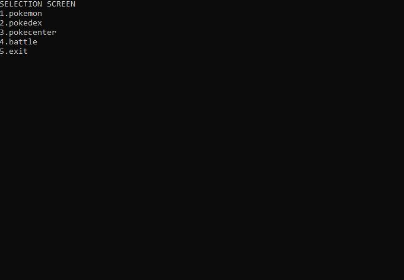

# Meetlat constructor (*Essential*)

# Meetlat constructor (*Essential*)

**Doel:**
Pas de bestaande `Meetlat` klasse uit het vorige hoofdstuk aan om met een constructor te werken.

**Stappenplan:**
1.  **Verwijder** de write-only property `BeginLengte`.
2.  **Voeg toe** een private instantievariabele: `private double lengteInMeter;`.
3.  **Maak een Constructor** die één parameter aanvaardt (type `double`) en wijs deze waarde toe aan `lengteInMeter`.
4.  Pas de werking van de overige properties aan zodat ze nu deze nieuwe variabele gebruiken in plaats van de property.

**Voorbeeldgebruik:**
```csharp
// Oude manier (werkt NIET meer na aanpassing):
// Meetlat m = new Meetlat();
// m.BeginLengte = 5;

// Nieuwe manier:
Meetlat m = new Meetlat(5);
Console.WriteLine(m.LengteInCm);
```


# Persoonsregistratie (*Essential*) (GPT)

# Persoonsregistratie (*Essential*) (GPT)

:::{.callout-tip}
Deze oefening werd gemaakt (en aangepast nadien) met [behulp van volgende GPT](https://chat.openai.com/g/g-TllbzOiKJ-zie-scherp-scherper-praktijkoefeningen) en heeft daarom de tag (GPT) achter de titel staan. 
:::

**Doel:**
Gebruik constructors en object initializers om personen aan te maken.

**Specificaties:**
*   **Klassenaam:** `Persoon`
*   **Properties (Auto):**
    *   `Voornaam` (`string`)
    *   `Achternaam` (`string`)
    *   `Geboortejaar` (`int`)
    *   `Email` (`string`)
*   **Constructor:**
    *   Parameters: `voornaam`, `achternaam`.
    *   **Validatie:**
        *   Indien `voornaam` gelijk is aan `achternaam` -> Werp een `ArgumentException` op met de boodschap "Voornaam en achternaam mogen niet hetzelfde zijn".
*   **Methode:**
    *   `ToonInformatie()` (`void`): Toont de tekst: `"{Voornaam} {Achternaam} geboren in {Geboortejaar} heeft emailadres: {Email}"`.

**Opdracht in Main:**
1.  Maak een `Persoon` object aan met de constructor.
2.  Gebruik **Object Initializer Syntax** om ook meteen `Geboortejaar` en `Email` in te stellen.
    *   *Voorbeeld:* `new Persoon("Jan", "Janssens") { Geboortejaar = 1990, ... }`
3.  Roep `ToonInformatie()` aan.
4.  Schrijf code die test of je applicatie **niet krasht** als je een foutieve naam ingeeft (gebruik `try-catch`).


# Bibliotheek constructor en static (*Essential*)

# Bibliotheek constructor en static (*Essential*)

**Doel:**
Breid de `BibBoek` klasse uit met default waarden en statische logica.

**Aanpassingen aan `BibBoek`:**

1.  **Default Constructor:**
    *   Stel `Uitgeleend` in op `DateTime.Now`.

2.  **Overloaded Constructor:**
    *   Parameter: `DateTime startDatum`.
    *   Stel `Uitgeleend` in op deze parameter.
    *   **Validatie:** Indien `startDatum` in de toekomst ligt -> Werp exception.

3.  **Statische Methode:**
    *   `static void VeranderAlgemeneUitleenTermijn(int dagen)`
    *   **Werking:**
        *   Maak een `private static int uitleenTermijnInDagen` aan in de klasse (standaardwaarde bv. 14).
        *   Pas de methode aan zodat deze statische variabele wordt gewijzigd.
        *   Pas de property `InleverDatum` aan zodat hij deze statische variabele gebruikt voor de berekening (i.p.v. de hardcoded 14 dagen).


# Digitale kluis (*Essential*)


## Basiskluis

:::{.callout-tip}
[Maak je oplossing in een kopie van volgende solution met bijhorende unittests](https://github.com/timdams/ZIESCHERPER_TESTS_H3_DigitaleKluis).
:::

**Specificaties:**
*   **Klassenaam:** `DigitaleKluis`
*   **Velden:**
    *   `private int code` (de echte code).
    *   `private int aantalPogingen` (standaard 0).
*   **Properties:**
    *   `CanShowCode` (`bool`): Mag de code getoond worden?
    *   `Code` (`int`): Full property met private set.
        *   *Get logica:*
            *   Als `CanShowCode == true`: Geef de echte `code` terug.
            *   Als `CanShowCode == false`: Geef altijd `-666` terug.
    *   `CodeLevel` (`int`) - ReadOnly:
        *   *Formule:* `code / 1000` (gehele deling).

**Constructors:**
*   Constructor die één `int` aanvaardt en deze instelt als de `code`.

**Methode `TryCode(int ingevoerdeCode)`:**
Deze methode controleert de code en geeft `true` (juist) of `false` (fout) terug. De methode print ook feedback naar de console.

**Beslissingstabel voor `TryCode`:**

| Situatie | Conditie | Actie (Console Output) | Return Waarde |
| :--- | :--- | :--- | :--- |
| **Valsspeler** | `ingevoerdeCode == -666` | "CHEATER" | `false` |
| **Reeds Geblokkeerd** | `aantalPogingen >= 10` | "Je hebt je 10 pogingen opgebruikt." | `false` |
| **Juiste Code** | `ingevoerdeCode == code` | "Geldige code. Aantal pogingen = {aantalPogingen}" | `true` |
| **Foute Code** | `ingevoerdeCode != code` | "Geen geldige code." <br> (Verhoog `aantalPogingen` met +1) | `false` |

## Kluizen kraken (Static Methode)

Voeg een statische methode toe om een kluis te kraken via brute-force.

**Specificaties:**
*   **Locatie:** In de klasse `DigitaleKluis`.
*   **Signatuur:** `static void BruteForce(DigitaleKluis kluis)`
*   **Werking:**
    1.  Start een lus die 10 keer herhaalt.
    2.  Kies telkens een willekeurig getal.
    3.  Probeer dit getal op de meegegeven `kluis` via `kluis.TryCode(getal)`.
    4.  Als `TryCode` `true` teruggeeft: Stop en toon "Gekraakt!".

*Test dit in je Main door een kluis aan te maken en `DigitaleKluis.BruteForce(mijnKluis)` aan te roepen.*


# Pokémon deel 2 (*Essential*)

## Constructors

Pas je `Pokemon` klasse aan zodat deze op 3 manieren aangemaakt kan worden. Dit betekent dat je 2 constructors moet toevoegen (de default constructor bestaat al, tenzij je die overschreven hebt).

**De 3 manieren:**

1.  **Default Constructor:**
    *   Gebruik: `new Pokemon()`
    *   Actie: Stel alle 6 base-stats standaard in op **10**.
2.  **Overloaded Constructor:**
    *   Gebruik: `new Pokemon(hp, att, def, spAtt, spDef, speed)`
    *   Actie: Stel de 6 base-stats in met de meegegeven waarden.
3.  **Object Initializer:**
    *   Gebruik: `new Pokemon() { HP_Base = 40, Naam = "Pikachu" }`
    *   Actie: Hiervoor hoef je niets speciaals te doen, dit werkt automatisch als je een parameterloze constructor hebt en de properties toegankelijk zijn.

:::{.callout-tip}
Zet de setters van je Base Stat properties op `private`. Hierdoor kunnen ze alleen aangepast worden *tijdens* de constructie (via constructor of initializer), maar niet meer *daarna*.
:::

## Static methoden en properties

Breid de klasse `Pokemon` uit met functionaliteit om statistieken over *alle* Pokémon bij te houden.

**Static Properties (Private Set):**
*   `TellerLevel`: Hoe vaak is `VerhoogLevel` in totaal aangeroepen?
*   `TellerBattles`: Hoeveel battles zijn er geweest?
*   `TellerGelijkspel`: Hoe vaak was het gelijkspel?
*   `TellerGeneraties`: Hoe vaak is `GeneratorPokemon` aangeroepen?
*   `NoLevelingAllowed` (`bool`, public set): Indien `true`, mag niemand nog levelen.

**Static Methoden:**
*   Verplaats `GeneratorPokemon` en `Battle` van `Program.cs` naar de klasse `Pokemon`. Pas ze aan zodat ze de tellers hierboven verhogen.
*   `static void Info()`: Print de waarden van alle tellers naar de console.

**Aanpassing `VerhoogLevel`:**
*   Controleer eerst `NoLevelingAllowed`.
    *   Indien `true`: Werp exception "Leveling not allowed".
    *   Indien `false`: Verhoog level en verhoog `TellerLevel`.

:::{.callout-tip}

Student Kevin Van Rooy maakte volgende applicatie waarbij bovenstaande opgave als initiële inspiratie diende:



:::


## Natures (PRO)

Pokémon hebben een "Nature" (aard) die hun stats beïnvloedt (+10% op één stat, -10 op een andere).

**Specificaties:**
1.  **Enum:** Definieer `Nature` (zie tabel).
2.  **Property:** Voeg een property `Nature` toe aan je Pokémon klasse.
3.  **Constructor:** Zorg dat elke nieuwe Pokémon een **willekeurige** Nature krijgt in de constructor.

**Implementatie van de Bonus:**
Pas de berekening van je Full Stats aan. Gebruik een helper-methode om je code netjes te houden.

*Tip: Maak een helper methode:*
`private double BerekenNatureModifier(StatType stat)`
*   Geeft `1.10` terug als de nature deze stat verhoogt.
*   Geeft `0.90` terug als de nature deze stat verlaagt.
*   Geeft `1.0` terug in alle andere gevallen.

Vermenigvuldig je Full Stat berekening met dit getal (en cast terug naar int).

| **Nature** | **Verhoogt met 10%** | **Verlaagt met 10** |
|---|---|---|
| Adamant	 | Attack	 | Sp. Atk
| Bashful	 | Sp. Atk	 | Sp. Atk
| Bold  | Defense	 | Attack
| Brave  | Attack	 | Speed
| Calm  | Sp. Def	 | Attack
| Careful	 | Sp. Def	 | Sp. Atk
| Docile  | Defense	 | Defense
| Gentle  | Sp. Def	 | Defense
| Hardy  | Attack	 | Attack
| Hasty  | Speed  | Defense
| Impish  | Defense	 | Sp. Atk
| Jolly  | Speed  | Sp. Atk
| Lax  | Defense	 | Sp. Def
| Lonely  | Attack	 | Defense
| Mild  | Sp. Atk	 | Defense
| Modest  | Sp. Atk	 | Attack
| Naive  | Speed  | Sp. Def
| Naughty	 | Attack	 | Sp. Def
| Quiet  | Sp. Atk	 | Speed
| Quirky  | Sp. Def	 | Sp. Def
| Rash  | Sp. Atk	 | Sp. Def
| Relaxed	 | Defense	 | Speed
| Sassy  | Sp. Def	 | Speed
| Serious	 | Speed  | Speed
| Timid  | Speed  | Attack

[Meer info over Natures](https://pokemondb.net/mechanics/natures)


# Sport simulator

# Sport simulator

Gebruik je `Sportspeler` (of `Voetballer`) klasse van de "Sports" oefening die je in hofdstuk 9, week 3, maakte. Voeg de volgende statische methoden toe aan **Program.cs**.

**1. SimuleerSpeler**
*   **Signatuur:** `static void SimuleerSpeler(Sportspeler speler)`
*   **Werking:**
    *   Roep in een loop 3 keer de acties van de speler aan (bv. `SchietOpDoel` en `MaakOvertreding`).

**2. SimuleerWedstrijd**
*   **Signatuur:** `static void SimuleerWedstrijd(Sportspeler speler1, Sportspeler speler2)`
*   **Werking:**
    *   Bepaal willekeurig wie wint (50/50 kans).
    *   Toon: "Speler X wint."
    *   Roep een actie aan van de winnaar.

**3. BesteSpeler**
*   **Signatuur:** `static Sportspeler BesteSpeler(Sportspeler speler1, Sportspeler speler2)`
*   **Werking:**
    *   Kies willekeurig een winnaar.
    *   Retourneer het winnende **object**.

**Test:**
Maak in je Main twee spelers aan en test deze 3 methoden.


# Project: GreenRide (*Final Essential*)

# Project: GreenRide (*Final Essential*)

**Scenario:**
Proficiat! Je bent zonet aangesteld als CTO (Chief Technical Officer) van **GreenRide**, de nieuwste hipste start-up van 't Stad. De missie? De wereld veroveren met elektrische deelsteps.

De investeerders zijn enthousiast, maar er is één probleem: er is nog geen software. Aan jou om de Core-Backend te schrijven die alle steps beheert, de winst berekent, en ervoor zorgt dat gebruikers niet kunnen wegrijden met een lege batterij.

Als CTO beslis je om slim gebruik te maken van **static** variabelen voor zaken die voor *alle* steps gelden (zoals de prijs), en **instance** variabelen voor unieke data (zoals de locatie en batterij van één specifieke step).

**Specificaties:**

**1. De `DeelStep` Klasse**

*   **Statische Data (The Company Level):**
    *   `PrijsPerMinuut` (`double`): De huidige ritprijs als property. Standaard `0.25` euro. (Dit kan veranderen tijdens spitsuren!).
    *   `TotaalWinst` (`double`): De heilige graal. Houdt bij hoeveel euro **alle steps samen** al hebben opgebracht sinds de start van de server. Ook een static property.
    *   `AantalInGebruik` (`int`): Een live teller van hoeveel steps er *op dit eigenste moment* rondrijden. Wederom een static property (alle drie transformeren, en hebben dus geen set).
    *   `volgNummerGenerator` (`private static int`): Een interne teller om elke step een uniek ID te geven (start bij 1).

*   **Instance Data (The Step Level):**
    *   `ID` (`int`): Het unieke nummer van de step. (Read-only voor de buitenwereld).
    *   `BatterijNiveau` (`int`): Hoeveel energie heeft deze step nog? (0-100).
    *   `IsBezig` (`bool`): Is deze step momenteel verhuurd?

*   **Constructors:**
    *   `DeelStep()`: De "Fabrieksinstelling".
        *   Zet `BatterijNiveau` op 100.
        *   Ken een nieuw uniek `ID` toe via de statische generator (en verhoog die generator daarna).
    *   `DeelStep(int batterij)`: Voor steps die uit onderhoud komen.
        *   Zet `BatterijNiveau` op de meegegeven waarde.
        *   Ken ook hier een uniek `ID` toe.

*   **Methoden:**
    *   `StartRit()` (`void`):
        *   **Validatie:** Een step kan enkel vertrekken als:
            1.  De batterij > 10% is.
            2.  Hij niet al in gebruik is (`IsBezig` is false).
        *   **Actie:** Zet `IsBezig` op true, en verhoog de statische `AantalInGebruik`.
        *   **Output:** Toon *"Step [ID] vertrekt met [X]% batterij."* of een foutmelding indien niet mogelijk.

    *   `EindigRit(int aantalMinuten)` (`void`):
        *   **Validatie:** Kan enkel als de step effectief weg was.
        *   **Actie:**
            *   Zet `IsBezig` op false.
            *   Verlaag `AantalInGebruik`.
            *   Bereken de kost: `aantalMinuten * PrijsPerMinuut`.
            *   Voeg dit bedrag toe aan de statische `TotaalWinst`.
            *   Verminder de batterij: Simuleer dat 1 minuut rijden = 1% batterijverlies. (Zorg dat batterij niet onder 0 zakt).
        *   **Output:** Toon een bonnetje: *"Step [ID] terug. Ritprijs: €[Bedrag]. Resterende batterij: [X]%"*.

**2. Het Dashboard (Main Programma)**

Schrijf een simulatie in je `Program.cs` om aan de investeerders te tonen:

1.  **De Vloot:** Maak 3 steps aan (waarvan eentje met een platte batterij via de 2e constructor).
2.  **De Ochtendspits:**
    *   Laat step 1 en 2 vertrekken.
    *   Probeer step 3 te laten vertrekken (zou moeten falen wegens batterij).
    *   Toon hoeveel steps er nu in gebruik zijn (via de static property).
3.  **Prijsstijging:**
    *   Het begint te regenen en de vraag stijgt. De directie beslist: `DeelStep.PrijsPerMinuut = 0.50;`.
4.  **De Aankomst:**
    *   Laat step 1 stoppen na 20 minuten.
    *   Laat step 2 stoppen na 10 minuten.
5.  **De Balans:**
    *   Toon de `TotaalWinst` van het bedrijf.
    *   Toon de batterijstatus van step 1 (is die verminderd?).

**Extra (Pro):**
Voeg een statische methode `GeefGratisStroom()` toe aan de klasse, die alle steps (die niet bezig zijn) terug oplaadt naar 100%. (Hiervoor zal je wel een lijst van alle aangemaakte objecten moeten bijhouden in de klasse zelf... uitdagend!).


::::{.callout-caution collapse="true" title="Oplossing"}
# Meetlat


```java
public class Meetlat
{
    public Meetlat(double lengtestart)
    {
        lengteInM=lengtestart;
    }

    private double lengteInM;

    public double LengteInCm
    {
        get{ return lengteInM*100;}
    }

    public double LengteInKm
    {
        get{ return lengteInM/1000;}
    }

    public double LengteInVoet
    {
        get{ return lengteInM*3.2808;}
    }
}
```

## Persoonsregistratie 

```java
class Persoon
{
    public Persoon(string vNaam, string aNaam)
    {

        if(vNaam == aNaam)
            throw new Exception("Voornaam en achternaam mag niet hetzelfde zijn");

        Voornaam = vNaam;
        Achternaam = aNaam;
    }

    public string Voornaam { get; set; }
    public string Achternaam { get; set; }
    public int Geboortejaar { get; set; }
    public string Email { get; set; }

    internal void ToonInformatie()
    {
        Console.WriteLine($"{Voornaam} {Achternaam} geboren in {Geboortejaar} heeft emailadres: {Email}");
    }
}
```

Werking in Main testen:

```java
try
{
    Persoon p = new Persoon("Tim", "Dams") { Geboortejaar = 1981, Email= "tim.dams@ap.be" };
    p.ToonInformatie();
}
catch(Exception ex)
{
    Console.WriteLine(ex.Message);
}

```

# Bibliotheek deel 2

```java
public class BibBoek
{
    private static int uitleenDagen = 14;
	public static void VeranderAlgemeneUitleenTermijn(int nieuweDagen)
	{
		uitleenDagen = nieuweDagen;
	}
	public BibBoek()
	{
		Uitgeleend = DateTime.Now;
	}
	
	public BibBoek(string inOntlener, DateTime inUitleen)
	{
		Ontlener= inOntlener;
		if(inUitleen>DateTime.Now)
			throw new Exception("Kan niet uitlenen in de toekomst");
		else
			Uitgeleend= inUitleen;
	}
	

    public string Ontlener { get; set; } = "onbekend";
    private DateTime uitgeleend ;
    public DateTime Uitgeleend
    {
        set
        {
            uitgeleend = value;
        }
        private get 
        {
            return uitgeleend;
        }
    }
    public DateTime InleverDatum
    {
        get
        {
            return uitgeleend.AddDays(uitleenDagen);
        }
    }

    public void VerlengTermijn(int aantalDagen)
    {
        Uitgeleend = uitgeleend.AddDays(aantalDagen);
    }
}
```

# Digitale kluis 

## Basiskluis

```java
public class DigitaleKluis
{
    private int code = 0x0000;

    public DigitaleKluis(int startcode)
    {
        Code = startcode;
    }

    public bool CanShowCode { get; set; }


    public int CodeLevel
    {
        get
        {
            return (code / 1000);
        }
    }

    public int Code
    {
        get
        {
            if (CanShowCode)
                return code;
            else
                return -666;
        }

        private set
        {
            code = value;
        }
    }

    private int aantalPogingen;
    public bool TryCode(int testcode)
    {
        if (aantalPogingen < 10)
        {
            aantalPogingen++;
            if (testcode == -666)
            {
                Console.WriteLine("CHEATER");
                return false;
            }
            else if (testcode == code)
            {
                Console.WriteLine($"Deze code is geldig. Aantalpogingen = {aantalPogingen}");
                return true;
            }
            Console.WriteLine("Dat is geen geldige code");
            
        }
        else
            Console.WriteLine("Je hebt je 10 pogingen opgebruikt.Sorry.");
        return false;
    }
}
```

## Kluizen kraken

```java
public static void BruteForce(DigitaleKluis testKluis)
{

    Random rng =new Random();
    bool gevonden=false; 
    int tries =0;
    do
    {
        tries++;
        int test = r.Next(0,10000);
        if( testKluis.TryCode(test))
        {
            gevonden = true;
            Console.WriteLine($"Gevonden! Code is {test}");
        }
    }while(tries<10 && !gevonden)

}
```


# Pokemon met deel 2

We laten de reeds bestaande properties en methoden niet meer zien in deze oplossing:
```java

public class Pokemon
{
    //reeds bestaande properties en methoden
    // ...
    
    
    //En nu de nieuwe zaken:
    public void VerhoogLevel()
    {
        if(NoLevelingAllowed)
        {
            throw new Exception("Leveling of Pokemon not allowed. Change NoLevelingAllowed to false to reenable leveling");
        }
        else
        {
            TimesLeveled++;
            Level++;
        }
    }
    //Nieuw deel

    //Default constructor
    public Pokemon()
    {
        HP_Base=10;
        Attack_Base=10;
        Defense_Base=10;
        SpecialAttack_Base = 10;
        SpecialDefense_Base = 10;
        Speed_Base=10;
  
    }
    //Overloaded constructor
    public Pokemon(int hp, int att, int def, int spec_att, int spec_def, int speed)
    {
        HP_Base=hp;
        Attack_Base=att;
        Defense_Base=def;
        SpecialAttack_Base = spec_att;
        SpecialDefense_Base = spec_def;
        Speed_Base=speed;  
    }

    //static deel
    public static int TimesLeveled{get; private set;}  
    public static int TimesBattled{get; private set;}
    public static int TimesBattleDraw{get; private set;}
    public static int TimesRandomGenerated{get; private set;}
    public static bool NoLevelingAllowed{get; private set;}

    public static void Info()
    {
        Console.WriteLine($"Aantal keer geleveled:{TimesLeveled}");
        Console.WriteLine($"Aantal keer gevochten:{TimesBattled}");
        Console.WriteLine($"Waarvan {TimesBattleDraw} keren gelijke stand");
        Console.WriteLine($"Er werden {TimesRandomGenerated} random pokemons aangemaakt"); 
    }

    private static Random ran=new Random();
    public static Pokemon GeneratorPokemon ()
    {
        TimesRandomGenerated++;
        Pokemon temp= new Pokemon();
        temp.HP_base= ran.Next(1,100);
        temp.Attack_base=ran.Next(1,100);
        return temp;
    }
    public static int Battle(Pokemon poke1, Pokemon poke2)
    { 
        TimesBattled++;
        if(poke1 ==null && poke2 == null)
            return 0;
        if(poke1==null)
            return 2;
        if(poke2==null)
            return 1;

        if(poke1.Average > poke2.Average)
            return 1;
        else if (poke1.Average< poke2.Average)
            return 2;

        TimesBattleDraw++;
        return 0;
    }
}
```

# Pokemon Natures

```java
enum PokeNatures {Adamant	,Bashful	,Bold ,Brave ,Calm ,Careful	,Docile ,Gentle ,Hardy ,Hasty ,Impish ,Jolly ,Lax ,Lonely ,Mild ,Modest ,Naive ,Naughty	,Quiet ,Quirky ,Rash ,Relaxed	,Sassy ,Serious	,Timid }

enum StatTypes {Attack, Special_Attack, Defense, Special_Defense, Speed}

```

In klasse Pokemon

```java
static Random rng = new Random();

private PokeNatures Nature {private set; get; }

public Pokemon(int hp, int att, int def, int spec_att, int spec_def, int speed)
{
    //...
    Nature = (PokeNatures)rng.Next(0,26)
}


private int NatureEffect(StatType currentStat)
{

    switch(Nature)
    {
        case PokeNatures.Adamant:
            if(currentStat == StatType.Attack)
                return 10;
            else if(currentStat == StatType.Special_Attack)
                return -10;
            else return 0;
            break;
        case PokeNatures.BashFull:
            //etc.
    }
    return 0;
}


public int Speed_Full
{
    get
    {
        return ((Speed_Base * Level) / 50) + 5 ) +  (((Speed_Base * Level) / 50) + 5 ) * NatureEffect(StatTypes.Speed);
    }
}

//en idem voor andere full stats

```

# Sport simulator

```java
public class Waterpolospeler
{
    private string spelersNaam;

    public string SpelersNaam
    {
        get { return spelersNaam; }
        private set { spelersNaam = value; }
    }

    private int mutsNummer;

    public int MutsNummer
    {
        get { return mutsNummer; }
        private set
        {
            if (value > 0 && value < 14) //checken dat de waarde van de muts tussen de 0 en 14 is
            {
                mutsNummer = value; //als het zo is dan zal de waarde aan de muts worden gegeven
            }
        }
    }

    private bool isDoelman;

    public bool IsDoelman
    {
        get { return isDoelman; }
        private set { isDoelman = value; }
    }
    private bool isReserve;

    public bool IsReserve
    {
        get { return isReserve; }
        private set { isReserve = value; }
    }

    private string reeks;

    public string Reeks
    {
        get { return reeks; }
        private set { reeks = value; }
    }
    public void Stelin(string naamin, int nummerin, bool doelin, bool reservein, string reeksin)
    {
        SpelersNaam = naamin;
        MutsNummer = nummerin;
        IsDoelman = doelin;
        IsReserve = reservein;
        Reeks = reeksin;
    }
    public void Gooibal()
    {
        Console.WriteLine($"Ik ({SpelersNaam}) gooi de bal");
    }

    public void Watertrappen()
    {
        Console.WriteLine($"nummer {MutsNummer} is aan het watertrappelen");
    }
    public void Tooninfo()
    {
        Console.WriteLine($@"
Naam: {SpelersNaam}
Mutsnummer: {MutsNummer}
Is doelman: {IsDoelman}
Is reserve: {IsReserve}
Reeks: {Reeks}

");


    }

    public static void SimuleerSpeler(Waterpolospeler testspeler)
    {
        for (int i = 0; i < 3; i++)
        {
            testspeler.Watertrappen();
        }
        for (int i = 0; i < 3; i++)
        {
            testspeler.Gooibal();
        }
    }

    public static void SimuleerWedstrijd(Waterpolospeler speler1, Waterpolospeler speler2)
    {
        Random rgen = new Random();
        if (rgen.Next(0, 10) < 5)
        {
            Console.WriteLine($"de winnaar is: {speler1.SpelersNaam}");
        }
        else
        {
            Console.WriteLine($"de winnaar is: {speler2.SpelersNaam}");
        }
    }
    public static Waterpolospeler BesteSpeler(Waterpolospeler speler1, Waterpolospeler speler2)
    {
        Random rgen = new Random();
        if (rgen.Next(0, 10) < 5)
        {
            return speler1;
        }
        else
        {
            return speler2;
        }
    }
}
```

::::
