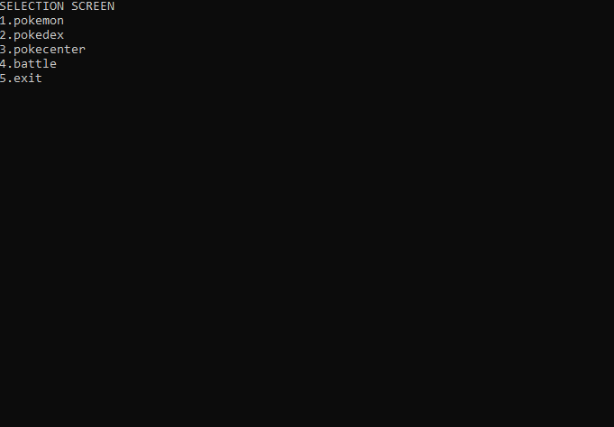

# Meetlat constructor (*Essential*)

**Doel:**
Pas de bestaande `Meetlat` klasse uit het vorige hoofdstuk aan om met een constructor te werken.

**Stappenplan:**

1.  **Verwijder** de write-only property `BeginLengte`.
2.  **Voeg toe** een private instantievariabele: `private double lengteInMeter;`.
3.  **Maak een Constructor** die één parameter aanvaardt (type `double`) en wijs deze waarde toe aan `lengteInMeter`.
4.  Pas de werking van de overige properties aan zodat ze nu deze nieuwe variabele gebruiken in plaats van de property.

**Voorbeeldgebruik:**
```java
// Oude manier (werkt NIET meer na aanpassing):
// Meetlat m = new Meetlat();
// m.BeginLengte = 5;

// Nieuwe manier:
Meetlat m = new Meetlat(5);
Console.WriteLine(m.LengteInCm);
```

::::{.callout-caution collapse="true" title="Oplossing"}
```java
public class Meetlat
{
    public Meetlat(double lengtestart)
    {
        lengteInM=lengtestart;
    }

    private double lengteInM;

    public double LengteInCm
    {
        get{ return lengteInM*100;}
    }

    public double LengteInKm
    {
        get{ return lengteInM/1000;}
    }

    public double LengteInVoet
    {
        get{ return lengteInM*3.2808;}
    }
}
```
::::


# Persoonsregistratie (*Essential*) (GPT)

:::{.callout-tip}
Deze oefening werd gemaakt (en aangepast nadien) met [behulp van volgende GPT](https://chat.openai.com/g/g-TllbzOiKJ-zie-scherp-scherper-praktijkoefeningen) en heeft daarom de tag (GPT) achter de titel staan. 
:::

**Doel:**
Gebruik constructors en object initializers om personen aan te maken.

**Specificaties:**

*   **Klassenaam:** `Persoon`
*   **Properties (Auto):**
    *   `Voornaam` (`string`)
    *   `Achternaam` (`string`)
    *   `Geboortejaar` (`int`)
    *   `Email` (`string`)

*   **Constructor:**
    *   Parameters: `voornaam`, `achternaam`.
    *   **Validatie:**
        *   Indien `voornaam` gelijk is aan `achternaam` -> Werp een `ArgumentException` op met de boodschap "Voornaam en achternaam mogen niet hetzelfde zijn".

*   **Methode:**
    *   `ToonInformatie()` (`void`): Toont de tekst: `"{Voornaam} {Achternaam} geboren in {Geboortejaar} heeft emailadres: {Email}"`.

**Opdracht in Main:**

1.  Maak een `Persoon` object aan met de constructor.
2.  Gebruik **Object Initializer Syntax** om ook meteen `Geboortejaar` en `Email` in te stellen.
    *   *Voorbeeld:* `new Persoon("Jan", "Janssens") { Geboortejaar = 1990, ... }`

3.  Roep `ToonInformatie()` aan.
4.  Schrijf code die test of je applicatie **niet krasht** als je een foutieve naam ingeeft (gebruik `try-catch`).

::::{.callout-caution collapse="true" title="Oplossing"}
```java
class Persoon
{
    public Persoon(string vNaam, string aNaam)
    {

        if(vNaam == aNaam)
            throw new Exception("Voornaam en achternaam mag niet hetzelfde zijn");

        Voornaam = vNaam;
        Achternaam = aNaam;
    }

    public string Voornaam { get; set; }
    public string Achternaam { get; set; }
    public int Geboortejaar { get; set; }
    public string Email { get; set; }

    internal void ToonInformatie()
    {
        Console.WriteLine($"{Voornaam} {Achternaam} geboren in {Geboortejaar} heeft emailadres: {Email}");
    }
}
```

Werking in Main testen:

```java
try
{
    Persoon p = new Persoon("Tim", "Dams") { Geboortejaar = 1981, Email= "tim.dams@ap.be" };
    p.ToonInformatie();
}
catch(Exception ex)
{
    Console.WriteLine(ex.Message);
}

```
::::


# Stevens constructors (*Essential*) {#h11-stevens-constructors}

Stagiair Steven moest vier kleine klassen afwerken, telkens met een constructor erbij. Hij liet een A.I. het werk doen en leverde alles in zonder één keer op "Start" te klikken.

Lees elk stuk eerst zonder Visual Studio en antwoord op papier: compileert het? Zo nee, waar zit de fout en waarom? Zo ja, wat toont het programma? Typ de code pas daarna over en kijk of je gelijk had.

**Deel 1.** Een rugzak die weet hoeveel liter erin kan:

```java
internal class Rugzak
{
    private double inhoudInLiter;

    public void Rugzak(double inhoud)
    {
        inhoudInLiter = inhoud;
    }

    public double InhoudInLiter
    {
        get { return inhoudInLiter; }
    }
}
```

In ``Main``:

```java
Rugzak schoolRugzak = new Rugzak(25);
Console.WriteLine($"Deze rugzak kan {schoolRugzak.InhoudInLiter} liter aan.");
```

Compileert dit? Zo niet, wat moet er anders?

::::{.callout-caution collapse="true" title="Oplossing"}
Nee. Door ``void`` is ``Rugzak`` geen constructor meer, maar een gewone methode die toevallig zo heet als de klasse. Dat mag niet, en de compiler wijst de methode aan, niet de regel met ``new``:

```text
error CS0542: 'Rugzak': member names cannot be the same as their enclosing type
```

Een *member* is alles wat in een klasse staat: instantievariabelen, properties, methoden. Een constructor heeft geen returntype, ook geen ``void``. Schrap dat woord:

```java
public Rugzak(double inhoud)
{
    inhoudInLiter = inhoud;
}
```

Nu toont het programma:

```text
Deze rugzak kan 25 liter aan.
```
::::

**Deel 2.** Een boek met een titel. Steven had zijn ``Main`` al geschreven voor de A.I. de constructor toevoegde:

```java
internal class Boek
{
    public Boek(string titelIn)
    {
        Titel = titelIn;
    }

    public string Titel { get; private set; }
    public int AantalPaginas { get; set; }
}
```

In ``Main``:

```java
Boek roman = new Boek("De Avonden");
roman.AantalPaginas = 316;

Boek notitieboek = new Boek();
notitieboek.AantalPaginas = 80;

Console.WriteLine($"{roman.Titel} telt {roman.AantalPaginas} pagina's.");
Console.WriteLine($"{notitieboek.Titel} telt {notitieboek.AantalPaginas} pagina's.");
```

Compileert dit? Zo niet, los het op twee manieren op: één keer door enkel ``Main`` aan te passen, en één keer door enkel de klasse aan te passen.

::::{.callout-caution collapse="true" title="Oplossing"}
Nee. De regel ``Boek notitieboek = new Boek();`` geeft:

```text
error CS7036: There is no argument given that corresponds to the required parameter 'titelIn' of 'Boek.Boek(string)'
```

Zodra je zelf een constructor schrijft, ben je de gratis default constructor kwijt. ``Boek`` heeft nu enkel nog een constructor die een titel wil, en ``new Boek()`` geeft er geen. Heeft een klasse twee of meer constructors, dan krijg je de melding uit het boek: ``'Boek' does not contain a constructor that takes 0 arguments``. Het probleem is hetzelfde.

**Enkel ``Main`` aanpassen:** geef het notitieboek toch een titel.

```java
Boek notitieboek = new Boek("Notities");
```

**Enkel de klasse aanpassen:** schrijf de default constructor er zelf bij, en laat hem met ``this(...)`` de constructor gebruiken die er al staat:

```java
public Boek() : this("Zonder titel")
{
}
```

Met die tweede manier toont het programma:

```text
De Avonden telt 316 pagina's.
Zonder titel telt 80 pagina's.
```
::::

**Deel 3.** Een pizzeria wil weten hoeveel bestellingen er vandaag al waren, en per tafel hoeveel pizza's die bestelde:

```java
internal class Bestelling
{
    private static int aantalBestellingen = 0;
    private int aantalPizzas;

    public Bestelling(int aantalPizzasIn)
    {
        aantalPizzas = aantalPizzasIn;
        aantalBestellingen++;
    }

    public static void ToonOverzicht()
    {
        Console.WriteLine($"Vandaag al {aantalBestellingen} bestellingen.");
        Console.WriteLine($"Deze bestelling telt {aantalPizzas} pizza's.");
    }
}
```

In ``Main``:

```java
Bestelling tafel1 = new Bestelling(3);
Bestelling tafel2 = new Bestelling(2);
Bestelling.ToonOverzicht();
```

Compileert dit? Zo niet, welke regel is het probleem? Pas de klasse en ``Main`` aan zodat het programma eerst het aantal bestellingen toont en daarna het aantal pizza's van elke tafel.

::::{.callout-caution collapse="true" title="Oplossing"}
Nee. De eerste ``WriteLine`` in ``ToonOverzicht`` is in orde, want ``aantalBestellingen`` is static en hoort bij de klasse. De tweede niet:

```text
error CS0120: An object reference is required for the non-static field, method, or property 'Bestelling.aantalPizzas'
```

``ToonOverzicht`` roep je op via de klassenaam, zonder object. Van welke bestelling moet hij dan het aantal pizza's tonen: die van tafel 1 of die van tafel 2?

Haal je ``static`` weg bij ``ToonOverzicht``, dan compileert het wel, maar dan moet je een tafel kiezen om de methode op te roepen. Een overzicht van de hele dag hoort niet bij één tafel. Splits de methode daarom in twee: een static methode voor wat bij de klasse hoort, en een gewone methode voor wat bij één bestelling hoort.

```java
internal class Bestelling
{
    private static int aantalBestellingen = 0;
    private int aantalPizzas;

    public Bestelling(int aantalPizzasIn)
    {
        aantalPizzas = aantalPizzasIn;
        aantalBestellingen++;
    }

    public static void ToonAantalBestellingen()
    {
        Console.WriteLine($"Vandaag al {aantalBestellingen} bestellingen.");
    }

    public void ToonInfo()
    {
        Console.WriteLine($"Deze bestelling telt {aantalPizzas} pizza's.");
    }
}
```

In ``Main``:

```java
Bestelling tafel1 = new Bestelling(3);
Bestelling tafel2 = new Bestelling(2);
Bestelling.ToonAantalBestellingen();
tafel1.ToonInfo();
tafel2.ToonInfo();
```

```text
Vandaag al 2 bestellingen.
Deze bestelling telt 3 pizza's.
Deze bestelling telt 2 pizza's.
```
::::

**Deel 4.** Een spaarpot:

```java
internal class Spaarpot
{
    private double bedrag;

    public Spaarpot(double bedrag)
    {
        bedrag = bedrag;
    }

    public double Bedrag
    {
        get { return bedrag; }
    }

    public void StopErIn(double extra)
    {
        bedrag = bedrag + extra;
    }
}
```

In ``Main``:

```java
Spaarpot pot = new Spaarpot(20);
pot.StopErIn(5);
Console.WriteLine($"In de spaarpot zit {pot.Bedrag} euro.");
```

Steven verwacht ``In de spaarpot zit 25 euro.`` Compileert dit? Wat toont het programma echt, en waarom?

::::{.callout-caution collapse="true" title="Oplossing"}
Het compileert, maar het programma toont:

```text
In de spaarpot zit 5 euro.
```

In de constructor heet de parameter net zoals de instantievariabele: ``bedrag``. Binnen de constructor verwijst ``bedrag`` dan naar de parameter, dus ``bedrag = bedrag;`` stopt de parameter in zichzelf. De instantievariabele wordt niet aangeraakt en blijft 0. ``StopErIn`` heeft geen parameter die ``bedrag`` heet, dus daar gaat het wel naar de instantievariabele: 0 + 5.

De compiler ziet het, maar geeft enkel een waarschuwing en geen fout:

```text
warning CS1717: Assignment made to same variable; did you mean to assign something else?
```

Een waarschuwing houdt je programma niet tegen. Geef de parameter een andere naam:

```java
public Spaarpot(double bedragIn)
{
    bedrag = bedragIn;
}
```

Nu toont het programma ``In de spaarpot zit 25 euro.`` Online zie je dit vaak opgelost met ``this.bedrag = bedrag;``. Het keyword ``this`` komt pas in hoofdstuk 15, een andere naam volstaat.
::::

::::{.callout-caution collapse="true" title="Les(sen) uit deze oefening"}
* Een constructor heeft geen returntype. Met ``void`` ervoor is het een gewone methode. Zie [Default constructors](https://www.ziescherp.be/content/10_advancedklassen/1_constructors.html#default-constructors).
* Schrijf je zelf een constructor, dan is de gratis default constructor weg. Heb je hem nodig, schrijf hem er dan bij en hergebruik de andere constructor met ``this(...)``. Zie [Overloaded constructors](https://www.ziescherp.be/content/10_advancedklassen/2_overloadedconstructor.html) en [Constructors hergebruiken met this()](https://www.ziescherp.be/content/10_advancedklassen/2_overloadedconstructor.html#constructors-hergebruiken-met-this).
* Een static methode heeft geen object en kan dus geen instantievariabelen lezen. Zie [Static tegenover non-static](https://www.ziescherp.be/content/10_advancedklassen/5_static.html#static-tegenover-non-static).
* Deel 4 compileert, met één waarschuwing. Lees in de Error List ook de waarschuwingen, niet enkel de fouten.
::::


# Digitale kluis (*Essential*)

{.illustratie fig-alt="Potloodtekening: de robot probeert een kluis te kraken met een stethoscoop, het stokmannetje leunt ertegen met de sleutel."}


## Basiskluis

:::{.callout-tip}
[Maak je oplossing in een kopie van volgende solution met bijhorende unittests](https://github.com/timdams/ZIESCHERPER_TESTS_H3_DigitaleKluis).
:::

**Specificaties:**

*   **Klassenaam:** `DigitaleKluis`
*   **Velden:**
    *   `private int code` (de echte code).
    *   `private int aantalPogingen` (standaard 0).

*   **Properties:**
    *   `CanShowCode` (`bool`): Mag de code getoond worden?
    *   `Code` (`int`): Full property met private set.
        *   *Get logica:*
            *   Als `CanShowCode == true`: Geef de echte `code` terug.
            *   Als `CanShowCode == false`: Geef altijd `-666` terug.
    *   `CodeLevel` (`int`) - ReadOnly:
        *   *Formule:* `code / 1000` (gehele deling).

**Constructors:**

*   Constructor die één `int` aanvaardt en deze instelt als de `code`.

**Methode `TryCode(int ingevoerdeCode)`:**
Deze methode controleert de code en geeft `true` (juist) of `false` (fout) terug. De methode print ook feedback naar de console.

**Beslissingstabel voor `TryCode`:**

| Situatie | Conditie | Actie (Console Output) | Return Waarde |
| :--- | :--- | :--- | :--- |
| **Valsspeler** | `ingevoerdeCode == -666` | "CHEATER" | `false` |
| **Reeds Geblokkeerd** | `aantalPogingen >= 10` | "Je hebt je 10 pogingen opgebruikt." | `false` |
| **Juiste Code** | `ingevoerdeCode == code` | "Geldige code. Aantal pogingen = {aantalPogingen}" | `true` |
| **Foute Code** | `ingevoerdeCode != code` | "Geen geldige code." <br> (Verhoog `aantalPogingen` met +1) | `false` |

## Kluizen kraken (Static Methode)

Voeg een statische methode toe om een kluis te kraken via brute-force.

**Specificaties:**

*   **Locatie:** In de klasse `DigitaleKluis`.
*   **Signatuur:** `static void BruteForce(DigitaleKluis kluis)`
*   **Werking:**
    1.  Start een lus die 10 keer herhaalt.
    2.  Kies telkens een willekeurig getal.
    3.  Probeer dit getal op de meegegeven `kluis` via `kluis.TryCode(getal)`.
    4.  Als `TryCode` `true` teruggeeft: Stop en toon "Gekraakt!".

*Test dit in je Main door een kluis aan te maken en `DigitaleKluis.BruteForce(mijnKluis)` aan te roepen.*

::::{.callout-caution collapse="true" title="Oplossing"}
**Basiskluis**

```java
public class DigitaleKluis
{
    private int code = 0x0000;

    public DigitaleKluis(int startcode)
    {
        Code = startcode;
    }

    public bool CanShowCode { get; set; }


    public int CodeLevel
    {
        get
        {
            return (code / 1000);
        }
    }

    public int Code
    {
        get
        {
            if (CanShowCode)
                return code;
            else
                return -666;
        }

        private set
        {
            code = value;
        }
    }

    private int aantalPogingen;
    public bool TryCode(int testcode)
    {
        if (aantalPogingen < 10)
        {
            aantalPogingen++;
            if (testcode == -666)
            {
                Console.WriteLine("CHEATER");
                return false;
            }
            else if (testcode == code)
            {
                Console.WriteLine($"Deze code is geldig. Aantalpogingen = {aantalPogingen}");
                return true;
            }
            Console.WriteLine("Dat is geen geldige code");
            
        }
        else
            Console.WriteLine("Je hebt je 10 pogingen opgebruikt.Sorry.");
        return false;
    }
}
```

**Kluizen kraken**

```java
public static void BruteForce(DigitaleKluis testKluis)
{

    Random rng =new Random();
    bool gevonden=false; 
    int tries =0;
    do
    {
        tries++;
        int test = r.Next(0,10000);
        if( testKluis.TryCode(test))
        {
            gevonden = true;
            Console.WriteLine($"Gevonden! Code is {test}");
        }
    }while(tries<10 && !gevonden)

}
```
::::


# Pokémon deel 2 (*Essential*)

## Constructors

Pas je `Pokemon` klasse aan zodat deze op 3 manieren aangemaakt kan worden. Dit betekent dat je 2 constructors moet toevoegen (de default constructor bestaat al, tenzij je die overschreven hebt).

**De 3 manieren:**

1.  **Default Constructor:**
    *   Gebruik: `new Pokemon()`
    *   Actie: Stel alle 6 base-stats standaard in op **10**.

2.  **Overloaded Constructor:**
    *   Gebruik: `new Pokemon(hp, att, def, spAtt, spDef, speed)`
    *   Actie: Stel de 6 base-stats in met de meegegeven waarden.

3.  **Object Initializer:**
    *   Gebruik: `new Pokemon() { HP_Base = 40, Naam = "Pikachu" }`
    *   Actie: Hiervoor hoef je niets speciaals te doen, dit werkt automatisch als je een parameterloze constructor hebt en de properties toegankelijk zijn.

:::{.callout-tip}
Zet de setters van je Base Stat properties op `private`. Hierdoor kunnen ze alleen aangepast worden *tijdens* de constructie (via constructor of initializer), maar niet meer *daarna*.
:::

## Static methoden en properties

Breid de klasse `Pokemon` uit met functionaliteit om statistieken over *alle* Pokémon bij te houden.

**Static Properties (Private Set):**

*   `TellerLevel`: Hoe vaak is `VerhoogLevel` in totaal aangeroepen?
*   `TellerBattles`: Hoeveel battles zijn er geweest?
*   `TellerGelijkspel`: Hoe vaak was het gelijkspel?
*   `TellerGeneraties`: Hoe vaak is `GeneratorPokemon` aangeroepen?
*   `NoLevelingAllowed` (`bool`, public set): Indien `true`, mag niemand nog levelen.

**Static Methoden:**

*   Verplaats `GeneratorPokemon` en `Battle` van `Program.cs` naar de klasse `Pokemon`. Pas ze aan zodat ze de tellers hierboven verhogen.
*   `static void Info()`: Print de waarden van alle tellers naar de console.

**Aanpassing `VerhoogLevel`:**

*   Controleer eerst `NoLevelingAllowed`.
    *   Indien `true`: Werp exception "Leveling not allowed".
    *   Indien `false`: Verhoog level en verhoog `TellerLevel`.

:::{.callout-tip}

Student Kevin Van Rooy maakte volgende applicatie waarbij bovenstaande opgave als initiële inspiratie diende:



:::


## Natures (PRO)

Pokémon hebben een "Nature" (aard) die hun stats beïnvloedt (+10% op één stat, -10 op een andere).

**Specificaties:**

1.  **Enum:** Definieer `Nature` (zie tabel).
2.  **Property:** Voeg een property `Nature` toe aan je Pokémon klasse.
3.  **Constructor:** Zorg dat elke nieuwe Pokémon een **willekeurige** Nature krijgt in de constructor.

**Implementatie van de Bonus:**
Pas de berekening van je Full Stats aan. Gebruik een helper-methode om je code netjes te houden.

*Tip: Maak een helper methode:*
`private double BerekenNatureModifier(StatType stat)`

*   Geeft `1.10` terug als de nature deze stat verhoogt.
*   Geeft `0.90` terug als de nature deze stat verlaagt.
*   Geeft `1.0` terug in alle andere gevallen.

Vermenigvuldig je Full Stat berekening met dit getal (en cast terug naar int).

| **Nature** | **Verhoogt met 10%** | **Verlaagt met 10** |
|---|---|---|
| Adamant	 | Attack	 | Sp. Atk
| Bashful	 | Sp. Atk	 | Sp. Atk
| Bold  | Defense	 | Attack
| Brave  | Attack	 | Speed
| Calm  | Sp. Def	 | Attack
| Careful	 | Sp. Def	 | Sp. Atk
| Docile  | Defense	 | Defense
| Gentle  | Sp. Def	 | Defense
| Hardy  | Attack	 | Attack
| Hasty  | Speed  | Defense
| Impish  | Defense	 | Sp. Atk
| Jolly  | Speed  | Sp. Atk
| Lax  | Defense	 | Sp. Def
| Lonely  | Attack	 | Defense
| Mild  | Sp. Atk	 | Defense
| Modest  | Sp. Atk	 | Attack
| Naive  | Speed  | Sp. Def
| Naughty	 | Attack	 | Sp. Def
| Quiet  | Sp. Atk	 | Speed
| Quirky  | Sp. Def	 | Sp. Def
| Rash  | Sp. Atk	 | Sp. Def
| Relaxed	 | Defense	 | Speed
| Sassy  | Sp. Def	 | Speed
| Serious	 | Speed  | Speed
| Timid  | Speed  | Attack

[Meer info over Natures](https://pokemondb.net/mechanics/natures)

::::{.callout-caution collapse="true" title="Oplossing"}
**Pokemon met deel 2**

We laten de reeds bestaande properties en methoden niet meer zien in deze oplossing:
```java

public class Pokemon
{
    //reeds bestaande properties en methoden
    // ...
    
    
    //En nu de nieuwe zaken:
    public void VerhoogLevel()
    {
        if(NoLevelingAllowed)
        {
            throw new Exception("Leveling of Pokemon not allowed. Change NoLevelingAllowed to false to reenable leveling");
        }
        else
        {
            TimesLeveled++;
            Level++;
        }
    }
    //Nieuw deel

    //Default constructor
    public Pokemon()
    {
        HP_Base=10;
        Attack_Base=10;
        Defense_Base=10;
        SpecialAttack_Base = 10;
        SpecialDefense_Base = 10;
        Speed_Base=10;
  
    }
    //Overloaded constructor
    public Pokemon(int hp, int att, int def, int spec_att, int spec_def, int speed)
    {
        HP_Base=hp;
        Attack_Base=att;
        Defense_Base=def;
        SpecialAttack_Base = spec_att;
        SpecialDefense_Base = spec_def;
        Speed_Base=speed;  
    }

    //static deel
    public static int TimesLeveled{get; private set;}  
    public static int TimesBattled{get; private set;}
    public static int TimesBattleDraw{get; private set;}
    public static int TimesRandomGenerated{get; private set;}
    public static bool NoLevelingAllowed{get; private set;}

    public static void Info()
    {
        Console.WriteLine($"Aantal keer geleveled:{TimesLeveled}");
        Console.WriteLine($"Aantal keer gevochten:{TimesBattled}");
        Console.WriteLine($"Waarvan {TimesBattleDraw} keren gelijke stand");
        Console.WriteLine($"Er werden {TimesRandomGenerated} random pokemons aangemaakt"); 
    }

    private static Random ran=new Random();
    public static Pokemon GeneratorPokemon ()
    {
        TimesRandomGenerated++;
        Pokemon temp= new Pokemon();
        temp.HP_base= ran.Next(1,100);
        temp.Attack_base=ran.Next(1,100);
        return temp;
    }
    public static int Battle(Pokemon poke1, Pokemon poke2)
    { 
        TimesBattled++;
        if(poke1 ==null && poke2 == null)
            return 0;
        if(poke1==null)
            return 2;
        if(poke2==null)
            return 1;

        if(poke1.Average > poke2.Average)
            return 1;
        else if (poke1.Average< poke2.Average)
            return 2;

        TimesBattleDraw++;
        return 0;
    }
}
```

**Pokemon Natures**

```java
enum PokeNatures {Adamant	,Bashful	,Bold ,Brave ,Calm ,Careful	,Docile ,Gentle ,Hardy ,Hasty ,Impish ,Jolly ,Lax ,Lonely ,Mild ,Modest ,Naive ,Naughty	,Quiet ,Quirky ,Rash ,Relaxed	,Sassy ,Serious	,Timid }

enum StatTypes {Attack, Special_Attack, Defense, Special_Defense, Speed}

```

In klasse Pokemon

```java
static Random rng = new Random();

private PokeNatures Nature {private set; get; }

public Pokemon(int hp, int att, int def, int spec_att, int spec_def, int speed)
{
    //...
    Nature = (PokeNatures)rng.Next(0,26)
}


private int NatureEffect(StatType currentStat)
{

    switch(Nature)
    {
        case PokeNatures.Adamant:
            if(currentStat == StatType.Attack)
                return 10;
            else if(currentStat == StatType.Special_Attack)
                return -10;
            else return 0;
            break;
        case PokeNatures.BashFull:
            //etc.
    }
    return 0;
}


public int Speed_Full
{
    get
    {
        return ((Speed_Base * Level) / 50) + 5 ) +  (((Speed_Base * Level) / 50) + 5 ) * NatureEffect(StatTypes.Speed);
    }
}

//en idem voor andere full stats

```
::::


# Sport simulator

Gebruik je `Sportspeler` (of `Voetballer`) klasse van de "Sports" oefening die je in hofdstuk 9, week 3, maakte. Voeg de volgende statische methoden toe aan **Program.cs**.

**1. SimuleerSpeler**

*   **Signatuur:** `static void SimuleerSpeler(Sportspeler speler)`
*   **Werking:**
    *   Roep in een loop 3 keer de acties van de speler aan (bv. `SchietOpDoel` en `MaakOvertreding`).

**2. SimuleerWedstrijd**

*   **Signatuur:** `static void SimuleerWedstrijd(Sportspeler speler1, Sportspeler speler2)`
*   **Werking:**
    *   Bepaal willekeurig wie wint (50/50 kans).
    *   Toon: "Speler X wint."
    *   Roep een actie aan van de winnaar.

**3. BesteSpeler**

*   **Signatuur:** `static Sportspeler BesteSpeler(Sportspeler speler1, Sportspeler speler2)`
*   **Werking:**
    *   Kies willekeurig een winnaar.
    *   Retourneer het winnende **object**.

**Test:**
Maak in je Main twee spelers aan en test deze 3 methoden.

::::{.callout-caution collapse="true" title="Oplossing"}
```java
public class Waterpolospeler
{
    private string spelersNaam;

    public string SpelersNaam
    {
        get { return spelersNaam; }
        private set { spelersNaam = value; }
    }

    private int mutsNummer;

    public int MutsNummer
    {
        get { return mutsNummer; }
        private set
        {
            if (value > 0 && value < 14) //checken dat de waarde van de muts tussen de 0 en 14 is
            {
                mutsNummer = value; //als het zo is dan zal de waarde aan de muts worden gegeven
            }
        }
    }

    private bool isDoelman;

    public bool IsDoelman
    {
        get { return isDoelman; }
        private set { isDoelman = value; }
    }
    private bool isReserve;

    public bool IsReserve
    {
        get { return isReserve; }
        private set { isReserve = value; }
    }

    private string reeks;

    public string Reeks
    {
        get { return reeks; }
        private set { reeks = value; }
    }
    public void Stelin(string naamin, int nummerin, bool doelin, bool reservein, string reeksin)
    {
        SpelersNaam = naamin;
        MutsNummer = nummerin;
        IsDoelman = doelin;
        IsReserve = reservein;
        Reeks = reeksin;
    }
    public void Gooibal()
    {
        Console.WriteLine($"Ik ({SpelersNaam}) gooi de bal");
    }

    public void Watertrappen()
    {
        Console.WriteLine($"nummer {MutsNummer} is aan het watertrappelen");
    }
    public void Tooninfo()
    {
        Console.WriteLine($@"
Naam: {SpelersNaam}
Mutsnummer: {MutsNummer}
Is doelman: {IsDoelman}
Is reserve: {IsReserve}
Reeks: {Reeks}

");


    }

    public static void SimuleerSpeler(Waterpolospeler testspeler)
    {
        for (int i = 0; i < 3; i++)
        {
            testspeler.Watertrappen();
        }
        for (int i = 0; i < 3; i++)
        {
            testspeler.Gooibal();
        }
    }

    public static void SimuleerWedstrijd(Waterpolospeler speler1, Waterpolospeler speler2)
    {
        Random rgen = new Random();
        if (rgen.Next(0, 10) < 5)
        {
            Console.WriteLine($"de winnaar is: {speler1.SpelersNaam}");
        }
        else
        {
            Console.WriteLine($"de winnaar is: {speler2.SpelersNaam}");
        }
    }
    public static Waterpolospeler BesteSpeler(Waterpolospeler speler1, Waterpolospeler speler2)
    {
        Random rgen = new Random();
        if (rgen.Next(0, 10) < 5)
        {
            return speler1;
        }
        else
        {
            return speler2;
        }
    }
}
```
::::


# Project: GreenRide (*Final Essential*)

**Scenario:**
Proficiat! Je bent zonet aangesteld als CTO (Chief Technical Officer) van **GreenRide**, de nieuwste hipste start-up van 't Stad. De missie? De wereld veroveren met elektrische deelsteps.

De investeerders zijn enthousiast, maar er is één probleem: er is nog geen software. Aan jou om de Core-Backend te schrijven die alle steps beheert, de winst berekent, en ervoor zorgt dat gebruikers niet kunnen wegrijden met een lege batterij.

Als CTO beslis je om slim gebruik te maken van **static** variabelen voor zaken die voor *alle* steps gelden (zoals de prijs), en **instance** variabelen voor unieke data (zoals de locatie en batterij van één specifieke step).

**Specificaties:**

**1. De `DeelStep` Klasse**

*   **Statische Data (The Company Level):**
    *   `PrijsPerMinuut` (`double`): De huidige ritprijs als property. Standaard `0.25` euro. (Dit kan veranderen tijdens spitsuren!).
    *   `TotaalWinst` (`double`): De heilige graal. Houdt bij hoeveel euro **alle steps samen** al hebben opgebracht sinds de start van de server. Ook een static property.
    *   `AantalInGebruik` (`int`): Een live teller van hoeveel steps er *op dit eigenste moment* rondrijden. Wederom een static property (alle drie transformeren, en hebben dus geen set).
    *   `volgNummerGenerator` (`private static int`): Een interne teller om elke step een uniek ID te geven (start bij 1).

*   **Instance Data (The Step Level):**
    *   `ID` (`int`): Het unieke nummer van de step. (Read-only voor de buitenwereld).
    *   `BatterijNiveau` (`int`): Hoeveel energie heeft deze step nog? (0-100).
    *   `IsBezig` (`bool`): Is deze step momenteel verhuurd?

*   **Constructors:**
    *   `DeelStep()`: De "Fabrieksinstelling".
        *   Zet `BatterijNiveau` op 100.
        *   Ken een nieuw uniek `ID` toe via de statische generator (en verhoog die generator daarna).
    *   `DeelStep(int batterij)`: Voor steps die uit onderhoud komen.
        *   Zet `BatterijNiveau` op de meegegeven waarde.
        *   Ken ook hier een uniek `ID` toe.

*   **Methoden:**
    *   `StartRit()` (`void`):
        *   **Validatie:** Een step kan enkel vertrekken als:
            1.  De batterij > 10% is.
            2.  Hij niet al in gebruik is (`IsBezig` is false).
        *   **Actie:** Zet `IsBezig` op true, en verhoog de statische `AantalInGebruik`.
        *   **Output:** Toon *"Step [ID] vertrekt met [X]% batterij."* of een foutmelding indien niet mogelijk.

    *   `EindigRit(int aantalMinuten)` (`void`):
        *   **Validatie:** Kan enkel als de step effectief weg was.
        *   **Actie:**
            *   Zet `IsBezig` op false.
            *   Verlaag `AantalInGebruik`.
            *   Bereken de kost: `aantalMinuten * PrijsPerMinuut`.
            *   Voeg dit bedrag toe aan de statische `TotaalWinst`.
            *   Verminder de batterij: Simuleer dat 1 minuut rijden = 1% batterijverlies. (Zorg dat batterij niet onder 0 zakt).
        *   **Output:** Toon een bonnetje: *"Step [ID] terug. Ritprijs: €[Bedrag]. Resterende batterij: [X]%"*.

**2. Het Dashboard (Main Programma)**

Schrijf een simulatie in je `Program.cs` om aan de investeerders te tonen:

1.  **De Vloot:** Maak 3 steps aan (waarvan eentje met een platte batterij via de 2e constructor).
2.  **De Ochtendspits:**
    *   Laat step 1 en 2 vertrekken.
    *   Probeer step 3 te laten vertrekken (zou moeten falen wegens batterij).
    *   Toon hoeveel steps er nu in gebruik zijn (via de static property).

3.  **Prijsstijging:**
    *   Het begint te regenen en de vraag stijgt. De directie beslist: `DeelStep.PrijsPerMinuut = 0.50;`.

4.  **De Aankomst:**
    *   Laat step 1 stoppen na 20 minuten.
    *   Laat step 2 stoppen na 10 minuten.

5.  **De Balans:**
    *   Toon de `TotaalWinst` van het bedrijf.
    *   Toon de batterijstatus van step 1 (is die verminderd?).

**Extra (Pro):**
Voeg een statische methode `GeefGratisStroom()` toe aan de klasse, die alle steps (die niet bezig zijn) terug oplaadt naar 100%. (Hiervoor zal je wel een lijst van alle aangemaakte objecten moeten bijhouden in de klasse zelf... uitdagend!).

::::{.callout-caution collapse="true" title="Oplossing"}

::::
