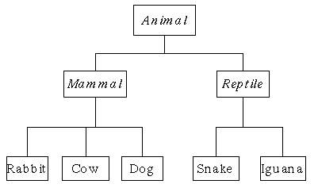
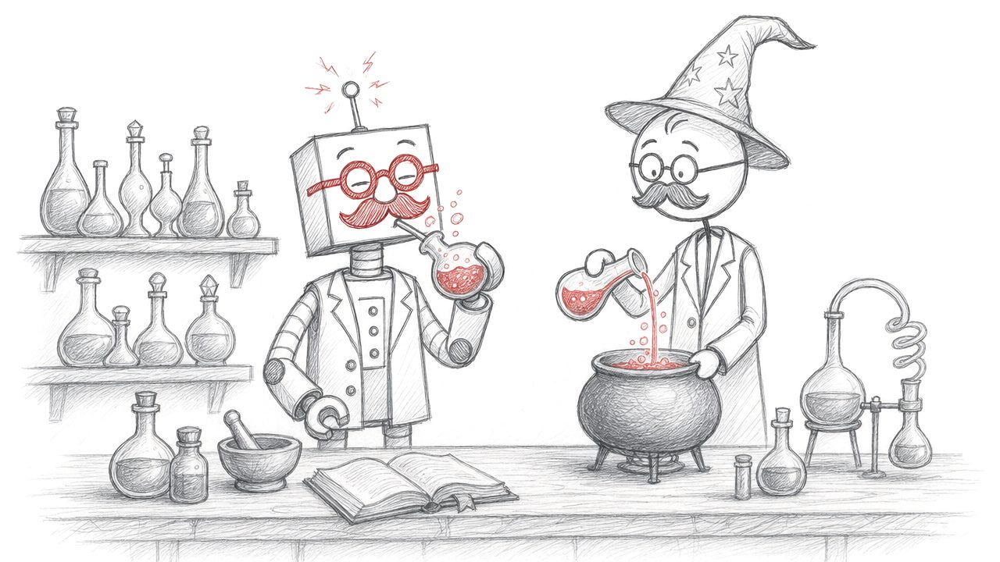

# Het dierenrijk



Maak bovenstaande klassenhierarchie na. Animal is de parentklasse , mammal en reptile zijn childklassen van Animal en zo voort.

Verzin voor iedere klasse een property die de parent klasse niet heeft. (bv Animal heeft "BeweegVoort", Reptile heeft "AantalSchubben", etc).

Voorzie in de klasse Animal een virtual methode ``ToonInfo`` die alle properties van de klasse op het scherm zet. De overgeërfde klassen overriden deze methode door de extra properties ook te tonen (maar gebruik base.ToonInfo om zeker de parentklasse werking te bewaren).

Maak nu van iedere klasse een object en roep de ToonInfo methode van ieder object aan.

Plaats deze dieren nu in een ``List<Animal>`` en kijk wat er gebeurt als je deze met een foreach aanroept om alle ToonInfo-methoden van ieder dier te gebruiken.

::::{.callout-caution collapse="true" title="Oplossing"}
```java
var alleBeestjes = new List<Animal>();
alleBeestjes.Add(new Animal() {NaamBeest="Dodo", IsUitgestorven=true });
alleBeestjes.Add(new Cow() {NaamBeest="Milkakoe", KleurVlekken="Paars" } );
alleBeestjes.Add(new Snake() { NaamBeest = "Cobra", HeeftRattelstaart = false });
alleBeestjes.Add(new Snake() { NaamBeest = "Ratelslang", HeeftRattelstaart = true });

foreach (var beest in alleBeestjes)
{
    beest.ToonInfo();
}
```

```java
public class Animal
{
    public string NaamBeest { get; set; }
    public bool IsUitgestorven { get; set; }
    public virtual void ToonInfo()
    {
        Console.WriteLine($"****{NaamBeest}****");
        if (IsUitgestorven)
            Console.WriteLine("Dit dier is uitgestorven");
        else Console.WriteLine("Dit dier is niet uitgestorven");
    }
}

public class Mammal : Animal 
{
    public string Biotoop { get; set; }
    public override void ToonInfo()
    {
        base.ToonInfo();
        Console.WriteLine($"En heeft als biotoop:{Biotoop}");
    }
}

public class Rabbit : Mammal {
    public int LengteOren { get; set; }
    public override void ToonInfo()
    {
        base.ToonInfo();
        Console.WriteLine($"De lengte van dit konijn z'n oren is {LengteOren}");
    }
}
public class Cow : Mammal {
    public string   KleurVlekken { get; set; }
    public override void ToonInfo()
    {
        base.ToonInfo();
        Console.WriteLine($"Deze koe heeft {KleurVlekken} vlekken");
    }
}
public class Dog : Mammal { }
public class Reptile : Animal { }
public class Snake : Reptile 
{
    public bool HeeftRattelstaart { get; set; }
    public override void ToonInfo()
    {
        base.ToonInfo();
        if(HeeftRattelstaart)
            Console.WriteLine("Deze slang heeft een ratelstaart");
        else Console.WriteLine("Deze slang heeft geen ratelstraat");
    }
}
public class Iguana : Reptile { }
```
::::


# Magische dranken (*Essential*, GPT)

*In deze opdracht ontwerp je een systeem waarin dranken niet alleen dorst lessen, maar ook mysterieuze krachten bezitten. Van gewone drankjes tot zeldzame elixers: elke slok telt! 🧪✨*

{.illustratie fig-alt="Potloodtekening: het stokmannetje met tovenaarshoed brouwt een drankje, de robot drinkt een rood elixir en er springen vonken uit zijn antenne."}

Ontwerp een systeem waarin verschillende dranken een *magische kracht*”* hebben.

* Maak een basis‑klasse ``Drank`` met:
  * Een property voor de naam van de drank.
  * Een constructor die de naam instelt.
  * Een virtuele methode ``BerekenKracht()`` die een standaard krachtwaarde (50) teruggeeft.

* Maak een sub‑klasse ``Elixer`` die erft van ``Drank`` en een extra property ``IsZeldzaam`` bevat.
  * Overschrijf de methode ``BerekenKracht()`` zodat eerst de basiskracht (verkregen via ``base.BerekenKracht()``) wordt berekend en vervolgens een bonus wordt opgeteld: +20 als ``IsZeldzaam`` ``true`` is, anders +10.

Implementeer een hoofdprogramma waarin je meerdere drankobjecten (bijv. een gewoon drankje en een zeldzaam elixer) aanmaakt en hun berekende kracht op de console toont.

::::{.callout-caution collapse="true" title="Oplossing"}
```java
class Drank
{
    public string Naam { get; set; }

    public Drank(string naam)
    {
        Naam = naam;
    }

    public virtual int BerekenKracht()
    {
        return 50;
    }
}


class Elixer : Drank
{
    public bool IsZeldzaam { get; set; }

    public Elixer(string naam, bool isZeldzaam) : base(naam)
    {
        IsZeldzaam = isZeldzaam;
    }

    public override int BerekenKracht()
    {
        int basisKracht = base.BerekenKracht();
        int bonus 10;
        if(IsZeldzaam)
        {
            bonus = 20;
        }
        return basisKracht + bonus;
    }
}


class Program
{
    static void Main(string[] args)
    {

        Drank gewoonDrank = new Drank("Gewone Cola");
        Elixer zeldzaamElixer = new Elixer("Mystiek Elixer", true);
        Elixer standaardElixer = new Elixer("Standaard Elixer", false);

        Console.WriteLine($"{gewoonDrank.Naam} heeft kracht: {gewoonDrank.BerekenKracht()}");
        Console.WriteLine($"{zeldzaamElixer.Naam} heeft kracht: {zeldzaamElixer.BerekenKracht()}");
        Console.WriteLine($"{standaardElixer.Naam} heeft kracht: {standaardElixer.BerekenKracht()}");
    }
}
```
::::


# Ziekenhuis (*Essential*)

**Deel 1**

Maak een basisklasse ``Patient`` die een programma kan gebruiken om de doktersrekening te berekenen.
Een patiënt heeft:

* een naam
* het aantal uur dat hij in het ziekenhuis heeft gelegen

Een ``virtual`` methode ``BerekenKost`` zal de totaalkost berekenen en teruggeven. Deze bestaat uit 50euro+  20euro per uur dat de patiënt in het ziekenhuis lag.

Maak een methode ``ToonInfo`` die steeds de naam van de patiënt toont gevolgd door het aantal uur en z'n kosten.

**Deel 2**

Maak een specialisatieklasse ``VerzekerdePatient``. Deze klasse heeft alles dat een gewone ``Patient`` heeft, echter de berekening van de kosten zal steeds gevolgd worden door een 10% reductie.

Toon de werking aan van deze klasse.

::::{.callout-caution collapse="true" title="Oplossing"}
**Deel 1**

```java
public class Patient
{
    public string Naam { get; set; }
    public int UrenInZiekenhuis { get; set; }

    private const int basisKost= 50;
    private const int kostPerUur = 20;
    public virtual double BerekenKost()
    {
        int kost = basisKost + (UrenInZiekenhuis * kostPerUur);
        return kost;
    }

    public void ToonInfo()
    {
        Console.WriteLine($"{Naam} (Kost:{BerekenKost()})");
    }
}
```

**Deel 2**

```java
public class VerzekerdePatient : Patient
{
    private const double korting = 0.1;
    public override double BerekenKost()
    {
        double totaalBasisKost = base.BerekenKost();
        return totaalBasisKost - (totaalBasisKost * korting);
    }
}
```

Aantonen werking:

Eenvoudig:

```java
Patient JosFromUSA = new Patient() 
    { Naam = "American Jos", UrenInZiekenhuis = 10 };
VerzekerdePatient JosFromBelgium = new VerzekerdePatient() 
    { Naam = "Belgische Jos", UrenInZiekenhuis = 10 };
JosFromUSA.ToonInfo();
JosFromBelgium.ToonInfo();
```

Complexer:

```java
List<Patient> allePatienten = new List<Patient>()
{
    new Patient() { Naam = "American Jos", UrenInZiekenhuis = 10 },
    new VerzekerdePatient() { Naam = "Belgische Jos", UrenInZiekenhuis = 10 },

};

foreach (var patient in allePatienten)
{
    patient.ToonInfo();
}
```
::::


# Stevens dierentuin (*Essential*) {#h13-stevens-dierentuin}

Stagiair Steven werkt voor de dierentuin. Hij moest een klasse ``Dier`` schrijven en een klasse ``Leeuw`` die ervan erft: een leeuw eet anders en maakt een ander geluid dan een gewoon dier. Een A.I. leverde dit, en Steven plakte het zonder nalezen in zijn project.

De klasse ``Dier``:

```java
internal class Dier
{
    private int kiloVoerPerDag;

    public string Naam { get; private set; }

    public Dier(string naam, int kiloVoer)
    {
        Naam = naam;
        kiloVoerPerDag = kiloVoer;
    }

    public void Eet()
    {
        Console.WriteLine($"{Naam} eet {kiloVoerPerDag} kg voer.");
    }

    public virtual void MaakGeluid()
    {
        Console.WriteLine($"{Naam} maakt geluid.");
    }
}
```

De klasse ``Leeuw``:

```java
internal class Leeuw : Dier
{
    public bool IsMannetje { get; private set; }

    public Leeuw(string naam, int kiloVlees, bool isMannetje)
    {
        IsMannetje = isMannetje;
    }

    public override void Eet()
    {
        Console.WriteLine($"{Naam} verslindt {kiloVoerPerDag} kg vlees.");
    }

    public void MaakGeluid()
    {
        if (IsMannetje)
        {
            Console.WriteLine($"{Naam} brult: ROAAAR!");
        }
        else
        {
            Console.WriteLine($"{Naam} gromt.");
        }
    }
}
```

En in ``Main``:

```java
Dier kameel = new Dier("Kamiel", 12);
Dier leeuw = new Leeuw("Simba", 7, true);

kameel.Eet();
kameel.MaakGeluid();
leeuw.Eet();
leeuw.MaakGeluid();
```

**Deel 1.** Zet elke klasse in een eigen bestand en compileer. De compiler meldt één fout en één waarschuwing. Los de fout op. De waarschuwing laat je voorlopig staan.

::::{.callout-caution collapse="true" title="Oplossing"}
``CS0506 'Leeuw.Eet()': cannot override inherited member 'Dier.Eet()' because it is not marked virtual, abstract, or override``

``Leeuw`` schrijft ``override`` bij ``Eet``, maar in ``Dier`` staat ``Eet`` niet ``virtual``. Maak er in ``Dier`` ``public virtual void Eet()`` van.

``override`` weghalen in ``Leeuw`` is geen oplossing. Dan compileert het wel, maar eet ``leeuw`` (een variabele van het type ``Dier``) als een gewoon dier.

Zag je nog andere rode kronkels in Visual Studio? Die komen in deel 2. Bij het compileren kijkt C# eerst of de klassen en hun methoden kloppen, zoals een ``override`` zonder ``virtual``. Pas daarna controleert hij de code in de methoden en de constructors.
::::

**Deel 2.** Compileer opnieuw. Nu verschijnen er twee nieuwe fouten. Los ze allebei op, zonder ``Dier`` een extra constructor te geven.

::::{.callout-caution collapse="true" title="Oplossing"}
1. ``CS0122 'Dier.kiloVoerPerDag' is inaccessible due to its protection level``, in ``Eet`` van ``Leeuw``. ``kiloVoerPerDag`` is ``private``, en private blijft private, ook voor een child-klasse. Maak er in ``Dier`` ``protected int kiloVoerPerDag;`` van: dan kan ``Leeuw`` erbij, en de buitenwereld nog altijd niet. ``public`` is niet nodig.
2. ``CS7036 There is no argument given that corresponds to the required parameter 'naam' of 'Dier.Dier(string, int)'``, bij de constructor van ``Leeuw``. Zonder ``base(...)`` roept C# de constructor van ``Dier`` zonder parameters op, en die bestaat niet. Geef de naam en het voer door:

```java
public Leeuw(string naam, int kiloVlees, bool isMannetje) : base(naam, kiloVlees)
{
    IsMannetje = isMannetje;
}
```

Dat de parameter in ``Leeuw`` ``kiloVlees`` heet en in ``Dier`` ``kiloVoer``, maakt niet uit: ``base(...)`` kijkt naar de volgorde en het type, niet naar de naam.

Een lege constructor ``Dier()`` bijschrijven laat de fout ook verdwijnen, maar dan krijgt de leeuw nooit een naam of een hoeveelheid voer.
::::

**Deel 3.** Het programma compileert nu, met enkel nog de waarschuwing van deel 1. Voer het uit. Welke lijn klopt niet? Zoek de vierde fout. Wat had de waarschuwing je al verteld?

::::{.callout-caution collapse="true" title="Oplossing"}
De uitvoer is:

```text
Kamiel eet 12 kg voer.
Kamiel maakt geluid.
Simba verslindt 7 kg vlees.
Simba maakt geluid.
```

Simba is een mannetje, dus de laatste lijn moest ``Simba brult: ROAAAR!`` zijn. De waarschuwing zei het al:

``CS0114 'Leeuw.MaakGeluid()' hides inherited member 'Dier.MaakGeluid()'. To make the current member override that implementation, add the override keyword. Otherwise add the new keyword.``

``MaakGeluid`` staat wel ``virtual`` in ``Dier``, maar in ``Leeuw`` ontbreekt ``override``. Dat is *hiding*: de methode van ``Leeuw`` verbergt die van ``Dier`` in plaats van ze te overschrijven. ``leeuw`` is een variabele van het type ``Dier``, dus draait de versie van ``Dier``. Schrijf in ``Leeuw``:

```java
public override void MaakGeluid()
```

Nu is de waarschuwing weg en toont de laatste lijn ``Simba brult: ROAAAR!``.

``new`` in plaats van ``override`` laat de waarschuwing ook verdwijnen, maar de uitvoer blijft ``Simba maakt geluid.``

Had Steven ``Leeuw leeuw = new Leeuw("Simba", 7, true);`` geschreven, dan had hij ``Simba brult: ROAAAR!`` gezien, en de fout nooit opgemerkt.
::::

::::{.callout-caution collapse="true" title="Les(sen) uit deze oefening"}
* De compiler meldt niet alle fouten tegelijk. Los de fout op die je ziet, en compileer opnieuw.
* ``virtual`` en ``override`` horen per methode bij elkaar. De A.I. zette ``virtual`` bij ``MaakGeluid`` en ``override`` bij ``Eet``, en dus klopte geen van beide.
* Een waarschuwing laat je programma starten, maar CS0114 wees hier net naar de enige fout die de compiler niet tegenhield. Zie de waarschuwing over hiding in [Een voorbeeld met vliegende objecten](https://www.ziescherp.be/content/12_overerving/1_virtual_override.html#een-voorbeeld-met-vliegende-objecten).
* Test een override via een variabele van het type van de parent. Via ``Leeuw`` zie je hiding niet.
* Zie ook [protected keyword](https://www.ziescherp.be/content/12_overerving/0_overerving_intro.html#protected-keyword) en [Overloaded constructors en base()](https://www.ziescherp.be/content/12_overerving/3_constructors_inheritance.html#overloaded-constructors-en-base).
::::


# HiddenBookmark

Voeg een ``HiddenBookmark`` klasse toe aan je bestaande Bookmark Manager applicatie van vorige hoofdstuk.

De ``HiddenBookmark`` is een ``Bookmark`` klasse die de ``ToonSite`` methode override door VOOR en NA dat de site op het scherm werd getoond er de tekst `**********INCOGNITO MODE************`  getoond wordt

Test wat er gebeurt als je al je bookmarks vervangt door ``HiddenBookmarks``.

::::{.callout-caution collapse="true" title="Oplossing"}
Zorg ervoor dat je ``ToonSite`` in de parentklasse ``Bookmark`` op ``virtual`` instelt.

```java
public class HiddenBookMark: BookMark
{
    public override void ToonSite()
    {
        Console.WriteLine("**********INCOGNITO MODE************");
        base.ToonSite();
        Console.WriteLine("**********INCOGNITO MODE************");
    }
}
```
::::


# Ballspel met overerving 

:::{.callout-tip}
Deze oefening bouwt verder op het Pong spel uit hoofdstuk 9 van het handboek.
:::


Volgende code toont hoe we een bestaande klasse  ``Ball`` kunnen overerven om een bestuurbare bal te maken 

## Basisklasse Ball

We maken een klasse ``Ball`` die via ``Update`` en ``Draw`` zichzelf over het consolescherm beweegt. Enkele opmerkingen:

* We maken sommige variabelen ``protected`` zodat later de overgeërfde klassen er aan kunnen
* Een ``static`` methode ``CheckHit`` laat ons toe te ontdekken of twee ``Ball``objecten mekaar raken

```java
class Ball
{
   public int X { get { return x; } }
   public int Y { get { return y; } }
   private int x = 0;
   private int y = 0;
   protected int vx = 0;
   protected int vy = 0;
   protected char drawChar = 'O';
   protected ConsoleColor drawColor = ConsoleColor.Red;

   public Ball(int xin, int yin, int vxin, int vyin)
   {
      x = xin;
      y = yin;
      vx = vxin;
      vy = vyin;
   }

   public void Update()
   {
      x += vx;
      y += vy;
      if (x >= Console.WindowWidth || x < 0)
      {
            vx *= -1;
            x += vx;
      }
      if (y >= Console.WindowHeight || y < 0)
      {
            vy *= -1;
            y += vy;
      }
   }
   public void Draw()
   {
      Console.SetCursorPosition(x, y);
      Console.ForegroundColor = drawColor;
      Console.Write(drawChar);
      Console.ResetColor();

   }

   static public bool CheckHit(Ball ball1, Ball ball2)
   {

      if (ball1.X == ball2.X && ball1.Y == ball2.Y)
            return true;

      return false;
   }
}
```

## Specialisatie klasse PlayerBall

De overgeërfde klasse ``PlayerBall`` is een ``Ball`` maar zal z'n ``vx`` en ``vy`` updaten gebaseerd op input via de ``ChangeVelocity`` methode:

```java
class PlayerBall : Ball
{
   public PlayerBall(int xin, int yin, int vxin, int vyin) : base(xin, yin, vxin, vyin)
   {
      drawChar = 'X';
      drawColor = ConsoleColor.Green;
   }

   public void ChangeVelocity(ConsoleKeyInfo richting)
   {
      switch (richting.Key)
      {
            case ConsoleKey.UpArrow:
               vy--;
               break;
            case ConsoleKey.DownArrow:
               vy++;
               break;
            case ConsoleKey.LeftArrow:
               vx--;
               break;
            case ConsoleKey.RightArrow:
               vx++;
               break;
            default:
               break;
      }
   }
}
```

## Eenvoudig spel

We maken nu een rudimentair spel waarin de gebruiker een bal moet proberen te raken. 

```java
static void Main(string[] args)
{
   Console.CursorVisible = false;
   Console.WindowHeight = 20;
   Console.WindowWidth = 30;
   Ball b1 = new Ball(4, 4, 1, 0);
   PlayerBall player = new PlayerBall(10, 10, 0, 0);
   while (true)
   {

         Console.Clear();

         //Ball
         b1.Update();
         b1.Draw();
         
         //SpelerBall
         if (Console.KeyAvailable)
         {
            var key = Console.ReadKey();
            player.ChangeVelocity(key);
         }

         player.Update();
         player.Draw();
         
         //Check collisions
         if (Ball.CheckHit(b1, player))
         {
            Console.Clear();
            Console.WriteLine("Gewonnen!");
            Console.ReadLine();
         }
         System.Threading.Thread.Sleep(100);
   }
}
```

Kan je dit uitbreiden met?

* Ballen met andere eigenschappen
* Meerdere ballen die over het scherm vliegen (benodigdheden: array )
* Meerdere levels 
* Score gebaseerd op tijd die gebruiker nodig had om bal te raken (benodigdheden: teller die optelt na iedere ``Sleep``)
* PRO: collision detection tussen de ballen

::::{.callout-caution collapse="true" title="Oplossing"}

::::


# Drone Delivery System (*Final Essentials*, GPT)


*In deze oefening bouw je de software voor een futuristisch dronetransportbedrijf. Je beheert verschillende types drones die elk hun eigen eigenschappen hebben.*

## Stap 1: De basis
Maak een klasse `Drone` met:

* Eigenschap `Model` (string)
* Eigenschap `Battery` (int, start op 100)
* Een `virtual` methode `Fly()`:
    * Vermindert de batterij met 5.
    * Schrijft naar de console: "[Model] vliegt rond. Batterij: [Battery]%"
    * Als de batterij < 20 is, toont het ook: "Waarschuwing: Low Battery!"

## Stap 2: Specialisaties
Maak twee subclasses:

**1. DeliveryDrone**

* Heeft extra eigenschap `PayloadWeight` (int).
* Override de `Fly()` methode:
    * Batterij vermindert met 5 + (`PayloadWeight` / 10).
    * Schrijft naar console: "[Model] levert zwaar pakketje (Zwaarte: [PayloadWeight]). Batterij: [Battery]%"

**2. RacingDrone**

* Heeft extra eigenschap `TopSpeed` (int).
* Override de `Fly()` methode:
    * Batterij vermindert met 10 (want hij vliegt snel).
    * Schrijft naar console: "[Model] raced tegen [TopSpeed] km/u. Batterij: [Battery]%"

## Stap 3: De Vloot (Polymorfisme)
Maak in je `Main` programma een `List<Drone>` aan.

* Voeg enkele gewone Drones, DeliveryDrones (met verschillende gewichten) en RacingDrones toe.
* Schrijf een `while`-lus die blijft draaien zolang er nog minstens één drone batterij > 0 heeft.
* Roep in de lus voor elke drone de `Fly()` methode aan.
* Zorg dat drones met een batterij van 0 of minder niet meer vliegen.
* **Tip**: Je kan dit simuleren met een `System.Threading.Thread.Sleep(500)` tussen de loops om het 'real-time' te laten lijken.

::::{.callout-caution collapse="true" title="Oplossing"}

::::
