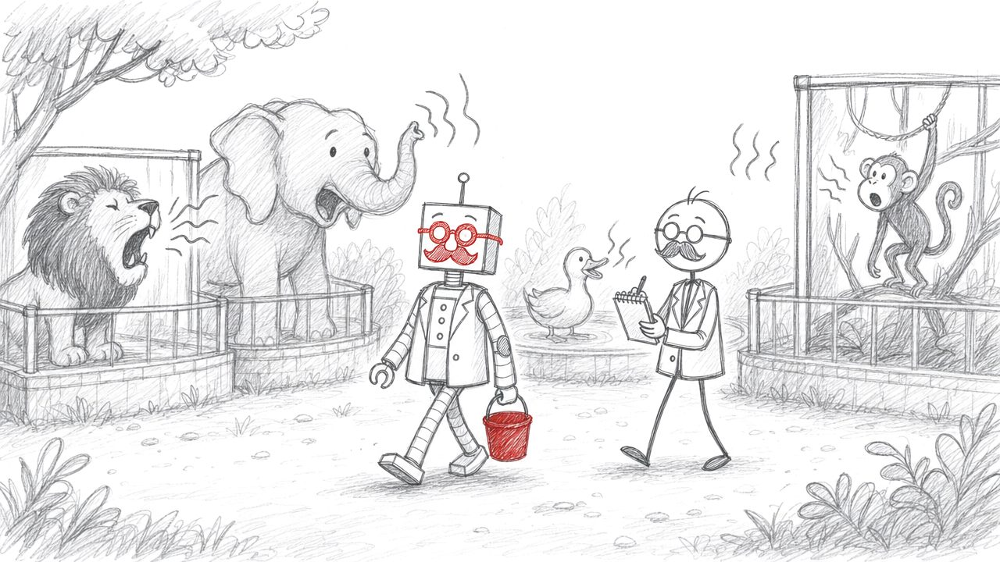

:::{.callout-tip}
Nu je overerving in de vingers krijgt, is het tijd om de ingebouwde "Class designer" van Visual Studio eens te bekijken. Volgende kennisclip toont hoe je deze handige tool kunt installeren en gebruiken:
[Class diagram en de class designer in Visual Studio](https://ap.cloud.panopto.eu/Panopto/Pages/Viewer.aspx?id=4d0a4b76-eed7-45e3-ba3f-ae8500fd94e9)
:::


# Extra ToString aan bestaande projecten
Voeg ToString toe aan bestaande van volgende projecten. Ik raad aan dat je dit even test in een nieuwe applicatie waarin je de bestaande klasse even toevoegt en niet de hele main overneemt.

**Pokémon extra**

Implementeer de ToString() methode in je ``Pokemon`` klasse zodat deze z'n full stats toont wanneer je schrijft:

```java
Console.WriteLine(myPokemon);
```

**Bookmark extra**

Implementeer de ToString() methode in zowel de ``Bookmark`` als de ``HiddenBookmark`` klasse. Bij bookmark moet de output bestaan uit de titel van de site, gevolgd door de url tussen haakjes, bv:

```text
Google (www.google.com)
```

Bij ``HiddenBookmark`` wordt er achteraan nog "---HIDDEN---" gezet:


```text
Reddit (www.reddit.com)  ---HIDDEN---
```

Zorg ervoor dat er géén dubbele code in HiddenBookmark staat (tip: ``base()``).

::::{.callout-caution collapse="true" title="Oplossing"}
**Pokémon Extra**

:::{.callout-tip}
**Les(sen) uit deze oefening:** ``ToString`` is een persoonlijke favoriet die je veel zult nodig hebben. We gebruiken string concatenering (``+``) bij het Pokemon-voorbeeld  om de volledig ``string`` leesbaar op het scherm te krijgen. 
:::

Voeg dit toe aan ``Pokemon`` klasse:
```java
public override string ToString()
{
    string toResturn =  $"{Naam}(Level:{Level})\n" +
        $"Base stats:\n" +
        $"\tHP_Base= {HP_Base}\n" +
        $"\tAttack_Base= {Attack_Base}\n";
        //Enz
    return toReturn;
}
```

**Bookmark Extra**

Voeg dit toe aan ``Bookmark``:

```java
public override string ToString()
{
    return $"{Naam} ({URL})";
}
```
:::{.callout-tip}
**Les(sen) uit deze oefening:** Let op de ``base.ToString()`` code die evoor zorgt dat de versie van het parent-object (``Bookmark``) ook nog steeds wordt toegevoegd.
:::

En dit aan ``HiddenBookmark``:

```java
public override string ToString()
{
    return $"{base.ToString()} ---HIDDEN---";
}
```
::::


# Boek (*Essential*)

Maak een klasse ``Boek``  en gebruik auto-properties voor de velden:

* ISBN (``long``)
* Titel (``string``)
* Auteur (``string``)
 
Maak voorts een full property voor ``Prijs`` (``double``)

Maak een child-klasse die van ``Boek`` overerft genaamd ``TekstBoek``. Een ``TekstBoek`` heeft één extra property:

* ``SchoolGraad`` (``int``)

Maak een child-klasse die van ``Boek`` overerft genaamd ``KoffietafelBoek``. Deze klasse heeft geen extra velden.


Voorts kunnen boeken "opgeteld" worden om als omnibus uitgebracht te worden. De titel wordt dan "Omnibus van X". waarbij X de Auteurs bevat, gescheiden met een komma. De prijs van een Omnibus is steeds de som van beide boeken gedeeld door 2. **Schrijf een ``static`` methode ``TelOp`` die twee ``Boek`` objecten als parameter aanvaardt en als returntype een nieuw ``Boek`` teruggeeft.** Deze methode voeg je toe aan de klasse ``Boek``

In beide child-klassen, override de ``Prijs``-setter zodat:
a)	Bij ``TekstBoek`` de prijs enkel tussen 20 en 80 kan liggen
b)	Bij ``KoffietafelBoek`` de prijs enkel tussen 35 en 100 kan liggen

:::{.callout-tip}
PRO:  Bekijk gerust de appendix indien je wilt weten hoe je de ``+`` operator kunt overriden om boeken op te tellen.
:::

* Zorg ervoor dat boeken de ``ToString`` overriden zodat je boekobjecten eenvoudig via ``Console.WriteLine(mijnBoek)`` hun info op het scherm tonen. Ze tonen deze info als volgt: "Titel - Auteur (ISBN) _ Prijs"  (bv The Shining - Stephen King (05848152) _ 50)


Maak boeken aan van de 3 klassen, toon dat de prijs niet altijd zomaar ingesteld kan worden.

::::{.callout-caution collapse="true" title="Oplossing"}
**Deel 1**

:::{.callout-tip}
**Les(sen) uit deze oefening:** De ``TelOp``methode is het hart van deze oefening. We maken deze ``static`` omdat we niet willen dat een bestaand boek zichzelf bij een ander boek  moet *optellen* en vinden het logischer dat een soort *god-methode* van de boeken dit voor ons doet. Let op de ``get`` code van beide child-klassen: we laten de werking van ``Boek`` hier in ere door gewoon ``base.Price`` aan te roepen. Enkel in de ``set`` bouwen we extra controle *rond* de originele ``set`` code van de parentklasse. 
:::

```java
public class Book
{
    public long ISBN { get; set; }
    public string Title { get; set; }
    public string Author { get; set; }

    private double price;

    public virtual double Price
    {
        get { return price; }
        set { price = value; }
    }

    public static Book TelOp(Book b1, Book b2)
    {
        Book result = new Book();

        result.Title = $"Omnibus van {b1.Author},{b2.Author}";
        result.Price = (b1.Price + b2.Price) / 2;

        return result;
    }

}

public class TextBook : Book
{
    public int GradeLevel { get; set; }

    public override double Price
    {
        get { return base.Price; }
        set
        {
            if (value >= 20 && value <= 80)
                base.Price = value;
        }
    }

    class CoffeeTableBook : Book
    {
        public override double Price
        {
            get { return base.Price; }
            set
            {
                if (value >= 35 && value <= 100)
                    base.Price = value;
            }
        }
    }
}
```

**Deel 2**

Voeg dit toe aan de klasse ``Book``

```java
public override string ToString()
{
    return $"{Title} - {Author}({ISBN}) {Price}";
}
```
::::


# Money, money, money (*Essential*)

Maak enkele klassen die een bank kan gebruiken (of hergebruik je ``BankManager`` code) : 

1. Abstracte klasse ``Rekening``: deze bevat een methode ``VoegGeldToe``  en ``HaalGeldAf``. Het saldo van de rekening wordt in een private variabele bijgehouden (en via de voorgaande methoden aangepast) die enkel via een read-only property kan uitgelezen worden. Voorts is er een abstracte methode ``BerekenRente`` de rente als double teruggeeft.
2. Een klasse ``BankRekening`` die een Rekening is. De rente van een BankRekening is 5% wanneer het saldo hoger is dan 100 euro, zoniet is deze 0%. 
3. Een klasse ``SpaarRekening`` die een Rekening is. De rente van een SpaarRekening bedraagt steeds 2%.
4. Een klasse ``ProRekening`` die een SpaarRekening is. De ProRekening hanteert de Rente-berekening van een SpaarRekening (``base.BerekenRente``) maar zal per 1000 euro saldo nog eens 10 euro verhogen. 

Schrijf deze klassen en toon de werking ervan in je main.

::::{.callout-caution collapse="true" title="Oplossing"}
```java
public abstract class Rekening
{
    private double saldo = 0;
    public double Saldo
    {
        get { return Saldo; }
    }
    public void VoegGeldToe(double hoeveel)
    {
        saldo += hoeveel;
    }

    public bool HaalGeldAf(double hoeveel)
    {
        if (saldo - hoeveel < 0)
            return false;

        saldo -= hoeveel;
        return true;
    }

    public abstract double BerekenRente();

}

public class BankRekening : Rekening
{
    public override double BerekenRente()
    {
        if(Saldo>0)
        {
            return Saldo + (Saldo*0.05);
        }
        return Saldo;
    }
}

public class SpaarRekening : Rekening
{
    public override double BerekenRente()
    {
        return Saldo+(Saldo*0.02);
    }
}

public class ProRekening : SpaarRekening
{
    public override double BerekenRente()
    {
        int aantal1000 =(int)Saldo / 1000;
        return base.BerekenRente() + aantal1000*10;
    }
}
```
::::


# Stevens abstracte bouwwerf (*Essential*) {#h14-stevens-abstracte-bouwwerf}

Stagiair Steven schrijft een programma voor een bouwbedrijf. Hij liet een A.I. de klassen maken en plakte alles in zijn project zonder het na te lezen. Niets compileert. Om plaats te sparen staan de klassen van een fragment hier onder elkaar. In je eigen project zet je elke klasse in een apart bestand.

**Fragment 1.**

```java
internal abstract class Bouwmachine
{
    public int Gewicht { get; set; }
}

internal class Graafmachine : Bouwmachine
{
    public int Bakinhoud { get; set; }
}

// in Main
Bouwmachine machine = new Bouwmachine();
machine.Gewicht = 12000;
```

**Fragment 2.**

```java
internal abstract class Materiaal
{
    public double Hoeveelheid { get; set; }

    public abstract double BerekenPrijs()
    {
        return 0;
    }
}

internal class Zand : Materiaal
{
    public override double BerekenPrijs()
    {
        return Hoeveelheid * 45;
    }
}
```

**Fragment 3.**

```java
internal class Werknemer
{
    public int Uren { get; set; }

    public abstract double BerekenLoon();
}

internal class Metser : Werknemer
{
    public override double BerekenLoon()
    {
        return Uren * 32.5;
    }
}
```

**Fragment 4.**

```java
internal abstract class Gebouw
{
    public int Verdiepingen { get; set; }

    public abstract int BerekenBouwtijd();
}

internal class Rijwoning : Gebouw
{
    public int BerekenBouwTijd()
    {
        return Verdiepingen * 8;
    }
}
```

**Fragment 5.**

```java
internal sealed class Werfkeet
{
    public int Zitplaatsen { get; set; }
}

internal class LuxeWerfkeet : Werfkeet
{
    public bool HeeftDouche { get; set; }
}
```

**Deel 1.** Steven zette elk fragment in een apart project. Dit zijn de vijf meldingen die hij kreeg, door elkaar:

- **A.** ``CS0534 'Rijwoning' does not implement inherited abstract member 'Gebouw.BerekenBouwtijd()'``
- **B.** ``CS0509 'LuxeWerfkeet': cannot derive from sealed type 'Werfkeet'``
- **C.** ``CS0144 Cannot create an instance of the abstract type or interface 'Bouwmachine'``
- **D.** ``CS0513 'Werknemer.BerekenLoon()' is abstract but it is contained in non-abstract type 'Werknemer'``
- **E.** ``CS0500 'Materiaal.BerekenPrijs()' cannot declare a body because it is marked abstract``

Koppel elke melding aan een fragment. Zoek daarna in dat fragment de lijn die het probleem veroorzaakt, en zeg in je eigen woorden welke regel Steven brak. Doe het op papier, zonder Visual Studio.

::::{.callout-caution collapse="true" title="Oplossing"}
1. Fragment 1 hoort bij **C**. ``Bouwmachine`` is abstract, dus ``new Bouwmachine()`` mag niet.
2. Fragment 2 hoort bij **E**. Een abstracte methode heeft geen body: na de signatuur komt een puntkomma, geen accolades.
3. Fragment 3 hoort bij **D**. ``BerekenLoon`` is abstract, maar de klasse ``Werknemer`` niet. Een abstracte methode mag enkel in een abstracte klasse staan.
4. Fragment 4 hoort bij **A**. ``Gebouw`` verplicht elke child om ``BerekenBouwtijd`` te overriden. ``Rijwoning`` heeft een methode ``BerekenBouwTijd``, met een hoofdletter T en zonder ``override``. Voor C# is dat een andere methode. De melding wijst naar de klasse ``Rijwoning``, terwijl de fout in de methode zit.
5. Fragment 5 hoort bij **B**. ``Werfkeet`` is ``sealed``, dus geen enkele klasse mag ervan overerven.
::::

**Deel 2.** Herstel elk fragment met zo weinig mogelijk aanpassingen, zodat het compileert en doet wat Steven bedoelde. Test elk fragment in een eigen project.

::::{.callout-caution collapse="true" title="Oplossing"}
**Fragment 1.** Maak een object van de child:

```java
Graafmachine machine = new Graafmachine();
machine.Gewicht = 12000;
```

``abstract`` weghalen bij ``Bouwmachine`` compileert ook, maar dan kan je weer een machine maken die geen echte machine is. Dat is net wat ``abstract`` hier verhindert.

**Fragment 2.** Vervang de body door een puntkomma. ``Zand`` blijft zoals het was.

```java
public abstract double BerekenPrijs();
```

**Fragment 3.** Maak de klasse abstract. ``Metser`` overridet ``BerekenLoon`` al, dus daar verandert niets.

```java
internal abstract class Werknemer
{
    public int Uren { get; set; }

    public abstract double BerekenLoon();
}
```

**Fragment 4.** Schrijf de naam exact zoals in ``Gebouw``, en zet er ``override`` bij:

```java
internal class Rijwoning : Gebouw
{
    public override int BerekenBouwtijd()
    {
        return Verdiepingen * 8;
    }
}
```

Pas je enkel de naam aan, dan blijft CS0534 staan en komt er een waarschuwing bij: ``CS0114 'Rijwoning.BerekenBouwtijd()' hides inherited member 'Gebouw.BerekenBouwtijd()'. To make the current member override that implementation, add the override keyword. Otherwise add the new keyword.``

**Fragment 5.** Haal ``sealed`` weg:

```java
internal class Werfkeet
{
    public int Zitplaatsen { get; set; }
}
```

Is ``Werfkeet`` niet van jou, bijvoorbeeld omdat ze in .NET zelf zit, dan kan je ``sealed`` niet weghalen. Dan kan ``LuxeWerfkeet`` er ook niet van overerven.
::::

**Deel 3.** Voor wie nog wil. Stevens namespace heet ``Bouwwerf``, dus ``kraan.GetType()`` toont ``Bouwwerf.Kraan``. Steven wil ``Kraan van 40 meter`` op het scherm. De A.I. stelde dit voor:

```java
internal class Kraan
{
    public int Hoogte { get; set; }

    public override string GetType()
    {
        return "Kraan";
    }
}

// in Main
Kraan kraan = new Kraan();
kraan.Hoogte = 40;
Console.WriteLine($"{kraan.GetType()} van {kraan.Hoogte} meter");
```

Waarom compileert dit niet? Hoe krijgt Steven wel ``Kraan van 40 meter`` op het scherm?

::::{.callout-caution collapse="true" title="Oplossing"}
De melding is ``CS0506 'Kraan.GetType()': cannot override inherited member 'object.GetType()' because it is not marked virtual, abstract, or override``.

Van de vier methoden die elke klasse van ``System.Object`` erft, zijn er drie ``virtual``: ``ToString``, ``Equals`` en ``GetHashCode``. ``GetType`` is dat niet, want die geeft altijd het echte type van het object terug. Haal de methode uit ``Kraan`` weg en vraag enkel de naam van het type op:

```java
Console.WriteLine($"{kraan.GetType().Name} van {kraan.Hoogte} meter");
```
::::

::::{.callout-caution collapse="true" title="Les(sen) uit deze oefening"}
* Elke melding noemt tussen aanhalingstekens de klasse of methode waar het misloopt. Daar begin je te zoeken, maar de fout staat niet altijd op die plek: CS0534 wijst naar ``Rijwoning``, en het probleem was één hoofdletter in de naam van de methode.
* Zet je de vijf fragmenten samen in één project, dan meldt de compiler er maar vier. CS0144 verschijnt pas als de andere vier opgelost zijn. Krijg je na een herstelling een nieuwe melding, dan zat die fout er dus al.
* Zie [Abstracte klassen in C#](https://www.ziescherp.be/content/13_advancedovererving/5_abstract.html#abstracte-klassen-in-c), [Abstracte methoden](https://www.ziescherp.be/content/13_advancedovererving/5_abstract.html#abstracte-methoden), [sealed](https://www.ziescherp.be/content/12_overerving/0_overerving_intro.html#sealed) en [GetType()](https://www.ziescherp.be/content/13_advancedovererving/4_System_Object.html#gettype).
::::


# Geometric figures (*Essential*)

Maak een abstracte klasse ``GeometricFigure``. Iedere figuur heeft een hoogte, breedte en oppervlakte. Maak autoproperties voor van ``Hoogte`` en ``Breedte``. De ``Oppervlakte`` is een read-only property want deze wordt berekend gebaseerd op de hoogte en breedte. Deze berekening gebeurt in de methode ``BerekenOppervlakte``: deze roep je met andere woorden aan in de getter van ``Oppervlakte`` en dat resultaat geeft de getter terug 

:::{.callout-warning}
Let er dus op dat ``Oppervlakte`` enkel een getter heeft. Een setter schrijven zou vreemde bugs geven: wat als de gebruiker de Oppervlakte van de figuur zo aanpast, maar wel andere hoogte en breedte heeft ingesteld? Je zou dan een foute oppervlakte krijgen daar die niet berekend wordt.
:::

Voorzie een abstracte methode ``BerekenOppervlakte`` die een double teruggeeft.

Maak 3 klassen:

* Rechthoek: erft over van GeometricFigure. Oppervlakte is gedefinieerd als ``breedte * hoogte``.
* Vierkant: erft over van Rechthoek. Voorzie een constructor die lengte en breedte als parameter aanvaard: deze moeten gelijk zijn, indien niet zet je deze tijdens de constructie gelijk. Voorzie een 2e constructor die één parameter aanvaardt dat dan geldt als zowel de lengte als breedte. Deze klasse gebruikt de methode BerekenOppervlakte van de Rechthoek-klasse.
* Driehoek: erft over van GeometricFigure. Oppervlakte is gedefinieerd als ``breedte*hoogte/2.0``.

Maak een applicatie waarin je de werking van deze klassen aantoont

::::{.callout-caution collapse="true" title="Oplossing"}
```java
public abstract class GeometricFigure
{
    public int Hoogte { get; set; }
    public int Breedte { get; set; }
    public double Oppervlakte
    {
        get
        {
            return BerekenOppervlakte();
        }
    }
    public abstract double BerekenOppervlakte();
}

public class Rechthoek : GeometricFigure
{
    public override double BerekenOppervlakte()
    {
        return Breedte * Hoogte;
    }
}

public class Vierkant: Rechthoek
{
    public Vierkant(int b, int h)
    {
        if (b!=h)
        {
            b = h;
        }
        Hoogte = h;
        Breedte = b;
    }

    public Vierkant(int l)
    {
        Hoogte = Breedte = l;
    }
}

public class Driehoek: GeometricFigure
{
    public override double BerekenOppervlakte()
    {
        return (Breedte * Hoogte) / 2.0;
    }
}
```
::::


# Dierentuin
Maak een console-applicatie waarin je een zelfverzonnen abstract klasse Dier in een List<Dier> kunt plaatsen. Ieder dier heeft een gewicht en een methode ``Zegt`` (die abstract is) die het geluid van het dier in kwestie op het scherm zal tonen. Maak enkele childklassen die overerven van Dier en uiteraard de ``Zegt`` methode overriden.

{.illustratie fig-alt="Potloodtekening: de robot als dierenverzorger wandelt langs een leeuw, een olifant, een eend en een aap die elk hun eigen geluid maken."}

Plaats enkele dieren in de nieuw aangemaakt lijst.
Vervolgens verschijnt er een menu Wanneer de gebruiker 'q' kiest stopt het programma.Het keuze menu heeft volgende opties:

1. Dier verwijderen , gevolgd door de gebruiker die invoert het hoeveelste dier weg moet uit de List.
2. Diergewicht gemiddelde: het gemiddelde van alle dieren hun gewicht wordt getoond
3. Dier praten: alle dieren hun Zegt() methode wordt aangeroepen en via WriteLine getoond
4. Opnieuw beginnen: de List wordt leeggemaakt en het programma zal terug van voor af aan beginnen. Waarbij de lijst terug gevuld wordt met enkele start dieren.

Probeer zo modulair mogelijk te werken.

::::{.callout-caution collapse="true" title="Oplossing"}
```java
Console.WriteLine("H13 Dierentuin");
List<Dier> Dieren = new List<Dier>();

string answer = "";
while (answer != "q")
{
    Console.WriteLine("wat wilt u doen?");
    Console.WriteLine("a = verwijder, b = gemiddelde gewicht, c = praten, d = opnieuw opstarten, q = stoppen ");
    answer = Console.ReadLine();
    switch (answer)
    {
        case "a":
            Console.WriteLine($"op welke plaats wilt u het verwijderen van 0 tot {Dieren.Count}");
            int nummer = Convert.ToInt32(Console.ReadLine());
            if (nummer < Dieren.Count)
                Dieren.RemoveAt(nummer);
            else
                Console.WriteLine("Dat nummer bestaat niet");
            break;
        case "b":
            int totaal = 0;
            foreach (var animal in Dieren)
            {
                totaal += animal.Gewicht;
            }
            double gemiddelde = totaal / Dieren.Count;
            Console.WriteLine("gemiddelde gewicht = " + gemiddelde);
            break;
        case "c":
            foreach (var animal in Dieren)
            {
                animal.Zegt();
            }
            break;
        case "d":
            Dieren.Clear();
            break;

        default:
            break;
    }

}
```

```java
public abstract class Dier
{
    private int gewicht = 50;

    public int Gewicht
    {
        get { return gewicht; }
        set { gewicht = value; }
    }

    public abstract void Zegt();

}

public class Koe : Dier
{
    public override void Zegt()
    {
        Console.WriteLine("moooeeee");
    }
}
public class Hond : Dier
{
    public override void Zegt()
    {
        Console.WriteLine("woef");
    }
}
public class Vis : Dier
{
    public override void Zegt()
    {
        Console.WriteLine("blub");
    }
}
```
::::


# Meme Lord Simulator (*Final Essentials*, GPT)

*Het internet is wild en jij bent de curator. Bouw een systeem om de virale waarde van verschillende soorten memes te berekenen en te beheren.*

## Deel 1: De Abstracte Template
Maak een abstracte klasse `Meme` met:

* `Author` (string): de maker van de meme.
* `ImageDescription` (string): beschrijving van de afbeelding.
* `BaseLikes` (int): het aantal likes dat het standaard krijgt.
* Een abstracte methode `BerekenMemeWaarde()` die een `double` teruggeeft.
* Een virtuele property `IsCringe` (bool).
    * *Default implementatie*: Geeft `true` terug als `BaseLikes` < 100.

* Override `ToString()`:
    * Toont: "[Author] post: [ImageDescription] - Waarde: [Waarde] - Status: [Dank/Cringe]"

## Deel 2: De Formats
Maak subclasses die overerven van `Meme`:

**1. DankMeme** (Hoge kwaliteit, niche humor)

* Heeft extra property `IronyLevel` (int 1-10).
* `BerekenMemeWaarde()`: `BaseLikes` * `IronyLevel`.
* Override `IsCringe`: Is nooit cringe, tenzij `IronyLevel` < 3.

**2. NormieMeme** (Minion quotes, 9gag reposts)

* `BerekenMemeWaarde()`: `BaseLikes` * 0.5 (Normie memes zijn minder waardevol op de zwarte markt).
* Override `IsCringe`: Is altijd true.

**3. DeepFriedMeme** (Onleesbaar, luid, en distorted)

* Heeft extra property `NoiseFactor` (int 1-100).
* `BerekenMemeWaarde()`: `BaseLikes` + (`NoiseFactor` * 10).
* Override `ToString()`: Zet de volledige output van de base-ToString in HOOFDLETTERS en plak er " 🔥💀🅱️ " achter.

## Deel 3: The Feed (Static)
Voeg aan de **klasse Meme** een statische methode toe:

* `public static void GenerateFeed(List<Meme> allMemes)`
* Deze methode simuleert een scroll-sessie:
    1. Filtert alle Cringe memes eruit (toon even "Cringe removed: [Meme]" op het scherm).
    2. Toont van de overblijvende memes de `ToString()`.
    3. Toont de gemiddelde waarde van de getoonde feed.

## Main
Maak een lijst met memes van alle types. Zorg dat er wat cringe tussen zit (bv. een NormieMeme of een slechte DankMeme). Roep `Meme.GenerateFeed` aan.

::::{.callout-caution collapse="true" title="Oplossing"}

::::
