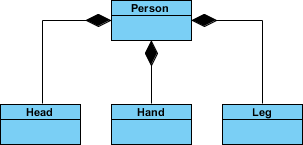
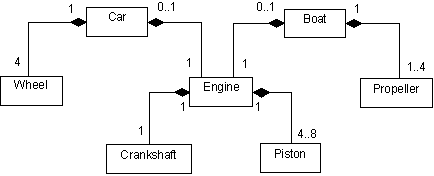

# UML naar code

# UML naar code

Kan je volgende 2 UML-diagrammen implementeren in code? Uiteraard kan je dat: make it happen!


[bron](https://www.visual-paradigm.com/guide/uml-unified-modeling-language/uml-aggregation-vs-composition/)


[bron](http://www.jot.fm/issues/issue_2004_11/column5/)


# Politiek (*Essential*)
Maak een programma om de politieke situatie van een land te simuleren.


Maak volgende klassen:
* Land
* Minister
* President

## Minister
Een Minister heeft geen speciale eigenschappen. Enkel een autoproperty om de Naam van de minister in bij te houden

## President
Een President is een minister maar met 1 extra property met private setter: hij heeft een Teller (autoproperty type ``int``) die start op 4 alsook een methode `JaarVerder`die deze teller bij iedere aanroep met 1 verlaagt.

## Land
* Een land heeft 0 of 1 president (of koning, kies zelf)
* Een land heeft 0 of 1 eerste minister
* Een land heeft 0 tot 4 ministers (via een ``List<Minister>``)

Al deze compositieobjecten zijn private.
Een land heeft volgende publieke methoden:

### ``MaakRegering``

Deze methode aanvaardt volgende parameters:
  
1. 1 president object die aan de private president variabele wordt toegekend
  
2. Een ``List<Minister>`` object waarin  tussen de 1 tot en met 5 ministers in staan: de eerste minister in de lijst wordt toegewezen aan de private eerste minister variabele. De overige ministers in de lijst worden aan de private lijst van ministers toegewezen.

Deze methode zal enkel iets doen indien er geen president in het land is (``null``). Indien er reeds een regering is dan zal er een foutboodschap verschijnen.

### ``JaarVerder``

Deze methode aanroepen zal de ``JaarVerder`` aanroepen op de president indien deze er is (en dus niet ``null`` is). Deze methode controleert ook of de ``Teller`` van de president na deze aanroep op 0 staat. Als dat het geval is dan worden alle ministers en president in het land op ``null`` gezet.

## Eindfase

Controleer je klasse Land door enkele ministers en een president te maken en deze in een object van het type Land via ``MaakRegering`` door te geven. Test dan wat er gebeurt indien je enkele malen ``JaarVerder`` op het land aanroept.
    
## Verkiezingen

Maak klasse ``VerkiezingsUitslag``. Deze klasse heeft een default constructor die volgende twee properties random waarden zal geven:

* Een full property met private set ``VerkozenPresident`` van het type ``President``.
* Een full property met private set ``VerkozenMinisters`` van het type ``List<Minister>``.

Maak in je hoofdprogramma een ``VerkiezingsUitslag``-object aan en gebruik deze om de ``MaakRegering``methode van je Land van de nodige informatie te voorzien.


# Moederbord

# Moederbord

Maak een klasse ``Moederbord`` die een, je raadt het nooit, moederbord van een computer voorstelt. Kies een van de vele moederborden die je online vindt ([enkele voorbeelden](https://www.google.com/search?biw=1368&bih=802&tbm=isch&sa=1&ei=4oK9XNqCKt3UmwXbk5-4Cg&q=motherboard+parts&oq=motherboard+parts&gs_l=img.3..0l10.1974.2413..2560...0.0..0.68.290.5......1....1..gws-wiz-img.aurN6S4Da0I#imgrc=_)) en bekijk uit welke delen een moederbord bestaat ('heeft een').

Maak voor ieder deel een aparte klasse. Voorzie vervolgens via compositie de nodige objecten in je moederbord. Denk er aan dat je bijvoorbeeld 2 (of 4) RAM-slots hebt en dus hier ofwel een array moet voorzien van het type ``List<RAM>``, oftewel twee aparte delen ``RAMSlot1`` en ``RAMSlot2``.

Maak een methode ``TestMoederbord`` in de klasse ``Moederbord``. Wanneer je deze aanroept zal deze weergeven welke onderdelen nog leeg zijn (``==null``).

Iedere module moet via een property langs buiten ingesteld worden. (beeld je in dat je effectief een moederbord ineenknutselt):

```csharp
Moederbord Z390E_GAMING = new Moederbord();
Z390E_GAMING.AGP= new AGPSlot("GeForceRTX2080");
Z390E_GAMING.CPU= new CPUSlot("IntelCorei9_9900K");
//etc.
```

Kan je zelf een computer samenstellen door enkele objecten van verschillende types aan te maken en deze aan je moederbord-object toe te wijzen? 


# Worldbuilding (Essential, GPT)

In deze oefening werk je een vereenvoudigd model uit van een RPG-spelwereld.
Spelers kunnen reizen door verschillende werelden (Worlds), waarin zich verschillende zones (Zones) bevinden, zoals een mystiek bos of een verzengende woestijn.
In elke zone kunnen voorwerpen (Items) gevonden worden, zoals magische wapens, geneeskrachtige drankjes of schatten.

Je modelleert de relaties tussen deze elementen, waarbij:

* Een World verantwoordelijk is voor het beheren van zijn Zones.
* Elke Zone verantwoordelijk is voor het beheren van de Items die erin liggen.
* Items zelfstandig bestaan (ze kunnen later bijvoorbeeld ook door spelers meegenomen worden).

## World (Wereld)

Een World stelt één volledig spelgebied voor.
Spelers kunnen pas een wereld binnengaan als ze een bepaald minimum level hebben.

Properties:

* Name (string): de naam van de wereld (bv. "Mystica", "Darklands").
* LevelRequirement (int): het minimum level dat spelers moeten hebben om toegang te krijgen.
* Zones (List<Zone>): alle zones die deel uitmaken van deze wereld. Dit is compositie: een wereld beheert zijn eigen zones.

Methoden:

* AddZone(Zone zone): voegt een nieuwe zone toe aan de wereld.
* GetZonesAboveDifficulty(int difficulty): geeft een lijst van alle zones waarvan de moeilijkheidsgraad hoger is dan een opgegeven waarde.
* PrintWorldInfo(): toont alle informatie over de wereld, inclusief alle zones en hun gegevens.

## Zone (Gebied)
Een Zone is een deelgebied binnen een wereld, bijvoorbeeld een magisch bos of een ruïne.

Properties:

* Name (string): de naam van de zone.
* DifficultyLevel (int): hoe moeilijk het is om in deze zone te overleven (op schaal bv. 1–10).
* Items (List<Item>): de voorwerpen die in deze zone te vinden zijn. (tip: dit is aggregatie: de zone bevat verwijzingen naar bestaande items, maar vernietigt ze niet automatisch als de zone wordt verwijderd.)

Methoden:

* AddItem(Item item): voegt een item toe aan de lijst van beschikbare voorwerpen in deze zone.
* GetValuableItems(int minimumValue): geeft alle items terug die minstens zoveel waard zijn als de opgegeven minimumwaarde.
* PrintZoneInfo(): toont de gegevens van de zone, inclusief een opsomming van de items.

## Item (Voorwerp)

Een Item is een los object dat spelers kunnen vinden of verzamelen.

Properties:

* Name (string): naam van het voorwerp (bv. "Magic Sword", "Healing Potion").
* Weight (double): het gewicht van het item (belangrijk voor inventarisbeheer).
* Value (int): de marktwaarde of verkoopprijs van het item in goudstukken.

Methoden:

* static CompareValue(Item item1, Item item2): vergelijkt twee items en toont welk item meer waard is, of dat ze evenveel waard zijn.

## Functionele vereisten


* Werelden en zones beheren
  * Een World moet zones kunnen toevoegen.
  * De Zones worden volledig eigendom van de World (compositie).
* Zones en voorwerpen beheren
  * Een Zone kan items bevatten.
  * Items kunnen onafhankelijk bestaan; ze kunnen bv. ook aan spelersinventarissen toegevoegd worden.
* Zoeken en filteren
  * Vanuit een wereld kunnen zones opgehaald worden die moeilijker zijn dan een bepaald niveau.
  * Vanuit een zone kunnen waardevolle items opgehaald worden boven een bepaalde waarde.
* Vergelijken van items
  * Gebruik een statische methode om twee items qua waarde te vergelijken.
* Informatie printen
  * Print methoden zorgen voor duidelijke overzichten, bruikbaar voor bijvoorbeeld debugging of simpele spelinterface.

## Voorbeeldcode

```csharp
// Wereld aanmaken
World myWorld = new World("Mystica", 10);

// Zones aanmaken
Zone forest = new Zone("Enchanted Forest", 5);
Zone desert = new Zone("Burning Desert", 8);

// Items aanmaken en toevoegen
forest.AddItem(new Item("Magic Sword", 3.5, 1200));
forest.AddItem(new Item("Healing Potion", 0.5, 150));
desert.AddItem(new Item("Sand Cloak", 1.2, 300));

// Zones toevoegen aan wereld
myWorld.AddZone(forest);
myWorld.AddZone(desert);

// Informatie ophalen
Console.WriteLine("--- Zones moeilijker dan level 6 ---");
var hardZones = myWorld.GetZonesAboveDifficulty(6);
foreach (var zone in hardZones)
{
    Console.WriteLine(zone.Name);
}

// Items filteren
Console.WriteLine("--- Waardevolle items in het bos ---");
var valuableItems = forest.GetValuableItems(500);
foreach (var item in valuableItems)
{
    Console.WriteLine($"{item.Name}: {item.Value} gold");
}

// Items vergelijken
Console.WriteLine("--- Vergelijk items ---");
Item.CompareValue(forest.Items[0], desert.Items[0]);

// Wereldinfo tonen
myWorld.PrintWorldInfo();
```


# Risk

# Risk

**Land**
In het bordspel Risk heeft ieder *Land*-object volgende eigenschappen:

* Naam van het land
* Lijst met buurlanden
* Leger dat in het land gestationeerd staat.

De referenties in deze beide zijn aggregaties: wanneer het land verdwijnt dan verdwijnen niet de buurlanden en ook niet de legers die er op gestationeerd zijn (ze kunnen gewoon naar een ander land bewegen).

Voorts implmenteert het de *ToString* methode en zal het de informatie oplijsten als volgt:

``*[Naamland] (Buurlanden:[oplijsten buurlanden, enkel de naam]) . Grootte gestationeerd leger: *[grootte van het leger]``

**Leger**

De Leger klasse heeft een capaciteit (sterkte) die enkel positief kan zijn.

Ieder Leger-objecthoudt via een referentie ook bij waar het leger gestationeerd is (referentie naar het Land-object). 

**Bordspel**

Maak een klasse *Bordspel* dat een lijst van Land-objecten bevat (dit is compositie: wanneer het bordspel in brand wordt gestoken dan zijn ook de landen er op weg).

Maak een vereenvoudigde voorstelling van de landkaart met de Bordspel klasse, enkele Land-objecten en enkele legers. 

Voeg aan de *Bordspel* klasse een methode "ToonKaart": deze methode zal de landen in de lijst onder elkaar schrijven (via de ToString methode van Land).

Maak een methode ``VerplaatsLeger`` dat 2 referenties naar 2 landen aanvaardt. Wanneer de aanroept gebeurt zal eerst gecontroleerd worden of het eerste land een leger bevat (zoniet wordt er een exception opgeworpen). Indien dit in orde is dan zal het leger in kwestie verhuizen naar 2e land op voorwaarde dat daar ook geen leger al is. Als dat wél het geval is dan wordt het leger in het eerste land verwijderd, en wordt de capaciteit van het 2e leger verhoogd met die van het eerste leger.


# (PRO) Textbased RPG 

# (PRO) Textbased RPG 
Bekijk het volgende All-in-One project :[OO Textbased Game](../EindeTests/A_DEEL2_AllInOne/2_OOTextGame.md).

Dit project gebruikt alle materie tot en met dit hoofdstuk. Kan je dit project maken én , belangrijker, uitbreiden met nieuwe functionaliteit?


# De Online Coach (*Final Essentials*, GPT)

*Je bouwt de backend voor een moderne personal training app. Hierbij is het belangrijk om het onderscheid te maken tussen objecten die 'eigendom' zijn van elkaar (Compositie) en objecten die gewoon naar elkaar wijzen (Aggregatie / Associatie).*

## Stap 1: De Bouwstenen
Maak een klasse `Oefening`.
*   Properties: `Naam` (string), `Spiergroep` (string), `AantalSets` (int).
*   Methode `ToonInfo()`: Toont bv. "Bench Press (Borst) - 4 sets".

## Stap 2: Het Schema (De Compositie container)
Maak een klasse `TrainingSchema`.
*   Property `SchemaNaam` (bv. "Winter Bulk").
*   Een private lijst van `Oefening` objecten.
*   Methode `VoegOefeningToe(Oefening o)`: Voegt een oefening toe aan de lijst.
*   Methode `ToonVolledigSchema()`: Print de naam van het schema en roept voor elke oefening `ToonInfo()` aan.

## Stap 3: De Sporter (Eigenaar van het schema)
Maak een klasse `Sporter`.
*   Properties: `Naam`.
*   **Compositie**: Elke Sporter *heeft* een `TrainingSchema`.
    *   Zorg dat er in de constructor van `Sporter` meteen een leeg `TrainingSchema` wordt aangemaakt (of geef er eentje mee als parameter). Het schema hoort onlosmakelijk bij de sporter in deze app.
*   Methode `ZetNieuwSchema(TrainingSchema schema)`: Hiermee kan de sporter van schema wisselen.
*   Methode `Train()`: Roept `ToonVolledigSchema` aan van zijn interne schema en print daarna "Lekker getraind!".

## Stap 4: De Coach (Beheerder van atleten)
Maak een klasse `Coach`.
*   Properties: `Naam`.
*   **Aggregatie**: Een lijst van `Sporter` objecten.
    *   De coach *bezit* de sporters niet. Als de coach stopt, blijven de sporters bestaan (en zoeken ze een andere coach).
*   Methode `VoegSporterToe(Sporter s)`.
*   Methode `MotiveerIedereen()`: Loop door alle sporters en print "[CoachNaam] roept: KOMAAN [SporterNaam], nog eentje!".

## Main
Simuleer de app:
1.  Maak enkele `Oefening` objecten aan (Squat, Deadlift, ...).
2.  Maak een `TrainingSchema` "Full Body" en voeg de oefeningen toe.
3.  Maak een `Sporter` (bv. "Arnold") en geef hem dit schema.
4.  Maak een `Coach` (bv. "Coleman") en voeg Arnold toe aan zijn lijst.
5.  Laat de coach iedereen motiveren.
6.  Laat Arnold trainen.


::::{.callout-caution collapse="true" title="Oplossing"}
# UML naar code

:::{.callout-tip}
**Les(sen) uit deze oefening:** Een mens wordt geboren met handen, voeten en benen (technisch gezien moesten we 2 compositiet-objecten van type ``Hand`` en``Leg`` maken) daarom maken we de instanties aan in de constructor. Eventueel had je dit ook rechtstreeks in de klasse bij de instantievariabele kunnen doen (``private Head theHead = new Head();``).
:::

```csharp
public class Head {}
public class Hand {}
public class Leg{}

public class Person
{
    public Person()
    {
       theHead =new Head(); 
       leftHand = new Hand();
       leftLeg = new Leg();
    }

    private Head theHead ;
    private Hand leftHand ;
    private Leg leftLeg;
}
```

:::{.callout-tip}
**Les(sen) uit deze oefening:** Associaties zijn niet beperkt tot enkelvoudige objecten, vaak ga je ook arrays of lijsten nodig hebben om deze voor te stellen. 
:::

```csharp
public class Wheel{}
public class Crankshaft{}
public class Piston{}

public class Engine
{
    private Crankshaft theCrank=new Crankshaft();
    private List<Piston> pistons = new List<Piston>(); //todo: piston objecten inplaatsen, zie voorbeeld Car-constructor
}

public class Car
{
    public Car() 
    {
        for(int i=0;i<4;i++)
            wheels.Add(new Wheel());
    }

    private List<Wheel> wheels=new List<Wheel>();

    private Engine mainEngine = new Engine();
}

public class Propeller
{

}

public class Boat 
{
    private Engine mainEngine = new Engine();
    private  List<Propeller> propellers = new List<Propeller>(); //todo: propeller objecten inplaatsen, zie voorbeeld Car-constructor
}
```

# Politiek

:::{.callout-tip}
**Les(sen) uit deze oefening:** Dit was al een iets complexere oefening. De kracht van compositie is zichtbaar in de klasse ``Land`` waar we via de ``MaakRegering`` informatie binnenkrijgen om toe te wijzen aan de aggregaatobjecten (``President``, ``EersteMinister`` en ``Ministers``).  Kijk zeker goed hoe we de meegegeven lijst van ministers in ``MaakRegering`` toewijzen (m.b.v. een loop die de eerste minister overslaat)
:::

```csharp
static void Main(string[] args)
{
    President ikke = new President() { Naam = "Tim" };
    List<Minister> mins = new List<Minister>();
    mins.Add(new Minister() { Naam="Bruno"});
    mins.Add(new Minister() { Naam = "Freya" });
    mins.Add(new Minister() { Naam = "Peter" });
    mins.Add(new Minister() { Naam = "Ann" });

    Land mijnLand = new Land();
    mijnLand.MaakRegering(ikke, mins);
    mijnLand.MaakRegering(ikke, mins); //Moet error geven
    for (int i = 0; i < 4; i++)
    {
        Console.WriteLine("Weer een jaar verder");
        mijnLand.JaarVerder();
    }
}
```

```csharp
public class Land
{
    private President President;
    private Minister EersteMinister;
    private List<Minister> Ministers = new List<Minister>(4);

    public void MaakRegering(President presin, List<Minister> minin)
    {
        if(President==null)
        {
            President = presin;
            EersteMinister = minin[0];
            if(minin.Count>=2)
            {
                for (int i = 1  ; i < minin.Count; i++)
                {
                    Ministers.Add(minin[i]);
                }
            }
        }
        else
        {
            Console.WriteLine("Gaat niet. Dit land heeft al een regering");
        }
    }

    public void JaarVerder()
    {
        if (President != null)
        {
            President.JaarVerder();
            if(President.Teller<=0)
            {
                Console.WriteLine("Regering is gedaan");
                President = null;
                EersteMinister = null;
                Ministers.Clear();
            }
        }
    }

}

public class Minister
{
    public string Naam { get; set; }
}

public class President: Minister
{
    public int Teller { get; private set; } = 4;
    public void JaarVerder()
    {
        Teller--;
    }
}
```

Met de uitbreiding:

```csharp
public class VerkiezingsUitslag
{
    static Random rng = new Random();


    public VerkiezingsUitslag()
    {
        VerkozenPresident = new President() { Naam = NaamGen() };
        VerkozenMinisters = new List<Minister>();

        for (int i = 0; i < 5; i++)
        {
            VerkozenMinisters.Add(new Minister() { Naam = NaamGen() });
        }
    }

    private President verkozenPresident = null;

    public President VerkozenPresident
    {
        get { return verkozenPresident ; }
        set { verkozenPresident = value; }
    }

    private List<Minister> verkozenMinisters ;

    public List<Minister> VerkozenMinisters
    {
        get { return verkozenMinisters ; }
        set { verkozenMinisters  = value; }
    }

    private string NaamGen()
    {
        string naam = "";
        for (int i = 0; i < rng.Next(5,10); i++)
        {
            naam += (char)rng.Next('a', 'z');
        }
        return naam;
    }
}
```

Start van Main kan dan korter:

```csharp
VerkiezingsUitslag uitslag2022 = new VerkiezingsUitslag();

Land mijnLand = new Land();
mijnLand.MaakRegering(uitslag2022.VerkozenPresident, uitslag2022.VerkozenMinisters);
```

# Moederbord

:::{.callout-tip}
**Les(sen) uit deze oefening:** Deze kleine oefening is heel goed om aggregatie voor te stellen (een computer met onderdelen), waarbij ieder aggregaat-object een totaal andere interne structuur heeft. 
:::

De output van onderstaande code zal zijn:


```text
Je hebt nog geen agp kaart
Je hebt nog 2 vrij ramsloten
Er zijn geen andere componenten aanwezig
```

```csharp
Moederbord Z390E_GAMING = new Moederbord(3);
Z390E_GAMING.CPUSlot = new CPU("IntelCorei9_9900K",4);
Z390E_GAMING.Ramslots.Add(new RamMemory("Corsair", 8));
Z390E_GAMING.TestMoederbord();
```

```csharp
public class Moederbord
{
    public Moederbord(int aantalRamsloten)
    {
        Ramslots = new List<RamMemory>(aantalRamsloten);
    }
    public AGPKaart AGPSlot { get; set; } = null;
    public CPU CPUSlot { get; set; } = null;
    public List<PCComponent> AndereComponenten { get; set; } = new List<PCComponent>();

    public List<RamMemory> Ramslots { get; set; }

    public void TestMoederbord()
    {
        if(AGPSlot==null)
            Console.WriteLine("Je hebt nog geen agp kaart");
        if(CPUSlot==null)
            Console.WriteLine("Je hebt nog geen cpu");
        if(Ramslots.Capacity!= Ramslots.Count)
        {
            Console.WriteLine($"Je hebt nog {Ramslots.Capacity-Ramslots.Count} vrij ramsloten");
        }
        if(AndereComponenten.Count==0)
            Console.WriteLine("Er zijn geen andere componenten aanwezig");
    }

}

public class PCComponent
{
    public string Merk { get; set; }
    public PCComponent(string merk) { Merk = merk; }
}

public class RamMemory : PCComponent
{
    public int GeheugenGrootte { get; set; }
    public RamMemory(string merk, int aantalGB) : base(merk)
    {
        GeheugenGrootte = aantalGB;
    }
}

public class AGPKaart : PCComponent
{
    public AGPKaart(string merk) : base(merk)
    { }
}

public class CPU : PCComponent
{
    public int KlokSnelheidInGhz { get; set; }
    public CPU(string merk, int snelheid) : base(merk)
    {
        KlokSnelheidInGhz = snelheid;
    }
}

```

::::
