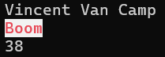
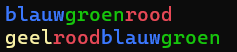
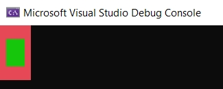
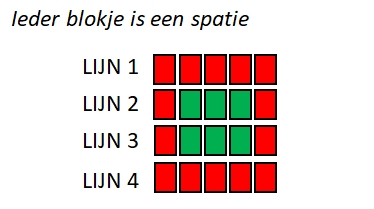

<!--# Hoofdstuk 1-->


:::{.callout-important}
Vergeet IntelliCode niet uit te schakelen ([hoe?](https://ap.cloud.panopto.eu/Panopto/Pages/Viewer.aspx?id=5b062697-fc35-44ee-8f2e-af1c013b47d7))! 
:::

:::{.callout-tip}
Kijk pas naar de oplossing als je 100% klaar bent. En zelfs dan, wees erg kritisch over jouw oplossing tegenover de modeloplossing. Vraag hulp aan de lector bij de minste twijfel die je hebt wanneer je jouw oplossing vergelijkt me de modeloplossing! 
:::

:::{.callout-warning}
Maak telkens een volledig nieuwe solution aan per oefening (enkel de oefening "Stad kleuren" doe je in de bestaande "Wie ben ik" oplossing). Zo kan je later makkelijk terugkeren naar een specifieke oefening.
:::


<!--# Hoofdstuk 1-->


# Wie ben ik (*Essential*)

# Wie ben ik (*Essential*)

Schrijf een applicatie dat onder elkaar volgende informatie op het scherm toont gebruik makende van ``WriteLine()``:

* Je voornaam en achternaam.
* De stad waar je woont.
* Je leeftijd.

Voorbeeld van de output:

```text
Vincent Van Camp
Boom
38
```


# Visitekaart (*Essential*) 

# Visitekaart (*Essential*) 

Schrijf een programma dat aan de gebruiker de volgende zaken vraagt:

* Voornaam
* Achternaam
* Adres
* Hobby

Vervolgens toon je de vragen gevolgd door de antwoorden, met de naam als 1 antwoord (voornaam en achternaam). Je zal hiervoor de ``Write``-methode en ``WriteLine``-methode moeten gebruiken. 

Bijvoorbeeld (tekst die start met > is input van de gebruiker):

```text
Wat is je voornaam?
>Tom
Wat is je achternaam?
>Peeters
Waar woon je?
>Parel van de Kempen
Wat is je hobby?
>fietsen


Goed. Hier volgt je visitekaartje"

Naam: Tom Peeters
Adres: Parel van de Kempen
Hobby: fietsen
```


# Fake GPT (*Essential*) 

# Fake GPT (*Essential*) 

Schrijf een programma dat de gebruiker om een vraag vraagt en vervolgens een antwoord geeft, namelijk: "Dat is een interessante vraag! Ik zal er eens over nadenken en later op terugkomen."

Het programma doet dus niets en hoeft dus ook niets met de gebruikerinput te doen. Het is letterlijk een lege doos. Voorbeeld output: (Tekst voorafgegaan door > is userinput)
```text
Wat is je vraag?
>Wonen er Marsmannetjes op Mercurius?
Dat is een interessante vraag! Ik zal er eens over nadenken en later op terugkomen.
```


# Stad kleuren (*Essential*) 

# Stad kleuren (*Essential*) 

Open terug je "Wie ben ik"-solution. Pas de code aan zodat je stad in rode letters met witte achtergrond wordt getoond. Vergeet niet je kleur terug te resetten naar de standaardkleuren na het tonen van de stad.

Voorbeeld van de output (gebruik je eigen gegevens uiteraard):




# Rommel zin (*Essential*) (Dodona beschikbaar)

# Rommel zin (*Essential*) (Dodona beschikbaar)

Schrijf een applicatie met behulp van ``ReadLine()`` en ``WriteLine()``-methoden waarbij de computer aan de gebruiker om zijn of haar favoriete kleur, eten, auto en boek vraagt. Het programma gaat echter de gebruiker plagen en de ingelezen informatie op de verkeerde manier aan de gebruiker tonen. Het programma zal de antwoorden namelijk door elkaar halen waardoor de computer vervolgens toont: 


```text
Je favoriete kleur is [eten]. Je eet graag [auto]. Je lievelingsfilm is [boek] en je favoriete boek is [kleur].
```

Waarbij tussen de rechte haakjes steeds de invoer komt die de gebruiker eerder opgaf voor de bijhorende vraag.

Voorbeeld (tekst die start met > is input van de gebruiker):
```text
Geef je favoriete kleur:
>rood
Geef je favoriete eten:
>lasagne
Geef je favoriete auto:
>mazda
Geef je favoriete boek:
>Het oneindige verhaal

Je favoriete kleur is lasagne. Je eet graag mazda. Je lievelingsfilm is Het oneindige verhaal en je favoriete boek is rood.
```


# Woordenslinger (*Essential*)

# Woordenslinger (*Essential*)

Maak een applicatie die volgende woorden na elkaar in twee zinnen toont, waarbij de letters van het woord de kleur van het woord zelf hebben:

```text
blauwgroenrood
geelroodblauw
```

De output moet er als volgt uitzien:




# Tekening

# Tekening

Kan je volgende afbeeldingen namaken in de console?



Volgende tekening toont een schematische weergave:



:::{.callout-tip}
Je kan een gekleurd vakje 'tekenen' door de ``BackGroundColor`` van de console in te stellen en dan een **spatie** naar het scherm te sturen.
:::


# Muziek (*Extra'tjes*)

# Muziek (*Extra'tjes*)

:::{.callout-tip}
Extra'tjes oefeningen gebruiken zaken die niet bij de leerstof horen, maar die eenvoudig genoeg zijn om eens te bekijken. Meestal zijn ze ook nog eens leuk om te maken, wat mooi is meegenomen.
:::

Met de ``Console.Beep()`` methode kan je muziek maken. Volgende voorbeeld toont bijvoorbeeld hoe je do-re-mi-fa-sol-la-si-do afspeelt:

```csharp
Console.Beep(264, 1000);
Console.Beep(297, 1000);
Console.Beep(330, 1000);
Console.Beep(352, 1000);
Console.Beep(396, 1000);
Console.Beep(440, 1000);
Console.Beep(495, 1000);
Console.Beep(528, 1000);
```

Je geeft aan ``Beep`` 2 getallen mee (*argumenten*):

1. De frequentie van de toon die moet afgespeeld worden. Bijvoorbeeld 264 (in Hertz, hz).
2. De duur dat de toon moet afgespeeld worden in milliseconden. Als je dus 1000 meegeeft zal de toon gedurende 1000 ms, oftewel 1 seconde, afgespeeld worden.

Open 1 van de eerder gemaakte oefeningen en zorg ervoor dat bij het opstarten ervan er een kort, door jezelf gecomponeerd, introliedje wordt afgespeeld.


# Regenboog Ticket (*Final Essentials*)

# Regenboog Ticket (*Final Essentials*)

:::{.callout-tip}
Een *Final Essentials* oefening is een opgave waarin zoveel mogelijk leerstof van de voorbije oefeningen aan bod komt. Je zal voor deze oefeningen vaak wat meer tijd nodig hebben en dus mogelijk niet in het labo kunnen maken.
:::


Maak een nieuwe applicatie "RegenboogTicket".
Deze applicatie vraagt de gebruiker om 3 zaken:
1. De titel van een film.
2. De prijs van een ticket.
3. De naam van de bezoeker.

Vervolgens toon je een 'ticket' op het scherm.
* De boven- en onderkant van het ticket zijn lijnen (bijvoorbeeld ``--------------------``) met een **Witte** achtergrond en **Zwarte** voorgrondkleur.
* De filmtitel toon je in tussenliggende regel in het **Rood**.
* De prijs toon je in een volgende regel in het **Groen**.
* De naam van de bezoeker toon je in de laatste regel in het **Blauw**.

Zorg ervoor dat je na het tonen van het ticket de kleuren terugzet naar de standaardwaarden van de console (`Console.ResetColor()`), anders blijft alles gekleurd!

Voorbeeld interactie:
(tekst die start met `>` is input van de gebruiker`. Je hoeft dit teken niet te tonen.)

```text
Geef de filmtitel:
>Titanic
Geef de prijs:
>12 euro
Geef je naam:
>Leonardo

-------------------- (wit met zwarte tekst)
Titanic              (rood)
12 euro              (groen)
Leonardo             (blauw)
-------------------- (wit met zwarte tekst)
```


::::{.callout-caution collapse="true" title="Oplossing"}

## Wie ben ik
 
```java
Console.WriteLine("Vincent Van Camp");
Console.WriteLine("Boom");
Console.WriteLine("38");
```

## Visitekaart


```java
Console.WriteLine("Wat is je voornaam?");
string voornaam = Console.ReadLine();
Console.WriteLine("Wat is je achternaam?");
string achternaam = Console.ReadLine();
Console.WriteLine("Waar woon je?");
string adres = Console.ReadLine();
Console.WriteLine("Wat is je hobby?");
string hobby = Console.ReadLine();

Console.WriteLine("Goed. Hier volgt je visitekaartje");

Console.Write("Naam: ");
Console.WriteLine(voornaam + " " + achternaam);
Console.Write("Adres: ");
Console.WriteLine(adres);
Console.Write("Hobby: ");
Console.WriteLine(hobby);
```


## Fake GPT


```java
Console.WriteLine("Wat is je vraag?");
Console.ReadLine();  //het resultaat bewaren in een variabele heeft geen nut. We doen er toch niets mee.
Console.WriteLine("Dat is een interessante vraag! Ik zal er eens over nadenken en later op terugkomen.");
```

## Stad kleuren 

```java
Console.WriteLine("Vincent Van Camp");
Console.ForegroundColor = ConsoleColor.Red;
Console.BackgroundColor = ConsoleColor.White;
Console.WriteLine("Boom");
Console.ResetColor();
Console.WriteLine("38");
```

##  Rommelzin

:::{.callout-tip}
**Les(sen) uit deze oefening:** Ieder antwoord van de gebruiker moet je bewaren in een aparte``string`` variabele met een unieke naam. 
:::

```java
Console.WriteLine("Geef je favoriete kleur:");
string favKleur = Console.ReadLine();
Console.WriteLine("Geef je favoriete eten:");
string favEten = Console.ReadLine();
Console.WriteLine("Geef je favoriete auto:");
string favBoek = Console.ReadLine();
Console.WriteLine("Geef je favoriete boek:");
string favAuto = Console.ReadLine();


Console.WriteLine("Je favoriete kleur is "+ favEten +". Je eet graag "+ favAuto +". Je lievelingsfilm is"+ favBoek +" en je favoriete boek is "+ favKleur +".");
```


## Woordenslinger


```java
Console.ForegroundColor = ConsoleColor.Blue;
Console.Write("blauw");
Console.ForegroundColor = ConsoleColor.Green;
Console.Write("groen");
Console.ForegroundColor = ConsoleColor.Red;
Console.WriteLine("rood");


Console.ForegroundColor = ConsoleColor.Yellow;
Console.Write("geel");
Console.ForegroundColor = ConsoleColor.Red;
Console.Write("rood");
Console.ForegroundColor = ConsoleColor.Blue;
Console.Write("blauw");
Console.ForegroundColor = ConsoleColor.Green;
Console.WriteLine("groen");

Console.ResetColor();
```

## Tekening

:::{.callout-tip}
**Les(sen) uit deze oefening:** Deze tekening bestaat uit allemaal spaties, waarbij we een combinatie van ``Write`` en ``WriteLine`` gebruiken, in samenwerking met kleurveranderingen om die spaties op het scherm te zetten.
:::

```java
Console.BackgroundColor = ConsoleColor.Red;
Console.WriteLine("       ");
Console.Write("  ");
Console.BackgroundColor = ConsoleColor.Green;
Console.Write("   ");
Console.BackgroundColor = ConsoleColor.Red;
Console.WriteLine("  ");
Console.Write("  ");
Console.BackgroundColor = ConsoleColor.Green;
Console.Write("   ");
Console.BackgroundColor = ConsoleColor.Red;
Console.WriteLine("  ");
Console.WriteLine("       ");

Console.ResetColor();
```
::::
