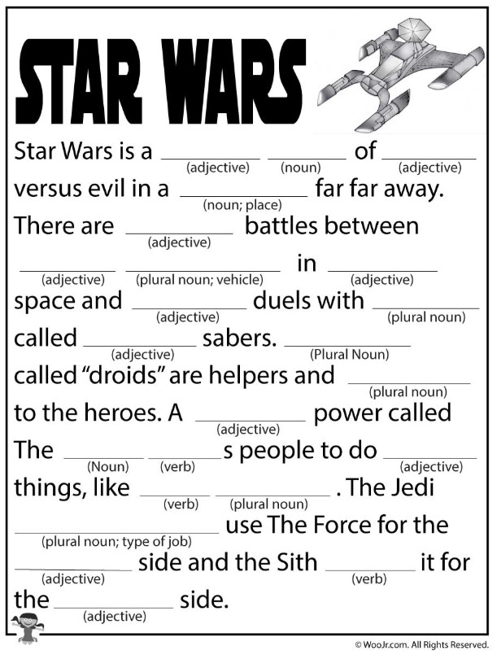
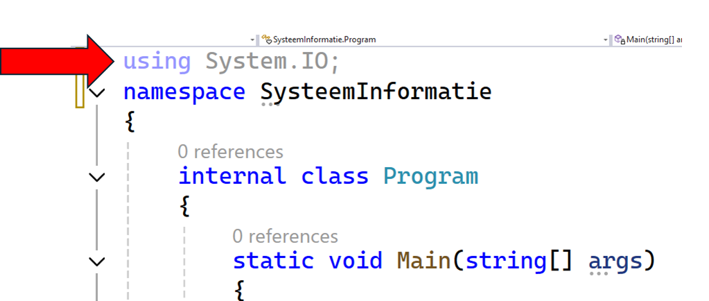

<!--# Hoofdstuk 3-->

:::{.callout-warning}
Vanaf dit hoofdstuk wordt verwacht dat je steeds  **string interpolatie** gebruikt om strings samen te voegen, en dus niet meer met  ``+`` werkt!
:::

<!--# Hoofdstuk 3-->


# Mad Libs (*Essential*)

# Mad Libs (*Essential*)

MadLibs is een populair woordspelletje waarbij de gebruiker een aantal verschillende woorden moet opgeven. Vervolgens worden deze woorden in een verhaal geplaatst dat zo plots erg grappig kan worden.



In deze oefening vraag je aan de gebruiker volgende zaken:

* Een naam (bv. Jos)
* Een zelfstandig naamwoord (bv. bal)
* Een adjectief (bv. groene)
* Een werkwoord (bv. springen)

Vervolgens worden deze woorden in volgende zin geplaatst en aan de gebruiker getoond (gebruik hier **string interpolation** voor).

```text
Op een dag ging [naam] naar de AP Hogeschool. Hij zag daar een [adjectief] [zelfstandig naamwoord] en vond dat zo grappig dat hij begon te [werkwoord].
```

Voorbeeld werking:

```text
Geef een naam:
>Jos
Geef een zelfstandig naamwoord:
>bal
Geef een adjectief:
>groene
Geef een werkwoord:
>springen

Hier komt het!

Op een dag ging Jos naar de AP Hogeschool. Hij zag daar een groene bal en vond dat zo grappig dat hij begon te springen.
```


# Dertien in een dozijn (*Essential*)

# Dertien in een dozijn (*Essential*)

[Een klassieker (youtube-filmpje)](https://www.youtube.com/watch?v=ygpXHgITuUU). 

Schrijf een applicatie die berekent hoeveel dozen van 8 eieren je volledig kan vullen en hoeveel eieren je dan nog zal over hebben. Gebruik ook nu string interpolation in de finale uitvoer.

Bovenaan je programma schrijf je:

```csharp
const int doosGrootte = 8;
int aantalEieren = 124;
```

Met deze startinvoer (test ook met andere getallen!) moet je volgende uitvoer krijgen.

```text
124 eieren passen in 15 dozen van doosgrootte:8. Daarbij zal je nog 4 eieren over hebben.
```

Test of je applicatie ook werkt met andere aantal eieren én doosgrootte.

:::{.callout-tip}
In deze oefening moet je gebruik maken van je kennis van het vorige hoofdstuk, waaronder:

* De modulo operator.
* Datatypes en wat de impact ervan is op onder andere de deling (twee integers delen geeft...een integer!).
:::


# Escape conversatie (*Essential*)

# Escape conversatie (*Essential*)

Gegeven volgende code:

```java
string personage1 = "Alice";
string personage2 = "Bob";

string dialoog = $"X";

Console.WriteLine(dialoog);
```

Zorg ervoor dat volgende dialoog op het scherm, met juiste formatering getoond wordt. Je mag enkel de tekst tussen de aanhalingstekens (in de plaats van ``X``) van de variabele ``dialoog`` gebruiken (en zal dus escape characters nodig hebben.):

```text
Alice: "Hoe gaat het met je?"
    Bob: "Goed, dank je! Hoe gaat het met jou?"
Alice: "Ook goed, bedankt dat je het vraagt."
```

Gebruik  ``\t`` om de tekst van Bob te doen inspringen. Merk op dat de tabgrootte verschillend kan zijn (wat geen probleem is) dan wat je hier als voorbeeld ziet.


# Systeem informatie (*Essential*)

# Systeem informatie (*Essential*)


Maak een applicatie die de belangrijkste computer-informatie (geheugen, etc) aan de gebruiker toont m.b.v. de ``Environment``.
Zoals je ziet wordt het geheugen in bytes teruggegeven. Zorg ervoor dat het geheugen steeds in mega of gigabytes op het scherm wordt getoond. Toon minstens volgende zaken:

* ``ProcessorCount``
* ``WorkingSet (in MB en GB)``
* ``MachineName``
* ``UserName``
* ``is64OperatingSystem``

Voorbeeld uitvoer:

```text
Systeeminformatie voor admin op damsPowahPC:
---------------------------------------------------
    Aantal processors: 8
    64-bit besturingssysteem: True
    Huidige geheugengebruik: 23.00 MB (0.02 GB)
---------------------------------------------------
```


Gebruik string formatering (m.b.v. met ``F2``) om de output tot 2 cijfers na de komma op het scherm te tonen.


# Unicode Art

# Unicode Art

Genereer je naam in Unicode Art met een van de [vele online generators](https://www.google.com/search?q=unicode+art+generator&oq=unicode+art&aqs=chrome.0.0j69i57j0l2j0i22i30l3.3647j0j1&sourceid=chrome&ie=UTF-8). Toon deze art (m.b.v. ``WriteLine`` of ``Write``) aan de start van een van je bestaande programma's, zodat nu je naam wordt getoond wanneer het programma start, gevolgd door de rest.


# Boardingpass (*Final Essentials*)

# Boardingpass (*Final Essentials*)


De **String Interpolation** (met `$` ) is superhandig om data op een propere manier op het scherm te tonen.
Maak een applicatie die de gebruiker om **vluchtinformatie** vraagt (naam, vertrek, bestemming, gate).

Vervolgens toon je een **Boardingpass** op het scherm.
Gebruik hierbij:
1. **String Interpolation** om de data in de tekst te verwerken.
2. **Escape karakters** zoals `\t` (tab) en `\n` (nieuwe lijn) om de tekst netjes uit te lijnen, zonder dat je zelf spaties moet tellen.
3. `Environment.UserName` om onderaan te tonen wie de pass heeft afgedrukt.

**Voorbeeld output:** (tekst na `>` is invoer)

```text
Boardingpass generator
**********************
Naam passagier:
>Joske Vermeulen
Vertrekplaats:
>Brussel (BRU)
Bestemming:
>New York (JFK)
Gate:
>A45

(Scherm wordt leeg gemaakt...)

****************************************
BOARDINGPASS
****************************************
Passagier:      Joske Vermeulen
Van:            Brussel (BRU)
Naar:           New York (JFK)
Gate:           A45

Vluchtgegevens gecontroleerd door: admin
****************************************
```

:::{.callout-tip}
Gebruik `\t` na de dubbele punten om de tekst mooi onder elkaar te krijgen.
Vergeet niet `Console.Clear()` te gebruiken om het scherm leeg te maken.
:::


## Systeem informatie Deel 2 (PRO)

Ook informatie over de harde schijven kan je verkrijgen (in bits). 
Dit vereist wel dat je bovenaan je programma volgende lijn bijschrijft: ``using System.IO``. 



Vervolgens kan je in je programma schrijven:

```csharp
long cdriveinbytes = DriveInfo.GetDrives()[0].AvailableFreeSpace;  
long totalsize = DriveInfo.GetDrives()[0].TotalSize;  
```

De lijn met ``using`` is om aan te geven dat we iets uit de ``System.IO`` bibliotheek nodig hebben, namelijk ``DriveInfo``.
Schrijven we dat niet dan moeten we in onze code DriveInfo aanroepen met z'n volledige path: ``System.IO.DriveInfo....``

De 0 tussen rechte haakjes is de index van welke schijf je informatie wenst. 0 is de eerste harde schijf, 1 de tweede, enzovoort. 

Vraag aan de gebruiker het nummer van de harde schijf waar meer informatie over moet getoond worden. 

:::{.callout-warning}
Opgelet: sta toe dat de gebruiker 1 voor de eerste harde schijf mag gebruiken, 2 voor de tweede, enzovoort. Je zal dus in code nog manueel 1 moeten aftrekken van de invoer van de gebruiken.
Bv:

```csharp
int invoer=int.Parse(Console.ReadLine()) - 1; 
long totalsize = DriveInfo.GetDrives()[invoer].TotalSize;  
```
:::


## Shell-starter (PRO)

Je kan de output van een ``Process.Start()`` programma naar je console scherm sturen. Dit vereist wat meer code. Volgend voorbeeld zal de output van het commando ``ipconfig /all`` op het scherm tonen:

```csharp
System.Diagnostics.Process process = new System.Diagnostics.Process();
process.StartInfo.FileName = "ipconfig";
process.StartInfo.Arguments = "/all"; 
process.StartInfo.UseShellExecute = false;
process.StartInfo.RedirectStandardOutput = true;
process.StartInfo.RedirectStandardError = true;
process.Start(); //start process

// Read the output (or the error)
string output = process.StandardOutput.ReadToEnd(); //normal output
Console.WriteLine(output);
string err = process.StandardError.ReadToEnd(); //error output (if any)
Console.WriteLine(err);
//Continue
Console.WriteLine("Klaar");
```

:::{.callout-tip}
Let er op dat dit voorbeeld niet perfect werkt met een shell-commando dat even duurt. Denk bijvoorbeeld aan ``ping``. De output komt namelijk pas op het scherm als het commando is afgelopen. Test zelf maar eens!
:::

Maak enkele kleine C# programma's die bepaalde shell-commando's zullen uitvoeren, eventueel na input van de gebruiker.
Enkele nuttige shell-commando's in de netwerk-sfeer zijn bijvoorbeeld:


```text
hostname
arp -a
getmac
nslookup google.com
netstat
```

Andere toffe commando's kunnen zijn:


```text
chrome.exe ap.be
notepad mytest.txt
```

Of de naam van een bestand dat je wilt openen, maar dan met het hele path:


```text
c:\Temp\mydocument.docx
```


::::{.callout-caution collapse="true" title="Oplossing"}


* [Bespreking oefeningen Systeem informatie en Weerstandberekenaar](https://ap.cloud.panopto.eu/Panopto/Pages/Viewer.aspx?id=7e2513f7-7002-4687-a214-a97000751f5e)


# Code oplossingen

## Mad Libs 

```java
Console.WriteLine("Geen een naam:");
string naam = Console.ReadLine();
Console.WriteLine("Geen een zelfstandig naamwoord:");
string zelfstNw = Console.ReadLine();
Console.WriteLine("Geen een adjectief:");
string adjectief = Console.ReadLine();
Console.WriteLine("Geen een werkwoord:");
string werkwoord = Console.ReadLine();

Console.WriteLine("\nHier komt het!\n");
Console.WriteLine($"Op een dag ging {naam} naar de AP Hogeschool. Hij zag daar een {adjectief} {zelfstNw} en vond dat zo grappig dat hij begon te {werkwoord}.");
```

## Dertien in een dozijn

```java
const int doosGrootte= 8;
int aantalEieren = 124;
int over= 124 % doosGrootte;
int dozen =  aantalEieren/doosGrootte;
Console.WriteLine($"{aantalEieren} passen in {dozen} dozen van doosgrootte: {doosGrootte}. Daarbij zal je nog {over} eieren over hebben.");
```


## Escape conversatie

```java
string personage1 = "Alice";
string personage2 = "Bob";

string dialoog = $"{personage1}: \"Hoe gaat het met je?\"\n\t{personage2}: \"Goed, dank je! Hoe gaat het met jou?\"\n{personage1}: \"Ook goed, bedankt dat je het vraagt.\"";

Console.WriteLine(dialoog);
```

## Systeem informatie (deel 1)

```java
int processorCount = Environment.ProcessorCount;
long memoryInBytes = Environment.WorkingSet;
string machineName = Environment.MachineName;
string userName = Environment.UserName;
bool is64BitOperatingSystem = Environment.Is64BitOperatingSystem;


double memoryInMB = memoryInBytes / (1024 * 1024);
double memoryInGB = memoryInBytes / (1024.0 * 1024 * 1024);


Console.WriteLine($"Systeeminformatie voor {userName} op {machineName}:");
Console.WriteLine($"---------------------------------------------");
Console.WriteLine($"\tAantal processors: {processorCount}");
Console.WriteLine($"\t64-bit besturingssysteem: {is64BitOperatingSystem}");
Console.WriteLine($"\tHuidige geheugengebruik: {memoryInMB:F2} MB ({memoryInGB:F2} GB)");
Console.WriteLine($"---------------------------------------------");
```

## Unicode Art

:::{.callout-tip}
**Les(sen) uit deze oefening:** Eerlijk. Dit zijn geen typische programmeeropdrachten. Het is gewoon leuk om al eens een wat visueel interessantere output te hebben.
:::

```java
            string myname = @"▄▄▄█████▓ ██▓ ███▄ ▄███▓   ▓█████▄  ▄▄▄       ███▄ ▄███▓  ██████ 
▓  ██▒ ▓▒▓██▒▓██▒▀█▀ ██▒   ▒██▀ ██▌▒████▄    ▓██▒▀█▀ ██▒▒██    ▒ 
▒ ▓██░ ▒░▒██▒▓██    ▓██░   ░██   █▌▒██  ▀█▄  ▓██    ▓██░░ ▓██▄   
░ ▓██▓ ░ ░██░▒██    ▒██    ░▓█▄   ▌░██▄▄▄▄██ ▒██    ▒██   ▒   ██▒
  ▒██▒ ░ ░██░▒██▒   ░██▒   ░▒████▓  ▓█   ▓██▒▒██▒   ░██▒▒██████▒▒
  ▒ ░░   ░▓  ░ ▒░   ░  ░    ▒▒▓  ▒  ▒▒   ▓▒█░░ ▒░   ░  ░▒ ▒▓▒ ▒ ░
    ░     ▒ ░░  ░      ░    ░ ▒  ▒   ▒   ▒▒ ░░  ░      ░░ ░▒  ░ ░
  ░       ▒ ░░      ░       ░ ░  ░   ░   ▒   ░      ░   ░  ░  ░  
          ░         ░         ░          ░  ░       ░         ░  
                            ░                                    ";
            Console.WriteLine(myname);
```

## Unicode Art en Colors

```java
Console.Write("▄▄▄█████▓ ██▓ ███▄ ▄███▓   ");
Console.ForegroundColor = ConsoleColor.Red; 
Console.Write("▓█████▄"); 
Console.ResetColor(); 
Console.Write("  ▄▄▄       ███▄ ▄███▓  ██████ \n");
Console.Write("▓  ██▒ ▓▒▓██▒▓██▒▀█▀ ██▒   "); 
Console.ForegroundColor = ConsoleColor.Red; 
Console.Write("▒██▀ ██▌"); Console.ResetColor(); 
Console.Write("▒████▄    ▓██▒▀█▀ ██▒▒██    ▒ \n");
Console.Write("▒ ▓██░ ▒░▒██▒▓██    ▓██░   "); 
Console.ForegroundColor = ConsoleColor.Red; 
Console.Write("░██   █▌"); Console.ResetColor(); 
Console.Write("▒██  ▀█▄  ▓██    ▓██░░ ▓██▄   \n");
Console.Write("░ ▓██▓ ░ ░██░▒██    ▒██    "); 
Console.ForegroundColor = ConsoleColor.Red; 
Console.Write("░▓█▄   ▌"); Console.ResetColor(); 
Console.Write("░██▄▄▄▄██ ▒██    ▒██   ▒   ██▒\n");
Console.Write("  ▒██▒ ░ ░██░▒██▒   ░██▒   "); 
Console.ForegroundColor = ConsoleColor.Red; Console.Write("░▒████▓ "); 
Console.ResetColor(); Console.Write(" ▓█   ▓██▒▒██▒   ░██▒▒██████▒▒\n");
string blood = @"  ▒ ░░   ░▓  ░ ▒░   ░  ░    ▒▒▓  ▒  ▒▒   ▓▒█░░ ▒░   ░  ░▒ ▒▓▒ ▒ ░
░     ▒ ░░  ░      ░    ░ ▒  ▒   ▒   ▒▒ ░░  ░      ░░ ░▒  ░ ░
░       ▒ ░░      ░       ░ ░  ░   ░   ▒   ░      ░   ░  ░  ░  
░         ░         ░          ░  ░       ░         ░  
                ░ ";
Console.WriteLine(blood);
```

::::
