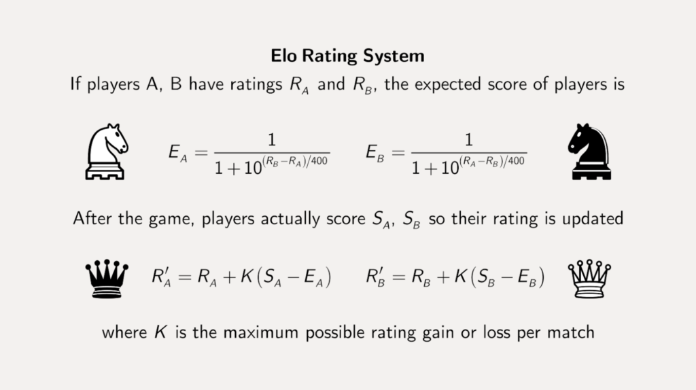

<!-- Hoofdstuk 4-->

:::{.callout-warning}
**Gebruik je kennis van debuggen om vanaf dit hoofstuk problemen op te lossen. Gebruik niet ``Console.WriteLine()`` om de waarde van een variabele te controleren at-runtime, maar gebruik daarentegen breakpoints!**
:::

:::{.callout-tip}
Vanaf dit punt zullen  de meeste oefeningen iets "vragen" aan de gebruiker. Hiermee wordt bedoeld dat je de gebruikersinput via ``ReadLine`` moet inlezen en indien nodig moet converteren naar het gewenste type.
:::

:::{.callout-tip}
Gebruikersinvoer in de voorbeelden zullen met een liggend streepje voorafgegaan worden. Zo zie je duidelijk wat het verschil is tussen ``ReadLine`` en ``WriteLine`` in de voorbeelduitvoer.
:::

<!-- Hoofdstuk 4-->


# Supercomputer (Dodona beschikbaar)

# Supercomputer (Dodona beschikbaar)


Vraag aan de gebruiker 3 kommagetallen. Bereken het gemiddelde van deze 3 getallen en toon dit als een kommagetal op het scherm


Voorbeeld:

```text
Geef getal 1:
>23,4
Geef getal 2:
>34,6
Geef getal 3:
>27,7
Het gemiddelde hiervan is: 28,566666666666666
```


# Vierkant (*Essential*) (Dodona beschikbaar)

# Vierkant (*Essential*) (Dodona beschikbaar)
Schrijf een programma om de omtrek en de oppervlakte van een vierkant te bepalen. De zijde wordt ingelezen.

Voorbeeld:
```text
Geef de zijde:
>4,6
Omtrek is 18.4
Oppervlakte is 21,16
```


# Balk (Dodona beschikbaar)

# Balk (Dodona beschikbaar)

Bereken de oppervlakte en de inhoud van een balk . De gegevens (hoogte, breedte, lengte) worden ingelezen als gehele getallen. Zorg ervoor dat de uitvoer er als volgt uitziet:

```text
Lengte?
>3
Breedte?
>5
Hoogte?
>4
Oppervlakte is 94
Inhoud is 60
```


# BMI berekenaar (*Essential*) (Dodona beschikbaar)

# BMI berekenaar (*Essential*) (Dodona beschikbaar)
Maak een programma dat aan de gebruiker z'n lengte (in cm) en gewicht (in kg) vraagt en vervolgens de berekende BMI (Body Mass Index) toont. Zoek zelf op hoe je het BMI berekent.

Gebruik ``Math.Round`` om de uitkomst tot maximum 2 cijfers na de komma te tonen.

Reken na met je rekenmachine of je uitkomst wel degelijk klopt!

Uitvoer:

```text
Wat is uw lengte in cm?
[lengteInCm]

Wat is uw gewicht in kg?
[gewicht]

Een persoon met een lengte van [lengteInMeter] m en een gewicht van [gewicht] kg heeft een BMI van [bmi].
```


# Op-de-poef (*Essential*)

# Op-de-poef (*Essential*)
Een vaste klant in je café bestelt altijd "op-de-poef". Dat wil zeggen dat hij niet onmiddellijk betaalt en dat z'n rekeningen worden neergeschreven. Ooit zal de klant dan gevraagd worden de hele som te betalen.

Schrijf een programma dat 5 keer na elkaar aan de barman vraagt om een bedrag in te voeren. Het ingevoerde bedrag wordt opgeteld bij wat er reeds op de rekening staat. Na 5 keer wordt de totale som getoond alsook hoeveel weken het duurt indien de klant wekelijks 10 euro afbetaalt.

Voorbeeldwerking:


```text
Voer bedrag in?
>12
De poef staat op 12 euro.
Voer bedrag in?
>14
De poef staat op 26 euro.
Voer bedrag in?
>3
De poef staat op 29 euro.
Voer bedrag in?
>8
De poef staat op 37 euro.
Voer bedrag in?
>2
De poef staat op 39 euro.
*************************
Het totaal van  de poef is 39 en zal 4 weken duren om volledig afbetaald te worden.
```

:::{.callout-warning}
Voor deze oefening heb je ``Math.Ceiling()`` nodig. Deze methode zal een getal altijd naar boven afronden.
:::


# Feestkassa (*Essential*)

# Feestkassa (*Essential*)
De plaatselijke voetbalclub organiseert een mosselfestijn. Naast mosselen met frietjes (20 EUR) bieden ze voor de kinderen de mogelijkheid om een koninginnenhapje (10 EUR) te kiezen. Verder is er een ijsje als nagerecht voorzien (3 EUR). Om het gemakkelijk te maken kosten alle dranken 2 EUR.


Ontwerp een applicatie zodat de vrijwilliger aan de kassa alleen maar de juiste aantallen moet ingeven, lijn per lijn. (frietjes, koninginnenhapje, ijsje, drank) om de totaal te betalen prijs te berekenen. 

Het resultaat wordt als volgt weergegeven: ``Het totaal te betalen bedrag is x EURO``.

Voorbeeld:
```
Frietjes?
>3
Tussenprijs= 60 euro
koninginnenhapje?
>5
Tussenprijs= 60 euro + 50 euro
Ijsjes?
>2
Tussenprijs= 60 euro + 50 euro + 6 euro
Dranken?
>5
Tussenprijs= 60 euro + 50 euro + 6 euro + 10 euro

Het totaal te betalen bedrag is 126 EURO.
```


# Het Orakeltje van Delphi (*Essential*)

# Het Orakeltje van Delphi (*Essential*)
Gebruik een random generator om een orakel (een duur woord voor waarzegger) te maken, namelijk de kleine broer of zus van het [Orakel van Delphi](https://nl.wikipedia.org/wiki/Orakel_van_Delphi). Het programma zal aan de gebruiker vertellen hoe lang deze nog zal leven. Bijvoorbeeld: "Je zal nog 15 jaar leven.".
 
Het orakel zal enkel realistische getallen geven. M.a.w., getallen van 5 tot en met 125 jaar.


:::{.callout-tip}
We gaan geregeld een oefening in een later hoofdstuk verder uitbreiden. Het orakeltje van Delphi is er zo eentje. **Bewaar je oefeningen dus goed!**
:::


# Geometric fun (Dodona beschikbaar)

# Geometric fun (Dodona beschikbaar)

Vraag aan de gebruiker een hoek in graden. Zet deze om naar radialen , gebruik ``Math.PI`` voor Pi. Gebruik vervolgens de verschillende geometrische functies in de ``Math.`` bibliotheek om de sinus (``.Sin``), cosinus (``.Cos``) en tangens (``.Tan``) van de hoek aan de gebruiker te tonen 

:::{.callout-tip}
Denk eraan: de methoden die met hoeken werken, werken in radialen, daarom moeten we deze eerst omzetten.
1 rad = 180°/PI = 57.295779513°.
:::

:::{.callout-tip}
Je zal merken dat voor bepaalde hoeken (bijvoorbeeld 90 graden) je erg kleine of erg grote waarden krijgt, dat is normaal. De geometrische functie in de Math-bibliotheek berekenen de resultaten (en werken dus niet met een tabel) wat met eindige kommagetallen ervoor zorgt dat je soms in plaats van 1 of 0 (of plus of min oneindig) iets erg kleins of groot krijgt.
:::

Uitvoer:
```text
Geef de hoek in graden:
[hoekInGraden]

Sinus van deze hoek is: [sinus]
Cosinus van deze hoek is: [cosinus]
Tangens van deze hoek is: [tangens]
```


# Schaak-ELO 

# Schaak-ELO 

> Sinds 2022 en de sappige verhalen rond Magnus en Niemann is schaken erg populair aan het worden bij "de massa". Tijd om hier dus een oefening rond te maken.

*"Een Elo-rating is een getalsmatige aanduiding van de sterkte van een speler. Het wordt het meest gebruikt in schaken, dammen en go, maar kan in principe gebruikt worden bij elke sport waarbij spelers 1 tegen 1 spelen."* (bron Wikipedia). We gaan een applicatie schrijven (zie verderop voor de effectieve werking van de applicatie) die: 

1° De verwachte score (Ea en Eb) berekend indien 2 spelers tegen elkaar gaan spelen, gebaseerd op hun ELO-rating (Ra en Rb) die je applicatie aan de gebruiker vraagt.
2° Berekenen van hun nieuwe Elo score (R'a en R'b) gebaseerd op de effectieve uitslag (Sa en Sb). 

Volgende afbeelding ([bron](https://www.coorpacademy.com/en/blog/learning-innovation-en/elo-whos-the-best/)) toont beide stappen:


Opmerkingen bij deze formules:

* De waarde K mag je standaard op 10 zetten (dit geeft aan dat er maximum 10 Elo-punten kunnen bijkomen of afgaan).
* De eindscore (Sa en Sb) is als volgt: 1 voor een win, 0,5 voor gelijkstond, 0 voor verlies.
* **Gebruik voor ALLES doubles.**
* De finale, nieuwe, rating wordt afgerond tot 0 cijfers na de komma. 

## Getalvoorbeeld:

Indien speler A een rating van 1000 heeft en B 1100 dan zal speler A na een gewonnen wedstrijd een rating van 1006 krijgen en speler B 1094.

## Applicatie

Schrijf een applicatie die eerst de Elo-ratings van beide spelers vraagt.
Vervolgens toont de applicatie de nieuwe Elo-ratings voor de 3 scenario's:
* Indien speler A wint.
* Indien speler B wint.
* Indien er een gelijke stand (draw) is.

### K vragen

Breidt de applicatie uit en vraag de waarde K ook aan de gebruiker en gebruik deze in je berekeningen.


# De Festivalganger (*Final Essentials*)

# De Festivalganger (*Final Essentials*)

Je hebt tickets bemachtigd voor een fantastisch driedaags festival! Maar festivals zijn duur, dus je besluit een app te schrijven om je budget te beheren.

Het programma werkt als volgt:
1.  Vraag de gebruiker zijn/haar **naam** en het **totaal budget**.
2.  Voor elke dag (Dag 1, Dag 2 en Dag 3):
    *   Vraag hoeveel **drankjes** (à € 4.50) de gebruiker heeft gedronken.  
    *   Vraag hoeveel **snacks** (à € 9.00) de gebruiker heeft gegeten.
    *   Daarnaast berekent het programma een **onvoorziene kost** voor die dag (bijvoorbeeld zonnecrème, poncho, fooi, ...). Dit is een willekeurig getal tussen 5 en 20.
    *   Bereken de totale kosten van de dag.
    *   Trek dit bedrag van het budget af.
    *   Toon de kosten van de dag en het nieuwe resterende budget.
3.  Zorg ervoor dat het resterende budget telkens wordt afgerond op 2 cijfers na de komma met `Math.Round()`.

*Opmerking: Omdat we nog geen lussen (loops) hebben gezien, mag je de code voor de 3 dagen gewoon onder elkaar kopiëren.*


**Voorbeeld output:** (tekst na `>` is invoer)

```text
Welkom op het festival! Wat is je naam?
>Jos
Hoeveel budget heb je mee?
>250

--- DAG 1 ---
Aantal drankjes?
>5
Aantal snacks?
>2
Oeps! Onvoorziene kost van 12 euro.
Totaal dag 1: 52,5 euro
Budget over: 197,5 euro

--- DAG 2 ---
Aantal drankjes?
>8
Aantal snacks?
>3
Oeps! Onvoorziene kost van 6 euro.
Totaal dag 2: 69 euro
Budget over: 128,5 euro

--- DAG 3 ---
Aantal drankjes?
>10
Aantal snacks?
>0
Oeps! Onvoorziene kost van 9 euro.
Totaal dag 3: 54 euro
Budget over: 74,5 euro

Jos, je hebt nog 74,5 euro over na 3 dagen feesten!
```


::::{.callout-caution collapse="true" title="Oplossing"}


* [Bespreking oplossingen hoofdstuk 3](https://ap.cloud.panopto.eu/Panopto/Pages/Viewer.aspx?id=0c5972b4-e091-40dc-84dc-a97600d27428)

## Supercomputer

:::{.callout-tip}
**Les(sen) uit deze oefening:** Herinner je je nog waarom we ronde haakjes rond de som moesten plaatsen?!
:::

```java
double getal1 = double.Parse(Console.ReadLine());
double getal2 = double.Parse(Console.ReadLine());
double getal3 = double.Parse(Console.ReadLine());
Console.WriteLine($"Gemiddelde is {(getal1+getal2+getal3)/3}");
```

## Vierkant

:::{.callout-tip}
**Les(sen) uit deze oefening:** Lijn 2 en 3 kan ook gecombineerd worden in 1 lijn: ``double zijde = double.Parse(Console.ReadLine());``, hierdoor heb je de tijdelijke variabele ``zijdeInvoer`` niet meer invoer
:::

```java
Console.WriteLine("Geef de zijde:");
string zijdeInvoer = Console.ReadLine();
double zijde =double.Parse(zijdeInvoer);
double omtrek = zijde * 4; 
double oppervlakte= Math.Pow(zijde, 2);

Console.WriteLine($"Omtrek is {omtrek}");
Console.WriteLine($"Oppervlakte is {oppervlakte}");
```


## Balk

```java
Console.WriteLine("Geef lengte");
int lengte = int.Parse(Console.ReadLine());
Console.WriteLine("Geef breedte ");
int breedte = int.Parse(Console.ReadLine());
Console.WriteLine("Geef hoogte ");
int hoogte = int.Parse(Console.ReadLine());

int opp = 2*lengte*breedte + 2*lengte*hoogte + 2* breedte*hoogte;

Console.WriteLine($"lengte: {lengte}");
Console.WriteLine($"breedte: {breedte}");
Console.WriteLine($"hoogte: {hoogte}");
Console.WriteLine($"oppervlakte: {opp}");
Console.WriteLine($"inhoud: {lengte*breedte*hoogte}");
```

## Geometric fun

```java
Console.WriteLine("Geef de hoek in graden:");
double hoekInGraden = double.Parse(Console.ReadLine());
double hoekInRadialen = hoekInGraden * ( Math.PI/180);

Console.WriteLine($"Sinus van {hoekInGraden} graden is {Math.Sin(hoekInRadialen)}");
Console.WriteLine($"Cosinus van {hoekInGraden} graden is {Math.Cos(hoekInRadialen)}");
Console.WriteLine($"Tangens van {hoekInGraden} graden is {Math.Tan(hoekInRadialen)}");
```

## BMI Berekenaar 

:::{.callout-tip}
**Les(sen) uit deze oefening:** Bij deze oefeningen moet je goed opletten dat je:

a. Geen informatie verliest in de deling wanneer je vergeet te werken met doubles i.p.v. integers.
b. Goed bekijkt welke grootheden je nodig hebt. De formule van BMI vereist de lengte in meter, maar de gebruiker wordt deze in in centimeter.
:::

```java
Console.WriteLine("Wat is uw lengte in cm?");
double lengteInMeter = Convert.ToDouble(Console.ReadLine())/100;

Console.WriteLine("Wat is uw gewicht in kg?");
double gewicht = Convert.ToDouble(Console.ReadLine());

double bmi = gewicht / Math.Pow(lengteInMeter, 2);
Console.WriteLine($"Een persoon met een lengte van {lengteInMeter} m en een gewicht van {gewicht} kg heeft een BMI van {Math.Round(bmi,2)}");
   
```

## Op-de-poef

:::{.callout-tip}
**Les(sen) uit deze oefening:** Dit is de eerste keer dat je een **lopende som** moest maken: je hebt een variabele (``poef``) die zal groeien met behulp van ``+=``. Merk op dat ``poef += bedrag;`` ook mag schrijven als ``poef = poef + bedrag;`` , zo zie je nog duidelijker de lopende som: we nemen de inhoud van de variabele ``poef``, tellen er ``bedrag`` bij op, en dat nieuwe resultaat bewaren we opnieuw in ``poef`` ( we overschrijven dan ook de vorige waarde die er in stak).
:::

```java
int poef = 0;
int bedrag = 0;


Console.WriteLine("Voer bedrag in:");
bedrag = int.Parse(Console.ReadLine());
poef += bedrag;
Console.WriteLine($"De poef staat op {poef} euro");
Console.WriteLine("Voer bedrag in:");
bedrag = int.Parse(Console.ReadLine());
poef += bedrag;
Console.WriteLine($"De poef staat op {poef} euro");
Console.WriteLine("Voer bedrag in:");
bedrag = int.Parse(Console.ReadLine());
poef += bedrag;
Console.WriteLine($"De poef staat op {poef} euro");
Console.WriteLine("Voer bedrag in:");
bedrag = int.Parse(Console.ReadLine());
poef += bedrag;
Console.WriteLine($"De poef staat op {poef} euro");
Console.WriteLine("Voer bedrag in:");
bedrag = int.Parse(Console.ReadLine());
poef += bedrag;
Console.WriteLine($"De poef staat op {poef} euro");

Console.WriteLine("*****************");
double weken = Math.Ceiling(poef / 10.0);
string zin = $"Het totaal van de poef is {poef} en zal {weken} weken duren om volledig afbetaald te worden.";
Console.WriteLine(zin);
```


## Feestkassa

```java
const int PRIJSFRIET = 20;
const int PRIJSKONINGIN = 10;
const int PRIJSDESSERT = 3;
const int PRIJSDRANK = 2;

int aantal = 0;
int totaalPrijs = 0;
int tussenPrijs = 0;
string tussenPrijsZin = "Tussenprijs=";

Console.WriteLine("Frietjes?");
aantal = int.Parse(Console.ReadLine());
tussenPrijs = aantal * PRIJSFRIET;
totaalPrijs = tussenPrijs;
tussenPrijsZin += $" + {tussenPrijs} euro";
Console.WriteLine(tussenPrijsZin);

Console.WriteLine("Koningingenhapjes?");
aantal = int.Parse(Console.ReadLine());
tussenPrijs = aantal * PRIJSKONINGIN;
totaalPrijs += tussenPrijs;
tussenPrijsZin += $" + {tussenPrijs} euro";
Console.WriteLine(tussenPrijsZin);

Console.WriteLine("Ijsjes?");
aantal = int.Parse(Console.ReadLine());
tussenPrijs = aantal * PRIJSDESSERT;
totaalPrijs += tussenPrijs;
tussenPrijsZin += $" + {tussenPrijs} euro";
Console.WriteLine(tussenPrijsZin);

Console.WriteLine("Dranken?");
aantal = int.Parse(Console.ReadLine());
tussenPrijs = aantal * PRIJSDRANK;
totaalPrijs += tussenPrijs;
tussenPrijsZin += $" + {tussenPrijs} euro";
Console.WriteLine(tussenPrijsZin);

Console.WriteLine($"Het totaal te betaken bedrag is {totaalPrijs}");
```


## Het orakeltje van Delphi

```java
Random delphi= new Random();
Console.WriteLine($"Je zal nog {delphi.Next(5,126)} jaar leven");
```

## Schaak-ELO

:::{.callout-tip}
**Les(sen) uit deze oefening:** Dit is een iets pittigere oefening waarbij je je goed moet concentreren op het gebruik van haakjes om de volgorde van berekeningen te controleren. 
:::

Input van de gebruiker wordt niet getoond maar zal je zelf hopelijk wel kunnen:

```java
const int K = 10;
double ra = 1000; //vraag dit aan de gebruiker
double rb = 1100; //vraag dit aan de gebruiker

double ea= 1 /(1+Math.Pow(10,(rb-ra)/400.0));
double eb = 1 / (1 + Math.Pow(10, (ra - rb) / 400.0));

double ranew = ra + K * (1 - ea);
double rbnew = rb + K * (0 - eb);
Console.WriteLine("Indien a wint:");
Console.WriteLine(Math.Round(ranew,0));
Console.WriteLine(Math.Round(rbnew,0));
//idem voor de 2 andere scenarios)
```

::::
