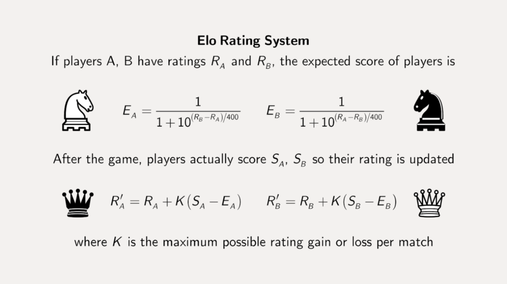

<!-- Hoofdstuk 4-->

::: {.vooraf}
- [Let op]{.let-op} Gebruik vanaf dit hoofdstuk je kennis van debuggen: controleer de waarde van een variabele met **breakpoints**, niet met ``Console.WriteLine()``. De oefening Breakpoint-detective leert je hoe.
- Vanaf nu zullen de meeste oefeningen iets "vragen" aan de gebruiker: lees de invoer in met ``ReadLine`` en converteer indien nodig naar het gewenste type. Je mag ervan uitgaan dat de gebruiker altijd geldige invoer typt.
- In de voorbeelduitvoer begint gebruikersinvoer met ``>``. Zo zie je het verschil tussen ``ReadLine`` en ``WriteLine``.
- Een kommagetal typ je als gebruiker met een komma (``4,6``), zoals op een pc met Belgische instellingen. In je code schrijf je het altijd met een punt (``4.6``). Staat je pc in het Engels, dan typ en zie je overal een punt.
:::

<!-- Hoofdstuk 4-->


# Vierkant (*Essential*) {#h04-vierkant}
Schrijf een programma om de omtrek en de oppervlakte van een vierkant te bepalen. De zijde wordt ingelezen.

Voorbeeld:

```text
Geef de zijde:
>4,6
Omtrek is 18,4
Oppervlakte is 21,159999999999997
```

Die vreemde oppervlakte is geen fout in je programma. Waar ze vandaan komt, lees je in de Les onder de oplossing.

::::{.callout-caution collapse="true" title="Les(sen) uit deze oefening"}
* Een ``double`` bewaart kommagetallen binair, en niet elk kommagetal past daar exact in. 4,6 in het kwadraat wordt daardoor ``21,159999999999997`` in plaats van 21,16. Hetzelfde zie je bij ``0.1 + 0.2`` in [Geld: reken niet met double](https://www.ziescherp.be/content/3_data/4d_afronden.html#geld-reken-niet-met-double). In deel 2 los je het op.
* De invoer mag je eerst in een ``string`` bewaren en dan parsen, of in één lijn: ``double zijde = double.Parse(Console.ReadLine());``. Beide zijn juist. Heb je de tekst zelf nergens anders nodig, dan is één lijn korter.
::::

::::{.callout-caution collapse="true" title="Oplossing"}

```java
Console.WriteLine("Geef de zijde:");
double zijde = double.Parse(Console.ReadLine());
double omtrek = zijde * 4;
double oppervlakte = Math.Pow(zijde, 2);

Console.WriteLine($"Omtrek is {omtrek}");
Console.WriteLine($"Oppervlakte is {oppervlakte}");
```
::::

**Deel 2.** Toon de oppervlakte daaronder nog twee keer: één keer met ``Math.Round(oppervlakte, 2)`` en één keer met ``{oppervlakte:F2}`` in je string interpolatie. Test met zijde 4,6 en met zijde 5.

```text
Geef de zijde:
>5
Omtrek is 20
Oppervlakte is 25
Afgerond: 25
Mooi getoond: 25,00
```

Wat is het verschil tussen de twee? En welke waarde zit er na die twee lijnen nog in de variabele ``oppervlakte``? Controleer het met een breakpoint.

::::{.callout-caution collapse="true" title="Les(sen) uit deze oefening"}
* ``Math.Round`` rekent een nieuw, afgerond getal uit. Nullen op het einde toont C# niet, dus 25 blijft 25.
* ``F2`` verandert niets aan het getal. Het bepaalt enkel hoe het op het scherm komt: altijd twee cijfers na de komma, dus ook ``25,00``.
* De variabele ``oppervlakte`` blijft in beide gevallen ``21,159999999999997``. Pas als je het resultaat van ``Math.Round`` in een variabele stopt, ben je de andere cijfers echt kwijt. Meer daarover in [Afronden of enkel mooi tonen?](https://www.ziescherp.be/content/3_data/4d_afronden.html#afronden-of-enkel-mooi-tonen)
::::

::::{.callout-caution collapse="true" title="Oplossing"}

Voeg onderaan toe:

```java
Console.WriteLine($"Afgerond: {Math.Round(oppervlakte, 2)}");
Console.WriteLine($"Mooi getoond: {oppervlakte:F2}");
```

Met zijde 4,6 tonen beide lijnen ``21,16``. Met zijde 5 toont de eerste ``25`` en de tweede ``25,00``.
::::


# Balk {#h04-balk}

Deze oefening traint hetzelfde als Vierkant, maar dan met gehele getallen. Heb je Vierkant vlot gemaakt, dan mag je ze overslaan.

Bereken de oppervlakte en de inhoud van een balk. De gegevens (lengte, breedte en hoogte) worden ingelezen als gehele getallen. Zorg ervoor dat de uitvoer er als volgt uitziet:

```text
Lengte?
>3
Breedte?
>5
Hoogte?
>4
Oppervlakte is 94
Inhoud is 60
```

::::{.callout-caution collapse="true" title="Oplossing"}
```java
Console.WriteLine("Lengte?");
int lengte = int.Parse(Console.ReadLine());
Console.WriteLine("Breedte?");
int breedte = int.Parse(Console.ReadLine());
Console.WriteLine("Hoogte?");
int hoogte = int.Parse(Console.ReadLine());

int oppervlakte = 2 * lengte * breedte + 2 * lengte * hoogte + 2 * breedte * hoogte;
int inhoud = lengte * breedte * hoogte;

Console.WriteLine($"Oppervlakte is {oppervlakte}");
Console.WriteLine($"Inhoud is {inhoud}");
```

::::


# Supercomputer (*Essential*) {#h04-supercomputer}

Vraag aan de gebruiker 3 kommagetallen. Bereken het gemiddelde van deze 3 getallen en toon dit als een kommagetal op het scherm.

Voorbeeld:

```text
Geef getal 1:
>23,4
Geef getal 2:
>34,6
Geef getal 3:
>27,7
Het gemiddelde hiervan is: 28,566666666666666
```

::::{.callout-caution collapse="true" title="Les(sen) uit deze oefening"}
Zonder haakjes rond de som deelt C# enkel ``getal3`` door 3, en telt het daarna de andere twee erbij. Delen gaat voor optellen, net zoals in hoofdstuk 2.
::::

::::{.callout-caution collapse="true" title="Oplossing"}

```java
Console.WriteLine("Geef getal 1:");
double getal1 = double.Parse(Console.ReadLine());
Console.WriteLine("Geef getal 2:");
double getal2 = double.Parse(Console.ReadLine());
Console.WriteLine("Geef getal 3:");
double getal3 = double.Parse(Console.ReadLine());

double gemiddelde = (getal1 + getal2 + getal3) / 3;
Console.WriteLine($"Het gemiddelde hiervan is: {gemiddelde}");
```
::::

**Deel 2.** Voer je programma nog eens uit, met dezelfde getallen, maar typ nu ``23.4`` (met een punt) in plaats van ``23,4``. Wat gebeurt er? En waarom crasht je programma niet?

::::{.callout-caution collapse="true" title="Oplossing"}

```text
Geef getal 1:
>23.4
Geef getal 2:
>34,6
Geef getal 3:
>27,7
Het gemiddelde hiervan is: 98,76666666666667
```

Op een pc met Belgische instellingen is de komma het decimaalteken. De punt geldt daar als scheiding tussen duizendtallen, zoals in 1.000. ``double.Parse("23.4")`` geeft dus geen fout maar 234, en het gemiddelde wordt (234 + 34,6 + 27,7) / 3. Zet een breakpoint op de lijn met de berekening en kijk in *Locals* wat er in ``getal1`` zit.

Staat je pc in het Engels, dan is het net omgekeerd: daar wordt ``23,4`` gelezen als 234.
::::

::::{.callout-caution collapse="true" title="Les(sen) uit deze oefening"}
Het verkeerde scheidingsteken geeft geen foutmelding, enkel een verkeerd getal. Krijg je bij kommagetallen een vreemd resultaat zonder dat er iets crasht, kijk dan eerst welk teken er getypt werd. In je code zelf schrijf je een kommagetal altijd met een punt, los van de instellingen van je pc. Meer in [Kommagetallen in C#](https://www.ziescherp.be/content/3_data/4b_inputconverten.html#kommagetallen-in-c).
::::


# BMI berekenaar (*Essential*) {#h04-bmi-berekenaar}
Maak een programma dat aan de gebruiker z'n lengte (in cm) en gewicht (in kg) vraagt en vervolgens de berekende BMI (Body Mass Index) toont. Zoek zelf op hoe je het BMI berekent.

Gebruik ``Math.Round`` om de uitkomst tot maximum 2 cijfers na de komma te tonen.

Reken na met je rekenmachine of je uitkomst wel degelijk klopt!

Voorbeeld:

```text
Wat is uw lengte in cm?
>180
Wat is uw gewicht in kg?
>75
Een persoon met een lengte van 1,8 m en een gewicht van 75 kg heeft een BMI van 23,15.
```

:::{.callout-tip}
Bewaar deze oefening goed: in het volgende hoofdstuk bouw je ze verder uit.
:::

::::{.callout-caution collapse="true" title="Les(sen) uit deze oefening"}
Bij deze oefening moet je goed opletten dat je:

a. Goed bekijkt welke eenheden je nodig hebt. De formule van BMI vraagt de lengte in meter, maar de gebruiker geeft ze in centimeter.
b. Geen informatie verliest in de deling. Lees je de lengte in als ``int``, dan geeft ``180 / 100`` een gehele deling en is iedereen plots 1 meter groot.

Klopt je BMI niet? Zet een breakpoint op de lijn met de formule en kijk in *Locals* wat er in ``lengteInMeter`` zit.
::::


::::{.callout-caution collapse="true" title="Oplossing"}

```java
Console.WriteLine("Wat is uw lengte in cm?");
double lengteInMeter = double.Parse(Console.ReadLine()) / 100;
Console.WriteLine("Wat is uw gewicht in kg?");
double gewicht = double.Parse(Console.ReadLine());

double bmi = gewicht / Math.Pow(lengteInMeter, 2);
Console.WriteLine($"Een persoon met een lengte van {lengteInMeter} m en een gewicht van {gewicht} kg heeft een BMI van {Math.Round(bmi, 2)}.");
```
::::


# Voorspel de uitvoer (*Essential*) {#h04-voorspel-de-uitvoer}

Voer onderstaande code nog niet uit. Schrijf eerst op papier exact op wat er op het scherm zal verschijnen, lijn per lijn.

```java
int a = 20;
int b = 25;
char teken = '7';
int getal = teken;

Console.WriteLine((int)2.9);
Console.WriteLine((int)-2.7);
Console.WriteLine(Math.Floor(-2.7));
Console.WriteLine(Math.Round(4.5));
Console.WriteLine(Math.Round(4.5, MidpointRounding.AwayFromZero));
Console.WriteLine(Convert.ToInt32(4.5));
Console.WriteLine((double)(a + b) / 2);
Console.WriteLine((double)((a + b) / 2));
Console.WriteLine(getal);
Console.WriteLine(int.Parse(teken.ToString()));
Console.WriteLine("3" + "4");
```

Voer de code daarna uit en vergelijk met wat je opschreef. Klopt een lijn niet, zoek dan uit waar je redenering fout liep voor je naar de oplossing kijkt.

::::{.callout-caution collapse="true" title="Oplossing"}

```text
2
-2
-3
4
5
4
22,5
22
55
7
34
```

* Een cast kapt af, richting nul. ``(int)2.9`` wordt 2 en ``(int)-2.7`` wordt -2.
* ``Math.Floor`` gaat altijd naar beneden, richting min oneindig. Bij -2,7 is dat -3.
* ``Math.Round`` rondt een getal dat exact op de helft ligt af naar het dichtstbijzijnde even getal (bankers rounding). 4,5 wordt dus 4. Met ``MidpointRounding.AwayFromZero`` wordt het 5, zoals je op school leerde.
* ``Convert.ToInt32`` doet ook aan bankers rounding, en daar kan je het niet afzetten.
* In ``(double)(a + b) / 2`` wordt de som 45 eerst een ``double``, en dan geeft de deling 22,5. In ``(double)((a + b) / 2)`` gebeurt de deling eerst, met twee ints: 22. Pas daarna wordt 22 een ``double``, en dan is de 0,5 al weg.
* Een ``char`` in een ``int`` stoppen geeft de Unicode-waarde van het teken. Voor ``'7'`` is dat 55. Het cijfer 7 zelf krijg je via ``ToString`` en ``int.Parse``.
* ``"3"`` en ``"4"`` zijn strings. De ``+`` plakt ze aan elkaar.

Meer uitleg in [De drie manieren naast elkaar](https://www.ziescherp.be/content/3_data/4d_afronden.html#de-drie-manieren-naast-elkaar) en [Een cijferteken is nog geen cijfer](https://www.ziescherp.be/content/3_data/4_converteren_casting.html#een-cijferteken-is-nog-geen-cijfer).
::::

**Deel 2 (optioneel).** Ook deze drie lijnen eerst op papier:

```java
Console.OutputEncoding = System.Text.Encoding.UTF8;
int groot = int.MaxValue;
double wortel = Math.Sqrt(-1);

Console.WriteLine(groot + 1);
Console.WriteLine(10.0 / 0);
Console.WriteLine(wortel + 5);
```

::::{.callout-caution collapse="true" title="Oplossing"}

```text
-2147483648
∞
NaN
```

* Eén bij het grootste ``int`` optellen geeft het kleinste ``int``: overflow. Geen crash, geen waarschuwing.
* Een kommagetal delen door nul geeft oneindig. Ook geen crash. Zonder de eerste lijn met ``OutputEncoding`` kan het teken voor oneindig op een Belgische pc als een ``8`` op het scherm komen.
* De wortel van -1 bestaat niet als kommagetal: ``NaN``, *Not a Number*. Alles wat je daarna met ``NaN`` berekent, wordt zelf ook ``NaN``.

Zie [Als rekenen misloopt](https://www.ziescherp.be/content/3_data/4c_math.html#als-rekenen-misloopt).
::::


# Breakpoint-detective (*Essential*) {#h04-breakpoint-detective}

Onderstaand programma berekent de gemiddelde temperatuur van gisteren en vandaag. Het gemiddelde van 20 en 25 is 22,5, maar het programma toont iets anders.

```java
int tempGisteren = 20;
int tempVandaag = 25;
int som = tempGisteren + tempVandaag;
double gemiddelde = som / 2;
double afgerond = Math.Round(gemiddelde, 1);
Console.WriteLine($"Gemiddelde temperatuur: {afgerond} graden");
```

Zoek met de debugger op welke lijn de halve graad verloren gaat. Niet door te gokken, maar zo:

1. Plak de code in ``Main`` en zet een breakpoint op de eerste lijn: klik in de grijze rand links van de lijn, of zet je cursor op de lijn en druk op ``F9``.
2. Start het programma. Het pauzeert op je breakpoint. De gele lijn is nog **niet** uitgevoerd.
3. Schrijf op wat er in de variabelen zal zitten zodra de gele lijn uitgevoerd is.
4. Druk op *Step Over* (``F10``) en kijk in het venster *Locals* onderaan of je voorspelling klopt.
5. Herhaal stap 3 en 4 tot het einde.

Noteer op welke lijn het misloopt en waarom. Pas daarna die ene lijn aan, zodat het programma ``Gemiddelde temperatuur: 22,5 graden`` toont.

::::{.callout-caution collapse="true" title="Oplossing"}

Wat *Locals* toont na elke *Step Over*:

| Uitgevoerde lijn | Nieuwe waarde |
|---|---|
| ``int tempGisteren = 20;`` | ``tempGisteren`` is 20 |
| ``int tempVandaag = 25;`` | ``tempVandaag`` is 25 |
| ``int som = tempGisteren + tempVandaag;`` | ``som`` is 45 |
| ``double gemiddelde = som / 2;`` | ``gemiddelde`` is 22 |
| ``double afgerond = Math.Round(gemiddelde, 1);`` | ``afgerond`` is 22 |

Het misloopt op de vierde lijn. ``som`` en ``2`` zijn allebei een ``int``, dus ``som / 2`` is een gehele deling en geeft 22. Dat ``gemiddelde`` een ``double`` is, verandert daar niets aan: de berekening rechts van de ``=`` is dan al gebeurd. ``Math.Round`` kan daarna niets meer terughalen.

De herstelde lijn:

```java
double gemiddelde = som / 2.0;
```

``(double)som / 2`` mag ook. ``(double)(som / 2)`` niet: dan deel je eerst en cast je pas achteraf.
::::

::::{.callout-caution collapse="true" title="Les(sen) uit deze oefening"}
Eerst voorspellen, dan pas stappen. Wie gewoon op *Step Over* blijft drukken zonder te weten wat hij verwacht, ziet de fout voorbijkomen zonder ze op te merken. Dit is exact het voorbeeld uit [Narrowing in de praktijk](https://www.ziescherp.be/content/3_data/4_converteren_casting.html#narrowing-in-de-praktijk).
::::


# Op-de-poef (*Essential*) {#h04-op-de-poef}
Een vaste klant in je café bestelt altijd "op-de-poef". Dat wil zeggen dat hij niet onmiddellijk betaalt en dat z'n rekeningen worden neergeschreven. Ooit zal de klant dan gevraagd worden de hele som te betalen.

Schrijf een programma dat 5 keer na elkaar aan de barman vraagt om een bedrag in te voeren, in hele euro. Het ingevoerde bedrag wordt opgeteld bij wat er reeds op de rekening staat. Na 5 keer wordt de totale som getoond alsook hoeveel weken het duurt indien de klant wekelijks 10 euro afbetaalt.

*Opmerking: omdat we nog geen lussen (loops) hebben gezien, mag je de code voor de 5 bedragen gewoon onder elkaar kopiëren.*

Voorbeeldwerking:

```text
Voer bedrag in:
>12
De poef staat op 12 euro.
Voer bedrag in:
>14
De poef staat op 26 euro.
Voer bedrag in:
>3
De poef staat op 29 euro.
Voer bedrag in:
>8
De poef staat op 37 euro.
Voer bedrag in:
>2
De poef staat op 39 euro.
*************************
Het totaal van de poef is 39 euro en zal 4 weken duren om volledig afbetaald te worden.
```

:::{.callout-tip}
Een halve week bestaat niet: 39 euro afbetalen duurt 4 weken, niet 3,9. Welke methode uit ``Math`` rondt altijd naar boven af?
:::


::::{.callout-caution collapse="true" title="Les(sen) uit deze oefening"}
* Dit is de eerste keer dat je een **lopende som** moest maken: je hebt een variabele (``poef``) die zal groeien met behulp van ``+=``. Merk op dat ``poef += bedrag;`` ook mag schrijven als ``poef = poef + bedrag;``, zo zie je nog duidelijker de lopende som: we nemen de inhoud van de variabele ``poef``, tellen er ``bedrag`` bij op, en dat nieuwe resultaat bewaren we opnieuw in ``poef`` (we overschrijven dan ook de vorige waarde die er in stak).
* Wil je zien hoe ``poef`` groeit? Zet een breakpoint op de eerste lijn en stap met *Step Over* door de vijf blokjes. Hou ``poef`` in het oog in *Locals*.
* ``Math.Ceiling`` geeft altijd een ``double`` terug, ook als er niets na de komma staat. Een aantal weken is een geheel getal, dus cast je het resultaat naar een ``int``. Die cast kapt hier niets af: na ``Math.Ceiling`` staat er toch niets meer na de komma. Het is hetzelfde als het busvoorbeeld in [Afkappen is niet hetzelfde als afronden](https://www.ziescherp.be/content/3_data/4d_afronden.html#afkappen-is-niet-hetzelfde-als-afronden).
* Deel door ``10.0`` en niet door ``10``. ``poef / 10`` is een deling van twee ints, en dan weet de compiler niet welke versie van ``Math.Ceiling`` hij moet nemen. Hij geeft dan een foutmelding (*The call is ambiguous*).
::::


::::{.callout-caution collapse="true" title="Oplossing"}

```java
int poef = 0;
int bedrag = 0;

Console.WriteLine("Voer bedrag in:");
bedrag = int.Parse(Console.ReadLine());
poef += bedrag;
Console.WriteLine($"De poef staat op {poef} euro.");
Console.WriteLine("Voer bedrag in:");
bedrag = int.Parse(Console.ReadLine());
poef += bedrag;
Console.WriteLine($"De poef staat op {poef} euro.");
Console.WriteLine("Voer bedrag in:");
bedrag = int.Parse(Console.ReadLine());
poef += bedrag;
Console.WriteLine($"De poef staat op {poef} euro.");
Console.WriteLine("Voer bedrag in:");
bedrag = int.Parse(Console.ReadLine());
poef += bedrag;
Console.WriteLine($"De poef staat op {poef} euro.");
Console.WriteLine("Voer bedrag in:");
bedrag = int.Parse(Console.ReadLine());
poef += bedrag;
Console.WriteLine($"De poef staat op {poef} euro.");

Console.WriteLine("*************************");
int weken = (int)Math.Ceiling(poef / 10.0);
Console.WriteLine($"Het totaal van de poef is {poef} euro en zal {weken} weken duren om volledig afbetaald te worden.");
```

::::


# Feestkassa {#h04-feestkassa}
De plaatselijke voetbalclub organiseert een mosselfestijn. Naast mosselen met frietjes (20 EUR) bieden ze voor de kinderen de mogelijkheid om een koninginnenhapje (10 EUR) te kiezen. Verder is er een ijsje als nagerecht voorzien (3 EUR). Om het gemakkelijk te maken kosten alle dranken 2 EUR.


Ontwerp een applicatie zodat de vrijwilliger aan de kassa alleen maar de juiste aantallen moet ingeven, lijn per lijn (frietjes, koninginnenhapjes, ijsjes, dranken), om de totaalprijs te berekenen.

Het resultaat wordt als volgt weergegeven: ``Het totaal te betalen bedrag is x EURO.``

Voorbeeld:

```text
Frietjes?
>3
Tussenprijs= 60 euro
Koninginnenhapje?
>5
Tussenprijs= 60 euro + 50 euro
Ijsjes?
>2
Tussenprijs= 60 euro + 50 euro + 6 euro
Dranken?
>5
Tussenprijs= 60 euro + 50 euro + 6 euro + 10 euro

Het totaal te betalen bedrag is 126 EURO.
```

::::{.callout-caution collapse="true" title="Oplossing"}
```java
const double PRIJS_FRIET = 20;
const double PRIJS_KONINGINNE = 10;
const double PRIJS_IJS = 3;
const double PRIJS_DRANK = 2;

Console.WriteLine("Frietjes?");
int aantalFriet = int.Parse(Console.ReadLine());
double totaalFriet = aantalFriet * PRIJS_FRIET;
Console.WriteLine($"Tussenprijs= {totaalFriet} euro");

Console.WriteLine("Koninginnenhapje?");
int aantalKoninginne = int.Parse(Console.ReadLine());
double totaalKoninginne = aantalKoninginne * PRIJS_KONINGINNE;
Console.WriteLine($"Tussenprijs= {totaalFriet} euro + {totaalKoninginne} euro");

Console.WriteLine("Ijsjes?");
int aantalIjs = int.Parse(Console.ReadLine());
double totaalIjs = aantalIjs * PRIJS_IJS;
Console.WriteLine($"Tussenprijs= {totaalFriet} euro + {totaalKoninginne} euro + {totaalIjs} euro");

Console.WriteLine("Dranken?");
int aantalDrank = int.Parse(Console.ReadLine());
double totaalDrank = aantalDrank * PRIJS_DRANK;
Console.WriteLine($"Tussenprijs= {totaalFriet} euro + {totaalKoninginne} euro + {totaalIjs} euro + {totaalDrank} euro");

double totaal = totaalFriet + totaalKoninginne + totaalIjs + totaalDrank;
Console.WriteLine($"\nHet totaal te betalen bedrag is {totaal} EURO.");
```
::::


# Wisselgeld in centen (*Essential*) {#h04-wisselgeld-in-centen}

Een kassa moet wisselgeld teruggeven. De gebruiker typt het bedrag in euro, bijvoorbeeld ``3,75``. Het programma zet dat om naar een geheel aantal centen met een cast, en toont daarna hoeveel munten van elke soort de kassa moet teruggeven: eerst zoveel mogelijk munten van 2 euro, dan van 1 euro, dan van 50 cent, en zo verder tot 1 cent.

Voorbeeld:

```text
Welk bedrag moet je teruggeven?
>3,75
Dat is 375 cent:
1 x 2 euro
1 x 1 euro
1 x 50 cent
1 x 20 cent
0 x 10 cent
1 x 5 cent
0 x 2 cent
0 x 1 cent
```

:::{.callout-tip}
Hoeveel munten van 2 euro passen er in 375 cent? En hoeveel cent blijft er dan over? Voor allebei ken je sinds hoofdstuk 2 een operator. Lussen ken je nog niet: acht keer hetzelfde blokje onder elkaar is hier de bedoeling.
:::

::::{.callout-caution collapse="true" title="Oplossing"}

```java
Console.WriteLine("Welk bedrag moet je teruggeven?");
double bedrag = double.Parse(Console.ReadLine());
int centen = (int)(bedrag * 100);
Console.WriteLine($"Dat is {centen} cent:");

int rest = centen;
Console.WriteLine($"{rest / 200} x 2 euro");
rest = rest % 200;
Console.WriteLine($"{rest / 100} x 1 euro");
rest = rest % 100;
Console.WriteLine($"{rest / 50} x 50 cent");
rest = rest % 50;
Console.WriteLine($"{rest / 20} x 20 cent");
rest = rest % 20;
Console.WriteLine($"{rest / 10} x 10 cent");
rest = rest % 10;
Console.WriteLine($"{rest / 5} x 5 cent");
rest = rest % 5;
Console.WriteLine($"{rest / 2} x 2 cent");
rest = rest % 2;
Console.WriteLine($"{rest} x 1 cent");
```
::::

**Deel 2.** Test je programma nu met ``4,35``. Tel de munten na: kloppen ze? Zoek met een breakpoint op de lijn waar je ``centen`` berekent waar het misloopt: kijk in *Locals* naar ``bedrag`` en ``centen``, en hou je muis boven ``bedrag * 100``. Los het daarna op, zodat er ``Dat is 435 cent:`` verschijnt.

::::{.callout-caution collapse="true" title="Oplossing"}

Met de code van deel 1 verschijnt ``Dat is 434 cent:``, en er is een cent verdwenen. ``4.35 * 100`` geeft in een ``double`` niet 435 maar ``434,99999999999994``, omdat 4,35 niet exact binair te bewaren is. De cast kapt alles na de komma af, en dan blijft er 434 over.

Er zijn twee oplossingen. Ofwel rond je eerst af en cast je pas daarna:

```java
int centen = (int)Math.Round(bedrag * 100);
```

Ofwel werk je met een ``decimal``, dat de cijfers bewaart zoals jij ze typt:

```java
decimal bedrag = decimal.Parse(Console.ReadLine());
int centen = (int)(bedrag * 100);
```
::::

::::{.callout-caution collapse="true" title="Les(sen) uit deze oefening"}
Een cast rondt niet af, hij kapt af. Bij een getal als ``434,99999999999994`` kost dat je een hele cent. Rekenen met geld doe je daarom liefst met ``decimal``, zie [Geld: reken niet met double](https://www.ziescherp.be/content/3_data/4d_afronden.html#geld-reken-niet-met-double).
::::


# Stevens busreis (*Essential*) {#h04-stevens-busreis}

De school gaat op reis met de bus. Stagiair Steven moest een programma schrijven dat het aantal studenten, het aantal plaatsen per bus en de prijs van één bus inleest, en dan toont:

* hoeveel bussen er nodig zijn (niemand blijft achter op de parking);
* hoeveel elke student betaalt: de totale prijs van de bussen gedeeld door het aantal studenten, afgerond op een hele euro zoals je op school leerde (een halve euro gaat naar boven);
* welke rij als eerste mag instappen: een dobbelsteen van 1 tot en met 6 beslist.

Zo zou het er moeten uitzien (de rij verschilt uiteraard bij elke uitvoer):

```text
Hoeveel studenten gaan er mee?
>47
Hoeveel plaatsen heeft een bus?
>20
Hoeveel kost een bus?
>490
Er zijn 3 bussen nodig.
Elke student betaalt 31 euro.
Rij 4 mag als eerste instappen.
```

Steven liet een A.I. de code schrijven en leverde ze in zonder ze te testen:

```java
Console.WriteLine("Hoeveel studenten gaan er mee?");
int studenten = Console.ReadLine();
Console.WriteLine("Hoeveel plaatsen heeft een bus?");
int perBus = int.Parse(Console.ReadLine());
Console.WriteLine("Hoeveel kost een bus?");
double busPrijs = double.Parse(Console.ReadLine());

int aantalBussen = Math.Ceiling((double)(studenten / perBus));
double prijsPerStudent = Math.Round(aantalBussen * busPrijs / studenten);

Random dobbelsteen = new Random();
int rij = dobbelsteen.Next(1, 6);

Console.WriteLine($"Er zijn {aantalBussen} bussen nodig.");
Console.WriteLine($"Elke student betaalt {prijsPerStudent} euro.");
Console.WriteLine($"Rij {rij} mag als eerste instappen.");
```

**Deel 1.** Maak een nieuw project en plak Stevens code in ``Main``. Er zitten twee fouten in die Visual Studio vindt. Lees de foutboodschappen in de *Error List* en herstel ze.

**Deel 2.** Nu start het programma, maar het rekent nog niet juist. Er zitten nog drie fouten in die de compiler niet ziet. Test met deze twee invoeren en vergelijk met wat het programma zou moeten tonen:

* 47 studenten, 20 plaatsen per bus, 490 euro per bus: 3 bussen, 31 euro per student.
* 40 studenten, 20 plaatsen per bus, 490 euro per bus: 2 bussen, 25 euro per student (980 / 40 is 24,5, en dat wordt 25).

Zoek de fouten met een breakpoint en het venster *Locals*, niet door te gokken. De derde fout vind je niet met de debugger, wel door goed na te denken over ``Next``.

::::{.callout-caution collapse="true" title="Oplossing"}

**Deel 1.** De twee meldingen:

1. ``CS0029 Cannot implicitly convert type 'string' to 'int'`` bij ``int studenten = Console.ReadLine();``. ``ReadLine`` geeft altijd een ``string``. Die moet eerst door ``int.Parse``.
2. ``CS0266 Cannot implicitly convert type 'double' to 'int'. An explicit conversion exists (are you missing a cast?)`` bij de lijn met ``Math.Ceiling``. ``Math.Ceiling`` geeft een ``double`` terug, en die past niet zonder cast in een ``int``.

```java
int studenten = int.Parse(Console.ReadLine());
...
int aantalBussen = (int)Math.Ceiling((double)(studenten / perBus));
```

**Deel 2.** Nu toont het programma bij 47 studenten ``2 bussen`` en ``21 euro``, en bij 40 studenten ``24 euro``. De drie fouten:

1. ``(double)(studenten / perBus)``: de haakjes zorgen ervoor dat de deling eerst gebeurt, met twee ints. 47 / 20 is dan 2, en pas daarna wordt dat 2,0. ``Math.Ceiling`` heeft niets meer om naar boven af te ronden. Hou je muis in debug-modus boven ``studenten / perBus`` en je ziet 2 staan. Cast één kant van de deling, niet het resultaat.
2. ``Math.Round`` zonder ``MidpointRounding.AwayFromZero`` doet aan bankers rounding. 24,5 wordt dan 24, want 24 is even. Met een breakpoint op de lijn met ``Math.Round`` en een *Step Over* zie je in *Locals* 24 verschijnen.
3. ``Next(1, 6)`` geeft een getal van 1 tot en met 5. De bovengrens telt niet mee, dus rij 6 mag nooit als eerste instappen.

```java
Console.WriteLine("Hoeveel studenten gaan er mee?");
int studenten = int.Parse(Console.ReadLine());
Console.WriteLine("Hoeveel plaatsen heeft een bus?");
int perBus = int.Parse(Console.ReadLine());
Console.WriteLine("Hoeveel kost een bus?");
double busPrijs = double.Parse(Console.ReadLine());

int aantalBussen = (int)Math.Ceiling(studenten / (double)perBus);
double prijsPerStudent = Math.Round(aantalBussen * busPrijs / studenten, MidpointRounding.AwayFromZero);

Random dobbelsteen = new Random();
int rij = dobbelsteen.Next(1, 7);

Console.WriteLine($"Er zijn {aantalBussen} bussen nodig.");
Console.WriteLine($"Elke student betaalt {prijsPerStudent} euro.");
Console.WriteLine($"Rij {rij} mag als eerste instappen.");
```
::::

::::{.callout-caution collapse="true" title="Les(sen) uit deze oefening"}
* Code die compileert, is nog geen code die klopt. De compiler vond twee fouten, jij de andere drie.
* Steven testte niet, en met één invoer had hij het ook niet gezien: bij 40 studenten klopt het aantal bussen, bij 47 de afronding wel. Test daarom altijd met een paar verschillende invoeren, en kies ze zo dat er iets moet gebeuren: een deling die niet opgaat, een prijs die op een halve euro uitkomt.
::::


# Het Orakeltje van Delphi (*Essential*) {#h04-het-orakeltje-van-delphi}
Gebruik een random generator om een orakel (een duur woord voor waarzegger) te maken, namelijk de kleine broer of zus van het [Orakel van Delphi](https://nl.wikipedia.org/wiki/Orakel_van_Delphi). Het programma zal aan de gebruiker vertellen hoe lang deze nog zal leven. Bijvoorbeeld: "Je zal nog 15 jaar leven.".

Het orakel zal enkel realistische getallen geven. M.a.w., getallen van 5 tot en met 125 jaar.


:::{.callout-tip}
We gaan geregeld een oefening in een later hoofdstuk verder uitbreiden. Het orakeltje van Delphi is er zo eentje. **Bewaar je oefeningen dus goed!**
:::

::::{.callout-caution collapse="true" title="Oplossing"}

```java
Random delphi = new Random();
Console.WriteLine($"Je zal nog {delphi.Next(5, 126)} jaar leven.");
```

De bovengrens van ``Next`` telt niet mee. Wil je 125 kunnen krijgen, dan schrijf je 126.
::::


# Weerbericht van morgen {#h04-weerbericht-van-morgen}

Schrijf een programma dat het weer van morgen "voorspelt": een willekeurige temperatuur tussen -5,0 en 30,0 graden, afgerond op één cijfer na de komma. Een temperatuur die exact op de helft ligt, rond je af zoals op school.

Voorbeeld:

```text
Morgen wordt het 19,2 graden.
```

:::{.callout-tip}
``Next`` geeft enkel gehele getallen. Kijk in [Genereer kommagetallen met NextDouble](https://www.ziescherp.be/content/3_data/random.html#genereer-kommagetallen-met-nextdouble) hoe je een kommagetal krijgt, en hoe je het bereik groter maakt en verschuift.
:::

::::{.callout-caution collapse="true" title="Oplossing"}

```java
Random generator = new Random();
double temperatuur = -5.0 + generator.NextDouble() * 35.0;
double afgerond = Math.Round(temperatuur, 1, MidpointRounding.AwayFromZero);
Console.WriteLine($"Morgen wordt het {afgerond} graden.");
```

``NextDouble`` geeft een getal van 0,0 tot 1,0. Maal 35 (het verschil tussen 30 en -5) geeft een getal van 0 tot 35. Daar -5 bij optellen verschuift het naar -5 tot 30.
::::

**Deel 2.** Geef je generator een *seed*: ``new Random(42)``. Voer je programma twee keer uit. Vraag daarna aan je buur om hetzelfde te doen en vergelijk. Wat merk je?

::::{.callout-caution collapse="true" title="Oplossing"}

```java
Random generator = new Random(42);
```

Elke uitvoer toont ``Morgen wordt het 18,4 graden.``, bij jou en bij je buur. Een ``Random`` rekent een reeks uit die willekeurig lijkt, vertrekkend van de seed. Dezelfde seed geeft dus altijd dezelfde reeks. Zo krijg je in Minecraft met de seed van iemand anders exact zijn wereld, en zo test je een programma met toeval telkens met dezelfde getallen.
::::


# Levensbalk {#h04-levensbalk}

Een held begint met 100 levens. Drie monsters slaan na elkaar toe, elk met een willekeurige schade van 10 tot en met 40. De levens zakken nooit onder 0. Daarna drinkt de held een toverdrank die 50 levens teruggeeft, maar hij kan nooit meer dan 100 levens hebben.

Je hebt hiervoor nog geen ``if`` nodig: kijk in [Waarden begrenzen](https://www.ziescherp.be/content/3_data/4c_math.html#waarden-begrenzen).

Twee voorbeelden (bij jou zal de schade anders zijn):

```text
Je held begint met 100 levens.
Monster 1 slaat toe: 38 schade. Levens: 62
Monster 2 slaat toe: 35 schade. Levens: 27
Monster 3 slaat toe: 40 schade. Levens: 0
Je drinkt een toverdrank. Levens: 50
```

```text
Je held begint met 100 levens.
Monster 1 slaat toe: 12 schade. Levens: 88
Monster 2 slaat toe: 21 schade. Levens: 67
Monster 3 slaat toe: 10 schade. Levens: 57
Je drinkt een toverdrank. Levens: 100
```

::::{.callout-caution collapse="true" title="Oplossing"}

```java
Random generator = new Random();
int levens = 100;
Console.WriteLine($"Je held begint met {levens} levens.");

int schade = generator.Next(10, 41);
levens = Math.Max(levens - schade, 0);
Console.WriteLine($"Monster 1 slaat toe: {schade} schade. Levens: {levens}");

schade = generator.Next(10, 41);
levens = Math.Max(levens - schade, 0);
Console.WriteLine($"Monster 2 slaat toe: {schade} schade. Levens: {levens}");

schade = generator.Next(10, 41);
levens = Math.Max(levens - schade, 0);
Console.WriteLine($"Monster 3 slaat toe: {schade} schade. Levens: {levens}");

levens = Math.Min(levens + 50, 100);
Console.WriteLine($"Je drinkt een toverdrank. Levens: {levens}");
```

``Math.Max`` kiest het grootste van twee getallen: zakt ``levens - schade`` onder 0, dan wint 0. ``Math.Min`` kiest het kleinste: komt ``levens + 50`` boven 100, dan wint 100. Voor de toverdrank mag ook ``Math.Clamp(levens + 50, 0, 100)``.
::::

::::{.callout-caution collapse="true" title="Les(sen) uit deze oefening"}
Het lijkt vreemd dat je ``Max`` gebruikt om iets naar beneden te begrenzen. Denk het zo: ``Math.Max(x, 0)`` geeft nooit iets kleiner dan 0. In het volgende hoofdstuk kan je hetzelfde met ``if``, maar voor een grens is ``Math.Max`` of ``Math.Min`` korter.
::::


# Sinus, cosinus en tangens {#h04-geometric-fun}

Vraag aan de gebruiker een hoek in graden. Zet deze om naar radialen, gebruik ``Math.PI`` voor Pi. Gebruik vervolgens de goniometrische functies uit de ``Math``-bibliotheek om de sinus (``Math.Sin``), cosinus (``Math.Cos``) en tangens (``Math.Tan``) van de hoek aan de gebruiker te tonen.

:::{.callout-tip}
Denk eraan: de methoden die met hoeken werken, werken in radialen, daarom moeten we deze eerst omzetten.
1 rad = 180°/π, ongeveer 57,3°.
:::

Voorbeeld:

```text
Geef de hoek in graden:
>90
Sinus van 90 graden is 1
Cosinus van 90 graden is 6,123233995736766E-17
Tangens van 90 graden is 16331239353195370
```

:::{.callout-tip}
Schrik niet van die cosinus en tangens. De cosinus van 90 graden is 0, maar ``Math.PI`` is een kommagetal met een eindig aantal cijfers, dus is de hoek in radialen net niet exact 90 graden. Je krijgt dan ``6,123233995736766E-17``: een 6 met 16 nullen na de komma ervoor, dus bijna 0. De tangens van 90 graden is oneindig groot, en daarom krijg je een reuzegetal. Ook bij 45 graden zie je het: de tangens is 1, maar C# toont ``0,9999999999999999``.
:::

::::{.callout-caution collapse="true" title="Oplossing"}
```java
Console.WriteLine("Geef de hoek in graden:");
double hoekInGraden = double.Parse(Console.ReadLine());
double hoekInRadialen = hoekInGraden * Math.PI / 180;

Console.WriteLine($"Sinus van {hoekInGraden} graden is {Math.Sin(hoekInRadialen)}");
Console.WriteLine($"Cosinus van {hoekInGraden} graden is {Math.Cos(hoekInRadialen)}");
Console.WriteLine($"Tangens van {hoekInGraden} graden is {Math.Tan(hoekInRadialen)}");
```

::::


# Zoek-de-fout-prompt {#h04-zoek-de-fout-prompt}

In [Programmeren met A.I.](https://www.ziescherp.be/content/3_data/ai.html) las je over de zoek-de-fout-prompt. Die ga je nu gebruiken, op een oefening die je al gemaakt hebt: Vierkant of BMI berekenaar.

1. Open ChatGPT, Copilot Chat of Claude in je browser en geef deze prompt, met de opgave van je oefening op de plaats van de rechte haakjes:

    > Schrijf de C# oplossing voor deze opgave: "[plak hier de opgave]".
    >
    > Gebruik enkel leerstof tot en met hoofdstuk 4 van een beginnerscursus: variabelen, Console.ReadLine, Parse, casting, de Math-bibliotheek en Random. Geen if, geen lussen en geen eigen methoden.
    >
    > Zorg ervoor dat er minstens drie fouten in de code zitten die een beginnende programmeur zou kunnen maken. Geef geen uitleg, alleen de code. Je hoeft de boilerplate code (zoals de using statements, de namespace, de class Program en de static void Main) niet te tonen. Ik zal de fouten vervolgens proberen te vinden en te corrigeren.

2. Zoek de fouten eerst op papier. Schrijf per fout op op welke lijn ze staat en of de compiler ze zal vinden.
3. Plak de code daarna in ``Main`` in Visual Studio. Herstel wat niet compileert, voer het programma uit met de invoer uit het voorbeeld van de opgave, en zoek de rest met een breakpoint.
4. Leg de herstelde code naast je eigen oplossing. Wat doet de A.I. anders dan jij? Gebruikt ze iets wat je nog niet kent?
5. Vraag pas daarna aan de A.I. welke fouten ze ingebouwd had. Vond je ze allemaal? Vond je er misschien een die ze zelf niet vermeldt?

::::{.callout-caution collapse="true" title="Les(sen) uit deze oefening"}
Er is geen modeloplossing: je A.I. maakt telkens andere fouten. Hou wel in het oog of haar code zich aan de afspraken houdt. Een A.I. vergeet geregeld dat je nog geen ``if`` kent, of gebruikt ``Convert.ToDouble`` waar het boek ``double.Parse`` gebruikt. Ook dat mag je als fout aanduiden.
::::


# Schaak-ELO (PRO) {#h04-schaak-elo}

*"Een Elo-rating is een getalsmatige aanduiding van de sterkte van een speler. Het wordt het meest gebruikt in schaken, dammen en go, maar kan in principe gebruikt worden bij elke sport waarbij spelers 1 tegen 1 spelen."* (bron Wikipedia). We gaan een applicatie schrijven (zie verderop voor de effectieve werking van de applicatie) die:

1. De verwachte score (Ea en Eb) berekent indien 2 spelers tegen elkaar gaan spelen, gebaseerd op hun Elo-rating (Ra en Rb) die je applicatie aan de gebruiker vraagt.
2. Hun nieuwe Elo-rating (R'a en R'b) berekent, gebaseerd op de effectieve uitslag (Sa en Sb).

Volgende afbeelding ([bron](https://www.coorpacademy.com/en/blog/learning-innovation-en/elo-whos-the-best/)) toont beide stappen:


Opmerkingen bij deze formules:

* De waarde K mag je standaard op 10 zetten (dit geeft aan dat er maximum 10 Elo-punten kunnen bijkomen of afgaan).
* De eindscore (Sa en Sb) is als volgt: 1 voor een win, 0,5 voor een gelijkspel, 0 voor verlies.
* **Gebruik voor ALLES doubles**, ook voor K.
* De finale, nieuwe rating wordt afgerond tot 0 cijfers na de komma.

**Getalvoorbeeld.** Indien speler A een rating van 1000 heeft en B 1100, dan zal speler A na een gewonnen wedstrijd een rating van 1006 krijgen en speler B 1094.

**De applicatie.** Schrijf een applicatie die eerst de Elo-ratings van beide spelers vraagt. Vervolgens toont de applicatie de nieuwe Elo-ratings voor de 3 scenario's: speler A wint, speler B wint, of het wordt een gelijkspel.

```text
Rating van speler A?
>1000
Rating van speler B?
>1100
Als A wint: A 1006, B 1094
Als B wint: A 996, B 1104
Bij gelijkspel: A 1001, B 1099
```


::::{.callout-caution collapse="true" title="Les(sen) uit deze oefening"}
Dit is een iets pittigere oefening waarbij je je goed moet concentreren op het gebruik van haakjes om de volgorde van berekeningen te controleren. Werk in stappen: bereken eerst enkel de verwachte scores, controleer ze met een breakpoint (bij 1000 tegen 1100 is de verwachte score van A ongeveer 0,36), en schrijf pas daarna de drie scenario's.
::::

::::{.callout-caution collapse="true" title="Oplossing"}

```java
const double K = 10;

Console.WriteLine("Rating van speler A?");
double ratingA = double.Parse(Console.ReadLine());
Console.WriteLine("Rating van speler B?");
double ratingB = double.Parse(Console.ReadLine());

double verwachtA = 1 / (1 + Math.Pow(10, (ratingB - ratingA) / 400));
double verwachtB = 1 / (1 + Math.Pow(10, (ratingA - ratingB) / 400));

Console.WriteLine($"Als A wint: A {Math.Round(ratingA + K * (1 - verwachtA))}, B {Math.Round(ratingB + K * (0 - verwachtB))}");
Console.WriteLine($"Als B wint: A {Math.Round(ratingA + K * (0 - verwachtA))}, B {Math.Round(ratingB + K * (1 - verwachtB))}");
Console.WriteLine($"Bij gelijkspel: A {Math.Round(ratingA + K * (0.5 - verwachtA))}, B {Math.Round(ratingB + K * (0.5 - verwachtB))}");
```

Omdat ``ratingA`` en ``ratingB`` doubles zijn, is ``(ratingB - ratingA) / 400`` geen gehele deling. Met ints zou de exponent bij 1000 tegen 1100 nul worden, en was de verwachte score van beide spelers 0,5.
::::

**Deel 2.** Breid de applicatie uit: vraag de waarde van K ook aan de gebruiker en gebruik deze in je berekeningen.

```text
Rating van speler A?
>1000
Rating van speler B?
>1100
Waarde van K?
>32
Als A wint: A 1020, B 1080
Als B wint: A 988, B 1112
Bij gelijkspel: A 1004, B 1096
```

::::{.callout-caution collapse="true" title="Oplossing"}

De ``const`` verdwijnt, want de waarde komt nu van de gebruiker. Daarmee wordt het een gewone variabele, met een kleine letter:

```java
Console.WriteLine("Rating van speler A?");
double ratingA = double.Parse(Console.ReadLine());
Console.WriteLine("Rating van speler B?");
double ratingB = double.Parse(Console.ReadLine());
Console.WriteLine("Waarde van K?");
double k = double.Parse(Console.ReadLine());

double verwachtA = 1 / (1 + Math.Pow(10, (ratingB - ratingA) / 400));
double verwachtB = 1 / (1 + Math.Pow(10, (ratingA - ratingB) / 400));

Console.WriteLine($"Als A wint: A {Math.Round(ratingA + k * (1 - verwachtA))}, B {Math.Round(ratingB + k * (0 - verwachtB))}");
Console.WriteLine($"Als B wint: A {Math.Round(ratingA + k * (0 - verwachtA))}, B {Math.Round(ratingB + k * (1 - verwachtB))}");
Console.WriteLine($"Bij gelijkspel: A {Math.Round(ratingA + k * (0.5 - verwachtA))}, B {Math.Round(ratingB + k * (0.5 - verwachtB))}");
```

::::


# De Festivalganger (*Final Essentials*) {#h04-de-festivalganger}

Je hebt tickets bemachtigd voor een fantastisch driedaags festival! Maar festivals zijn duur, dus je besluit een app te schrijven om je budget te beheren.

{.illustratie fig-alt="Potloodtekening: de robot crowdsurft op een festival, vooraan telt het stokmannetje bezorgd zijn laatste muntjes."}

Het programma werkt als volgt:

1.  Vraag de gebruiker zijn/haar **naam** en het **totaal budget**.
2.  Voor elke dag (Dag 1, Dag 2 en Dag 3):
    *   Vraag hoeveel **drankjes** (4,50 euro per stuk) de gebruiker heeft gedronken.
    *   Vraag hoeveel **snacks** (9 euro per stuk) de gebruiker heeft gegeten.
    *   Daarnaast berekent het programma een **onvoorziene kost** voor die dag (bijvoorbeeld zonnecrème, poncho, fooi, ...). Dit is een willekeurig bedrag van 5 tot en met 20 euro.
    *   Bereken de totale kosten van de dag.
    *   Trek dit bedrag van het budget af.
    *   Toon de kosten van de dag en het nieuwe resterende budget.
3.  Rond het budget zelf niet af: je rekent verder met het echte getal. Pas wanneer je het budget toont, rond je het af op 2 cijfers na de komma met ``Math.Round()``.

*Opmerking: Omdat we nog geen lussen (loops) hebben gezien, mag je de code voor de 3 dagen gewoon onder elkaar kopiëren.*


**Voorbeeld output:** (tekst na `>` is invoer)

```text
Welkom op het festival! Wat is je naam?
>Jos
Hoeveel budget heb je mee?
>180,45

--- DAG 1 ---
Aantal drankjes?
>5
Aantal snacks?
>2
Oeps! Onvoorziene kost van 12 euro.
Totaal dag 1: 52,5 euro
Budget over: 127,95 euro

--- DAG 2 ---
Aantal drankjes?
>8
Aantal snacks?
>3
Oeps! Onvoorziene kost van 6 euro.
Totaal dag 2: 69 euro
Budget over: 58,95 euro

--- DAG 3 ---
Aantal drankjes?
>10
Aantal snacks?
>0
Oeps! Onvoorziene kost van 9 euro.
Totaal dag 3: 54 euro
Budget over: 4,95 euro

Jos, je hebt nog 4,95 euro over na 3 dagen feesten!
```

::::{.callout-caution collapse="true" title="Les(sen) uit deze oefening"}
* Laat ``Math.Round`` eens weg bij het tonen. Na dag 1 staat er dan ``Budget over: 127,94999999999999 euro``: 180,45 is niet exact binair te bewaren in een ``double``. Daarom rond je af bij het tonen.
* Waarom niet meteen het budget zelf afronden en daarmee verder rekenen? Zolang je enkel optelt en aftrekt, merk je het verschil hier niet. Maar een afgerond getal is een ander getal, en rekent je programma er verder mee (een percentage, een gemiddelde), dan sleep je die fout mee. Rond daarom af op het laatste moment, zie [Afronden of enkel mooi tonen?](https://www.ziescherp.be/content/3_data/4d_afronden.html#afronden-of-enkel-mooi-tonen)
* De onvoorziene kost is een ``int`` (``Next`` geeft gehele getallen), de prijzen zijn doubles. Een ``int`` optellen bij een ``double`` geeft vanzelf een ``double``: dat is widening, daar heb je geen cast voor nodig.
::::

::::{.callout-caution collapse="true" title="Oplossing"}

```java
const double PRIJS_DRANK = 4.50;
const double PRIJS_SNACK = 9.00;

Random rng = new Random();

Console.WriteLine("Welkom op het festival! Wat is je naam?");
string naam = Console.ReadLine();
Console.WriteLine("Hoeveel budget heb je mee?");
double budget = double.Parse(Console.ReadLine());

// DAG 1
Console.WriteLine("\n--- DAG 1 ---");
Console.WriteLine("Aantal drankjes?");
int drankjes1 = int.Parse(Console.ReadLine());
Console.WriteLine("Aantal snacks?");
int snacks1 = int.Parse(Console.ReadLine());
int onvoorzien1 = rng.Next(5, 21);
Console.WriteLine($"Oeps! Onvoorziene kost van {onvoorzien1} euro.");
double totaalDag1 = drankjes1 * PRIJS_DRANK + snacks1 * PRIJS_SNACK + onvoorzien1;
budget -= totaalDag1;
Console.WriteLine($"Totaal dag 1: {totaalDag1} euro");
Console.WriteLine($"Budget over: {Math.Round(budget, 2)} euro");

// DAG 2
Console.WriteLine("\n--- DAG 2 ---");
Console.WriteLine("Aantal drankjes?");
int drankjes2 = int.Parse(Console.ReadLine());
Console.WriteLine("Aantal snacks?");
int snacks2 = int.Parse(Console.ReadLine());
int onvoorzien2 = rng.Next(5, 21);
Console.WriteLine($"Oeps! Onvoorziene kost van {onvoorzien2} euro.");
double totaalDag2 = drankjes2 * PRIJS_DRANK + snacks2 * PRIJS_SNACK + onvoorzien2;
budget -= totaalDag2;
Console.WriteLine($"Totaal dag 2: {totaalDag2} euro");
Console.WriteLine($"Budget over: {Math.Round(budget, 2)} euro");

// DAG 3
Console.WriteLine("\n--- DAG 3 ---");
Console.WriteLine("Aantal drankjes?");
int drankjes3 = int.Parse(Console.ReadLine());
Console.WriteLine("Aantal snacks?");
int snacks3 = int.Parse(Console.ReadLine());
int onvoorzien3 = rng.Next(5, 21);
Console.WriteLine($"Oeps! Onvoorziene kost van {onvoorzien3} euro.");
double totaalDag3 = drankjes3 * PRIJS_DRANK + snacks3 * PRIJS_SNACK + onvoorzien3;
budget -= totaalDag3;
Console.WriteLine($"Totaal dag 3: {totaalDag3} euro");
Console.WriteLine($"Budget over: {Math.Round(budget, 2)} euro");

Console.WriteLine($"\n{naam}, je hebt nog {Math.Round(budget, 2)} euro over na 3 dagen feesten!");
```
::::

**Deel 2.** Het boek raadt voor geldbedragen het type ``decimal`` aan. Maak van het budget, de twee prijzen en de dagtotalen een ``decimal``. Laat daarna ``Math.Round`` weg bij het tonen. Wat zie je nu?

::::{.callout-caution collapse="true" title="Oplossing"}

Deze lijnen veranderen (voor dag 2 en 3 net hetzelfde als voor dag 1):

```java
const decimal PRIJS_DRANK = 4.50M;
const decimal PRIJS_SNACK = 9.00M;
...
decimal budget = decimal.Parse(Console.ReadLine());
...
decimal totaalDag1 = drankjes1 * PRIJS_DRANK + snacks1 * PRIJS_SNACK + onvoorzien1;
budget -= totaalDag1;
Console.WriteLine($"Totaal dag 1: {totaalDag1} euro");
Console.WriteLine($"Budget over: {budget} euro");
```

Zonder ``Math.Round`` staat er nu ``Budget over: 127,95 euro``, zonder staartje: een ``decimal`` bewaart 180,45 exact zoals jij het typt. Opvallend: het dagtotaal wordt ``52,50`` in plaats van ``52,5``. Een ``decimal`` onthoudt hoeveel cijfers na de komma er in de prijzen stonden (``4.50M``), en toont ze ook. De ``onvoorzien1`` mag een ``int`` blijven: een ``int`` past zonder verlies in een ``decimal``.
::::
