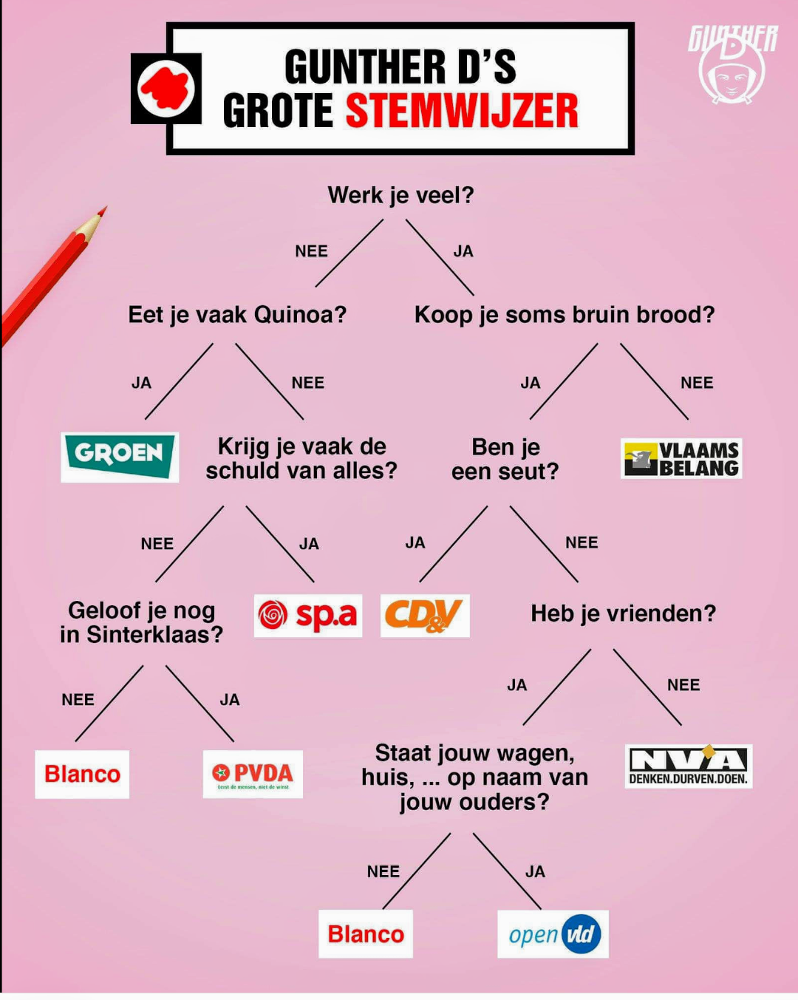
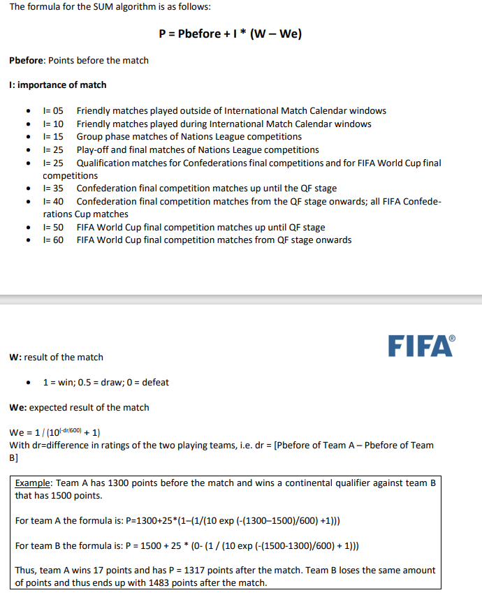

<!--# Hoofdstuk 5-->

:::{.callout-warning}
Oefeningen worden sinds vorig hoofdstuk al eens wat langer. Het is belangrijk dat **eerste de volledige opgave doorneemt** voor je begint te programmeren. Deze gewoonte is essentieel indien je over enkele weken grote 2uur-durende projecten tot een goed einde wenst te brengen.
:::

<!--# Hoofdstuk 5-->


# BMI met if (*Essential*)

# BMI met if (*Essential*)

Pas je BMI-programma uit het vorige hoofdstuk aan zodat je programma feedback geeft aan de gebruiker naargelang het berekende BMI.

De kleur tussen haakjes geeft aan in welke kleur je deze tekst zet:

* Onder de 18,5 (rood): ondergewicht.
* Van 18,5 tot 25, met 25 niet inbegrepen (groen): normaal gewicht. 
* Van 25 tot 30, met 30 niet inbegrepen (donkergeel): overgewicht. Je loopt niet echt een risico, maar je mag niet dikker worden.
* Van 30 tot 40, met 40 niet inbegrepen (rood): Zwaarlijvigheid (obesitas). Verhoogde kans op allerlei aandoeningen zoals diabetes, hartaandoeningen en rugklachten. Je zou 5 tot 10 kg moeten vermageren.
* 40 of meer (magenta): ernstige zwaarlijvigheid. Je moet dringend vermageren want je gezondheid is in gevaar (of je hebt je lengte of gewicht in verkeerde eenheid ingevoerd).


# Schoenverkoper

# Schoenverkoper
a) Maak een oefening die aan de gebruiker vraagt hoeveel paar schoenen hij wenst te kopen. Ieder paar schoenen kost steeds 20 euro. Indien de gebruiker 10 paar of meer koopt kosten de eerste 9 paar nog steeds 20 euro, de overige kosten echter maar 10 euro. Toon aan de gebruiker de totale prijs.

Voorbeeld:  
* 8 schoenen kost 8x20 = 160 euro
* 12 schoenen kost 9x20 + 3x10 = 210 euro

b) Voeg nu toe dat het programma eerst aan de kassier vraagt tot hoeveel schoenen de korting niet geldt. 

Voorbeeld:
* De kassierster voert 6 in. Dan kosten 8 schoenen: 6x20 + 2x10 = 140 euro.

:::{.callout-tip}
Je hebt niet noodzakelijk een if voor deze oefening nodig.  Indien je deze oefening zonder if kunt oplossen, dan krijg je als extra opgave bij:

c) Zorg ervoor dat de kassier enkel een getal van 3 tot en met 10 kan invoeren bij de vraag tot hoeveel schoenen de korting niet geldt. Indien de kassier een getal buiten deze range invoert wordt de gewone korting toegekend, namelijk vanaf 10 of meer schoenen.
:::


# Ohm-berekenaar

# Ohm-berekenaar
Vraag aan de gebruiker wat hij wenst te berekenen: spanning, weerstand of stroomsterkte. Vraag vervolgens de 2 andere waarden (als dus de gebruiker "Spanning" kiest vraag je aan de gebruiker de stroomsterkte en de weerstand) en bereken m.b.v. de wet van Ohm de gewenste waarde tot 2 cijfers na de komma.

Voorbeeld output:

```text
Wat wil je berekenen? spanning, weerstand of stroomsterkte?
stroomsterkte
Geef me dan de spanning:
>34,4
Geef me dan de weerstandswaarde:
>3,4
De stroomsterkte bedraagt dan 10,12 Ampere
```


# BankRekening controle 

# BankRekening controle 
Schrijf een programma om het vroegere nationale bankrekeningnummer te controleren of het al dan niet een geldig nummer is (dus niet het IBAN nummer). 

Het bankrekeningnummer wordt ingelezen als 3 gehele getallen van 3, 7 en 2 die de gebruiker apart invoert en die je in 3 aparte variabelen bewaard.

:::{.callout-tip}
Een bankrekeningnummer is geldig als de rest van de deling van het getal, dat bestaat uit de eerste 10 cijfers, door 97, gelijk is aan het getal bestaande uit de laatste 2 cijfers.

* Dit is een voorbeeld van een geldige rekening: 000 1459325 57 , want 000 1459325 gedeeld door 97 geeft als rest 57.
* Dit een ongeldige: 000 1359325 77, want 1359325 gedeeld door 97 geeft als rest 64 en niet 77
:::


# Orakeltje van Delphi, part deux (*Essential*)

# Orakeltje van Delphi, part deux (*Essential*)
We gaan het Orakeltje verbeteren. Voor het orakel je vertelt hoe lang je te leven hebt zal het eerste vragen of je een vrouw (``v``) of een man (``m``) bent. Dan vraagt ze je leeftijd.
Mannen leven maximum tot hun 120 jaar. Vrouwen echter tot 150 jaar. Laat het orakel een duur voorspellen die kan. Als een vrouw van 50 de vraag stelt dan zal het orakel dus een getal van 5 tot en met 100 (``150-50``) genereren. Een man van 35 zal van 5 tot en met 85 (``120-35``) jaren langer kunnen leven. 


# Casino (*Essential*)

# Casino (*Essential*)
Genereer  een random getal van 1 t.e.m. 6 maar toon dit niet aan de gebruiker. Vraag aan de gebruiker welk getal hij denkt dat de computer heeft "geworpen". Indien de gebruiker juist raadt verschijnt er "proficiat" op het scherm. Anders: "You lose. Ik wierp [getal]".

Voorbeeld:

```text
Welk getal heb ik geworpen?
>3
You lose. Ik wierp 1.
```


# Casino 3

# Casino 3
Vul de voorgaande oefening aan, maar laat de gebruiker 3x na mekaar raden. Enkel als hij juist raadt mag hij nog eens raden. Als hij ook de derde juist raadt wint hij. In alle andere gevallen niet.


Voorbeeld output:

```text
Welk getal heb ik geworpen?
4
Welk getal heb ik nu geworpen?
1
You lose!
```

en

```text
Welk getal heb ik geworpen?
4
Welk getal heb ik nu geworpen?
1
Welk getal heb ik nu geworpen?
5
Proficat!
```


# Schaakstuk 

# Schaakstuk 

Definieer de verschillende schaakstukken in een enum-type (Pion, Loper, Koning, etc.). Maak 2 variabelen aan van dit nieuwe datatype en vraag aan de gebruiker welke waarde elke moet krijgen (bv variabele 1 een pion , variabele 2 een koningin).

Toon aan de gebruiker hoe elke variabele kan bewegen (Pion: "Rechtdoor, 1 of 2 vakjes", Loper: "Schuin", etc.), gebruik hiervoor een ```switch``` (die je 3x zal nodig hebben)

Indien beide variabelen hetzelfde stuk zijn dan toont de applicatie de tekst "Beide zijn hetzelfde." gevolgd door hoe ze kunnen bewegen.

Voorbeeld werking:

```text
Welk stuk is stuk1?
>Toren
Welk stuk is stuk2?
>Koningin

Stuk1 kan enkel horizontaal of verticaal bewegen.
Stuk2 kan in alle richtingen bewegen
```

Ander voorbeeld:

```text
Welk stuk is stuk1?
>Loper_
Welk stuk is stuk2?
>Loper

Beide zijn het zelfde en kunnen enkel schuin bewegen.
```


# Quiz 

# Quiz 
Maak een quiz. Maak gebruik van het ``switch``-statement om de input van de gebruiker (a, b, c of d) te verwerken en bij iedere vraag aan te geven of dit juist of fout is. Voorzie 3 multiple choice vragen. Houd bij hoe vaak de speler juist antwoordde en geef op het einde de eindscore (Juist is +2, fout is -1).

Zoek op hoe je de kleur van de letters en de achtergrond in een console-applicatie kunt aanpassen en pas dit toe op je quiz om deze er iets boeiender uit te laten zien. Toon iedere vraag op een nieuw scherm.


# Schrikkeljaar (*Essential*)

# Schrikkeljaar (*Essential*)
De gebruiker voert een jaartal in en jouw programma toont of het wel of geen schrikkeljaar is. Een schrikkeljaar is deelbaar door 4, behalve als het ook deelbaar is door 100, tenzij het wél deelbaar is door 400.
Bijvoorbeeld: 
* 1997: geen schrikkeljaar
* 1996: wél schrikkeljaar
* 1900: geen schrikkeljaar
* 2000: wél schrikkeljaar

Kan je dit oplossen met 1 if-statement (met gecombineerde logische expressie?)


# Kleurcode weerstand naar ohm

# Kleurcode weerstand naar ohm
Vraag aan de gebruiker om de ringkleuren van de eerste 3 ringen in te voeren als tekst (bv ``groen``). Toon vervolgens de waarde van deze weerstand ([kleuren van de ringen kan je in deze tabel vinden](https://www.digikey.nl/-/media/Images/Marketing/Resources/Calculator/resistor-color-chart.png?la=nl-NL&ts=4db603f5-4e9b-4759-84b7-21a04d18b1a8))
Als dus de gebruiker na elkaar invoert:

```text
rood
paars
rood
```

Dan zal het programma tonen:

``Deze weerstand heeft een waarde van  2700 Ohm``

Waarom? Ring 1 is rood en heeft waarde 2. Ring 2 is paars en heeft waarde 7. Samen dus 27. Ring 3 heeft waarde rood, wat wil zeggen dat de vermenigvuldigingsfactor 100 is.

Los deze oefening op met meerdere  ``switch``statements.


# GuntherD Stemwijzer (*Essential*)

# GuntherD Stemwijzer (*Essential*)
Kan jij volgende ludieke stemwijzer van GuntherD in een eenvoudig programma gieten dat door een reeks j/n vragen aan de gebruiker uiteindelijk zijn "stemprofiel" toont?




# Enum seizoenen (*Essential*)

# Enum seizoenen (*Essential*)
Maak een ``enum`` die de seizoenen van het jaar bevat. Vraag aan de gebruiker om een maandnummer in te voeren. Gebruik vervolgens een switch om te bepalen in welk seizoen deze maand (grotendeels) ligt. Wijs deze enum toe aan een variabele in de switch.
Vervolgens gebruik je een if om, gebaseerd op deze enum-variabele, te tonen of het om een koud seizoen (winter en herfst) of een warm seizoen (zomer en lente) gaat.


# Enum verkeerslicht (*Essential*)

# Enum verkeerslicht (*Essential*)
 
 
Je gaat een programma schrijven dat het gedrag van een verkeerslicht simuleert met behulp van een enum. De gebruiker moet het verkeerslicht (een ``enum`` variabele) een status geven (groen, oranje of rood), en op basis daarvan moet het programma een bericht weergeven over wat een bestuurder moet doen.

Gebruik een ``switch``-statement om het gedrag van de bestuurder te bepalen op basis van de invoer.

* Als het licht groen is: Toon het bericht "Je mag doorrijden."
* Als het licht oranje is: Toon het bericht "Maak je klaar om te stoppen."
* Als het licht rood is: Toon het bericht "Stop! Wacht tot het licht groen wordt."


Voorbeeld werking:

```text
Voer de status van het verkeerslicht in (Groen, Oranje, Rood):
>Groen
Je mag doorrijden.
```

*(bron oefening: gemaakt samen met ChatGpt)*


# Enum bij BMI

# Enum bij BMI

Maak een enum die de verschillende soorten gewichten voorstelt (Obees, Zwaarlijvig, NormaalGewicht, etc.) Pas de bestaande "BMI met if" oefening aan zodat je deze enum gebruikt om je code leesbaarder te maken. 


# Schaak-Elo met if en Random 

# Schaak-Elo met if en Random 

In plaats van de 3 mogelijke scenarios (win,loss, draw) vraag je nu aan de gebruiker wie van beide spelers heeft gewonnen ("A", "B" of "D" van Draw/gelijk) en toont enkel de nieuwe ratings gebaseerd op de ingevoerde uitslag.

Pas je applicatie ook aan als volgt: indien de gebruiker een negatieve rating voor een van de beide spelers opgeeft dan gebeuren er 2 zaken:

1. Er verschijnt een foutboodschap ("Negatieve rating mag niet. Ik genereer een random rating.")
2. Je genereert een random rating tussen 500 en 3000, toont dit getal aan de gebruiker, en gebruikt dit vervolgens verder in de applicatie.


#  Fifa ranking berekenen (PRO)

#  Fifa ranking berekenen (PRO)

FIFA berekent de score per nationaal voetbal team met een eigen formule [bron](https://digitalhub.fifa.com/m/f99da4f73212220/original/edbm045h0udbwkqew35a-pdf.pdf) waarvan de belangrijkste informatie hier samengevat wordt:



Schrijf een applicatie die de nieuwe **P** berekent nadat de gebruiker alle nodige informatie heeft ingevoert. Bij de invoer van I krijgt de gebruiker een keuze menu te zien dat de verschillende zinnetjes toont zonder de I-waarde. De gebruiker kiest uit het menu de juiste importance (bijvoorbeeld door a, b, c, etc. in te voeren) en jouw programma zet dit dan om naar een getal. De gebruiker moet voor W invoeren: gewonnen, verloren, gelijk. Jouw programma zal dit omzetten naar het juiste getal (1, 0.5 of 0).


# Oscars: The Academy kiest (*Final Essential*)

# Oscars: The Academy kiest (*Final Essential*)

Tijd om al je kennis samen te brengen voor het grootste filmevenement van het jaar! Schrijf een programma dat bepaalt of een film in aanmerking komt voor een Oscar-nominatie. Deze oefening bundelt ``enum``, ``switch``, ``if``, ``Random`` en user input.

**De regels:**

1.  Maak een ``enum`` **Genre** met minstens 4 genres (bv. Drama, ScienceFiction, Horror, Comedy).
2.  Vraag de gebruiker om een genre te kiezen (toon de opties).
3.  Vraag de gebruiker om de **stars-rating** van de regisseur (1 t.e.m. 5).
4.  Genereer een willekeurige **publieksscore** op 100.

**De berekening:**

De **totaalscore** van de film wordt als volgt berekend:
*   Start met de willekeurige **publieksscore**.
*   Doe hier de **stars-rating** maal 10 bij.
*   Gebruik een ``switch`` om punten aan te passen op basis van het genre:
    *   **Drama**: +20 punten (De Academy is dol op tranentrekkers).
    *   **Comedy**: -10 punten (Grappige films winnen zelden).
    *   **ScienceFiction**: +5 punten.
    *   **Horror**: -20 punten.
*   **Speciale regel** (gebruik een ``if``): Als de regisseur 5 sterren heeft, krijgt, *bovenop de andere punten*, de film nog eens +20 punten extra "prestige-bonus".

**De uitslag:**

*   Totaalscore >= 150: **"BEST PICTURE WINNAAR!"**
*   Totaalscore tussen 120 en 150: **"Genomineerd voor Best Picture"**
*   Totaalscore < 120: **"Helaas, volgende keer beter"**

**Voorbeeld output:**

```text
Selecteer genre (Drama, ScienceFiction, Horror, Comedy):
> Horror
Geef rating regisseur (1-5):
> 5
Publieksscore (random): 84

Berekening:
Start: 84
Regisseur bonus: 5 * 10 = +50
Genre (Horror): -20
Prestige bonus (5 sterren): +20
Totaal: 134

Resultaat: Genomineerd voor Best Picture
```


::::{.callout-caution collapse="true" title="Oplossing"}


# Code


## BMI met if

:::{.callout-important}
**Les(sen) uit deze oefening:** Het was al even geleden, maar het werd ook nog eens tijd om te oefenen hoe je de kleur van je tekst kunt veranderen. 

**Belangrijk**: merk op dat we enkel steeds de *bovengrens* testen in de ``if``. Dit verkleint de kans op fouten. Zie je bijvoorbeeld de bug in deze code?

```java
if(bmi < 18.5)
{
    Console.ForegroundColor = ConsoleColor.Red;
    Console.WriteLine("Ondergewicht");
}
else if(bmi > 18.5 && bmi < 25)
{
    Console.ForegroundColor = ConsoleColor.Green;
    Console.WriteLine("Normaal gewicht");
}
```

Inderdaad: ``bmi > 18.5`` moest ``bmi >= 18.5`` want bovenstaande code zou dan nooit "Normaal gewicht" tonen indien de gebruiker exact 18.5 als BMI heeft. Daarom dat we dus de ondergrens niet testen: aangezien we niet in de vorige if gingen weten we automatisch dat bmi dan wél groter is dan de waarde die we testen.

Op het einde eindigen we niét met else ``if(bmi>=40)`` maar met een ``else``, daar we al weten dat bmi groter of gelijk is aan 40 als hij niet in de vorige ``if`` ging.

:::

Voeg volgende code toe aan het bestaande BMI programma:
```java
if(bmi < 18.5)
{
    Console.ForegroundColor = ConsoleColor.Red;
    Console.WriteLine("Ondergewicht");
}
else if(bmi < 25)
{
    Console.ForegroundColor = ConsoleColor.Green;
    Console.WriteLine("Normaal gewicht");
}
else if (bmi < 30)
{
    Console.ForegroundColor = ConsoleColor.DarkYellow;
    Console.WriteLine("Overgewicht");
}
else if (bmi < 40)
{
    Console.ForegroundColor = ConsoleColor.Red;
    Console.WriteLine("Zwaarlijvigheid");
}
else
{
    Console.ForegroundColor = ConsoleColor.Magenta;
    Console.WriteLine("Ernstige zwaarlijvigheid");
}
```


## Schoenverkoper

### a

```java
Console.WriteLine("Hoeveel schoenen koopt de klant?");
int aantal = Convert.ToInt32(Console.ReadLine());
int kortingBoven = 9;
int prijs = 0;
if (aantal <= kortingBoven)
{
    prijs = aantal * 20;
}
else
{
    prijs = kortingBoven * 20;
    prijs += (aantal - kortingBoven) * 10;
}
Console.WriteLine($"Prijs is {prijs}");
```

### b
```java
Console.WriteLine("Hoeveel schoenen koopt de klant?");
int aantal = Convert.ToInt32(Console.ReadLine());
Console.WriteLine("Boven hoeveel schoenen wordt de korting gegeven?");
int kortingBoven = Convert.ToInt32(Console.ReadLine());
int prijs = 0;
if (aantal <= kortingBoven)
{
    prijs = aantal * 20;
}
else
{
    prijs = kortingBoven * 20;
    prijs += (aantal - kortingBoven) * 10;
}
Console.WriteLine($"Prijs is {prijs}");
```


## Ohm-berekenaar


```java
double spanning, stroom, weerstand;
Console.WriteLine("Wat wil je berekenen? spanning, weerstand of stroomsterkte?");

string userchoice = Console.ReadLine();
if(userchoice=="spanning")
{
    Console.WriteLine("Geef me dan de weerstandswaarde:");
    weerstand = double.Parse(Console.ReadLine());
    Console.WriteLine("Geef me dan de stroomsterkte:");
    stroom = double.Parse(Console.ReadLine());
    Console.WriteLine($"De spanning bedraagt dan {Math.Round(stroom*weerstand,2)} volt");
}
else if (userchoice == "weerstand")
{
    Console.WriteLine("Geef me dan de spanning:");
    spanning = double.Parse(Console.ReadLine());
    Console.WriteLine("Geef me dan de stroomsterkte:");
    stroom = double.Parse(Console.ReadLine());
    Console.WriteLine($"De weerstand bedraagt dan {Math.Round(spanning /stroom,2)} Ohm");
}
else if (userchoice == "stroomsterkte")
{
    Console.WriteLine("Geef me dan de spanning:");
    spanning = double.Parse(Console.ReadLine());
    Console.WriteLine("Geef me dan de weerstandswaarde:");
    weerstand = double.Parse(Console.ReadLine());
    Console.WriteLine($"De stroomsterkte bedraagt dan {Math.Round(spanning / weerstand,2)} Ampére");
}
else
{
    Console.WriteLine("Verkeerde keuze. Byebye");
}
```

## Bankrekening controle

```java
//voorbeeldrekenignummer 000 1459325 57
Console.WriteLine("Geef eerste 3 cijfers");
long deel1= long.Parse(Console.ReadLine());
Console.WriteLine("Geef de volgende 7 cijfers");
long deel2= long.Parse(Console.ReadLine());
Console.WriteLine("Geef de laatse 2 cijfers");
int checksum= int.Parse(Console.ReadLine());

int controle=(int)((deel1*Math.Pow(10,7) + deel2)%97);
if(controle == checksum)
{
    Console.WriteLine("Geldige rekening");
}
else
{
    Console.WriteLine("Niet geldige rekening");
}
```


## Orakeltje van Delphi, part deux

```java
Random delphi= new Random();

Console.WriteLine("Ben je man of vrouw (m/v)?");
string geslacht = Console.ReadLine();
Console.WriteLine("Hoe oud ben je nu?");
int leeftijd = int.Parse(Console.ReadLine());

const int VROUWMAX = 151;
const int MANMAX = 121;
int max = 0;
if(geslacht=="m")
{
    max = MANMAX - leeftijd;
}
else
{
    max = VROUWMAX- leeftijd;
}
Console.WriteLine($"Je zal nog {delphi.Next(5,max)} jaar leven");
```

## Casino

```java
 Random rng = new Random();
 int geworpen = rng.Next(1, 7);
 Console.WriteLine("Welk getal heb ik geworpen?");
 int invoer = int.Parse(Console.ReadLine());

 if(invoer== geworpen)
 {
     Console.WriteLine("Proficiat!");
 }
 else
 {
     Console.WriteLine($"You lose. Ik wierp {geworpen}.");
 }
```


## Casino 3

```java
Random rng = new Random();
int geworpen = rng.Next(1, 7);
Console.WriteLine("Welk getal heb ik geworpen?");
int invoer = int.Parse(Console.ReadLine());

if (invoer == geworpen)
{
    geworpen = rng.Next(1, 7);
        Console.WriteLine("Welk getal heb ik nu geworpen?");
    invoer = int.Parse(Console.ReadLine());
    if (invoer == geworpen)
    {
        geworpen = rng.Next(1, 7);
        Console.WriteLine("Welk getal heb ik nu geworpen?");
        invoer = int.Parse(Console.ReadLine());
        if (invoer == geworpen)
        {
            Console.WriteLine("Proficat!");
        }
        else
        {
            Console.WriteLine($"You lose.");
        }

    }
    else
    {
        Console.WriteLine($"You lose.");
    }
}
else
{
    Console.WriteLine($"You lose.");
}
```

## Schaakstuk

Enum-definitie:

```java
enum Schaakstuk
{
    Pion,
    Toren,
    Loper,
    Paard,
    Koningin,
    Koning
}
```

```java
Console.WriteLine("Welk stuk is stuk1? (Pion, Toren, Loper, Paard, Koningin, Koning)");
Schaakstuk stuk1 = Enum.Parse<Schaakstuk>(Console.ReadLine());

Console.WriteLine("Welk stuk is stuk2? (Pion, Toren, Loper, Paard, Koningin, Koning)");
Schaakstuk stuk2 = Enum.Parse<Schaakstuk>(Console.ReadLine());

// Controleer of beide stukken hetzelfde zijn
if (stuk1 == stuk2)
{
    Console.WriteLine("Beide zijn hetzelfde.");
    switch (stuk1)
    {
        case Schaakstuk.Pion:
            Console.WriteLine("Een pion kan rechtdoor bewegen, 1 of 2 vakjes.");
        break;
        case Schaakstuk.Toren:
            Console.WriteLine("Een toren kan enkel horizontaal of verticaal bewegen.");
            break;
        case Schaakstuk.Loper:
            Console.WriteLine("Een loper kan enkel schuin bewegen.");
            break;
        case Schaakstuk.Paard:
            Console.WriteLine("Een paard beweegt in een 'L'-vorm.");
            break;
        case Schaakstuk.Koningin:
            Console.WriteLine("Een koningin kan in alle richtingen bewegen.");
            break;
        case Schaakstuk.Koning:
            Console.WriteLine("Een koning kan één vakje in elke richting bewegen.");
            break;
        default:
            Console.WriteLine("Onbekend schaakstuk.");
            break;
    }

}
else
{
    // Toon beweging voor stuk 1
    Console.WriteLine("Stuk1:");
    switch (stuk1)
    {
        case Schaakstuk.Pion:
            Console.WriteLine("Een pion kan rechtdoor bewegen, 1 of 2 vakjes.");
        break;
        case Schaakstuk.Toren:
            Console.WriteLine("Een toren kan enkel horizontaal of verticaal bewegen.");
            break;
        case Schaakstuk.Loper:
            Console.WriteLine("Een loper kan enkel schuin bewegen.");
            break;
        case Schaakstuk.Paard:
            Console.WriteLine("Een paard beweegt in een 'L'-vorm.");
            break;
        case Schaakstuk.Koningin:
            Console.WriteLine("Een koningin kan in alle richtingen bewegen.");
            break;
        case Schaakstuk.Koning:
            Console.WriteLine("Een koning kan één vakje in elke richting bewegen.");
            break;
        default:
            Console.WriteLine("Onbekend schaakstuk.");
            break;
    }

    // Toon beweging voor stuk 2
    Console.WriteLine("Stuk2:");
    switch (stuk2)
    {
        case Schaakstuk.Pion:
            Console.WriteLine("Een pion kan rechtdoor bewegen, 1 of 2 vakjes.");
        break;
        case Schaakstuk.Toren:
            Console.WriteLine("Een toren kan enkel horizontaal of verticaal bewegen.");
            break;
        case Schaakstuk.Loper:
            Console.WriteLine("Een loper kan enkel schuin bewegen.");
            break;
        case Schaakstuk.Paard:
            Console.WriteLine("Een paard beweegt in een 'L'-vorm.");
            break;
        case Schaakstuk.Koningin:
            Console.WriteLine("Een koningin kan in alle richtingen bewegen.");
            break;
        case Schaakstuk.Koning:
            Console.WriteLine("Een koning kan één vakje in elke richting bewegen.");
            break;
        default:
            Console.WriteLine("Onbekend schaakstuk.");
            break;
    }
}

```

De snelle manier:

```java
enum Kleur {Wit, Zwart};
enum Schaakstukken {Pion, Toren, Loper, Paard, Koning, Koningin}
public static void Main()
{
    Random rng=new Random();
    
    Console.WriteLine($"{(Kleur)rng.Next(0,2)} {(Schaakstukken)rng.Next(0,6)}");
    Console.WriteLine($"{(Kleur)rng.Next(0,2)} {(Schaakstukken)rng.Next(0,6)}");
    Console.WriteLine($"{(Kleur)rng.Next(0,2)} {(Schaakstukken)rng.Next(0,6)}");
}
```

## Quiz

```java
int juist = 0;
int fout = 0;
string keuze;

Console.WriteLine("Wie is de auteur van Zie Scherp Scherper?");
Console.WriteLine("a.Jeff Bezos\nb.Tim Dams\nc.Bill Gates\nd.Steve Jobs");
keuze = Console.ReadLine();
switch(keuze)
{
    case "a":
    case "c":
    case "d":
        fout++;
        Console.WriteLine("Fout!");
        break;
    case "b":
        juist++;
        Console.WriteLine("Juist!");
        break;
}

Console.WriteLine("Druk enter om naar volgende vraag te gaan.");
Console.ReadLine();
Console.Clear();

Console.WriteLine("Wie is de koning van Belgie?");
Console.WriteLine("a.Filip\nb.Tim Dams\nc.Albert\nd.De Croo");
keuze = Console.ReadLine();
switch (keuze)
{
    case "b":
    case "c":
    case "d":
        fout++;
        Console.WriteLine("Fout!");
        break;
    case "a":
        juist++;
        Console.WriteLine("Juist!");
        break;
}
Console.WriteLine("Druk enter om naar volgende vraag te gaan.");
Console.ReadLine();
Console.Clear();
Console.WriteLine("Sinds wanneer is Belgie onafhankelijk?");
Console.WriteLine("a.1830\nb.1831\nc.1832\nd.Het is nog steeds niet onafhankelijk.");
keuze = Console.ReadLine();
switch (keuze)
{
    case "a":
    case "c":
    case "d":
        fout++;
        Console.WriteLine("Fout!");
        break;
    case "b":
        juist++;
        Console.WriteLine("Juist!");
        break;
}

Console.WriteLine("Druk enter om naar je finale score te gaan.");
Console.ReadLine();
Console.Clear();

int eindscore = juist * 2 - fout;

Console.WriteLine($"Je eindscore bedraagt:{eindscore}");
```

## Schrikkeljaar

```java
Console.WriteLine("Geef jaartal?");
int jaartal = int.Parse(Console.ReadLine());
if(jaartal%4 ==0 && (jaartal%100 !=0 || jaartal%400==0))
{
    Console.WriteLine("Dat is een schrikkeljaar");
}
else
    Console.WriteLine("Dat is geen schrikkeljaar");
```


## Kleurcode weerstand naar Ohm


```java
Console.WriteLine("Geef de 3 ringkleuren na elkaar, telkens met een enter:");
string ring1 = Console.ReadLine();
string ring2 = Console.ReadLine();
string ring3 = Console.ReadLine();
double resultaat = 0;
switch (ring1)
{
    case "zwart": resultaat = 0; break;
    case "bruin": resultaat = 10; break;
    case "rood": resultaat = 20; break;
    case "oranje": resultaat = 30; break;
    case "geel": resultaat = 40; break;
    case "groen": resultaat = 50; break;
    case "blauw": resultaat = 60; break;
    case "paars": resultaat = 70; break;
    case "grijs": resultaat = 80; break;
    case "wit": resultaat = 90; break;
}
switch (ring2)
{
    case "zwart": resultaat += 0; break;
    case "bruin": resultaat += 1; break;
    case "rood": resultaat += 2; break;
    case "oranje": resultaat += 3; break;
    case "geel": resultaat += 4; break;
    case "groen": resultaat += 5; break;
    case "blauw": resultaat += 6; break;
    case "paars": resultaat += 7; break;
    case "grijs": resultaat += 8; break;
    case "wit": resultaat += 9; break;
}
switch (ring3)
{
    case "zwart": break;
    case "bruin": resultaat *= 10; break;
    case "rood": resultaat *= Math.Pow(10,2); break;
    case "oranje": resultaat *= Math.Pow(10, 3); break;
    case "geel": resultaat *= Math.Pow(10, 4); break;
    case "groen": resultaat *= Math.Pow(10, 5); break;
    case "blauw": resultaat *= Math.Pow(10, 6); break;
    case "paars": resultaat *= Math.Pow(10, 7); break;
    case "grijs": resultaat *= Math.Pow(10, 8); break;
    case "wit": resultaat *= Math.Pow(10, 9); break;
}
Console.WriteLine($"Deze weerstand heeft een waarde van {resultaat} Ohm");
```

## GuntherD Stemwijzer

```java
enum Partijen { Groen, VlaamsBelang, Spa, CDenV, Blanco, PVDA, NVA, OpenVld, Onbekend };
static void Main(string[] args)
{

    Partijen stemProfiel = Partijen.Onbekend;
    Console.WriteLine("Werk je veel (j/n)?");
    string werkVraag = Console.ReadLine();

    if (werkVraag == "nee")
    {
        Console.WriteLine("Eet je vaak quinoa (j/n)?");
        string eetVraag = Console.ReadLine();
        if (eetVraag == "nee")
        {
            Console.WriteLine("Krijg je vaak de schuld van alles (j/n)?");
            string schuldVraag = Console.ReadLine();
            if (eetVraag == "nee")
            {
                Console.WriteLine("Geloof je nog in Sinterklaar (j/n)?");
                string sintVraag = Console.ReadLine();
                if (sintVraag == "nee")
                {
                    stemProfiel = Partijen.Blanco;

                }
                else
                {
                    stemProfiel = Partijen.PVDA;
                }
            }
            else
            {
                stemProfiel = Partijen.Spa;
            }
        }
        else
        {
            stemProfiel = Partijen.Groen;
        }
    }
    else
    {
        Console.WriteLine("Koop je soms bruin brood (j/n)?");
        string broodVraag = Console.ReadLine();
        if (broodVraag == "nee")
        {
            stemProfiel = Partijen.VlaamsBelang;
        }
        else
        {
            Console.WriteLine("Ben je een seut (j/n)?");
            string seutVraag = Console.ReadLine();
            if (seutVraag == "nee")
            {
                Console.WriteLine("Heb je vrienden (j/n)?");
                string vriendVraag = Console.ReadLine();
                if (vriendVraag == "nee")
                {
                    stemProfiel = Partijen.NVA;
                }
                else
                {
                    Console.WriteLine("Staat jouw wagen, huis,...op naam van je ouders? (j/n)?");
                    string oudersVraag = Console.ReadLine();
                    if (oudersVraag == "nee")
                    {
                        stemProfiel = Partijen.Blanco;
                    }
                    else
                    {
                        stemProfiel = Partijen.OpenVld;
                    }
                }
            }
            else
            {
                stemProfiel = Partijen.CDenV;
            }
        }
    }
    Console.WriteLine($"Je stemt best op {stemProfiel}");
}
```

## Enum seizoenen

```java
enum Seizoenen { Winter, Lente, Zomer, Herfst, Onbekend}     
```

```java
Console.WriteLine("Geef een maandnummer (1 tot 12)");
int maand = Convert.ToInt32(Console.ReadLine());
Seizoenen huidigSeizoen = Seizoenen.Onbekend;
switch(maand)
{
    case 1:
    case 2:
    case 3:
        huidigSeizoen = Seizoenen.Winter;
        break;
    case 4:
    case 5:
    case 6:
        huidigSeizoen = Seizoenen.Lente;
        break;
    case 7:
    case 8:
    case 9:
        huidigSeizoen = Seizoenen.Zomer;
        break;
    case 10:
    case 11:
    case 12:
        huidigSeizoen = Seizoenen.Herfst;
        break;
    default:
        huidigSeizoen = Seizoenen.Onbekend;
        break;

}

if(huidigSeizoen== Seizoenen.Winter || huidigSeizoen== Seizoenen.Herfst)
    Console.WriteLine("Dat is een koud seizoen!");
else if(huidigSeizoen == Seizoenen.Zomer || huidigSeizoen == Seizoenen.Lente)
    Console.WriteLine( "Dat is een warm seizoen!");
else //Seizoen.Onbekend
    Console.WriteLine("Dat is geen seizoen!");

```


## Enum verkeerslichten

```java
Console.WriteLine("Voer de status van het verkeerslicht in (Groen, Oranje, Rood):");
Verkeerslicht licht=  Enum.Parse<Verkeerslicht>(Console.ReadLine());

switch (licht)
{
    case Verkeerslicht.Groen:
        Console.WriteLine("Je mag doorrijden.");
        break;
    case Verkeerslicht.Oranje:
        Console.WriteLine("Maak je klaar om te stoppen.");
        break;
    case Verkeerslicht.Rood:
        Console.WriteLine("Stop! Wacht tot het licht groen wordt.");
        break;
}
```

## Schaak-elo met if

Merci Mats Heirman!

```java
const int K = 10;
Random rng = new Random();
Console.WriteLine("Rating speler A?");
double ra = double.Parse(Console.ReadLine());
if (ra < 0)
{
    Console.BackgroundColor = ConsoleColor.Red;
    ra = rng.Next(500, 3001);
    Console.WriteLine($"Negatieve rating mag niet. Ik pas deze aan naar random getal, namelijk {ra}.");
    Console.ResetColor();
}
Console.WriteLine("Rating speler B?");
double rb = double.Parse(Console.ReadLine());
if (rb < 0)
{
    Console.BackgroundColor = ConsoleColor.Red;
    rb = rng.Next(500, 3001);
    Console.WriteLine($"Negatieve rating mag niet. Ik pas deze aan naar random getal, namelijk {rb}.");
    Console.ResetColor();
}


double ea = 1 / (1 + Math.Pow(10, (rb - ra) / 400.0));
double eb = 1 / (1 + Math.Pow(10, (ra - rb) / 400.0));

Console.WriteLine("Wie is er gewonnen? A, B of D  (draw)");
string whowon = Console.ReadLine();
double puntA = 0;
double puntB = 0;
if (whowon == "A")
{
    puntA = 1;
}
else if (whowon == "B")
{
    puntB = 1;
}
else if (whowon == "D")
{
    puntA = 0.5;
    puntB = 0.5;
}
else
{
    puntA = 1;
    Console.WriteLine("Onbekende waarde. Ik laat A winnen.");
}


double ranew = ra + K * (puntA - ea);
double rbnew = rb + K * (puntB - eb);

Console.WriteLine($"Nieuwe rating van A:{Math.Round(ranew, 0)}");
Console.WriteLine($"Nieuwe rating van B:{Math.Round(rbnew, 0)}");
```
::::
