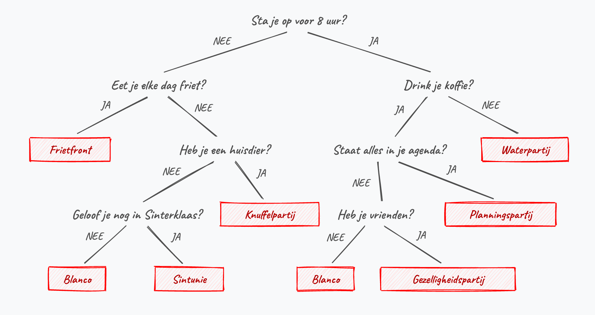

<!--# Hoofdstuk 5-->

::: {.vooraf}
- [Let op]{.let-op} De oefeningen worden langer. Lees daarom eerst de **volledige** opgave voor je begint te programmeren. Die gewoonte heb je nodig voor de grote projecten van twee uur die later dit jaar komen.
- In de voorbeelduitvoer begint gebruikersinvoer met ``>``. Tenzij de opgave iets anders zegt, mag je ervan uitgaan dat de gebruiker een geldig getal typt.
- Tekst vergelijken met ``==`` of in een ``switch`` is hoofdlettergevoelig: ``"Ja"`` is niet hetzelfde als ``"ja"``. Typ keuzes dus exact zoals ze in de opgave staan.
:::

<!--# Hoofdstuk 5-->


# Casino (*Essential*) {#h05-casino}
Genereer een random getal van 1 tot en met 6, maar toon het niet aan de gebruiker. Vraag de gebruiker welk getal de computer volgens hem "geworpen" heeft. Raadt hij juist, dan verschijnt er "Proficiat!" op het scherm. Anders: "You lose. Ik wierp [getal]."

Voorbeeld:

```text
Welk getal heb ik geworpen?
>3
You lose. Ik wierp 1.
```

::::{.callout-caution collapse="true" title="Oplossing"}
```java
Random rng = new Random();
int geworpen = rng.Next(1, 7);
Console.WriteLine("Welk getal heb ik geworpen?");
int invoer = int.Parse(Console.ReadLine());

if (invoer == geworpen)
{
    Console.WriteLine("Proficiat!");
}
else
{
    Console.WriteLine($"You lose. Ik wierp {geworpen}.");
}
```
::::

[]{#h05-casino-3}**Deel 2.** Laat de gebruiker nu drie keer na elkaar raden, telkens naar een nieuwe worp. Enkel wie juist raadt, mag nog eens raden. Raadt hij ook de derde keer juist, dan wint hij. Bij een fout antwoord stopt het spel meteen.

```text
Welk getal heb ik geworpen?
>4
Welk getal heb ik nu geworpen?
>1
You lose. Ik wierp 6.
```

```text
Welk getal heb ik geworpen?
>4
Welk getal heb ik nu geworpen?
>1
Welk getal heb ik nu geworpen?
>5
Proficiat!
```

:::{.callout-tip}
De kans om drie keer juist te raden is 1 op 216. Wie gewoon speelt, test het winnende pad dus bijna nooit. Zet een breakpoint op de lijn met ``ReadLine`` en kijk in *Locals* wat er in ``geworpen`` zit voor je je gok intypt.
:::

::::{.callout-caution collapse="true" title="Oplossing"}
Lussen ken je nog niet, dus zit elke volgende beurt in de ``if`` van de vorige:

```java
Random rng = new Random();
int geworpen = rng.Next(1, 7);
Console.WriteLine("Welk getal heb ik geworpen?");
int invoer = int.Parse(Console.ReadLine());

if (invoer == geworpen)
{
    geworpen = rng.Next(1, 7);
    Console.WriteLine("Welk getal heb ik nu geworpen?");
    invoer = int.Parse(Console.ReadLine());
    if (invoer == geworpen)
    {
        geworpen = rng.Next(1, 7);
        Console.WriteLine("Welk getal heb ik nu geworpen?");
        invoer = int.Parse(Console.ReadLine());
        if (invoer == geworpen)
        {
            Console.WriteLine("Proficiat!");
        }
        else
        {
            Console.WriteLine($"You lose. Ik wierp {geworpen}.");
        }
    }
    else
    {
        Console.WriteLine($"You lose. Ik wierp {geworpen}.");
    }
}
else
{
    Console.WriteLine($"You lose. Ik wierp {geworpen}.");
}
```

Drie keer dezelfde verliestekst en drie niveaus diep: het werkt, maar het leest niet makkelijk. Met een ``bool`` die onthoudt of de speler nog meedoet, staat alles op één niveau:

```java
Random rng = new Random();
int geworpen = rng.Next(1, 7);
Console.WriteLine("Welk getal heb ik geworpen?");
int invoer = int.Parse(Console.ReadLine());
bool nogInHetSpel = invoer == geworpen;

if (nogInHetSpel)
{
    geworpen = rng.Next(1, 7);
    Console.WriteLine("Welk getal heb ik nu geworpen?");
    invoer = int.Parse(Console.ReadLine());
    nogInHetSpel = invoer == geworpen;
}

if (nogInHetSpel)
{
    geworpen = rng.Next(1, 7);
    Console.WriteLine("Welk getal heb ik nu geworpen?");
    invoer = int.Parse(Console.ReadLine());
    nogInHetSpel = invoer == geworpen;
}

if (nogInHetSpel)
{
    Console.WriteLine("Proficiat!");
}
else
{
    Console.WriteLine($"You lose. Ik wierp {geworpen}.");
}
```

``invoer == geworpen`` is een booleaanse expressie, en het resultaat daarvan kan je gewoon in een ``bool`` bewaren. Wie fout raadt, krijgt ``false`` en slaat de volgende blokken over. ``geworpen`` bevat op het einde de laatste worp, dus de verliestekst klopt ook.
::::


# Orakeltje van Delphi, part deux (*Essential*) {#h05-orakeltje-van-delphi-part-deux}
Het Orakeltje uit het vorige hoofdstuk wordt slimmer. Voor het je vertelt hoe lang je nog te leven hebt, vraagt het of je een man (``m``) of een vrouw (``v``) bent, en hoe oud je bent. Mannen worden hoogstens 120 jaar, vrouwen 150. Het orakel voorspelt nog altijd minstens 5 jaar, en nooit meer dan wat nog kan: een vrouw van 50 krijgt een getal van 5 tot en met 100 (``150 - 50``), een man van 35 een getal van 5 tot en met 85 (``120 - 35``).

{.illustratie fig-alt="Potloodtekening: de robot als Grieks orakel met een kristallen bol, het stokmannetje wacht geknield op zijn voorspelling."}

Twee gevallen vragen extra aandacht:

* Blijven er geen 5 jaar meer over (een man van 118 heeft er hoogstens nog 2), dan zegt het orakel: "Het orakel zwijgt en kijkt je medelijdend aan."
* Typt de gebruiker iets anders dan ``m`` of ``v``, dan zegt het: "Het orakel begrijpt je antwoord niet."

```text
Ben je een man of een vrouw (m/v)?
>v
Hoe oud ben je?
>50
Je zal nog 37 jaar leven.
```

```text
Ben je een man of een vrouw (m/v)?
>m
Hoe oud ben je?
>118
Het orakel zwijgt en kijkt je medelijdend aan.
```

Test zeker een man van 115 en een man van 116. Bij 115 kan er nog precies één getal uitkomen.

::::{.callout-caution collapse="true" title="Les(sen) uit deze oefening"}
* De bovengrens van ``Next`` telt niet mee. Wil je tot en met ``resterend`` kunnen gaan, dan geef je ``resterend + 1`` mee.
* ``Next`` crasht als de bovengrens kleiner is dan de ondergrens. Zonder de test op ``resterend`` geeft een man van 117 ``Next(5, 4)``, en dat is een ``ArgumentOutOfRangeException``. Precies op zo'n grens gaat een programma met beslissingen het vaakst mis.
* ``M`` met een hoofdletter is geen ``m``. Het orakel begrijpt die gebruiker dus niet.
::::

::::{.callout-caution collapse="true" title="Oplossing"}

```java
const int MAX_LEEFTIJD_MAN = 120;
const int MAX_LEEFTIJD_VROUW = 150;
const int MIN_VOORSPELLING = 5;
Random delphi = new Random();

Console.WriteLine("Ben je een man of een vrouw (m/v)?");
string geslacht = Console.ReadLine();
Console.WriteLine("Hoe oud ben je?");
int leeftijd = int.Parse(Console.ReadLine());

if (geslacht != "m" && geslacht != "v")
{
    Console.WriteLine("Het orakel begrijpt je antwoord niet.");
}
else
{
    int maxLeeftijd = MAX_LEEFTIJD_VROUW;
    if (geslacht == "m")
    {
        maxLeeftijd = MAX_LEEFTIJD_MAN;
    }

    int resterend = maxLeeftijd - leeftijd;
    if (resterend < MIN_VOORSPELLING)
    {
        Console.WriteLine("Het orakel zwijgt en kijkt je medelijdend aan.");
    }
    else
    {
        Console.WriteLine($"Je zal nog {delphi.Next(MIN_VOORSPELLING, resterend + 1)} jaar leven.");
    }
}
```

Merk op dat de eerste test ``&&`` gebruikt en niet ``||``: het antwoord is fout als het geen ``m`` is én ook geen ``v``. Met ``||`` zou elk antwoord fout zijn, want niets is tegelijk ``m`` en ``v``.
::::


# BMI met if (*Essential*) {#h05-bmi-met-if}

Pas je programma BMI berekenaar uit het vorige hoofdstuk aan: toon na de BMI ook in welke categorie de gebruiker valt, in de juiste kleur.

| BMI | Tekst | Kleur |
|---|---|---|
| onder 18,5 | ``Ondergewicht`` | rood |
| van 18,5 tot 25, 25 niet inbegrepen | ``Normaal gewicht`` | groen |
| van 25 tot 30, 30 niet inbegrepen | ``Overgewicht`` | donkergeel |
| van 30 tot 40, 40 niet inbegrepen | ``Zwaarlijvigheid`` | rood |
| 40 of meer | ``Ernstige zwaarlijvigheid`` | magenta |

Zet daarna de kleur terug naar normaal.

::: {.console .kleur}
```{=html}
<pre><code>Wat is uw lengte in cm?
&gt;180
Wat is uw gewicht in kg?
&gt;75
Een persoon met een lengte van 1,8 m en een gewicht van 75 kg heeft een BMI van 23,15.
<span class="k-groen">Normaal gewicht</span></code></pre>
```
:::

Test daarna de grenzen: een BMI van exact 18,5, 25, 30 en 40 moet in de hogere categorie vallen. Handig: met een lengte van 100 cm is je BMI gelijk aan je gewicht.

::::{.callout-caution collapse="true" title="Les(sen) uit deze oefening"}

**Merk op dat we telkens enkel de *bovengrens* testen.** Dat verkleint de kans op fouten. Zie je de bug in deze code?

```java
if (bmi < 18.5)
{
    Console.ForegroundColor = ConsoleColor.Red;
    Console.WriteLine("Ondergewicht");
}
else if (bmi > 18.5 && bmi < 25)
{
    Console.ForegroundColor = ConsoleColor.Green;
    Console.WriteLine("Normaal gewicht");
}
```

Wie een BMI van exact 18,5 heeft, valt door beide tests: ``bmi < 18.5`` is ``false`` en ``bmi > 18.5`` ook. Er moest ``>=`` staan. Maar die ondergrens hoef je gewoon niet te testen: kom je bij de ``else if``, dan weet je al dat ``bmi`` niet kleiner is dan 18,5.

Om dezelfde reden eindig je niet met ``else if (bmi >= 40)`` maar met een gewone ``else``.

Nog een grensgeval: typ 180 cm en 80,99 kg. Het programma toont ``BMI van 25`` en toch ``Normaal gewicht``. De echte BMI is 24,9969..., en ``Math.Round`` rondt dat enkel af voor het scherm. De ``if`` test de echte waarde.
::::

::::{.callout-caution collapse="true" title="Oplossing"}

Voeg onderaan je BMI-programma toe:

```java
if (bmi < 18.5)
{
    Console.ForegroundColor = ConsoleColor.Red;
    Console.WriteLine("Ondergewicht");
}
else if (bmi < 25)
{
    Console.ForegroundColor = ConsoleColor.Green;
    Console.WriteLine("Normaal gewicht");
}
else if (bmi < 30)
{
    Console.ForegroundColor = ConsoleColor.DarkYellow;
    Console.WriteLine("Overgewicht");
}
else if (bmi < 40)
{
    Console.ForegroundColor = ConsoleColor.Red;
    Console.WriteLine("Zwaarlijvigheid");
}
else
{
    Console.ForegroundColor = ConsoleColor.Magenta;
    Console.WriteLine("Ernstige zwaarlijvigheid");
}
Console.ResetColor();
```
::::


# Voorspel de uitvoer (*Essential*) {#h05-voorspel-de-uitvoer}

Voer onderstaande code nog niet uit. Schrijf eerst op papier exact op wat er op het scherm zal verschijnen, lijn per lijn. Elke lijn begint met het nummer van het stukje dat ze op het scherm zette.

```java
int punten = 75;
int leeftijd = 16;
string antwoord = "Ja";
bool isLid = true;
bool isStudent = false;
bool heeftKaart = false;
double saldo = 0.1 + 0.2;

if (punten >= 50)
{
    Console.WriteLine("1: geslaagd");
}
else if (punten >= 70)
{
    Console.WriteLine("1: onderscheiding");
}

if (leeftijd >= 18)
    Console.WriteLine("2: je mag stemmen");
    Console.WriteLine("2: welkom in het stemlokaal");

if (punten < 50);
{
    Console.WriteLine("3: herexamen");
}

if (antwoord == "ja")
{
    Console.WriteLine("4: akkoord");
}
else
{
    Console.WriteLine("4: niet akkoord");
}

if (isLid || isStudent && heeftKaart)
{
    Console.WriteLine("5: binnen");
}
else
{
    Console.WriteLine("5: buiten");
}

string soort = !(leeftijd < 12 || leeftijd >= 18) ? "tiener" : "geen tiener";
Console.WriteLine($"6: {soort}");

switch (punten / 10)
{
    case 10:
    case 9:
        Console.WriteLine("7: A");
        break;
    case 8:
    case 7:
        Console.WriteLine("7: B");
        break;
    default:
        Console.WriteLine("7: C");
        break;
}

if (saldo == 0.3)
{
    Console.WriteLine("8: exact 0,3");
}
else
{
    Console.WriteLine($"8: {saldo}");
}
```

Voer de code daarna uit en vergelijk met wat je opschreef. Klopt een lijn niet, zoek dan uit waar je redenering fout liep voor je naar de oplossing kijkt.

::::{.callout-caution collapse="true" title="Oplossing"}

```text
1: geslaagd
2: welkom in het stemlokaal
3: herexamen
4: niet akkoord
5: binnen
6: tiener
7: B
8: 0,30000000000000004
```

1. 75 is groter dan 50, dus de eerste test is al waar. De rest van de keten wordt overgeslagen, ook al is 75 ook groter dan 70. Zet de strengste test eerst.
2. Zonder accolades hoort enkel de eerste lijn bij de ``if``. De tweede lijn staat netjes ingesprongen, maar dat heeft in C# geen enkele invloed: ze wordt altijd uitgevoerd.
3. De puntkomma na de ``if`` sluit de test af met een leeg blok. Het blok eronder wordt dus altijd uitgevoerd. Visual Studio waarschuwt je trouwens met een golflijn: ``CS0642 Possible mistaken empty statement``.
4. ``==`` is hoofdlettergevoelig. ``"Ja"`` is niet ``"ja"``.
5. ``&&`` gaat voor ``||``. C# leest ``isLid || (isStudent && heeftKaart)``, en een lid mag dus binnen zonder kaart.
6. ``leeftijd < 12 || leeftijd >= 18`` is ``false`` voor 16, en de ``!`` maakt daar ``true`` van. Met De Morgan kan je het ook schrijven als ``leeftijd >= 12 && leeftijd < 18``, en dat leest makkelijker.
7. ``punten / 10`` is een deling van twee ints: 7. ``case 8`` heeft geen eigen code, dus 7 en 8 delen dezelfde code.
8. ``0.1 + 0.2`` is in een ``double`` niet exact 0,3. Gebruik ``==`` nooit op kommagetallen.

Meer uitleg in [Veelgemaakte fouten met if](https://www.ziescherp.be/content/4_beslissingen/0_if.html#veelgemaakte-fouten-met-if), [Volgorde van bewerkingen](https://www.ziescherp.be/content/4_beslissingen/1_logic_and_relationsoperator.html#volgorde-van-bewerkingen) en [Kommagetallen vergelijken](https://www.ziescherp.be/content/4_beslissingen/1_logic_and_relationsoperator.html#kommagetallen-vergelijken).
::::


# Stevens ticketprijs (*Essential*) {#h05-stevens-ticketprijs}

Een pretpark vraagt stagiair Steven een programma dat de prijs van een ticket toont. De regels:

* jonger dan 12: gratis;
* van 12 tot 25, 25 niet inbegrepen: 15 euro;
* 65 of ouder: 12 euro;
* alle anderen: 20 euro.

Steven liet een A.I. de code schrijven:

```java
Console.WriteLine("Hoe oud ben je?");
int leeftijd = int.Parse(Console.ReadLine());

double prijs = 20;
if (leeftijd < 12)
    prijs = 0;
if (leeftijd > 12 && leeftijd < 25)
    prijs = 15;
if (leeftijd > 65)
    prijs = 12;

Console.WriteLine($"Je ticket kost {prijs} euro.");
```

Hij testte met 8, 20 en 70 jaar, en alles klopte.

**Deel 1.** Maak een testtabel met drie kolommen: de leeftijd, de prijs die volgens de regels juist is, en de prijs die Stevens programma toont. Neem Stevens drie leeftijden, en daarnaast 11, 12, 24, 25, 64 en 65. Welke leeftijden gaan fout, en waarom? Herschrijf de code daarna als één ``if``-``else if``-keten die enkel de bovengrens test, zoals bij BMI met if.

::::{.callout-caution collapse="true" title="Oplossing"}

| Leeftijd | Juist | Steven |
|---|---|---|
| 8 | 0 | 0 |
| 20 | 15 | 15 |
| 70 | 12 | 12 |
| 11 | 0 | 0 |
| 12 | 15 | **20** |
| 24 | 15 | 15 |
| 25 | 20 | 20 |
| 64 | 20 | 20 |
| 65 | 12 | **20** |

Steven testte telkens een leeftijd midden in een groep, nooit op een grens. Daar zitten net de fouten: ``leeftijd > 12`` laat 12 buiten de groep van 15 euro, en ``leeftijd > 65`` doet hetzelfde met 65. Met één keten die enkel de bovengrens test, kan je dat niet meer mis doen:

```java
Console.WriteLine("Hoe oud ben je?");
int leeftijd = int.Parse(Console.ReadLine());

double prijs = 0;
if (leeftijd < 12)
{
    prijs = 0;
}
else if (leeftijd < 25)
{
    prijs = 15;
}
else if (leeftijd < 65)
{
    prijs = 20;
}
else
{
    prijs = 12;
}

Console.WriteLine($"Je ticket kost {prijs} euro.");
```
::::

**Deel 2.** Steven wil nu ook tonen hoeveel korting de klant krijgt ten opzichte van de normale prijs. Zijn nieuwe versie:

```java
Console.WriteLine("Hoe oud ben je?");
int leeftijd = int.Parse(Console.ReadLine());

const double NORMALE_PRIJS = 20;
double prijs = NORMALE_PRIJS;
if (leeftijd < 12)
{
    prijs = 0;
    double korting = NORMALE_PRIJS - prijs;
}
else if (leeftijd < 25)
{
    prijs = 15;
    double korting = NORMALE_PRIJS - prijs;
}
else if (leeftijd >= 65)
{
    prijs = 12;
    double korting = NORMALE_PRIJS - prijs;
}

Console.WriteLine($"Je ticket kost {prijs} euro. Je krijgt {korting} euro korting.");
```

Dit compileert niet. Steven zet daarom ``double korting;`` boven de ``if`` en haalt het woord ``double`` weg in de drie takken. Nu compileert het nog altijd niet, maar de foutmelding is een andere.

Leg beide foutmeldingen uit en herstel de code. Er is een oplossing waarbij de korting maar op één plaats berekend wordt.

::::{.callout-caution collapse="true" title="Oplossing"}

1. ``CS0103 The name 'korting' does not exist in the current context``. Elke ``korting`` bestaat enkel binnen de accolades waarin ze gedeclareerd is. Bij de ``WriteLine`` bestaat er geen enkele meer.
2. ``CS0165 Use of unassigned local variable 'korting'``. Nu is de scope wel groot genoeg, maar voor iemand van 40 wordt geen enkele tak uitgevoerd, en dan heeft ``korting`` nooit een waarde gekregen. C# weigert een variabele uit te lezen die misschien nog leeg is.

Je kan ``korting`` bij de declaratie de waarde 0 geven. Maar de berekening is in elke tak dezelfde, dus haal je ze beter uit de ``if`` en doe je ze één keer, erna:

```java
Console.WriteLine("Hoe oud ben je?");
int leeftijd = int.Parse(Console.ReadLine());

const double NORMALE_PRIJS = 20;
double prijs = NORMALE_PRIJS;
if (leeftijd < 12)
{
    prijs = 0;
}
else if (leeftijd < 25)
{
    prijs = 15;
}
else if (leeftijd >= 65)
{
    prijs = 12;
}

double korting = NORMALE_PRIJS - prijs;
Console.WriteLine($"Je ticket kost {prijs} euro. Je krijgt {korting} euro korting.");
```
::::

::::{.callout-caution collapse="true" title="Les(sen) uit deze oefening"}
* Een programma dat compileert, is nog geen programma dat klopt. De fouten van deel 1 vindt de compiler niet, die van deel 2 wel.
* Test op de grenzen: de laatste waarde van een groep en de eerste van de volgende. Een leeftijd midden in een groep bewijst niets.
* Zie ook [Scope van variabelen](https://www.ziescherp.be/content/4_beslissingen/3_scope.html) en het kader *Enkel verplaatsen volstaat niet*.
::::


# Schoenverkoper {#h05-schoenverkoper}

Een schoenwinkel geeft korting aan wie veel paar schoenen tegelijk koopt. Je bouwt de kassa in drie delen.

**Deel 1.** Vraag aan de gebruiker hoeveel paar schoenen hij wil kopen. Een paar kost 20 euro. Koopt hij 10 paar of meer, dan kosten de eerste 9 paar nog steeds 20 euro, maar alle volgende nog maar 10 euro. Toon de totale prijs.

* 8 paar kost 8 x 20 = 160 euro.
* 12 paar kost 9 x 20 + 3 x 10 = 210 euro.

```text
Hoeveel paar schoenen koopt de klant?
>12
Dat kost 210 euro.
```

::::{.callout-caution collapse="true" title="Oplossing"}

```java
const int PRIJS_VOL = 20;
const int PRIJS_KORTING = 10;
const int AANTAL_VOL = 9;

Console.WriteLine("Hoeveel paar schoenen koopt de klant?");
int aantal = int.Parse(Console.ReadLine());

int prijs = 0;
if (aantal <= AANTAL_VOL)
{
    prijs = aantal * PRIJS_VOL;
}
else
{
    prijs = AANTAL_VOL * PRIJS_VOL + (aantal - AANTAL_VOL) * PRIJS_KORTING;
}
Console.WriteLine($"Dat kost {prijs} euro.");
```
::::

:::{.callout-tip}
Uitdaging: deel 1 kan ook zonder ``if``, met ``Math.Min`` en ``Math.Max`` uit hoofdstuk 4. Hoeveel paar betaal je aan het volle tarief, en hoeveel aan het kortingstarief?
:::

::::{.callout-caution collapse="true" title="Oplossing"}

```java
int prijs = Math.Min(aantal, AANTAL_VOL) * PRIJS_VOL + Math.Max(aantal - AANTAL_VOL, 0) * PRIJS_KORTING;
```

``Math.Min(aantal, 9)`` is het aantal paar aan het volle tarief: nooit meer dan 9. ``Math.Max(aantal - 9, 0)`` is de rest, en nooit minder dan 0. Voor 8, 9, 10 en 12 paar geeft dat hetzelfde als de oplossing met ``if``.
::::

**Deel 2.** Vraag nu, na het aantal schoenen, ook aan de kassier tot en met hoeveel paar het volle tarief geldt. Voert de kassier 6 in, dan kosten 8 paar 6 x 20 + 2 x 10 = 140 euro.

```text
Hoeveel paar schoenen koopt de klant?
>8
Tot en met hoeveel paar geldt het volle tarief?
>6
Dat kost 140 euro.
```

::::{.callout-caution collapse="true" title="Oplossing"}

``AANTAL_VOL`` komt nu van de kassier. Het is dus geen constante meer, maar een gewone variabele:

```java
const int PRIJS_VOL = 20;
const int PRIJS_KORTING = 10;

Console.WriteLine("Hoeveel paar schoenen koopt de klant?");
int aantal = int.Parse(Console.ReadLine());
Console.WriteLine("Tot en met hoeveel paar geldt het volle tarief?");
int aantalVol = int.Parse(Console.ReadLine());

int prijs = 0;
if (aantal <= aantalVol)
{
    prijs = aantal * PRIJS_VOL;
}
else
{
    prijs = aantalVol * PRIJS_VOL + (aantal - aantalVol) * PRIJS_KORTING;
}
Console.WriteLine($"Dat kost {prijs} euro.");
```
::::

**Deel 3.** De kassier mag enkel een getal van 3 tot en met 10 invoeren. Voert hij iets anders in, dan geldt de gewone regel: het volle tarief tot en met 9 paar.

```text
Hoeveel paar schoenen koopt de klant?
>12
Tot en met hoeveel paar geldt het volle tarief? (3 tot en met 10)
>2
Dat kost 210 euro.
```

::::{.callout-caution collapse="true" title="Oplossing"}

```java
const int PRIJS_VOL = 20;
const int PRIJS_KORTING = 10;
const int STANDAARD_AANTAL_VOL = 9;

Console.WriteLine("Hoeveel paar schoenen koopt de klant?");
int aantal = int.Parse(Console.ReadLine());
Console.WriteLine("Tot en met hoeveel paar geldt het volle tarief? (3 tot en met 10)");
int aantalVol = int.Parse(Console.ReadLine());

if (aantalVol < 3 || aantalVol > 10)
{
    aantalVol = STANDAARD_AANTAL_VOL;
}

int prijs = 0;
if (aantal <= aantalVol)
{
    prijs = aantal * PRIJS_VOL;
}
else
{
    prijs = aantalVol * PRIJS_VOL + (aantal - aantalVol) * PRIJS_KORTING;
}
Console.WriteLine($"Dat kost {prijs} euro.");
```

De controle staat vóór de berekening. Omgekeerd rekent je programma eerst met de foute waarde.
::::


# Pretparkpoort {#h05-pretparkpoort}

Aan de ingang van een pretpark meet een programma hoe groot je bent. Deze lijnen code horen bij dat programma, maar ze zijn door elkaar geraakt, en de accolades zijn weg. Bovendien is er één lijn bij geslopen die er niet in thuishoort.

```java
else if (lengte < 120)
Console.WriteLine("Je mag op alle attracties.");
if (lengte < 100)
else (lengte >= 140)
Console.WriteLine("Je mag binnen, maar enkel op de kinderattracties.");
else
Console.WriteLine("Sorry, je bent te klein om binnen te mogen.");
else if (lengte < 140)
Console.WriteLine("Je mag binnen, maar enkel met een begeleider.");
```

Het programma begint met:

```java
Console.WriteLine("Hoe groot ben je, in cm?");
int lengte = int.Parse(Console.ReadLine());
```

De regels: onder 100 cm mag je niet binnen, onder 120 cm enkel met een begeleider, onder 140 cm enkel op de kinderattracties, en vanaf 140 cm op alles. Zet de lijnen in de juiste volgorde, met accolades erbij. Welke lijn is de indringer, en waarom compileert ze niet? Doe het eerst op papier en test daarna met 95, 100, 119, 120, 139 en 140.

::::{.callout-caution collapse="true" title="Oplossing"}

```java
Console.WriteLine("Hoe groot ben je, in cm?");
int lengte = int.Parse(Console.ReadLine());
if (lengte < 100)
{
    Console.WriteLine("Sorry, je bent te klein om binnen te mogen.");
}
else if (lengte < 120)
{
    Console.WriteLine("Je mag binnen, maar enkel met een begeleider.");
}
else if (lengte < 140)
{
    Console.WriteLine("Je mag binnen, maar enkel op de kinderattracties.");
}
else
{
    Console.WriteLine("Je mag op alle attracties.");
}
```

De indringer is ``else (lengte >= 140)``. Een ``else`` heeft nooit een voorwaarde: hij wordt uitgevoerd als geen enkele test ervoor waar was. De compiler leest ``(lengte >= 140)`` als een losse opdracht na de ``else``, en meldt ``CS1002 ; expected``.

De volgorde van de tests is niet vrij te kiezen. Zet je ``lengte < 140`` bovenaan, dan komt iedereen onder 140 cm bij de kinderattracties terecht, ook wie maar 95 cm is.
::::


# Schrikkeljaar (*Essential*) {#h05-schrikkeljaar}
De gebruiker voert een jaartal in en je programma toont of het een schrikkeljaar is. Een schrikkeljaar is deelbaar door 4, behalve als het ook deelbaar is door 100, tenzij het wél deelbaar is door 400. Bijvoorbeeld:

* 1997: geen schrikkeljaar
* 1996: schrikkeljaar
* 1900: geen schrikkeljaar
* 2000: schrikkeljaar

Lukt het met één ``if``, met een samengestelde booleaanse expressie?

```text
Geef een jaartal:
>1900
1900 is geen schrikkeljaar.
```

::::{.callout-caution collapse="true" title="Oplossing"}
```java
Console.WriteLine("Geef een jaartal:");
int jaartal = int.Parse(Console.ReadLine());
if (jaartal % 4 == 0 && (jaartal % 100 != 0 || jaartal % 400 == 0))
{
    Console.WriteLine($"{jaartal} is een schrikkeljaar.");
}
else
{
    Console.WriteLine($"{jaartal} is geen schrikkeljaar.");
}
```

Let op de haakjes. ``&&`` gaat voor ``||``, dus zonder haakjes beslist de volgorde waarin je de drie voorwaarden opschrijft over het resultaat. Deze versie lijkt hetzelfde te zeggen:

```java
if (jaartal % 100 != 0 || jaartal % 400 == 0 && jaartal % 4 == 0)
```

Maar C# leest ``jaartal % 100 != 0 || (jaartal % 400 == 0 && jaartal % 4 == 0)``, en dan is 1997 plots een schrikkeljaar: het is niet deelbaar door 100, en dat volstaat. Zet haakjes, ook als het toevallig zonder zou werken. Test daarna met alle vier de jaartallen uit de opgave: elk van hen dekt een ander stuk van de regel.
::::

**Deel 2.** Bewaar het resultaat van de test in een ``bool isSchrikkeljaar``. Kies daarna met de ternaire operator het woord dat in de zin komt (``een`` of ``geen``), zodat er nog maar één ``WriteLine`` overblijft.

::::{.callout-caution collapse="true" title="Oplossing"}
```java
Console.WriteLine("Geef een jaartal:");
int jaartal = int.Parse(Console.ReadLine());
bool isSchrikkeljaar = jaartal % 4 == 0 && (jaartal % 100 != 0 || jaartal % 400 == 0);
string woord = isSchrikkeljaar ? "een" : "geen";
Console.WriteLine($"{jaartal} is {woord} schrikkeljaar.");
```
::::


# Ohm-berekenaar {#h05-ohm-berekenaar}
Vraag de gebruiker wat hij wil berekenen: ``spanning``, ``weerstand`` of ``stroomsterkte``. Hij typt zijn keuze exact zo, in kleine letters. Vraag daarna de twee andere waarden: kiest de gebruiker ``spanning``, dan vraag je de stroomsterkte en de weerstand. Bereken met de wet van Ohm (spanning = stroomsterkte x weerstand) de gevraagde waarde, tot 2 cijfers na de komma. Voorzie ook een boodschap voor een keuze die niet bestaat.

```text
Wat wil je berekenen? spanning, weerstand of stroomsterkte?
>stroomsterkte
Geef me dan de spanning:
>34,4
Geef me dan de weerstandswaarde:
>3,4
De stroomsterkte bedraagt dan 10,12 ampère
```

::::{.callout-caution collapse="true" title="Oplossing"}

```java
Console.WriteLine("Wat wil je berekenen? spanning, weerstand of stroomsterkte?");
string keuze = Console.ReadLine();

if (keuze == "spanning")
{
    Console.WriteLine("Geef me dan de stroomsterkte:");
    double stroomsterkte = double.Parse(Console.ReadLine());
    Console.WriteLine("Geef me dan de weerstandswaarde:");
    double weerstand = double.Parse(Console.ReadLine());
    Console.WriteLine($"De spanning bedraagt dan {Math.Round(stroomsterkte * weerstand, 2)} volt");
}
else if (keuze == "weerstand")
{
    Console.WriteLine("Geef me dan de spanning:");
    double spanning = double.Parse(Console.ReadLine());
    Console.WriteLine("Geef me dan de stroomsterkte:");
    double stroomsterkte = double.Parse(Console.ReadLine());
    Console.WriteLine($"De weerstand bedraagt dan {Math.Round(spanning / stroomsterkte, 2)} ohm");
}
else if (keuze == "stroomsterkte")
{
    Console.WriteLine("Geef me dan de spanning:");
    double spanning = double.Parse(Console.ReadLine());
    Console.WriteLine("Geef me dan de weerstandswaarde:");
    double weerstand = double.Parse(Console.ReadLine());
    Console.WriteLine($"De stroomsterkte bedraagt dan {Math.Round(spanning / weerstand, 2)} ampère");
}
else
{
    Console.WriteLine("Verkeerde keuze. Byebye");
}
```

Elke tak declareert haar eigen ``spanning``, ``stroomsterkte`` of ``weerstand``. Dat mag: de drie takken zijn aparte blokken, en buiten hun blok bestaan die variabelen niet meer.
::::

**Deel 2.** Bereken de stroomsterkte met een weerstand van 0. Wat verschijnt er? Toon in dat geval ``Kortsluiting!`` in plaats van een stroomsterkte.

::::{.callout-caution collapse="true" title="Oplossing"}
Delen door 0 geeft bij een ``double`` geen crash maar oneindig, en dat komt als ``∞`` op het scherm (of als een ``8`` of een vreemd teken, afhankelijk van je console). Vervang de laatste ``WriteLine`` in de tak ``stroomsterkte`` door:

```java
if (weerstand == 0)
{
    Console.WriteLine("Kortsluiting!");
}
else
{
    Console.WriteLine($"De stroomsterkte bedraagt dan {Math.Round(spanning / weerstand, 2)} ampère");
}
```

Het boek zegt dat je ``==`` nooit op een ``double`` gebruikt, en hier doe je het toch. Dat mag hier: de 0 komt rechtstreeks van de gebruiker, er is geen berekening aan voorafgegaan, en 0 kan een ``double`` exact bewaren. Na een berekening zoals ``0.1 + 0.2`` is dat niet meer zo.
::::


# Stemwijzer (*Essential*) {#h05-guntherd-stemwijzer}
Een ludieke stemwijzer stelt je een reeks ja-neevragen en vertelt je daarna op welke (verzonnen) partij je best stemt. Giet onderstaande beslissingsboom in een programma. De gebruiker antwoordt telkens met ``j`` of ``n``, en alles wat geen ``j`` is, telt als nee. Stel enkel de vragen die op het pad van de gebruiker liggen, en toon op het einde zijn stemprofiel.

{fig-alt="Beslissingsboom van de stemwijzer. Sta je op voor 8 uur? Nee: eet je elke dag friet? Ja: Frietfront. Nee: heb je een huisdier? Ja: Knuffelpartij. Nee: geloof je nog in Sinterklaas? Ja: Sintunie, nee: Blanco. Sta je wel op voor 8 uur: drink je koffie? Nee: Waterpartij. Ja: staat alles in je agenda? Ja: Planningspartij. Nee: heb je vrienden? Ja: Gezelligheidspartij, nee: Blanco."}

```text
Sta je op voor 8 uur? (j/n)
>n
Eet je elke dag friet? (j/n)
>n
Heb je een huisdier? (j/n)
>n
Geloof je nog in Sinterklaas? (j/n)
>j
Jouw stemprofiel: Sintunie
```

:::{.callout-tip}
Teken de boom eerst over op papier en zet bij elke vraag een nummer. Elke vraag wordt een ``if`` met twee takken, en de volgende vraag komt binnen de tak waar je uitkomt.
:::

::::{.callout-caution collapse="true" title="Oplossing"}

```java
string stemProfiel = "";

Console.WriteLine("Sta je op voor 8 uur? (j/n)");
string antwoord = Console.ReadLine();
if (antwoord == "j")
{
    Console.WriteLine("Drink je koffie? (j/n)");
    antwoord = Console.ReadLine();
    if (antwoord == "j")
    {
        Console.WriteLine("Staat alles in je agenda? (j/n)");
        antwoord = Console.ReadLine();
        if (antwoord == "j")
        {
            stemProfiel = "Planningspartij";
        }
        else
        {
            Console.WriteLine("Heb je vrienden? (j/n)");
            antwoord = Console.ReadLine();
            if (antwoord == "j")
            {
                stemProfiel = "Gezelligheidspartij";
            }
            else
            {
                stemProfiel = "Blanco";
            }
        }
    }
    else
    {
        stemProfiel = "Waterpartij";
    }
}
else
{
    Console.WriteLine("Eet je elke dag friet? (j/n)");
    antwoord = Console.ReadLine();
    if (antwoord == "j")
    {
        stemProfiel = "Frietfront";
    }
    else
    {
        Console.WriteLine("Heb je een huisdier? (j/n)");
        antwoord = Console.ReadLine();
        if (antwoord == "j")
        {
            stemProfiel = "Knuffelpartij";
        }
        else
        {
            Console.WriteLine("Geloof je nog in Sinterklaas? (j/n)");
            antwoord = Console.ReadLine();
            if (antwoord == "j")
            {
                stemProfiel = "Sintunie";
            }
            else
            {
                stemProfiel = "Blanco";
            }
        }
    }
}

Console.WriteLine($"Jouw stemprofiel: {stemProfiel}");
```

Eén variabele ``antwoord`` volstaat: elk antwoord heb je enkel nodig voor de ``if`` die er meteen op volgt. Het profiel komt in een variabele, zodat er maar één ``WriteLine`` op het einde staat.
::::


# Quiz {#h05-quiz}
Maak een quiz met 3 meerkeuzevragen. Gebruik een ``switch`` om het antwoord van de gebruiker (``a``, ``b``, ``c`` of ``d``) te verwerken en toon bij elke vraag of het juist of fout was: juist in het groen, fout in het rood. Typt de gebruiker iets anders dan een van de vier letters, dan telt dat als fout. Toon elke vraag op een nieuw scherm. Hou bij hoe vaak de speler juist en fout antwoordde, en toon op het einde de eindscore: juist is +2, fout is -1.

::: {.console .kleur}
```{=html}
<pre><code>Wie is de auteur van Zie Scherp Scherper?
a. Jeff Bezos
b. Tim Dams
c. Bill Gates
d. Steve Jobs
&gt;b
<span class="k-groen">Juist!</span>
Druk op enter voor de volgende vraag.</code></pre>
```
:::

En na de derde vraag, op een leeg scherm:

```text
Je had 2 juist en 1 fout. Je eindscore is 3.
```

::::{.callout-caution collapse="true" title="Oplossing"}

```java
int juist = 0;
int fout = 0;
string keuze = "";

Console.WriteLine("Wie is de auteur van Zie Scherp Scherper?");
Console.WriteLine("a. Jeff Bezos\nb. Tim Dams\nc. Bill Gates\nd. Steve Jobs");
keuze = Console.ReadLine();
switch (keuze)
{
    case "b":
        juist++;
        Console.ForegroundColor = ConsoleColor.Green;
        Console.WriteLine("Juist!");
        break;
    case "a":
    case "c":
    case "d":
        fout++;
        Console.ForegroundColor = ConsoleColor.Red;
        Console.WriteLine("Fout!");
        break;
    default:
        fout++;
        Console.ForegroundColor = ConsoleColor.Red;
        Console.WriteLine("Dat is geen geldige keuze. Dat telt als fout.");
        break;
}
Console.ResetColor();
Console.WriteLine("Druk op enter voor de volgende vraag.");
Console.ReadLine();
Console.Clear();

Console.WriteLine("Wie is de koning van België?");
Console.WriteLine("a. Filip\nb. Tim Dams\nc. Albert\nd. De Croo");
keuze = Console.ReadLine();
switch (keuze)
{
    case "a":
        juist++;
        Console.ForegroundColor = ConsoleColor.Green;
        Console.WriteLine("Juist!");
        break;
    case "b":
    case "c":
    case "d":
        fout++;
        Console.ForegroundColor = ConsoleColor.Red;
        Console.WriteLine("Fout!");
        break;
    default:
        fout++;
        Console.ForegroundColor = ConsoleColor.Red;
        Console.WriteLine("Dat is geen geldige keuze. Dat telt als fout.");
        break;
}
Console.ResetColor();
Console.WriteLine("Druk op enter voor de volgende vraag.");
Console.ReadLine();
Console.Clear();

Console.WriteLine("Welke operator vergelijkt twee waarden in C#?");
Console.WriteLine("a. ==\nb. =\nc. =>\nd. !");
keuze = Console.ReadLine();
switch (keuze)
{
    case "a":
        juist++;
        Console.ForegroundColor = ConsoleColor.Green;
        Console.WriteLine("Juist!");
        break;
    case "b":
    case "c":
    case "d":
        fout++;
        Console.ForegroundColor = ConsoleColor.Red;
        Console.WriteLine("Fout!");
        break;
    default:
        fout++;
        Console.ForegroundColor = ConsoleColor.Red;
        Console.WriteLine("Dat is geen geldige keuze. Dat telt als fout.");
        break;
}
Console.ResetColor();
Console.WriteLine("Druk op enter voor je eindscore.");
Console.ReadLine();
Console.Clear();

int eindscore = juist * 2 - fout;
Console.WriteLine($"Je had {juist} juist en {fout} fout. Je eindscore is {eindscore}.");
```

De drie foute letters staan onder elkaar en delen dezelfde code. Een hoofdletter ``B`` past in geen enkele ``case`` en komt in de ``default`` terecht.
::::


# Kleurcode weerstand naar ohm {#h05-kleurcode-weerstand-naar-ohm}

Op een weerstand staan gekleurde ringen die zijn waarde aangeven. Vraag de gebruiker de kleuren van de eerste 3 ringen, als tekst in kleine letters (bv. ``groen``), en toon daarna de waarde van de weerstand. De eerste twee ringen zijn cijfers, de derde zegt met hoeveel je vermenigvuldigt:

| Kleur | Cijfer (ring 1 en 2) | Vermenigvuldiger (ring 3) |
|---|---|---|
| zwart | 0 | 1 |
| bruin | 1 | 10 |
| rood | 2 | 100 |
| oranje | 3 | 1 000 |
| geel | 4 | 10 000 |
| groen | 5 | 100 000 |
| blauw | 6 | 1 000 000 |
| paars | 7 | 10 000 000 |
| grijs | 8 | 100 000 000 |
| wit | 9 | 1 000 000 000 |

```text
Geef de 3 ringkleuren na elkaar, telkens gevolgd door enter:
>rood
>paars
>rood
Deze weerstand heeft een waarde van 2700 ohm
```

Waarom 2700? Ring 1 is rood en heeft waarde 2. Ring 2 is paars en heeft waarde 7. Samen is dat 27. Ring 3 is rood, dus vermenigvuldig je met 100.

Gebruik voor elke ring een eigen ``switch``.

::::{.callout-caution collapse="true" title="Oplossing"}

```java
Console.WriteLine("Geef de 3 ringkleuren na elkaar, telkens gevolgd door enter:");
string ring1 = Console.ReadLine();
string ring2 = Console.ReadLine();
string ring3 = Console.ReadLine();

double waarde = 0;
switch (ring1)
{
    case "zwart": waarde = 0; break;
    case "bruin": waarde = 10; break;
    case "rood": waarde = 20; break;
    case "oranje": waarde = 30; break;
    case "geel": waarde = 40; break;
    case "groen": waarde = 50; break;
    case "blauw": waarde = 60; break;
    case "paars": waarde = 70; break;
    case "grijs": waarde = 80; break;
    case "wit": waarde = 90; break;
}
switch (ring2)
{
    case "zwart": waarde += 0; break;
    case "bruin": waarde += 1; break;
    case "rood": waarde += 2; break;
    case "oranje": waarde += 3; break;
    case "geel": waarde += 4; break;
    case "groen": waarde += 5; break;
    case "blauw": waarde += 6; break;
    case "paars": waarde += 7; break;
    case "grijs": waarde += 8; break;
    case "wit": waarde += 9; break;
}
switch (ring3)
{
    case "zwart": waarde *= 1; break;
    case "bruin": waarde *= 10; break;
    case "rood": waarde *= 100; break;
    case "oranje": waarde *= Math.Pow(10, 3); break;
    case "geel": waarde *= Math.Pow(10, 4); break;
    case "groen": waarde *= Math.Pow(10, 5); break;
    case "blauw": waarde *= Math.Pow(10, 6); break;
    case "paars": waarde *= Math.Pow(10, 7); break;
    case "grijs": waarde *= Math.Pow(10, 8); break;
    case "wit": waarde *= Math.Pow(10, 9); break;
}
Console.WriteLine($"Deze weerstand heeft een waarde van {waarde} ohm");
```

Zo'n korte ``case`` mag op één lijn, zolang ze eindigt op ``break``.
::::

::::{.callout-caution collapse="true" title="Les(sen) uit deze oefening"}
Typ eens ``Rood`` met een hoofdletter als eerste ring. Je programma crasht niet en toont ``700 ohm``. ``Rood`` past in geen enkele ``case``, dus blijft ``waarde`` op 0 staan, en de tweede en derde ring rekenen daar gewoon mee verder. Een fout die niet crasht, maar stilletjes een verkeerd getal geeft, is de lastigste soort. Met een ``default`` die een melding toont, zou de gebruiker het tenminste zien.
::::


# Enum verkeerslicht (*Essential*, GPT) {#h05-enum-verkeerslicht}

Je schrijft een programma dat een verkeerslicht nabootst met een ``enum``. De gebruiker geeft het verkeerslicht een kleur (``Groen``, ``Oranje`` of ``Rood``). Zet die invoer met ``Enum.Parse`` om naar je enum, en toon met een ``switch`` wat een bestuurder moet doen:

* groen: "Je mag doorrijden."
* oranje: "Maak je klaar om te stoppen."
* rood: "Stop! Wacht tot het licht groen wordt."

```text
Voer de status van het verkeerslicht in (Groen, Oranje, Rood):
>Groen
Je mag doorrijden.
```

``Enum.Parse`` crasht als de gebruiker iets typt dat niet in je enum staat, ook ``groen`` met een kleine letter. Dat mag hier.

::::{.callout-caution collapse="true" title="Oplossing"}
De enum komt binnen ``class Program``, boven ``Main``:

```java
enum Verkeerslicht { Groen, Oranje, Rood }
```

In ``Main``:

```java
Console.WriteLine("Voer de status van het verkeerslicht in (Groen, Oranje, Rood):");
Verkeerslicht licht = Enum.Parse<Verkeerslicht>(Console.ReadLine());

switch (licht)
{
    case Verkeerslicht.Groen:
        Console.WriteLine("Je mag doorrijden.");
        break;
    case Verkeerslicht.Oranje:
        Console.WriteLine("Maak je klaar om te stoppen.");
        break;
    case Verkeerslicht.Rood:
        Console.WriteLine("Stop! Wacht tot het licht groen wordt.");
        break;
}
```
::::


# Enum seizoenen (*Essential*) {#h05-enum-seizoenen}
Maak een ``enum`` met de seizoenen van het jaar, en een extra waarde ``Onbekend``. Vraag de gebruiker een maandnummer. Bepaal met een ``switch`` in welk seizoen die maand (grotendeels) ligt, en bewaar dat in een variabele van je enum. Toon daarna met een ``if`` op die variabele of het een koud seizoen (winter en herfst) of een warm seizoen (lente en zomer) is. Voor een maandnummer dat niet bestaat, toon je dat ook.

```text
Geef een maandnummer (1 tot en met 12):
>11
Maand 11 valt in de Herfst. Dat is een koud seizoen!
```

```text
Geef een maandnummer (1 tot en met 12):
>13
Maand 13 bestaat niet.
```

::::{.callout-caution collapse="true" title="Oplossing"}
Binnen ``class Program``, boven ``Main``:

```java
enum Seizoen { Winter, Lente, Zomer, Herfst, Onbekend }
```

In ``Main``:

```java
Console.WriteLine("Geef een maandnummer (1 tot en met 12):");
int maand = int.Parse(Console.ReadLine());

Seizoen huidigSeizoen = Seizoen.Onbekend;
switch (maand)
{
    case 1:
    case 2:
    case 3:
        huidigSeizoen = Seizoen.Winter;
        break;
    case 4:
    case 5:
    case 6:
        huidigSeizoen = Seizoen.Lente;
        break;
    case 7:
    case 8:
    case 9:
        huidigSeizoen = Seizoen.Zomer;
        break;
    case 10:
    case 11:
    case 12:
        huidigSeizoen = Seizoen.Herfst;
        break;
    default:
        huidigSeizoen = Seizoen.Onbekend;
        break;
}

if (huidigSeizoen == Seizoen.Winter || huidigSeizoen == Seizoen.Herfst)
{
    Console.WriteLine($"Maand {maand} valt in de {huidigSeizoen}. Dat is een koud seizoen!");
}
else if (huidigSeizoen == Seizoen.Lente || huidigSeizoen == Seizoen.Zomer)
{
    Console.WriteLine($"Maand {maand} valt in de {huidigSeizoen}. Dat is een warm seizoen!");
}
else
{
    Console.WriteLine($"Maand {maand} bestaat niet.");
}
```
::::

**Deel 2.** Toon onder die zin ook welk seizoen er daarna komt. Gebruik daarvoor ``huidigSeizoen + 1``. Test met maand 2, maand 11 en maand 13. Wat zie je, en hoe los je het op?

```text
Geef een maandnummer (1 tot en met 12):
>11
Maand 11 valt in de Herfst. Dat is een koud seizoen!
Daarna komt: Winter
```

::::{.callout-caution collapse="true" title="Oplossing"}
Met enkel ``huidigSeizoen + 1`` komt er na de herfst ``Onbekend``, en na maand 13 zelfs ``5``. Een enum is intern een getal, en ``+ 1`` telt gewoon één op bij dat getal. Of daar een naam bij hoort, controleert C# niet. Na de laatste waarde begint het dus niet vanzelf opnieuw bij de eerste.

Voeg onderaan toe:

```java
if (huidigSeizoen != Seizoen.Onbekend)
{
    Seizoen volgendSeizoen = huidigSeizoen + 1;
    if (huidigSeizoen == Seizoen.Herfst)
    {
        volgendSeizoen = Seizoen.Winter;
    }
    Console.WriteLine($"Daarna komt: {volgendSeizoen}");
}
```

Zie ook het kader *Een cast controleert niets* in [Conversie van en naar enum variabelen](https://www.ziescherp.be/content/4_beslissingen/enum.html#conversie-van-en-naar-enum-variabelen).
::::


# Enum bij BMI {#h05-enum-bij-bmi}

Maak een enum met de vijf gewichtscategorieën uit BMI met if (bv. ``Ondergewicht``, ``NormaalGewicht``, ...). Pas je oefening BMI met if daarna aan: de ``if``-keten toont zelf niets meer, maar bewaart enkel de juiste categorie in een variabele van je enum. Daaronder toont een ``switch`` op die variabele de tekst in de juiste kleur. De uitvoer blijft dezelfde als bij BMI met if.

::::{.callout-caution collapse="true" title="Oplossing"}
Binnen ``class Program``, boven ``Main``:

```java
enum GewichtsCategorie { Ondergewicht, NormaalGewicht, Overgewicht, Zwaarlijvigheid, ErnstigeZwaarlijvigheid }
```

In ``Main``:

```java
Console.WriteLine("Wat is uw lengte in cm?");
double lengteInMeter = double.Parse(Console.ReadLine()) / 100;
Console.WriteLine("Wat is uw gewicht in kg?");
double gewicht = double.Parse(Console.ReadLine());

double bmi = gewicht / Math.Pow(lengteInMeter, 2);
Console.WriteLine($"Een persoon met een lengte van {lengteInMeter} m en een gewicht van {gewicht} kg heeft een BMI van {Math.Round(bmi, 2)}.");

GewichtsCategorie categorie = GewichtsCategorie.Ondergewicht;
if (bmi < 18.5)
{
    categorie = GewichtsCategorie.Ondergewicht;
}
else if (bmi < 25)
{
    categorie = GewichtsCategorie.NormaalGewicht;
}
else if (bmi < 30)
{
    categorie = GewichtsCategorie.Overgewicht;
}
else if (bmi < 40)
{
    categorie = GewichtsCategorie.Zwaarlijvigheid;
}
else
{
    categorie = GewichtsCategorie.ErnstigeZwaarlijvigheid;
}

switch (categorie)
{
    case GewichtsCategorie.Ondergewicht:
        Console.ForegroundColor = ConsoleColor.Red;
        Console.WriteLine("Ondergewicht");
        break;
    case GewichtsCategorie.NormaalGewicht:
        Console.ForegroundColor = ConsoleColor.Green;
        Console.WriteLine("Normaal gewicht");
        break;
    case GewichtsCategorie.Overgewicht:
        Console.ForegroundColor = ConsoleColor.DarkYellow;
        Console.WriteLine("Overgewicht");
        break;
    case GewichtsCategorie.Zwaarlijvigheid:
        Console.ForegroundColor = ConsoleColor.Red;
        Console.WriteLine("Zwaarlijvigheid");
        break;
    case GewichtsCategorie.ErnstigeZwaarlijvigheid:
        Console.ForegroundColor = ConsoleColor.Magenta;
        Console.WriteLine("Ernstige zwaarlijvigheid");
        break;
}
Console.ResetColor();
```

Beslissen en tonen staan nu op twee aparte plaatsen. Wil je later een grens verschuiven, dan zit je enkel in de ``if``. Wil je een andere kleur, dan enkel in de ``switch``.
::::


# Schaakstuk {#h05-schaakstuk}

Maak een enum ``Schaakstuk`` met de zes stukken: ``Pion``, ``Toren``, ``Paard``, ``Loper``, ``Koningin`` en ``Koning``. Vraag de gebruiker twee stukken en zet ze om naar je enum. Gebruik de variant van ``Enum.Parse`` die hoofdletters negeert, zodat ``toren`` ook werkt.

Bepaal voor elk stuk met een ``switch`` hoe het beweegt, en bewaar die beschrijving in een ``string``:

| Stuk | Beweegt |
|---|---|
| Pion | één vakje rechtdoor, of twee bij de eerste zet |
| Toren | horizontaal of verticaal |
| Paard | in een L-vorm |
| Loper | enkel schuin |
| Koningin | in alle richtingen |
| Koning | één vakje in elke richting |

Toon pas daarna het resultaat. Zijn beide stukken hetzelfde, dan toon je één zin. Anders toon je voor elk stuk een lijn.

```text
Welk stuk is stuk 1?
>Toren
Welk stuk is stuk 2?
>koningin
Stuk 1 (Toren) beweegt horizontaal of verticaal.
Stuk 2 (Koningin) beweegt in alle richtingen.
```

```text
Welk stuk is stuk 1?
>Loper
Welk stuk is stuk 2?
>loper
Beide stukken zijn een Loper. Ze bewegen enkel schuin.
```

::::{.callout-caution collapse="true" title="Oplossing"}
Binnen ``class Program``, boven ``Main``:

```java
enum Schaakstuk { Pion, Toren, Paard, Loper, Koningin, Koning }
```

In ``Main``:

```java
Console.WriteLine("Welk stuk is stuk 1?");
Schaakstuk stuk1 = Enum.Parse<Schaakstuk>(Console.ReadLine(), true);
Console.WriteLine("Welk stuk is stuk 2?");
Schaakstuk stuk2 = Enum.Parse<Schaakstuk>(Console.ReadLine(), true);

string beweging1 = "";
switch (stuk1)
{
    case Schaakstuk.Pion:
        beweging1 = "één vakje rechtdoor, of twee bij de eerste zet";
        break;
    case Schaakstuk.Toren:
        beweging1 = "horizontaal of verticaal";
        break;
    case Schaakstuk.Paard:
        beweging1 = "in een L-vorm";
        break;
    case Schaakstuk.Loper:
        beweging1 = "enkel schuin";
        break;
    case Schaakstuk.Koningin:
        beweging1 = "in alle richtingen";
        break;
    case Schaakstuk.Koning:
        beweging1 = "één vakje in elke richting";
        break;
}

string beweging2 = "";
switch (stuk2)
{
    case Schaakstuk.Pion:
        beweging2 = "één vakje rechtdoor, of twee bij de eerste zet";
        break;
    case Schaakstuk.Toren:
        beweging2 = "horizontaal of verticaal";
        break;
    case Schaakstuk.Paard:
        beweging2 = "in een L-vorm";
        break;
    case Schaakstuk.Loper:
        beweging2 = "enkel schuin";
        break;
    case Schaakstuk.Koningin:
        beweging2 = "in alle richtingen";
        break;
    case Schaakstuk.Koning:
        beweging2 = "één vakje in elke richting";
        break;
}

if (stuk1 == stuk2)
{
    Console.WriteLine($"Beide stukken zijn een {stuk1}. Ze bewegen {beweging1}.");
}
else
{
    Console.WriteLine($"Stuk 1 ({stuk1}) beweegt {beweging1}.");
    Console.WriteLine($"Stuk 2 ({stuk2}) beweegt {beweging2}.");
}
```

De twee ``switch``-blokken zijn nog altijd dubbele code. In hoofdstuk 7 maak je er één methode van die je twee keer oproept.
::::


# Oscars: The Academy kiest (*Final Essential*) {#h05-oscars-the-academy-kiest}

Tijd om al je kennis samen te brengen voor het grootste filmevenement van het jaar! Schrijf een programma dat bepaalt of een film in aanmerking komt voor een Oscar. Deze oefening bundelt ``enum``, ``switch``, ``if``, ``Random`` en invoer.

**De regels:**

1. Maak een ``enum`` ``Genre`` met de genres ``Drama``, ``ScienceFiction``, ``Horror`` en ``Comedy``.
2. Vraag de gebruiker een genre en zet het met ``Enum.Parse`` om naar je enum. Hoofdletters mogen geen verschil maken.
3. Vraag de gebruiker hoeveel sterren de regisseur heeft (1 tot en met 5). Typt hij een getal buiten dat bereik, dan toon je "Ongeldige rating. De regisseur krijgt 1 ster." en reken je verder met 1.
4. Genereer een willekeurige **publieksscore** van 0 tot en met 100.

**De berekening:**

De **totaalscore** van de film bereken je zo:

* Start met de publieksscore.
* Tel er het aantal sterren maal 10 bij.
* Pas de score aan volgens het genre, met een ``switch``:
    * Drama: +20 punten (de Academy is dol op tranentrekkers).
    * ScienceFiction: +5 punten.
    * Horror: -20 punten.
    * Comedy: -10 punten (grappige films winnen zelden).
* Heeft de regisseur 5 sterren, dan krijgt de film bovenop alle andere punten nog eens 20 punten prestigebonus. Gebruik hiervoor een ``if``.

**De uitslag:**

* 150 of meer: **"BEST PICTURE WINNAAR!"**
* van 120 tot 150, 150 niet inbegrepen: **"Genomineerd voor Best Picture"**
* minder dan 120: **"Helaas, volgende keer beter"**

Toon de berekening lijn per lijn, zoals in het voorbeeld. Een genre dat punten oplevert, krijgt een ``+`` voor het getal.

```text
Selecteer genre (Drama, ScienceFiction, Horror, Comedy):
>Horror
Geef rating regisseur (1-5):
>5
Publieksscore (random): 84

Berekening:
Start: 84
Regisseur bonus: 5 * 10 = +50
Genre (Horror): -20
Prestige bonus (5 sterren): +20
Totaal: 134

Resultaat: Genomineerd voor Best Picture
```

::::{.callout-caution collapse="true" title="Oplossing"}
Binnen ``class Program``, boven ``Main``:

```java
enum Genre { Drama, ScienceFiction, Horror, Comedy }
```

In ``Main``:

```java
const int PRESTIGE_BONUS = 20;

Console.WriteLine("Selecteer genre (Drama, ScienceFiction, Horror, Comedy):");
Genre genre = Enum.Parse<Genre>(Console.ReadLine(), true);

Console.WriteLine("Geef rating regisseur (1-5):");
int sterren = int.Parse(Console.ReadLine());
if (sterren < 1 || sterren > 5)
{
    Console.WriteLine("Ongeldige rating. De regisseur krijgt 1 ster.");
    sterren = 1;
}

Random rng = new Random();
int publieksscore = rng.Next(0, 101);
Console.WriteLine($"Publieksscore (random): {publieksscore}");

int totaal = publieksscore;
int regisseurBonus = sterren * 10;
totaal += regisseurBonus;

int genreBonus = 0;
switch (genre)
{
    case Genre.Drama:
        genreBonus = 20;
        break;
    case Genre.ScienceFiction:
        genreBonus = 5;
        break;
    case Genre.Horror:
        genreBonus = -20;
        break;
    case Genre.Comedy:
        genreBonus = -10;
        break;
}
totaal += genreBonus;

if (sterren == 5)
{
    totaal += PRESTIGE_BONUS;
}

string teken = genreBonus > 0 ? "+" : "";
Console.WriteLine();
Console.WriteLine("Berekening:");
Console.WriteLine($"Start: {publieksscore}");
Console.WriteLine($"Regisseur bonus: {sterren} * 10 = +{regisseurBonus}");
Console.WriteLine($"Genre ({genre}): {teken}{genreBonus}");
if (sterren == 5)
{
    Console.WriteLine($"Prestige bonus (5 sterren): +{PRESTIGE_BONUS}");
}
Console.WriteLine($"Totaal: {totaal}");
Console.WriteLine();

if (totaal >= 150)
{
    Console.WriteLine("Resultaat: BEST PICTURE WINNAAR!");
}
else if (totaal >= 120)
{
    Console.WriteLine("Resultaat: Genomineerd voor Best Picture");
}
else
{
    Console.WriteLine("Resultaat: Helaas, volgende keer beter");
}
```

Een negatief getal krijgt vanzelf een ``-`` op het scherm, een positief niet. Daarom kiest de ternaire operator enkel voor een positieve bonus een ``+``.
::::

::::{.callout-caution collapse="true" title="Les(sen) uit deze oefening"}
Waarom ``Enum.Parse`` en geen menu met nummers? Met ``(Genre)int.Parse(...)`` wordt ``7`` probleemloos een ``Genre``, eentje zonder naam. Geen enkele ``case`` past, dus komt er ``Genre (7): 0`` op het scherm. Een cast controleert niets. ``Enum.Parse`` crasht tenminste op een naam die niet bestaat, zodat je de fout ziet. Om dezelfde reden controleer je de sterren zelf: 9 sterren zou anders +90 opleveren.
::::


# Schaak-Elo met if en Random (PRO) {#h05-schaak-elo-met-if-en-random}

Deze oefening bouwt verder op de PRO-oefening Schaak-ELO uit hoofdstuk 4.

In plaats van de 3 scenario's (winst, verlies, gelijkspel) vraag je nu wie van beide spelers gewonnen heeft: ``A``, ``B`` of ``D`` (van *draw*, gelijkspel). Toon enkel de nieuwe ratings voor die uitslag. Typt de gebruiker iets anders, dan toon je "Onbekende uitslag. Ik reken het als een gelijkspel." en reken je verder met een gelijkspel.

Geeft de gebruiker een negatieve rating in voor een van beide spelers, dan:

1. vervang je die rating door een random rating van 500 tot en met 3000;
2. toon je de foutboodschap met de nieuwe rating erin: "Negatieve rating mag niet. Ik genereer een random rating: [rating]";
3. rekent de rest van het programma met die nieuwe rating.

```text
Rating van speler A?
>1000
Rating van speler B?
>1100
Wie heeft er gewonnen? A, B of D (draw)
>A
Nieuwe rating van A: 1006
Nieuwe rating van B: 1094
```

::::{.callout-caution collapse="true" title="Oplossing"}

```java
const double K = 10;
Random rng = new Random();

Console.WriteLine("Rating van speler A?");
double ratingA = double.Parse(Console.ReadLine());
if (ratingA < 0)
{
    ratingA = rng.Next(500, 3001);
    Console.WriteLine($"Negatieve rating mag niet. Ik genereer een random rating: {ratingA}");
}
Console.WriteLine("Rating van speler B?");
double ratingB = double.Parse(Console.ReadLine());
if (ratingB < 0)
{
    ratingB = rng.Next(500, 3001);
    Console.WriteLine($"Negatieve rating mag niet. Ik genereer een random rating: {ratingB}");
}

double verwachtA = 1 / (1 + Math.Pow(10, (ratingB - ratingA) / 400));
double verwachtB = 1 / (1 + Math.Pow(10, (ratingA - ratingB) / 400));

Console.WriteLine("Wie heeft er gewonnen? A, B of D (draw)");
string winnaar = Console.ReadLine();
double scoreA = 0.5;
double scoreB = 0.5;
if (winnaar == "A")
{
    scoreA = 1;
    scoreB = 0;
}
else if (winnaar == "B")
{
    scoreA = 0;
    scoreB = 1;
}
else if (winnaar != "D")
{
    Console.WriteLine("Onbekende uitslag. Ik reken het als een gelijkspel.");
}

Console.WriteLine($"Nieuwe rating van A: {Math.Round(ratingA + K * (scoreA - verwachtA))}");
Console.WriteLine($"Nieuwe rating van B: {Math.Round(ratingB + K * (scoreB - verwachtB))}");
```

De scores starten op een gelijkspel. De ``if`` past ze enkel aan bij een winnaar, en daarna bereken je de nieuwe ratings maar één keer. De controle op een negatieve rating staat meteen na het inlezen, nog voor de verwachte scores berekend worden.
::::
