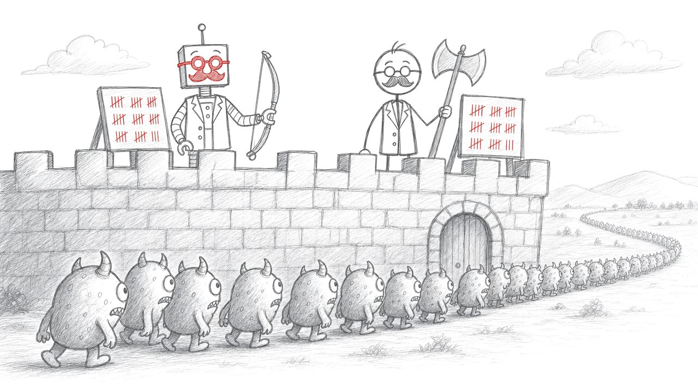

<!--# Oefeningen week 2-->

::: {.vooraf}
- Begin pas aan deze oefeningen als je de oefeningen van week 1 vlot kan oplossen.
- Deze week komen geneste lussen en grotere programma's aan bod. Kan je ze oplossen, dan heb je hoofdstuk 6 in de vingers. Bekijk zeker het Wiskunde-quizprogramma!
- [Let op]{.let-op} Ook hier geen ``continue``, en ``break`` enkel in een ``switch`` of bij zoek-en-stop (zie het [boeteblad](https://www.ziescherp.be/content/B_appendix/boete.html#boete-goto)).
- In de voorbeelduitvoer begint gebruikersinvoer met ``>``.
:::

<!--# Oefeningen week 2-->


# Tafels van supervermenigvuldigen (*Essential*) {#h06-tafels-van-supervermenigvuldigen}
Gebruik de kracht van **geneste** loops om pijlsnel alle tafels van vermenigvuldigen op het scherm te tonen van de getallen 1 tot en met *n*: dus 1 x 1, 1 x 2, ..., 1 x *n*, 2 x 1, 2 x 2, ..., 2 x *n*, tot en met *n* x *n*.

```text
Tot en met welk getal?
>3
1 x 1 = 1
1 x 2 = 2
1 x 3 = 3
2 x 1 = 2
2 x 2 = 4
2 x 3 = 6
3 x 1 = 3
3 x 2 = 6
3 x 3 = 9
```

::::{.callout-caution collapse="true" title="Oplossing"}
```java
Console.WriteLine("Tot en met welk getal?");
int n = int.Parse(Console.ReadLine());
for (int i = 1; i <= n; i++)
{
    for (int j = 1; j <= n; j++)
    {
        Console.WriteLine($"{i} x {j} = {i * j}");
    }
}
```
::::

**Deel 2.** Toon nu de tafels tot en met 10 van elk getal van 1 tot en met *n*, maar elke tafel **horizontaal**. Typt de gebruiker 8, dan verschijnt er:

```text
1x1=1,2x1=2,3x1=3,4x1=4,5x1=5,6x1=6,7x1=7,8x1=8,
1x2=2,2x2=4,3x2=6,4x2=8,5x2=10,6x2=12,7x2=14,8x2=16,
...
1x10=10,2x10=20,3x10=30,4x10=40,5x10=50,6x10=60,7x10=70,8x10=80,
```

::::{.callout-caution collapse="true" title="Oplossing"}
```java
Console.WriteLine("Tot en met welk getal?");
int n = int.Parse(Console.ReadLine());
for (int tafel = 1; tafel <= 10; tafel++)
{
    for (int getal = 1; getal <= n; getal++)
    {
        Console.Write($"{getal}x{tafel}={getal * tafel},");
    }
    Console.WriteLine();
}
```

De buitenste lus overloopt de rijen, de binnenste de kolommen. ``Write`` schrijft binnen de rij, de ``WriteLine`` na de binnenste lus sluit de rij af.
::::


# Sterrenpatronen (*Essential*) {#h06-sterrenpatronen}

Vraag de gebruiker een hoogte en teken een patroon van sterretjes. In [Als de inner loop van de outer afhangt](https://www.ziescherp.be/content/5_herhalingen/3_nesting.html#als-de-inner-loop-van-de-outer-afhangt) zag je al de gewone driehoek. Hier gaan we verder.

**Deel 1.** Een omgekeerde driehoek. Met hoogte 5:

```text
*****
****
***
**
*
```

::::{.callout-caution collapse="true" title="Oplossing"}
```java
Console.WriteLine("Hoe hoog?");
int hoogte = int.Parse(Console.ReadLine());
for (int rij = hoogte; rij >= 1; rij--)
{
    for (int kolom = 1; kolom <= rij; kolom++)
    {
        Console.Write("*");
    }
    Console.WriteLine();
}
```

De buitenste lus telt af. Het aantal sterren in een rij is gewoon het nummer van die rij.
::::

**Deel 2.** Een rechts uitgelijnde driehoek: eerst spaties, dan sterren. Met hoogte 5:

```text
    *
   **
  ***
 ****
*****
```

::::{.callout-caution collapse="true" title="Oplossing"}
```java
Console.WriteLine("Hoe hoog?");
int hoogte = int.Parse(Console.ReadLine());
for (int rij = 1; rij <= hoogte; rij++)
{
    for (int spatie = 1; spatie <= hoogte - rij; spatie++)
    {
        Console.Write(" ");
    }
    for (int ster = 1; ster <= rij; ster++)
    {
        Console.Write("*");
    }
    Console.WriteLine();
}
```

In één rij staan twee lussen na elkaar: eerst ``hoogte - rij`` spaties, dan ``rij`` sterren. Samen zijn dat altijd ``hoogte`` tekens.
::::

**Deel 3 (PRO).** Een piramide. Met hoogte 5:

```text
    *
   ***
  *****
 *******
*********
```

::::{.callout-caution collapse="true" title="Oplossing"}
```java
Console.WriteLine("Hoe hoog?");
int hoogte = int.Parse(Console.ReadLine());
for (int rij = 1; rij <= hoogte; rij++)
{
    for (int spatie = 1; spatie <= hoogte - rij; spatie++)
    {
        Console.Write(" ");
    }
    for (int ster = 1; ster <= 2 * rij - 1; ster++)
    {
        Console.Write("*");
    }
    Console.WriteLine();
}
```

Schrijf per rij op hoeveel sterren er komen: 1, 3, 5, 7, 9. Dat is ``2 * rij - 1``. De spaties zijn dezelfde als in deel 2.
::::


# Tekenen (*Essential*) {#h06-tekenen}

Lees twee getallen in, de breedte en de hoogte. Beide moeten van 2 tot en met 20 zijn: blijf vragen tot dat klopt. Teken daarna een open rechthoek van ``*`` met die breedte en hoogte. Met 10 en 4:

```text
Breedte (2 tot en met 20)?
>25
Breedte (2 tot en met 20)?
>10
Hoogte (2 tot en met 20)?
>4
* * * * * * * * * *
*                 *
*                 *
* * * * * * * * * *
```

::::{.callout-caution collapse="true" title="Oplossing"}
```java
int breedte;
do
{
    Console.WriteLine("Breedte (2 tot en met 20)?");
    breedte = int.Parse(Console.ReadLine());
} while (breedte < 2 || breedte > 20);

int hoogte;
do
{
    Console.WriteLine("Hoogte (2 tot en met 20)?");
    hoogte = int.Parse(Console.ReadLine());
} while (hoogte < 2 || hoogte > 20);

for (int rij = 1; rij <= hoogte; rij++)
{
    for (int kolom = 1; kolom <= breedte; kolom++)
    {
        if (rij == 1 || rij == hoogte || kolom == 1 || kolom == breedte)
        {
            Console.Write("* ");
        }
        else
        {
            Console.Write("  ");
        }
    }
    Console.WriteLine();
}
```

* De invoer moet minstens één keer gevraagd worden, dus een ``do while``. De lus gaat door zolang de invoer **fout** is: kleiner dan 2 **of** groter dan 20.
* Een vakje ligt op de rand als het in de eerste of laatste rij ligt, **of** in de eerste of laatste kolom. Met ``&&`` kregen enkel de hoeken een ster.
* Binnenin schrijf je spaties, anders schuift de rechterrand naar links.
::::


# Priemgetallen {#h06-priemgetallen}

Een priemgetal is een getal groter dan 1 dat enkel deelbaar is door 1 en door zichzelf. 2, 3, 5, 7, 11 en 13 zijn priemgetallen, 9 niet (9 = 3 x 3).

**Deel 1.** Vraag een getal en toon of het een priemgetal is.

```text
Geef een getal:
>97
97 is een priemgetal.
```

::::{.callout-caution collapse="true" title="Oplossing"}
```java
Console.WriteLine("Geef een getal:");
int getal = int.Parse(Console.ReadLine());

bool isPriem = getal >= 2;
for (int deler = 2; deler < getal && isPriem; deler++)
{
    if (getal % deler == 0)
    {
        isPriem = false;
    }
}

if (isPriem)
{
    Console.WriteLine($"{getal} is een priemgetal.");
}
else
{
    Console.WriteLine($"{getal} is geen priemgetal.");
}
```

[Uitleg via filmpje](https://ap.cloud.panopto.eu/Panopto/Pages/Viewer.aspx?id=8315eaf5-e6a2-402b-8e62-adf000cda005) (de code in het filmpje wijkt licht af)
::::

**Deel 2.** Toon alle priemgetallen van 1 tot en met *n*.

```text
Tot en met welk getal?
>30
2 3 5 7 11 13 17 19 23 29
```

::::{.callout-caution collapse="true" title="Oplossing"}
```java
Console.WriteLine("Tot en met welk getal?");
int n = int.Parse(Console.ReadLine());
for (int getal = 2; getal <= n; getal++)
{
    bool isPriem = true;
    for (int deler = 2; deler < getal && isPriem; deler++)
    {
        if (getal % deler == 0)
        {
            isPriem = false;
        }
    }
    if (isPriem)
    {
        Console.Write($"{getal} ");
    }
}
Console.WriteLine();
```

De binnenste lus is de priemtest uit deel 1. ``isPriem`` wordt binnen de buitenste lus aangemaakt, en start dus voor elk getal opnieuw op ``true``.
::::

::::{.callout-caution collapse="true" title="Les(sen) uit deze oefening"}
Zodra je één deler gevonden hebt, weet je genoeg: het getal is geen priemgetal. Daarom staat ``isPriem`` mee in de lusvoorwaarde, en stopt de lus vanzelf. Dit is het zoek-en-stop-patroon, en daar mag volgens het boeteblad ook een ``break``. Toch is de ``bool`` in de voorwaarde de nettere keuze: wie de ``for`` leest, ziet meteen wanneer ze stopt. Zie [break in geneste loops](https://www.ziescherp.be/content/5_herhalingen/3_nesting.html#break-in-geneste-loops).
::::


# Hoger Lager (*Essential*) {#h06-hoger-lager}

Het klassieke raadspel tegen de computer, in drie delen.

**Deel 1.** Het programma kiest een willekeurig getal van 1 tot en met 100. De gebruiker gokt, en het programma zegt of het getal hoger of lager ligt. Dat blijft doorgaan tot de gok juist is, of tot de gebruiker opgeeft door een negatief getal te typen. Op het einde toont het programma hoeveel beurten er nodig waren.

```text
Aan welk getal denk ik? (negatief getal om te stoppen)
>50
Hoger!
Aan welk getal denk ik? (negatief getal om te stoppen)
>75
Hoger!
Aan welk getal denk ik? (negatief getal om te stoppen)
>82
Juist! Je had 3 beurt(en) nodig.
```

::::{.callout-caution collapse="true" title="Oplossing"}
```java
Random rng = new Random();
int teRaden = rng.Next(1, 101);
int aantalBeurten = 0;
bool geraden = false;
bool opgegeven = false;

do
{
    Console.WriteLine("Aan welk getal denk ik? (negatief getal om te stoppen)");
    int gok = int.Parse(Console.ReadLine());
    if (gok < 0)
    {
        opgegeven = true;
    }
    else
    {
        aantalBeurten++;
        if (gok == teRaden)
        {
            geraden = true;
        }
        else if (gok < teRaden)
        {
            Console.WriteLine("Hoger!");
        }
        else
        {
            Console.WriteLine("Lager!");
        }
    }
} while (!geraden && !opgegeven);

if (geraden)
{
    Console.WriteLine($"Juist! Je had {aantalBeurten} beurt(en) nodig.");
}
else
{
    Console.WriteLine($"Jammer. Het getal was {teRaden}. Je deed {aantalBeurten} beurt(en).");
}
```

Het te raden getal wordt één keer getrokken, vóór de lus. Opgeven telt niet als beurt.
::::

**Deel 2.** De gebruiker krijgt nu hoogstens 7 beurten. Zijn ze op, dan toont het programma het getal.

Denkvraag: waarom net 7? Met een slimme strategie heb je nooit meer nodig. Welke strategie is dat?

::::{.callout-caution collapse="true" title="Oplossing"}
```java
const int MAX_BEURTEN = 7;
Random rng = new Random();
int teRaden = rng.Next(1, 101);
int aantalBeurten = 0;
bool geraden = false;
bool opgegeven = false;

do
{
    Console.WriteLine($"Aan welk getal denk ik? Beurt {aantalBeurten + 1} van {MAX_BEURTEN} (negatief getal om te stoppen)");
    int gok = int.Parse(Console.ReadLine());
    if (gok < 0)
    {
        opgegeven = true;
    }
    else
    {
        aantalBeurten++;
        if (gok == teRaden)
        {
            geraden = true;
        }
        else if (gok < teRaden)
        {
            Console.WriteLine("Hoger!");
        }
        else
        {
            Console.WriteLine("Lager!");
        }
    }
} while (!geraden && !opgegeven && aantalBeurten < MAX_BEURTEN);

if (geraden)
{
    Console.WriteLine($"Juist! Je had {aantalBeurten} beurt(en) nodig.");
}
else if (opgegeven)
{
    Console.WriteLine($"Jammer. Het getal was {teRaden}. Je deed {aantalBeurten} beurt(en).");
}
else
{
    Console.WriteLine($"Helaas, je {MAX_BEURTEN} beurten zijn op. Het getal was {teRaden}.");
}
```

De lus heeft nu drie uitgangen. Welke het was, zoek je na de lus uit met een ``if``, zie [Complexe condities](https://www.ziescherp.be/content/5_herhalingen/1_while_dowhile.html#complexe-condities).

Waarom 7: gok telkens in het midden van wat nog kan. Dan valt bij elke beurt de helft weg: 100, 50, 25, 13, 7, 4, 2, 1. Na 7 beurten blijft er nog maar één getal over.
::::

**Deel 3.** Vraag na elk spel of de gebruiker nog eens wil spelen (``j`` of ``n``). Elk nieuw spel trekt een nieuw getal.

::::{.callout-caution collapse="true" title="Oplossing"}
Het volledige spel van deel 2 komt in een tweede ``do while``. Alles wat per spel opnieuw moet beginnen, staat binnen die lus:

```java
const int MAX_BEURTEN = 7;
Random rng = new Random();
string nogEens;

do
{
    int teRaden = rng.Next(1, 101);
    int aantalBeurten = 0;
    bool geraden = false;
    bool opgegeven = false;

    do
    {
        Console.WriteLine($"Aan welk getal denk ik? Beurt {aantalBeurten + 1} van {MAX_BEURTEN} (negatief getal om te stoppen)");
        int gok = int.Parse(Console.ReadLine());
        if (gok < 0)
        {
            opgegeven = true;
        }
        else
        {
            aantalBeurten++;
            if (gok == teRaden)
            {
                geraden = true;
            }
            else if (gok < teRaden)
            {
                Console.WriteLine("Hoger!");
            }
            else
            {
                Console.WriteLine("Lager!");
            }
        }
    } while (!geraden && !opgegeven && aantalBeurten < MAX_BEURTEN);

    if (geraden)
    {
        Console.WriteLine($"Juist! Je had {aantalBeurten} beurt(en) nodig.");
    }
    else if (opgegeven)
    {
        Console.WriteLine($"Jammer. Het getal was {teRaden}. Je deed {aantalBeurten} beurt(en).");
    }
    else
    {
        Console.WriteLine($"Helaas, je {MAX_BEURTEN} beurten zijn op. Het getal was {teRaden}.");
    }

    Console.WriteLine("Nog eens spelen? (j/n)");
    nogEens = Console.ReadLine();
} while (nogEens == "j");
Console.WriteLine("Tot de volgende keer!");
```

De ``Random`` en de constante blijven buiten beide lussen: die heb je maar één keer nodig. ``nogEens`` staat vóór de buitenste lus, want de test achteraan moet haar kennen.
::::


# Wiskundequiz (*Essential*) {#h06-wiskundequiz}
Maak een applicatie waarmee je de tafels van vermenigvuldigen oefent. Het programma vraagt telkens een willekeurige vermenigvuldiging van twee getallen van 1 tot en met 10, en de gebruiker typt de uitkomst. Is ze juist, dan volgt de volgende vraag. Bij een fout stopt het programma en toont het hoeveel keer de gebruiker juist antwoordde.

```text
Hoeveel is 7 x 4?
>28
Goed zo!
Hoeveel is 10 x 6?
>66
Fout, het was 60.
Je had 1 keer juist.
```

::::{.callout-caution collapse="true" title="Oplossing"}
```java
Random rng = new Random();
int aantalJuist = 0;
bool juistGeantwoord = true;
do
{
    int getal1 = rng.Next(1, 11);
    int getal2 = rng.Next(1, 11);
    Console.WriteLine($"Hoeveel is {getal1} x {getal2}?");
    int antwoord = int.Parse(Console.ReadLine());
    if (antwoord == getal1 * getal2)
    {
        Console.WriteLine("Goed zo!");
        aantalJuist++;
    }
    else
    {
        Console.WriteLine($"Fout, het was {getal1 * getal2}.");
        juistGeantwoord = false;
    }
} while (juistGeantwoord);
Console.WriteLine($"Je had {aantalJuist} keer juist.");
```

``Next(1, 11)``: de bovengrens telt niet mee, dus met ``Next(1, 10)`` valt 10 nooit.
::::


# Wiskundequiz met levels (*Essential*) {#h06-wiskundequiz-met-levels}

Bouw levels in de wiskundequiz. Je start in level 1, en per 5 juiste antwoorden stijg je een level. Het level bepaalt hoe groot de getallen zijn: de getallen gaan van 1 tot en met 5 keer het level. In level 1 dus van 1 tot en met 5, in level 2 tot en met 10, in level 3 tot en met 15, enzovoort.

```text
Level 1: hoeveel is 4 x 3?
>12
Goed zo!
...
Level 1: hoeveel is 2 x 1?
>2
Goed zo!
LEVEL UP! Je zit nu in level 2.
Level 2: hoeveel is 8 x 1?
```

::::{.callout-caution collapse="true" title="Oplossing"}
```java
const int JUIST_PER_LEVEL = 5;
Random rng = new Random();
int aantalJuist = 0;
int level = 1;
bool juistGeantwoord = true;
do
{
    int bovengrens = 5 * level;
    int getal1 = rng.Next(1, bovengrens + 1);
    int getal2 = rng.Next(1, bovengrens + 1);
    Console.WriteLine($"Level {level}: hoeveel is {getal1} x {getal2}?");
    int antwoord = int.Parse(Console.ReadLine());
    if (antwoord == getal1 * getal2)
    {
        Console.WriteLine("Goed zo!");
        aantalJuist++;
        if (aantalJuist % JUIST_PER_LEVEL == 0)
        {
            level++;
            Console.WriteLine($"LEVEL UP! Je zit nu in level {level}.");
        }
    }
    else
    {
        Console.WriteLine($"Fout, het was {getal1 * getal2}.");
        juistGeantwoord = false;
    }
} while (juistGeantwoord);
Console.WriteLine($"Je had {aantalJuist} keer juist en haalde level {level}.");
```

Na elke 5 juiste antwoorden is ``aantalJuist`` een veelvoud van 5, en daar is modulo voor. De bovengrens wordt elke ronde opnieuw berekend, dus na een level-up gelden meteen de grotere getallen.
::::

**PRO.** Bij een fout antwoord stopt het spel niet meer meteen. De gebruiker zakt een level (maar nooit onder level 1). Pas na 3 foute antwoorden stopt het spel.

::::{.callout-caution collapse="true" title="Oplossing"}
```java
const int JUIST_PER_LEVEL = 5;
const int MAX_FOUTEN = 3;
Random rng = new Random();
int aantalJuist = 0;
int aantalFout = 0;
int level = 1;
do
{
    int bovengrens = 5 * level;
    int getal1 = rng.Next(1, bovengrens + 1);
    int getal2 = rng.Next(1, bovengrens + 1);
    Console.WriteLine($"Level {level}: hoeveel is {getal1} x {getal2}?");
    int antwoord = int.Parse(Console.ReadLine());
    if (antwoord == getal1 * getal2)
    {
        Console.WriteLine("Goed zo!");
        aantalJuist++;
        if (aantalJuist % JUIST_PER_LEVEL == 0)
        {
            level++;
            Console.WriteLine($"LEVEL UP! Je zit nu in level {level}.");
        }
    }
    else
    {
        aantalFout++;
        Console.WriteLine($"Fout, het was {getal1 * getal2}. Nog {MAX_FOUTEN - aantalFout} fout(en) over.");
        if (level > 1)
        {
            level--;
            Console.WriteLine($"Je zakt naar level {level}.");
        }
    }
} while (aantalFout < MAX_FOUTEN);
Console.WriteLine($"Je had {aantalJuist} keer juist.");
```

De ``bool`` valt weg: de lus stopt nu op een teller van fouten.
::::


# Codemenu (*Essential*) {#h06-codemenu}

Maak een applicatie die bij het opstarten een keuzemenu toont met 5 oefeningen die je al gemaakt hebt. Kiest de gebruiker een oefening (door ``a``, ``b``, ``c``, ``d`` of ``e`` te typen), dan wordt die oefening uitgevoerd. Daarna drukt de gebruiker op enter en verschijnt het menu opnieuw, tot hij ``q`` kiest.

Extra: maak je menu visueel interessanter, met kaders en kleuren.

:::{.callout-tip}
Plak je de code van twee oefeningen in twee cases, en gebruiken ze allebei een variabele ``getal``, dan compileert het niet: ``CS0128 A local variable or function named 'getal' is already defined in this scope``. Alle cases van een ``switch`` delen één scope. Zet de code van elke case daarom tussen eigen accolades.
:::

::::{.callout-caution collapse="true" title="Oplossing"}
Twee oefeningen als voorbeeld. De andere drie gaan op dezelfde manier:

```java
string keuze;
do
{
    Console.Clear();
    Console.WriteLine("MENU");
    Console.WriteLine("a. Tafels van vermenigvuldigen");
    Console.WriteLine("b. Som van 1 tot n");
    Console.WriteLine("q. Stoppen");
    keuze = Console.ReadLine();

    switch (keuze)
    {
        case "a":
            {
                Console.WriteLine("Van welk getal wil je de tafel?");
                int getal = int.Parse(Console.ReadLine());
                for (int i = 1; i <= 10; i++)
                {
                    Console.WriteLine($"{i} x {getal} = {i * getal}");
                }
                break;
            }
        case "b":
            {
                Console.WriteLine("Tot en met welk getal?");
                int getal = int.Parse(Console.ReadLine());
                int som = 0;
                for (int i = 1; i <= getal; i++)
                {
                    som += i;
                }
                Console.WriteLine($"De som is {som}.");
                break;
            }
        case "q":
            Console.WriteLine("Tot ziens!");
            break;
        default:
            Console.WriteLine("Onbekende keuze.");
            break;
    }

    if (keuze != "q")
    {
        Console.WriteLine("Druk op enter om terug te gaan naar het menu.");
        Console.ReadLine();
    }
} while (keuze != "q");
```
::::

::::{.callout-caution collapse="true" title="Les(sen) uit deze oefening"}
Met vijf oefeningen erin wordt je ``Main`` al gauw honderden lijnen lang, en moet je voor elke case aan accolades denken. Het kan veel overzichtelijker: in het volgende hoofdstuk steek je elke oefening in een eigen **methode**, en staat er in elke case nog maar één lijn.
::::


# Wiskunde-quizprogramma {#h06-wiskunde-quizprogramma}

Combineer de wiskundequiz met levels met een menu zoals in Codemenu. Het menu verschijnt bij de start, en de gebruiker kiest wat hij wil doen:

1. Gewoon spelen, vanaf level 1.
2. Starten op een bepaald level: de gebruiker typt daarna het level.
3. Studeren: de oplossing wordt telkens getoond, en de gebruiker hoeft niets in te typen. Er verschijnen 10 opgaven van level 1, elke 5 seconden een nieuwe. Met ``System.Threading.Thread.Sleep(5000)`` pauzeer je je programma 5 seconden (5000 ms).

::::{.callout-caution collapse="true" title="Oplossing"}
```java
const int JUIST_PER_LEVEL = 5;
const int AANTAL_STUDEEROPGAVEN = 10;
Random rng = new Random();

Console.WriteLine("Welkom bij de wiskundequiz. Wat wil je doen?");
Console.WriteLine("1. Gewoon spelen");
Console.WriteLine("2. Starten op een bepaald level");
Console.WriteLine("3. Studeren");
int keuze = int.Parse(Console.ReadLine());

int level = 1;
if (keuze == 2)
{
    Console.WriteLine("Op welk level wil je starten?");
    level = int.Parse(Console.ReadLine());
}

if (keuze == 3)
{
    for (int i = 1; i <= AANTAL_STUDEEROPGAVEN; i++)
    {
        int bovengrens = 5 * level;
        int getal1 = rng.Next(1, bovengrens + 1);
        int getal2 = rng.Next(1, bovengrens + 1);
        Console.WriteLine($"{getal1} x {getal2} = {getal1 * getal2}");
        System.Threading.Thread.Sleep(5000);
    }
}
else
{
    int aantalJuist = 0;
    bool juistGeantwoord = true;
    do
    {
        int bovengrens = 5 * level;
        int getal1 = rng.Next(1, bovengrens + 1);
        int getal2 = rng.Next(1, bovengrens + 1);
        Console.WriteLine($"Level {level}: hoeveel is {getal1} x {getal2}?");
        int antwoord = int.Parse(Console.ReadLine());
        if (antwoord == getal1 * getal2)
        {
            Console.WriteLine("Goed zo!");
            aantalJuist++;
            if (aantalJuist % JUIST_PER_LEVEL == 0)
            {
                level++;
                Console.WriteLine($"LEVEL UP! Je zit nu in level {level}.");
            }
        }
        else
        {
            Console.WriteLine($"Fout, het was {getal1 * getal2}.");
            juistGeantwoord = false;
        }
    } while (juistGeantwoord);
    Console.WriteLine($"Je had {aantalJuist} keer juist en haalde level {level}.");
}
```

Het menu staat vóór alle lussen: het verschijnt maar één keer. De keuze bepaalt welke van de twee lussen er draait. De studeermodus weet vooraf hoeveel opgaven hij toont, dus is dat een ``for``. De quiz weet dat niet, dus een ``do while``.
::::


# Steen schaar papier (*Essential*) {#h06-steen-schaar-papier}

Maak een applicatie waarmee de gebruiker steen-schaar-papier speelt tegen de computer. De gebruiker typt steen, schaar of papier en drukt op enter. Daarna kiest de computer willekeurig steen, schaar of papier. De winnaar van de ronde krijgt 1 punt:

* Steen wint van schaar, verliest van papier.
* Papier wint van steen, verliest van schaar.
* Schaar wint van papier, verliest van steen.
* Kiezen beide hetzelfde, dan krijgt niemand een punt.

Na elke ronde toont het programma wie de ronde won en wat de tussenstand is. Wie als eerste 5 punten haalt, wint.

Teken eerst een flowchart van je applicatie.

:::{.callout-tip}
Los dit op met een ``enum``: je code wordt een pak leesbaarder. De keuze van de computer is dan een willekeurig getal van 0 tot en met 2 dat je naar je enum cast. Een enum begint immers bij 0.
:::

```text
Steen, schaar of papier?
>steen
Ik koos Schaar.
Jij wint deze ronde!
Tussenstand: jij 1, ik 0
Steen, schaar of papier?
>papier
Ik koos Papier.
Gelijkspel! Niemand krijgt een punt.
Tussenstand: jij 1, ik 0
...
```

::::{.callout-caution collapse="true" title="Oplossing"}
Binnen ``class Program``, boven ``Main``:

```java
enum Keuze { Steen, Schaar, Papier }
```

In ``Main``:

```java
const int WINST = 5;
Random rng = new Random();
int scoreGebruiker = 0;
int scoreComputer = 0;

do
{
    Console.WriteLine("Steen, schaar of papier?");
    Keuze keuzeGebruiker = Enum.Parse<Keuze>(Console.ReadLine(), true);
    Keuze keuzeComputer = (Keuze)rng.Next(0, 3);
    Console.WriteLine($"Ik koos {keuzeComputer}.");

    if (keuzeGebruiker == keuzeComputer)
    {
        Console.WriteLine("Gelijkspel! Niemand krijgt een punt.");
    }
    else
    {
        bool gebruikerWint = (keuzeGebruiker == Keuze.Steen && keuzeComputer == Keuze.Schaar)
            || (keuzeGebruiker == Keuze.Papier && keuzeComputer == Keuze.Steen)
            || (keuzeGebruiker == Keuze.Schaar && keuzeComputer == Keuze.Papier);

        if (gebruikerWint)
        {
            Console.WriteLine("Jij wint deze ronde!");
            scoreGebruiker++;
        }
        else
        {
            Console.WriteLine("Ik win deze ronde!");
            scoreComputer++;
        }
    }
    Console.WriteLine($"Tussenstand: jij {scoreGebruiker}, ik {scoreComputer}");
} while (scoreGebruiker < WINST && scoreComputer < WINST);

if (scoreGebruiker == WINST)
{
    Console.WriteLine("Jij bent gewonnen!");
}
else
{
    Console.WriteLine("Helaas, de computer was beter.");
}
```

Eerst het gelijkspel afzonderen, dan de drie gevallen waarin de gebruiker wint. Alles wat overblijft, is een winst voor de computer. Zo hoef je geen negen combinaties uit te schrijven.
::::


# BeerSong {#h06-beersong}

Schrijf een BeerSong-generator die onderstaande tekst toont. Merk op dat de laatste strofen anders zijn:

```text
99 bottles of beer on the wall, 99 bottles of beer.
Take one down and pass it around, 98 bottles of beer on the wall.

98 bottles of beer on the wall, 98 bottles of beer.
Take one down and pass it around, 97 bottles of beer on the wall.

97 bottles of beer on the wall, 97 bottles of beer.
Take one down and pass it around, 96 bottles of beer on the wall.

...

3 bottles of beer on the wall, 3 bottles of beer.
Take one down and pass it around, 2 bottles of beer on the wall.

2 bottles of beer on the wall, 2 bottles of beer.
Take one down and pass it around, 1 bottle of beer on the wall.

1 bottle of beer on the wall, 1 bottle of beer.
Take it down and pass it around, no more bottles of beer on the wall.

No more bottles of beer on the wall, no more bottles of beer.
Go to the store and buy some more, 99 bottles of beer on the wall.
```

::::{.callout-caution collapse="true" title="Oplossing"}
```java
for (int flessen = 99; flessen > 2; flessen--)
{
    Console.WriteLine($"{flessen} bottles of beer on the wall, {flessen} bottles of beer.");
    Console.WriteLine($"Take one down and pass it around, {flessen - 1} bottles of beer on the wall.");
    Console.WriteLine();
}
Console.WriteLine("2 bottles of beer on the wall, 2 bottles of beer.");
Console.WriteLine("Take one down and pass it around, 1 bottle of beer on the wall.");
Console.WriteLine();
Console.WriteLine("1 bottle of beer on the wall, 1 bottle of beer.");
Console.WriteLine("Take it down and pass it around, no more bottles of beer on the wall.");
Console.WriteLine();
Console.WriteLine("No more bottles of beer on the wall, no more bottles of beer.");
Console.WriteLine("Go to the store and buy some more, 99 bottles of beer on the wall.");
```

De strofe van 2 past niet in het patroon (1 *bottle*, enkelvoud), dus de lus stopt bij 3.
::::


# De slag om Helm's Deep (*Final Essentials*) {#h06-de-slag-om-helm-s-deep}

Tijdens de slag om Helm's Deep houden Legolas en Gimli een wedstrijd: wie verslaat de meeste vijanden? Schrijf een programma dat deze heroïsche strijd bijhoudt, met een gebruiksvriendelijke interface in kleur.

{.illustratie fig-alt="Potloodtekening: de robot en het stokmannetje staan op een kasteelmuur en turven, beneden komt een eindeloze rij monstertjes aan."}

Het programma blijft vragen tot de gebruiker ``EINDE`` typt:

1. Wie heeft er een vijand verslagen? (``Legolas`` of ``Gimli``). Typ ``EINDE`` om de strijd te stoppen en de balans op te maken.
2. Wat voor vijand was het? (``Orc``, ``Uruk-hai`` of ``Troll``). Deze vraag komt enkel als er geen ``EINDE`` getypt werd.

**Puntenverdeling:**

* Een **Orc** is 1 punt waard.
* Een **Uruk-hai** is 3 punten waard.
* Een **Troll** is 5 punten waard.

**Speciale regels (The Extended Edition):**

1. **Kill streak**: houd bij wie de *vorige* kill maakte. Maakt dezelfde held **3 kills na elkaar**, dan krijgt hij bij die derde kill **10 bonuspunten** bovenop de punten van de vijand, met een speciale melding (bv. "Legolas is on fire!"). Daarna begint de telling opnieuw: de zesde kill op rij geeft weer bonus, de negende ook.
2. **Kleuren**:
    * Groene tekst als Legolas scoort.
    * Rode tekst als Gimli scoort.
    * Gewone grijze tekst voor de vragen.
3. Een onbekende held of een onbekende vijand levert een melding op, en geen punten.

**Einde van de strijd:** na ``EINDE`` toont het programma een rapport:

1. De totaalscore van Legolas en van Gimli.
2. Wie de winnaar is.
3. Hoeveel vijanden ze **samen** versloegen.
4. Hoeveel procent van alle punten Legolas verdiende, met 2 cijfers na de komma.

::: {.console .kleur}
```{=html}
<pre><code>Wie maakte de kill? (Legolas, Gimli of EINDE)
&gt;Legolas
Wat voor vijand? (Orc, Uruk-hai of Troll)
&gt;Orc
<span class="k-groen">Legolas versloeg een Orc! +1</span>
Wie maakte de kill? (Legolas, Gimli of EINDE)
&gt;Legolas
Wat voor vijand? (Orc, Uruk-hai of Troll)
&gt;Troll
<span class="k-groen">Legolas versloeg een Troll! +5</span>
Wie maakte de kill? (Legolas, Gimli of EINDE)
&gt;Legolas
Wat voor vijand? (Orc, Uruk-hai of Troll)
&gt;Uruk-hai
<span class="k-groen">Legolas versloeg een Uruk-hai! +3</span>
<span class="k-groen">Legolas is on fire! +10 bonuspunten!</span>
Wie maakte de kill? (Legolas, Gimli of EINDE)
&gt;Gimli
Wat voor vijand? (Orc, Uruk-hai of Troll)
&gt;Troll
<span class="k-rood">Gimli versloeg een Troll! +5</span>
Wie maakte de kill? (Legolas, Gimli of EINDE)
&gt;EINDE

=== EINDRAPPORT ===
Legolas: 19 punten
Gimli: 5 punten
Legolas wint de wedstrijd!
Samen versloegen ze 4 vijanden.
Legolas verdiende 79,17% van de punten.</code></pre>
```
:::

:::{.callout-tip}
* Je hebt een variabele nodig die onthoudt wie de *vorige* kill maakte, en een teller voor de streak.
* Vergeet niet `Console.ResetColor()` te gebruiken na een gekleurde boodschap.
:::

::::{.callout-caution collapse="true" title="Oplossing"}

```java
const int BONUS = 10;
const int STREAK = 3;
int puntenLegolas = 0;
int puntenGimli = 0;
int killsLegolas = 0;
int killsGimli = 0;
string vorigeKiller = "";
int streak = 0;

Console.WriteLine("Wie maakte de kill? (Legolas, Gimli of EINDE)");
string killer = Console.ReadLine();

while (killer != "EINDE")
{
    if (killer != "Legolas" && killer != "Gimli")
    {
        Console.WriteLine("Onbekende held. Typ Legolas, Gimli of EINDE.");
    }
    else
    {
        Console.WriteLine("Wat voor vijand? (Orc, Uruk-hai of Troll)");
        string vijand = Console.ReadLine();

        int punten = 0;
        if (vijand == "Orc")
        {
            punten = 1;
        }
        else if (vijand == "Uruk-hai")
        {
            punten = 3;
        }
        else if (vijand == "Troll")
        {
            punten = 5;
        }

        if (punten == 0)
        {
            Console.WriteLine("Onbekende vijand. Geen punten.");
        }
        else
        {
            if (killer == vorigeKiller)
            {
                streak++;
            }
            else
            {
                streak = 1;
            }
            vorigeKiller = killer;

            int bonus = 0;
            if (streak == STREAK)
            {
                bonus = BONUS;
                streak = 0;
            }

            if (killer == "Legolas")
            {
                Console.ForegroundColor = ConsoleColor.Green;
                puntenLegolas += punten + bonus;
                killsLegolas++;
            }
            else
            {
                Console.ForegroundColor = ConsoleColor.Red;
                puntenGimli += punten + bonus;
                killsGimli++;
            }
            Console.WriteLine($"{killer} versloeg een {vijand}! +{punten}");
            if (bonus > 0)
            {
                Console.WriteLine($"{killer} is on fire! +{BONUS} bonuspunten!");
            }
            Console.ResetColor();
        }
    }

    Console.WriteLine("Wie maakte de kill? (Legolas, Gimli of EINDE)");
    killer = Console.ReadLine();
}

int totaalPunten = puntenLegolas + puntenGimli;
Console.WriteLine();
Console.WriteLine("=== EINDRAPPORT ===");
Console.WriteLine($"Legolas: {puntenLegolas} punten");
Console.WriteLine($"Gimli: {puntenGimli} punten");
if (puntenLegolas > puntenGimli)
{
    Console.WriteLine("Legolas wint de wedstrijd!");
}
else if (puntenGimli > puntenLegolas)
{
    Console.WriteLine("Gimli wint de wedstrijd!");
}
else
{
    Console.WriteLine("Het is een gelijkspel!");
}
Console.WriteLine($"Samen versloegen ze {killsLegolas + killsGimli} vijanden.");
if (totaalPunten > 0)
{
    Console.WriteLine($"Legolas verdiende {(double)puntenLegolas / totaalPunten * 100:F2}% van de punten.");
}
```

* ``streak = 0`` na de bonus: zo telt de volgende kill van dezelfde held weer als eerste van een nieuwe reeks, en komt de volgende bonus bij de zesde kill.
* ``vorigeKiller`` wordt pas bijgewerkt nadat je ze vergeleken hebt met de huidige killer.
* ``(double)puntenLegolas / totaalPunten``: zonder cast is het een gehele deling, en dan krijgt Legolas 0%. De ``if`` ervoor voorkomt een deling door nul als er geen enkele kill was.
* ``{...:F2}`` toont altijd twee cijfers na de komma, ook ``80,00``. ``Math.Round(..., 2)`` zou daar ``80`` van maken.
::::


# Become Neo {#h06-become-neo}

Een bonusoefening om af te sluiten.


Volgende code genereert een beeld zoals in de cultfilm The Matrix (1999). De lus is bewust oneindig: je stopt het programma door het venster te sluiten.

```java
Random rangen = new Random();
Console.ForegroundColor = ConsoleColor.Green;
while (true)
{
    //Genereer nieuw random teken:
    char teken = Convert.ToChar(rangen.Next(62, 400));
    //Zet teken op scherm
    Console.Write(teken);

    //10 ms pauze tussen ieder frame (pas gerust aan)
    System.Threading.Thread.Sleep(10);

    //Af en toe donker kleurtje
    if (rangen.Next(0, 3) == 0)
    {
        Console.ForegroundColor = ConsoleColor.DarkGreen;
    }
    else
    {
        Console.ForegroundColor = ConsoleColor.Green;
    }
}
```

Vul de code aan zodat de tekens willekeurige kleuren krijgen. Kan je het nog cooler maken?

::::{.callout-caution collapse="true" title="Oplossing"}

```java
Random rangen = new Random();

while (true)
{
    char teken = Convert.ToChar(rangen.Next(62, 400));

    int kleurKeuze = rangen.Next(0, 7);
    if (kleurKeuze == 0)
    {
        Console.ForegroundColor = ConsoleColor.Green;
    }
    else if (kleurKeuze == 1)
    {
        Console.ForegroundColor = ConsoleColor.DarkGreen;
    }
    else if (kleurKeuze == 2)
    {
        Console.ForegroundColor = ConsoleColor.Cyan;
    }
    else if (kleurKeuze == 3)
    {
        Console.ForegroundColor = ConsoleColor.DarkCyan;
    }
    else if (kleurKeuze == 4)
    {
        Console.ForegroundColor = ConsoleColor.White;
    }
    else if (kleurKeuze == 5)
    {
        Console.ForegroundColor = ConsoleColor.Yellow;
    }
    else
    {
        Console.ForegroundColor = ConsoleColor.Magenta;
    }

    // Af en toe een spatie, voor gaten in het beeld
    if (rangen.Next(0, 8) == 0)
    {
        Console.Write(" ");
    }
    else
    {
        Console.Write(teken);
    }

    System.Threading.Thread.Sleep(rangen.Next(1, 30));
}
```

Een ``switch`` op ``kleurKeuze`` mag ook, en leest misschien nog vlotter.
::::
