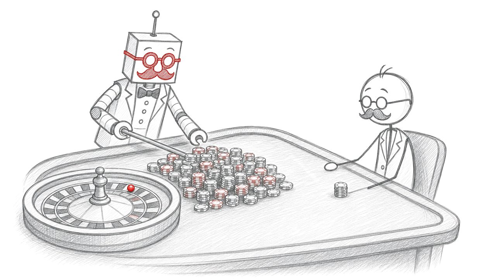

<!--# Oefeningen week 2-->

::: {.vooraf}
- Deze week komen de technieken uit [Geavanceerde methode-technieken](https://www.ziescherp.be/content/6_methoden/3_advancedmethod.html) erbij: named arguments, optionele parameters en method overloading.
- [Let op]{.let-op} De huisregel van week 1 blijft gelden: ``ReadLine`` en ``WriteLine`` enkel in methoden die ``Toon...`` of ``Vraag...`` heten. Alle andere methoden krijgen parameters binnen en geven hun resultaat terug.
- Alle methoden zijn ``static`` en staan naast ``Main``, nooit erin.
- In de voorbeelduitvoer begint gebruikersinvoer met ``>``.
:::

<!--# Oefeningen week 2-->


# Film Default (*Essential*) {#h07-film-default}

Maak een ``enum Genre`` met de waarden ``Onbekend``, ``Actie``, ``Drama``, ``Komedie`` en ``Animatie``. Schrijf daarna een methode ``ToonFilm`` met drie parameters:

1. de naam van de film (``string``);
2. de duur in minuten (``int``). Geeft de aanroeper geen duur mee, dan is die 90 minuten;
3. het genre (``Genre``). Geeft de aanroeper geen genre mee, dan is het ``Genre.Onbekend``.

De methode toont de film in dit formaat:

```text
The Matrix (120 minuten, Actie)
```

Toon in ``Main`` dat je de methode kan oproepen met 1, 2 en 3 argumenten. Toon ook een aanroep met een *named argument*: een animatiefilm waarvan je de duur niet kent.

::::{.callout-caution collapse="true" title="Oplossing"}
Binnen ``class Program``, boven ``Main``:

```java
enum Genre { Onbekend, Actie, Drama, Komedie, Animatie }
```

De methode en ``Main``:

```java
static void ToonFilm(string naam, int duur = 90, Genre filmgenre = Genre.Onbekend)
{
    Console.WriteLine($"{naam} ({duur} minuten, {filmgenre})");
}

static void Main(string[] args)
{
    ToonFilm("The Matrix", 120, Genre.Actie);
    ToonFilm("Titanic", 195);
    ToonFilm("Mijn eerste kortfilm");
    ToonFilm("Up", filmgenre: Genre.Animatie);
}
```

```text
The Matrix (120 minuten, Actie)
Titanic (195 minuten, Onbekend)
Mijn eerste kortfilm (90 minuten, Onbekend)
Up (90 minuten, Animatie)
```
::::

::::{.callout-caution collapse="true" title="Les(sen) uit deze oefening"}
* Optionele parameters staan altijd achteraan de parameterlijst.
* Zonder namen kan je enkel van achter naar voor weglaten. Wil je de duur overslaan maar het genre wel meegeven, dan heb je een named argument nodig: ``ToonFilm("Up", filmgenre: Genre.Animatie)``. Met ``ToonFilm("Up", Genre.Animatie)`` probeer je een ``Genre`` in de ``int duur`` te stoppen, en dat compileert niet.
::::


# Opwarmers met geavanceerde methoden (*Essential*) {#h07-opwarmers-geavanceerd}

Drie opwarmers uit week 1 krijgen een upgrade. Test ze in ``Main``.

* ``Kwadraat`` wordt ``Macht(int grondtal, int exponent = 2)``, met returntype ``int``. Zonder exponent berekent ze dus nog altijd het kwadraat. Bereken de macht zelf met een lus, zonder ``Math.Pow``.
* ``ToonOnevenNummers`` krijgt een optionele parameter ``vanaf`` (standaard 1): ``static void ToonOnevenNummers(int tot, int vanaf = 1)``. Roep ze ook eens op met een named argument, zoals ``ToonOnevenNummers(20, vanaf: 10)``.
* ``Grootste`` bestaat voortaan in twee versies: één voor twee getallen en één voor drie. Dat is **overloading**. De versie voor drie getallen gebruikt die voor twee.

```text
7 in het kwadraat is 49
2 tot de derde is 8
1 3 5 7 9
11 13 15 17 19
Grootste van 4 en 9: 9
Grootste van 3, 8 en 5: 8
```

::::{.callout-caution collapse="true" title="Oplossing"}
```java
static int Macht(int grondtal, int exponent = 2)
{
    int resultaat = 1;
    for (int i = 1; i <= exponent; i++)
    {
        resultaat *= grondtal;
    }
    return resultaat;
}

static void ToonOnevenNummers(int tot, int vanaf = 1)
{
    for (int i = vanaf; i <= tot; i++)
    {
        if (i % 2 != 0)
        {
            Console.Write($"{i} ");
        }
    }
    Console.WriteLine();
}

static int Grootste(int getal1, int getal2)
{
    if (getal1 > getal2)
    {
        return getal1;
    }
    return getal2;
}

static int Grootste(int getal1, int getal2, int getal3)
{
    return Grootste(Grootste(getal1, getal2), getal3);
}

static void Main(string[] args)
{
    Console.WriteLine($"7 in het kwadraat is {Macht(7)}");
    Console.WriteLine($"2 tot de derde is {Macht(2, 3)}");
    ToonOnevenNummers(10);
    ToonOnevenNummers(20, vanaf: 10);
    Console.WriteLine($"Grootste van 4 en 9: {Grootste(4, 9)}");
    Console.WriteLine($"Grootste van 3, 8 en 5: {Grootste(3, 8, 5)}");
}
```

De versie van ``Grootste`` voor drie getallen roept die voor twee op, net zoals ``ToonTitel()`` in de leerstof ``ToonTitel(string naam)`` oproept. Zo staat de vergelijking maar op één plaats.
::::


# Voorspel de uitvoer: optioneel en overload (*Essential*) {#h07-voorspel-optioneel-overload}

Fouten met optionele parameters en overloading zijn zelden compilerfouten: de code draait, maar doet iets anders dan je denkt. Zoek ze hier op papier.

```java
static void ToonBestelling(string klant, int aantal = 1, int korting = 0)
{
    Console.WriteLine($"{klant}: {aantal} stuk(s), {korting}% korting");
}

static void ToonAfspraak(string dokter, int uur, string patient)
{
    Console.WriteLine($"{patient} heeft om {uur} uur een afspraak bij {dokter}");
}

static int Halveer(int getal)
{
    return getal / 2;
}

static double Halveer(double getal)
{
    return getal / 2;
}

static void ToonScore(int punten, double bonus)
{
    Console.WriteLine($"A: {punten} punten, {bonus} bonus");
}

static void ToonScore(double punten, int bonus)
{
    Console.WriteLine($"B: {punten} punten, {bonus} bonus");
}

static void Main(string[] args)
{
    ToonBestelling("Sara", 10);
    ToonBestelling("Sara", korting: 10);
    ToonAfspraak("Emma", 14, "dokter Peeters");
    Console.WriteLine(Halveer(7));
    Console.WriteLine(Halveer(7.0));
    Console.WriteLine(Halveer(7f));
    ToonScore(8, 2);
    ToonScore(8, 2.5);
}
```

De programmeur wilde telkens één stuk met 10% korting tonen, en een afspraak van patiënt Emma bij dokter Peeters.

Schrijf per lijn in ``Main`` op welke versie van de methode uitgevoerd wordt en wat er verschijnt. Eén lijn compileert niet: welke, en waarom? Zet die lijn daarna in commentaar en voer de rest uit om je antwoorden te controleren.

::::{.callout-caution collapse="true" title="Oplossing"}
``ToonScore(8, 2);`` compileert niet: ``CS0121 The call is ambiguous between the following methods or properties: 'Program.ToonScore(int, double)' and 'Program.ToonScore(double, int)'``. Twee ints passen even goed op beide versies, en de compiler kiest dan niet. Zonder die lijn verschijnt:

```text
Sara: 10 stuk(s), 0% korting
Sara: 1 stuk(s), 10% korting
dokter Peeters heeft om 14 uur een afspraak bij Emma
3
3,5
3,5
A: 8 punten, 2,5 bonus
```

* ``ToonBestelling("Sara", 10)``: de 10 landt in de eerste optionele parameter, ``aantal``. Sara bestelt 10 stuks zonder korting. Wil je de korting meegeven zonder het aantal, dan heb je ``korting: 10`` nodig.
* ``ToonAfspraak``: dokter en patiënt zijn allebei een ``string``, dus omgewisseld compileert het gewoon. Met named arguments (``dokter: "dokter Peeters", patient: "Emma"``) kan dat niet meer mislopen.
* ``Halveer(7)`` kiest de ``int``-versie, en die deelt gehele getallen: 3. ``Halveer(7.0)`` kiest de ``double``-versie. ``Halveer(7f)`` is een ``float``: daar is geen versie voor, maar een ``float`` gaat vanzelf naar een ``double``, en niet naar een ``int``.
* ``ToonScore(8, 2.5)``: enkel versie A aanvaardt een ``double`` als tweede parameter.

Meer in [Named parameters](https://www.ziescherp.be/content/6_methoden/3_advancedmethod.html#named-parameters), [Optionele parameters](https://www.ziescherp.be/content/6_methoden/3_advancedmethod.html#optionele-parameters) en [Wanneer de compiler niet kan kiezen](https://www.ziescherp.be/content/6_methoden/3_advancedmethod.html#wanneer-de-compiler-niet-kan-kiezen).
::::


# Roulette (*Essential*) {#h07-roulette}

Deze oefening is een variant op een opgave uit de vaardigheidsproef van januari 2024. Het doel: aantonen dat je beter niet gokt, want *het huis wint altijd*. Je mag ervan uitgaan dat de gebruiker geen foute invoer typt.

{.illustratie fig-alt="Potloodtekening: de robot als croupier harkt een grote berg fiches naar zich toe, het stokmannetje houdt één klein stapeltje over."}

**De methode ``SimuleerRoulette``.** Ze krijgt het startkapitaal van de speler mee (``double``) en het aantal rondes (``int``). Het aantal rondes is optioneel en staat standaard op 10. In elke ronde gebeurt het volgende:

1. De computer kiest een willekeurig getal van 0 tot en met 59: de keuze van de speler.
2. De computer kiest nog een willekeurig getal van 0 tot en met 59: waar het balletje belandt.
3. Zijn beide getallen gelijk, dan krijgt de speler 1 euro bij. Anders verliest hij 0,1 euro.

Na alle rondes geeft de methode het kapitaal terug dat overblijft.

**De methode ``ToonResultaat``.** Ze krijgt het startkapitaal, het aantal rondes en het eindkapitaal mee, en toont hoeveel er overblijft en wat het verschil is met het startkapitaal: groen bij winst, rood bij verlies.

**De applicatie.** Vraag een startkapitaal. Toon eerst het resultaat van een korte avond: roep ``SimuleerRoulette`` op **zonder** aantal rondes. Toon daarna het resultaat van 100, 1000 en 10000 rondes.

```text
Wat is je startkapitaal?
>1000
Na 10 rondes heb je 999,0 euro. Dat is een verschil van -1,0 euro.
Na 100 rondes heb je 992,2 euro. Dat is een verschil van -7,8 euro.
Na 1000 rondes heb je 912,1 euro. Dat is een verschil van -87,9 euro.
Na 10000 rondes heb je 194,7 euro. Dat is een verschil van -805,3 euro.
```

Het verschil staat in het rood. Door het toeval krijg jij andere getallen, maar na 10000 rondes zit je altijd rond de 800 euro verlies.

:::{.callout-tip}
Het kapitaal is een ``double``, en 0,1 kan een ``double`` niet exact bewaren. Na veel rondes kan je dus rare staartjes krijgen. Toon het kapitaal daarom met ``{kapitaal:F1}``.
:::

::::{.callout-caution collapse="true" title="Oplossing"}
```java
static double SimuleerRoulette(double startKapitaal, int aantalRondes = 10)
{
    Random rng = new Random();
    double kapitaal = startKapitaal;
    for (int i = 0; i < aantalRondes; i++)
    {
        int keuzeSpeler = rng.Next(0, 60);
        int balletje = rng.Next(0, 60);
        if (keuzeSpeler == balletje)
        {
            kapitaal += 1;
        }
        else
        {
            kapitaal -= 0.1;
        }
    }
    return kapitaal;
}

static void ToonResultaat(double startKapitaal, int aantalRondes, double eindKapitaal)
{
    double verschil = eindKapitaal - startKapitaal;
    Console.Write($"Na {aantalRondes} rondes heb je {eindKapitaal:F1} euro. Dat is een verschil van ");
    if (verschil >= 0)
    {
        Console.ForegroundColor = ConsoleColor.Green;
    }
    else
    {
        Console.ForegroundColor = ConsoleColor.Red;
    }
    Console.WriteLine($"{verschil:F1} euro.");
    Console.ResetColor();
}

static void Main(string[] args)
{
    Console.WriteLine("Wat is je startkapitaal?");
    double startKapitaal = double.Parse(Console.ReadLine());

    ToonResultaat(startKapitaal, 10, SimuleerRoulette(startKapitaal));
    for (int aantalRondes = 100; aantalRondes <= 10000; aantalRondes *= 10)
    {
        ToonResultaat(startKapitaal, aantalRondes, SimuleerRoulette(startKapitaal, aantalRondes));
    }
}
```
::::

::::{.callout-caution collapse="true" title="Les(sen) uit deze oefening"}
* ``SimuleerRoulette(startKapitaal)`` gebruikt de standaardwaarde: 10 rondes. Dat is het nut van een optionele parameter: de gewone aanroep blijft kort.
* Vier keer bijna dezelfde lijn onder elkaar, met enkel een ander aantal rondes, is onnodige code. Het [boeteblad](https://www.ziescherp.be/content/B_appendix/boete.html#boete-redundant) gebruikt precies dit voorbeeld. Met een lus die ``aantalRondes *= 10`` doet, staat de aanroep er maar één keer.
* ``ToonResultaat`` toont iets, dus heet ze ``Toon...``. ``SimuleerRoulette`` rekent enkel, en toont niets.
::::


# Helm's Deep opgekuist (*Essential*) {#h07-helms-deep-opgekuist}

De Final Essentials van hoofdstuk 6, [De slag om Helm's Deep](../6_herhalingen/A_practicasamen2.md#h06-de-slag-om-helm-s-deep), werkt, maar ``Main`` is lang. Hetzelfde blokje (kleur instellen, tekst tonen, kleur terugzetten) staat er meerdere keren in. Vertrek van je eigen oplossing (of van de modeloplossing) en knip ze op in methoden:

* ``static string VraagTekst(string vraag)`` stelt een vraag en geeft het antwoord terug.
* ``static int PuntenVoorVijand(string vijand)`` geeft de punten van een vijand terug: 1 voor een Orc, 3 voor een Uruk-hai, 5 voor een Troll, en 0 voor een vijand die niet bestaat.
* ``static void ToonGekleurd(string tekst, ConsoleColor kleur = ConsoleColor.Gray)`` toont een tekst in een kleur, en zet de kleur daarna terug. Zonder kleur is dat gewoon grijs.

De uitvoer van je programma verandert niet.

De toets achteraf: kan je van elke methode in één zin zeggen wat ze doet? Zie [Hoe groot mag een methode zijn?](https://www.ziescherp.be/content/6_methoden/0c_methodencombineren.html#hoe-groot-mag-een-methode-zijn)

::::{.callout-caution collapse="true" title="Oplossing"}
```java
static string VraagTekst(string vraag)
{
    Console.WriteLine(vraag);
    return Console.ReadLine();
}

static int PuntenVoorVijand(string vijand)
{
    switch (vijand)
    {
        case "Orc":
            return 1;
        case "Uruk-hai":
            return 3;
        case "Troll":
            return 5;
        default:
            return 0;
    }
}

static void ToonGekleurd(string tekst, ConsoleColor kleur = ConsoleColor.Gray)
{
    Console.ForegroundColor = kleur;
    Console.WriteLine(tekst);
    Console.ResetColor();
}

static void Main(string[] args)
{
    const int BONUS = 10;
    const int STREAK = 3;
    int puntenLegolas = 0;
    int puntenGimli = 0;
    int killsLegolas = 0;
    int killsGimli = 0;
    string vorigeKiller = "";
    int streak = 0;

    string killer = VraagTekst("Wie maakte de kill? (Legolas, Gimli of EINDE)");
    while (killer != "EINDE")
    {
        if (killer != "Legolas" && killer != "Gimli")
        {
            ToonGekleurd("Onbekende held. Typ Legolas, Gimli of EINDE.");
        }
        else
        {
            string vijand = VraagTekst("Wat voor vijand? (Orc, Uruk-hai of Troll)");
            int punten = PuntenVoorVijand(vijand);
            if (punten == 0)
            {
                ToonGekleurd("Onbekende vijand. Geen punten.");
            }
            else
            {
                if (killer == vorigeKiller)
                {
                    streak++;
                }
                else
                {
                    streak = 1;
                }
                vorigeKiller = killer;

                int bonus = 0;
                if (streak == STREAK)
                {
                    bonus = BONUS;
                    streak = 0;
                }

                if (killer == "Legolas")
                {
                    puntenLegolas += punten + bonus;
                    killsLegolas++;
                }
                else
                {
                    puntenGimli += punten + bonus;
                    killsGimli++;
                }

                ConsoleColor kleur = killer == "Legolas" ? ConsoleColor.Green : ConsoleColor.Red;
                ToonGekleurd($"{killer} versloeg een {vijand}! +{punten}", kleur);
                if (bonus > 0)
                {
                    ToonGekleurd($"{killer} is on fire! +{BONUS} bonuspunten!", kleur);
                }
            }
        }
        killer = VraagTekst("Wie maakte de kill? (Legolas, Gimli of EINDE)");
    }

    int totaalPunten = puntenLegolas + puntenGimli;
    Console.WriteLine();
    Console.WriteLine("=== EINDRAPPORT ===");
    Console.WriteLine($"Legolas: {puntenLegolas} punten");
    Console.WriteLine($"Gimli: {puntenGimli} punten");
    if (puntenLegolas > puntenGimli)
    {
        Console.WriteLine("Legolas wint de wedstrijd!");
    }
    else if (puntenGimli > puntenLegolas)
    {
        Console.WriteLine("Gimli wint de wedstrijd!");
    }
    else
    {
        Console.WriteLine("Het is een gelijkspel!");
    }
    Console.WriteLine($"Samen versloegen ze {killsLegolas + killsGimli} vijanden.");
    if (totaalPunten > 0)
    {
        Console.WriteLine($"Legolas verdiende {(double)puntenLegolas / totaalPunten * 100:F2}% van de punten.");
    }
}
```

* ``PuntenVoorVijand`` gebruikt ``return`` in elke ``case``. Zodra de methode een ``return`` bereikt, is ze klaar, dus is er geen ``break`` nodig.
* De kleur van de held wordt één keer gekozen, met de ternaire operator, en daarna twee keer meegegeven.
* ``ToonGekleurd`` zonder kleur toont gewoon grijs: dat is de optionele parameter.
::::


# Havenbeheer (*Final Essentials*) {#h07-havenbeheer}

Tijd om al je kennis over methoden samen te brengen in de haven van Antwerpen. Je schrijft een systeem dat de toegang en de kosten van vrachtschepen berekent.

**De methoden.** Denk goed na over de returntypes!

1. **``ControleerDiepgang``** krijgt de diepgang van een schip mee (``double``) en een optionele parameter ``kadeDiepte`` (``double``), die standaard 12,5 meter is. Ze geeft ``true`` terug als de diepgang kleiner of gelijk is aan de kadediepte, anders ``false``.
2. **``BerekenHavengeld``** bestaat in twee versies (**overloading**):
    * met een ``int``: het aantal containers. Een container kost 45 euro.
    * met een ``double``: het tonnage van een bulkschip. Een ton kost 15 euro.
3. **``BerekenTotaleKost``** krijgt het havengeld mee (``double``) en een optionele ``bool isGevaarlijk`` (standaard ``false``). Bij gevaarlijke lading komt er 30% bij. Ze geeft de afgeronde prijs terug als ``int``.

**Het scenario.**

1. Vraag de naam en de diepgang van het schip.
2. Kade 1 is 12,5 meter diep: controleer dat met ``ControleerDiepgang`` zonder kadediepte. Is het schip te diep, controleer dan of het in het Deurganckdok past, dat 14 meter diep is. Roep ``ControleerDiepgang`` daarvoor op met een *named argument* voor de kadediepte.
3. Past het schip nergens, toon dan een alarm en stop het programma.
4. Vraag het type lading. Voor containers vraag je het aantal containers (een ``int``), voor bulk het tonnage (een ``double``). De juiste versie van ``BerekenHavengeld`` wordt dan vanzelf gekozen.
5. Vraag of de lading gevaarlijk is, en toon een rapport.

```text
Welkom bij Havenbeheer Antwerpen.
Naam van het schip?
>The Unsinkable II
Diepgang in meters?
>13,2
Te diep voor kade 1. Het schip meert aan in het Deurganckdok.

Type lading (1=Containers, 2=Bulk)?
>1
Aantal containers?
>250
Bevat het schip gevaarlijke goederen (j/n)?
>j

--- RAPPORT: The Unsinkable II ---
Havengeld: 11250 euro
Type: gevaarlijke lading (+30%)
Totale kostprijs: 14625 euro
```

Nog een voorbeeld (te diep):

```text
Welkom bij Havenbeheer Antwerpen.
Naam van het schip?
>Titanic
Diepgang in meters?
>50
ALARM: het schip ligt te diep (max 14 m) en mag niet binnen!
```

::::{.callout-caution collapse="true" title="Oplossing"}
```java
static bool ControleerDiepgang(double diepgang, double kadeDiepte = 12.5)
{
    return diepgang <= kadeDiepte;
}

static double BerekenHavengeld(int aantalContainers)
{
    const double PRIJS_PER_CONTAINER = 45;
    return aantalContainers * PRIJS_PER_CONTAINER;
}

static double BerekenHavengeld(double tonnage)
{
    const double PRIJS_PER_TON = 15;
    return tonnage * PRIJS_PER_TON;
}

static int BerekenTotaleKost(double havengeld, bool isGevaarlijk = false)
{
    double prijs = havengeld;
    if (isGevaarlijk)
    {
        prijs *= 1.30;
    }
    return (int)Math.Round(prijs);
}

static void Main(string[] args)
{
    const double DIEPTE_DEURGANCKDOK = 14;

    Console.WriteLine("Welkom bij Havenbeheer Antwerpen.");
    Console.WriteLine("Naam van het schip?");
    string naam = Console.ReadLine();
    Console.WriteLine("Diepgang in meters?");
    double diepgang = double.Parse(Console.ReadLine());

    if (ControleerDiepgang(diepgang))
    {
        Console.WriteLine("Het schip meert aan aan kade 1.");
    }
    else if (ControleerDiepgang(diepgang, kadeDiepte: DIEPTE_DEURGANCKDOK))
    {
        Console.WriteLine("Te diep voor kade 1. Het schip meert aan in het Deurganckdok.");
    }
    else
    {
        Console.WriteLine($"ALARM: het schip ligt te diep (max {DIEPTE_DEURGANCKDOK} m) en mag niet binnen!");
        return;
    }
    Console.WriteLine();

    Console.WriteLine("Type lading (1=Containers, 2=Bulk)?");
    int typeLading = int.Parse(Console.ReadLine());
    double havengeld;
    if (typeLading == 1)
    {
        Console.WriteLine("Aantal containers?");
        int aantalContainers = int.Parse(Console.ReadLine());
        havengeld = BerekenHavengeld(aantalContainers);
    }
    else
    {
        Console.WriteLine("Tonnage?");
        double tonnage = double.Parse(Console.ReadLine());
        havengeld = BerekenHavengeld(tonnage);
    }

    Console.WriteLine("Bevat het schip gevaarlijke goederen (j/n)?");
    bool isGevaarlijk = Console.ReadLine() == "j";
    int totaleKost = BerekenTotaleKost(havengeld, isGevaarlijk);

    string ladingType = isGevaarlijk ? "gevaarlijke lading (+30%)" : "normale lading";
    Console.WriteLine();
    Console.WriteLine($"--- RAPPORT: {naam} ---");
    Console.WriteLine($"Havengeld: {havengeld} euro");
    Console.WriteLine($"Type: {ladingType}");
    Console.WriteLine($"Totale kostprijs: {totaleKost} euro");
}
```
::::

::::{.callout-caution collapse="true" title="Les(sen) uit deze oefening"}
* Welke versie van ``BerekenHavengeld`` er draait, beslist het **type** van wat je meegeeft. Lees je het aantal containers per ongeluk in als ``double``, dan kiest de compiler de versie voor bulk: 250 containers kosten dan 3750 euro in plaats van 11250. Geen foutmelding, wel een verkeerde prijs.
* ``return;`` in ``Main`` stopt het programma als het schip nergens past. Na die ``else`` hoeft de rest dus niet in een extra ``if``. Zie [return](https://www.ziescherp.be/content/6_methoden/0_intromethods.html#return-in-een-void-methode).
* De standaardwaarde van ``kadeDiepte`` wordt echt gebruikt: bij kade 1 laat je ze weg. Enkel voor het Deurganckdok geef je een andere diepte mee.
::::


# Hoe ver geraak je? {#h07-hoe-ver-geraak-je}

Een bonus voor wie nog wil. Op [edabit.com](https://edabit.com/challenges) staan honderden kleine uitdagingen waarin je een methode schrijft. Zet de taal op C# en begin bij de makkelijkste niveaus. Een deel van de uitdagingen vraagt dingen die je nog niet kent: sla alles over waar ``[]`` (arrays) in voorkomt.

<!-- Verhaalgenerator (bonus): eerst het project in EindeTests/A_DEEL1_AllInOne/3_verhaalgenerator.md herstellen, zie future/oefeningenreview/H07_methoden.md sectie 6. -->
