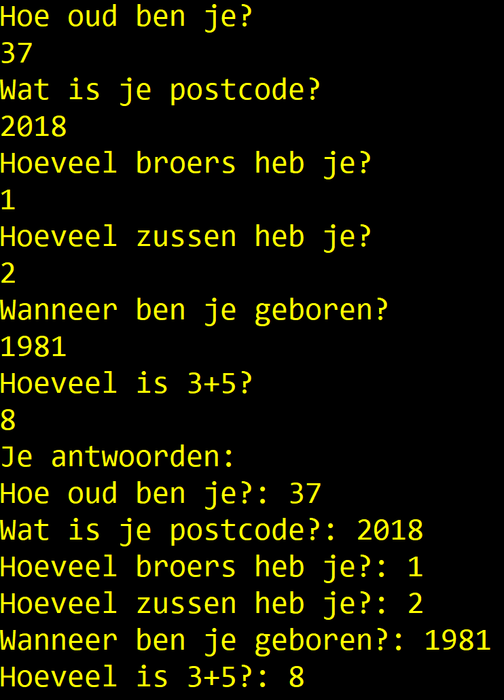
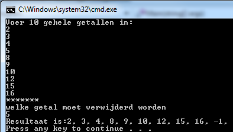

<!--# Oefeningen week 1-->


:::{.callout-tip}
Een aantal oefeningen is geïnspireerd op oefeningen van [Exercism.io](https://exercism.io/tracks/csharp/exercises).
:::
<!--# Oefeningen week 1-->


# Opwarmers

# Opwarmers

* Vul een array van ints met alle getallen van 1 tot 100. Druk de array af.
* Vul een array van ints met alle even getallen tot en met 100. Druk de array af.
* Vraag aan de gebruiker 3 keer een getal, stop deze in een array, druk deze array af.
* Maak een array aan en plaats daarin de 4 namen van je beste vrienden in volgorde van "beste vriend" tot "minst beste vriend". Toon nu de namen op het scherm, onder elkaar, met telkens ervoor "Beste vriend", "Tweede beste vriend", "Derde beste vriend", "Minst beste vriend".
*  Maak een array van 20 booleans en zorg dat alle oneven indexen False en de even True zijn. Druk vervolgens de array af.
* Maak een array van 20 bool-waarden. Deze waarden zijn willekeurig. Print de array. Toon hoeveel keer true en hoeveel keer false er in de array zit. Opgelet, je doet de visualisatie in aparte loop nadat je deze hebt aangemaakt. Voorts tel je de true en false variabelen in nog eens een aparte loop.
* Vul een array met 10 random doubles tussen 0 en 10. Toon het gemiddelde ervan.
* Maak een enum Schooltype met mogelijke waarden TSO, BSO, ASO, KSO. Maak een array van 20 Schooltype-waarden. Vul deze met willekeurige schooltypes. Toon de array. Toon hoe vaak ieder schooltype in de array voorkomt.


# Vraag Array (*Essential*)

# Vraag Array (*Essential*)
Maak een array die 6 strings kan bevatten. Ieder element van de array bevat een vraag (naar keuze te verzinnen) als string waar de gebruiker met een getal op moet antwoorden.
Maak een array aan die tot 6 ints kan bevatten. Lees 1 voor 1 de vraag uit de string-array uit en toon deze op het scherm. Lees vervolgens het antwoord uit dat de gebruiker intypt en bewaar dit als int in de 2e array.

Na de 6 vragen toon je vervolgens de vragen opnieuw met achter iedere vraag het antwoord van de gebruiker.





# LeveringsBedrijf (*Essential*)

# LeveringsBedrijf (*Essential*)
Maak een programma voor een koeriersbedrijf.  Maak een array die 10 postcodes bevat (zelf te kiezen) van gemeenten waar het bedrijf naar levert. Maak een tweede array die de prijs bevat per kg voor iedere respectievelijke gemeente.  Het eerste element  van deze array bevat dus de prijs/kg om naar de gemeente te leveren die als eerste in de array met postcodes staat.

Vraag aan de gebruiker een postcode en het gewicht van het pakket. Vervolgens wordt de prijs/kg opgezocht voor die gemeente en wordt de prijs berekend, gegeven het ingegeven gewicht.

Indien het bedrijf niet levert aan de ingetypte postcode dan wordt een foutmelding weergegeven.


```text
Geef gewicht pakket
>45
Naar welke postcode wenst u dit pakket te versturen?
>2020
Dit zal 9630 euro kosten.
```


# Bob

# Bob

Kan je "Bob" programmeren die als volgt werkt:

>Bob is a lackadaisical teenager. In conversation, his responses are very limited.
>Bob answers 'Sure.' if you ask him a question.
>He answers 'Whoa, chill out!' if you yell at him.
>He answers 'Calm down, I know what I'm doing!' if you yell a question at him.
>He says 'Fine. Be that way!' if you address him without actually saying anything.
>He answers 'Whatever.' to anything else."

Bekijk steeds de laatste 2 tekens die de gebruiker invoert om de response van Bob te bepalen. 

Kan je een gesofisticeerdere bot maken? 

:::{.callout-tip}
``myInputstring.Contains(somestring)`` geeft een ``bool`` terug indien ``somestring`` voorkomt in de variabele ``myInputstring`` van het type ``string``.
:::

Gebruik een array om de antwoorden in te bewaren. 


# Array Zoeker (*Essential*)

# Array Zoeker (*Essential*)

Maak een programma dat eerst aan de gebruiker 10 waarden vraagt die in een array worden gezet.

Vervolgens vraagt het programma welke waarde verwijderd moet worden. Wanneer de gebruiker hierop antwoordt met een nieuwe waarde dan zal deze nieuw ingevoerde waarde in de array gezocht worden. Indien deze gevonden wordt dan wordt deze waarde uit de array verwijderd en worden alle waarden die erachter komen met een plaatsje naar links opgeschoven, zodat achteraan de array terug een lege plek komt.

Deze laatste plek krijgt de waarde -1.

Toon vervolgens alle waarden van de array.

Indien de te zoeken waarde meer dan 1 keer voorkomt, wordt enkel de eerst gevonden waarde verwijderd.




# PRO: Bob++

# PRO: Bob++

Kan je met een array eerdere vragen van de gebruiker bewaren om zo complexere antwoorden te genereren?


# Hamming distance (*Essential*)

# Hamming distance (*Essential*)
De *hamming distance* is het aantal tekens dat twee reeksen verschillen indien we ieder element vergelijken op dezelfde plaats in de andere reeks.

Maak een programma dat aan de gebruiker vraagt om twee DNA strings in te voeren (een reeks bestaande uit de letters G, A, C & T). Beide reeksen moeten even lang zijn.

Bereken de hamming distance tussen beide reeksen.

De hamming distance van volgende twee DNA strings is 7, omdat er 7 elementen in beide strings staan die niet gelijk zijn aan mekaar op dezelfde plek (aangeduid met ``^``).

```
GAGCCTACTAACGGGAT
CATCGTAATGACGGCCT
^ ^ ^  ^ ^    ^^
```


# Password generator (PRO)

# Password generator (PRO)
Ontwerp een consoletoepassing waarmee je een wachtwoord genereert voor een gebruiker. Het wachtwoord is opgebouwd uit:

de 2 eerste letters van de familienaam: de 1ste letter is een hoofdletter, de 2de letter is een kleine letter. 
Daarna worden de 2 letters gewisseld;
het zonenummer van het telefoonnummer zonder de 0;
het eerste cijfer van de postcode in het kwadraat.

> Gebruik de ``ToCharArray()`` methode die je op een string kunt toepassen, zoals hier getoond: ``char[] chars = myEpicName.ToCharArray();`` 

:::{.callout-warning}
Schrijf nooit een paswoord manager die je paswoorden gortdroog als ``string`` bewaart. **Secure code** schrijven is een hele discipline op zich en laat je best nog even links liggen tot je C# goed in de vingers hebt.
:::


# Puzzelen met arrays (*Essential*)

# Puzzelen met arrays (*Essential*)

Sommige oefeningen zijn op randje van PRO. U weze gewaarschuwd.

:::{.callout-tip}
Je mag in deze oefeningen NIET gebruik maken van ``.Reverse()``, ``.BinarySearch()`` etc. Alles moet je manueel kunnen. Enkel sorteren mag je automatisch doen met ``.Sort()``.

Als er dus staat "lees 20 getallen in", dan moet je die in volgorde bewaren in je array. Vervolgens begin je die array te manipuleren.
:::

1.	Er worden 20 getallen ingelezen. De getallen worden in omgekeerde volgorde afgedrukt.
2.	Er worden 20 getallen ingelezen. De getallen worden 1 plaats naar voor verschoven afgedrukt, d.w.z. eerst het tweede ingelezen getal, dan het derde ingelezen getal, dan het vierde ingelezen getal , ... , dan het laatste ingelezen getal en tenslotte het eerste ingelezen getal.
3.	Er worden 20 getallen ingelezen. De getallen worden 3 plaatsen naar achter verschoven afgedrukt, d.w.z. eerst het derde laatste ingelezen getal, dan het voorlaatste ingelezen getal, dan het laatste ingelezen getal, dan het eerste ingelezen getal, dan het tweede ingelezen getal en tenslotte het vierde laatste ingelezen getal.
4.	Er worden 20 getallen ingelezen. De getallen worden geroteerd (verschoven) afgedrukt over een aantal elementen x zoals in de vorige opgave. Maak dus de vorige oefening maar nu is ``3`` een variabele die je op voorhand kan instellen.
5.	[Pro] Een rij van 100 getallen wordt ingelezen. Druk de inhoud van de rij af in 3 kolommen. De getallen worden gerangschikt rij per rij.  Als je input bijvoorbeeld volgende reeks getallen is: ``4 5 8 7 5 2 6 8 7 1 3 2``, dan wordt dit je output:
```csharp
4 5 8
2 5 7
6 7 8
1 2 3
```
6.	[Pro] Een rij van 100 getallen wordt ingelezen. Druk de inhoud van de rij af in 3 kolommen. De getallen worden gerangschikt kolom per kolom (hier mag je ``Sort`` gebruiken).


# Havenbeheer (Final Essentials)

# Havenbeheer (Final Essentials)

Je bent de havenmeester en moet de lading van een schip beheren.
Er is plaats voor een vast aantal containers (bijvoorbeeld 3).

Maak een programma dat:
1.  Twee arrays aanmaakt: één voor de **containercodes** (text) en één voor de **gewichten** (kommagetallen) in ton.
2.  Aan de gebruiker vraagt om de gegevens voor de containers in te voeren.
3.  Een **manifest** afdrukt: een lijst van alle containers met hun gewicht.
4.  Het **totaal gewicht** en het **gemiddelde gewicht** berekent en toont.
5.  De gebruiker toelaat om een container op te zoeken op basis van de code. Als de container gevonden wordt, toon je het gewicht. Zo niet, meld je dat deze nergens staat.

**Voorbeeld uitvoer:**

"Tekst die start met ">" is invoer van de gebruiker."

```text
Geef de code voor container 1:
> MAS88
Geef het gewicht voor container 1 (ton):
> 12,5
Geef de code voor container 2:
> XEL11
Geef het gewicht voor container 2 (ton):
> 4,2
Geef de code voor container 3:
> OPO99
Geef het gewicht voor container 3 (ton):
> 20

--- Manifest ---
Container MAS88: 12,5 ton
Container XEL11: 4,2 ton
Container OPO99: 20 ton

Totaal gewicht: 36,7 ton
Gemiddeld gewicht: 12,23 ton

Welke container zoek je?
> XEL11
Container XEL11 weegt 4,2 ton.
```


# Zwerkbaltraining (Final Essentials)

# Zwerkbaltraining (Final Essentials)

Tijdens de zwerkbaltraining wil Harry Potter bijhouden hoeveel punten de jagers (chasers) maken.
Er zijn 3 jagers die deelnemen.

Maak een programma dat:
1.  Twee arrays aanmaakt: één voor de **namen** (text) van de jagers en één voor hun **scores** (gehele getallen).
2.  Aan de gebruiker vraagt om de namen en de scores in te voeren.
3.  Een **overzicht** afdrukt van alle jagers met hun score.
4.  Het **totaal aantal punten** en de **gemiddelde score** berekent en toont.
5.  De gebruiker toelaat om de score van een jager op te zoeken op basis van de naam. Als de jager gevonden wordt, toon je de score. Zo niet, meld je dat deze niet meedeed.

**Voorbeeld uitvoer:**

"Tekst die start met ">" is invoer van de gebruiker."

```text
Geef de naam voor jager 1:
> Ginny
Geef de score voor jager 1:
> 40
Geef de naam voor jager 2:
> Katie
Geef de score voor jager 2:
> 30
Geef de naam voor jager 3:
> Demelza
Geef de score voor jager 3:
> 50

--- Wedstrijd Statistieken ---
Jager Ginny: 40 punten
Jager Katie: 30 punten
Jager Demelza: 50 punten

Totaal punten: 120
Gemiddelde score: 40

Welke jager zoek je?
> Katie
Jager Katie scoorde 30 punten.
```


::::{.callout-caution collapse="true" title="Oplossing"}
# Oplossingen deel 1

## Oplossing opwarmers


```java
int[] getallen = new int[100];
for (int i = 0; i < getallen.Length; i++)
{
    getallen[i] = i + 1;
}

for (int i = 0; i < getallen.Length; i++)
{
    Console.WriteLine(getallen[i]);
}
```

```java
int[] getallen = new int[51];
for (int i = 0; i < getallen.Length; i++)
{
    getallen[i] = i * 2;
}

for (int i = 0; i < getallen.Length; i++)
{
    Console.WriteLine(getallen[i]);
}
```

```java
int[] getallen = new int[3];
for (int i = 0; i < getallen.Length; i++)
{
    Console.WriteLine($"Geef getal {i+1}:");
    getallen[i] = int.Parse(Console.ReadLine());
}
Console.WriteLine("Array bevat:");

for (int i = 0; i < getallen.Length; i++)
{
    Console.WriteLine(getallen[i]);
}
```

```java
string[] vrienden = { "Vincent", "Olga", "Bill", "Gotoman" };
Console.WriteLine($"Beste vriend is  {vrienden[0]}");
Console.WriteLine($"Tweede beste vriend is  {vrienden[1]}");
Console.WriteLine($"Derde beste vriend is  {vrienden[2]}");
Console.WriteLine($"Minst vriend is  {vrienden[3]}");
```

```java 
bool[] bits = new bool[20];
for (int i = 0; i < bits.Length; i++)
{
    if (i % 2 == 1)
        bits[i] = false;
    else
        bits[i] = true;
}

for (int i = 0; i < bits.Length; i++)
{
    Console.WriteLine(bits[i]);
}
```


```java 
bool[] bits = new bool[20];
Random r = new Random();
for (int i = 0; i < bits.Length; i++)
{
    if (r.Next(0,2)==0)
        bits[i] = false;
    else
        bits[i] = true;
}

int pos = 0;
int neg = 0;
for (int i = 0; i < bits.Length; i++)
{
    Console.WriteLine(bits[i]);
    if (bits[i] == true)
        pos++;
    else
        neg++;
}

Console.WriteLine($"Aantal positief {pos}");
Console.WriteLine($"Aantal negatief {neg}");
```

```java 
double[] getallen = new double[10];
Random r = new Random();

for (int i = 0; i < getallen.Length; i++)
{
    getallen[i] = r.NextDouble() * 10;
}

double gemiddelde = 0;
for (int i = 0; i < getallen.Length; i++)
{
    gemiddelde += getallen[i];
}
Console.WriteLine($"Gemiddelde is {gemiddelde/getallen.Length}");
```

```java
enum SchoolType { BSO, ASO, TSO, KSO};
static void Main(string[] args)
{
    SchoolType[] lijst = new SchoolType[20];
    Random r = new Random();

    for (int i = 0; i < lijst.Length; i++)
    {
        lijst[i] = (SchoolType)r.Next(0, 4);
    }

    int aantalBSO = 0;
    int aantalKSO = 0;
    int aantalASO = 0;
    int aantalTSO = 0;

    for (int i = 0; i < lijst.Length; i++)
    {
        Console.WriteLine(lijst[i]);
        switch (lijst[i])
        {
            case SchoolType.BSO:
                aantalBSO++;
                break;
            case SchoolType.ASO:
                aantalASO++;
                break;
            case SchoolType.TSO:
                aantalTSO++;
                break;
            case SchoolType.KSO:
                aantalKSO++;
                break;
            default:
                break;
        }

    }

    Console.WriteLine($"Aantal BSO: {aantalBSO}");
    Console.WriteLine($"Aantal TSO: {aantalTSO}");
    Console.WriteLine($"Aantal ASO: {aantalASO}");
    Console.WriteLine($"Aantal KSO: {aantalKSO}");
}
```


## Array Zoeker
Om niet steeds 10 getallen tijdens testen te moeten invullen gebruik ik ``Random`` om snel 10 getallen willekeurig te genereren:

```java
int[] ar = new int[10];
Random rand = new Random();
for (int i = 0; i < ar.Length; i++)
{
    ar[i] = rand.Next(1, 100);
    Console.WriteLine(ar[i]);
}
Console.WriteLine("Welk getal moet verwijderd worden?");
int todel = Convert.ToInt32(Console.ReadLine());

//index van te zoeken getal zoeken
int index = -1;
bool found = false;
for (int i = 0; i < ar.Length; i++)
{
    if(!found && ar[i] == todel)
    {
        found = true;
        index = i;
    }
}

//alle elementen vanaf index met 1 plekje vooruitschuiven
if(found)
{
    for (int i = index; i < ar.Length-1; i++)
    {
        ar[i] = ar[i + 1];
    }
    ar[ar.Length - 1] = -1; //laatste element op -1
}

//Array tonen
for (int i = 0; i < ar.Length; i++)
{
    Console.WriteLine(ar[i]);
}
```

## Leveringsbedrijf

Je kan dit ook oplossen met ``BinarySearch`` maar dan moet je wel de postcodes gesorteerd plaatsen in de array (sorteren via ``Array.Sort`` in code zal niet werken daar dan de relatie met ``kgpergemeente`` verloren gaat).

```java
int[] postcodes = { 1000, 2020, 2013, 4500, 2340, 1200, 9999, 6666, 2362, 2340 };

int[] kgpergemeente = { 12, 214, 3, 15, 56, 900, 13, 5, 111, 43 };

Console.WriteLine("Geef gewicht pakket");
int gewicht = Convert.ToInt32(Console.ReadLine());
Console.WriteLine("Naar welke postcode wenst u dit pakket te versturen?");
int postcode = Convert.ToInt32(Console.ReadLine());

//Zoek postcode
bool gevonden = false;
int index = 0;
do
{

    if (postcodes[index] == postcode)
    {
        gevonden = true;
    }
    else
        index++;
} while (!gevonden && index < postcodes.Length);
//berekenprijs
if (gevonden)
{
    int prijs = gewicht * kgpergemeente[index];
    Console.WriteLine($"Dit zal {prijs} euro kosten.");
}
else
    Console.WriteLine("Postcode niet gevonden!");
```

## Hamming Distance
Methode ``IsRealDNA`` hoorde niet bij opgave, maar is handig als om extra gebruiksvriendelijkheid aan te bieden:
```java
static void Main(string[] args)
{
    Console.WriteLine("Geef DNA string 1");
    char[] dna1 = Console.ReadLine().ToCharArray();
    Console.WriteLine("Geef DNA string 2");
    char[] dna2 = Console.ReadLine().ToCharArray();
    if (dna1.Length == dna2.Length && IsRealDNA(dna1) && IsRealDNA(dna2))
    {
        int hamdist = 0;
        for (int i = 0; i < dna1.Length; i++)
        {
            if (dna1[i] != dna2[i])
                hamdist++;
        }
        Console.WriteLine($"Distance is {hamdist}");
    }
    else
    {
        Console.WriteLine("Error: DNA strings niet van gelijke lengte of bevat illegale tekens");
    }
}

static bool IsRealDNA(char[] dna)
{
    for (int i = 0; i < dna.Length; i++)
    {
        char tocheck = dna[i];
        if (tocheck != 'G' && tocheck != 'C' & tocheck != 'A' && tocheck != 'T')
            return false;
    }
    return true;
}
```

## Puzzelen met array

```java

static void Main(string[] args)
{
    const int LENGTE = 20;
    int[] arr = new int[LENGTE];
    Random r = new Random();
    Console.WriteLine("Start:");
    for (int i = 0; i < arr.Length; i++)
    {
        //Console.WriteLine($"Geef getal {i+1}");
        //arr[i]= int.Parse(Console.ReadLine());
        arr[i] = r.Next(1, 101);
        Console.Write($"{arr[i]},");
    }
    //Opwarmer 1
    Console.WriteLine("\nOpwarmer 1");
    for (int i = arr.Length - 1; i >= 0; i--)
    {
        Console.Write($"{arr[i]},");
    }
    //Opwarmer 2
    Console.WriteLine("\nOpwarmer 2");
    int[] moved = new int[arr.Length];
    for (int i = 0; i < arr.Length; i++)
    {
        moved[i] = arr[(i + 1) % LENGTE];
    }
    PrintArray(moved);
    //Opwarmer 3
    Console.WriteLine("\nOpwarmer 3");
    int[] moved3 = new int[arr.Length];
    for (int i = 0; i < arr.Length; i++)
    {
        moved3[(i+3)%LENGTE] = arr[i];
    }
    PrintArray(moved3);
    //Opwarmer 4
    Console.WriteLine("\nOpwarmer 4");
    Console.WriteLine("Hoeveel plaatsen opschuiven?");
    int aantal = int.Parse(Console.ReadLine());
    int[] moved4 = new int[arr.Length];
    for (int i = 0; i < arr.Length; i++)
    {
        moved4[(i + aantal) % LENGTE] = arr[i];
    }
    PrintArray(moved4);
    //Opwarmer 5
    Console.WriteLine("\nOpwarmer 5");
    const int GETALPERKOLOM = 3;
    for (int i = 2; i < arr.Length; i++)
    {
        if((i)% GETALPERKOLOM == 0)
        {
            int[] temp = new int[GETALPERKOLOM];
            for (int j = 0; j < temp.Length; j++)
            {
                temp[j] = arr[i + j - GETALPERKOLOM];
            }
            Array.Sort(temp);
            for (int k = 0; k < temp.Length; k++)
            {
                Console.Write($" {temp[k]}");
            }
            Console.WriteLine();
        }
    }
    static void PrintArray(int[] inarr)
    {
        for (int i = 0; i < inarr.Length; i++)
        {
            Console.Write($"{inarr[i]},");
        }
    }
```

Opwarmer 6
```java
static void Main(string[] args)
{
    Random r = new Random();
    int[] getallen = new int[100];
    const int kolomBreedte = 3;

    //We simuleren input gebruiker met Random
    for (int i = 0; i < getallen.Length; i++)
    {
        getallen[i] = r.Next(0, 100);
    }


    for (int i = 0; i < getallen.Length/kolomBreedte; i++)
    {
        int[] kolom = new int[kolomBreedte];
        for (int j = 0; j < kolomBreedte; j++)
        {
            kolom[j] = getallen[i * kolomBreedte + j];
        }
        SorteerEnToonArray(kolom);
    }

    // Dit gedeelte is nodig indien de originele array geen exact veelvoud van het aantal elementen per deelarray
    int overschot = getallen.Length % kolomBreedte;
    if(overschot !=0)
    {
        int[] kolom = new int[overschot];
        for (int i = 0; i < overschot; i++)
        {
            kolom[i] = getallen[getallen.Length - 1 - i];
        }
        SorteerEnToonArray(kolom);
    }
}

private static void SorteerEnToonArray(int[] kolom)
{
    Array.Sort(kolom);
    for (int k = 0; k < kolom.Length; k++)
    {
        Console.Write($"{kolom[k]} ");
    }
    Console.WriteLine();
}
```
## Vraag Array
```java
string[] vragen =
{
    "Hoe oud ben je?",
    "Wat is je postcode?",
    "Hoeveel broers heb je?",
    "Hoeveel zussen heb je?",
    "Wanneer ben je geboren?",
    "Hoeveel is 3+5?"
};
int[] antwoorden = new int[vragen.Length];

for (int i = 0; i < vragen.Length; i++)
{
    Console.WriteLine(vragen[i]);
    antwoorden[i] = Convert.ToInt32(Console.ReadLine());
}

Console.WriteLine("Je antwoorden:");
for (int i = 0; i < vragen.Length; i++)
{
    Console.WriteLine($"{vragen[i]}: {antwoorden[i]}");
}
```

::::
