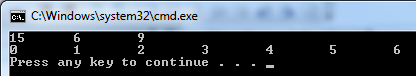
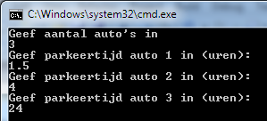
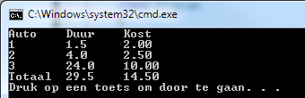
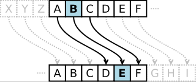

<!--# Oefeningen week 2: Arrays-->

:::{.callout-tip}
Voor de volgende oefeningen dien je telkens zelf te bepalen welke methoden (met bijhorende parameters en return types) nodig zijn om tot een gestructureerde oplossing te komen.
:::
<!--# Oefeningen week 2: Arrays-->


# Array Viewer (*Essential*)

# Array Viewer (*Essential*)

Schrijf een herbruikbare methode die de inhoud van een integer-array visueel weergeeft in de console.

**Functionele vereisten:**
*   De methode moet werken voor arrays van willekeurige grootte.
*   Alle elementen worden op één regel getoond.
*   Tussen de elementen wordt een tab-karakter geplaatst voor de spatiëring.
*   Zorg voor een correcte afhandeling van het laatste element: plaats **geen** tab na het laatste element.

**Demonstratie:**
Toon de werking aan in je `Main`-methode met minstens twee verschillende arrays.

**Verwachte output:**


---


# Parkeergarage (*Essential*)

# Parkeergarage (*Essential*)

Ontwikkel een applicatie die parkeerkosten berekent. De applicatie moet eerst vragen hoeveel auto's er verwerkt moeten worden, en vervolgens per auto de parkeerduur opvragen.

**Tarieven:**
Het basistarief bedraagt € 2,00 voor een parkeerduur tot en met 3 uur. Indien er langer geparkeerd wordt, wordt er na deze 3 uur een supplement aangerekend van € 0,50 per begonnen uur.
De maximale dagprijs is begrensd op € 10,00. Je mag ervan uitgaan dat een auto nooit langer dan 24 uur parkeert.

**Technische vereisten:**
*   Zorg voor een indeling in logische methodes. Denk bijvoorbeeld aan een methode die de kosten berekent voor één specifieke parkeerbeurt.
*   Het eindresultaat moet een overzichtstabel zijn die per auto de duur en de kostprijs toont, gevolgd door een totaalbedrag.

**Voorbeeldoutput:**





---


# Caesar-encryptie

# Caesar-encryptie

Implementeer het Caesar-algoritme om tekst te versleutelen en te ontcijferen.

**Algoritme:**
Bij dit systeem wordt elke letter in de tekst vervangen door een letter die een vast aantal plaatsen verderop in het alfabet staat. Wanneer het einde van het alfabet bereikt wordt, telt men verder vanaf 'A' (cyclische verschuiving).
Bijvoorbeeld: bij een verschuiving van 3 wordt 'A' een 'D', 'B' een 'E', enzovoort. 'Z' wordt in dit geval 'C'.

**Formule:**
Gebruik de formule: `nieuweIndex = (oudeIndex + sleutel) % 26` (waarbij A=0, B=1, ...).

**Opdracht:**
Schrijf een programma dat de gebruiker om een tekst en een sleutel (verschuiving) vraagt. Het programma moet in staat zijn om de tekst te versleutelen en nadien de versleutelde tekst weer correct te ontsleutelen.
Je oplossing moet gebruik maken van arrays van karakters (`char[]`) voor de interne verwerking.



---


# Ondernemingsnummer 

# Ondernemingsnummer 

Schrijf een validatie-methode voor Belgische ondernemingsnummers.

Een ondernemingsnummer (formaat: `BE 0xxx.xxx.xxx`) is geldig als het voldoet aan volgende controle:
Wanneer men de eerste 7 cijfers (na de '0') als één getal beschouwt, en men berekent de rest bij deling door 97, dan moet 97 min deze rest gelijk zijn aan de laatste 2 cijfers van het nummer.

**Vereiste:**
De methode accepteert het nummer als string (inclusief "BE", spaties en punten) en geeft aan of dit geldig is of niet.

---


# Puzzelen met arrays deel 2 (*Essential*)

# Puzzelen met arrays deel 2 (*Essential*)

Analyseer onderstaande problemen en implementeer de oplossingen. Let goed op het onderscheid tussen het aanmaken van een **nieuwe** array en het **aanpassen** van een bestaande array.

1.  **Omkeren (Nieuw)**: Lees getallen in en produceer een nieuwe array met de elementen in omgekeerde volgorde.
2.  **Omkeren (Mutatie)**: Keer de volgorde van de elementen om in de array zelf (in-place).
3.  **Verschuiven (Mutatie)**: Roteer de inhoud van de array 1 positie naar links. Het eerste element verhuist naar de laatste positie.
4.  **Verschuiven (Nieuw)**: Idem als bovenstaande, maar het resultaat komt in een nieuwe array; de originele blijft ongewijzigd.
5.  **Verschuiven met X (Nieuw)**: Roteer de elementen 3 posities naar links in een nieuwe array.
6.  **Verschuiven met X (Mutatie)**: Roteer de elementen 3 posities naar links in de array zelf.
7.  **Uniek (Nieuw)**: Filter een array zodat alle dubbele waarden verwijderd zijn.
8.  **Uniek en Gesorteerd (Nieuw)**: Filter een array die reeds gesorteerd is, zodat dubbels verwijderd zijn. Omdat de lijst gesorteerd is, staan gelijke waarden naast elkaar. Je hoeft dus enkel elk element met het vorige element te vergelijken.
9.  **Analyse Max**: Bepaal het maximum van een reeks getallen, hoe vaak dit voorkomt, en de index van de *eerste* keer dat dit maximum voorkomt.
10. **Analyse Min**: Bepaal het minimum, hoe vaak dit voorkomt, en de index van de *laatste* keer dat dit minimum voorkomt.
11. **Aantal Verschillende**: Tel hoeveel unieke getallen er voorkomen in een reeks.
12. **[PRO] Zeef van Eratosthenes**: Genereer alle priemgetallen kleiner dan 100.000.
    *   Maak een lijst van alle getallen van 2 tot 100.000 (initieel allemaal "mogelijk priem").
    *   Begin bij 2: streep alle veelvouden van 2 weg (behalve 2 zelf).
    *   Ga naar het volgende niet-weggestreepte getal (3) en streep alle veelvouden weg.
    *   Herhaal dit proces.

---


# Determinant (*Essential*)

# Determinant (*Essential*)

Programmeer een module om de determinant van een matrix te berekenen.

**Opdracht:**
Begin met ondersteuning voor een 2x2 matrix. De determinant van een matrix `[[a, b], [c, d]]` bereken je als `(a * d) - (b * c)` (kruisproduct).
Zorg ervoor dat je oplossing gebruik maakt van meerdimensionale arrays (`[,]`).

**Uitbreidbaarheid:**
Denk na over hoe je de code zou structureren om later ook 3x3 matrices te ondersteunen.

**Test data:**
Voor matrix $\begin{pmatrix} 2 & 4 \\ 3 & 5 \end{pmatrix}$ is het resultaat -2.

---


# 2D Array Viewer

# 2D Array Viewer

Breid je eerdere visualisatie-methode (ArrayViewer) uit zodat deze ook correct werkt voor 2D-matrices (rijen en kolommen proper uitgelijnd).


# MatrixMultiplier

# MatrixMultiplier

Implementeer het matrixproduct van twee matrices $A$ en $B$. Zorg voor een correcte controle op de dimensies (aantal kolommen van A moet gelijk zijn aan aantal rijen van B).


# Voetbalcoach (*Essential*)

# Voetbalcoach (*Essential*)

Een team wenst statistische analyse uit te voeren op de prestaties van hun spelers (rugnummers 1 t.e.m. 12).
Er moeten twee types acties bijgehouden worden: **positieve** en **negatieve**.
**Opdracht:**
Schrijf een programma dat interactief data kan invoeren. De gebruiker geeft een rugnummer en het type actie in (gebruik 'P' voor positief, 'N' voor negatief), gevolgd door het aantal keer dat deze actie voorkwam.
De gebruiker bepaalt zelf wanneer de invoer stopt.

Na afloop toont het programma een rapport met:
*   Per speler: aantal positieve acties, negatieve acties en het netto resultaat (positief - negatief).
*   Een aanduiding van de meest en minst performante speler(s).

Een typische invoer kan dus zijn:
 
```text
2
P
6
```

De coach kiest dus de speler met rugnummer 2, kiest voor een positieve actie ('P'), en voert 6 in als aantal.

In de array op index 1 (rugnummer -1) zal in de 0'de kolom (0 = positieve, 1 = negatieve) het getal 6 geplaatst worden.

Vervolgens kan de coach een ander rugnummer (of hetzelfde) invoeren en zo verder.

Wanneer de coach 99 invoert stopt het programma en worden de finale statistieken getoond

```text
Rugnummer   Positief   Negatief   Verschil
1               5       2        3
2               6       7       -1
```


---


# Robot Simulator (PRO)

# Robot Simulator (PRO)

Simuleer de bewegingen van een robot op een rooster.
De robot start op een bepaalde coördinaat en kijkt in een bepaalde windrichting (N, O, Z, W).

De robot accepteert een string van commando's:
*   'R': Draai 90 graden rechtsom.
*   'L': Draai 90 graden linksom.
*   'A': Zet een stap vooruit in de huidige richting.

**Doel:**
Bepaal de eindcoördinaat en eindrichting na het uitvoeren van een reeks commando's.

---


# Galgje (PRO)

# Galgje (PRO)

Implementeer het klassieke spel "Galgje".

**Vereisten:**
*   Het programma kiest een woord (hardcodeer initieel één woord om makkelijk te testen, maak het daarna willekeurig uit een lijstje).
*   De speler krijgt precies 10 pogingen.
*   Bij elke beurt raadt de speler een letter.
*   De output moet de huidige status tonen (geraden letters zichtbaar, onbekende als `*`).

---


# Grote Som (PRO)

# Grote Som (PRO)

Schrijf een methode die de som berekent van een willekeurige hoeveelheid integers.
De methode moet zo ontworpen zijn dat ze kan aangeroepen worden met eender welk aantal argumenten (bv. `Som(1, 2)` maar ook `Som(1, 2, 3, 4, 5)`).

Onderzoek welke C# language feature hiervoor gebruikt kan worden.


# Fraude Detectie (Final Essentials)

# Fraude Detectie (Final Essentials)

Tijdens de examens vermoedt de leerkracht dat er gespiekt wordt. Schrijf een programma dat kan detecteren of twee studenten opvallend vaak dezelfde fouten maken.

**Opdracht:**

1.  Vraag de gebruiker om de **correcte antwoordsleutel** van het examen in te geven (een reeks letters, bijv. "ABCDA").
2.  Vraag vervolgens de antwoorden van **twee studenten**.
3.  Bereken en toon de **score** voor elke student (1 punt per juist antwoord).
4.  Vergelijk de antwoorden van beide studenten op verdachte patronen:
    *   Als beide studenten op dezelfde vraag **hetzelfde foute antwoord** geven, telt dit als een "verdachte gelijkenis".
5.  Toon het aantal verdachte gelijkenissen.
6.  Als dit aantal **2 of hoger** is, toon dan een duidelijke waarschuwing: "FRAUDE ALARM!".

**Technische tips:**

*   Gebruik een `for`-lus om door de letters van de string (of char-array) te lopen.
*   Strings kunnen net als arrays benaderd worden met een index (bijv. `antwoord[i]`).

**Voorbeeldoutput:**

"Tekst die start met ">" is invoer van de gebruiker."

```text
Geef de correcte examensleutel:
> ABCDE

Geef de antwoorden van Student 1:
> AABDD
Score Student 1: 3/5

Geef de antwoorden van Student 2:
> AACDD
Score Student 2: 3/5

Aantal verdachte gelijkenissen: 1
Geen fraude gedetecteerd.
```

*Tweede scenario (met fraude):*

```text
Geef de correcte examensleutel:
> ABCDE

Geef de antwoorden van Student 1:
> AACDD
Score Student 1: 3/5

Geef de antwoorden van Student 2:
> AACDD
Score Student 2: 3/5

Aantal verdachte gelijkenissen: 2
FRAUDE ALARM!
```


::::{.callout-caution collapse="true" title="Oplossing"}

# Oplossingen deel 2

## ArrayViewer

```java
static void VisualiseerArray(int[] array)
{
    for (int i = 0; i < array.Length-1; i++)
    {
        Console.Write($"{array[i]}\t");
    }
    Console.WriteLine($"{array[array.Length-1]}");
}
```

## Parkeergarage

```java
static void Main()
{
    Console.WriteLine("Geef aantal auto's in:");
    int aantal = Convert.ToInt32(Console.ReadLine());

    double[] duur = new double[aantal];

    for (int i = 0; i < duur.Length; i++)
    {
        Console.WriteLine($"Geef parkeertijd auto {i + 1} in (uren)");
        duur[i] = Convert.ToDouble(Console.ReadLine());

    }

    ToonResultaat(duur);
}

static void ToonResultaat(double[] duur)
{
    double somDuur = 0;
    double somKost = 0;
    Console.WriteLine("Auto\tDuur\tKost");
    for (int i = 0; i < duur.Length; i++)
    {
        double kost = BerekenKosten(duur[i]);
        somKost += kost;
        somDuur += duur[i];
        
        Console.WriteLine($"{i+1}\t{duur[i]}\t{kost}");
    }
    Console.WriteLine($"Totaal\t{somDuur}\t{somKost}");
}

static double BerekenKosten(double duur)
{

    double kost = 2;
    if (duur > 3)
    {
        double extra = Math.Ceiling(duur - 3);
        kost += (extra * 0.5);

    }
    if (kost > 10)
    {
        kost = 10;
    }
    return kost;
}
```


## Caesar Encryptie

```java
static char[] DeCrypt(char[] cipertext, int key)
{
    return Encrypt(cipertext, -key);
}

static char[] Encrypt(char[] plaintext, int key)
{
    char[] result = new char[plaintext.Length];
    //werkt enkel voor kleine letters
    for (int i = 0; i < plaintext.Length; i++)
    {
        if (plaintext[i] == ' ')
            result[i] = ' ';
        else
        {
            int newchar = (int)plaintext[i] + key;
            if (newchar > 122) //nodig voor encrypt
                newchar -= 26;
            else if (newchar < 97) //nodig voor decrypt
                newchar += 26;

            result[i] = (char)newchar;
        }
    }
    return result;
}
```

## Determinant

```java
static int BerekenDeterminant(int[,] aMatrix)
{
    return aMatrix[0, 0] * aMatrix[1, 1] - aMatrix[0, 1] * aMatrix[1, 0];
}
```

## Robot simulator

```java
enum Richtingen {Noord, Oost, Zuid, West};
static void Main(string[] args)
{
    int x = 7;
    int y = 3;
    Richtingen richting = Richtingen.Noord;
    bool[,] map = new bool[20, 20];

    string tekst = "AALAALALAAARAARAA";

    char[] opdrachten = tekst.ToCharArray();

    for (int i = 0; i < opdrachten.Length; i++)
    {
        switch (opdrachten[i])
        {
            case 'R':
                richting = RoteerRechts(richting);
                break;
            case 'L':
                richting = RoteerLinks(richting);
                break;
            case 'A':
                //missing: checken dat er niet uit randen wordt gegaan
                switch (richting)
                {
                    case Richtingen.Noord:
                        y--;
                        break;
                    case Richtingen.Oost:
                        x++;
                        break;
                    case Richtingen.Zuid:
                        y++;
                        break;
                    case Richtingen.West:
                        x--;
                        break;
                    default:
                        break;
                }
                map[x, y] = true;
                break;
        }
        TekenKaart(map);
        Console.ReadKey();
    }
}

private static void TekenKaart(bool[,] map)
{
    Console.Clear();
    for (int i = 0; i < map.GetUpperBound(0); i++)
    {
        for (int j = 0; j < map.GetUpperBound(1); j++)
        {
            if (map[j, i] == false)
                Console.Write(".");
            else
                Console.Write("X");
        }
        Console.Write(Environment.NewLine);
    }
}

private static Richtingen RoteerLinks(Richtingen richting)
{
    switch (richting)
    {
        case Richtingen.Noord:
            return Richtingen.West;
            break;
        case Richtingen.Oost:
            return Richtingen.Noord;
            break;
        case Richtingen.Zuid:
            return Richtingen.Oost;
            break;
        case Richtingen.West:
            return Richtingen.Zuid;
            break;
    }
    return Richtingen.Noord;
}

private static Richtingen RoteerRechts(Richtingen richting)
{
    switch (richting)
    {
        case Richtingen.Noord:
            return Richtingen.Oost;
            break;
        case Richtingen.Oost:
            return Richtingen.Zuid;
            break;
        case Richtingen.Zuid:
            return Richtingen.West;
            break;
        case Richtingen.West:
            return Richtingen.Noord;
            break;
    }
    return Richtingen.Noord;
}
```

::::
