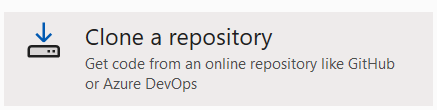
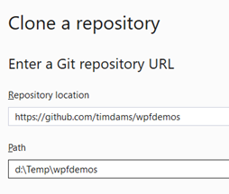

<!--# Week 1: Oefeningen-->


:::{.callout-tip}
Je hebt nu geleerd hoe je met **structs** orde schept in de chaos van losse variabelen. Je bent van "losse rommel" naar "nette dozen" gegaan.
Maar... heb je gemerkt dat die dozen nogal passief zijn? Ze doen niks, tenzij jij er een aparte methode op loslaat.

We gaan nu effectief de leerstof van hoofdstuk 9 toepassen: de volgende stap is **Object Oriented Programming (OOP)**.

In het intermezzo van vorige week had je een `StudentData` struct. Die bevatte wel de cijfers, maar kon zelf zijn gemiddelde niet berekenen. Je moest die struct telkens doorgeven aan een externe "manager" (jouw methodes).

```csharp
// De struct is passief (data)
StudentData alex = ...;

// De actie moet buitenaf gebeuren
double avg = CalculateAverage(alex); 
```

Dit voelt alsof je een auto hebt, maar je moet hem zelf duwen.

**De Oplossing: Slimme Objecten (Classes)**

In OOP gaan we onze dozen (structs) upgraden naar **Classes**. Een Class is niet zomaar een container voor data. Het is een volwaardig object dat **weet wat het moet doen**.

We verplaatsen de logica (de methodes) **IN** de doos.

*   **Vroeger (Struct):** Een lijstje met ingrediënten (Data).
*   **Nu (Class):** Een Chef-kok die de ingrediënten heeft én weet hoe hij ze moet koken (Data + Gedrag).

```csharp
// Het object is slim (data + gedrag)
Student alex = new Student("Alex", 12, 14);

// Het object doet het werk zelf!
double avg = alex.CalculateAverage();
```

Zie je het verschil? We hoeven `alex` niet meer door te geven. Alex **weet** zelf zijn cijfers en **berekent** zelf zijn gemiddelde.

:::


:::{.callout-warning}
In dit en volgend hoofdstuk staan bij sommige oefeningen bovenaan een link naar een alternatieve manier van de oefening te maken waarbij je ook feedback krijgt. [Bekijk zeker eerst dit filmpje](https://ap.cloud.panopto.eu/Panopto/Pages/Viewer.aspx?id=a79f075c-7ac7-4a66-97d4-ae2a00dca02a). **Indien je geen knop "open in visual studio" hebt in github** dan kan je dit oplossen als volgt: open Visual studio en kies voor *clone a repository*:



Vervolgens copy paste je de githu-burl als daar om gevraagd wordt  (voor de eerste oefening is dat https://github.com/timdams/ZIESCHERPER_TESTS_H1_RapportModule). 



:::


# RapportModule (*Essential*)

# RapportModule (*Essential*)

:::{.callout-tip}
[Maak je oplossing in een kopie van volgende solution met bijhorende unittests](https://github.com/timdams/ZIESCHERPER_TESTS_H1_RapportModule).
:::

:::{.callout-warning}
Opgelet: de unittests projecten werden nog geschreven in .NET 7. Je zal een error krijgen dat je .NET 7 SDK moet installeren. Je kan dit oplossen door te rechterklikken op beide projecten in je solution en te kiezen voor "edit project file". Daar verander je de `TargetFramework` van `net7.0` naar `net10.0` als je met VS 2026 werkt, of naar `net9.0` als je met VS 2022 werkt. Bewaar en probeer opnieuw te runnen.

Dit geldt voor alle volgende oefeningen waarbij je een link krijgt naar een solution met unittests.
:::


**Doel:**
Ontwerp een klasse die een graad berekent op basis van een behaald percentage.

**Specificaties:**
*   **Klassenaam:** `Rapport`
*   **Properties:**
    *   `Percentage` (type: `int`): Het behaalde punt.
*   **Methoden:**
    *   `PrintGraad()` (type: `void`): Toont de graad in de console.

**Werking (Business Rules):**
De methode `PrintGraad` controleert de waarde van `Percentage` en toont de bijbehorende tekst:

| Frequentie | Output Tekst |
| :--- | :--- |
| Minder dan 50 | "Niet geslaagd" |
| 50 t.e.m. 68 | "Voldoende" |
| 69 t.e.m. 75 | "Onderscheiding" |
| 76 t.e.m. 85 | "Grote onderscheiding" |
| Meer dan 85 | "Grootste onderscheiding" |

**Voorbeeldgebruik:**
Test je klasse met volgende code in `Main`:

```csharp
Rapport mijnPunten = new Rapport();
mijnPunten.Percentage = 65;
mijnPunten.PrintGraad(); // Verwachte output: "Voldoende"

Rapport mijnVriendPunten = new Rapport();
mijnVriendPunten.Percentage = 89;
mijnVriendPunten.PrintGraad(); // Verwachte output: "Grootste onderscheiding"
```

Controleer je oplossing ook via **Test => Run All Tests**.


# Nummers (*Essential*)

# Nummers (*Essential*)

:::{.callout-tip}
[Maak je oplossing in een kopie van volgende solution met bijhorende unittests](https://github.com/timdams/ZIESCHERPER_TESTS_H1_Nummers).
:::

**Doel:**
Maak een rekenmachine-klasse die bewerkingen uitvoert op twee getallen.

**Specificaties:**
*   **Klassenaam:** `NummerBerekenaar`
*   **Properties:**
    *   `Getal1` (type: `int`): Het eerste getal.
    *   `Getal2` (type: `int`): Het tweede getal.
*   **Methoden:**
    *   `Som()`: returntype `int`
    *   `Verschil()`: returntype `int`
    *   `Product()`: returntype `int`
    *   `Quotient()`: returntype `double`

**Werking:**
*   `Som`, `Verschil`, `Product`: Voeren de standaard wiskundige bewerking uit (`+`, `-`, `*`) en geven het resultaat terug.
*   `Quotient`: Deelt `Getal1` door `Getal2`.
    *   *Let op:* Delen door nul mag niet.
    *   **Als Getal2 gelijk is aan 0:** Toon foutboodschap "Kan niet delen door 0" in de console EN geef `0.0` terug.
    *   **Anders:** Geef het resultaat van de deling terug.

**Voorbeeldgebruik:**
```csharp
NummerBerekenaar paar1 = new NummerBerekenaar();
paar1.Getal1 = 12;
paar1.Getal2 = 34;

Console.WriteLine($"Som = {paar1.Som()}");      // Output: 46
Console.WriteLine($"Verschil = {paar1.Verschil()}"); // Output: -22
```


# Studentklasse (*Essential*)

# Studentklasse (*Essential*)

:::{.callout-tip}
[Maak je oplossing in een kopie van volgende solution met bijhorende unittests](https://github.com/timdams/ZIESCHERPER_TESTS_H1_Studentklasse).
:::

**Doel:**
Sla gegevens van een student op en bereken het gemiddelde.

**Specificaties:**
*   **Klassenaam:** `Student`
*   **Enum:** `Klassen` (definieer deze *buiten* de klasse, mogelijke waarden: `TI1`, `TI2`, `TI3`)
*   **Properties:**
    *   `Naam` (`string`)
    *   `Leeftijd` (`int`)
    *   `Klas` (`Klassen` - gebruik de enum hierboven)
    *   `PuntenCommunicatie` (`int`)
    *   `PuntenProgrammingPrinciples` (`int`)
    *   `PuntenWebTech` (`int`)
*   **Methoden:**
    *   `BerekenGemiddelde()`: Geeft het gemiddelde van de 3 puntenvakken terug als `double`.
    *   `GeefOverzicht()`: Toont een rapport in de console (zie voorbeeld).

**Voorbeeldgebruik:**

```csharp
Student student1 = new Student();
student1.Klas = Klassen.TI1;
student1.Naam = "Joske Vermeulen";
student1.Leeftijd = 21;
student1.PuntenCommunicatie = 12;      
student1.PuntenProgrammingPrinciples = 15;
student1.PuntenWebTech = 13;

student1.GeefOverzicht();
```

**Verwachte Output:**
```text
Joske Vermeulen, 21 jaar
Klas: TI1

Cijferrapport:
**********
Communicatie:             12
Programming Principles:   15
Web Technology:           13
Gemiddelde:               13.3333333333
```


# PizzaTime

# PizzaTime

:::{.callout-tip}
[Maak je oplossing in een kopie van volgende solution met bijhorende unittests](https://github.com/timdams/ZIESCHERPER_TESTS_H1_PizzaTime).
:::

**Doel:**
Maak een klasse `Pizza` die waarden controleert voordat ze worden opgeslagen.

**Specificaties:**
*   **Klassenaam:** `Pizza`
*   **Properties** (Full Properties met validatie):
    *   `Toppings` (`string`): Beschrijving van de toppings.
    *   `Diameter` (`int`): Doorsnede in cm.
    *   `Price` (`double`): Prijs in euro.

**Validatie Regels (in de `set` van de properties):**
Bij het toewijzen van een nieuwe waarde (`value`), controleer het volgende. Indien de waarde **niet** geldig is, doe je niets (de oude waarde blijft behouden).

1.  **Price en Diameter:** Moeten groter zijn dan 0. (Indien `value <= 0` -> negeer).
2.  **Toppings:** Mag niet leeg zijn. (Gebruik `string.IsNullOrWhiteSpace(value)` om te controleren. Indien `true` -> negeer).

**Voorbeeldgebruik:**
Maak in je Main enkele pizza's aan en probeer foute waarden in te stellen om te testen of ze inderdaad geweigerd worden.


# Figuren

# Figuren

:::{.callout-tip}
[Maak je oplossing in een kopie van volgende solution met bijhorende unittests](https://github.com/timdams/ZIESCHERPER_TESTS_H1_Figuren).
:::

**Doel:**
Werken met overerving of losse klassen (hier losse klassen) en validatie.

**Specificaties:**

| Klasse | Property | Type | Validatie in `set` |
| :--- | :--- | :--- | :--- |
| **Rechthoek** | `Lengte` | `int` | Indien `value < 1`, verander niets. Anders `value`. |
| | `Breedte` | `int` | Indien `value < 1`, verander niets. Anders `value`. |
| | **Methode:** `ToonOppervlakte()` | `void` | Berekent Lengte * Breedte en toont resultaat. |
| **Driehoek** | `Basis` | `int` | Indien `value < 1`, verander niets. Anders `value`. |
| | `Hoogte` | `int` | Indien `value < 1`, verander niets. Anders `value`. |
| | **Methode:** `ToonOppervlakte()` | `void` | Berekent (Basis * Hoogte) / 2 en toont resultaat. |

*Let op: `Rechthoek` en `Driehoek` zijn hier twee aparte klassen en hebben niets met elkaar te maken, behalve dat ze toevallig gelijkaardige methoden hebben.*

**Opdracht:**
Maak van elke figuur een instantie in je `Main` en roep `ToonOppervlakte` aan.


# MiniRPG (*Final Essentials*)

# MiniRPG (*Final Essentials*)


:::{.callout-tip}
Een *Final Essentials* oefening is een opgave waarin alle leerstof van de voorbije oefeningen aan bod komt. 
:::

**Doel:**
Bouw een mini-RPG systeem waarin je een held aanmaakt, traint en laat vechten.


**Deel 1: De Setup**

Maak eerst de nodige basisstructuur aan.

1.  **Enum `HeldType`**: Definieer deze *buiten* je klasse.
    *   Opties: `Krijger`, `Magiër`, `Boogschutter`.

2.  **Klasse `Held`**:
    *   **Properties:**
        *   `Naam` (`string`): Mag niet leeg zijn. Indien leeg, stel in op "Naamloze Held".
        *   `Type` (`HeldType`): Het type van de held.
        *   `Level` (`int`): *Private set*. Begint altijd op **1**.
        *   `XP` (`int`): Experience Points. *Private set*. Begint op **0**.
        *   `Levenspunten` (`int`): Huidige HP. Mag niet onder 0 gaan.
        *   `MaxLevenspunten` (`int`): Read-only property die volgende formule gebruikt: `100 + (Level * 10)`. (Bij level 1 is dit dus 110).

**Deel 2: De Actie**

Voeg nu gedrag toe aan je held.

3.  **Methoden:**
    *   `VerkrijgErvaring(int punten)` (`void`):
        *   Tel `punten` op bij `XP`.
        *   **Level Up Logica:** Elke 100 XP stijgt de held een level.
        *   *Zolang* `XP >= 100`:
            *   Verminder XP met 100.
            *   Verhoog `Level` met 1.
            *   Verhoog `Levenspunten` met 10 (omdat MaxHP ook stijgt).
            *   Toon: *"Level Up! [Naam] is nu level [Level]!"*

    *   `ValAan()` (`int`):
        *   Genereert schade gebaseerd op het `Level` en een basiswaarde.
        *   Formule: `10 + Level`. (Simpel gehouden voor nu).
        *   Return dit getal.

    *   `IncasseerSchade(int schade)` (`void`):
        *   Trek `schade` af van `Levenspunten`.
        *   Zorg dat `Levenspunten` niet onder 0 zakt (controleer dit in de property setter of hier).
        *   Als `Levenspunten` 0 bereikt: Toon *"[Naam] is verslagen..."*.

    *   `ToonStats()` (`string`):
        *   Geeft een samenvatting terug, bv:
        *   *"[Naam] (Level [Level] [Type]) - HP: [Levenspunten]/[MaxLevenspunten] - XP: [XP]"*

**Voorbeeldgebruik in Main:**

```csharp
Held conan = new Held();
conan.Naam = "Conan";
conan.Type = HeldType.Krijger;
conan.Levenspunten = conan.MaxLevenspunten;

Console.WriteLine(conan.ToonStats()); 
// Output: Conan (Level 1 Krijger) - HP: 110/110 - XP: 0

// Conan traint
conan.VerkrijgErvaring(150); 
// Output: Level Up! Conan is nu level 2!

Console.WriteLine(conan.ToonStats());
// Output: Conan (Level 2 Krijger) - HP: 120/120 - XP: 50

// Conan vecht
int schade = conan.ValAan();
Console.WriteLine($"Conan doet {schade} schade.");

// Conan wordt geraakt
conan.IncasseerSchade(50);
Console.WriteLine(conan.ToonStats());
// Output: Conan (Level 2 Krijger) - HP: 70/120 - XP: 50
```

**Extra Uitdaging (Optioneel):**
Maak de `ValAan` methode slimmer gebaseerd op `HeldType`.
*   `Krijger`: Doet `10 + (Level * 2)` schade (fysiek sterk).
*   `Magiër`: Doet `5 + (Level * 3)` schade (begint zwak, wordt heel sterk).
*   `Boogschutter`: Doet `8 + (Level * 2)` schade.


::::{.callout-caution collapse="true" title="Oplossing"}


# Oefeningen

## RapportModule

```java
public class Rapport
{
    public int Percentage {get;set;}
    public void PrintGraad()
    {
        if(Percentage < 50)
            Console.WriteLine("Niet geslaagd");
        else if(Percentage <= 68)
            Console.WriteLine("Voldoende");
        else if(Percentage <= 75)
            Console.WriteLine("Onderscheiding");
        else if(Percentage <= 85)
            Console.WriteLine("Grote onderscheiding");
        else Console.WriteLine("Grootste onderscheiding");
    }
}
```


## Nummers

```java
public class Nummers
{
    public int Getal1 { get; set; }
    public int Getal2 { get; set; }

    public int Som() { return Getal1 + Getal2; }
    public int Verschil() { return Getal1 - Getal2; }
    public int Product() { return Getal1 * Getal2; }

    public double Quotient()
    {
        if(Getal2==0)
        {
            Console.WriteLine("Kan niet delen door 0");
            return 0;
        }
        return Getal1 / (double)Getal2;
    }
}
```

## Studentklasse

```java
public enum Klassen { TI1,TI2,TI3 }

public class Student
{
    public string Naam { get; set; }
    public int Leeftijd { get; set; }
    public Klassen Klas { get; set; }

    public int PuntenCommunicatie { get; set; }
    public int PuntenProgrammingPrinciples { get; set; }
    public int PuntenWebTech { get; set; }

    public double BerekenTotaalCijfer()
    {
        return (PuntenCommunicatie + PuntenProgrammingPrinciples + PuntenWebTech) / 3.0;
    }

    public void GeefOverzicht()
    {
        Console.WriteLine($"{Naam}, {Leeftijd} jaar");
        Console.WriteLine($"Klas: {Klas}");
        Console.WriteLine();
        Console.WriteLine("Cijferrapport");
        Console.WriteLine("*************");
        Console.WriteLine($"Communicatie:\t\t{PuntenCommunicatie}");
        Console.WriteLine($"Programming Principles:\t{PuntenProgrammingPrinciples}");
        Console.WriteLine($"Web Technology:\t\t{PuntenWebTech}");
        Console.WriteLine($"Gemiddelde:\t\t{BerekenTotaalCijfer()}");
    }
}
```

## PizzaTime

```java
public class Pizza
{
    private string toppings;

    public string Toppings
    {
        get 
        {			
            return toppings; 
        }
        set 
        {
            if (value != "")
            {
                toppings = value;
            }		
        }
    }
    private int diameter;

    public int Diameter
    {
        get { return diameter; }
        set 
        {
            if (value > 0)
            {
                diameter = value;
            }
        }
    }

    private double price;

    public double Price
    {
        get { return price; }
        set 
        {
            if (value >0)
            {
                price = value;
            }			 
        }
    }
}
```


## Figuren

```java
public class Rechthoek
{
    private int lengte = 1;
    public int Lengte
    {
        get { return lengte; }
        set { if (value >= 1) lengte = value; }
    }

    private int breedte = 1;

    public int Breedte
    {
        get { return  breedte; }
        set { if (value >= 1) breedte = value; }
        }

    public void ToonOppervlakte()
    {
        Console.WriteLine($"{Lengte*Breedte}");
    }
}
```

Driehoek is quasi hetzelfde, met uiteraard een andere berekening van de oppervlakte.


# Week 2


## Verjaardag

```java
Console.WriteLine("Geef je verjaardag (formaat: d/m . Bv 18/3)");
DateTime verj = DateTime.Parse(Console.ReadLine());


if (verj < DateTime.Today)
    verj = verj.AddYears(1);


string dagLokaal = System.Globalization.DateTimeFormatInfo.CurrentInfo.GetDayName(verj.DayOfWeek);
TimeSpan dagenOver = verj - DateTime.Today;

Console.WriteLine($"Je ben jarig over {dagenOver.Days} dagen en dat is op een {dagLokaal}.");
```


## Bibliotheek

```java
public class BibBoek
{
    private const int AANTALUITLEENDAGEN = 14;
    public string Ontlener { get; set; } = "onbekend";
    private DateTime uitgeleend = DateTime.Now;
    public DateTime Uitgeleend
    {
        set
        {
            uitgeleend = value;
        }
        private get 
        {
            return uitgeleend;
        }
    }
    public DateTime InleverDatum
    {
        get
        {
            return Uitgeleend.AddDays(AANTALUITLEENDAGEN);
        }
    }

    public void VerlengTermijn(int aantalDagen)
    {
        Uitgeleend = Uitgeleend.AddDays(aantalDagen);
    }
}
```


## BankManager


```java
public enum RekeningStaat { Geblokkeerd, Geldig }
public class Rekening
{

    public RekeningStaat Staat { get; private set; } = RekeningStaat.Geldig;

    public string RekeningNummer { get; set; }
    public string NaamKlant { get; set; }

    private int balans;
    public int Balans
    {
        get {return balans;}
    }
    //methoden
    public int HaalGeldAf(int bedrag)
    {
        if (Staat == RekeningStaat.Geldig)
        {
            if (bedrag > balans)
            {
                int over = balans;
                balans = 0;
                Console.WriteLine("Rekening leeg nu");
                VeranderStaat();
                return over;
            }
            else
            {
                balans -= bedrag;
                return bedrag;
            }
        }
        else
        {
            Console.WriteLine("Gaat niet. Rekening geblokkeerd.");
            return 0;
        }
    }
    public void StortGeld(int bedrag)
    {
        if (Staat == RekeningStaat.Geldig)
            balans += bedrag;
        else
            Console.WriteLine("Gaat niet. Rekening geblokkeerd.");
    }
    public void ToonInfo()
    {
        Console.Write($"Naam:\t\t{NaamKlant}\nRekeningnummer: {RekeningNummer}\nStaat:\t\t{Staat}\nBalans:\t\t");
        Console.ForegroundColor = ConsoleColor.Green;
        Console.WriteLine($"${balans}\n");
        Console.ResetColor();
    }
    public void VeranderStaat()
    {
        if (Staat == RekeningStaat.Geldig)
            Staat = RekeningStaat.Geblokkeerd;
        else
            Staat = RekeningStaat.Geldig;
    }

}

```

```java
Rekening tim = new Rekening();
tim.StortGeld(1000);
Rekening student = new Rekening();
do
{
    Console.WriteLine("Hoeveel geld wil je naar de student overschrijven ?");
    int bedrag = int.Parse(Console.ReadLine());

    student.StortGeld(tim.HaalGeldAf(bedrag));

    tim.ToonInfo();
    student.ToonInfo();
} while (true);
```

## Persoon

```java
public class Persoon
{
    public string Voornaam { get; set; }
    public string Achternaam { get; set; }
    private DateTime geboorteDatum;

    public DateTime GeboorteDatum
    {
        get { return geboorteDatum; }
        set
        {

            {
                if (value > new DateTime(1990, 1, 1) && value < DateTime.Today)
                    geboorteDatum = value;
                else
                    geboorteDatum = DateTime.Today;
            }
        }
    }

    public int BerekenLeeftijd()
    {
       
        int leeftijd = DateTime.Now.Year - geboorteDatum.Year;

        if (DateTime.Now.Month < geboorteDatum.Month || (DateTime.Now.Month == geboorteDatum.Month && DateTime.Now.Day < geboorteDatum.Day))
            leeftijd--;

        return leeftijd;
    }
}
```

## Dobbelstenen

```java
public class Dobbelstenen
{
    public void WerpEnTel6()
    {
        Random r = new Random();
        int aantalZes = 0;
        for (int i = 0; i < 1000; i++)
        {
            if (r.Next(1, 7) == 6 && r.Next(1, 7) == 6)
                aantalZes++;
        }
        Console.WriteLine($"{aantalZes} keren 6 gegooid. Dat is {aantalZes/10.0}%");
    }
}
```
::::
