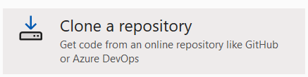
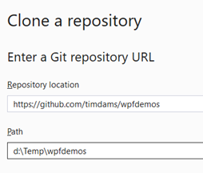

<!--# Week 1: Oefeningen-->


:::{.callout-tip}
Je hebt nu geleerd hoe je met **structs** orde schept in de chaos van losse variabelen. Je bent van "losse rommel" naar "nette dozen" gegaan.
Maar... heb je gemerkt dat die dozen nogal passief zijn? Ze doen niks, tenzij jij er een aparte methode op loslaat.

We gaan nu effectief de leerstof van hoofdstuk 9 toepassen: de volgende stap is **Object Oriented Programming (OOP)**.

In het intermezzo van vorige week had je een `StudentData` struct. Die bevatte wel de cijfers, maar kon zelf zijn gemiddelde niet berekenen. Je moest die struct telkens doorgeven aan een externe "manager" (jouw methodes).

```java
// De struct is passief (data)
StudentData alex = ...;

// De actie moet buitenaf gebeuren
double avg = CalculateAverage(alex); 
```

Dit voelt alsof je een auto hebt, maar je moet hem zelf duwen.

**De Oplossing: Slimme Objecten (Classes)**

In OOP gaan we onze dozen (structs) upgraden naar **Classes**. Een Class is niet zomaar een container voor data. Het is een volwaardig object dat **weet wat het moet doen**.

We verplaatsen de logica (de methodes) **IN** de doos.

*   **Vroeger (Struct):** Een lijstje met ingrediënten (Data).
*   **Nu (Class):** Een Chef-kok die de ingrediënten heeft én weet hoe hij ze moet koken (Data + Gedrag).

```java
// Het object is slim (data + gedrag)
Student alex = new Student("Alex", 12, 14);

// Het object doet het werk zelf!
double avg = alex.CalculateAverage();
```

Zie je het verschil? We hoeven `alex` niet meer door te geven. Alex **weet** zelf zijn cijfers en **berekent** zelf zijn gemiddelde.

:::


:::{.callout-warning}
In dit en volgend hoofdstuk staan bij sommige oefeningen bovenaan een link naar een alternatieve manier van de oefening te maken waarbij je ook feedback krijgt. [Bekijk zeker eerst dit filmpje](https://ap.cloud.panopto.eu/Panopto/Pages/Viewer.aspx?id=a79f075c-7ac7-4a66-97d4-ae2a00dca02a). **Indien je geen knop "open in visual studio" hebt in github** dan kan je dit oplossen als volgt: open Visual studio en kies voor *clone a repository*:



Vervolgens copy paste je de githu-burl als daar om gevraagd wordt  (voor de eerste oefening is dat https://github.com/timdams/ZIESCHERPER_TESTS_H1_RapportModule). 



:::


# RapportModule (*Essential*)

:::{.callout-tip}
[Maak je oplossing in een kopie van volgende solution met bijhorende unittests](https://github.com/timdams/ZIESCHERPER_TESTS_H1_RapportModule).
:::

:::{.callout-warning}
Opgelet: de unittests projecten werden nog geschreven in .NET 7. Je zal een error krijgen dat je .NET 7 SDK moet installeren. Je kan dit oplossen door te rechterklikken op beide projecten in je solution en te kiezen voor "edit project file". Daar verander je de `TargetFramework` van `net7.0` naar `net10.0` als je met VS 2026 werkt, of naar `net9.0` als je met VS 2022 werkt. Bewaar en probeer opnieuw te runnen.

Dit geldt voor alle volgende oefeningen waarbij je een link krijgt naar een solution met unittests.
:::


**Doel:**
Ontwerp een klasse die een graad berekent op basis van een behaald percentage.

**Specificaties:**

*   **Klassenaam:** `Rapport`
*   **Properties:**
    *   `Percentage` (type: `int`): Het behaalde punt.

*   **Methoden:**
    *   `PrintGraad()` (type: `void`): Toont de graad in de console.

**Werking (Business Rules):**
De methode `PrintGraad` controleert de waarde van `Percentage` en toont de bijbehorende tekst:

| Frequentie | Output Tekst |
| :--- | :--- |
| Minder dan 50 | "Niet geslaagd" |
| 50 t.e.m. 68 | "Voldoende" |
| 69 t.e.m. 75 | "Onderscheiding" |
| 76 t.e.m. 85 | "Grote onderscheiding" |
| Meer dan 85 | "Grootste onderscheiding" |

**Voorbeeldgebruik:**
Test je klasse met volgende code in `Main`:

```java
Rapport mijnPunten = new Rapport();
mijnPunten.Percentage = 65;
mijnPunten.PrintGraad(); // Verwachte output: "Voldoende"

Rapport mijnVriendPunten = new Rapport();
mijnVriendPunten.Percentage = 89;
mijnVriendPunten.PrintGraad(); // Verwachte output: "Grootste onderscheiding"
```

Controleer je oplossing ook via **Test => Run All Tests**.

::::{.callout-caution collapse="true" title="Oplossing"}
```java
public class Rapport
{
    public int Percentage {get;set;}
    public void PrintGraad()
    {
        if(Percentage < 50)
            Console.WriteLine("Niet geslaagd");
        else if(Percentage <= 68)
            Console.WriteLine("Voldoende");
        else if(Percentage <= 75)
            Console.WriteLine("Onderscheiding");
        else if(Percentage <= 85)
            Console.WriteLine("Grote onderscheiding");
        else Console.WriteLine("Grootste onderscheiding");
    }
}
```
::::


# Nummers (*Essential*)

:::{.callout-tip}
[Maak je oplossing in een kopie van volgende solution met bijhorende unittests](https://github.com/timdams/ZIESCHERPER_TESTS_H1_Nummers).
:::

**Doel:**
Maak een rekenmachine-klasse die bewerkingen uitvoert op twee getallen.

**Specificaties:**

*   **Klassenaam:** `NummerBerekenaar`
*   **Properties:**
    *   `Getal1` (type: `int`): Het eerste getal.
    *   `Getal2` (type: `int`): Het tweede getal.

*   **Methoden:**
    *   `Som()`: returntype `int`
    *   `Verschil()`: returntype `int`
    *   `Product()`: returntype `int`
    *   `Quotient()`: returntype `double`

**Werking:**

*   `Som`, `Verschil`, `Product`: Voeren de standaard wiskundige bewerking uit (`+`, `-`, `*`) en geven het resultaat terug.
*   `Quotient`: Deelt `Getal1` door `Getal2`.
    *   *Let op:* Delen door nul mag niet.
    *   **Als Getal2 gelijk is aan 0:** Toon foutboodschap "Kan niet delen door 0" in de console EN geef `0.0` terug.
    *   **Anders:** Geef het resultaat van de deling terug.

**Voorbeeldgebruik:**
```java
NummerBerekenaar paar1 = new NummerBerekenaar();
paar1.Getal1 = 12;
paar1.Getal2 = 34;

Console.WriteLine($"Som = {paar1.Som()}");      // Output: 46
Console.WriteLine($"Verschil = {paar1.Verschil()}"); // Output: -22
```

::::{.callout-caution collapse="true" title="Oplossing"}
```java
public class Nummers
{
    public int Getal1 { get; set; }
    public int Getal2 { get; set; }

    public int Som() { return Getal1 + Getal2; }
    public int Verschil() { return Getal1 - Getal2; }
    public int Product() { return Getal1 * Getal2; }

    public double Quotient()
    {
        if(Getal2==0)
        {
            Console.WriteLine("Kan niet delen door 0");
            return 0;
        }
        return Getal1 / (double)Getal2;
    }
}
```
::::


# Studentklasse (*Essential*)

:::{.callout-tip}
[Maak je oplossing in een kopie van volgende solution met bijhorende unittests](https://github.com/timdams/ZIESCHERPER_TESTS_H1_Studentklasse).
:::

**Doel:**
Sla gegevens van een student op en bereken het gemiddelde.

**Specificaties:**

*   **Klassenaam:** `Student`
*   **Enum:** `Klassen` (definieer deze *buiten* de klasse, mogelijke waarden: `TI1`, `TI2`, `TI3`)
*   **Properties:**
    *   `Naam` (`string`)
    *   `Leeftijd` (`int`)
    *   `Klas` (`Klassen` - gebruik de enum hierboven)
    *   `PuntenCommunicatie` (`int`)
    *   `PuntenProgrammingPrinciples` (`int`)
    *   `PuntenWebTech` (`int`)

*   **Methoden:**
    *   `BerekenGemiddelde()`: Geeft het gemiddelde van de 3 puntenvakken terug als `double`.
    *   `GeefOverzicht()`: Toont een rapport in de console (zie voorbeeld).

**Voorbeeldgebruik:**

```java
Student student1 = new Student();
student1.Klas = Klassen.TI1;
student1.Naam = "Joske Vermeulen";
student1.Leeftijd = 21;
student1.PuntenCommunicatie = 12;      
student1.PuntenProgrammingPrinciples = 15;
student1.PuntenWebTech = 13;

student1.GeefOverzicht();
```

**Verwachte Output:**
```text
Joske Vermeulen, 21 jaar
Klas: TI1

Cijferrapport:
**********
Communicatie:             12
Programming Principles:   15
Web Technology:           13
Gemiddelde:               13.3333333333
```

::::{.callout-caution collapse="true" title="Oplossing"}
```java
public enum Klassen { TI1,TI2,TI3 }

public class Student
{
    public string Naam { get; set; }
    public int Leeftijd { get; set; }
    public Klassen Klas { get; set; }

    public int PuntenCommunicatie { get; set; }
    public int PuntenProgrammingPrinciples { get; set; }
    public int PuntenWebTech { get; set; }

    public double BerekenTotaalCijfer()
    {
        return (PuntenCommunicatie + PuntenProgrammingPrinciples + PuntenWebTech) / 3.0;
    }

    public void GeefOverzicht()
    {
        Console.WriteLine($"{Naam}, {Leeftijd} jaar");
        Console.WriteLine($"Klas: {Klas}");
        Console.WriteLine();
        Console.WriteLine("Cijferrapport");
        Console.WriteLine("*************");
        Console.WriteLine($"Communicatie:\t\t{PuntenCommunicatie}");
        Console.WriteLine($"Programming Principles:\t{PuntenProgrammingPrinciples}");
        Console.WriteLine($"Web Technology:\t\t{PuntenWebTech}");
        Console.WriteLine($"Gemiddelde:\t\t{BerekenTotaalCijfer()}");
    }
}
```
::::


# PizzaTime

:::{.callout-tip}
[Maak je oplossing in een kopie van volgende solution met bijhorende unittests](https://github.com/timdams/ZIESCHERPER_TESTS_H1_PizzaTime).
:::

**Doel:**
Maak een klasse `Pizza` die waarden controleert voordat ze worden opgeslagen.

**Specificaties:**

*   **Klassenaam:** `Pizza`
*   **Properties** (Full Properties met validatie):
    *   `Toppings` (`string`): Beschrijving van de toppings.
    *   `Diameter` (`int`): Doorsnede in cm.
    *   `Price` (`double`): Prijs in euro.

**Validatie Regels (in de `set` van de properties):**
Bij het toewijzen van een nieuwe waarde (`value`), controleer het volgende. Indien de waarde **niet** geldig is, doe je niets (de oude waarde blijft behouden).

1.  **Price en Diameter:** Moeten groter zijn dan 0. (Indien `value <= 0` -> negeer).
2.  **Toppings:** Mag niet leeg zijn. (Gebruik `string.IsNullOrWhiteSpace(value)` om te controleren. Indien `true` -> negeer).

**Voorbeeldgebruik:**
Maak in je Main enkele pizza's aan en probeer foute waarden in te stellen om te testen of ze inderdaad geweigerd worden.

::::{.callout-caution collapse="true" title="Oplossing"}
```java
public class Pizza
{
    private string toppings;

    public string Toppings
    {
        get 
        {			
            return toppings; 
        }
        set 
        {
            if (value != "")
            {
                toppings = value;
            }		
        }
    }
    private int diameter;

    public int Diameter
    {
        get { return diameter; }
        set 
        {
            if (value > 0)
            {
                diameter = value;
            }
        }
    }

    private double price;

    public double Price
    {
        get { return price; }
        set 
        {
            if (value >0)
            {
                price = value;
            }			 
        }
    }
}
```
::::


# Stevens pizza (*Essential*) {#h09-stevens-pizza}

Stagiair Steven moest voor de pizzeria om de hoek een klasse ``Pizza`` maken: toppings, een diameter en een prijs, en er mocht geen onzin in een pizza terechtkomen. Hij vroeg het aan een A.I. en plakte het resultaat in zijn project. In ``Pizza.cs``:

```java
internal class Pizza
{
    private string toppings = "tomatensaus";
    private int diameter = 25;
    public double prijs;

    public string Toppings
    {
        get
        {
            return toppings;
        }
        set
        {
            if (!string.IsNullOrWhiteSpace(value))
            {
                Toppings = value;
            }
        }
    }

    public int Diameter
    {
        get
        {
            return diameter;
        }
        set
        {
            if (value > 0)
            {
                diameter = diameter;
            }
        }
    }

    public static void ToonInfo()
    {
        Console.WriteLine($"Pizza met {Toppings}, {Diameter} cm, {prijs} euro");
    }
}
```

En in ``Main``:

```java
Pizza margherita;
margherita.Toppings = "tomaat en mozzarella";
margherita.Diameter = 30;

Console.WriteLine("Wat kost de margherita?");
double prijs = Convert.ToDouble(Console.ReadLine());
if (prijs > 0)
{
    margherita.prijs = prijs;
}

margherita.ToonInfo();
```

**Deel 1.** Neem de code over: de klasse in een apart bestand, de rest in ``Main``. Het project compileert niet. De compiler geeft vijf fouten en één waarschuwing. Laat de waarschuwing even liggen: de vijf fouten hebben samen maar twee oorzaken. Welke, en hoe los je ze op?

::::{.callout-caution collapse="true" title="Oplossing"}
1. ``Pizza margherita;`` maakt enkel een variabele. Er is nog geen object, want dat maak je met ``new``. De compiler zegt ``CS0165: Use of unassigned local variable 'margherita'``. Maak er ``Pizza margherita = new Pizza();`` van.
2. ``ToonInfo`` staat ``static``. Een objectmethode krijgt geen ``static``: zo'n methode hoort niet bij één pizza en weet dus niet van welke pizza ze de toppings, de diameter en de prijs moet tonen. Daarom zegt de compiler ``CS0120: An object reference is required for the non-static field, method, or property 'Pizza.Toppings'``, en hetzelfde voor ``'Pizza.Diameter'`` en ``'Pizza.prijs'``. In ``Main`` komt er ``CS0176: Member 'Pizza.ToonInfo()' cannot be accessed with an instance reference; qualify it with a type name instead`` bij. Die raad volg je niet: met ``Pizza.ToonInfo();`` blijven de drie andere fouten staan. Haal ``static`` weg, dan verdwijnen ze alle vier.
::::

**Deel 2.** Nu compileert het, met nog altijd die ene waarschuwing. Voer het uit. Het programma crasht nog voor het de prijs vraagt. Zoek de oorzaak en los ze op. Daarna loopt het wel, maar met ``12`` als prijs toont het ``Pizza met tomaat en mozzarella, 25 cm, 12 euro``, terwijl Steven de diameter op 30 zette. Zoek ook die fout. De waarschuwing helpt je.

::::{.callout-caution collapse="true" title="Oplossing"}
1. In de ``set`` van ``Toppings`` staat ``Toppings = value;``, met een hoofdletter. Dat is de property zelf, dus die ``set`` roept zichzelf opnieuw op, en die opnieuw, tot het programma crasht. In de console staat ``Stack overflow.``, gevolgd door een lijst waarin ``set_Toppings`` duizenden keren herhaald wordt. De compiler geeft hier geen fout en geen waarschuwing. Schrijf naar de instantievariabele: ``toppings = value;``.
2. In de ``set`` van ``Diameter`` staat ``diameter = diameter;``. De instantievariabele krijgt haar eigen waarde terug en ``value`` wordt nergens gebruikt, dus de diameter blijft op de beginwaarde 25. Dit is de waarschuwing: ``CS1717: Assignment made to same variable; did you mean to assign something else?``. Maak er ``diameter = value;`` van.

Nu toont het programma ``Pizza met tomaat en mozzarella, 30 cm, 12 euro``.
::::

**Deel 3.** Het programma doet nu wat Steven wou, zonder fouten of waarschuwingen. Een collega gebruikt de klasse voor een tweede pizza:

```java
Pizza hawaii = new Pizza();
hawaii.Toppings = "ham en ananas";
hawaii.prijs = -4;
hawaii.ToonInfo();
```

Ook dat compileert, en het toont ``Pizza met ham en ananas, 25 cm, -4 euro``. Welke twee keuzes in Stevens code maken dat mogelijk? Herschrijf de klasse en ``Main`` zodat geen enkele pizza een prijs van 0 of minder kan krijgen, ook niet in de code van de collega.

::::{.callout-caution collapse="true" title="Oplossing"}
1. ``public double prijs;`` is een publieke instantievariabele. Iedereen die een ``Pizza`` gebruikt, kan er alles in zetten. Instantievariabelen zijn altijd ``private``.
2. De controle ``if (prijs > 0)`` staat in ``Main``. Ze beschermt enkel die ene toekenning in Stevens ``Main``: de collega schrijft ze niet over. De controle hoort in de ``set`` van een property ``Prijs``, want daar moet elke prijs langs, waar de pizza ook gebruikt wordt.

In ``Pizza.cs``:

```java
internal class Pizza
{
    private string toppings = "tomatensaus";
    private int diameter = 25;
    private double prijs = 10;

    public string Toppings
    {
        get
        {
            return toppings;
        }
        set
        {
            if (!string.IsNullOrWhiteSpace(value))
            {
                toppings = value;
            }
        }
    }

    public int Diameter
    {
        get
        {
            return diameter;
        }
        set
        {
            if (value > 0)
            {
                diameter = value;
            }
        }
    }

    public double Prijs
    {
        get
        {
            return prijs;
        }
        set
        {
            if (value > 0)
            {
                prijs = value;
            }
        }
    }

    public void ToonInfo()
    {
        Console.WriteLine($"Pizza met {Toppings}, {Diameter} cm, {Prijs} euro");
    }
}
```

In ``Main``:

```java
Pizza margherita = new Pizza();
margherita.Toppings = "tomaat en mozzarella";
margherita.Diameter = 30;

Console.WriteLine("Wat kost de margherita?");
margherita.Prijs = Convert.ToDouble(Console.ReadLine());
margherita.ToonInfo();

Pizza hawaii = new Pizza();
hawaii.Toppings = "ham en ananas";
hawaii.Prijs = -4;
hawaii.ToonInfo();
```

Met ``12`` als invoer:

```text
Wat kost de margherita?
Pizza met tomaat en mozzarella, 30 cm, 12 euro
Pizza met ham en ananas, 25 cm, 10 euro
```

De ``set`` weigert ``-4``, dus de hawaii houdt haar beginwaarde van 10 euro.
::::

::::{.callout-caution collapse="true" title="Les(sen) uit deze oefening"}
* Van de zes fouten gaven er twee een compileerfout en één een waarschuwing. De stack overflow, de publieke instantievariabele en de controle in ``Main`` vond de compiler niet.
* Lees ook de waarschuwingen. ``CS1717`` wees de lijn met de fout in ``Diameter`` aan, terwijl het programma gewoon startte.
* Tussen ``Toppings = value;`` en ``toppings = value;`` zit één hoofdletter: het eerste schrijft naar de property, het tweede naar de instantievariabele.
* Zie [De new operator](https://www.ziescherp.be/content/8_klassen/0b_oopincs.html#de-new-operator), [Object methoden](https://www.ziescherp.be/content/8_klassen/0c_simpleobjects.html#object-methoden) (over ``static``), [Full property: set gedeelte](https://www.ziescherp.be/content/8_klassen/2_properties.html#full-property-set-gedeelte) en [Full property met toegangscontrole](https://www.ziescherp.be/content/8_klassen/2_properties.html#full-property-met-toegangscontrole).
::::


# Figuren

:::{.callout-tip}
[Maak je oplossing in een kopie van volgende solution met bijhorende unittests](https://github.com/timdams/ZIESCHERPER_TESTS_H1_Figuren).
:::

**Doel:**
Werken met overerving of losse klassen (hier losse klassen) en validatie.

**Specificaties:**

| Klasse | Property | Type | Validatie in `set` |
| :--- | :--- | :--- | :--- |
| **Rechthoek** | `Lengte` | `int` | Indien `value < 1`, verander niets. Anders `value`. |
| | `Breedte` | `int` | Indien `value < 1`, verander niets. Anders `value`. |
| | **Methode:** `ToonOppervlakte()` | `void` | Berekent Lengte * Breedte en toont resultaat. |
| **Driehoek** | `Basis` | `int` | Indien `value < 1`, verander niets. Anders `value`. |
| | `Hoogte` | `int` | Indien `value < 1`, verander niets. Anders `value`. |
| | **Methode:** `ToonOppervlakte()` | `void` | Berekent (Basis * Hoogte) / 2 en toont resultaat. |

*Let op: `Rechthoek` en `Driehoek` zijn hier twee aparte klassen en hebben niets met elkaar te maken, behalve dat ze toevallig gelijkaardige methoden hebben.*

**Opdracht:**
Maak van elke figuur een instantie in je `Main` en roep `ToonOppervlakte` aan.

::::{.callout-caution collapse="true" title="Oplossing"}
```java
public class Rechthoek
{
    private int lengte = 1;
    public int Lengte
    {
        get { return lengte; }
        set { if (value >= 1) lengte = value; }
    }

    private int breedte = 1;

    public int Breedte
    {
        get { return  breedte; }
        set { if (value >= 1) breedte = value; }
        }

    public void ToonOppervlakte()
    {
        Console.WriteLine($"{Lengte*Breedte}");
    }
}
```

Driehoek is quasi hetzelfde, met uiteraard een andere berekening van de oppervlakte.
::::


# MiniRPG (*Final Essentials*)


:::{.callout-tip}
Een *Final Essentials* oefening is een opgave waarin alle leerstof van de voorbije oefeningen aan bod komt. 
:::

**Doel:**
Bouw een mini-RPG systeem waarin je een held aanmaakt, traint en laat vechten.


**Deel 1: De Setup**

Maak eerst de nodige basisstructuur aan.

1.  **Enum `HeldType`**: Definieer deze *buiten* je klasse.
    *   Opties: `Krijger`, `Magiër`, `Boogschutter`.

2.  **Klasse `Held`**:
    *   **Properties:**
        *   `Naam` (`string`): Mag niet leeg zijn. Indien leeg, stel in op "Naamloze Held".
        *   `Type` (`HeldType`): Het type van de held.
        *   `Level` (`int`): *Private set*. Begint altijd op **1**.
        *   `XP` (`int`): Experience Points. *Private set*. Begint op **0**.
        *   `Levenspunten` (`int`): Huidige HP. Mag niet onder 0 gaan.
        *   `MaxLevenspunten` (`int`): Read-only property die volgende formule gebruikt: `100 + (Level * 10)`. (Bij level 1 is dit dus 110).

**Deel 2: De Actie**

Voeg nu gedrag toe aan je held.

3.  **Methoden:**
    *   `VerkrijgErvaring(int punten)` (`void`):
        *   Tel `punten` op bij `XP`.
        *   **Level Up Logica:** Elke 100 XP stijgt de held een level.
        *   *Zolang* `XP >= 100`:
            *   Verminder XP met 100.
            *   Verhoog `Level` met 1.
            *   Verhoog `Levenspunten` met 10 (omdat MaxHP ook stijgt).
            *   Toon: *"Level Up! [Naam] is nu level [Level]!"*

    *   `ValAan()` (`int`):
        *   Genereert schade gebaseerd op het `Level` en een basiswaarde.
        *   Formule: `10 + Level`. (Simpel gehouden voor nu).
        *   Return dit getal.

    *   `IncasseerSchade(int schade)` (`void`):
        *   Trek `schade` af van `Levenspunten`.
        *   Zorg dat `Levenspunten` niet onder 0 zakt (controleer dit in de property setter of hier).
        *   Als `Levenspunten` 0 bereikt: Toon *"[Naam] is verslagen..."*.

    *   `ToonStats()` (`string`):
        *   Geeft een samenvatting terug, bv:
        *   *"[Naam] (Level [Level] [Type]) - HP: [Levenspunten]/[MaxLevenspunten] - XP: [XP]"*

**Voorbeeldgebruik in Main:**

```java
Held conan = new Held();
conan.Naam = "Conan";
conan.Type = HeldType.Krijger;
conan.Levenspunten = conan.MaxLevenspunten;

Console.WriteLine(conan.ToonStats()); 
// Output: Conan (Level 1 Krijger) - HP: 110/110 - XP: 0

// Conan traint
conan.VerkrijgErvaring(150); 
// Output: Level Up! Conan is nu level 2!

Console.WriteLine(conan.ToonStats());
// Output: Conan (Level 2 Krijger) - HP: 120/120 - XP: 50

// Conan vecht
int schade = conan.ValAan();
Console.WriteLine($"Conan doet {schade} schade.");

// Conan wordt geraakt
conan.IncasseerSchade(50);
Console.WriteLine(conan.ToonStats());
// Output: Conan (Level 2 Krijger) - HP: 70/120 - XP: 50
```

**Extra Uitdaging (Optioneel):**
Maak de `ValAan` methode slimmer gebaseerd op `HeldType`.

*   `Krijger`: Doet `10 + (Level * 2)` schade (fysiek sterk).
*   `Magiër`: Doet `5 + (Level * 3)` schade (begint zwak, wordt heel sterk).
*   `Boogschutter`: Doet `8 + (Level * 2)` schade.

::::{.callout-caution collapse="true" title="Oplossing"}

::::
