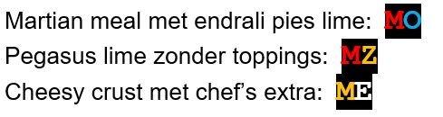
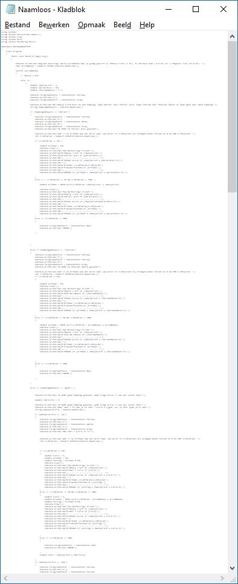

# Opgave vaardigheidsproef 1819, module 1 - Intergalactic pizzaphone bestel-module

*Geschatte tijd om dit te maken: 120 minuten*

## Introductie
IPP – Intergalactic PizzaPhone -  is de populairste pizza-delivery service van het heelal. Ze hebben jouw hulp ingeschakeld om een nieuwe bestel-module te maken. Jouw module moet ervoor zorgen dat de telefoonoperators veel sneller de bestellingen kunnen invoeren en doorgeven aan de keuken.  
> yIghoSDo' chenmoHwI'!  (Klingon voor: Veel succes maker!)

## Opgave
De opgave bestaat uit twee delen:
* Deel 1- Bestelmodule (15 punten)
    De bestelmodule uit een aantal onderdelen (Alle prijzen worden uitgedrukt in Intergalactic Credits (IC))
    * Bevraging: er wordt aan de klant een aantal vragen gesteld (bv type pizza, etc)
    * Visualisatie: de bestelling wordt getoond op het scherm
    * Berekening: de totaalprijs wordt berekend
    * Ticket: de totaalprijs wordt getoond

* Deel 2 – Uitbreidingen (5 punten)
    Deze zullen achteraan de opgave uitgelegd worden. Het is aangeraden om eerst deel 1 af te werken voor je aan de uitbreidingen begint.

    De uitbreidingen zijn:
    * Een random kortingsmodule
    * Een benzine berekenaar  
 

## Deel 1- Bestelmodule
### Bevraging (5 punten)
Een reeks vragen zal gesteld worden waarbij de gebruiker (operator) z’n keuze invoert en naar de volgende vraag gaat.

#### Pizzabodem?

De pizzabodem kan bestaat uit:
* Cheesy crust  	(kost 5 IC)
* Martian meal 	(kost 2.8 IC)
* Pegasus lime	(kost 12.4 IC)

Indien "Martian meal" wordt besteld moet de operator ook vertellen dat dit niet geschikt is voor kinderen onder de 54 jaar. De operator zal daarom nu de leeftijd vragen en enkel verder gaan indien deze groter of gelijk is aan 54. Indien jonger stopt programma en verschijnt er “ERROR” in rode letters op het scherm.

#### Topping?

De gebruiker kan kiezen uit 2 soorten toppings, hij mag ook verkiezen om zonder topping verder te gaan. De kost van een topping kan afhankelijk zijn van de gekozen pizzabodem:
* Endrali pies	
    * kost 10 IC voor cheesy crust,
	* kost 15 IC voor Martian meal en Pegasus Lime
* Italian Cheese	
	* kost 5.5 IC op alle bodems
* Geen		
    * geen kost

#### Chefs extra?

Indien de klant voor geen topping kiest dan kan deze voor 1 IC de chef’s extra (een dikke fluim) aan z’n pizza toevoegen.

#### Afstand tot aarde in lichtjaar?
* Als finale vraag dient de gebruiker door te geven hoe ver het afleveradres is in lichtjaren. Dit zal steeds een geheel getal van 1 tot en met 100 moeten zijn. 
* Indien de gebruiker een getal buiten deze grenzen ingeeft dan sluit het programma door in rode letters “ERROR” op het scherm te zetten

 
### Visualisatie (4punten)

De pizzabestelling wordt gevisualiseerd als volgt:
* Een letter verschijnt in een bepaalde kleur afhankelijk van de bodem, namelijk:
    * Gele C voor cheesy crust
	* Rode M voor martian meal
	* Groene P voor pegasus lime
* Na de bodemletter verschijnt een O in de kleur van de topping. 
	* Blauw voor endrali pies
	* Geel voor italian cheese
	* Indien gebruiker geen topping koos maar wel de chef’s extra verschijnt in de plaats een Witte E
	* Indien de gebruiker geen topping koos en ook geen chef’s extra dan verschijnt er geen O maar een gele Z


Voorbeelden:



### Prijsberekening (3 punten)
De prijsberekening van de pizza gebruikt de prijzen hierboven vermeld en is gewoon de optelsom van de aparte delen.

Na de pizza-prijs berekening wordt berekend hoeveel de transportkosten zullen zijn. Deze zijn gebaseerd op de afstand tot de aarde in lichtjaren als volgt:

Transportkosten:
* Afstand kleiner dan 10 :  25 IC
* Afstand groter of gelijk aan 10: $\sqrt(s/p)+p$   (met p gelijk aan de pizzaprijs en s de afstand)
    * De transportprijs wordt naar beneden afgerond tot het eerste gehele getal.
* Indien de chef’s extra werd gekozen dan zal er een 10% korting op de totale transportkosten gegeven worden

### Ticket (3 punten)
**Gebruik string interpolatie voor dit deel.**
Een ticket wordt getoond dat de volledige bestelling in tekst toont met erachter, via tab, steeds de prijs. Onderaan volgt de totaalprijs. 
Voorbeeld van een ticket:


```text
Martian meal			2.8 IC
Italian Cheese			5.5 IC
- 	-	-	-	-	-	-	-	-
Totaal pizza			8.3 IC

Afstand		                12 Lichtjaren
Transportkosten:		9  IC
- 	-	-	-	-	-	-	-	-
TOTAAL				17.3 IC
```
 
## Deel 2- Uitbreidingen
### Random korting- module  (2 punt)

De standaard korting voor de chef’s extra op de transportkosten is 10%. In deze uitbreiding zou het bedrijf graag hebben dat een willekeurige korting wordt toegekend. Deze zal steeds een willekeurige bedrag van 0 tot en met 50% korting zijn.

### Benzine module (3 punten)

Deze module zal berekenen hoeveel tonnen benzine er nodig zijn om de pizza bij de klant te krijgen. Er is 1 ton benzine nodig per 5 lichtjaar. Indien de klant dus 12 lichtjaren ver woont dan zijn 3 tonnen nodig, waarbij de derde ton maar voor 2/5 (40%) zal opgebruikt worden.

De module zal dus steeds het geheel aantal tonnen benzine tonen , gevolgd door hoeveel % van de laatste ton nodig zal zijn (indien deze volledig opgebruikt zal worden dan toon je 100% uiteraard; bv wanneer de klant op 10 lichtjaar woont)

De benzine module toont deze informatie onderaan het ticket:


```text
Martian meal			2.8 IC
Italian Cheese			5.5 IC
- 	-	-	-	-	-	-
Totaal pizza			8.3 IC

Afstand	                	12 Lichtjaren
Transportkosten:		9  IC
- 	-	-	-	-	-	-
TOTAAL				17.3 IC
*********************************
Informatie voor de piloot:
Benzine tonnen in te laden	2
Benzine over in laatste ton:	60%
```


::::{.callout-caution collapse="true" title="Oplossing"}

# Oplossing Vaardigheidsproef 1819
```java

//Prijzen
double bodem_cheesy = 5, bodem_martian = 2.8, bodem_pegasus = 12.4;
double top_pies_cr = 10, top_pies = 15, top_italian = 5.5;
double top_chefextra = 1;
double temp_prijsbodem = 0.0;
double temp_prijstopping = 0.0;
string bodstr = "", topstr = "";
double korting = 0.1;  //zonder uitbreiding

//Deel 1: bevraging
//Pizzabodem
Console.WriteLine("Geef je bodem keuze");
Console.WriteLine($"1. cheesy crust ({bodem_cheesy})");
Console.WriteLine($"2. Martian meal ({bodem_martian})");
Console.WriteLine($"3. Pegasus lime ({bodem_pegasus})");
int bodemkeuze = Convert.ToInt32(Console.ReadLine());

if (bodemkeuze == 2) // pro gebruikt best enum ipv int om bodems te bewaren
{
    Console.WriteLine("Deze bodem enkel mogelijk als je ouder bent dan 54 jaar. Wat is leeftijd?");
    int leeftijd = Convert.ToInt32(Console.ReadLine());
    if (leeftijd < 54)
    {
        //ALLES STOPT HIER
        Console.ForegroundColor = ConsoleColor.Red;
        Console.WriteLine("ERROR");
        Console.ReadKey();
        Environment.Exit(0);
    }
}

//Topping
Console.WriteLine("Geef je topping keuze");
Console.WriteLine($"1. Endrali pies ({top_pies_cr} voor cheesy ; anders {top_pies}");
Console.WriteLine($"2. Italian cheese ({top_italian})");
Console.WriteLine("3. Geen");
int topkeuze = Convert.ToInt32(Console.ReadLine());
bool wantsChefsExtra = false;

//Chefs extra
if (topkeuze == 3)
{
    Console.WriteLine($"Wil je de chefs extra ({top_chefextra})?(j/n)");
    string chefextra_in = Console.ReadLine();
    if (chefextra_in == "j") wantsChefsExtra = true;
}

//Afstand
Console.WriteLine("Hoe ver woon je in lichtjaren?");
int afstand = Convert.ToInt32(Console.ReadLine());
if (afstand < 0 || afstand > 100)
{
    Console.ForegroundColor = ConsoleColor.Red;
    Console.WriteLine("ERROR");
    Console.ReadKey();
    Environment.Exit(0);
}

//Deel 2 Visualisatie + prijsberek
switch (bodemkeuze)
{
    case 1:
        temp_prijsbodem = bodem_cheesy;
        bodstr = "Cheesy crust";
        Console.ForegroundColor = ConsoleColor.Yellow;
        Console.Write("C");
        break;
    case 2:
        temp_prijsbodem = bodem_martian;
        bodstr = "Martian meal";
        Console.ForegroundColor = ConsoleColor.Red;
        Console.Write("M");
        break;

    case 3:
        temp_prijsbodem = bodem_pegasus;
        bodstr = "Pegasus lime";
        Console.ForegroundColor = ConsoleColor.Green;
        Console.Write("P");
        break;

    default:
        break;
}

switch (topkeuze)
{
    case 1:
        if (bodemkeuze == 1)
            temp_prijstopping = top_pies_cr;
        else
            temp_prijstopping = top_pies;
        topstr = "Endrali pies";
        Console.ForegroundColor = ConsoleColor.Blue;
        Console.Write("O");
        break;
    case 2:
        topstr = "Italian cheese";
        temp_prijstopping = top_italian;
        Console.ForegroundColor = ConsoleColor.Yellow;
        Console.Write("O");
        break;
    case 3:
        if (wantsChefsExtra == true)
        {
            temp_prijstopping = top_chefextra;
            topstr = "Chefs extra";
            Console.ForegroundColor = ConsoleColor.White;
            Console.Write("E");
        }
        else
        {
            temp_prijstopping = 0;
            topstr = "Geen topping";
            Console.ForegroundColor = ConsoleColor.Yellow;
            Console.Write("Z");
        }
        break;
}

Console.ResetColor();
Console.WriteLine();
//Deel 3: prijsberekening
double transport_prijs = 0;
double pizza_prijs = temp_prijsbodem + temp_prijstopping;

if (afstand < 10)
    transport_prijs = 25;
else
{
    transport_prijs = Math.Sqrt(afstand / pizza_prijs) + pizza_prijs;
}

if (wantsChefsExtra)
{
    korting = new Random().Next(0, 5) / 10.0; // (uitbreiding: Random korting)
    transport_prijs = transport_prijs - transport_prijs * korting;
}

//afronden naar beneden
transport_prijs = Math.Floor(transport_prijs);

double totaalprijs = transport_prijs + pizza_prijs;

// DEEL 4: ticket
Console.WriteLine($"{bodstr}\t\t\t{temp_prijsbodem} IC");
Console.WriteLine($"{topstr}\t\t\t{temp_prijstopping} IC");
Console.WriteLine("----------------------------");
Console.WriteLine($"Totaal piza\t\t\t{pizza_prijs} IC");
Console.WriteLine();
Console.WriteLine($"Afstand \t\t {afstand} Lichtjaren");
Console.WriteLine($"Transportkosten\t\t\t {transport_prijs} IC");
Console.WriteLine($"TOTAAL\t\t\t\t{totaalprijs} IC");


//Extra benzine module
//delen door 5 en afronden naar boven
int tonnennodig = Convert.ToInt32(Math.Ceiling(afstand / 5.0));
double rest = afstand % 5; //aantal verbruikte delen (0 tem. 4)
double verbruikt = (rest / 5.0) * 100; //omzetten naar perc
double benzineover = 100 - verbruikt;
Console.WriteLine("*******************************");
Console.WriteLine("Informatie voor de piloot");
Console.WriteLine($"Benzine tonnen in te laden\t{tonnennodig}");
Console.WriteLine($"Benzine over van de laatste ton\t{benzineover}%");

Console.ReadLine();
    
```

# Zoek de fouten
Volgende bugs, fouten, minder goede oplossingen komen uit oplossingen van vaardigheidsproeven. Kan jij ontdekken wat er mis? De oplossingen staan achteraan dit document.
(de code is hier en daar ingeperkt om de focus op de fout te leggen)

## Opgaven

1. Wat is er mis? 
   ```java
   int keuze = Convert.ToInt16(Console.ReadLine());
   ```

2. 
  ```java
  switch (keuze) {
    case 1:
        totaal += 5;
        int pType = Convert.ToInt16(Console.ReadLine()); // 

        switch (pType)
        {
            case 1:
                totaal += 10;
                topping = 1;
                break;
            case 2:
                totaal += 5.5;
                topping = 2;
                break;
            case 3:
                totaal += 0;
                break;
        }
        break;
    case 2:
    / enzovoort
  ```

3. Zie je de fout?

   ```java
   Console.WriteLine("Laten we starten met de bestelling. Druk op 1 voor de pizzabodem, daarna 2 voor de topping, vervolgens 3 voor de chefs extra en tot slot 4 voor het afleveradres.");
   keuze = Convert.ToInt32(Console.ReadLine());
   pizzabodem = Convert.ToString(Console.ReadLine());
   CheesyCrust = Convert.ToString(Console.ReadLine());
   MartianMeal = Convert.ToString(Console.ReadLine());
   PegasusLime = Convert.ToString(Console.ReadLine());
   EndraliPies = Convert.ToString(Console.ReadLine());

   //Je moet een paar keer ENTER drukken alvorens je tot de vraag komt.
   //Pizzabodem
   if (keuze == 1){
   ```

4. Cringy...
   ```java            
   int toegestaanleeftijd = 1;     //  0 is nee en 1 is ja.
   int toegestaanafstand = 1;      //  0 is nee en 1 is ja.
   ```

5. aiaiai...
   ```java
   if (ToppingsKeuzeBodem1 == 1)
   {
    Console.WriteLine("Wat is de afstand van het afleveradres in lichtjaren?");
    int AfleverAdres = Convert.ToInt32(Console.ReadLine());
    if (AfleverAdres < 10)
    {
        int PizzaTotaal = bodem+topping;
        Console.WriteLine($"Het totaal is gelijk aan {PizzaTotaal} IC");
    }
    else if (AfleverAdres >= 10)
    {
        int PizzaTotaal = (int)Math.Sqrt(AfleverAdres / 15) + martian + topping;
        Console.WriteLine($"Het totaal is gelijk aan {PizzaTotaal} IC");
    }
    else 
    { Console.ForegroundColor = ConsoleColor.Red; Console.WriteLine("ERROR"); 
    }
   }
   else if (ToppingsKeuzeBodem1 == 2)
   {
    Console.WriteLine("Wat is de afstand van het afleveradres in lichtjaren?");
    int AfleverAdres = Convert.ToInt32(Console.ReadLine());
    if (AfleverAdres < 10)
    {
   ```

6.  
   ```java
   PizzaTotaal = 25 + 5 + 10;

   //Verder:
   PizzaTotaal = 25 + 5 + 6;

   //Verder:
   PizzaTotaal = 25 + 5;
   ```

7. 
   Volgende commentaar, of een variant, kwam bij vele studenten voor. Hoe had dit voorkomen kunnen worden?
   ```java
   // Eindbedrag -> Had de pizzabodem en toppingprijzen niet apart opgeslagen
   // en kon het niet meer veranderen wegens tijdstekort.
   ```

8. 
   ```java
   Console.WriteLine("Oei, hier ging iets mis.");
   Console.Clear();
   Console.WriteLine("ERROR");
   ```

9. lesigh
   ```java
   goto end;
   ```

10. 

   ```java
   double tussenkomst = adres / 5;
   int Tonnen = 0;

   if (tussenkomst <= 1)
   {
       Tonnen = 1;
   }
   else if (tussenkomst <= 2)
   {
       Tonnen = 2;
   }
   else if (tussenkomst <= 3)
   {
       Tonnen = 3;
   }
   else if (tussenkomst <= 4)
   {
       Tonnen = 4;
   }
   else if (tussenkomst <= 5)
   {
       Tonnen = 5;
   }
   //enz.
   ```

11. Onderaan de code van een oplossing stond volgende commentaar:

   ```java 
   // TE WEINIG TIJD AKA MISSCHIEN TE TRAAG GEWERKT SORRY
   ```

   Mogelijk heeft de student te traag gewerkt, maar kijken we eens naar de code in z'n geheel dan zien we volgende beeld:

   

   What went wrong?


## Oplossingen
1. ``Convert.ToIn16`` is conversie naar een ``short`` maar het resultaat wordt wel in een grotere ``int`` bewaard. Ofwel werk je met ``short`` ofwel converteer je naar ``.ToInt32``.

2. Het is onduidelijk wat de verschillende cases willen zeggen: 1,2,3 is nietszeggend. Verduidelijk code met commentaar of gebruik ``enum``.

3. Hier gebeuren 2 fouten:
    1. De opmerking laat duidelijk zien dat de programmeur niet goed weet wat er moet gebeuren. De eerste ``WriteLine`` verteld aan de gebruiker duidelijk wat er moet ingevoerd worden. De eerste twee lijnen zijn dan ook zoals het hoort. Vervolgens worden er echter 5 extra zaken van de gebruiker verwacht dit met ``ReadLine`` worden ingelezen. De gebruiker weet uiteraard niet wat er moet ingevoerd worden en dus geeft de programmeur aan in de commentaar dat je maar een paar keer op enter moet duwen. De juiste manier had geweest om ofwel:
        * Voor iedere ``ReadLine`` een woordje uitleg via ``WriteLine`` geven wat er verwacht wordt.
        * Ofwel de zinnen naar de juiste plekken verderop in de code verplaatsen waar deze informatie effectief moet gevraagd worden.
    2. ``ReadLine`` geeft **altijd** ``string`` terug. De output ervan dus vervolgens nog een manueel converteren naar ``string`` mbv ``Convert.ToString`` is nutteloos.


4. Was er maar een type dat maar 2 mogelijk waarden kon hebben...Juist ja ``bool`` was hier een veel beter type geweest. Het had je code leesbaarder én minder foutgevoelig gemaakt (want wat was er gebeurt als je ``toegestaanleeftijd`` de waarde -6 had gegeven?)

5. De programmeur heeft het concept van ``scope`` mogelijk nog niet helemaal door. Dezelfde variabele wordt in meerdere codeblocks telkens van scratch terug aangemaakt (``int AfleverAdres`` en ``int PizzaTotaal``). Mogelijk was dat bewust. Maar wat als je verderop aan de code aan 'hét pizzatotaal' moet geraken? Dat is dan onmogelijk daar de aangemaakte variabele telkens maar leeft (=scope) binnen de accolades van het desbetreffende codeblock.

6. Dit is uiteraard een perfect legale zin. Maar niet als deze op verschillende plaatsen in de code deze vorm zo terugkomt. Wat als later de prijs van het ding dat nu ``25`` kost moet veranderen. De programmeur moet dan op alle plekken in z'n code dit manueel gaan aanpassen. En wat zijn die verschillende getallen eigenlijk?
Veel beter is om bovenaan je code de nodige variabelen (met goede namen) aan te maken waarin je de prijzen bewaard. De code wordt ook ogenblikkelijk veel begrijpbaarder:

    ```java
    int hawai=25;
    int ketchup=5;
    int noedels=6;
    int cheesycrust=10; 

    PizzaTotaal = hawai + ketchup + cheesycrust;

    //Verder:
    PizzaTotaal = hawai + ketchup + noedels;

    //Verder:
    PizzaTotaal = hawai + ketchup;
    ```

7. Lees de opgave steeds eerst helemaal door. Bepaal dan een 'aanvalsplan' hoe je de opgave gaat oplossen. Begin daarna pas te programmeren. Vergelijk het met het bouwen van een brug: je begint niet gewoon aan de linkeroever en dan meter per meter naar de andere oever te bouwen. Om dan aan de overkant te ontdekken dat de oever daar 5 meter hoger ligt en daar geen rekening mee hebt gehouden.

8. De bovenste zin zal maar enkele nanoseconden op het scherm verschijnen (de gebruiker zal deze dus nooit kunnen lezen) voor het scherm wordt leegemaakt en de nieuwe zin met ``ERROR`` op het scherm komt.

9.  Goto hell! PS ``Environment.Exit(0);``en  ``return`` waren in deze opgave de makkelijkste manieren om het programma af te sluiten. 

10. De programmeur wil hier z'n komma-getal naar boven afronden. Dit is duidelijk géén goede oplossing (gaat de programmeur voor alle ints die er bestaan een if bijschrijven?). De juiste manier om dit op te lossen is gebruik maken van de ``Math.Ceiling()`` methode die een getal naar boven zal afronden. De code kan dan herschreven worden naar 1 lijn:
    ```java
    int Tonnen = (int)Math.Ceiling(adres / 5);
    ```

11. De student heeft véél te veel dezelfde code geschreven (niet zichtbaar op de screenshot) en dus niet goed nagedacht over de if/else structuur die moet gemaakt worden. Maak steeds eerst een flowchart om te bepalen welke delen wanneer moeten gebeuren en zet 'gemeenschappelijke' code verderop in het verhaal. Het heeft bijvoorbeeld geen nut om overaal de ticket-visualisatie code te tonen daar deze voor alle mogelijkheden dezelfde is en dan onderaan de code gemeenschappelijk kan uitgevoerd worden.  Ook hier dus de opmerking die we ook in puntje 7 aanhaalden: stel eerst een aanvalsplan op voor je aan je aanval begint.

::::
