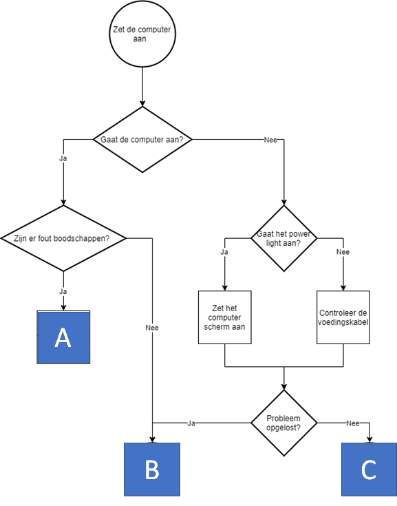
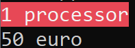
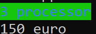

# Opgave vaardigheidsproef 2019-2020, deel 1 - IT Helpdesk

*Geschatte tijd om dit te maken: 90 minuten*

## Introductie
Maak een applicatie die de IT-helpdesk medewerkers kunnen gebruiken om bij gebruikers computerproblemen op te lossen.

## Stap 1- Flowchart 
Het programma implementeert volgende flowchart:

* De gebruiker dient steeds met "ja" of "nee" te antwoorden bij de vragen.
* De applicatie begint met "Zet de computer aan." En stelt dan de eerste vraag ("Gaat de computer aan").
* Na ieder antwoord wordt het scherm leeggemaakt.
Finaal bereikt de gebruiker dan een van de onderstaande fasen A,B of C, die verderop in de opgave worden uitgelegd.



## Stap 2- Fase A

In fase A gebeurt het volgende:

1. De gebruiker dient de foutcode als geheel getal in te voeren. Dit moet een getal van 0 tot en met 9 zijn. Bij alle andere getallen (bijvoorbeeld -1 of 14) verschijnt er "Los het dan zelf op he!" en sluit het programma zich af.
2. Wanneer een correct getal werd ingevoerd verschijnt er in RODE LETTERS de boodschap "Gelieve je computer gedurende X minuten af te zetten."

X is een getal dat berekend wordt als volgt:  
``vierkantswortel van (foutcode * 3)``
	
X verschijnt op het scherm met 1 cijfer na de komma.

## Stap 2 – Fase B

In fase B  verschijnt er op het scherm op het "Mooi zo, alles werkt."

Om de gebruiker aan te moedigen een werkende computer te hebben is er ook 25% kans dat hij een extra bonus krijgt. 

In 25% van de gevallen dat fase B wordt bereikt verschijnt er namelijk een tweede zin: “En u wint ook nog eens 1 jaar gratis IT support!”
De overige 75% keren dat fase B wordt bereikt verschijnt er enkel "Mooi zo, alles werkt." op het scherm.

## Stap 3- Fase C

* In deze fase wordt eerst wat meer informatie over de huidige computer getoond (merk op dat deze fase bij de klant op de computer eigenlijk moet uitgevoerd worden, maar doe maar alsof)

  Verkrijg via de Environment-bibliotheek het aantal processoren van de huidige computer (`` ProcessorCount``) en gebruik deze waarden om
  1. Indien er 1 processor in de computer zit komt er in witte letters op rode achtergrond op het scherm “1 processor”
  2. Indien er 2 of meer in zitten toon je het aantal processoren als getal met een groene achtergrond en blauwe letters, 

* Vervolgens berekent het programma de kostprijs voor de reparatie. Deze is 50€ per processor. Een computer met 5 of meer processoren zal altijd 200 euro kosten. Bereken de kost door het aantal processoren uit de vorige stap te gebruiken en toon dit op het scherm. 

Voorbeeld 1 fase C:
 


Voorbeeld 2 fase C:



* De gebruiker krijgt een bon voor een gratis reparatie indien hij een 64 bit computer gebruikt. Bevraag dit via de Environment-bibliotheek en toon "Hier een bon!" indien een 64 bit processor aanwezig is.

::::{.callout-caution collapse="true" title="Oplossing"}
# Oplossing opgave
Oplossing hier met ``enum`` , maar dit had je uiteraard ook met een ``string`` (die dan de waarden "A","B","C" gaf) of een ``int`` (waarden 1,2,3) gewerkt.


```java
enum Fases { A, B, C, Onbekend }

static void Main(string[] args)
{
    Fases finalFase= Fases.Onbekend;

    //Stap 1
    Console.WriteLine("Zet de computer aan");
    Console.WriteLine("Gaat de computer aan?");
    string invoer = Console.ReadLine();
    Console.Clear();
    if (invoer == "ja") //Veronderstelt dat er enkel ja/nee correct wordt ingevoerd
    {

        Console.WriteLine("Zijn er fout boodschappen?");
        invoer = Console.ReadLine();
        Console.Clear();
        if (invoer == "ja")
            finalFase = Fases.A;
        else
            finalFase = Fases.B;
    }
    else
    {
        Console.WriteLine("Gaat het power light aan?");
        invoer = Console.ReadLine();
        Console.Clear();
        if (invoer == "ja")
        {
            Console.WriteLine("Zet het computer scherm aan");
        }
        else
        {
            Console.WriteLine("Controleer de voedingskabel.");
        }
        Console.WriteLine("Probleem opgelost?");
        invoer = Console.ReadLine();
        Console.Clear();
        if (invoer == "ja")
            finalFase = Fases.B;
        else finalFase = Fases.C;
    }

    //Stap 2 - fase A

    if (finalFase == Fases.A)
    {
        Console.WriteLine("Geef de foutcode tussen 0 en 9");
        int foutcode = Convert.ToInt32(Console.ReadLine());
        if (foutcode >= 0 && foutcode <= 9)
        {
            double X = Math.Sqrt(foutcode * 3);
            Console.ForegroundColor = ConsoleColor.Red;
            Console.WriteLine($"Gelieve je computer gedurende {X:F1} minuten af te zetten");
            Console.ResetColor();
        }
        else
        {
            Console.WriteLine("Loes het dan zelf op he!");
        }
    }

    //Stap 2 - fase B

    else if (finalFase == Fases.B)
    {
        Console.WriteLine("Mooi zo, alles werkt.");
        Random dobbel = new Random();
        if (dobbel.Next(0, 4) == 0)
            Console.WriteLine("En u wint ook nog eens 1 jaar gratis IT support!");
    }

    //Stap 2 - fase C

    else if (finalFase == Fases.C) //mag ook gewone else zijn
    {
        int proccount = Environment.ProcessorCount;
        bool bit64 = Environment.Is64BitOperatingSystem;

        if (proccount == 1)
        {
            Console.ForegroundColor = ConsoleColor.White;
            Console.BackgroundColor = ConsoleColor.Red;
            Console.WriteLine("1 processor");
            Console.ResetColor();
        }
        else 
        {
            Console.ForegroundColor = ConsoleColor.Blue;
            Console.BackgroundColor = ConsoleColor.Green;
            Console.WriteLine($"{proccount} processor");
            Console.ResetColor();
        }
        if (proccount >= 5)
            Console.WriteLine("200 euro");
        else
            Console.WriteLine($"{proccount * 50} euro");

        if (bit64)
        {
            Console.WriteLine("Hier een bon!");
        }
    }
}
```
# Zoek de fouten
Volgende bugs, fouten, minder goede oplossingen komen uit oplossingen van vaardigheidsproeven. Kan jij ontdekken wat er mis? De oplossingen staan achteraan dit document.
(de code is hier en daar ingeperkt om de focus op de fout te leggen)

## Opgaven

1. 
    ```java
    if (!(e >= 0 && e <= 9))
    {
        Console.WriteLine("Los het dan zelf op he!");
    }
    if (e >= 0 && e <= 9)
    {
    ```
2. 
    ```java
    if ( Foutcode < 0 )
        Console.WriteLine("Los het dan zelf op he!");
    if (Foutcode > 9)
        Console.WriteLine("Los het dan zelf op he!");
    ```

3. 
    ```java
    if (Foutcodex >= 0 && < 10)
    ```
4. 
    ```java
    if ("0" == Answer || "1" == Answer || "2" == Answer || "3" == Answer || "4" == Answer || "5" == Answer || "6" == Answer || "7" == Answer || "8" == Answer || "9" == Answer)
    {
        int Foutcode = Convert.ToInt32(Answer);
    ```

5. 
    ```java
    double aantalMin = Convert.ToDouble(Math.Sqrt(foutcode));
    ``` 

6. 
    ```java
    int prijs = nummer.Next(0, 100);
    if (prijs <= 25)
    {
        Console.WriteLine("en u wint ook nog eens 1 jaar gratis IT support");
    }
    else if (prijs >= 26 && prijs <= 100)"
    ```
7. 
    ```java
    aantalMin = Math.Round(Math.Sqrt((foutcode * 3 + 0.0)), 1);
    ```

8. 
    ```java
    if (fout <0 && fout>=9 )
    {
        Console.WriteLine( " los het zelf op");
    ```

9. 
    ```java
    computer = Convert.ToString(Console.ReadLine());
    ```
10. 
    ```java
    else if (Computer == "nee")
    {
        Console.WriteLine("Gaat het power light aan?");
        Console.ReadLine();
        string light;
        light = Convert.ToString(Console.ReadLine());
    }
    if (light == "j")
    {
    ```

11. 
    ```java
    if (proccount == 1)
    {
        Console.WriteLine("50 euro");
    }
    else if (proccount == 2)
    {
        Console.WriteLine("100 euro");
    }
    else if (proccount == 3)
    {
        Console.WriteLine("150 euro");
    }
    else if (proccount >= 5)
    {
        Console.WriteLine("200 euro");
    }
    ```

12. 
    ```java 
    if (is64bit)
    {
        Console.WriteLine("Hier een bon!");
    }
    else
    {
        //Niets
    }
    ```

13. 
    ```java
    if (kans == 1)
    {
        Console.WriteLine("Mooi zo, alles werkt.");
        Console.WriteLine("En u wint ook nog eens 1 jaar gratis IT support!");
    }
    else
    {
        Console.WriteLine("Mooi zo, alles werkt.");
    }
    ```

14. 
    ```java
    if(!! Environment.Is64BitProcess)               
    ```

## Oplossing

1. De tweede if is onafhankelijk van de eerste. Sowieso is het veiliger om met een ``if..else if`` te werken. In dit geval is nog beter om met een ``if..else`` te `werken daar de tweede if de coplementaire van de eerste is. Door deze nu alsnog 'voluit' te schrijven verhoog je de kans op bug doordat je bijvoorbeeld een getal aan de grens nu in beide ifs niet opvangt.

2. Indien beide if'n zelfde code bevatten kan je deze allebei in if zetten. Zo hoef je maar op 1 plek aanpassingen te doen in de toekomst. 

3. Je moet steeds de volledige logica uitschrijven. Wat moet in deze if kleiner zijn dan 10? De goede lezer weet wel dat het om ``Foutcodex`` gaat, maar de compiler is zo dom als *insert grappig dier/mens/idee*.

4. Ten eerste willen we geen string vergelijken, maar ints. Ten tweede: wat als alle getallen tussen 1 en 100 toegelaten werden?!

5. De ``Math.Sqrt`` geeft altijd een ``double`` terug, dus deze moet niet geconverteerd worden naar een ``double``.

6. De tweede ``else if`` vervang je beter door een ``else``. 

7. Waarom ``+0.0``? Ik vermoed om een ``double`` aan ``Sqrt`` te geven, wat niet hoeft, daar ``int`` automatisch reeds naar ``double`` zullen worden omgezet indien nodig.

8. Deze if zal nooit uitgevoerd worden. Geen enkel getal kan zowel kleiner dan 0 zijn en tegelijkertijd groter dan 9.

9. ``ReadLine`` geeft altijd een ``string`` terug, en moet dus niet geconverteerd worden naar een ``string``.

10. Een huzarenstukje, met aardig wat bug. 
   * Een ``ReadLine`` direct na een vraag (via ``WriteLine``) moet je gebruiken om invoer van de gebruiker in te bewaren, niet om een enter op het scherm te plaatsen. De gebruiker zal een antwoord willen invoeren en niet verwachten dat hij eerst op enter moet duwen én dan pas zijn antwoord invoeren.
   * De ``ReadLine`` methode geeft een ``string`` terug en moet dus niet geconverteerd worden.
   * De variabele ``light`` heeft als scope de acolades binnen de ``else if``. Je kan deze dus niet gebruiken in de volgende ``if`` . 

11. De prijs is het resultaat van een berekening. Je kan dus voor ``proccount`` tussen 1 en 3 werken met ``prijs = proccount*50`` . (Wat met 4 trouwens?)

12. Indien je een lege ``else`` hebt kan je die ook beter gewoon weglaten.

13. Iets subtieler: de zin ``Mooi zo, alles werkt.`` komt in zowel de ``if`` als de ``else`` voor. Het is dus veiliger om deze zin VOOR de if..else structuur te zetten (zo hoef je hem maar op 1 plek aan te passen als deze in de toekomst anders moet zijn). De ``else`` vervalt op deze manier trouwens.

14. Een klassieke fout. De ``!`` (not) mag je niet dubbel plaatsen zoals ``&&`` en ``||``. Twee maal not is gewoon ``not not``: beide nots neutraliseren mekaar (zelfde als zeggen 'min min vier' wat gewoo 'plus vier' is) waardoor er eigenlijk staat: ``if(!! Environment.Is64BitProcess)``      


::::
