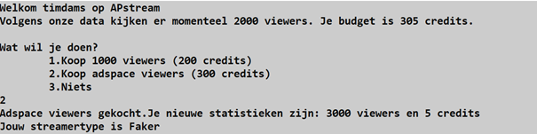

# Intro
Een bekende streamingdienst twim.tv heeft jou gevraagd om een softwarepakket te ontwikkelen dat hun klanten kunnen gebruiken terwijl ze video’s streamen. De applicatie zal de streamers helpen om viewers bij te kopen en te zien hoe goed hun stream het doet.

De applicatie bestaat uit 3 duidelijke delen die alle 3 steeds zullen uitgevoerd worden:

Belangrijke afspraken
* Strings worden altijd m.b.v. string interpolatie naar het scherm gestuurd.
* Gebruik constanten waar nodig

# Deel 1: initialisatie  
 
Wanneer de applicatie opstart, groet deze de gebruiker. Hierbij wordt de gebruikersnaam uit het systeem (m.b.v. de correcte Environment-eigenschap) uitgelezen. 

Voorts worden volgende willekeurige getallen (uiteraard automatisch gegenereerd) aangemaakt:
* Het aantal viewers dat naar de stream kijkt: dit kan 1000, 2000, 3000 , 4000 of 5000 zijn. Dit wordt willekeurig bepaald.
* Het huidige budget uitgedrukt in credits van de gebruiker: dit is een willekeurig geheel getal gelegen tussen 100 (100 inbegrepen) tot en met 600. 

# Deel 2: Menu  
 
Een menu wordt aan de gebruiker getoond, waarbij met tabs de keuzemogelijkheden onder elkaar worden getoond:
 

Gebruik enum voor de keuzes.

## Keuze 1: viewers kopen
Deze optie kost 200 credits. Indien de gebruiker niet genoeg credits heeft dan verschijnt er in rode letters “Niet genoeg credits” en wordt er naar deel 3 van het programma gegaan.
Indien de gebruiker 200 of meer credits heeft dan:
* Wordt het budget met 200 verlaagd.
* Wordt het aantal viewers met 1000 verhoogd

Voorzie ook de mogelijkheid om te onthouden of je viewers gekocht hebt.
Vervolgens verschijnt er het nieuwe budget en aantal viewers op het scherm en wordt het laatste deel van de applicatie gegaan (“Bepalen van de categorie”)

## Keuze 2: adspace kopen
Deze optie kost 300 credits. Indien de gebruiker niet genoeg credits heeft dan verschijnt er in rode letters “Niet genoeg credits” en wordt er naar deel 3 van het programma gegaan.

Indien de gebruiker 300 of meer credits heeft dan:
* Wordt het budget met 300 verlaagd.
* Wordt het aantal viewers als volgt verhoogd:
    * Indien het huidig aantal viewers een veelvoud van 2000 is komen er 1000 viewers bij
    * Zo niet komen er 500 viewers bij

Voorzie ook de mogelijkheid om te onthouden of je adspace gekocht hebt.

Vervolgens verschijnt er het nieuwe budget en aantal viewers op het scherm en wordt er naar het laatste deel van de applicatie gegaan (“Bepalen van de categorie”)

## Keuze 3: niets kiezen
Indien de gebruiker optie 3, niets, kiest dan gaat het programma automatisch verder naar deel 3.

## Andere Keuze: budget afname

Indien de gebruiker een ander getal dan 1, 2 of 3 invoert dan verschijnt er op het scherm dat dit geen geldige keuze is. Voorts gebeuren er volgende zaken:
* Er wordt 10% van het budget afgetrokken (tot 2 cijfers na de komma). Het resultaat wordt naar beneden afgerond.
* Het aantal viewers wordt met een vierde (naar boven afgerond) verminderd.

Er verschijnt op het scherm: “Je verliest 1 op 4 viewers.”

# Deel 3: Menu  
 
In dit finale gedeelte wordt de “gezondheid” van de streamer bepaald. Het aantal viewers, budget en aankopen in deel 2 bepalen hoe gezond een streamer is.
Er zijn 4 soorten streamers:
1.	Beginner
2.	Gevorderde
3.	Faker
4.	Onbekend

De applicatie toont tot welke categorie de streamer zich bevind waarbij deze categorie als een enum intern wordt voorgesteld.
* Beginner: je hebt 200 of minder credits en je hebt 4000 of minder viewers 
* Gevorderde: je hebt 5000 of meer viewers en je hebt 1 aankoop gedaan in deel 2
* Faker: je hebt 4000 of minder viewers en je hebt in deel 2 adspace viewers gekocht
* Onbekend: je voldoet niet aan 1 van voorgaande categorieën
Indien 2 of meer categorieën gelden voor een gebruiker, dan wordt de bovenste uit deze lijst toegewezen.

Indien de gebruiker als “Faker” wordt bestempeld krijg je de vraag of je voor 100 credits het profiel wil omgezet zien worden naar “Gevorderde”. Indien de gebruiker met “nee” antwoordt sluit het programma af. Indien de gebruiker “ja” antwoordt komt er op het scherm “Word beter!” en dan sluit het programma af.

::::{.callout-caution collapse="true" title="Oplossing"}

[Oplossing met uitleg](https://ap.cloud.panopto.eu/Panopto/Pages/Viewer.aspx?id=8c2fd577-e73b-48f8-87a0-ac85009efc46)
::::
