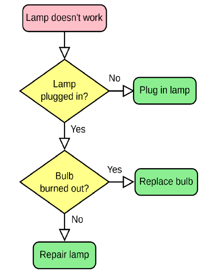

# Oefening 1 – Lampoplosser (5 punten)

## Info

Ga ervan uit dat de gebruiker géén foute invoer doet.

## Opgave
Gegeven volgende flowchart die een lamp-technieker gebruikt:



Schrijf een applicatie die met de gebruiker de flowchart overloopt om te bepalen wat er met de lamp moet gebeuren. De gebruiker dient telkens met yes of no te antwoorden.
Wanneer een van de 3 groene eindpunten wordt bereikt wordt de oplossing in rode tekst getoond en dan  vraagt de applicatie aan de gebruiker of deze nogmaals wil starten. Bij “no” sluit het programma af.
 
## Voorbeeld uitvoer

Tekst die start met “>” is invoer van de gebruiker.

```text
Lamp doesn't work. 
Lamp plugged in?
>no
Plug in lamp.
Restart?
>yes
Lamp doesn't work.
Lamp plugged in?
>yes
Bulb burned out?
>yes
Replace bulb.
Restart?
>no
```

# Oefening 2 – Roulette (7 punten)

## Info
Ga ervan uit dat de gebruiker géén foute invoer doet.

## Opgave

### Methode Casino
Maak een methode Casino. De methode aanvaart een double en een int als parameter en geeft een double terug.
De methode zal een casino-simuleren en geeft op het einde de winst (of verlies) van de speler terug. De double die wordt meegegeven is het startkapitaal. De int is het aantal simulaties n. De methode zal n roulette-rondes simuleren als volgt en telkens de winst of verlies bijhouden.

Iedere van de n simulaties gebeurt het volgende: 

1. De computer kiest een willekeurig getal tussen 0 en 60. Dit is zogezegd de keuze van de speler bij roulette. 
2. De computer kiest een willekeurig getal tussen 0 en 60. Dit is zogezegd het getal waar de roulette op belandt. 
3. Indien beide getallen overeenkomen zal het startkapitaal van de speler met 1 verhogen. Indien het getal niet gelijk was wordt er 0.1 van het kapitaal afgehouden.

Finaal geeft de methode terug hoeveel geld er nog overblijft.

### Applicatie

Maak een applicatie die aan de gebruiker een startkapitaal vraagt. Vervolgens gebruik je de Casino methode om aan de speler te tonen hoeveel er van zijn kapitaal zou overblijven als hij: 
* 10 keer het roulettespel speelt 
* 100 keer 
* 10 000 
* 1 000 000 keer
* 
Toon telkens ook hoeveel verlies (of winst) dit is ten opzichte van het startkapitaal. Bij winst wordt dit verschil in groene letters getoond, bij verlies in rode letters. 

## Voorbeeld uitvoer

Tekst die start met “>” is invoer van de gebruiker.

```text
Wat is je startkapitaal?
>1000
Gegeven deze informatie krijg ik volgende resultaten
Als je 10 keer roulette speelt zou je eindkapitaal 999,2 zijn, dat is een verschil van -0,8.
Als je 100 keer roulette speelt zou je eindkapitaal 993,4 zijn, dat is een verschil van -6,6.
Als je 10000 keer roulette speelt zou je eindkapitaal 133,8 zijn, dat is een verschil van -866,2.
Als je 1000000 keer roulette speelt zou je eindkapitaal -95486,2 zijn, dat is een verschil van -94486,2.
```

# Oefening 3 – Conferentie (8 punten)

## Info
Ga ervan uit dat de gebruiker géén foute invoer doet.

## Opgave

De opleiding organiseert een conferentie. Om dit in goede banen te leiden is besloten om de deelnemers via een applicatie te registeren. De applicatie zal twee arrays bijhouden, 1 met de achternamen (type string), 1 met de leeftijd van die persoon. 
De applicatie bestaat uit 3 fases: 

1. Fase 1 Registratie: nieuwe deelnemers kunnen wordt toegevoegd, samen met hun leeftijd. 
2. Fase 2 Statistieken: Statistieken van de conferentie. 
3. Fase 3 Informatie opvragen: de gebruiker kan de leeftijd van een gebruiker opzoeken.

### Fase 1: 

De gebruiker kan deelnemers toevoegen. 

De applicatie vraagt telkens de naam, en dan de leeftijd. Indien als naam “stop” wordt gegeven stopt deze fase. De ingevoerde naam en leeftijd wordt in de respectievelijke array geplaatst (op dezelfde index). Er kunnen maximum 50 mensen deelnemen aan de conferentie.


### Fase 2: 

Vervolgens worden de volgende statistieken van de deelnemers getoond: 
* Aantal deelnemers 
* Gemiddelde leeftijd van de deelnemers 
* Aantal deelnemers met een leeftijd onder het gemiddelde, inclusief hun namen 
* Aantal deelnemers met een leeftijd boven of gelijk aan het gemiddelde, inclusief hun namen

### Fase 3: 

De gebruiker kan nu éénmalig de leeftijd van één deelnemer opzoeken. De gebruiker dient hiervoor de naam in te voeren. Indien de naam gevonden wordt, dan zal de leeftijd getoond worden. Zo niet dan verschijnt de boodschap “niet gevonden”.
 
## Voorbeeld uitvoer

Tekst die start met “>” is invoer van de gebruiker.

```text
Geef deelnemers ("stop" om te stoppen)
>jos
Geef leeftijd van jos
>24
Geef deelnemers ("stop" om te stoppen)
>frans
Geef leeftijd van frans
>88
Geef deelnemers ("stop" om te stoppen)
>marie
Geef leeftijd van marie
>32
Geef deelnemers ("stop" om te stoppen)
>stop
Fase 2 - Statistieken van de deelnemers
Er zijn 3 deelnemers
Gemiddelde leeftijd is 48
Er zijn 2 deelnemers onder het gemiddelde namelijk jos, marie,
Er zijn 1 deelnemers boven of op het gemiddelde namelijk frans
Fase 3 - Welke deelnemer zoekt u?
>frans
Deze heeft leeftijd 88
```


::::{.callout-caution collapse="true" title="Oplossing"}

# Oefening 1

```csharp
bool repeat = true;
while (repeat)
{
    Console.WriteLine("Lamp doesn't work");
    Console.WriteLine("Lamp plugged in?");
    string plugAnswer = Console.ReadLine();
    if(plugAnswer=="no")
    {
        Console.ForegroundColor = ConsoleColor.Red;
        Console.WriteLine("Plug in lamp");
    }
    else
    {
        Console.WriteLine("Bulb burned out?");
        string burnAnswer = Console.ReadLine();
        if(burnAnswer=="yes")
        {
            Console.ForegroundColor = ConsoleColor.Red;
            Console.WriteLine("Replace bulb");
        }
        else
        {
            Console.ForegroundColor = ConsoleColor.Red;
            Console.WriteLine("Repair lamp");
        }
    }
    Console.ResetColor();
    Console.WriteLine("Restart?");
    string resAnswer = Console.ReadLine();
    if (resAnswer == "no")
        repeat = false;
}
```

# Oefening 2

```csharp
static void Main(string[] args)
{
    int[] pogingen = { 10, 100, 10000, 1000000 };
    Console.WriteLine("Wat is je startkapitaal?");
    double start = Convert.ToDouble(Console.ReadLine());
    Console.WriteLine("Gegeven deze informatie krijg je volgende resultaten");
    for (int i = 0; i < pogingen.Length; i++)
    {
        double resultaat = Casino(start, pogingen[i]);
        Console.Write($"Als je {pogingen[i]} keer roulette speelt zou je eindkapitaal {resultaat} zijn, dat is een verschil van ");
        if(resultaat-start <0)
        {
            Console.ForegroundColor = ConsoleColor.Red;
        }
        else
        {
            Console.ForegroundColor = ConsoleColor.Green;
        }
        Console.WriteLine(start - resultaat);
        Console.ResetColor();
    }
}

static double Casino(double start, int aantalKeer)
{
    double resultaat = start;
    Random rng = new Random();
    for (int i = 0; i < aantalKeer; i++)
    {
        if (rng.Next(0, 60) == rng.Next(0, 60))
            resultaat++;
        else
            resultaat -= 0.1;
    }
    return resultaat;
}
```


# Oefening 3

```csharp
static void Main(string[] args)
{
    string[] namen = new string[50];
    for (int i = 0; i < namen.Length; i++)
    {
        namen[i] = "leeg";
    }
    int[] leeftijden = new int[50];


    //Fase 1
    string naamInvoer = "";
    int index = 0;
    do
    {
        Console.WriteLine("Geef deelnemers (\"stop\" om te stoppen)");
        naamInvoer = Console.ReadLine();
        if (naamInvoer != "stop")
        {
            namen[index] = naamInvoer;
            Console.WriteLine($"Geef de leeftijd van {naamInvoer}");
            leeftijden[index] = Convert.ToInt32(Console.ReadLine());
            index++;
        }
    } while (naamInvoer != "stop");

    //Fase 2
    Console.WriteLine("Fase 2 - statistieken van de deelnemers");
    Console.WriteLine($"Er zijn {TelDeelnemers(namen)} deelnemers");
    Console.WriteLine($"Gemiddeldeleeftijd is {BerekenGemiddelde(leeftijden, namen)}");
    BerekenEnToonBovenOnderGemiddelde(leeftijden, namen);

    //Fase 3
    VindPersoon(namen, leeftijden);
}

private static void VindPersoon(string[] namen, int[] leeftijden)
{
    Console.WriteLine("Fase 3 - Welke deelnemer zoekt u?");
    string persoon = Console.ReadLine();
    bool gevonden = false;
    int leeftijd = 0;
    int index = 0;
    do
    {
        if (namen[index]==persoon)
        {
            gevonden = true;
            leeftijd = leeftijden[index];
        }
        index++;
    } while (!gevonden && index<namen.Length );
    if(gevonden)
        Console.WriteLine($"Deze heeft leeftijd {leeftijd}");
    else
    {
        Console.WriteLine("Niet gevonden");
    }
}

private static void BerekenEnToonBovenOnderGemiddelde(int[] leeftijden, string[] namen)
{
    double gemiddelde = BerekenGemiddelde(leeftijden, namen);
    int onder = 0;
    int boven = 0;
    int index = 0;
    string onderNamen = "";
    string bovenNamen = "";
    while (namen[index] != "leeg" && index < namen.Length)
    {
        if (leeftijden[index] < gemiddelde)
        { 
            onder++;
            onderNamen += $"{namen[index]},";
        }
        else
        {
            boven++;
            bovenNamen += $"{namen[index]},";
        }
        index++;
    }


    Console.WriteLine($"Er zijn {onder} onder het gemiddelde namelijk {onderNamen}");
    Console.WriteLine($"Er zijn {boven} gelijk of boven het gemiddelde namelijk {bovenNamen}");

}

private static double BerekenGemiddelde(int[] leeftijden, string[] namen)
{
    int som = 0;
    for (int i = 0; i < leeftijden.Length; i++)
    {
        som += leeftijden[i];
    }
    return (double)som / TelDeelnemers(namen);
}

private static int TelDeelnemers(string[] namen)
{

    for (int i = 0; i < namen.Length; i++)
    {
        if (namen[i] == "leeg")
            return i;
    }
    return 0;
}
```
::::
