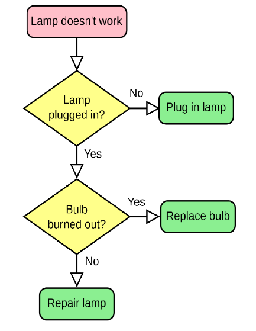

# Oefening 1 – Lampoplosser (5 punten)

## Info

Ga ervan uit dat de gebruiker géén foute invoer doet.

## Opgave
Gegeven volgende flowchart die een lamp-technieker gebruikt:



Schrijf een applicatie die met de gebruiker de flowchart overloopt om te bepalen wat er met de lamp moet gebeuren. De gebruiker dient telkens met yes of no te antwoorden.
Wanneer een van de 3 groene eindpunten wordt bereikt wordt de oplossing in rode tekst getoond en dan  vraagt de applicatie aan de gebruiker of deze nogmaals wil starten. Bij “no” sluit het programma af.
 
## Voorbeeld uitvoer

Tekst die start met “>” is invoer van de gebruiker.

```text
Lamp doesn't work. 
Lamp plugged in?
>no
Plug in lamp.
Restart?
>yes
Lamp doesn't work.
Lamp plugged in?
>yes
Bulb burned out?
>yes
Replace bulb.
Restart?
>no
```

# Oefening 2 – Roulette (7 punten)

## Info
Ga ervan uit dat de gebruiker géén foute invoer doet.

## Opgave

### Methode Casino
Maak een methode Casino. De methode aanvaart een double en een int als parameter en geeft een double terug.
De methode zal een casino simuleren en geeft op het einde terug hoeveel geld de speler nog overheeft. De double die wordt meegegeven is het startkapitaal. De int is het aantal simulaties n. De methode zal n roulette-rondes simuleren als volgt en telkens het kapitaal aanpassen.

Iedere van de n simulaties gebeurt het volgende: 

1. De computer kiest een willekeurig getal van 0 tot 60 (60 niet inbegrepen). Dit is zogezegd de keuze van de speler bij roulette. 
2. De computer kiest een willekeurig getal van 0 tot 60 (60 niet inbegrepen). Dit is zogezegd het getal waar de roulette op belandt. 
3. Indien beide getallen overeenkomen zal het kapitaal van de speler met 1 verhogen. Indien het getal niet gelijk was wordt er 0.1 van het kapitaal afgehouden.

Finaal geeft de methode terug hoeveel geld er nog overblijft.

### Applicatie

Maak een applicatie die aan de gebruiker een startkapitaal vraagt. Vervolgens gebruik je de Casino methode om aan de speler te tonen hoeveel er van zijn kapitaal zou overblijven als hij: 
* 10 keer het roulettespel speelt 
* 100 keer 
* 10 000 
* 1 000 000 keer

Toon telkens ook hoeveel verlies (of winst) dit is ten opzichte van het startkapitaal. Bij winst wordt dit verschil in groene letters getoond, bij verlies in rode letters. 

## Voorbeeld uitvoer

Tekst die start met “>” is invoer van de gebruiker. De getallen hangen van het toeval af: bij jou zullen ze anders zijn.

```text
Wat is je startkapitaal?
>1000
Gegeven deze informatie krijg ik volgende resultaten
Als je 10 keer roulette speelt zou je eindkapitaal 999 zijn, dat is een verschil van -1.
Als je 100 keer roulette speelt zou je eindkapitaal 992,2 zijn, dat is een verschil van -7,8.
Als je 10000 keer roulette speelt zou je eindkapitaal 178,2 zijn, dat is een verschil van -821,8.
Als je 1000000 keer roulette speelt zou je eindkapitaal -80747,7 zijn, dat is een verschil van -81747,7.
```

# Oefening 3 – Conferentie (8 punten)

## Info
Ga ervan uit dat de gebruiker géén foute invoer doet.

## Opgave

De opleiding organiseert een conferentie. Om dit in goede banen te leiden is besloten om de deelnemers via een applicatie te registeren. De applicatie zal twee arrays bijhouden, 1 met de achternamen (type string), 1 met de leeftijd van die persoon. 
De applicatie bestaat uit 3 fases: 

1. Fase 1 Registratie: nieuwe deelnemers kunnen wordt toegevoegd, samen met hun leeftijd. 
2. Fase 2 Statistieken: Statistieken van de conferentie. 
3. Fase 3 Informatie opvragen: de gebruiker kan de leeftijd van een gebruiker opzoeken.

### Fase 1: 

De gebruiker kan deelnemers toevoegen. 

De applicatie vraagt telkens de naam, en dan de leeftijd. Indien als naam “stop” wordt gegeven stopt deze fase. De ingevoerde naam en leeftijd wordt in de respectievelijke array geplaatst (op dezelfde index). Er kunnen maximum 50 mensen deelnemen aan de conferentie.


### Fase 2: 

Vervolgens worden de volgende statistieken van de deelnemers getoond: 
* Aantal deelnemers 
* Gemiddelde leeftijd van de deelnemers 
* Aantal deelnemers met een leeftijd onder het gemiddelde, inclusief hun namen 
* Aantal deelnemers met een leeftijd boven of gelijk aan het gemiddelde, inclusief hun namen

### Fase 3: 

De gebruiker kan nu éénmalig de leeftijd van één deelnemer opzoeken. De gebruiker dient hiervoor de naam in te voeren. Indien de naam gevonden wordt, dan zal de leeftijd getoond worden. Zo niet dan verschijnt de boodschap “niet gevonden”.
 
## Voorbeeld uitvoer

Tekst die start met “>” is invoer van de gebruiker.

```text
Geef deelnemers ("stop" om te stoppen)
>jos
Geef leeftijd van jos
>24
Geef deelnemers ("stop" om te stoppen)
>frans
Geef leeftijd van frans
>88
Geef deelnemers ("stop" om te stoppen)
>marie
Geef leeftijd van marie
>32
Geef deelnemers ("stop" om te stoppen)
>stop
Fase 2 - Statistieken van de deelnemers
Er zijn 3 deelnemers
Gemiddelde leeftijd is 48
Er zijn 2 deelnemers onder het gemiddelde namelijk jos, marie
Er zijn 1 deelnemers boven of op het gemiddelde namelijk frans
Fase 3 - Welke deelnemer zoekt u?
>frans
Deze heeft leeftijd 88
```


::::{.callout-caution collapse="true" title="Oplossing"}

**Oefening 1**

```java
namespace Lampoplosser
{
    internal class Program
    {
        static void Main(string[] args)
        {
            bool herstarten = true;
            while (herstarten)
            {
                Console.WriteLine("Lamp doesn't work.");
                Console.WriteLine("Lamp plugged in?");
                string stekkerAntwoord = Console.ReadLine();
                if (stekkerAntwoord == "no")
                {
                    Console.ForegroundColor = ConsoleColor.Red;
                    Console.WriteLine("Plug in lamp.");
                }
                else
                {
                    Console.WriteLine("Bulb burned out?");
                    string lampAntwoord = Console.ReadLine();
                    Console.ForegroundColor = ConsoleColor.Red;
                    if (lampAntwoord == "yes")
                    {
                        Console.WriteLine("Replace bulb.");
                    }
                    else
                    {
                        Console.WriteLine("Repair lamp.");
                    }
                }
                Console.ResetColor();
                Console.WriteLine("Restart?");
                string herstartAntwoord = Console.ReadLine();
                if (herstartAntwoord == "no")
                {
                    herstarten = false;
                }
            }
        }
    }
}
```

**Oefening 2**

```java
namespace Roulette
{
    internal class Program
    {
        static void Main(string[] args)
        {
            int[] pogingen = { 10, 100, 10000, 1000000 };
            Console.WriteLine("Wat is je startkapitaal?");
            double start = Convert.ToDouble(Console.ReadLine());
            Console.WriteLine("Gegeven deze informatie krijg ik volgende resultaten");
            for (int i = 0; i < pogingen.Length; i++)
            {
                double eindkapitaal = Casino(start, pogingen[i]);
                double verschil = eindkapitaal - start;
                Console.Write($"Als je {pogingen[i]} keer roulette speelt zou je eindkapitaal {Math.Round(eindkapitaal, 2)} zijn, dat is een verschil van ");
                if (verschil < 0)
                {
                    Console.ForegroundColor = ConsoleColor.Red;
                }
                else
                {
                    Console.ForegroundColor = ConsoleColor.Green;
                }
                Console.Write(Math.Round(verschil, 2));
                Console.ResetColor();
                Console.WriteLine(".");
            }
        }

        static double Casino(double startkapitaal, int aantalRondes)
        {
            double kapitaal = startkapitaal;
            Random rng = new Random();
            for (int i = 0; i < aantalRondes; i++)
            {
                int keuzeSpeler = rng.Next(0, 60);
                int getalRoulette = rng.Next(0, 60);
                if (keuzeSpeler == getalRoulette)
                {
                    kapitaal++;
                }
                else
                {
                    kapitaal -= 0.1;
                }
            }
            return kapitaal;
        }
    }
}
```

**Oefening 3**

```java
namespace Conferentie
{
    internal class Program
    {
        static void Main(string[] args)
        {
            string[] namen = new string[50];
            int[] leeftijden = new int[50];

            //Fase 1
            int aantalDeelnemers = 0;
            string naamInvoer = "";
            while (naamInvoer != "stop" && aantalDeelnemers < namen.Length)
            {
                Console.WriteLine("Geef deelnemers (\"stop\" om te stoppen)");
                naamInvoer = Console.ReadLine();
                if (naamInvoer != "stop")
                {
                    namen[aantalDeelnemers] = naamInvoer;
                    Console.WriteLine($"Geef leeftijd van {naamInvoer}");
                    leeftijden[aantalDeelnemers] = Convert.ToInt32(Console.ReadLine());
                    aantalDeelnemers++;
                }
            }
            if (aantalDeelnemers == namen.Length)
            {
                Console.WriteLine("De conferentie is volzet.");
            }

            //Fase 2
            Console.WriteLine("Fase 2 - Statistieken van de deelnemers");
            Console.WriteLine($"Er zijn {aantalDeelnemers} deelnemers");
            double gemiddelde = BerekenGemiddelde(leeftijden, aantalDeelnemers);
            Console.WriteLine($"Gemiddelde leeftijd is {Math.Round(gemiddelde, 2)}");
            ToonOnderEnBovenGemiddelde(namen, leeftijden, aantalDeelnemers, gemiddelde);

            //Fase 3
            ToonLeeftijdVanDeelnemer(namen, leeftijden, aantalDeelnemers);
        }

        static double BerekenGemiddelde(int[] leeftijden, int aantalDeelnemers)
        {
            if (aantalDeelnemers == 0)
            {
                return 0;
            }
            int som = 0;
            for (int i = 0; i < aantalDeelnemers; i++)
            {
                som += leeftijden[i];
            }
            return (double)som / aantalDeelnemers;
        }

        static void ToonOnderEnBovenGemiddelde(string[] namen, int[] leeftijden, int aantalDeelnemers, double gemiddelde)
        {
            int aantalOnder = 0;
            int aantalBoven = 0;
            string namenOnder = "";
            string namenBoven = "";
            for (int i = 0; i < aantalDeelnemers; i++)
            {
                if (leeftijden[i] < gemiddelde)
                {
                    aantalOnder++;
                    namenOnder = VoegNaamToe(namenOnder, namen[i]);
                }
                else
                {
                    aantalBoven++;
                    namenBoven = VoegNaamToe(namenBoven, namen[i]);
                }
            }
            Console.WriteLine($"Er zijn {aantalOnder} deelnemers onder het gemiddelde namelijk {namenOnder}");
            Console.WriteLine($"Er zijn {aantalBoven} deelnemers boven of op het gemiddelde namelijk {namenBoven}");
        }

        static string VoegNaamToe(string lijst, string naam)
        {
            if (lijst == "")
            {
                return naam;
            }
            return lijst + ", " + naam;
        }

        static void ToonLeeftijdVanDeelnemer(string[] namen, int[] leeftijden, int aantalDeelnemers)
        {
            Console.WriteLine("Fase 3 - Welke deelnemer zoekt u?");
            string gezochteNaam = Console.ReadLine();
            int gevondenIndex = -1;
            int index = 0;
            while (gevondenIndex == -1 && index < aantalDeelnemers)
            {
                if (namen[index] == gezochteNaam)
                {
                    gevondenIndex = index;
                }
                index++;
            }
            if (gevondenIndex != -1)
            {
                Console.WriteLine($"Deze heeft leeftijd {leeftijden[gevondenIndex]}");
            }
            else
            {
                Console.WriteLine("niet gevonden");
            }
        }
    }
}
```
::::
