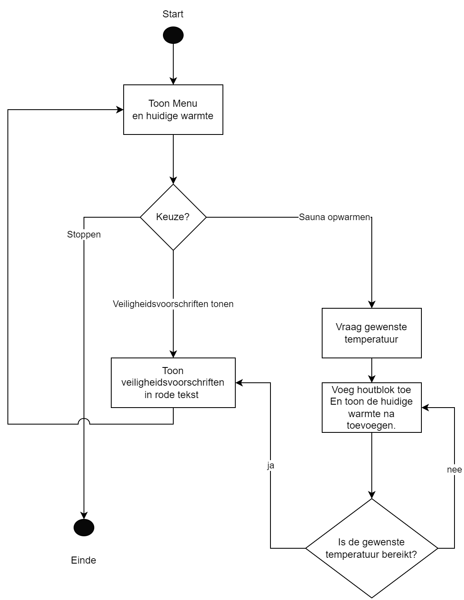

# Oefening 1 - Sauna (5 punten)

## Info

Ga ervan uit dat de gebruiker géén foute invoer doet.

### Opgave

Gegeven volgende flowchart voor een sauna. De gebruiker kan via een menu'tje ingeven wat hij wenst te doen. Pas de flowchart toe en houdt rekening met volgende zaken:

1. De veiligheidsvoorschriften tonen gewoon de tekst "OPGELET WARM!" in rode letters.
2. De sauna start met 5 houtblokken op het vuur. Ieder houtblok zorgt voor 10 graden warmte. Als de gebruiker dus 60 graden wenst, dan moet er 1 blok toegevoegd worden. Telkens een blok wordt toegevoegd wordt de nieuwe warmte getoond. De sauna zal nooit voorbij de gewenste warmte gaan. Als de gebruiker dus 75 graden wenst, dan zullen er in totaal 7 blokken op het vuur moeten liggen.
3. Telkens het menu wordt getoond verminder het aantal blokken met 1. (dit wil zeggen dat de 5 startblokken ogenblikkelijk 4 worden wanneer het programma opstart en het menu toont). 


### Voorbeeld uitvoer

*Tekst die start met ">" is invoer van de gebruiker.*

```text
Welkom bij de sauna (40 graden). Je keuze? 1=voorschriften, 2= opwarmen, 3= stoppen.
>1
OPGELET WARM!
Welkom bij de sauna (30 graden). Je keuze? 1=voorschriften, 2= opwarmen, 3= stoppen.
>2
Hoe warm moet het worden?
>65
1 blok toegevoegd. Het is nu 40 graden.
1 blok toegevoegd. Het is nu 50 graden.
1 blok toegevoegd. Het is nu 60 graden.
OPGELET WARM!
Welkom bij de sauna (50 graden). Je keuze? 1=voorschriften, 2= opwarmen, 3= stoppen.
>3
```



# Oefening 2 - Kentekengenerator (6 punten)

## Info

Ga ervan uit dat de gebruiker géén foute invoer doet.

### Opgave

Schrijf volgende 3 methoden:

* Een methode A (naam: ``GenGetal``)die aan de gebruiker een getal vraagt en dit getal verdubbeld teruggeeft. Indien de gebruiker een negatief getal opgeeft dan zal de methode 0 teruggeven. Deze methode vereist geen parameters.
* Een methode B (naam: ``GenLandcode``)die iedere aanroep een string bestaande uit 2 random karakters (hoofdletters "A" tot en met "Z") teruggeeft. 25% van de tijd zal de methode de string "XX" teruggeven in plaats van een random sequentie. Deze methode vereist geen parameters.
* Een methode C (naam: ``Combineer``) waar een landcode (bv "BE") en een geheel getal aan kan meegegeven worden. De landcode is optioneel (standaard : "BE"). De methode zal de landcode en het getal samengevoegd als een string teruggeven. Als er dus "FR" en 5 wordt meegegeven, geeft de methode FR5 terug.

Maak een methode ``GenereerAutoKenteken``. Deze methode heeft geen invoer en geeft een string terug, als volgt:

1. Het roept eerst methode A aan.
2. Het roept methode B aan.
3. Het gebruikt de uitvoer van voorgaande methoden om methode C aan te roepen. Indien methode B "XX" teruggaf, dan zal methode C zonder landcode parameter worden aangeroepen.

Roep de methode ``GenereerAutoKenteken`` 5 keer aan vanuit de main en bewaar de kentekens in een arrays.

Toon finaal alle gegenereerde kentekens in de array aan de gebruiker.


### Voorbeeld uitvoer

*Tekst die start met ">" is invoer van de gebruiker.*

```text
Geef een getal in: 
>24
Geef een getal in: 
>5
Geef een getal in: 
>-12
Geef een getal in: 
>65
Geef een getal in: 
>74

Gegenereerde kentekens:
BE48
BE10
HQ0
PL130
BE148
```

# Oefening 3 - IP IP IP (8 punten)

## Info


Ga ervan uit dat de gebruiker géén foute invoer doet.

### Opgave


Volgende methode kan je gebruiken om het IP-adres van je computer te verkrijgen. Deze methode zal je IP-adres teruggeven als een array van 4 strings. Als je adres het volgende is  "192.168.1.100", dan zal de methode dit teruggeven als de stringarray met de waarden: "192","168","1","100". 

```java
static string[] VerkrijgIP()
{
    try
    {
        var host = Dns.GetHostEntry(Dns.GetHostName());
        foreach (var ip in host.AddressList)
        {
            if (ip.AddressFamily == AddressFamily.InterNetwork)
            {
                return ip.ToString().Split(".");
            }
        }
        return new string[] { "0","0","0","0"}; //indien geen adres gevonden
    }
    catch (Exception ex)
    {
        return new string[] { "0", "0", "0", "0" };
    }
}
```

Gebruik deze methode om volgende zaken te doen (**OPGELET: bovenstaande methodecode mag NIET aangepast worden**): 

#### Basis informatie

In het hoofdprogramma gebeuren volgende zaken:

1. Je toont je eigen IP-adres (verkregen via de ``VerkrijgIP`` methode), waarbij je een punt plaatst tussen ieder deel, bijvoorbeeld: "192.168.1.100".
2. Je toont het masker, waarbij we veronderstellen dat het laatste element uit de array het masker is. Dit laatste deel tonen we als "x" .Als ons huidige IP adres "10.3.34.234" is dan tonen we: "10.3.34.x".

#### Hulp-methoden

Maak een aantal hulpmethoden aan (bepaald zelf return type en eventuele parameters), met volgende eigenschappen.

1. ``IsLokaal``: deze methode controleert of een meegegeven IP-adres uit een lokaal netwerk komt. Een IP-adres is lokaal indien het eerste van de 4 delen 10 of 192 is. "10.34.42.2" is dus een lokaal adres. "34.10.12.111" is geen lokaal adres.
2. ``ToonOmgekeerd``: deze methode toont het meegegeven IP-adres omgekeerd op het scherm. "192.168.1.100" wordt dan "100.1.168.192" op het scherm.
3. ``IsCorrectAdres``: deze methode controleert of een meegegeven IP-adres een legaal adres is. Een IP-adres is geldig indien ieder deel een getal is tussen 1 tot en met 254. Volgende adres is dus geen correct adres "192.304.2.6", vanwege het tweede deel dat hoger is dan 254.
4. ``IsGelijk``: deze methode zal laten weten of 2 meegegeven IP-adressen identiek zijn. 
5. ``VerhoogAdres``: deze methode zal het meegegeven IP-adres met eentje verhogen. Het zal het achterste getal met 1 verhogen. Indien het getal op 255 komt, dan wordt dit getal terug 1 (je hoeft niets met het 2e getal te doen). "192.168.1.100" zal "192.168.1.101" worden. "192.157.23.254" zal "192.157.23.1" worden.  Het nieuwe adres wordt terug als een string-array gegeven uit de methode.

**Toon de werking in je main aan van deze methoden, gebruik makend van je eigen IP-adres dat je van de methode ``VerkrijgIP`` kreeg.**. 


### Voorbeeld uitvoer

*Tekst die start met ">" is invoer van de gebruiker.*

```text
Je ipadres is: 192.168.1.100
Het masker: 192.168.1.x

Werking Islokaal: Dit is een lokaal adres.
Werking Omgekeerd: 100.1.168.192
Werking IsCorrectAdres: Dit is een correct adres
Werking IsGelijk( vergeleken met 192.168.1.105): deze zijn niet gelijk
Werking VerhoogdAdres, nieuwe adres is: 192.168.1.101
```


::::{.callout-caution collapse="true" title="Oplossing"}
Oefening 1 oplossing:

```java
enum MenuKeuzes { Voorschriften = 1, Opwarmen, Stoppen, Onbekend }
static void Main(string[] args)
{
    //Start
    MenuKeuzes gebruikersKeuze = MenuKeuzes.Onbekend;
    int aantalBlokken = 5;
    const int blokWarmte = 10;
    //Toon menu en huidige warme
    do
    {
        aantalBlokken--;
        Console.Write($"Welkom ,bij de sauna ({aantalBlokken* blokWarmte} graden)");
        Console.WriteLine("Je keuze? 1=voorschriften, 2= opwarmen, 3= stoppen.");
        gebruikersKeuze = (MenuKeuzes)int.Parse(Console.ReadLine());
        switch (gebruikersKeuze)
        {
            case MenuKeuzes.Voorschriften:
                ToonVeiligheidsVoorschriften();
                break;
            case MenuKeuzes.Opwarmen:
                Console.WriteLine("Hoe warm moet het worden?");
                int gewensteTemp = int.Parse(Console.ReadLine());
                while(aantalBlokken* blokWarmte + blokWarmte <= gewensteTemp)
                {
                    aantalBlokken++;
                    Console.WriteLine($"1 blok toegevoegd. Het is nu {aantalBlokken* blokWarmte} graden.");
                }
                ToonVeiligheidsVoorschriften();
                break;
            case MenuKeuzes.Stoppen:
                break;
            case MenuKeuzes.Onbekend:
                Console.WriteLine("Foute keuze.Probeer opnieuw");
                break;
            default:
                break;
        }
    } while (gebruikersKeuze!= MenuKeuzes.Stoppen);

}

static void ToonVeiligheidsVoorschriften()
{
    Console.ForegroundColor = ConsoleColor.Red;
    Console.WriteLine("OPGELET WARM!");
    Console.ResetColor();
}

```

Oefening 2 oplossing:

```java
static void Main(string[] args)
{
    string[] kentekens = new string[5];
    for (int i = 0; i < kentekens.Length;i++)
    {
        kentekens[i] = GenereerAutoKenteken();
    }

    Console.WriteLine("Gegenereerde kentekens:");
    for (int i = 0; i < kentekens.Length;i++)
    {
        Console.WriteLine(kentekens[i]);
    }

}

static int GenGetal()
{
    Console.WriteLine("Geef een getal in:");
    int input = int.Parse(Console.ReadLine());
    if (input > 0)
        return input * 2;
    return 0;
}

static string GenLandcode()
{
    Random rng = new Random();
    if (rng.Next(0, 4) == 0)
        return "XX";
    char teken1 = (char)rng.Next((int)'A', (int)'Z' + 1);
    char teken2= (char)rng.Next((int)'A', (int)'Z' + 1);
    return teken1.ToString() + teken2.ToString();
}
static string Combineer (int getalIn, string code= "BE")
{
    return code + getalIn;
}
static string GenereerAutoKenteken()
{
    int getal = GenGetal();
    string code = GenLandcode();
    if (code == "XX") return Combineer(getal);
    return Combineer(getal, code);
}
```

Oefening 3 oplossing:

```java
static void Main(string[] args)
{
    string[] mijnIP = VerkrijgIP();
    ToonIPAdres(mijnIP);
    Console.WriteLine();
    ToonIPAdres(mijnIP, true);
    Console.WriteLine();

    Console.Write("\nWerking IsLokaal: ");
    if(IsLokaal(mijnIP))
        Console.WriteLine("Dit is een lokaal adres");
    else Console.WriteLine("Dit is geen lokaal adres");

    Console.Write($"Werking Omgekeerd:");
    ToonOmgekeerd(mijnIP);

    Console.Write("\nWerking IsCorrectAdres: ");
    if (IsCorrectAdres(mijnIP))
        Console.WriteLine("Dit is een correct adres");
    else Console.WriteLine("Dit is geen correct adres");

    string[] andereIp = new string[] { "192", "168","1","105" };
    Console.Write("\nWerking IsGelijk (vergeleken met ");
    ToonIPAdres(andereIp);
    Console.Write(") : ");
    if (IsGelijk(mijnIP, andereIp))
        Console.WriteLine("deze zijn gelijk");
    else Console.WriteLine("deze zijn niet gelijk");

    mijnIP = VerhoogAdres(mijnIP);
    Console.Write("Werking VerhoogAdres, nieuwe adres is: ");
    ToonIPAdres(mijnIP);

}
static void ToonIPAdres(string[] ip, bool masked = false)
{
    Console.Write($"{ip[0]}.{ip[1]}.{ip[2]}.");
    if (!masked)
        Console.Write(ip[3]);
    else
        Console.Write("x");
}

static bool IsLokaal(string[] ip)
{
    int eersteOctet = int.Parse(ip[0]);
    return (eersteOctet == 10 || eersteOctet == 192);
}

static void ToonOmgekeerd(string[] ip)
{

    ToonIPAdres(new string[] { ip[3], ip[2], ip[1], ip[0] });
}

static bool IsCorrectAdres(string[] ip)
{
    bool legaal = false;
    for (int i = 0; i < ip.Length; i++)
    {
        if (!IsCorrectOctet(ip[i]))
            return false;
    }
    return true;
}

static bool IsGelijk(string[] ip1, string[] ip2)
{
    for (int i = 0; i < ip1.Length; i++)
    {
        if (ip1[i] != ip2[i])
            return false;
    }
    return true;
}

static string[] VerhoogAdres(string[] ip)
{
    int laatsteOctet = int.Parse(ip[3]);
    laatsteOctet++;
    if (laatsteOctet > 254) laatsteOctet = 1;

    return new string[] { ip[0], ip[1], ip[2], laatsteOctet.ToString() };
}
static bool IsCorrectOctet(string octet)
{
    int octetGetal = int.Parse(octet);
    return octetGetal >= 1 && octetGetal < 255;
}

static string[] VerkrijgIP()
{
    try
    {
        var host = Dns.GetHostEntry(Dns.GetHostName());
        foreach (var ip in host.AddressList)
        {
            if (ip.AddressFamily == AddressFamily.InterNetwork)
            {
                return ip.ToString().Split(".");
            }
        }
        return new string[] { "0", "0", "0", "0" }; //indien geen adres gevonden
    }
    catch (Exception ex)
    {
        return new string[] { "0", "0", "0", "0" };
    }
}

```


::::
