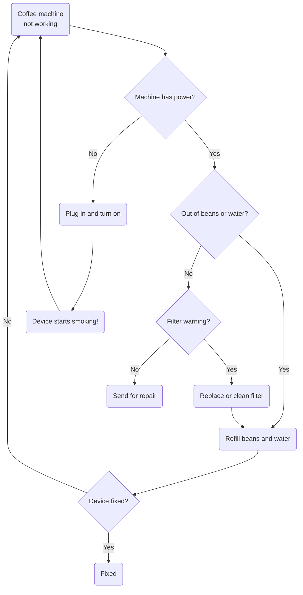
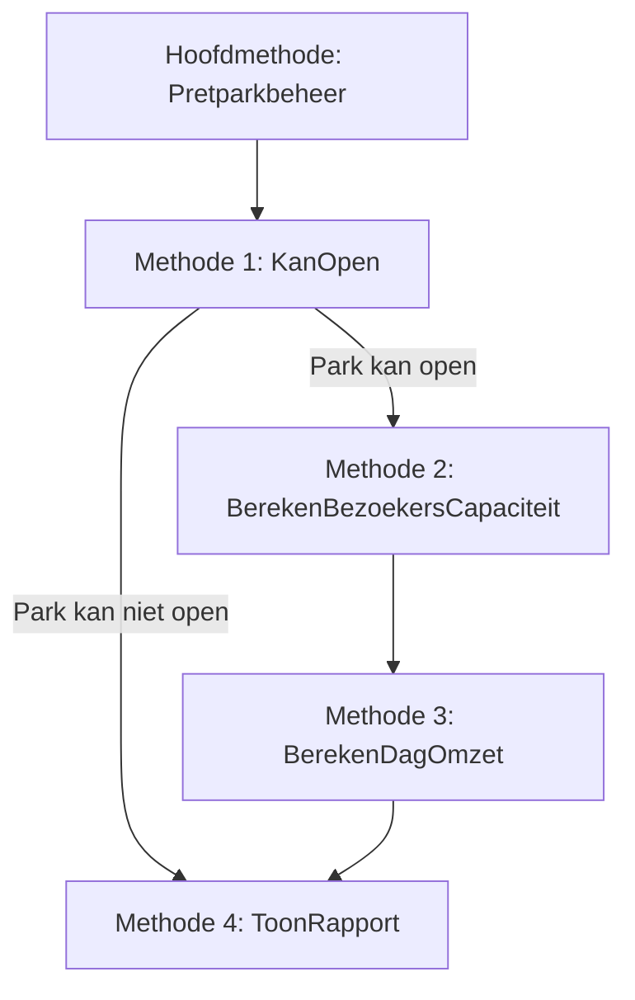

# Oefening 1 - Koffiereparatie

## Opgave

Gegeven volgende flowchart voor om de koffiezet te repareren. De gebruiker kan via een menu'tje ingeven wat hij wenst te doen. De invoer is niet hoofdlettergevoelig. Pas de flowchart toe en toon de relevante boodschappen. Gebruiker antwoord steeds met y of n:

<!-- 
npm install --global mermaid-filter
pandoc .\oef1.md -F mermaid-filter.cmd  -o oef1.docx 
--> 



## Voorbeeld uitvoer

*Tekst die start met ">" is invoer van de gebruiker.*

```text
Coffee machine not working.
Machine has power?
>n
Plug in and turn on.
Device starts smoking!
Coffee machine not working.
Machine has power?
>y
Out of beans or water?
>y
Refill beans and water.
Device fixed?
>y
Fixed!
```

# Oefening 2 - Filmfan

## Info
Je werkt voor een kleine streamingdienst die wil testen of hun films populair zijn. Elke film krijgt van kijkers een score tussen 0 en 10, en met die gegevens willen ze achterhalen welke films toppers zijn en welke eerder flops. In deze oefening bootsen we dat systeem na: je programmeert een eenvoudige consoletoepassing die automatisch willekeurige beoordelingen genereert en ze overzichtelijk presenteert. 

*Ga ervan uit dat de gebruiker géén foute invoer doet.*

## Opgave

Het programma maakt twee arrays aan met een lengte die aan de gebruiker wordt gevraagd: 

* één met de filmtitels ("Film1" t.e.m. "FilmX", met X de lengte van de array) 
* één met willekeurige ratings: gehele getallen van 0 tot en met 10 

De films en hun scores worden getoond, waarbij de kleur en symbolen extra context geven:

* groene tekst met een  sterretje ervoor voor toppers boven 8
    * bijvoorbeeld: "*Film3  Rating: 9" (volledig in groen)
* rood met uitroepteken voor zwakke films onder 4 
    * bijvoorbeeld: "!Film6  Rating: 2" (volledig in rood)

Daarna berekent het programma gemiddelde (tot 2 cijfers na de komma), hoogste en laagste score, en hoeveel keer een score van 8 of meer voorkomt. 

Tot slot krijgt de gebruiker een klein menu: door een filmnummer in te geven kan de score van die film met 1 punt verhoogd worden (maximaal tot 10). Het systeem past de weergave en de statistieken meteen aan, zodat je ziet hoe de arrays dynamisch evolueren. Dit blijft gebeuren tot de gebruiker een negatief getal invoert.


## Voorbeeld uitvoer

*Tekst die start met ">" is invoer van de gebruiker.*


```text
Hoeveel films wilt u beheren?
>3

Film 1      Rating: 7
!Film2      Rating: 1
*Film3      Rating: 8

Gemiddelde: 5.33 
Hoogste: 8
Laagste: 1
Aantal keer 8 of meer: 1

Voer filmnummer in (-1 is stoppen):
>2 

Film 1      Rating: 7
!Film2      Rating: 2
*Film3      Rating: 8

Gemiddelde: 5.67 
Hoogste: 8
Laagste: 2
Aantal keer 8 of meer: 1

Voer filmnummer in (-1 is stoppen):
>-1 
```

# Oefening 3 - Pretparkbeheer

## Info

Je werkt bij een groot pretpark dat elke ochtend moet beslissen of de poorten opengaan. Het succes van de dag hangt volledig af van het aantal medewerkers dat aanwezig is. Zijn er genoeg mensen, dan kunnen attracties draaien, bezoekers ontvangen worden en kan het park winst maken. Zijn er te weinig, dan blijven de poorten dicht en wordt het een stille dag.

*Ga ervan uit dat de gebruiker géén foute invoer doet.*

## Opgave

Je schrijft een eenvoudige applicatie die, op basis van het aantal beschikbare werknemers, beslist of het pretpark open kan. Indien dat zo is, wordt berekend hoeveel bezoekers maximaal kunnen worden ontvangen en welke omzet daarbij hoort. Alles wordt aangestuurd door één hoofdmethode, die achter de schermen drie andere methoden aanroept.




### Methoden

Voor de hoofdmethode wordt aangeroepen wordt aan de gebruiker gevraagd hoeveel werknemers er zijn, en wat de gewenste prijs per bezoeker is. Deze info wordt meegegeven aan de hoofdmethode.

**Hoofdmethode: Pretparkbeheer**
Deze methode is het startpunt. Ze ontvangt het aantal werknemers en prijs per bezoeker als invoer, roept de drie deelmethoden in volgorde aan, en toont een kort overzicht van de resultaten. 

Indien Methode 1 aangeeft dat het park niet open kan, dan zullen methoden 2 en 3 uiteraard genegeerd worden en wordt ogenblikkelijk methode 4 aangeroepen.

**Methode 1: KanOpen**

Controleert of het park open kan. Als er minder dan 20 werknemers zijn, blijft het park gesloten. De methode ontvangt het aantal werknemers en zal via een bool laten weten of het park open kan of niet. 

**Methode 2: BerekenBezoekersCapaciteit**

Bepaalt hoeveel bezoekers het park kan ontvangen. Voor elke werknemer kunnen er dagelijks 50 bezoekers bediend worden. Deze methode ontvangt het aantal werknemers en zal het maximum aantal bezoekers teruggeven.

**Methode 3: BerekenDagOmzet**

Bereken de verwachte omzet door het maximaal aantal bezoekers te vermenigvuldigen met een gemiddelde besteding van €30 per bezoeker. De prijs per bezoeker kan via een optinele parameter worden meegegeven, maar is dus standaard 30. De methode geeft de omzet terug.

**Methode 4: ToonRapport**

Verwerkt de resultaten van de vorige methoden en geeft een overzichtelijk rapport van de dag weer: aantal werknemers, of het park open is en zo ja, het maximum aantal bezoekers en de verwachte omzet.


## Voorbeeld uitvoer

*Tekst die start met ">" is invoer van de gebruiker.*

Voorbeeld 1

```text
Geef het aantal werknemers: 
>89
Geef prijs per bezoeker:
>22

=== Dagrapport Pretpark ===
Werknemers: 89
Park open: Ja
Max. bezoekers: 4450
Verwachte omzet:  97 900 euro
```

Voorbeeld 2:

```text
Geef het aantal werknemers: 19

=== Dagrapport Pretpark ===
Werknemers: 19
Park open: Nee
```