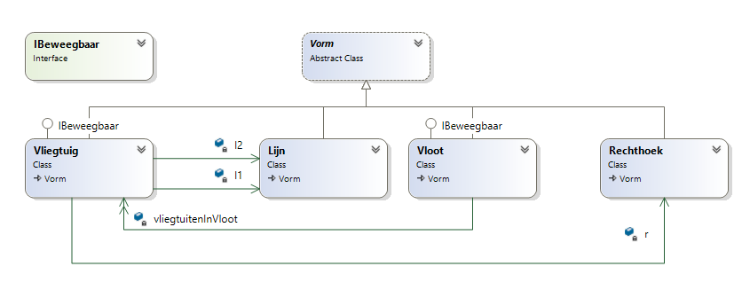
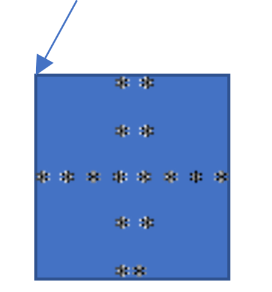

:::{.callout-tip}
Volgende opgave kwam uit de vaardigheidsproef module 4 van dit vak juni 2019.
:::

# Hamertje Tik
Maak een digitale console-versie van het klassieke kinderspel hamertje Tik
 
In dit spel heeft het kind een hele hoop kleurige blokjes ter beschikking waarmee hij op een kurken bord eender welke ‘tekening’ kan maken door de blokjes in de kurk met een nagel te kloppen.
# Opbouw project
Het project bestaat uit enkele delen.
* Klassen  	- Deel 1 (11 punten) : maken van de nodige klassen die Vormen voorstellen
* Menu		- Deel 2 (5 punten): maken van een menu die toelaat dat de gebruiker verschillende vormen op het scherm kan manipuleren
* PRO 		-Deel 3 (4 punten): een iets pittigere pro-gedeelte voor zij die nog tijd hebben


# DEEL 1  (11 PUNTEN)
We gaan volgende klasse-structuur in de volgende stappen maken:




## Stap 1: 	/2PUNTEN
Maak een abstracte klasse Vorm die z’n locatie (via x,y coördinaten als autoprops) op het scherm kan bijhouden alsook een abstracte methode  ``TekenVorm``.
Voeg voorts een virtual property Kleur toe van het type ``ConsoleColor``. Deze property is read-only en geeft ConsoleColor.Red terug.

De klasse ``Vorm`` heeft een overloaded constructor die steeds de x,y coördinaten verwacht als parameters vervolgens instelt in de bijhorende autoprops.

De Vorm heeft géén default constructor.

De locatie van de vormen die we hierna zullen definiëren is steeds het punt linksboven indien we een rechthoek omheen de vorm zouden tekenen. Het voorbeeld hier toont deze plek bij het vliegtuig van stap 3: 



 
## Stap 2:	/2punten
Maak twee klassen die allebei een Vorm zijn:
* ``Rechthoek``
* ``Lijn``

Zorg ervoor dat beide vormen via TekenVorm zichzelf op het scherm kunnen tonen in hun eigen kleur.

**Lijn:**
* Heeft een Lengte autoproperty
* Heeft 1 overloaded constructor die x,y en lengte vraagt
* Heeft als kleur ``ConsoleColor.Green``
* Een lijn bestaat uit een reeks sterretjes (*)  horizontaal naast elkaar, gelijk aan de lengte die je via de constructor van bij de start kunt meegeven. Bijvoorbeeld bij lengte 3:


```text
	* * *
```

**Rechthoek:**

* Heeft een Lengte en Breedte autoproperty. De lengte is het aantal rijen (verticaal), de breedte het aantal kolommen (horizontaal).
* Heeft 2 constructors:
  * 1 overloaded die x,y, lengte en breedte vraagt
  * default die standaard een rechthoek op locatie 1,1 zet met lengte en breedte 2
* Heeft als kleur ``ConsoleColor.Yellow``
* Een rechthoek verwacht een lengte en breedte bij het aanmaken en kan zichzelf ook tekenen. Als je lengte 4 en breedte 2 ingaf, zou deze er als volgt uitzien (4 rijen, 2 kolommen):


```text
 	* * 
	* * 
	* * 
	* *
```

## Stap 3:	/3punten
Maak een klasse Vliegtuig dat ook een Vorm is. Een vliegtuig bestaat (compositie!) uit 1 Rechthoek en 2 Lijn-objecten en ziet er altijd hetzelfde uit, namelijk
* Een rechthoek met lengte 5 en breedte 2 (5 rijen, 2 kolommen)
* Links en rechts van deze rechthoek een lijn met lengte 3, telkens in de helft van de lengte van deze rechthoek (op de middelste rij)
* Enkel de locatie op het scherm kan anders zijn per vliegtuig, hun afmetingen echter niet.


```text
	   * * 
	   * * 
     * * * * * * * * 
	   * * 
	   * *
```

Een Vliegtuig heeft een constructor die de x,y locatie vraagt (zie tekening vorige pagina i.v.m. coördinaten) en zal in de constructor de 3 vormen (2 lijnen en 1 rechthoek) aanmaken.

Merk op dat dus dat het lichaam (de Rechthoek) geel zal zijn, en de twee vleugels groen (van de lijnen).

## Stap 4:	/2punten
Maak een klasse Vloot dat ook een Vorm is. Een vloot bestaat uit 1 of meerdere vliegtuigen. Je kan via de constructor instellen hoeveel vliegtuigen er moeten zijn in 1 Vloot, alsook de x,y coördinaten (linksboven).De nodige vliegtuigen worden in de constructor aangemaakt en in een lijst bijgehouden in het Vloot-object zelf.

Houd via een lijst in de klasse de vliegtuigen bij. Een vloot vliegtuigen dat getekend wordt tekent gewoon alle vliegtuigen onder mekaar.

Een vloot van 3 vliegtuigen zal er als volgt uitzien op het scherm:


```text
        * * 
        * *
  * * * * * * * * 
        * * 
        * *
        * * 
        * *
  * * * * * * * * 
        * * 
        * *
        * * 
        * *
  * * * * * * * * 
        * * 
        * *
```

Merk op dat de vliegtuigen hun originele kleuren behouden uit de vorige stap.
 
##	Stap 5:	/2 punten
Maak een interface ``IBeweegbaar``, bestaande uit 1 methode ``Beweeg``. Deze geeft niets terug en heeft 1 parameter van het type ``Richting``.

``Richting`` is een enum-type dat 4 mogelijke waarden heeft: Links, Rechts, Boven, Beneden.

Pas de interface toe op Vliegtuig en Vloot. Deze methode zal de Locatie van het object 1 plekje opschuiven in de richting die in de parameter werd meegegeven. Als dus vervolgens het object opnieuw wordt getekend, zal het object 1 plek in die richting opgeschoven zijn (bij ``Rechts`` dus 1 plek naar rechts).

Vormen verplaatsen is een kwestie van de X,Y coördinaten aan te passen. Opgelet: een Vliegtuig bestaat uit een Rechthoek en twee Lijn-objecten die elk hun eigen coördinaten hebben, en een Vloot bestaat uit vliegtuigen. Die onderdelen moeten dus mee verplaatst worden.

  
# Deel 2		(5 PUNTEN)

##	Stap 6	/5punten

Maak nu een hamertje tik-programma: een console-programma dat de gebruiker steeds volgende vragen stelt en vervolgens de gevraagde vormen toevoegt aan het scherm. Op de duur zal de gebruiker grote, complexe tekeningen kunnen maken door meerdere vormen en types te combineren. 
Iedere vorm die wordt toegevoegd zal in een lijst worden bijgehouden.

Een loop zal steeds volgende stappen uitvoeren tot de gebruiker het programma afsluit. 
1. Alle vormen die reeds zijn toegevoegd in de lijst op het scherm tekenen via TekenVorm
2. Aan gebruiker vragen wat er moet gebeuren
3. Beeld leegmaken


De vragen die gesteld kunnen worden:
1. *Lijst  leegmaken* => alle vormen verdwijnen en de gebruiker kan terug opnieuw beginnen
2. *Vorm toevoegen* => zal de gewenste vorm toevoegen aan een lijst nadat volgende 2 of 3 extra zaken aan de gebruiker werden gevraagd:
   1. *Welke vorm?* (rechthoek, lijn, vliegtuig, vloot)
   2. *Locatie* (x,y) op het scherm
   3. Vormafhankelijke informatie? (bv aantal vliegtuigen)
3. *Afsluiten* => programma sluit af
4. *Verplaats object naar…*: gevolgd door de vraag in welke richting moet verplaatst worden. Wanneer de gebruiker deze optie kiest, zullen alle objecten die de IBeweegbaar hebben 1 plekje in de ingegeven richting verschoven worden


# DEEL 3	(4 PUNTEN)

##	STAP 7:	/2 punten

Voeg een nieuw menu-item toe namelijk *Vergroot vloot*. Wanneer de gebruiker deze optie kiest zullen alle Vloot-objecten in de lijst 1 extra vliegtuig bijkrijgen. Je zal hiervoor een extra methode ``VergrootVloot`` aan de Vloot-klasse moeten toevoegen.

## STAP 8: 	/2 punten

Voeg een nieuw menu-item ``Sorteer`` toe, indien de gebruiker dit kiest dan worden alle Vormen gesorteerd op hun x-locatie, hoe kleiner x, hoe eerder in de lijst. Bij gelijke x wordt gekeken naar de y-locatie waar degene met de laagste y voor die met hogere komt.

Vervolgens worden de objecten met een loop op het scherm beschreven als volgt:
VormType, x, y

Dus bijvoorbeeld:


```text
Rechthoek, 3, 5
Rechthoek, 3,6
Vliegtuig, 5,2
```

::::{.callout-caution collapse="true" title="Oplossing"}
De volledige code na stap 8, met elke klasse, de interface en de enum in een eigen bestand. Stap 5 zit in ``Richting``, ``IBeweegbaar``, ``Vliegtuig`` en ``Vloot``, stap 7 in ``Vloot`` en ``Program``, stap 8 in ``Vorm`` en ``Program``.

Elk sterretje neemt 2 kolommen in (een sterretje en een spatie), zoals in de voorbeelden. Daarom liggen de vleugels 6 en 10 kolommen uit elkaar.

**Vorm.cs**

```java
namespace HamertjeTik
{
    abstract class Vorm : IComparable
    {
        public int X { get; set; }
        public int Y { get; set; }
        public virtual ConsoleColor Kleur { get; } = ConsoleColor.Red;

        public Vorm(int xin, int yin)
        {
            X = xin;
            Y = yin;
        }

        public abstract void TekenVorm();

        //Stap 8
        public int CompareTo(object obj)
        {
            Vorm andereVorm = obj as Vorm;
            if (andereVorm != null)
            {
                if (X > andereVorm.X) return 1;
                if (X < andereVorm.X) return -1;
                if (Y > andereVorm.Y) return 1;
                if (Y < andereVorm.Y) return -1;
                return 0;
            }
            else
                throw new ArgumentException("Object is geen Vorm");
        }

        public override string ToString()
        {
            return $"{GetType().Name}, {X}, {Y}";
        }
    }
}
```

**Lijn.cs**

```java
namespace HamertjeTik
{
    class Lijn : Vorm
    {
        public int Lengte { get; set; }
        public override ConsoleColor Kleur => ConsoleColor.Green;

        public Lijn(int xin, int yin, int lengtein) : base(xin, yin)
        {
            Lengte = lengtein;
        }

        public override void TekenVorm()
        {
            Console.ForegroundColor = Kleur;
            for (int i = 0; i < Lengte; i++)
            {
                Console.SetCursorPosition(X + 2 * i, Y);
                Console.Write("*");
            }
            Console.ResetColor();
        }
    }
}
```

**Rechthoek.cs**

```java
namespace HamertjeTik
{
    class Rechthoek : Vorm
    {
        public int Lengte { get; set; }
        public int Breedte { get; set; }
        public override ConsoleColor Kleur => ConsoleColor.Yellow;

        public Rechthoek() : base(1, 1)
        {
            Lengte = 2;
            Breedte = 2;
        }

        public Rechthoek(int xin, int yin, int lengtein, int breedtein) : base(xin, yin)
        {
            Lengte = lengtein;
            Breedte = breedtein;
        }

        public override void TekenVorm()
        {
            Console.ForegroundColor = Kleur;
            for (int rij = 0; rij < Lengte; rij++)
            {
                for (int kolom = 0; kolom < Breedte; kolom++)
                {
                    Console.SetCursorPosition(X + 2 * kolom, Y + rij);
                    Console.Write("*");
                }
            }
            Console.ResetColor();
        }
    }
}
```

**Vliegtuig.cs**

```java
namespace HamertjeTik
{
    class Vliegtuig : Vorm, IBeweegbaar
    {
        private Rechthoek lichaam;
        private Lijn linkerVleugel;
        private Lijn rechterVleugel;

        public Vliegtuig(int xin, int yin) : base(xin, yin)
        {
            lichaam = new Rechthoek(xin + 6, yin, 5, 2);
            linkerVleugel = new Lijn(xin, yin + 2, 3);
            rechterVleugel = new Lijn(xin + 10, yin + 2, 3);
        }

        public override void TekenVorm()
        {
            lichaam.TekenVorm();
            linkerVleugel.TekenVorm();
            rechterVleugel.TekenVorm();
        }

        //Stap 5
        public void Beweeg(Richting richting)
        {
            int stapX = 0;
            int stapY = 0;
            switch (richting)
            {
                case Richting.Links:
                    stapX = -1;
                    break;
                case Richting.Rechts:
                    stapX = 1;
                    break;
                case Richting.Boven:
                    stapY = -1;
                    break;
                case Richting.Beneden:
                    stapY = 1;
                    break;
            }

            //De onderdelen hebben hun eigen coördinaten en moeten dus mee
            X += stapX;
            Y += stapY;
            lichaam.X += stapX;
            lichaam.Y += stapY;
            linkerVleugel.X += stapX;
            linkerVleugel.Y += stapY;
            rechterVleugel.X += stapX;
            rechterVleugel.Y += stapY;
        }
    }
}
```

**Vloot.cs**

```java
namespace HamertjeTik
{
    class Vloot : Vorm, IBeweegbaar
    {
        private List<Vliegtuig> vliegtuigenInVloot = new List<Vliegtuig>();

        public Vloot(int xin, int yin, int aantal) : base(xin, yin)
        {
            for (int i = 0; i < aantal; i++)
            {
                vliegtuigenInVloot.Add(new Vliegtuig(xin, yin + 5 * i));
            }
        }

        public override void TekenVorm()
        {
            foreach (var vliegtuig in vliegtuigenInVloot)
            {
                vliegtuig.TekenVorm();
            }
        }

        //Stap 5
        public void Beweeg(Richting richting)
        {
            switch (richting)
            {
                case Richting.Links:
                    X--;
                    break;
                case Richting.Rechts:
                    X++;
                    break;
                case Richting.Boven:
                    Y--;
                    break;
                case Richting.Beneden:
                    Y++;
                    break;
            }

            foreach (var vliegtuig in vliegtuigenInVloot)
            {
                vliegtuig.Beweeg(richting);
            }
        }

        //Stap 7
        public void VergrootVloot()
        {
            Vliegtuig nieuwVliegtuig = new Vliegtuig(X, Y + 5 * vliegtuigenInVloot.Count);
            vliegtuigenInVloot.Add(nieuwVliegtuig);
        }
    }
}
```

**Richting.cs**

```java
namespace HamertjeTik
{
    enum Richting { Links, Rechts, Boven, Beneden }
}
```

**IBeweegbaar.cs**

```java
namespace HamertjeTik
{
    interface IBeweegbaar
    {
        void Beweeg(Richting richting);
    }
}
```

**Program.cs**

```java
namespace HamertjeTik
{
    internal class Program
    {
        static void Main(string[] args)
        {
            List<Vorm> vormen = new List<Vorm>();
            bool stop = false;
            while (!stop)
            {
                //Alle vormen tekenen
                foreach (var vorm in vormen)
                {
                    vorm.TekenVorm();
                }
                //Menu
                stop = VraagGebruiker(vormen);
                //Beeld leegmaken
                Console.Clear();
            }
        }

        private static bool VraagGebruiker(List<Vorm> vormen)
        {
            Console.SetCursorPosition(1, 1);
            Console.WriteLine("Maak keuze: 1.leegmaken 2.toevoegen 3.afsluiten 4.verplaatsen 5.vergroot vloot 6.sorteer");
            int keuze = Convert.ToInt32(Console.ReadLine());
            switch (keuze)
            {
                case 1:
                    vormen.Clear();
                    break;
                case 2:
                    VoegVormToe(vormen);
                    break;
                case 3:
                    return true;
                case 4:
                    BeweegVormen(vormen);
                    break;
                case 5:
                    VergrootVloten(vormen);
                    break;
                case 6:
                    SorteerVormen(vormen);
                    break;
                default:
                    Console.WriteLine("Onbekende keuze");
                    break;
            }
            return false;
        }

        private static void VoegVormToe(List<Vorm> vormen)
        {
            Console.Write("Welke vorm? 1.lijn 2.rechthoek 3.vliegtuig 4.vloot ");
            int keuze = Convert.ToInt32(Console.ReadLine());
            Console.Write("X? ");
            int locatieX = Convert.ToInt32(Console.ReadLine());
            Console.Write("Y? ");
            int locatieY = Convert.ToInt32(Console.ReadLine());
            switch (keuze)
            {
                case 1:
                    Console.Write("Lengte? ");
                    int lengteLijn = Convert.ToInt32(Console.ReadLine());
                    vormen.Add(new Lijn(locatieX, locatieY, lengteLijn));
                    break;
                case 2:
                    Console.Write("Lengte (aantal rijen)? ");
                    int lengteRechthoek = Convert.ToInt32(Console.ReadLine());
                    Console.Write("Breedte (aantal kolommen)? ");
                    int breedteRechthoek = Convert.ToInt32(Console.ReadLine());
                    vormen.Add(new Rechthoek(locatieX, locatieY, lengteRechthoek, breedteRechthoek));
                    break;
                case 3:
                    vormen.Add(new Vliegtuig(locatieX, locatieY));
                    break;
                case 4:
                    Console.Write("Aantal vliegtuigen? ");
                    int aantal = Convert.ToInt32(Console.ReadLine());
                    vormen.Add(new Vloot(locatieX, locatieY, aantal));
                    break;
                default:
                    //Geen geldige vorm: er komt niets in de lijst
                    Console.WriteLine("Onbekende vorm");
                    break;
            }
        }

        private static void BeweegVormen(List<Vorm> vormen)
        {
            Console.WriteLine("Naar waar? 0.links 1.rechts 2.boven 3.beneden");
            Richting richting = (Richting)Convert.ToInt32(Console.ReadLine());
            foreach (var vorm in vormen)
            {
                if (vorm is IBeweegbaar beweegbaar)
                {
                    beweegbaar.Beweeg(richting);
                }
            }
        }

        //Stap 7
        private static void VergrootVloten(List<Vorm> vormen)
        {
            foreach (var vorm in vormen)
            {
                if (vorm is Vloot vloot)
                {
                    vloot.VergrootVloot();
                }
            }
        }

        //Stap 8
        private static void SorteerVormen(List<Vorm> vormen)
        {
            vormen.Sort();
            Console.Clear();
            foreach (var vorm in vormen)
            {
                Console.WriteLine(vorm);
            }
            Console.WriteLine("Druk op enter om verder te gaan.");
            Console.ReadLine();
        }
    }
}
```

::::
