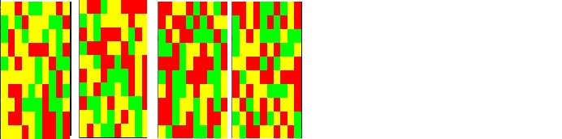

:::{.callout-tip}
Volgende opgave was de vaardigheidsproefopdracht voor het 2e zit examen van dit vak (OOP) in augustus 2019
:::

We maken een eenvoudige veiling-simulator. Hierbij kunnen spelers bieden op getoonde schilderijen en deze kopen indien ze wensen. Het spel wordt gespeeld door 2 spelers, waarbij 1 speler de gebruiker is, de andere wordt door de computer bestuurd.

# Deel 1: Klassen
## Klasse 1: schilderij (3p)

Maak een klasse ``Schilderij``.

Deze heeft 2 minstens methoden
* TekenSchilderij: de methode zal een willekeurig schilderij op het scherm tekenen in linkerbovenhoek. Een schilderij is steeds 10 bij 10 groot en bestaat uit een willekeurige hoeveelheid gele, rode en groene vlakken. Enkele voorbeelden:
          
* Opgelet: ieder object tekent een ander schilderij. Als op hetzelfde object 2x na mekaar TekenSchilderij wordt aangeroepen dan zal uiteraard 2x hetzelfde schilderij getekend worden.
De klasse houdt intern bij uit hoeveel rode, hoeveel gele, en hoeveel rode vlakken het schilderij bestaat.

* ``KrijgData``: deze methode geeft terug uit hoeveel rode vlakken de schilderij bestond.

## Klasse  2: WaardeBepaler (2p)
Maak een klasse ``WaardeBepaler``. Deze bestaat uit 1 static methode genaamd ``BerekenWaarde``. Deze methode aanvaardt 1 int als parameter. Het geeft een double terug als resultaat.

De methode zal de waarde van het schilderij bepalen gebaseerd op het aantal rode vlakken. De waarde van een schilderij is het aantal rode vlakken maal 1000 en daar vervolgens de vierkantswortel van.

Een schilderij met 50 rode vlakken heeft dus een waarde van  €223,6   (vierkantswortel van 1000*50)


Dit getal tot 1 cijfer na de komma wordt door de methode teruggegeven.

## Klasse 3: Koper (4p)
Een koper heeft bij de start steeds een budget van 1500 euro. 

Het budget kan enkel als readonly property van buitenaf uitgelezen worden. De setter is private.

Een koper heeft een lijst  van schilderijen (leeg bij de start) waarin ieder gekocht schilderij komt.

Een koper heeft een constructor die een interne waarde ogenblikkelijk op 1500 zet
* Een methode “Koop”: deze methode aanvaardt 1 parameter van het type schilderij en geeft een bool terug.
  * Eerst wordt de waarde van het meegegeven schilderij berekend mbv van de WaardeBepaler klasse. 
  * Vervolgens: Indien de koper genoeg budget heeft dan zal de waarde van het schilderij van het budget gehaald worden (via de private setter) en wordt het schilderij aan de lijst van gekochte schilderijen van de koper toegevoegd.
     * Vervolgens geeft de methode ‘true’ terug.
  * Indien de koper niet genoeg budget heeft wordt false teruggeven.


Een koper heeft een methode ``TotaleWinst``: deze methode geeft de totale waarde van alle schilderijen samen in zijn lijst  terug als een int.

# Deel 2: Veiling (4p)

Schrijf een programma dat voorgaande klasse gebruikt als volgt:
* 1 speler-object wordt door de gebruiker bedient. 1 door de computer.
* Er verschijnt telkens een schilderij, met daaronder de waarde ervan.
* Er wordt aan de gebruiker gevraagd of hij/zij dit wenst te kopen. Indien ja, en dit kan, dan wordt het schilderij aan zijn lijst toegevoegd en z’n budget verlaagt.
* Indien neen dan zal de computer het schilderij kopen indien deze nog genoeg budget heeft.
* Vervolgens komt het volgende schilderij.
* Het ‘spel’ stopt wanneer beide speler het huidige schilderij niet kunnen of willen kopen.
* De “TotaleWinst” van iedere speler wordt vergeleken. De speler wiens TotaleWinst + overgebleven Budget het hoogst is wint.
  * Voorbeeld: speler 1 heeft TotaleWinst 300 en Budget over 300, dus 600
  * Speler 2  (de computer) heeft TotaleWinst 400 en Budget 100, dus 500. Speler 1, de gebruiker, wint de veiling
* Het spel toont wie heeft gewonnen en sluit dan af.

# Deel 3: Picassos (2p)

* Maak een klasse Picasso. Deze klasse is een Schilderij, maar bestaat uit een 15 bij 15 groot schilderij (in plaats van 10 bij 10) en zal dus meestal meer waard zijn.

* Zorg ervoor dat er op de veiling ongeveer 30% van de tijd een Picasso verschijnt die de spelers kunnen kopen. De overige werking blijft dezelfde.

# Deel 4: Koper++ (4p)

* De klasse Koper heeft een extra methode “SorteerBezit”. Wanneer deze wordt aangeroepen dan worden de schilderijen in zijn bezit gesorteerd op basis van hun waarde. De hoogste waarde komt vooraan en zo verder.


* De klasse Koper heeft een extra methode “KrijgSchilderij”: deze methode aanvaardt 1 parameter van het type Koper. Wanneer de methode wordt aangeroepen op een koper en een andere koper wordt als parameter meegegeven, dan krijgt de koper die de methode aanroept het eerste schilderij uit de lijst van de meegegeven koper. Het schilderij verdwijnt vervolgens uit de lijst van deze koper.


* Voeg aan achteraan het spel code toe die aantoont dat deze twee methoden werken.


::::{.callout-caution collapse="true" title="Oplossing"}
> Dank aan Wael Orraby.

Klassen:
```java
enum Kleuren {Rood=1, Geel, Groen };
internal class Schilderij: IComparable
{
    public static Random r = new Random();
    protected int aantalRodeVlakken=0;


    protected Kleuren[,] vlakkenArray = new Kleuren[10, 10];
    public Schilderij(int x, int y)
    {
        vlakkenArray = new Kleuren[x, y];
        for (int i = 0; i < vlakkenArray.GetLength(0); i++)
        {
            for (int j = 0; j < vlakkenArray.GetLength(1); j++)
            {
                vlakkenArray[i, j] = (Kleuren)r.Next(1, 4);
                if (vlakkenArray[i, j] == Kleuren.Rood)
                    aantalRodeVlakken++;
            }
        }
    }
    public Schilderij(): this(10,10)
    {
        
    }
    public virtual void TekenSchilderij()
    {
        
        for (int i = 0; i < vlakkenArray.GetLength(0); i++)
        {
            for (int j = 0; j < vlakkenArray.GetLength(1); j++)
            {
                if (vlakkenArray[i, j] == Kleuren.Rood)
                {
                    Console.BackgroundColor = ConsoleColor.Red;     
                }
                else if (vlakkenArray[i, j] == Kleuren.Geel)
                {
                    Console.BackgroundColor = ConsoleColor.Yellow;
                }
                else
                {
                    Console.BackgroundColor = ConsoleColor.Green;
                }
                Console.Write(" ");
                Console.ResetColor();
            }
            Console.WriteLine();
        }
    }
    public int KrijgData()
    {
        return aantalRodeVlakken;
    }

    public int CompareTo(object? obj)
    {
        double thisWaarde = WaardeBepaler.BerekenWaarde(this.KrijgData());
        double thatWaarde = WaardeBepaler.BerekenWaarde((obj as Schilderij).KrijgData());
        return thatWaarde.CompareTo(thisWaarde);
    }
}

internal class Picasso : Schilderij
{
    public Picasso():base(15,15)
    {
        
    }   
}

internal class WaardeBepaler
{
    public static double BerekenWaarde(int​ aantalRodeVlakken)
    {
        return Math.Round(Math.Sqrt(1000 * aantalRodeVlakken), 1);
    }
}

internal class Koper
{
    private List<Schilderij> schilderijenList = null;
    public Koper()
    {
        Budget = 1500;
        schilderijenList = new List<Schilderij>();
    }
    private double budget;

    public double Budget
    {
        get { return budget; }
        private set { budget = value; }
    }


    public bool Koop(Schilderij schilderij)
    {
        double schilderijWaarde = WaardeBepaler.BerekenWaarde(schilderij.KrijgData());
        if (Budget >= schilderijWaarde)
        {
            Budget -= schilderijWaarde;
            schilderijenList.Add(schilderij);
            return true;
        }
        return false;
    }
    public int TotaleWinst()
    {
        int totaleWinst = 0;
        foreach (var item in schilderijenList)
        {
            totaleWinst += (int)WaardeBepaler.BerekenWaarde(item.KrijgData());
        }
        return totaleWinst;
    }
    public List<Schilderij> SorteerBezit()
    {
        schilderijenList.Sort();

        return schilderijenList;
    }
    public void KrijgSchilderij(Koper other)
    {
        if (other.schilderijenList.Count > 0)
        {
            this.schilderijenList.Add(other.schilderijenList[0]);
            other.schilderijenList.RemoveAt(0);
        }
    }
}
```

Program.cs


```java
static void Main(string[] args)
{

    Koper speler = new Koper();
    Koper computer = new Koper();
    bool kunnenOfWillenKopen = true;
    int PicassosKans;
    Random r = new Random();
    while (kunnenOfWillenKopen)
    {
        kunnenOfWillenKopen = true;
        Schilderij bieding = new Schilderij();
        PicassosKans = r.Next(1, 11);
        if (PicassosKans <= 3)
        {
            bieding = new Picasso();
        }

        bieding.TekenSchilderij();
        Console.WriteLine($"SchilderijWaarde : {WaardeBepaler.BerekenWaarde(bieding.KrijgData())}");
        Console.WriteLine("Wenst u die schilderij te kopen ? (j/n)");
        string koperAntw = Console.ReadLine().ToLower();
        if (koperAntw == "j")
        {
            if (speler.Koop(bieding))
                Console.WriteLine("Schilderij gekocht!");
            else
            {
                Console.WriteLine("Budget van speler is niet genoeg!");
                kunnenOfWillenKopen = false;
            }
        }
        else if (computer.Koop(bieding))
            Console.WriteLine("Schilderij verkocht!");
        else
        {
            Console.WriteLine("Budget van computer is niet genoeg!");
            kunnenOfWillenKopen = false;
        }
    }


    if (speler.TotaleWinst() + speler.Budget > computer.TotaleWinst() + computer.Budget)
        Console.WriteLine($"Je bent gewonnen!");
    else
        Console.WriteLine("De computer is gewonnen");
    Console.WriteLine("Uw schilderijen na het sorteren:\n");

    foreach (var item in speler.SorteerBezit())
    {
        item.TekenSchilderij();
        Console.WriteLine("");
    }
    speler.KrijgSchilderij(computer);
    Console.WriteLine("Uw schilderijen na het krijgen van een schilderij:\n");
    foreach (var item in speler.SorteerBezit())
    {
        item.TekenSchilderij();
        Console.WriteLine("");
    }
}
```
::::
